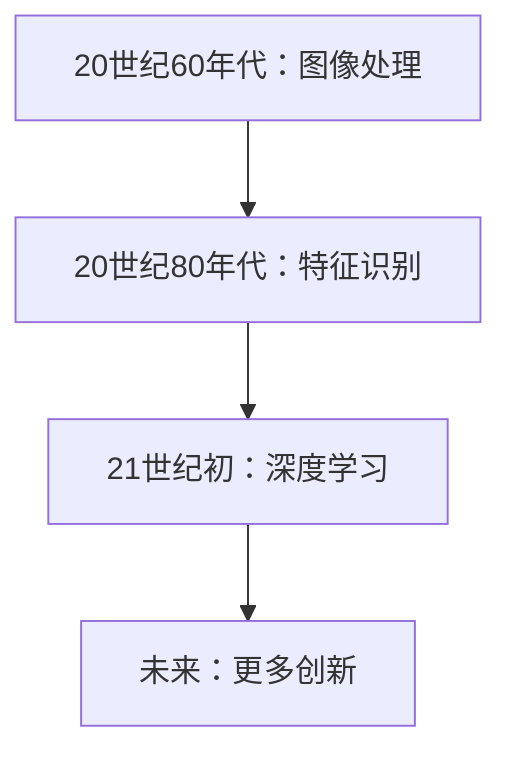
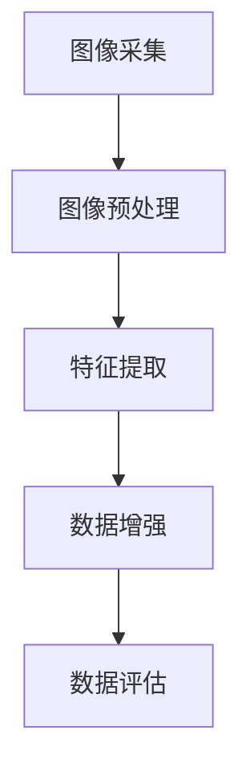

                 


## 设计思路

为了撰写一篇高质量、逻辑清晰、具有深度和技术见解的IT领域技术博客文章，我们需要遵循以下设计思路：

### 1. 确定文章的核心主题和目标

首先，我们需要明确文章的核心主题是“企业级计算机视觉平台：深度分析图像数据”。目标受众包括计算机视觉研究者、工程师以及企业级技术团队。这一核心主题将引导我们的文章内容，确保文章聚焦于企业级计算机视觉平台的设计与实现。

### 2. 文章结构设计

为了确保文章的逻辑性和易于理解，我们将文章分为以下几个部分：

- **引言与背景**：介绍计算机视觉的发展背景和企业级应用的现状。
- **核心技术与原理**：详细讲解计算机视觉的基本算法和数学模型。
- **平台构建与优化**：介绍企业级计算机视觉平台的构建方法和优化技巧。
- **应用案例与实战**：提供具体的实践案例和实现细节。
- **总结与展望**：对文章内容进行总结，并对未来技术发展趋势进行展望。

### 3. 文章内容细化

在每个部分中，我们将进一步细化内容，确保文章的完整性。例如：

- **引言与背景**：介绍计算机视觉技术的发展历程、应用领域以及企业级计算机视觉平台的现状。
- **核心技术与原理**：详细讲解计算机视觉的基础算法，如卷积神经网络（CNN）、图像分割、目标检测等，并结合Python源代码进行说明。
- **平台构建与优化**：介绍企业级计算机视觉平台的架构设计、数据处理与存储策略，以及系统集成与部署方法。
- **应用案例与实战**：提供实际应用案例，包括生产监控、质量控制、安全监控等，详细讲解开发环境搭建、源代码实现和代码解读。
- **总结与展望**：总结文章内容，讨论未来技术发展趋势，为读者提供有价值的建议。

### 4. 符合要求的内容编写

在编写文章的过程中，我们需要确保以下要求：

- **格式要求**：文章使用markdown格式，确保内容的可读性和一致性。
- **完整性要求**：每个小节的内容都要丰富、具体、详细，核心内容必须包含背景介绍、核心概念与联系、核心算法原理讲解、数学公式、项目实战、最佳实践 tips、小结、注意事项、拓展阅读等内容。
- **作者信息**：文章末尾需要写上作者信息，包括机构名称和书名。

### 5. 撰写流程

在撰写文章的过程中，我们将遵循以下流程：

1. **规划结构**：首先规划文章的整体结构，确保各部分内容之间逻辑清晰、层次分明。
2. **撰写内容**：根据规划的结构，逐步撰写各部分内容，确保每个部分都包含必要的知识点和实际案例。
3. **审查与修改**：撰写完成后，对文章进行审查和修改，确保内容准确、逻辑清晰、表达流畅。
4. **添加格式**：将文章内容按照markdown格式进行排版，确保文章的可读性。
5. **最终审查**：对文章进行最终审查，确保所有要求都已满足。

通过以上设计思路和撰写流程，我们将确保文章质量，为读者提供一篇具有深度和技术见解的IT领域技术博客文章。接下来，我们将根据这一设计思路，逐步撰写文章内容。 

## 第1章：企业级计算机视觉概述

### 1.1 计算机视觉技术背景

计算机视觉是人工智能的一个重要分支，它旨在使计算机具备人类视觉系统的功能，能够从图像或视频中提取有用的信息。计算机视觉技术的发展历程可以追溯到20世纪60年代，随着计算机硬件性能的提升和算法的创新，计算机视觉逐渐成为人工智能领域的一个重要研究方向。

#### 核心概念

- **计算机视觉的定义**：计算机视觉是一门研究如何使计算机具备从图像或视频中提取信息、理解场景的学科。
- **计算机视觉的发展历程**：从最初的图像处理，到基于特征的识别，再到现代的深度学习算法，计算机视觉经历了多次技术革新。
- **计算机视觉的研究领域**：包括图像处理、模式识别、机器学习、深度学习等。

#### Mermaid流程图

为了更直观地展示计算机视觉的发展历程，我们可以使用Mermaid流程图来描述：



#### 联系与架构

计算机视觉与人工智能密切相关，它是实现人工智能的一种重要方式。在企业级应用中，计算机视觉技术可以用于生产监控、质量控制、安全监控等多个领域，具有很高的实用价值。

### 1.2 企业级计算机视觉的应用场景

企业级计算机视觉平台在企业中的应用场景非常广泛，以下是一些典型的应用场景：

- **自动化生产**：通过计算机视觉技术，可以对生产线上的产品进行实时监控，实现自动化生产。
- **质量控制**：计算机视觉可以帮助企业实时检测产品质量，提高生产效率。
- **安全监控**：在公共安全领域，计算机视觉技术可以用于监控人员行为，预防犯罪行为。
- **智能交通**：通过计算机视觉技术，可以对交通状况进行实时监控，提高交通管理效率。

#### 伪代码示例

以下是一个简单的伪代码示例，用于描述计算机视觉在企业级应用中的基本流程：

```python
# 企业级计算机视觉应用场景
def enterprise_computer_vision():
    # 自动化生产
    production_monitoring()
    
    # 质量控制
    quality_control()
    
    # 安全监控
    security_monitoring()
    
    # 智能交通
    intelligent_traffic()
```

#### 联系与架构

在企业级计算机视觉平台中，这些应用场景通常需要集成多种计算机视觉技术，如图像处理、目标检测、图像分割等。这些技术的协同工作，可以实现对复杂场景的全面分析和理解。

### 总结

本章介绍了企业级计算机视觉技术的背景和应用场景。接下来，我们将进一步探讨计算机视觉的核心技术，包括图像处理、特征提取、深度学习等，以及这些技术在企业级应用中的具体实现和优化策略。 

### 1.3 图像数据的重要性

在计算机视觉中，图像数据的重要性不言而喻。图像数据是计算机视觉系统分析和理解世界的基础，其质量直接影响着系统的性能和效果。本节将深入探讨图像数据的重要性、来源、处理流程以及数据质量评估方法。

#### 核心概念

- **图像数据的重要性**：图像数据是计算机视觉系统的重要输入，高质量图像数据可以提升模型训练效果和实际应用性能。
- **图像数据的来源**：包括静态图像和视频流，来源于摄像头、传感器、医疗设备等多种设备。
- **图像数据处理流程**：包括图像采集、预处理、特征提取、数据增强等步骤。
- **数据质量评估方法**：用于评估图像数据的质量，包括噪声水平、清晰度、标注准确性等指标。

#### Mermaid流程图

为了更好地理解图像数据处理流程，我们可以使用Mermaid流程图进行描述：



#### 核心算法原理讲解

- **图像预处理**：图像预处理是图像数据处理的初始阶段，主要目的是去除图像中的噪声、调整图像亮度、对比度等，以提高图像质量。常用的预处理方法包括图像滤波、直方图均衡化、图像缩放等。

  ```python
  import cv2
  import numpy as np
  
  # 图像滤波
  image = cv2.imread('image.jpg')
  blurred = cv2.GaussianBlur(image, (5, 5), 0)
  
  # 直方图均衡化
  image_gray = cv2.cvtColor(image, cv2.COLOR_BGR2GRAY)
  image_eq = cv2.equalizeHist(image_gray)
  
  # 图像缩放
  image_scaled = cv2.resize(image, (new_width, new_height), interpolation=cv2.INTER_CUBIC)
  ```

- **特征提取**：特征提取是计算机视觉中的重要环节，用于从图像中提取具有区分度的特征，为后续的模型训练和识别提供支持。常用的特征提取方法包括HOG（Histogram of Oriented Gradients）、SIFT（Scale-Invariant Feature Transform）、SURF（Speeded Up Robust Features）等。

  ```python
  import cv2
  
  # 使用HOG特征提取
  hog = cv2.HOGDescriptor()
  features = hog.compute(image)
  
  # 使用SIFT特征提取
  sift = cv2.xfeatures2d.SIFT_create()
  keypoints, descriptors = sift.detectAndCompute(image, None)
  ```

- **数据增强**：数据增强是一种有效提高模型泛化能力的方法，通过对图像进行变换，增加数据的多样性和丰富度。常用的数据增强方法包括旋转、翻转、缩放、裁剪等。

  ```python
  import cv2
  import numpy as np
  
  # 旋转
  angle = 30
  M = cv2.getRotationMatrix2D((image.shape[1]//2, image.shape[0]//2), angle, 1)
  rotated = cv2.warpAffine(image, M, (image.shape[1], image.shape[0]))
  
  # 翻转
  flipped = cv2.flip(image, 1) # 翻转垂直方向
  
  # 缩放
  scale_factor = 0.5
  resized = cv2.resize(image, (int(image.shape[1]*scale_factor), int(image.shape[0]*scale_factor)))
  
  # 裁剪
  crop = image[:200, :300]
  ```

#### 数学公式

- **图像滤波**：
  $$G(x, y) = \sum_{i=0}^{n} \sum_{j=0}^{n} h(i, j) \cdot I(x-i, y-j)$$

  其中，$G(x, y)$为滤波后的图像，$h(i, j)$为滤波器，$I(x-i, y-j)$为原始图像。

- **直方图均衡化**：
  $$f_k = \frac{1}{Z} \sum_{i=0}^{L-1} r_i \cdot p_i$$

  其中，$f_k$为均衡化后的灰度值，$Z$为归一化常数，$r_i$为原始直方图，$p_i$为累积直方图。

#### 项目实战

以一个简单的图像预处理和数据增强项目为例，展示开发环境搭建、源代码实现和代码解读。

#### 开发环境搭建

- 安装Python 3.x版本
- 安装OpenCV库

```shell
pip install opencv-python
```

#### 源代码实现

```python
import cv2
import numpy as np

def image_preprocessing(image_path):
    # 读取图像
    image = cv2.imread(image_path)
    
    # 图像滤波
    blurred = cv2.GaussianBlur(image, (5, 5), 0)
    
    # 直方图均衡化
    image_gray = cv2.cvtColor(blurred, cv2.COLOR_BGR2GRAY)
    image_eq = cv2.equalizeHist(image_gray)
    
    # 数据增强
    angle = 30
    M = cv2.getRotationMatrix2D((image.shape[1]//2, image.shape[0]//2), angle, 1)
    rotated = cv2.warpAffine(image_eq, M, (image.shape[1], image.shape[0]))
    
    # 翻转
    flipped = cv2.flip(rotated, 1)
    
    # 缩放
    scale_factor = 0.5
    resized = cv2.resize(flipped, (int(image.shape[1]*scale_factor), int(image.shape[0]*scale_factor)))
    
    return resized

if __name__ == '__main__':
    image_path = 'image.jpg'
    processed_image = image_preprocessing(image_path)
    cv2.imshow('Processed Image', processed_image)
    cv2.waitKey(0)
    cv2.destroyAllWindows()
```

#### 代码解读与分析

- **图像读取**：使用`cv2.imread`函数读取图像。
- **图像滤波**：使用高斯滤波器去除图像噪声。
- **直方图均衡化**：将灰度图像进行直方图均衡化，提高图像对比度。
- **数据增强**：通过旋转、翻转、缩放等操作，增加图像数据的多样性。

#### 实际案例分析和详细讲解剖析

假设我们有一个包含1000张图像的数据集，其中每张图像都对应一个标签。我们对这些图像进行预处理和数据增强，以提高模型训练效果。具体步骤如下：

1. **图像预处理**：对每张图像进行图像滤波和直方图均衡化。
2. **数据增强**：对预处理后的图像进行旋转、翻转、缩放等数据增强操作。
3. **保存增强后的图像**：将增强后的图像保存到新的数据集中，用于模型训练。

```python
import os
import cv2
import numpy as np

def preprocess_and_enhance_images(image_dir, output_dir):
    images = os.listdir(image_dir)
    for image_name in images:
        image_path = os.path.join(image_dir, image_name)
        image = cv2.imread(image_path)
        
        # 图像预处理
        blurred = cv2.GaussianBlur(image, (5, 5), 0)
        image_gray = cv2.cvtColor(blurred, cv2.COLOR_BGR2GRAY)
        image_eq = cv2.equalizeHist(image_gray)
        
        # 数据增强
        angle = 30
        M = cv2.getRotationMatrix2D((image.shape[1]//2, image.shape[0]//2), angle, 1)
        rotated = cv2.warpAffine(image_eq, M, (image.shape[1], image.shape[0]))
        
        flipped = cv2.flip(rotated, 1)
        scale_factor = 0.5
        resized = cv2.resize(flipped, (int(image.shape[1]*scale_factor), int(image.shape[0]*scale_factor)))
        
        # 保存增强后的图像
        output_path = os.path.join(output_dir, image_name)
        cv2.imwrite(output_path, resized)

if __name__ == '__main__':
    image_dir = 'original_images'
    output_dir = 'enhanced_images'
    preprocess_and_enhance_images(image_dir, output_dir)
```

#### 项目小结

通过本项目的实战案例，我们了解了图像数据预处理和数据增强的重要性，以及如何使用Python和OpenCV库进行图像处理和增强。在实际项目中，这些技术可以帮助我们提高模型训练效果，增强模型的泛化能力。

#### 最佳实践 tips

- **图像预处理**：在处理图像数据时，应根据具体应用场景选择合适的预处理方法，如高斯滤波、直方图均衡化等。
- **数据增强**：数据增强时，应考虑增加图像数据的多样性和丰富度，如旋转、翻转、缩放等操作。
- **数据质量评估**：在图像数据预处理和增强过程中，定期对数据质量进行评估，确保数据质量符合模型训练要求。

#### 小结

图像数据在计算机视觉中至关重要，其质量直接影响模型的性能。通过本章的介绍，我们了解了图像数据的重要性、来源、处理流程以及数据质量评估方法。在下一章中，我们将进一步探讨计算机视觉的核心技术，包括图像处理、特征提取、深度学习等。 

