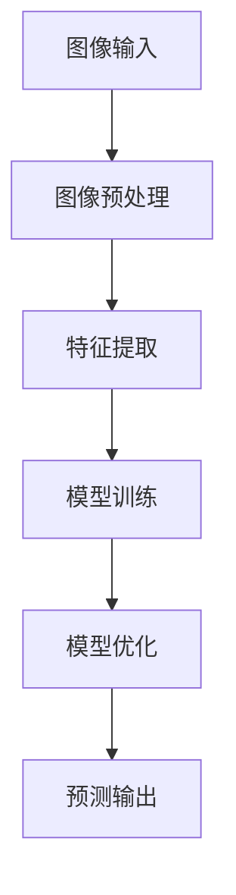
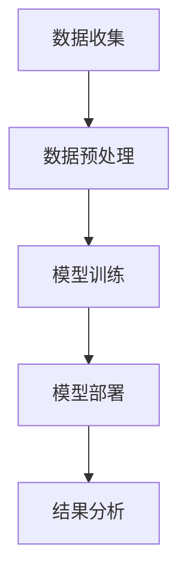

                 

### 文章标题

# 企业级计算机视觉应用：深化图像识别能力

### 关键词

- 计算机视觉
- 图像识别
- 深度学习
- 企业级应用
- 人工智能

### 摘要

本文将深入探讨企业级计算机视觉应用，特别是图像识别能力的深化。从计算机视觉的基本概念和架构入手，逐步介绍图像识别算法的原理，特别是深度学习的应用。接着，文章将阐述如何设计企业级图像识别系统，并分析在实际应用中的案例。最后，文章将展望未来趋势，提出面临的挑战和最佳实践建议。

## 目录大纲设计思路

设计《企业级计算机视觉应用：深化图像识别能力》的目录大纲时，需要考虑以下几个关键点：

1. **全书结构**：明确全书分为几部分，每一部分涵盖哪些核心内容。
2. **内容细化**：每个部分细化为多个章节，确保内容覆盖全面且逻辑清晰。
3. **核心概念与联系**：用Mermaid流程图展示核心概念和原理之间的联系，便于读者理解。
4. **算法原理讲解**：使用伪代码详细阐述核心算法原理，帮助读者深入理解。
5. **数学模型与公式**：使用latex格式嵌入数学模型和公式，并进行详细讲解和举例说明。
6. **项目实战**：提供实际代码案例，包括开发环境搭建、源代码实现、代码解读与分析。
7. **简洁与完整性**：确保目录大纲简洁、逻辑清晰，同时内容完整。

## 第一部分：计算机视觉基础

### 1.1 计算机视觉概述

#### 1.1.1 计算机视觉的定义与发展

计算机视觉是指使计算机具备从图像或视频中提取、分析、理解和解释信息的能力。它起源于20世纪60年代，随着计算机性能的提升和算法的发展，逐渐成为人工智能领域的重要组成部分。

#### 1.1.2 计算机视觉的应用领域

计算机视觉在多个领域都有广泛应用，如安防监控、医疗影像分析、自动驾驶、工业自动化等。这些应用不仅提高了效率，还大大提升了安全性。

### 1.2 计算机视觉的架构

#### 1.2.1 图像处理与特征提取

图像处理是计算机视觉的基础，包括图像增强、滤波、边缘检测等。特征提取则是从图像中提取出对目标识别有用的信息，如边缘、纹理、形状等。

#### 1.2.2 模型训练与优化

在计算机视觉中，模型训练是关键步骤。通过大量标注的数据集，模型可以从中学到识别目标的方法。优化则是通过调整模型参数，提高其性能和准确度。

#### 1.2.3 Mermaid流程图：计算机视觉架构



### 1.3 图像识别算法原理

#### 1.3.1 传统的图像识别算法

传统的图像识别算法主要包括基于几何和特征的算法，如HOG（Histogram of Oriented Gradients）和SIFT（Scale-Invariant Feature Transform）等。

#### 1.3.2 深度学习在图像识别中的应用

随着深度学习的发展，卷积神经网络（CNN）成为图像识别的重要工具。它通过多层卷积和池化操作，自动提取特征，从而实现高效的目标识别。

#### 1.3.3 伪代码：卷积神经网络（CNN）算法原理

```python
# 输入图像
input_image = ...

# 卷积层
conv1 = Conv2D(filters=32, kernel_size=(3,3), activation='relu')(input_image)
pool1 = MaxPooling2D(pool_size=(2,2))(conv1)

# 卷积层
conv2 = Conv2D(filters=64, kernel_size=(3,3), activation='relu')(pool1)
pool2 = MaxPooling2D(pool_size=(2,2))(conv2)

# 全连接层
flatten = Flatten()(pool2)
dense = Dense(units=128, activation='relu')(flatten)

# 输出层
output = Dense(units=10, activation='softmax')(dense)

# 模型编译
model = Model(inputs=input_image, outputs=output)
model.compile(optimizer='adam', loss='categorical_crossentropy', metrics=['accuracy'])

# 模型训练
model.fit(x_train, y_train, epochs=10, batch_size=32, validation_data=(x_val, y_val))
```

## 第二部分：深度学习与图像识别

### 2.1 深度学习基础

#### 2.1.1 深度学习的概念与发展

深度学习是一种基于多层神经网络的学习方法，通过逐层提取特征，实现复杂模式的识别。它起源于20世纪80年代，但在21世纪初随着计算能力的提升和数据量的增加，得到快速发展。

#### 2.1.2 神经网络的基本结构

神经网络包括输入层、隐藏层和输出层。输入层接收外部输入，隐藏层通过加权求和和激活函数进行特征提取，输出层产生最终预测。

#### 2.1.3 优化算法：梯度下降与随机梯度下降

优化算法用于调整模型参数，提高模型性能。梯度下降是一种基于梯度信息的优化方法，而随机梯度下降则是其变种，通过随机采样数据进行优化。

### 2.2 卷积神经网络（CNN）

#### 2.2.1 CNN的架构与原理

卷积神经网络包括卷积层、池化层和全连接层。卷积层通过局部感知野和卷积核提取特征，池化层用于减小特征图尺寸，全连接层用于分类或回归。

#### 2.2.2 卷积与池化操作

卷积操作通过卷积核在特征图上滑动，计算局部加权和激活函数。池化操作则通过取样操作，减小特征图尺寸，增强模型鲁棒性。

#### 2.2.3 伪代码：CNN算法原理

```python
# 输入图像
input_image = ...

# 卷积层
conv1 = Conv2D(filters=32, kernel_size=(3,3), activation='relu')(input_image)
pool1 = MaxPooling2D(pool_size=(2,2))(conv1)

# 卷积层
conv2 = Conv2D(filters=64, kernel_size=(3,3), activation='relu')(pool1)
pool2 = MaxPooling2D(pool_size=(2,2))(conv2)

# 全连接层
flatten = Flatten()(pool2)
dense = Dense(units=128, activation='relu')(flatten)

# 输出层
output = Dense(units=10, activation='softmax')(dense)

# 模型编译
model = Model(inputs=input_image, outputs=output)
model.compile(optimizer='adam', loss='categorical_crossentropy', metrics=['accuracy'])

# 模型训练
model.fit(x_train, y_train, epochs=10, batch_size=32, validation_data=(x_val, y_val))
```

### 2.3 图像识别中的深度学习模型

#### 2.3.1 主流深度学习框架对比

主流的深度学习框架包括TensorFlow、PyTorch和Keras等。它们各有优缺点，适用于不同场景。

#### 2.3.2 图像分类模型：VGG、ResNet等

VGG和ResNet是经典的图像分类模型。VGG通过多层卷积和ReLU激活函数，实现高效的特征提取。ResNet则通过残差连接，解决了深层网络训练困难的问题。

#### 2.3.3 图像分割模型：U-Net、DeepLab等

图像分割模型用于将图像划分为不同的区域。U-Net通过反卷积和跳跃连接，实现高效的特征融合。DeepLab则通过空洞卷积和上采样，实现精细的分割。

## 第三部分：企业级图像识别应用

### 3.1 企业级图像识别系统设计

#### 3.1.1 系统需求分析

企业级图像识别系统需要考虑高准确性、实时性和可扩展性。需求分析是系统设计的首要步骤。

#### 3.1.2 系统架构设计

企业级图像识别系统通常包括数据收集、预处理、模型训练、模型部署和结果分析等模块。系统架构应支持模块化、分布式和可扩展性。

#### 3.1.3 Mermaid流程图：企业级图像识别系统架构



### 3.2 实际应用案例分析

#### 3.2.1 产品质量检测

在制造业中，图像识别技术用于检测产品质量。通过识别缺陷和异常，提高生产效率和质量。

#### 3.2.2 供应链管理

图像识别在供应链管理中用于识别和跟踪产品，提高物流效率。例如，通过图像识别技术，自动识别货物种类和数量。

#### 3.2.3 智能安防

在智能安防领域，图像识别技术用于人脸识别、行为分析和异常检测，提高安全防护能力。

#### 3.2.4 医疗影像分析

医疗影像分析是图像识别的重要应用领域。通过分析医学图像，辅助医生进行诊断和治疗。

### 3.3 开发实战

#### 3.3.1 开发环境搭建

搭建图像识别开发环境，需要安装Python、TensorFlow等库。具体步骤如下：

1. 安装Python和pip
2. 安装TensorFlow
3. 安装其他依赖库（如NumPy、Pandas等）

#### 3.3.2 数据集准备与预处理

准备用于训练和测试的数据集。预处理包括数据清洗、归一化和数据增强等步骤。

#### 3.3.3 代码实现与调试

实现图像识别模型，包括数据加载、模型定义、模型训练和模型评估等步骤。调试过程包括错误检查和性能优化。

#### 3.3.4 模型评估与优化

评估模型性能，包括准确率、召回率、F1分数等指标。优化模型，提高性能和泛化能力。

### 3.4 项目小结

本部分介绍了企业级图像识别系统设计、实际应用案例和开发实战。通过这些实践，读者可以更好地理解图像识别技术在实际应用中的价值。

## 第四部分：未来展望与挑战

### 4.1 计算机视觉技术的未来趋势

随着人工智能和深度学习的发展，计算机视觉技术将继续在多个领域深化应用。未来趋势包括跨模态学习、多模态交互和增强现实等。

### 4.2 深度学习算法的发展方向

深度学习算法将继续优化和改进。未来研究方向包括新型神经网络结构、自适应学习算法和可解释性等。

### 4.3 企业级计算机视觉应用面临的挑战

企业级计算机视觉应用面临数据隐私、模型解释性和硬件加速等挑战。解决这些挑战，需要技术创新和制度保障。

## 作者信息

作者：AI天才研究院/AI Genius Institute & 禅与计算机程序设计艺术 /Zen And The Art of Computer Programming

## 结语

本文从基础到应用，全面介绍了企业级计算机视觉应用，特别是图像识别能力的深化。通过深入讲解算法原理、实际应用案例和开发实战，读者可以更好地理解这一技术的核心和应用价值。希望本文对您的学习和实践有所帮助。

## 参考文献

1. Goodfellow, I., Bengio, Y., & Courville, A. (2016). *Deep Learning*. MIT Press.
2. Krizhevsky, A., Sutskever, I., & Hinton, G. E. (2012). *ImageNet classification with deep convolutional neural networks*. In *Advances in neural information processing systems*, pp. 1097-1105.
3. Simonyan, K., & Zisserman, A. (2014). *Very deep convolutional networks for large-scale image recognition*. In *International conference on learning representations*.
4. Ronneberger, O., Fischer, P., & Brox, T. (2015). *U-Net: Convolutional networks for biomedical image segmentation*. In *International conference on medical image computing and computer-assisted intervention*, pp. 234-241.

---

本文通过分部分、分章节的结构，全面系统地介绍了企业级计算机视觉应用。从基础概念到深度学习算法，再到实际应用案例，为读者提供了一个清晰的认知框架。文章结尾提供了参考文献，以供进一步学习。希望本文能帮助读者深化对计算机视觉应用的理解，激发更多研究和实践的热情。

