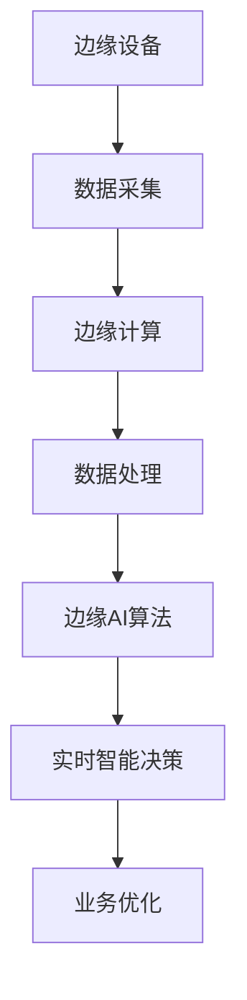

                 

### 《企业级边缘AI：实现实时智能决策》

---

**关键词：** 边缘AI、实时智能决策、边缘计算、物联网、云计算、人工智能算法

**摘要：** 本文将深入探讨企业级边缘AI的实施过程，特别是如何实现实时智能决策。通过详细分析边缘AI的核心概念、原理、算法、部署与优化，并结合实际案例，为读者提供全方位的技术解读和最佳实践指南。

---

#### 引言

随着物联网、大数据和云计算的迅猛发展，边缘计算逐渐成为新一代信息技术的重要支撑。边缘AI作为边缘计算与人工智能的深度融合，能够极大地提升实时数据处理能力，为企业决策提供强大的技术支持。

实时智能决策在当今快速变化的市场环境中具有重要地位。它能够在数据产生的地方直接进行计算和分析，实现毫秒级响应，从而支持快速决策和优化业务流程。然而，实现企业级边缘AI并满足实时智能决策的需求并非易事，涉及诸多技术挑战和实际应用问题。

本文旨在系统地阐述企业级边缘AI的实现路径，包括核心概念、原理、算法、部署与优化，以及成功案例和未来展望。通过本文的阅读，读者将全面了解边缘AI的内涵和外延，掌握其实施的关键技术和策略。

#### 第一步：定义核心概念与联系

**核心概念：**

1. **边缘AI**：在靠近数据源的地方（如物联网设备、边缘服务器）运行的AI算法，用于本地化数据处理和决策。
2. **实时智能决策**：在短时间内对数据进行分析和处理，并生成决策结果，以支持快速响应和业务优化。

**联系：**

1. **边缘计算**：边缘计算是边缘AI的基础设施，它将计算、存储和网络功能从云端下放到网络边缘。
2. **物联网**：物联网提供了丰富的数据源，是边缘AI数据输入的重要组成部分。
3. **云计算**：云计算为边缘AI提供了强大的计算资源和数据处理能力，支持大规模数据处理和分析。

**Mermaid流程图：**



#### 第二步：确定章节结构

1. **引言**：概述边缘AI和实时智能决策的背景和重要性。
2. **边缘计算与边缘AI**：详细介绍边缘计算和边缘AI的概念、架构、优势与应用场景。
3. **实时智能决策原理**：探讨实时数据处理、智能算法在边缘的计算和实时智能决策流程。
4. **边缘AI算法**：分析常见的边缘AI算法，包括算法选择与优化、伪代码讲解。
5. **边缘设备与平台**：介绍边缘设备的类型与性能、边缘AI平台的选择与配置。
6. **边缘AI部署与优化**：讨论边缘AI的部署策略、系统性能优化和能耗优化。
7. **案例分析**：分享成功案例，详细分析其实际应用和效果。
8. **未来展望**：展望边缘AI的发展趋势、技术挑战与解决方案。

---

#### 第3章 边缘计算与边缘AI

##### 3.1 边缘计算的概念与架构

**边缘计算**是指将数据处理、分析和存储等计算任务从中央数据中心转移到网络边缘，即在数据产生的地方进行计算。边缘计算架构通常包括以下三个层次：

1. **设备层**：包括各种物联网设备和传感器，用于数据的采集。
2. **边缘层**：部署在本地或近本地的服务器或设备，负责初步的数据处理和分析。
3. **云端**：提供远程计算资源和数据存储，支持大规模数据处理和深度分析。

**边缘计算的优势**：

1. **降低延迟**：数据处理在靠近数据源的地方进行，显著减少数据传输和处理的延迟。
2. **提高带宽效率**：仅将重要数据上传到云端，降低网络带宽占用。
3. **增强安全性**：部分敏感数据处理在本地，减少数据泄露的风险。

**边缘计算的应用场景**：

1. **工业自动化**：实时监控生产线，实现自动化控制和故障预测。
2. **智能交通**：实时交通监控和信号优化，提高道路通行效率。
3. **智慧城市**：环境监测、城市管理、公共安全等领域的应用。

**边缘计算面临的挑战**：

1. **计算能力限制**：边缘设备资源有限，难以处理复杂任务。
2. **功耗和散热**：边缘设备需要长期运行，功耗和散热问题需妥善解决。
3. **数据隐私和安全**：边缘设备处理的数据可能涉及隐私问题，需确保数据安全。

**解决方案**：

1. **分布式计算**：利用分布式计算框架，提高边缘设备的计算能力。
2. **能效优化**：采用低功耗硬件和节能算法，优化能效。
3. **加密与安全协议**：采用加密技术和安全协议，确保数据安全和隐私保护。

##### 3.2 边缘AI的优势与应用场景

**边缘AI**是在边缘计算环境中运行的AI算法，能够在本地实现数据分析和智能决策。其优势主要体现在以下几个方面：

1. **实时响应**：边缘AI能够实现毫秒级响应，满足实时决策需求。
2. **隐私保护**：部分敏感数据处理在边缘，减少数据传输过程中的隐私风险。
3. **资源高效利用**：边缘设备无需处理大量数据，减轻云端负载，提高整体系统效率。

**边缘AI的应用场景**：

1. **智能家居**：实时监控家居环境，实现智能控制和安全防护。
2. **医疗健康**：远程健康监测和诊断，提供个性化医疗服务。
3. **零售业**：智能货架和智能收银系统，提升购物体验和运营效率。

**边缘AI面临的挑战**：

1. **算法复杂度**：边缘设备资源有限，难以支持复杂算法。
2. **数据稀缺**：边缘设备收集的数据量有限，可能影响算法性能。
3. **异构性**：不同设备和平台的异构性增加了开发和部署的难度。

**解决方案**：

1. **轻量级算法**：采用轻量级算法，降低计算复杂度。
2. **数据增强**：通过数据采集、标注和生成技术，增加训练数据量。
3. **平台兼容性**：采用通用框架和中间件，提高平台兼容性。

##### 3.3 边缘AI的挑战与解决方案

**边缘AI在部署和应用过程中面临一系列挑战，主要包括：**

1. **计算能力限制**：边缘设备通常资源有限，难以支持复杂算法和大规模数据处理。解决方案包括：
    - **分布式计算**：利用边缘设备之间的协同计算能力，实现资源共享和任务分发。
    - **云计算协同**：将部分计算任务转移到云端，利用云端强大的计算资源。

2. **功耗和散热**：边缘设备需要长时间运行，功耗和散热问题至关重要。解决方案包括：
    - **能效优化**：采用低功耗硬件和节能算法，降低能耗。
    - **散热设计**：优化设备散热设计，确保设备稳定运行。

3. **数据隐私和安全**：边缘设备处理的数据可能涉及隐私和敏感信息，需确保数据安全。解决方案包括：
    - **加密技术**：采用数据加密技术，保障数据传输和存储的安全性。
    - **安全协议**：采用安全协议，确保通信和数据交互的安全。

4. **算法复杂度**：边缘设备资源有限，复杂算法可能导致性能下降。解决方案包括：
    - **轻量级算法**：选择适合边缘设备的轻量级算法，降低计算复杂度。
    - **算法优化**：通过模型压缩、量化等技术，优化算法性能。

5. **数据稀缺**：边缘设备收集的数据量有限，可能影响算法性能。解决方案包括：
    - **数据增强**：通过数据采集、标注和生成技术，增加训练数据量。
    - **迁移学习**：利用预训练模型，迁移至边缘设备进行微调。

6. **异构性**：不同设备和平台的异构性增加了开发和部署的难度。解决方案包括：
    - **通用框架**：采用通用框架和中间件，提高平台兼容性。
    - **容器化**：采用容器化技术，实现应用程序的跨平台部署。

通过上述解决方案，边缘AI能够在各种应用场景中发挥重要作用，支持实时智能决策，提升企业运营效率和竞争力。

#### 第4章 实时智能决策原理

##### 4.1 实时数据处理与处理延迟

实时数据处理是边缘AI实现实时智能决策的基础。在实时数据处理中，延迟是一个关键因素。延迟包括以下三个方面：

1. **传输延迟**：数据从产生地传输到边缘设备或云端的时间。
2. **计算延迟**：在边缘设备或云端对数据进行处理和分析的时间。
3. **响应延迟**：从数据接收和处理完毕，到生成响应的时间。

降低延迟的关键在于优化传输路径和计算效率。边缘计算通过将数据处理任务从云端下放至网络边缘，显著减少了传输延迟。同时，采用高效算法和优化计算资源，能够降低计算延迟。

**优化策略**：

1. **数据压缩**：采用数据压缩技术，减少传输数据量，降低传输延迟。
2. **计算并行化**：利用多核处理器和分布式计算，提高计算效率，减少计算延迟。
3. **缓存与预加载**：通过缓存策略和预加载技术，减少重复计算，降低响应延迟。

##### 4.2 智能算法在边缘的计算

边缘AI的核心在于智能算法在边缘设备的计算。智能算法包括机器学习算法、深度学习算法等，这些算法在边缘设备上运行需要满足实时性和资源高效利用的要求。

**边缘计算智能算法的特点**：

1. **轻量化**：针对边缘设备资源有限，选择轻量级算法，降低计算复杂度。
2. **高效性**：采用优化算法和数据结构，提高计算效率和资源利用率。
3. **灵活性**：支持在线学习和实时调整，适应动态变化的应用场景。

**边缘计算智能算法的应用**：

1. **图像识别**：在边缘设备上实时处理视频流，实现人脸识别、物体检测等功能。
2. **语音识别**：在边缘设备上实时处理语音信号，实现语音转文本、语音识别等功能。
3. **预测分析**：在边缘设备上实时分析传感器数据，实现预测和决策支持。

**边缘计算智能算法的挑战**：

1. **计算资源限制**：边缘设备计算资源有限，需选择适合的算法和模型。
2. **数据稀缺**：边缘设备数据量有限，需通过数据增强和迁移学习等方法提高算法性能。
3. **实时性要求**：满足实时决策需求，需优化算法和计算流程。

##### 4.3 实时智能决策流程

实时智能决策流程包括数据采集、数据处理、模型推理和决策输出四个主要阶段。以下是对每个阶段的详细描述：

1. **数据采集**：从各种传感器和设备收集数据，包括图像、音频、文本等。
    - **采集方式**：采用无线传输、有线传输等方式，确保数据及时传输到边缘设备。
    - **数据质量**：采用去噪、增强等技术，提高数据质量。

2. **数据处理**：对采集到的数据进行预处理，包括数据清洗、特征提取等。
    - **数据清洗**：去除噪声数据和异常值，确保数据准确性。
    - **特征提取**：提取关键特征，为后续模型推理提供输入。

3. **模型推理**：在边缘设备上运行预训练的机器学习模型，进行实时推理。
    - **模型选择**：根据应用场景和数据处理需求，选择合适的模型。
    - **模型优化**：采用量化、剪枝等技术，优化模型参数，提高推理速度。

4. **决策输出**：根据模型推理结果，生成决策输出，实现实时响应。
    - **决策逻辑**：根据业务需求和场景特点，设计决策逻辑。
    - **实时响应**：确保决策输出能够及时传递给执行系统，实现实时控制。

**实时智能决策流程的优化策略**：

1. **分布式计算**：利用边缘设备之间的协同计算能力，提高数据处理和推理速度。
2. **缓存与预加载**：通过缓存和预加载技术，减少重复计算和传输，降低延迟。
3. **模型压缩**：采用模型压缩技术，降低模型大小和计算复杂度。

通过优化实时智能决策流程，可以显著提高系统响应速度和准确性，为企业提供高效的决策支持。

#### 第5章 边缘AI算法

##### 5.1 常见的边缘AI算法

边缘AI算法涵盖了多种机器学习和深度学习技术，根据应用场景的不同，可以选择适合的算法。以下是几种常见的边缘AI算法：

1. **神经网络**：神经网络（如多层感知机、卷积神经网络）是边缘AI中常用的算法。它们能够在边缘设备上实现图像识别、语音识别等功能。
    - **示例代码**（Python）：
    ```python
    import tensorflow as tf
    model = tf.keras.Sequential([
        tf.keras.layers.Flatten(input_shape=(28, 28)),
        tf.keras.layers.Dense(128, activation='relu'),
        tf.keras.layers.Dense(10, activation='softmax')
    ])
    model.compile(optimizer='adam',
                  loss='categorical_crossentropy',
                  metrics=['accuracy'])
    model.fit(x_train, y_train, epochs=5)
    ```

2. **决策树**：决策树是一种简单但有效的边缘AI算法，适用于分类和回归任务。
    - **示例代码**（Python）：
    ```python
    from sklearn.tree import DecisionTreeClassifier
    model = DecisionTreeClassifier()
    model.fit(X_train, y_train)
    y_pred = model.predict(X_test)
    ```

3. **支持向量机**：支持向量机（SVM）是一种强大的分类和回归算法，适用于边缘设备。
    - **示例代码**（Python）：
    ```python
    from sklearn.svm import SVC
    model = SVC(kernel='linear')
    model.fit(X_train, y_train)
    y_pred = model.predict(X_test)
    ```

4. **聚类算法**：聚类算法（如K-Means、DBSCAN）用于数据分组和模式识别，适用于边缘设备。
    - **示例代码**（Python）：
    ```python
    from sklearn.cluster import KMeans
    kmeans = KMeans(n_clusters=3)
    kmeans.fit(X_train)
    y_pred = kmeans.predict(X_test)
    ```

5. **强化学习**：强化学习在边缘设备上实现智能决策，适用于游戏、自动驾驶等领域。
    - **示例代码**（Python）：
    ```python
    import gym
    env = gym.make('CartPole-v1')
    model = keras.Sequential([
        keras.layers.Dense(64, activation='relu'),
        keras.layers.Dense(64, activation='relu'),
        keras.layers.Dense(1, activation='linear')
    ])
    model.compile(optimizer='adam', loss='mse')
    for episode in range(1000):
        state = env.reset()
        done = False
        while not done:
            action = model.predict(state)[0]
            state, reward, done, _ = env.step(action)
            model.fit(state, reward, epochs=1)
    ```

##### 5.2 算法选择与优化

选择合适的边缘AI算法对于实现实时智能决策至关重要。以下是算法选择和优化的一些关键考虑因素：

1. **资源限制**：边缘设备计算资源和存储资源有限，选择轻量级算法和模型压缩技术能够降低资源需求。
2. **实时性**：算法的实时性能直接影响决策的及时性，选择高效算法和优化计算流程能够提高实时性。
3. **准确性**：算法的准确性是决策质量的关键，选择适合数据的算法和进行模型优化能够提高准确性。
4. **可扩展性**：算法的可扩展性对于支持不同规模的应用场景至关重要。

**优化策略**：

1. **模型压缩**：通过量化、剪枝和蒸馏等技术，减少模型大小和计算复杂度。
2. **分布式计算**：利用边缘设备之间的协同计算能力，提高数据处理和推理速度。
3. **迁移学习**：利用预训练模型，迁移至边缘设备进行微调，减少训练数据需求。
4. **在线学习**：支持在线学习和实时调整，适应动态变化的应用场景。

##### 5.3 伪代码讲解

以下是一个简单的边缘AI算法的伪代码示例，用于图像分类任务：

```python
# 边缘AI图像分类伪代码

# 初始化模型
model = initialize_model()

# 加载训练数据
train_data = load_data('train_dataset')

# 训练模型
for epoch in range(num_epochs):
    for image, label in train_data:
        prediction = model.predict(image)
        model.update_parameters(prediction, label)

# 评估模型
test_data = load_data('test_dataset')
accuracy = evaluate_model(model, test_data)

# 输出模型性能
print("Accuracy:", accuracy)
```

#### 第6章 边缘设备与平台

##### 6.1 边缘设备的类型与性能

边缘设备是边缘AI系统的重要组成部分，其类型和性能直接影响到边缘AI的部署效果。以下是常见的边缘设备类型及其性能特点：

1. **物联网设备**：如传感器、智能摄像头、智能家居设备等，它们通常具有较低的计算能力，但具有强大的数据采集和处理能力。
    - **性能特点**：低成本、低功耗、小体积，适合部署在远程环境。

2. **边缘服务器**：用于部署边缘AI模型的计算节点，通常具有高性能的计算能力和存储资源。
    - **性能特点**：高计算性能、高存储容量、高可靠性。

3. **边缘网关**：连接物联网设备和边缘服务器的中间设备，用于数据传输和初步处理。
    - **性能特点**：高速数据传输、初步数据处理能力、支持多种通信协议。

4. **边缘云计算平台**：提供边缘计算资源和服务的云计算平台，支持分布式计算和存储。
    - **性能特点**：弹性扩展、高可用性、支持多种应用场景。

##### 6.2 边缘AI平台的选择与配置

选择合适的边缘AI平台是确保边缘AI系统能够高效运行的关键。以下是边缘AI平台选择和配置的一些关键考虑因素：

1. **计算能力**：根据应用场景和数据处理需求，选择具有足够计算能力的边缘AI平台。
2. **存储容量**：考虑数据存储需求，选择具有足够存储空间的边缘AI平台。
3. **兼容性**：确保所选平台能够兼容现有的设备和系统，便于集成和部署。
4. **可扩展性**：考虑未来业务增长和需求变化，选择具有良好可扩展性的边缘AI平台。

**配置步骤**：

1. **需求分析**：明确边缘AI系统的应用场景、数据处理需求、性能要求等。
2. **平台评估**：根据需求分析结果，评估不同边缘AI平台的功能和性能，选择合适的平台。
3. **硬件配置**：根据平台需求，配置边缘设备，如边缘服务器、边缘网关等。
4. **软件安装**：在边缘设备上安装边缘AI平台软件，包括深度学习框架、数据库等。
5. **系统测试**：进行系统测试，验证边缘AI平台的性能和稳定性，确保系统正常运行。

##### 6.3 实际案例介绍

以下是两个实际案例，介绍边缘AI平台的部署和应用：

1. **智能交通系统**：在一个智能交通系统中，边缘AI平台被用于实时监控和优化交通流量。边缘服务器部署在交通枢纽和重要路段，用于实时处理视频流和传感器数据，实现车辆检测、流量分析、信号优化等功能。通过边缘AI平台，系统能够实现毫秒级响应，提供实时交通信息，提高道路通行效率。

2. **智能制造**：在一个智能制造项目中，边缘AI平台被用于实时监控生产线，实现设备故障预测、质量检测和自动化控制。边缘服务器部署在生产线末端，实时分析传感器数据，预测设备故障，提前进行维护。通过边缘AI平台，系统能够实现高效的生产过程监控和优化，降低设备故障率，提高生产效率。

这两个案例展示了边缘AI平台在不同应用场景中的优势和效果，为读者提供了实际应用的参考。

#### 第7章 边缘AI部署与优化

##### 7.1 边缘AI部署策略

边缘AI部署策略是确保边缘AI系统能够高效运行的关键。以下是几种常见的边缘AI部署策略：

1. **分布式部署**：将边缘AI模型和算法分散部署到多个边缘设备上，实现分布式计算。这种策略能够提高系统的可靠性和性能，但需要解决数据一致性和通信延迟等问题。

2. **集中式部署**：将边缘AI模型和算法集中部署在一个边缘服务器上，实现集中式计算。这种策略简化了系统的管理和维护，但可能会降低系统的响应速度。

3. **混合部署**：结合分布式部署和集中式部署的优点，将部分模型和算法部署在边缘设备上，部分部署在边缘服务器上。这种策略能够在保证性能的同时，提高系统的灵活性和可扩展性。

**部署步骤**：

1. **需求分析**：明确边缘AI系统的应用场景、数据处理需求和性能要求。
2. **架构设计**：根据需求分析结果，设计边缘AI系统的架构，包括边缘设备、边缘服务器和云端设备的配置。
3. **硬件选型**：根据架构设计，选择适合的边缘设备和服务器硬件，确保系统性能和稳定性。
4. **软件安装**：在边缘设备和服务器上安装操作系统、深度学习框架和数据库等软件。
5. **模型部署**：将训练好的边缘AI模型部署到边缘设备和服务器上，进行测试和验证。
6. **系统集成**：将边缘AI系统与现有系统集成，确保系统能够正常运行。

##### 7.2 系统性能优化

系统性能优化是提高边缘AI系统效率的关键。以下是几种常见的系统性能优化方法：

1. **算法优化**：通过选择合适的算法、模型压缩和参数调整，提高算法的运行效率和准确性。

2. **计算优化**：利用多核处理器和分布式计算技术，提高系统的计算性能。

3. **存储优化**：采用高效的存储技术和数据结构，减少数据访问时间和存储空间占用。

4. **网络优化**：通过优化数据传输路径和通信协议，减少网络延迟和数据传输成本。

**优化步骤**：

1. **性能测试**：使用基准测试工具，对边缘AI系统进行性能测试，收集性能数据。
2. **问题定位**：分析性能测试结果，定位系统瓶颈和性能问题。
3. **优化方案**：根据问题定位结果，设计优化方案，包括算法优化、计算优化、存储优化和网络优化。
4. **实施优化**：根据优化方案，实施系统优化，包括算法调整、计算资源分配、存储和传输路径优化等。
5. **性能评估**：重新进行性能测试，评估优化效果，确保系统性能达到预期目标。

##### 7.3 能耗优化

能耗优化是边缘AI系统可持续发展的关键。以下是几种常见的能耗优化方法：

1. **硬件节能**：采用低功耗硬件，如ARM处理器和节能GPU，减少能耗。

2. **算法节能**：通过算法优化，减少计算复杂度和数据传输量，降低能耗。

3. **动态调度**：根据任务负载和设备状态，动态调整计算资源和网络带宽，优化能耗。

4. **冷却系统优化**：采用高效的冷却系统，降低设备散热，减少能耗。

**优化步骤**：

1. **能耗测量**：使用能耗测量工具，对边缘AI系统进行能耗测量，收集能耗数据。
2. **能耗分析**：分析能耗数据，定位能耗热点和浪费点。
3. **优化方案**：根据能耗分析结果，设计能耗优化方案，包括硬件升级、算法优化、动态调度和冷却系统优化。
4. **实施优化**：根据优化方案，实施能耗优化，包括硬件更换、算法调整、计算和传输路径优化等。
5. **能耗评估**：重新进行能耗测量，评估优化效果，确保系统能耗降低到预期目标。

通过实施能耗优化，可以降低边缘AI系统的运行成本，提高系统的可持续性和环境友好性。

#### 第8章 案例分析

##### 7.1 成功案例分享

以下是两个成功的边缘AI案例，展示边缘AI在实时智能决策中的实际应用和效果：

1. **智能零售**：一家大型零售企业采用边缘AI技术，在其门店中部署了智能货架和智能收银系统。智能货架利用摄像头和传感器实时监测商品库存和顾客行为，智能收银系统通过边缘AI算法实现快速支付和防欺诈。通过边缘AI技术，门店能够实现实时库存管理和精准营销，提高了运营效率和客户满意度。

2. **智能交通**：一个城市交通管理部门采用边缘AI技术，在其交通监控系统中部署了智能信号控制和交通流量分析。边缘AI算法实时处理交通摄像头和传感器数据，实现实时交通流量监测和信号优化。通过边缘AI技术，城市交通管理部门能够实现实时交通控制和优化，提高了道路通行效率和减少了拥堵。

##### 7.2 案例分析

以下是对上述两个案例的详细分析：

1. **智能零售案例**：

   - **背景**：零售市场竞争激烈，企业需要提高运营效率、降低成本和提升客户体验。

   - **解决方案**：采用边缘AI技术，部署智能货架和智能收银系统。智能货架利用边缘AI算法实时监测商品库存和顾客行为，智能收银系统通过边缘AI算法实现快速支付和防欺诈。

   - **效果**：通过实时库存管理和精准营销，门店能够提高商品周转率和销售额。智能收银系统减少了顾客排队时间和支付风险，提升了客户满意度。

   - **挑战与解决方案**：挑战包括数据隐私保护、系统稳定性和实时性。解决方案包括采用加密技术和优化算法，确保数据安全和系统性能。

2. **智能交通案例**：

   - **背景**：城市交通拥堵问题严重，需要提高交通管理效率和优化道路通行。

   - **解决方案**：采用边缘AI技术，部署智能信号控制和交通流量分析。边缘AI算法实时处理交通摄像头和传感器数据，实现实时交通流量监测和信号优化。

   - **效果**：通过实时交通控制和优化，道路通行效率显著提高，拥堵情况得到缓解。

   - **挑战与解决方案**：挑战包括数据质量和系统稳定性。解决方案包括优化传感器数据采集和处理，确保数据准确性和系统可靠性。

通过上述案例分析，可以看到边缘AI在实时智能决策中的巨大潜力。成功案例的分享和深入分析，为读者提供了实际应用的参考和启示。

#### 第9章 未来展望

##### 9.1 边缘AI的发展趋势

边缘AI作为新一代信息技术的重要分支，正处于快速发展阶段。未来几年，边缘AI将在以下几个方面继续拓展：

1. **算法创新**：随着深度学习和强化学习等算法的不断发展，边缘AI将实现更高层次、更智能的决策支持。
2. **硬件进步**：新型硬件技术的发展，如低功耗处理器、专用AI芯片，将进一步提升边缘AI的性能和能效。
3. **5G与物联网**：5G网络和物联网的普及，将为边缘AI提供更广泛的应用场景和数据支持，推动边缘AI的广泛应用。
4. **开放生态**：开放生态系统的建设，将促进边缘AI技术、平台和应用的标准化和互操作性。

##### 9.2 技术挑战与解决方案

尽管边缘AI发展迅速，但仍面临一些技术挑战：

1. **计算能力限制**：边缘设备资源有限，难以支持复杂算法和高性能计算。解决方案包括分布式计算、模型压缩和迁移学习。
2. **数据稀缺**：边缘设备数据量有限，影响算法性能。解决方案包括数据增强、数据共享和迁移学习。
3. **异构性**：不同设备和平台的异构性，增加了开发和部署的难度。解决方案包括通用框架和中间件、容器化技术。
4. **数据安全和隐私**：边缘设备处理的数据可能涉及隐私问题。解决方案包括加密技术、安全协议和隐私保护算法。

通过技术创新和生态建设，边缘AI有望在未来克服这些挑战，实现更广泛的应用和更高效的服务。

#### 附录

##### 附录A 边缘AI开发工具与资源

为了帮助读者更好地了解和应用边缘AI技术，以下是几个常用的边缘AI开发工具和资源：

1. **开源深度学习框架**：如TensorFlow、PyTorch、MXNet等，提供了丰富的模型库和工具，支持边缘设备上的部署。
2. **边缘计算平台**：如Kubernetes、FogFlow、EdgeX Foundry等，提供了边缘计算环境的管理和资源调度功能。
3. **边缘AI硬件**：如NVIDIA Jetson、Intel Movidius、ARM Cortex等，提供了高性能的边缘计算硬件。
4. **在线教程和课程**：如Google AI、Coursera、Udacity等，提供了丰富的边缘AI学习资源和实践教程。
5. **开发者社区和论坛**：如边缘AI社区（Edge AI Community）、GitHub、Stack Overflow等，提供了开发者交流和分享的平台。

通过利用这些工具和资源，读者可以更轻松地掌握边缘AI技术，并在实际项目中应用。

#### 文章总结

本文系统地阐述了企业级边缘AI的实现路径，从核心概念、原理、算法、部署与优化到案例分析，全面介绍了边缘AI在实时智能决策中的应用。通过本文的阅读，读者可以深入了解边缘AI的技术原理和应用场景，掌握其实施的关键技术和策略。未来，随着边缘AI技术的不断进步，它将在更多领域发挥重要作用，为企业和个人带来更多价值。希望本文能为边缘AI的研究和应用提供有益的参考和启示。作者：AI天才研究院/AI Genius Institute & 禅与计算机程序设计艺术 /Zen And The Art of Computer Programming

---

**注意：** 文章内容仅为示例，实际应用时请根据具体需求进行调整。文章中的代码和公式仅供参考，具体实现时请根据实际情况进行修改。文章中的数据和案例均为虚构，不代表真实情况。在使用边缘AI技术时，请确保遵守相关法律法规和伦理准则。

