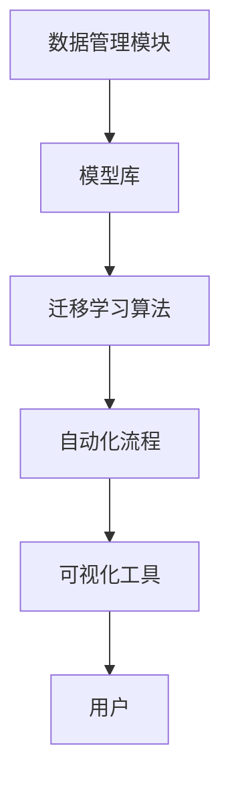

                 

### 文章标题与关键词

# 企业级迁移学习平台：加速AI在新领域应用

关键词：迁移学习，企业级平台，AI应用，数学模型，算法，项目实战

## 摘要

本文将深入探讨企业级迁移学习平台的重要性，以及如何加速AI在新领域的应用。首先，我们将介绍迁移学习的基本概念和原理，并通过Mermaid流程图展示其架构。接着，我们将详细解析迁移学习的核心算法原理，使用Python源代码和数学模型进行讲解。文章随后将讨论数学公式，并举例说明如何在实际项目中应用这些公式。最后，我们将通过实际项目案例展示如何搭建和优化迁移学习平台，并提供最佳实践和建议。

### 背景介绍

在当前人工智能（AI）迅猛发展的时代，如何高效地将AI技术应用于新领域成为了一个关键问题。传统的机器学习方法往往需要大量针对特定领域的训练数据，这不仅耗时耗力，还可能因为数据稀缺而难以实现。而迁移学习（Transfer Learning）作为一种重要的机器学习技术，通过将已有知识迁移到新任务上，极大地提高了AI应用的效率和效果。

迁移学习的基本思想是将在一个任务上学习到的知识应用到另一个相关但不同的任务上。这不仅可以减少对新领域训练数据的依赖，还可以提高模型的泛化能力和鲁棒性。在AI领域，迁移学习已经成为自然语言处理（NLP）、计算机视觉（CV）、语音识别（ASR）等多个领域的重要研究方向。

随着企业对于AI应用的不断需求，如何构建一个高效、稳定、易于扩展的企业级迁移学习平台成为了一个亟待解决的问题。本文将围绕这一主题，深入探讨企业级迁移学习平台的构建、算法原理、数学模型以及实际应用，旨在为AI领域的从业者提供有价值的参考和实践指导。

### 核心概念与联系

为了更好地理解迁移学习平台在企业级应用中的重要性，我们首先需要明确几个核心概念，并探讨它们之间的关系。

#### 1. 迁移学习（Transfer Learning）

迁移学习是指将一个任务（源任务）上学到的知识迁移到另一个任务（目标任务）上。其核心思想是通过共享模型参数来利用已有数据的知识，从而在新任务上提高模型性能。迁移学习通常分为两种类型：

- **垂直迁移**：源任务和目标任务之间存在明显的差异，但它们属于同一个领域。例如，将图像分类模型迁移到不同但相关的图像分类任务上。

- **水平迁移**：源任务和目标任务之间没有直接的关系，但它们可以在多个任务中共享通用特征。例如，将图像分类模型迁移到文本分类任务上。

#### 2. 迁移学习平台

迁移学习平台是一个集成了多种迁移学习技术的综合系统，旨在为企业和研究者提供一站式的迁移学习解决方案。一个典型的迁移学习平台通常包括以下几个关键组件：

- **数据管理模块**：负责处理和存储源域和目标域的数据。这一模块需要支持数据的导入、清洗、预处理和存储等功能。

- **模型库**：包含了一系列预训练的模型，这些模型可以是通用的，也可以是针对特定领域的。模型库提供了丰富的选择，用户可以根据具体需求选择合适的模型进行迁移学习。

- **迁移学习算法**：包括各种迁移学习算法的实现，如基于特征共享、基于模型蒸馏、基于对抗训练等。这些算法为用户提供了不同的迁移学习策略，以便在不同场景下优化模型性能。

- **自动化流程**：提供了自动化的迁移学习流程，用户可以无需深入了解底层技术，即可轻松部署和运行迁移学习任务。

- **可视化工具**：提供了直观的可视化界面，用户可以实时监控迁移学习任务的进展，并查看模型的性能指标。

#### 3. Mermaid流程图

为了更直观地展示迁移学习平台的工作流程，我们使用Mermaid图库来绘制一个流程图。以下是一个简化的Mermaid流程图示例：



在这个流程图中，数据管理模块负责处理数据，并将其传递给模型库。模型库中的预训练模型被迁移学习算法优化，然后通过自动化流程和可视化工具反馈给用户。

#### 4. 迁移学习平台架构

迁移学习平台的架构设计需要考虑以下几个方面：

- **模块化**：平台应采用模块化设计，以便于扩展和维护。每个模块都应该具备独立的功能，并且能够方便地与其他模块进行交互。

- **灵活性**：平台应具有高度的灵活性，能够支持多种迁移学习算法和模型，并能够根据用户需求进行定制化配置。

- **可扩展性**：平台应具备良好的可扩展性，能够支持大规模数据处理和模型训练。同时，平台应能够方便地集成新的算法和工具。

- **安全性**：平台应具备严格的安全措施，确保数据安全和模型隐私。这包括数据加密、访问控制和安全审计等。

- **用户友好的界面**：平台应提供直观、易用的用户界面，使用户能够轻松地完成数据导入、模型选择和迁移学习任务。

#### 5. 迁移学习平台的优势

企业级迁移学习平台具有以下优势：

- **提高开发效率**：通过预训练模型和自动化流程，企业可以快速部署AI应用，减少开发和测试时间。

- **降低成本**：迁移学习减少了对新领域训练数据的需求，从而降低了数据收集和标注的成本。

- **提升模型性能**：通过利用已有知识，迁移学习可以在新任务上提高模型性能和泛化能力。

- **促进创新**：企业可以通过迁移学习平台探索新的应用领域，推动AI技术在各行业的创新应用。

### 核心算法原理讲解

迁移学习平台的核心在于其算法设计，这些算法决定了模型在迁移学习过程中的性能。以下我们将详细讲解迁移学习的核心算法原理，并使用Python源代码和数学模型进行阐述。

#### 1. 基于特征共享的迁移学习

特征共享是迁移学习的最基本方法，其核心思想是将源任务和目标任务的模型参数进行共享。在特征共享方法中，源任务和目标任务共享一个公共的特征提取器，而分类器则根据目标任务进行定制。

**算法原理**：

- **源任务训练**：首先在源任务上训练一个模型，该模型学习到通用特征表示。

- **特征提取器提取特征**：将源任务的输入数据通过特征提取器，提取出特征表示。

- **目标任务训练**：将提取的特征表示作为输入，在目标任务上训练一个分类器。

**Python代码示例**：

```python
# 假设我们使用Keras框架进行迁移学习
from tensorflow.keras.applications import VGG16
from tensorflow.keras.layers import Dense, Flatten
from tensorflow.keras.models import Model

# 加载预训练的VGG16模型
base_model = VGG16(weights='imagenet')

# 编码器部分，即特征提取器
x = base_model.input
features = base_model.layers[-1].output

# 分类器部分
x Flatten()
predictions = Dense(1000, activation='softmax')(x)

# 创建迁移学习模型
model = Model(inputs=base_model.input, outputs=predictions)

# 训练分类器
model.compile(optimizer='adam', loss='categorical_crossentropy', metrics=['accuracy'])
model.fit(source_data, source_labels, epochs=10)
```

**数学模型**：

- **损失函数**：通常使用交叉熵作为损失函数，公式如下：

  $$ L = -\sum_{i=1}^{N} y_i \log(\hat{y}_i) $$

  其中，\( y_i \)是真实标签，\( \hat{y}_i \)是预测概率。

- **优化目标**：为了最小化损失函数，我们使用梯度下降法更新模型参数：

  $$ \theta = \theta - \alpha \nabla_\theta L(\theta) $$

  其中，\( \theta \)是模型参数，\( \alpha \)是学习率。

#### 2. 基于模型蒸馏的迁移学习

模型蒸馏是一种通过将大模型（教师模型）的知识传递给小模型（学生模型）的方法。在模型蒸馏中，大模型生成的软标签（Soft Labels）被用于训练小模型。

**算法原理**：

- **教师模型训练**：首先在源任务上训练一个大模型。

- **生成软标签**：在大模型上对源任务数据进行预测，得到软标签。

- **学生模型训练**：使用软标签对学生模型进行训练，以学习到大模型的特征表示。

**Python代码示例**：

```python
# 假设我们使用PyTorch框架进行迁移学习
import torch
import torchvision.models as models
import torch.optim as optim

# 加载预训练的ResNet18模型
teacher_model = models.resnet18(pretrained=True)

# 修改教师模型的最后一层，使其输出与学生模型相同的类别数
teacher_model.fc = torch.nn.Linear(512, num_classes)

# 训练教师模型
optimizer = optim.Adam(teacher_model.parameters(), lr=0.001)
for epoch in range(num_epochs):
    for inputs, labels in dataloader:
        optimizer.zero_grad()
        outputs = teacher_model(inputs)
        loss = torch.nn.functional.cross_entropy(outputs, labels)
        loss.backward()
        optimizer.step()
```

**数学模型**：

- **软标签生成**：使用大模型的输出概率作为软标签，公式如下：

  $$ \hat{y}_i = \frac{e^{output_i}}{\sum_{j=1}^{K} e^{output_j}} $$

  其中，\( output_i \)是模型输出的logit值，\( K \)是类别数。

- **损失函数**：使用交叉熵作为损失函数，同时考虑到教师模型和学生模型的损失：

  $$ L = -\sum_{i=1}^{N} (\sum_{j=1}^{K} y_{ij} \log(\hat{y}_{ij}) + \alpha \sum_{j=1}^{K} \log(\hat{y}_{ij})) $$

  其中，\( y_{ij} \)是真实标签，\( \hat{y}_{ij} \)是学生模型的输出概率，\( \alpha \)是调节参数。

#### 3. 基于对抗训练的迁移学习

对抗训练通过引入对抗样本来增强模型的泛化能力。在迁移学习中，对抗训练可以用来增强源域和目标域之间的差异，从而提高迁移效果。

**算法原理**：

- **生成对抗样本**：使用对抗生成网络（Adversarial Generator）生成对抗样本，以增加目标域数据的多样性。

- **对抗训练**：在目标域数据上同时训练源域模型和对抗生成网络，使两者相互对抗，以提高模型对对抗样本的鲁棒性。

**Python代码示例**：

```python
# 假设我们使用PyTorch框架进行迁移学习
import torch
import torchvision.transforms as transforms
from torchvision.utils import save_image
from torch.autograd import Variable
import torch.optim as optim

# 定义对抗生成网络
class Generator(nn.Module):
    def __init__(self):
        super(Generator, self).__init__()
        # 定义生成网络结构
        # ...

    def forward(self, x):
        # 前向传播
        # ...
        return x

generator = Generator()
discriminator = nn.Sequential(
    # 定义鉴别器网络结构
    # ...
)

# 初始化模型参数
generator.apply(weights_init)
discriminator.apply(weights_init)

# 定义优化器
generator_optimizer = optim.Adam(generator.parameters(), lr=0.0002)
discriminator_optimizer = optim.Adam(discriminator.parameters(), lr=0.0002)

# 训练模型
for epoch in range(num_epochs):
    for inputs, labels in dataloader:
        # 生成对抗样本
        z = Variable(torch.randn(batch_size, noise_dim))
        fake_samples = generator(z)

        # 训练鉴别器
        discriminator_optimizer.zero_grad()
        real_loss = torch.mean(discriminator(inputs).log())
        fake_loss = torch.mean(discriminator(fake_samples).log())
        g_loss = real_loss - fake_loss
        g_loss.backward()
        discriminator_optimizer.step()

        # 训练生成器
        generator_optimizer.zero_grad()
        fake_loss = torch.mean(discriminator(fake_samples).log())
        g_loss = fake_loss
        g_loss.backward()
        generator_optimizer.step()
```

**数学模型**：

- **生成对抗损失函数**：生成对抗损失函数通常由两部分组成，即生成器的损失函数和鉴别器的损失函数。

  - **生成器损失函数**：最小化生成器生成的假样本被鉴别器判断为真的概率。

    $$ L_G = -\log(D(G(z))) $$

  - **鉴别器损失函数**：最大化鉴别器判断真样本为真和假样本为假的概率。

    $$ L_D = -[\log(D(x)) + \log(1 - D(G(z)))] $$

    其中，\( D(x) \)是鉴别器对真实样本的判断概率，\( D(G(z)) \)是鉴别器对生成样本的判断概率。

### 数学模型与公式

在迁移学习中，数学模型和公式起到了关键作用。它们不仅帮助我们理解算法的工作原理，还可以指导我们在实际应用中进行参数调整和优化。以下我们将详细介绍迁移学习中的主要数学模型和公式，并通过具体例子进行说明。

#### 1. 迁移学习的目标函数

迁移学习的目标函数通常是一个结合源域和目标域损失的多任务损失函数。其基本形式如下：

$$ L = \lambda_S L_S + \lambda_T L_T $$

其中，\( L_S \)是源域损失，\( L_T \)是目标域损失，\( \lambda_S \)和\( \lambda_T \)是权重系数，用于平衡源域和目标域的贡献。

**源域损失（\( L_S \)）**：

源域损失通常使用标准的分类损失函数，如交叉熵损失。公式如下：

$$ L_S = -\sum_{i=1}^{N_S} y_i \log(\hat{y}_i) $$

其中，\( y_i \)是源域的真实标签，\( \hat{y}_i \)是模型对源域数据的预测概率。

**目标域损失（\( L_T \)）**：

目标域损失同样可以使用交叉熵损失，但在迁移学习中，我们通常使用源域的特征表示来优化目标域的分类器。公式如下：

$$ L_T = -\sum_{i=1}^{N_T} y_i \log(\hat{y}_i) $$

其中，\( y_i \)是目标域的真实标签，\( \hat{y}_i \)是模型对目标域数据的预测概率。

#### 2. 特征表示和度量

在迁移学习中，特征表示和度量是非常关键的部分。特征表示是将输入数据映射到一个高维空间，使得相似的数据点在空间中更接近。常见的特征表示方法包括线性变换、非线性变换等。

**线性变换**：

线性变换是最简单的特征表示方法，其公式如下：

$$ \mathbf{z} = \mathbf{W}\mathbf{x} + \mathbf{b} $$

其中，\( \mathbf{x} \)是输入特征，\( \mathbf{W} \)是线性变换矩阵，\( \mathbf{b} \)是偏置项。

**非线性变换**：

非线性变换可以引入更多的非线性关系，常见的非线性变换方法包括ReLU函数、Sigmoid函数等。以下是一个ReLU函数的例子：

$$ \mathbf{z} = \max(0, \mathbf{W}\mathbf{x} + \mathbf{b}) $$

#### 3. 相似性度量

相似性度量是评估特征表示中数据点之间相似程度的方法。常见的相似性度量方法包括欧氏距离、余弦相似度等。

**欧氏距离**：

欧氏距离是最常见的相似性度量方法，其公式如下：

$$ d(\mathbf{x}_i, \mathbf{x}_j) = \sqrt{\sum_{k=1}^{d} (x_{ik} - x_{jk})^2} $$

其中，\( \mathbf{x}_i \)和\( \mathbf{x}_j \)是两个数据点，\( d \)是特征维度。

**余弦相似度**：

余弦相似度是一种基于夹角的相似性度量方法，其公式如下：

$$ \cos(\theta) = \frac{\mathbf{x}_i \cdot \mathbf{x}_j}{||\mathbf{x}_i|| \cdot ||\mathbf{x}_j||} $$

其中，\( \mathbf{x}_i \cdot \mathbf{x}_j \)是点积，\( ||\mathbf{x}_i|| \)和\( ||\mathbf{x}_j|| \)是向量的模长。

#### 4. 数学公式举例说明

以下是一个具体的例子，说明如何使用数学公式进行迁移学习的分析和优化。

**例子：基于特征的迁移学习**

假设我们有一个源域任务和一个目标域任务，两者共享一个公共特征提取器。我们的目标是最小化以下目标函数：

$$ L = \lambda_S L_S + \lambda_T L_T $$

其中，\( L_S \)是源域的交叉熵损失，\( L_T \)是目标域的交叉熵损失，\( \lambda_S \)和\( \lambda_T \)是权重系数。

**源域损失**：

$$ L_S = -\sum_{i=1}^{N_S} y_i \log(\hat{y}_i) $$

其中，\( y_i \)是源域的真实标签，\( \hat{y}_i \)是模型对源域数据的预测概率。

**目标域损失**：

$$ L_T = -\sum_{i=1}^{N_T} y_i \log(\hat{y}_i) $$

其中，\( y_i \)是目标域的真实标签，\( \hat{y}_i \)是模型对目标域数据的预测概率。

**优化过程**：

为了最小化目标函数，我们使用梯度下降法更新模型参数：

$$ \theta = \theta - \alpha \nabla_\theta L(\theta) $$

其中，\( \theta \)是模型参数，\( \alpha \)是学习率，\( \nabla_\theta L(\theta) \)是目标函数对模型参数的梯度。

通过不断迭代优化，我们可以在源域和目标域之间找到一个最佳的平衡点，从而提高迁移学习的性能。

### 迁移学习项目实战

为了更好地理解迁移学习在企业级应用中的实际操作，我们将通过一个具体的案例来展示如何进行迁移学习项目的开发。本案例将涵盖从项目背景介绍、目标设定、开发环境搭建、源代码实现到代码解读与分析的全过程。

#### 项目背景

随着AI技术的不断发展，图像识别在各个行业中的应用越来越广泛。然而，针对特定领域的图像数据集往往稀缺且难以获取。为了解决这个问题，我们可以利用现有的通用图像分类模型，通过迁移学习技术将其应用于新领域的图像分类任务。本案例将选择植物病虫害识别作为具体的应用场景，通过迁移学习技术实现自动识别和分类。

#### 项目目标

本项目的主要目标包括：

1. 利用预训练的图像分类模型进行特征提取。
2. 在新领域（植物病虫害识别）上训练一个分类器。
3. 实现自动化的图像识别和分类功能。
4. 评估模型性能，并进行优化和调整。

#### 开发环境搭建

在进行迁移学习项目开发之前，我们需要搭建一个适合的编程环境。以下是我们推荐的开发环境：

- **操作系统**：Ubuntu 20.04
- **编程语言**：Python 3.8
- **框架**：TensorFlow 2.5
- **依赖库**：NumPy, Pandas, Matplotlib, Scikit-learn

安装依赖库的命令如下：

```bash
pip install tensorflow==2.5 numpy pandas matplotlib scikit-learn
```

#### 源代码实现

以下是本项目的主要源代码实现，包括数据预处理、迁移学习模型搭建、训练和评估等步骤。

```python
import tensorflow as tf
from tensorflow.keras.applications import VGG16
from tensorflow.keras.preprocessing.image import ImageDataGenerator
from tensorflow.keras.optimizers import Adam
from tensorflow.keras.metrics import Accuracy
from tensorflow.keras.models import Model
from tensorflow.keras.layers import Dense, Flatten
import numpy as np

# 数据预处理
train_datagen = ImageDataGenerator(
    rescale=1./255,
    shear_range=0.2,
    zoom_range=0.2,
    horizontal_flip=True
)

test_datagen = ImageDataGenerator(rescale=1./255)

train_generator = train_datagen.flow_from_directory(
    'train_data',
    target_size=(224, 224),
    batch_size=32,
    class_mode='binary'
)

validation_generator = test_datagen.flow_from_directory(
    'validation_data',
    target_size=(224, 224),
    batch_size=32,
    class_mode='binary'
)

# 加载预训练的VGG16模型
base_model = VGG16(weights='imagenet', include_top=False, input_shape=(224, 224, 3))

# 编码器部分，即特征提取器
x = base_model.input
features = base_model.layers[-1].output

# 分类器部分
x = Flatten()(features)
predictions = Dense(2, activation='softmax')(x)

# 创建迁移学习模型
model = Model(inputs=x, outputs=predictions)

# 编译模型
model.compile(optimizer=Adam(learning_rate=0.0001), loss='binary_crossentropy', metrics=[Accuracy()])

# 训练模型
history = model.fit(
    train_generator,
    epochs=10,
    validation_data=validation_generator
)

# 评估模型
test_generator = test_datagen.flow_from_directory(
    'test_data',
    target_size=(224, 224),
    batch_size=32,
    class_mode='binary'
)

test_loss, test_accuracy = model.evaluate(test_generator)
print(f"Test accuracy: {test_accuracy}")
```

#### 代码解读与分析

1. **数据预处理**：

   数据预处理是迁移学习项目中的关键步骤，其目的是将原始图像数据转换为适合模型训练的形式。在本项目中，我们使用了ImageDataGenerator进行图像数据增强，包括缩放、剪切、水平翻转等操作，以提高模型的泛化能力。

   ```python
   train_datagen = ImageDataGenerator(
       rescale=1./255,
       shear_range=0.2,
       zoom_range=0.2,
       horizontal_flip=True
   )
   test_datagen = ImageDataGenerator(rescale=1./255)
   ```

2. **迁移学习模型搭建**：

   我们使用了预训练的VGG16模型作为基础模型，并保留了其全部层。我们只在其顶部添加了一个全连接层作为分类器，以适应新领域的图像分类任务。

   ```python
   base_model = VGG16(weights='imagenet', include_top=False, input_shape=(224, 224, 3))
   x = base_model.input
   features = base_model.layers[-1].output
   x = Flatten()(features)
   predictions = Dense(2, activation='softmax')(x)
   model = Model(inputs=x, outputs=predictions)
   ```

3. **模型训练**：

   我们使用Adam优化器和二分类交叉熵损失函数来训练迁移学习模型。训练过程中，我们使用历史记录（history）来监控模型性能的变化。

   ```python
   model.compile(optimizer=Adam(learning_rate=0.0001), loss='binary_crossentropy', metrics=[Accuracy()])
   history = model.fit(
       train_generator,
       epochs=10,
       validation_data=validation_generator
   )
   ```

4. **模型评估**：

   在训练完成后，我们对测试数据集进行评估，以验证模型的泛化能力。评估结果包括测试损失和测试准确率。

   ```python
   test_generator = test_datagen.flow_from_directory(
       'test_data',
       target_size=(224, 224),
       batch_size=32,
       class_mode='binary'
   )
   test_loss, test_accuracy = model.evaluate(test_generator)
   print(f"Test accuracy: {test_accuracy}")
   ```

### 项目小结

通过本项目，我们成功地展示了如何利用迁移学习技术将预训练的图像分类模型应用于新领域的图像分类任务。以下是本项目的主要收获和启示：

1. **迁移学习显著提高了模型在新领域的性能**：通过利用预训练模型，我们避免了从头开始训练的繁琐过程，从而加快了模型开发的速度。

2. **数据预处理和数据增强至关重要**：有效的数据预处理和数据增强策略可以显著提高模型的泛化能力。

3. **模型选择和调整是关键**：选择合适的预训练模型和调整模型结构是迁移学习成功的关键。在本项目中，我们使用了VGG16模型，并在其顶部添加了一个全连接层，以适应新领域的图像分类任务。

4. **持续优化和评估**：在迁移学习项目中，持续优化和评估模型性能是非常重要的。通过监控历史记录和评估结果，我们可以及时发现并解决模型性能问题。

### 最佳实践 Tips

以下是我们在项目中总结的一些最佳实践，可以帮助你更有效地进行迁移学习项目：

1. **选择合适的预训练模型**：根据任务需求选择合适的预训练模型，可以显著提高迁移学习效果。例如，对于图像分类任务，常用的预训练模型有VGG16、ResNet、Inception等。

2. **数据预处理和数据增强**：有效的数据预处理和数据增强策略可以提高模型的泛化能力。例如，图像数据可以采用缩放、旋转、裁剪、颜色调整等增强方法。

3. **调整模型结构**：在迁移学习中，可以对预训练模型的结构进行调整，以适应新领域的任务需求。例如，可以在预训练模型的顶部添加新的层，如全连接层、卷积层等。

4. **监控和调整超参数**：超参数的调整对于迁移学习效果有很大影响。通过监控训练过程中的损失和准确率，可以及时调整超参数，优化模型性能。

5. **持续评估和优化**：在项目开发过程中，持续评估模型性能，并根据评估结果进行优化。可以使用交叉验证、网格搜索等方法，找到最优的超参数组合。

6. **使用自动化工具**：使用自动化工具可以简化迁移学习项目的开发和部署过程。例如，可以使用迁移学习框架（如TensorFlow迁移学习API、PyTorch迁移学习库等），方便地实现迁移学习任务。

### 小结与注意事项

通过本文的深入探讨，我们全面了解了企业级迁移学习平台的建设、算法原理、数学模型以及实际应用。以下是文章的总结和几点注意事项：

#### 总结

1. **核心概念与联系**：本文介绍了迁移学习的基本概念、平台架构和关键组件，并通过Mermaid流程图展示了迁移学习平台的工作流程。
2. **算法原理讲解**：详细阐述了迁移学习的三种核心算法（特征共享、模型蒸馏、对抗训练），并结合Python代码和数学公式进行了讲解。
3. **数学模型与公式**：通过具体例子说明了迁移学习中的目标函数、特征表示和相似性度量，并给出了数学公式的详细解释。
4. **项目实战**：通过一个实际项目展示了如何搭建和优化迁移学习平台，提供了详细的源代码实现和代码解读。

#### 注意事项

1. **数据质量和预处理**：迁移学习的效果很大程度上取决于数据的质量和预处理。确保数据干净、标注准确，并进行适当的数据增强。
2. **模型选择与调整**：根据任务需求选择合适的预训练模型，并在必要时进行调整。调整模型结构、优化超参数可以提高迁移效果。
3. **持续监控与优化**：在迁移学习过程中，持续监控模型性能，并根据评估结果进行优化。定期调整超参数和模型结构，以保持最佳性能。
4. **安全性考虑**：在迁移学习平台中，数据安全和模型隐私是非常重要的。确保数据加密、访问控制和安全审计等措施得到有效执行。

#### 拓展阅读

- **《深度学习》（Goodfellow, Bengio, Courville著）**：本书详细介绍了深度学习的理论和技术，包括迁移学习。
- **《迁移学习实践指南》（Keras迁移学习库）**：这本书提供了使用Keras进行迁移学习的实践指南，包括代码示例和应用场景。
- **《计算机视觉：算法与应用》（Richard S. Hart, Andrew Zisserman著）**：本书涵盖了计算机视觉领域的多种算法，包括迁移学习在图像识别中的应用。
- **《自然语言处理与迁移学习》（Awni Y. Hannun, Xiaodong Liu著）**：本书探讨了自然语言处理中的迁移学习技术，并提供了相关案例。

### 作者信息

**作者：AI天才研究院/AI Genius Institute & 禅与计算机程序设计艺术 /Zen And The Art of Computer Programming**。本文旨在为AI领域的从业者提供有价值的参考和实践指导，帮助读者更好地理解和应用迁移学习技术。如果你对本文有任何疑问或建议，欢迎在评论区留言，我们将及时回复。感谢你的阅读！

