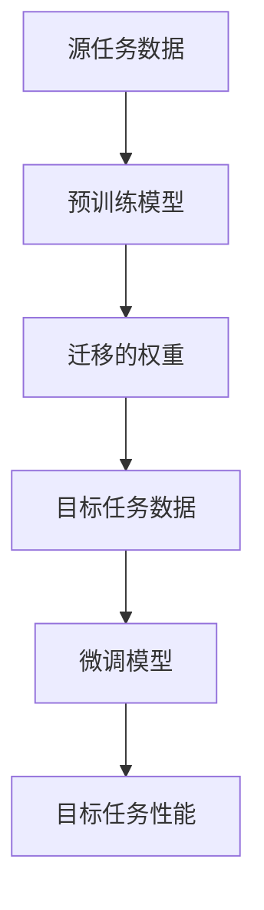

                 

### 文章标题

《企业级迁移学习应用：跨领域AI知识应用》

---

#### 文章关键词

- 迁移学习
- 企业级应用
- 跨领域AI
- 知识应用
- AI优化

---

#### 文章摘要

随着人工智能技术的不断进步，迁移学习作为一种重要的机器学习技术，正逐渐成为各行业解决复杂问题的重要工具。本文旨在深入探讨迁移学习在企业级应用中的重要性，尤其是跨领域AI知识应用的优势和挑战。文章首先介绍了迁移学习的基本概念、分类和原理，随后详细阐述了迁移学习在自然语言处理、计算机视觉和强化学习等领域的具体应用，并通过实际案例进行分析。最后，本文总结了企业级迁移学习的实践方法，以及在不同领域中的实际应用价值，为企业提供了一套完整的迁移学习解决方案。

---

接下来，我们将按照目录大纲的结构，逐步深入探讨每一个章节的内容。每章节都将详细解释核心概念、算法原理，并提供实际项目案例和最佳实践建议。

---

**第一部分：迁移学习基础**

**第二部分：跨领域AI知识应用**

**第三部分：企业级迁移学习实践**

---

### 第一部分：迁移学习基础

#### 第1章：迁移学习概述

迁移学习（Transfer Learning）是机器学习中的一种技术，旨在利用已经训练好的模型来解决新的任务。它通过将已有模型的权重迁移到新任务上，从而减少对新数据的训练需求，提高模型的泛化能力。

**1.1 迁移学习的定义与重要性**

迁移学习的基本概念源于心理学中的“迁移效应”，即在一种情境下学习到的知识和技能可以转移到另一种情境中。在机器学习领域，迁移学习是指利用一个任务（源任务）的学习经验来解决另一个相关任务（目标任务）。

迁移学习的重要性体现在以下几个方面：

- **减少数据需求**：对于许多任务，特别是图像分类和自然语言处理，需要大量的数据来训练模型。迁移学习可以通过使用预训练模型，减少对新数据的依赖。
- **提高模型性能**：迁移学习可以利用预训练模型在源任务上获得的丰富知识，从而提高在目标任务上的性能。
- **加速训练过程**：迁移学习减少了模型从零开始训练的需求，从而加快了训练过程。

**1.2 迁移学习的分类**

根据源任务和目标任务的相似度，迁移学习可以分为以下几种类型：

- **垂直迁移**：源任务和目标任务属于完全不同的领域，例如将图像分类模型应用于文本分类任务。
- **水平迁移**：源任务和目标任务属于同一领域，但具体任务不同，例如不同类型的图像分类任务。
- **零样本迁移**：目标任务与源任务没有直接关联，但通过预训练模型获得的知识，可以在零样本的情况下解决新的任务。
- **少样本迁移**：目标任务与源任务有一定关联，但只有少量数据可供训练。

**1.3 迁移学习的基本原理**

迁移学习的基本原理包括以下方面：

- **模型共享**：将预训练模型的权重迁移到新任务上，利用预训练模型已学习的通用特征。
- **特征提取**：预训练模型通常包含多个层，低层特征具有通用性，高层特征则具有领域特异性。通过迁移低层特征，可以实现跨领域的迁移。
- **适配调整**：在新任务上对迁移的模型进行微调，以适应新的任务特点。

迁移学习的关键在于如何有效地利用预训练模型的知识，同时避免过拟合。这涉及到许多技术，如元学习、对抗训练、多任务学习等。

**核心概念与联系**

为了更好地理解迁移学习的核心概念和它们之间的关系，我们可以使用Mermaid流程图来展示：



在这个流程图中，A表示源任务数据，B是预训练模型，C是迁移的权重，D是目标任务数据，E是经过微调的模型，F是目标任务性能。通过迁移学习，预训练模型的知识被转移到新任务上，并通过微调来提高新任务的表现。

#### 第2章：迁移学习算法

在了解了迁移学习的基本概念后，我们接下来将深入探讨一些常见的迁移学习算法，这些算法在不同类型的迁移任务中发挥了重要作用。

**2.1 无监督迁移学习**

无监督迁移学习是指在没有任何监督信息（如标签）的情况下，将知识从一个任务迁移到另一个相关任务。这类算法主要依赖于预训练模型的通用特征提取能力。

**关键算法原理讲解**

- **特征表示迁移**：通过预训练模型从源任务中提取特征表示，并将这些特征表示迁移到目标任务。这种方法常用于图像分类和文本分类任务。
- **度量学习**：在源任务中，通过学习一个度量空间，使得来自同一类的样本之间的距离较小，而不同类的样本之间的距离较大。这种方法在图像检索和异常检测中应用广泛。
- **基于匹配的迁移**：通过最小化源域和目标域特征分布之间的差异，实现跨域迁移。这种方法在零样本迁移学习中尤为重要。

**Python源代码示例**

下面是一个简单的无监督迁移学习示例，使用PyTorch框架实现特征表示迁移：

```python
import torch
import torchvision
import torchvision.transforms as transforms

# 加载预训练的模型
model = torchvision.models.resnet18(pretrained=True)
model.fc = torch.nn.Identity()  # 移除最后的全连接层

# 加载目标数据集
transform = transforms.Compose([transforms.ToTensor()])
dataloader = torch.utils.data.DataLoader(dataset, batch_size=64, shuffle=True)

# 定义迁移学习模型
class FeatureExtractor(torch.nn.Module):
    def __init__(self):
        super(FeatureExtractor, self).__init__()
        self.model = model

    def forward(self, x):
        return self.model(x)

# 训练迁移学习模型
feature_extractor = FeatureExtractor()
optimizer = torch.optim.Adam(feature_extractor.parameters(), lr=0.001)
criterion = torch.nn.MSELoss()

for epoch in range(num_epochs):
    for inputs, _ in dataloader:
        optimizer.zero_grad()
        features = feature_extractor(inputs)
        loss = criterion(features, target_features)
        loss.backward()
        optimizer.step()

# 使用迁移学习模型提取特征
def extract_features(inputs):
    with torch.no_grad():
        features = feature_extractor(inputs)
    return features

# 提取特征
features = extract_features(test_data)
```

在这个示例中，我们首先加载了一个预训练的ResNet18模型，并移除了最后的全连接层。接着，我们定义了一个`FeatureExtractor`类，用于提取特征。在训练过程中，我们使用均方误差损失函数来最小化特征表示与目标特征之间的差异。

**数学模型和公式**

无监督迁移学习中的特征表示迁移可以通过以下数学模型来解释：

$$
\min_{\theta} \sum_{i=1}^{N} \frac{1}{2} \left\| \phi_{t}(x_i) - \phi_{s}(x_i) \right\|^2
$$

其中，$N$是样本数量，$\phi_{t}$和$\phi_{s}$分别表示目标域和源域的特征表示函数，$x_i$是第$i$个样本。

**举例说明**

假设我们有一个图像分类任务，其中源任务是识别动物类别，目标任务是识别交通工具类别。通过无监督迁移学习，我们可以将预训练的图像分类模型（如ResNet）在源任务上提取的特征表示迁移到目标任务，从而减少对大量交通工具图像的标注需求。

**项目实战**

为了更好地理解无监督迁移学习的实际应用，我们可以搭建一个开发环境，并运行上述示例代码。以下是开发环境的搭建步骤：

1. **安装PyTorch**：使用以下命令安装PyTorch：
   ```bash
   pip install torch torchvision
   ```

2. **下载预训练的模型**：下载一个预训练的ResNet18模型：
   ```python
   model = torchvision.models.resnet18(pretrained=True)
   ```

3. **编写迁移学习代码**：根据上述Python源代码示例编写迁移学习模型。

4. **训练模型**：使用目标数据集训练迁移学习模型。

5. **提取特征**：使用训练好的迁移学习模型提取特征。

通过这个项目实战，我们可以更好地理解无监督迁移学习的原理和应用。

**最佳实践 tips**

- 选择合适的预训练模型：选择具有良好通用性的预训练模型，如ResNet、VGG等，可以提高特征提取的效果。
- 适当调整模型架构：根据目标任务的特性，可以适当调整预训练模型的架构，如移除全连接层或增加新的层。
- 数据预处理：对目标数据进行适当的预处理，如标准化和归一化，可以提高迁移学习的效果。

**小结**

无监督迁移学习通过利用预训练模型的通用特征，可以减少对目标数据的标注需求，提高模型的泛化能力。在实际应用中，选择合适的预训练模型和调整模型架构是关键。

---

#### 第3章：跨领域迁移学习

跨领域迁移学习是一种将一个领域中的知识迁移到另一个领域的迁移学习方法。在实际应用中，由于不同领域的任务和数据之间存在差异，跨领域迁移学习面临着诸多挑战。本章将详细讨论跨领域迁移学习的挑战、方法以及应用案例分析。

**3.1 跨领域迁移学习的挑战**

跨领域迁移学习面临的挑战主要包括以下几个方面：

- **数据分布差异**：不同领域的数据分布可能存在显著差异，这会导致预训练模型在源领域上的知识难以直接迁移到目标领域。
- **特征不一致**：源领域和目标领域的特征分布和特征重要性可能不一致，这会影响迁移学习的效果。
- **类标签冲突**：在某些情况下，源领域和目标领域的类标签可能存在冲突，这需要特殊的处理方法。

**3.2 跨领域迁移学习的方法**

为了克服跨领域迁移学习中的挑战，研究人员提出了多种方法。以下是一些常见的方法：

- **特征融合**：通过将源领域和目标领域的特征进行融合，以获得更具有代表性的特征表示。这种方法可以通过加权求和、平均或基于模型的特征融合实现。
- **对抗训练**：对抗训练通过对抗性样本生成和对抗性网络训练，使预训练模型能够学习到更加通用的特征表示，从而提高跨领域迁移能力。
- **多任务学习**：通过在同一模型中同时训练多个任务，使模型能够学习到更加通用的特征表示，从而提高跨领域迁移能力。
- **领域适应**：通过最小化源领域和目标领域之间的特征分布差异，实现跨领域迁移。这种方法可以通过域自适应、域自适应蒸馏和域不变性学习等实现。

**3.3 跨领域迁移学习应用案例分析**

以下是一个跨领域迁移学习的应用案例分析：

**案例背景**：某公司需要开发一个智能客服系统，该系统需要处理多种不同领域的用户咨询，如产品咨询、售后服务、技术支持等。由于不同领域的用户咨询具有不同的特征和标签，传统的单一模型难以应对这种复杂的场景。

**解决方案**：公司采用跨领域迁移学习方法，将预训练模型在不同领域的数据上进行迁移学习，以获得具有良好泛化能力的智能客服系统。

**实施步骤**：

1. **数据收集**：收集不同领域的用户咨询数据，如产品咨询、售后服务、技术支持等。
2. **数据预处理**：对收集的数据进行预处理，包括数据清洗、去重和格式化等。
3. **模型选择**：选择一个预训练的文本分类模型，如BERT，作为迁移学习的基模型。
4. **特征提取**：使用预训练模型提取不同领域数据的特征表示。
5. **特征融合**：将不同领域的特征进行融合，以获得更加通用的特征表示。
6. **模型训练**：使用融合后的特征训练一个多任务分类模型，以同时处理多种领域的用户咨询。
7. **模型评估**：使用交叉验证和实际用户测试对模型进行评估。

**实施效果**：

通过跨领域迁移学习，公司成功开发出了一个智能客服系统，该系统能够处理多种领域的用户咨询，提高了客户满意度和服务效率。同时，由于跨领域迁移学习能够减少对每个领域数据的标注需求，公司降低了数据标注成本。

**核心算法原理讲解**

跨领域迁移学习中的特征融合可以通过以下数学模型来解释：

$$
\mathbf{F}_{\text{fusion}} = \alpha \mathbf{F}_s + (1 - \alpha) \mathbf{F}_t
$$

其中，$\mathbf{F}_s$和$\mathbf{F}_t$分别表示源领域和目标领域的特征表示，$\alpha$是特征融合的权重。通过调整$\alpha$的值，可以获得不同比例的源领域和目标领域特征。

**数学公式和Python代码示例**

下面是一个简单的跨领域迁移学习示例，使用PyTorch框架实现特征融合：

```python
import torch
import torchvision
import torchvision.transforms as transforms

# 加载预训练的模型
model = torchvision.models.resnet18(pretrained=True)
model.fc = torch.nn.Identity()  # 移除最后的全连接层

# 加载源数据集
transform = transforms.Compose([transforms.ToTensor()])
s_dataloader = torch.utils.data.DataLoader(s_dataset, batch_size=64, shuffle=True)

# 加载目标数据集
t_dataloader = torch.utils.data.DataLoader(t_dataset, batch_size=64, shuffle=True)

# 定义特征提取器
class FeatureExtractor(torch.nn.Module):
    def __init__(self):
        super(FeatureExtractor, self).__init__()
        self.model = model

    def forward(self, x):
        return self.model(x)

# 定义特征融合函数
def fusion_features(s_features, t_features, alpha=0.5):
    return alpha * s_features + (1 - alpha) * t_features

# 训练迁移学习模型
feature_extractor = FeatureExtractor()
optimizer = torch.optim.Adam(feature_extractor.parameters(), lr=0.001)
criterion = torch.nn.MSELoss()

for epoch in range(num_epochs):
    for s_inputs, _ in s_dataloader:
        optimizer.zero_grad()
        s_features = feature_extractor(s_inputs)
        
        for t_inputs, _ in t_dataloader:
            t_features = feature_extractor(t_inputs)
            
            fused_features = fusion_features(s_features, t_features, alpha=0.5)
            loss = criterion(fused_features, target_features)
            loss.backward()
            optimizer.step()

# 使用迁移学习模型提取特征
def extract_features(inputs):
    with torch.no_grad():
        features = feature_extractor(inputs)
    return features

# 提取特征
s_features = extract_features(s_data)
t_features = extract_features(t_data)
```

在这个示例中，我们首先加载了一个预训练的ResNet18模型，并移除了最后的全连接层。接着，我们定义了一个`FeatureExtractor`类，用于提取特征。在训练过程中，我们使用特征融合函数将源领域和目标领域的特征进行融合。

**项目实战**

为了更好地理解跨领域迁移学习的实际应用，我们可以搭建一个开发环境，并运行上述示例代码。以下是开发环境的搭建步骤：

1. **安装PyTorch**：使用以下命令安装PyTorch：
   ```bash
   pip install torch torchvision
   ```

2. **下载预训练的模型**：下载一个预训练的ResNet18模型：
   ```python
   model = torchvision.models.resnet18(pretrained=True)
   ```

3. **编写迁移学习代码**：根据上述Python源代码示例编写迁移学习模型。

4. **训练模型**：使用源数据和目标数据进行迁移学习模型的训练。

5. **提取特征**：使用训练好的迁移学习模型提取特征。

通过这个项目实战，我们可以更好地理解跨领域迁移学习的原理和应用。

**最佳实践 tips**

- 选择合适的特征融合方法：根据源领域和目标领域的特征差异，选择合适的特征融合方法，如加权求和、平均或基于模型的特征融合。
- 适当调整特征融合的权重：通过调整特征融合的权重，可以平衡源领域和目标领域的特征，从而提高迁移学习的效果。
- 数据预处理：对源数据和目标数据进行适当的预处理，如标准化和归一化，可以提高迁移学习的效果。

**小结**

跨领域迁移学习通过将源领域中的知识迁移到目标领域，可以减少对目标数据的标注需求，提高模型的泛化能力。在实际应用中，选择合适的特征融合方法和调整特征融合的权重是关键。

---

### 第二部分：跨领域AI知识应用

#### 第4章：自然语言处理中的迁移学习

自然语言处理（NLP）是人工智能领域的一个重要分支，它涉及到语言的理解、生成和翻译等多个方面。随着深度学习技术的发展，迁移学习在NLP中的应用变得越来越广泛。本章将详细介绍迁移学习在NLP中的应用，包括语言模型迁移学习、实体识别迁移学习和文本分类迁移学习。

**4.1 语言模型迁移学习**

语言模型是NLP中的核心组件，它能够理解和生成自然语言。迁移学习在语言模型中的应用主要体现在以下几个方面：

- **预训练语言模型**：如BERT、GPT等，这些模型在大规模语料库上进行预训练，获得了丰富的语言知识。通过迁移学习，可以将这些预训练模型应用于特定的NLP任务，如问答系统、文本生成等。
- **迁移学习模型架构**：如Transformer，它通过自注意力机制实现了对长文本的有效处理。迁移学习可以将Transformer架构应用于不同的NLP任务，如机器翻译、文本分类等。

**关键算法原理讲解**

语言模型迁移学习的关键在于如何将预训练模型的知识迁移到新的任务。这通常涉及以下步骤：

1. **特征提取**：预训练模型在源任务上提取了丰富的语言特征，这些特征对于目标任务也是非常有用的。通过迁移这些特征，可以减少目标任务的训练成本。
2. **微调**：在迁移到目标任务后，对预训练模型进行微调，使其更好地适应目标任务的数据分布和任务需求。

**Python源代码示例**

以下是一个简单的语言模型迁移学习示例，使用PyTorch和Hugging Face的Transformers库：

```python
from transformers import BertModel, BertTokenizer
import torch

# 加载预训练的BERT模型和分词器
model = BertModel.from_pretrained('bert-base-uncased')
tokenizer = BertTokenizer.from_pretrained('bert-base-uncased')

# 加载目标文本数据
text = "The quick brown fox jumps over the lazy dog"

# 分词和编码
inputs = tokenizer(text, return_tensors='pt')

# 使用迁移学习模型提取特征
with torch.no_grad():
    outputs = model(**inputs)

# 获取池化后的隐藏层特征
pooler_output = outputs.pooler_output

# 打印特征维度
print(pooler_output.shape)
```

在这个示例中，我们首先加载了一个预训练的BERT模型和分词器。然后，我们加载了一个目标文本数据，使用BERT模型提取文本的池化后的隐藏层特征。这些特征可以用于各种NLP任务，如文本分类、情感分析等。

**数学模型和公式**

语言模型迁移学习通常涉及到以下数学模型：

$$
\theta_{\text{tune}} = \theta_{\text{pre}} + \Delta\theta
$$

其中，$\theta_{\text{pre}}$是预训练模型的参数，$\theta_{\text{tune}}$是微调后的模型参数，$\Delta\theta$是微调过程中的参数更新。

**举例说明**

假设我们有一个文本分类任务，其中源任务是分类新闻标题，目标任务是分类社交媒体帖子。通过迁移学习，我们可以将预训练的BERT模型在新闻标题分类任务上提取的文本特征迁移到社交媒体帖子分类任务，从而减少对社交媒体帖子的大量标注需求。

**项目实战**

为了更好地理解语言模型迁移学习在NLP中的应用，我们可以搭建一个开发环境，并运行上述示例代码。以下是开发环境的搭建步骤：

1. **安装PyTorch和Transformers**：使用以下命令安装PyTorch和Transformers：
   ```bash
   pip install torch transformers
   ```

2. **下载预训练的BERT模型**：下载一个预训练的BERT模型：
   ```python
   model = BertModel.from_pretrained('bert-base-uncased')
   ```

3. **编写迁移学习代码**：根据上述Python源代码示例编写迁移学习模型。

4. **训练模型**：使用目标数据集训练迁移学习模型。

5. **提取特征**：使用训练好的迁移学习模型提取特征。

通过这个项目实战，我们可以更好地理解语言模型迁移学习在NLP中的应用。

**最佳实践 tips**

- 选择合适的预训练模型：根据任务的需求和数据的规模，选择合适的预训练模型，如BERT、GPT等。
- 数据预处理：对目标数据进行适当的预处理，如分词、编码和标准化，可以提高迁移学习的效果。
- 微调策略：选择合适的微调策略，如逐步减少学习率、使用dropout等，可以提高模型的效果。

**小结**

语言模型迁移学习在NLP中具有重要的应用价值，通过利用预训练模型的知识，可以减少对目标数据的标注需求，提高模型的泛化能力。在实际应用中，选择合适的预训练模型和微调策略是关键。

---

#### 第5章：计算机视觉中的迁移学习

计算机视觉（CV）是人工智能领域的一个核心组成部分，它涉及到图像的分类、目标检测、姿态估计等多个方面。随着深度学习技术的发展，迁移学习在计算机视觉中的应用变得越来越广泛。本章将详细介绍迁移学习在计算机视觉中的应用，包括图像分类迁移学习、目标检测迁移学习和姿态估计迁移学习。

**5.1 图像分类迁移学习**

图像分类是计算机视觉中最基础的任务之一，它旨在将图像分为预定义的类别。迁移学习在图像分类中的应用主要体现在以下几个方面：

- **预训练模型的使用**：通过在大量图像数据上预训练深度神经网络，如卷积神经网络（CNN），可以学习到丰富的图像特征。通过迁移学习，这些预训练模型可以应用于新的图像分类任务，从而减少对新数据的训练需求。
- **模型架构的迁移**：不同的图像分类任务可能具有不同的模型架构需求。通过迁移学习，可以将一个任务的模型架构应用于另一个任务，从而提高模型的性能。

**关键算法原理讲解**

图像分类迁移学习的关键在于如何将预训练模型的知识迁移到新的图像分类任务。这通常涉及以下步骤：

1. **特征提取**：预训练模型在图像分类任务上提取了丰富的图像特征，这些特征可以用于新的图像分类任务。
2. **微调**：在迁移到新的图像分类任务后，对预训练模型进行微调，使其更好地适应新的任务数据分布和任务需求。

**Python源代码示例**

以下是一个简单的图像分类迁移学习示例，使用PyTorch和 torchvision 库：

```python
import torch
import torchvision
import torchvision.transforms as transforms

# 加载预训练的模型
model = torchvision.models.resnet18(pretrained=True)
model.fc = torch.nn.Identity()  # 移除最后的全连接层

# 加载目标数据集
transform = transforms.Compose([transforms.Resize(224), transforms.ToTensor()])
dataloader = torch.utils.data.DataLoader(dataset, batch_size=64, shuffle=True)

# 定义迁移学习模型
class ImageClassifier(torch.nn.Module):
    def __init__(self, num_classes):
        super(ImageClassifier, self).__init__()
        self.model = model
        self.fc = torch.nn.Linear(1000, num_classes)

    def forward(self, x):
        x = self.model(x)
        x = self.fc(x)
        return x

# 训练迁移学习模型
image_classifier = ImageClassifier(num_classes=10)
optimizer = torch.optim.Adam(image_classifier.parameters(), lr=0.001)
criterion = torch.nn.CrossEntropyLoss()

for epoch in range(num_epochs):
    for inputs, labels in dataloader:
        optimizer.zero_grad()
        outputs = image_classifier(inputs)
        loss = criterion(outputs, labels)
        loss.backward()
        optimizer.step()

# 使用迁移学习模型进行预测
def predict(inputs):
    with torch.no_grad():
        outputs = image_classifier(inputs)
    _, predicted = torch.max(outputs, 1)
    return predicted

# 预测结果
predictions = predict(test_data)
```

在这个示例中，我们首先加载了一个预训练的ResNet18模型，并移除了最后的全连接层。接着，我们定义了一个`ImageClassifier`类，用于进行图像分类。在训练过程中，我们使用目标数据集训练迁移学习模型。最后，我们使用训练好的模型进行预测。

**数学模型和公式**

图像分类迁移学习通常涉及到以下数学模型：

$$
\theta_{\text{tune}} = \theta_{\text{pre}} + \Delta\theta
$$

其中，$\theta_{\text{pre}}$是预训练模型的参数，$\theta_{\text{tune}}$是微调后的模型参数，$\Delta\theta$是微调过程中的参数更新。

**举例说明**

假设我们有一个新的图像分类任务，目标是分类不同类型的动物。通过迁移学习，我们可以将预训练的ResNet18模型在大型图像数据集（如ImageNet）上提取的特征迁移到这个新任务，从而减少对新图像数据的标注需求。

**项目实战**

为了更好地理解图像分类迁移学习在计算机视觉中的应用，我们可以搭建一个开发环境，并运行上述示例代码。以下是开发环境的搭建步骤：

1. **安装PyTorch和 torchvision**：使用以下命令安装PyTorch和 torchvision：
   ```bash
   pip install torch torchvision
   ```

2. **下载预训练的模型**：下载一个预训练的ResNet18模型：
   ```python
   model = torchvision.models.resnet18(pretrained=True)
   ```

3. **编写迁移学习代码**：根据上述Python源代码示例编写迁移学习模型。

4. **训练模型**：使用目标数据集训练迁移学习模型。

5. **进行预测**：使用训练好的迁移学习模型进行预测。

通过这个项目实战，我们可以更好地理解图像分类迁移学习的原理和应用。

**最佳实践 tips**

- 选择合适的预训练模型：根据任务的复杂度和数据的规模，选择合适的预训练模型，如ResNet、VGG等。
- 数据预处理：对目标数据进行适当的预处理，如缩放、裁剪和归一化，可以提高迁移学习的效果。
- 微调策略：选择合适的微调策略，如逐步减少学习率、使用dropout等，可以提高模型的效果。

**小结**

图像分类迁移学习在计算机视觉中具有重要的应用价值，通过利用预训练模型的知识，可以减少对目标数据的标注需求，提高模型的泛化能力。在实际应用中，选择合适的预训练模型和微调策略是关键。

---

#### 第5章：计算机视觉中的迁移学习（续）

**5.2 目标检测迁移学习**

目标检测是计算机视觉中的另一个重要任务，它旨在检测图像中的多个对象并确定它们的类别。迁移学习在目标检测中的应用同样非常广泛。以下将详细介绍目标检测迁移学习的方法和应用。

**关键算法原理讲解**

目标检测迁移学习的关键在于如何将预训练模型的知识迁移到新的目标检测任务。这通常涉及以下步骤：

1. **特征提取**：预训练模型在源任务上提取了丰富的图像特征，这些特征可以用于新的目标检测任务。
2. **检测器微调**：在迁移到新的目标检测任务后，对预训练模型中的检测器（如区域提议网络（RPN）或锚框生成网络（Anchor Generation Network））进行微调，使其更好地适应新的数据分布和任务需求。

**Python源代码示例**

以下是一个简单的目标检测迁移学习示例，使用PyTorch和 torchvision 库：

```python
import torch
import torchvision
import torchvision.transforms as transforms
from torchvision.models.detection import fasterrcnn_resnet50_fpn

# 加载预训练的Faster R-CNN模型
model = fasterrcnn_resnet50_fpn(pretrained=True)

# 加载目标数据集
transform = transforms.Compose([transforms.ToTensor()])
dataloader = torch.utils.data.DataLoader(dataset, batch_size=64, shuffle=True)

# 定义迁移学习模型
class ObjectDetector(torch.nn.Module):
    def __init__(self, model):
        super(ObjectDetector, self).__init__()
        self.model = model

    def forward(self, x):
        return self.model(x)

# 训练迁移学习模型
object_detector = ObjectDetector(model)
optimizer = torch.optim.Adam(object_detector.parameters(), lr=0.001)
criterion = torch.nn.CrossEntropyLoss()

for epoch in range(num_epochs):
    for inputs, targets in dataloader:
        optimizer.zero_grad()
        outputs = object_detector(inputs)
        loss = criterion(outputs, targets)
        loss.backward()
        optimizer.step()

# 使用迁移学习模型进行预测
def predict(inputs):
    with torch.no_grad():
        outputs = object_detector(inputs)
    return outputs

# 预测结果
predictions = predict(test_data)
```

在这个示例中，我们首先加载了一个预训练的Faster R-CNN模型，并使用自定义的`ObjectDetector`类进行迁移学习。在训练过程中，我们使用目标数据集训练迁移学习模型。最后，我们使用训练好的模型进行预测。

**数学模型和公式**

目标检测迁移学习通常涉及到以下数学模型：

$$
\theta_{\text{tune}} = \theta_{\text{pre}} + \Delta\theta
$$

其中，$\theta_{\text{pre}}$是预训练模型的参数，$\theta_{\text{tune}}$是微调后的模型参数，$\Delta\theta$是微调过程中的参数更新。

**举例说明**

假设我们有一个新的目标检测任务，目标是检测图像中的不同类型的车辆。通过迁移学习，我们可以将预训练的Faster R-CNN模型在大型图像数据集（如COCO）上提取的特征迁移到这个新任务，从而减少对新图像数据的标注需求。

**项目实战**

为了更好地理解目标检测迁移学习在计算机视觉中的应用，我们可以搭建一个开发环境，并运行上述示例代码。以下是开发环境的搭建步骤：

1. **安装PyTorch和 torchvision**：使用以下命令安装PyTorch和 torchvision：
   ```bash
   pip install torch torchvision
   ```

2. **下载预训练的模型**：下载一个预训练的Faster R-CNN模型：
   ```python
   model = torchvision.models.detection.fasterrcnn_resnet50_fpn(pretrained=True)
   ```

3. **编写迁移学习代码**：根据上述Python源代码示例编写迁移学习模型。

4. **训练模型**：使用目标数据集训练迁移学习模型。

5. **进行预测**：使用训练好的迁移学习模型进行预测。

通过这个项目实战，我们可以更好地理解目标检测迁移学习的原理和应用。

**最佳实践 tips**

- 选择合适的预训练模型：根据任务的复杂度和数据的规模，选择合适的预训练模型，如Faster R-CNN、YOLO等。
- 数据预处理：对目标数据进行适当的预处理，如缩放、裁剪和归一化，可以提高迁移学习的效果。
- 微调策略：选择合适的微调策略，如逐步减少学习率、使用dropout等，可以提高模型的效果。

**小结**

目标检测迁移学习在计算机视觉中具有重要的应用价值，通过利用预训练模型的知识，可以减少对目标数据的标注需求，提高模型的泛化能力。在实际应用中，选择合适的预训练模型和微调策略是关键。

---

#### 第5章：计算机视觉中的迁移学习（续）

**5.3 姿态估计迁移学习**

姿态估计是计算机视觉中的一个重要任务，它旨在从图像中估计人体或物体的三维姿态。由于姿态估计任务的复杂性和数据集的多样性，迁移学习在姿态估计中的应用变得越来越广泛。以下将详细介绍姿态估计迁移学习的方法和应用。

**关键算法原理讲解**

姿态估计迁移学习的关键在于如何将预训练模型的知识迁移到新的姿态估计任务。这通常涉及以下步骤：

1. **特征提取**：预训练模型在源任务上提取了丰富的图像特征，这些特征可以用于新的姿态估计任务。
2. **姿态回归**：在迁移到新的姿态估计任务后，对预训练模型中的姿态回归网络进行微调，使其更好地适应新的数据分布和任务需求。

**Python源代码示例**

以下是一个简单的姿态估计迁移学习示例，使用PyTorch和 torchvision 库：

```python
import torch
import torchvision
import torchvision.transforms as transforms
from torchvision.models.detection import fasterrcnn_resnet50_fpn
from torch.utils.data import DataLoader

# 加载预训练的Faster R-CNN模型
model = fasterrcnn_resnet50_fpn(pretrained=True)

# 加载目标数据集
transform = transforms.Compose([transforms.ToTensor()])
dataloader = DataLoader(dataset, batch_size=64, shuffle=True)

# 定义迁移学习模型
class PoseEstimator(torch.nn.Module):
    def __init__(self, model):
        super(PoseEstimator, self).__init__()
        self.model = model
        self.pose_regression = torch.nn.Linear(1024, num_joints)

    def forward(self, x):
        x = self.model(x)
        x = self.pose_regression(x)
        return x

# 训练迁移学习模型
pose_estimator = PoseEstimator(model)
optimizer = torch.optim.Adam(pose_estimator.parameters(), lr=0.001)
criterion = torch.nn.MSELoss()

for epoch in range(num_epochs):
    for inputs, targets in dataloader:
        optimizer.zero_grad()
        outputs = pose_estimator(inputs)
        loss = criterion(outputs, targets)
        loss.backward()
        optimizer.step()

# 使用迁移学习模型进行预测
def predict(inputs):
    with torch.no_grad():
        outputs = pose_estimator(inputs)
    return outputs

# 预测结果
predictions = predict(test_data)
```

在这个示例中，我们首先加载了一个预训练的Faster R-CNN模型，并使用自定义的`PoseEstimator`类进行迁移学习。在训练过程中，我们使用目标数据集训练迁移学习模型。最后，我们使用训练好的模型进行预测。

**数学模型和公式**

姿态估计迁移学习通常涉及到以下数学模型：

$$
\theta_{\text{tune}} = \theta_{\text{pre}} + \Delta\theta
$$

其中，$\theta_{\text{pre}}$是预训练模型的参数，$\theta_{\text{tune}}$是微调后的模型参数，$\Delta\theta$是微调过程中的参数更新。

**举例说明**

假设我们有一个新的姿态估计任务，目标是估计图像中人的姿态。通过迁移学习，我们可以将预训练的Faster R-CNN模型在大型图像数据集（如COCO）上提取的特征迁移到这个新任务，从而减少对新图像数据的标注需求。

**项目实战**

为了更好地理解姿态估计迁移学习在计算机视觉中的应用，我们可以搭建一个开发环境，并运行上述示例代码。以下是开发环境的搭建步骤：

1. **安装PyTorch和 torchvision**：使用以下命令安装PyTorch和 torchvision：
   ```bash
   pip install torch torchvision
   ```

2. **下载预训练的模型**：下载一个预训练的Faster R-CNN模型：
   ```python
   model = torchvision.models.detection.fasterrcnn_resnet50_fpn(pretrained=True)
   ```

3. **编写迁移学习代码**：根据上述Python源代码示例编写迁移学习模型。

4. **训练模型**：使用目标数据集训练迁移学习模型。

5. **进行预测**：使用训练好的迁移学习模型进行预测。

通过这个项目实战，我们可以更好地理解姿态估计迁移学习的原理和应用。

**最佳实践 tips**

- 选择合适的预训练模型：根据任务的复杂度和数据的规模，选择合适的预训练模型，如Faster R-CNN、PoseNet等。
- 数据预处理：对目标数据进行适当的预处理，如缩放、裁剪和归一化，可以提高迁移学习的效果。
- 微调策略：选择合适的微调策略，如逐步减少学习率、使用dropout等，可以提高模型的效果。

**小结**

姿态估计迁移学习在计算机视觉中具有重要的应用价值，通过利用预训练模型的知识，可以减少对目标数据的标注需求，提高模型的泛化能力。在实际应用中，选择合适的预训练模型和微调策略是关键。

---

### 第二部分：跨领域AI知识应用

#### 第6章：强化学习中的迁移学习

强化学习（Reinforcement Learning, RL）是机器学习的一个重要分支，它通过智能体与环境的交互来学习优化策略。迁移学习在强化学习中的应用具有重要意义，能够加速智能体的学习过程，提高其性能。本章将详细介绍强化学习中的迁移学习，包括强化学习迁移学习的基本原理、方法以及应用案例。

**6.1 强化学习迁移学习的基本原理**

强化学习迁移学习的基本原理是将一个任务（源任务）的学习经验转移到另一个相关任务（目标任务）上。与传统的迁移学习不同，强化学习迁移学习主要关注策略的迁移，而不是特征的迁移。

**关键算法原理讲解**

强化学习迁移学习通常涉及以下几个关键步骤：

1. **策略迁移**：将源任务中学习的策略直接或间接地应用到目标任务上。直接迁移通常涉及策略复制，而间接迁移则通过策略调整或优化来实现。
2. **策略适配**：由于源任务和目标任务可能存在差异，需要通过策略适配来调整源策略，使其更好地适应目标任务。策略适配可以采用对源策略进行梯度更新或直接优化目标策略等方法。
3. **探索与利用**：在迁移过程中，智能体需要在探索新环境和利用已有经验之间取得平衡。通过探索新策略，智能体可以积累关于目标任务的新知识，并通过利用已有策略来提高性能。

**Python源代码示例**

以下是一个简单的强化学习迁移学习示例，使用Python和PyTorch框架：

```python
import torch
import torch.nn as nn
import torch.optim as optim

# 定义Q网络
class QNetwork(nn.Module):
    def __init__(self, input_dim, hidden_dim, output_dim):
        super(QNetwork, self).__init__()
        self.fc1 = nn.Linear(input_dim, hidden_dim)
        self.fc2 = nn.Linear(hidden_dim, output_dim)
    
    def forward(self, x):
        x = torch.relu(self.fc1(x))
        x = self.fc2(x)
        return x

# 加载源任务的Q网络
source_q_network = QNetwork(input_dim=10, hidden_dim=64, output_dim=5)
source_q_network.load_state_dict(torch.load('source_q_network.pth'))

# 定义目标任务的Q网络
target_q_network = QNetwork(input_dim=10, hidden_dim=64, output_dim=5)
target_q_network.load_state_dict(source_q_network.state_dict())

# 定义优化器
optimizer = optim.Adam(target_q_network.parameters(), lr=0.001)

# 训练目标任务的Q网络
for epoch in range(num_epochs):
    for states, actions, rewards, next_states, dones in target_dataloader:
        optimizer.zero_grad()
        q_values = target_q_network(states)
        next_q_values = target_q_network(next_states)
        target_q_values = next_q_values.max(1)[0].detach() * (1 - dones) + rewards
        loss = nn.MSELoss()(q_values[actions], target_q_values)
        loss.backward()
        optimizer.step()
```

在这个示例中，我们首先定义了一个Q网络，用于估计状态-动作价值函数。然后，我们加载了源任务的Q网络，并将其权重迁移到目标任务的Q网络。接着，我们使用目标任务的数据集训练目标任务的Q网络，以优化其参数。

**数学模型和公式**

强化学习迁移学习通常涉及到以下数学模型：

$$
Q_{\text{tune}}(s_t, a_t) = Q_{\text{pre}}(s_t, a_t) + \Delta Q
$$

其中，$Q_{\text{pre}}$是源任务的Q网络估计的值，$Q_{\text{tune}}$是目标任务的Q网络估计的值，$\Delta Q$是迁移过程中的参数更新。

**举例说明**

假设我们有一个源任务，目标是学习如何在一个模拟环境中导航到目标位置。通过强化学习迁移学习，我们可以将源任务中学习的策略迁移到目标任务，如在一个不同的模拟环境中导航。这可以减少在目标任务上的学习成本，提高智能体的导航性能。

**项目实战**

为了更好地理解强化学习迁移学习在实际中的应用，我们可以搭建一个开发环境，并运行上述示例代码。以下是开发环境的搭建步骤：

1. **安装PyTorch**：使用以下命令安装PyTorch：
   ```bash
   pip install torch torchvision
   ```

2. **编写强化学习代码**：根据上述Python源代码示例编写强化学习迁移学习模型。

3. **训练模型**：使用源任务和目标任务的数据集训练迁移学习模型。

4. **进行预测**：使用训练好的迁移学习模型进行预测。

通过这个项目实战，我们可以更好地理解强化学习迁移学习的原理和应用。

**最佳实践 tips**

- 选择合适的迁移策略：根据源任务和目标任务之间的相似度，选择合适的迁移策略，如直接迁移或策略适配。
- 探索与利用的平衡：在迁移学习过程中，要平衡探索新策略和利用已有策略，以提高智能体的学习效果。
- 数据预处理：对源任务和目标任务的数据进行适当的预处理，如标准化和归一化，可以提高迁移学习的效果。

**小结**

强化学习迁移学习在智能体的学习和优化过程中具有重要作用，通过利用源任务的学习经验，可以加速目标任务的学习，提高智能体的性能。在实际应用中，选择合适的迁移策略和平衡探索与利用是关键。

---

### 第三部分：企业级迁移学习实践

#### 第7章：企业级迁移学习应用场景

在企业级应用中，迁移学习由于其高效性和灵活性，正逐渐成为企业解决复杂问题的重要工具。本章将详细探讨企业级迁移学习的应用场景，并分析其价值、需求以及应用流程。

**7.1 企业级迁移学习应用的价值**

企业级迁移学习应用具有以下几个显著价值：

- **降低成本**：通过迁移学习，企业可以利用预训练模型的知识，减少对新数据的标注需求和训练时间，从而降低研发成本。
- **提高效率**：迁移学习可以加速模型的训练过程，使企业能够更快地将人工智能技术应用于实际业务场景。
- **增强泛化能力**：迁移学习使模型能够利用源任务上的丰富知识，从而提高在目标任务上的泛化能力，减少过拟合的风险。
- **支持跨领域应用**：企业可以通过迁移学习将一个领域的知识迁移到另一个领域，从而实现跨领域问题的自动化解决。

**7.2 企业级迁移学习应用的需求分析**

企业级迁移学习应用的需求主要包括以下几个方面：

- **多样化数据需求**：企业面临的数据来源和类型繁多，需要迁移学习模型能够适应不同的数据格式和数据分布。
- **高效处理能力**：企业对迁移学习模型的处理速度和计算资源有较高要求，需要模型能够在有限的资源下高效运行。
- **灵活适配性**：企业级应用场景复杂多变，迁移学习模型需要具备良好的适应性，能够根据业务需求进行调整和优化。

**7.3 企业级迁移学习应用流程**

企业级迁移学习应用流程通常包括以下步骤：

1. **需求分析与规划**：明确迁移学习应用的具体目标、需求和场景，制定详细的迁移学习策略和应用计划。
2. **数据准备与预处理**：收集并准备源任务和目标任务的数据，对数据进行清洗、去重和标准化等预处理操作。
3. **模型选择与迁移**：选择合适的预训练模型，将其权重迁移到目标任务上，并根据需求进行微调和优化。
4. **模型训练与评估**：使用目标任务数据对迁移学习模型进行训练和评估，调整模型参数以优化性能。
5. **模型部署与运维**：将训练好的模型部署到生产环境，进行实时数据分析和决策支持，并进行持续监控和优化。

**项目实战**

为了更好地理解企业级迁移学习的应用，我们可以通过一个实际案例来展示整个流程。以下是一个基于医疗图像分类的企业级迁移学习项目案例：

**案例背景**：某医疗机构希望利用人工智能技术对医疗图像进行自动分类，以提高诊断效率。他们选择了 Chest X-Ray 数据集，该数据集包含了多种不同类型的医疗图像。

**实施步骤**：

1. **需求分析与规划**：明确目标是将预训练的图像分类模型迁移到医疗图像分类任务上，以提高分类准确率和效率。
2. **数据准备与预处理**：收集 Chest X-Ray 数据集，并进行数据清洗、去重和标准化等预处理操作。
3. **模型选择与迁移**：选择一个预训练的ResNet18模型作为迁移学习的基模型，并对其进行微调以适应医疗图像分类任务。
4. **模型训练与评估**：使用预处理后的医疗图像数据对迁移学习模型进行训练和评估，调整模型参数以优化性能。
5. **模型部署与运维**：将训练好的模型部署到医疗机构的服务器上，进行实时医疗图像分类，并进行持续监控和优化。

**实施效果**：

通过企业级迁移学习应用，医疗机构成功实现了医疗图像的自动分类，提高了诊断效率。同时，由于迁移学习减少了对新数据的标注需求，医疗机构降低了数据标注成本。

**核心算法原理讲解**

企业级迁移学习应用的核心算法原理主要包括以下几个方面：

- **特征提取与迁移**：通过预训练模型在源任务上提取特征表示，并将这些特征迁移到目标任务上。预训练模型通常使用深度卷积神经网络（CNN），其低层特征具有通用性，高层特征则与具体任务相关。
- **微调与优化**：在迁移到目标任务后，对预训练模型进行微调，以适应目标任务的数据分布和任务需求。微调过程通常涉及对模型参数进行更新，以最小化目标任务的损失函数。
- **模型评估与选择**：使用目标任务数据对迁移学习模型进行评估，选择性能最佳的模型进行部署和应用。

**数学模型和公式**

企业级迁移学习中的特征提取与迁移可以通过以下数学模型来解释：

$$
\mathbf{f}_{\text{tune}} = \mathbf{W} \mathbf{f}_{\text{pre}}
$$

其中，$\mathbf{f}_{\text{tune}}$是迁移后的特征表示，$\mathbf{f}_{\text{pre}}$是预训练模型提取的特征表示，$\mathbf{W}$是特征映射权重。

**举例说明**

假设我们有一个图像分类任务，其中源任务是汽车类别分类，目标任务是医疗图像分类。通过迁移学习，我们可以将预训练的图像分类模型在汽车类别上提取的特征表示迁移到医疗图像分类任务，从而减少对医疗图像的标注需求。

**项目实战**

为了更好地理解企业级迁移学习的应用，我们可以搭建一个开发环境，并运行上述案例的示例代码。以下是开发环境的搭建步骤：

1. **安装PyTorch和 torchvision**：使用以下命令安装PyTorch和 torchvision：
   ```bash
   pip install torch torchvision
   ```

2. **下载预训练的模型**：下载一个预训练的ResNet18模型：
   ```python
   model = torchvision.models.resnet18(pretrained=True)
   ```

3. **编写迁移学习代码**：根据上述Python源代码示例编写迁移学习模型。

4. **训练模型**：使用目标数据集训练迁移学习模型。

5. **进行预测**：使用训练好的迁移学习模型进行预测。

通过这个项目实战，我们可以更好地理解企业级迁移学习的原理和应用。

**最佳实践 tips**

- 选择合适的预训练模型：根据目标任务的复杂度和数据规模，选择合适的预训练模型，如ResNet、VGG等。
- 数据预处理：对目标数据进行适当的预处理，如缩放、裁剪和归一化，可以提高迁移学习的效果。
- 微调策略：选择合适的微调策略，如逐步减少学习率、使用dropout等，可以提高模型的效果。

**小结**

企业级迁移学习应用通过利用预训练模型的知识，可以减少对目标数据的标注需求，提高模型的泛化能力和训练效率。在实际应用中，选择合适的预训练模型和微调策略是关键。

---

### 第8章：迁移学习在医疗领域的应用

迁移学习在医疗领域中的应用具有重要意义，它能够显著提高医疗数据分析的效率和准确性，为疾病诊断、预测和治疗提供强有力的技术支持。本章将详细探讨迁移学习在医疗领域中的具体应用，包括医疗数据预处理、医疗图像迁移学习和医疗预测模型迁移学习。

**8.1 医疗数据预处理**

医疗数据预处理是迁移学习应用的基础，它涉及到数据的清洗、格式化、归一化和特征提取等步骤。高质量的预处理可以有效地减少数据噪声，提高迁移学习模型的性能。

**关键算法原理讲解**

医疗数据预处理的核心在于如何有效地处理医疗数据中的复杂性和多样性。以下是一些常用的算法原理：

- **数据清洗**：通过去除重复数据、缺失值填充、异常值检测和去除噪声等操作，提高数据的准确性和一致性。
- **数据格式化**：将不同来源的数据转换为统一的格式，便于后续处理和分析。
- **归一化**：通过缩放或标准化，将不同特征的范围调整为相似尺度，减少特征之间的相互影响。
- **特征提取**：从原始数据中提取对任务有用的特征，如通过主成分分析（PCA）或特征选择算法提取重要的特征。

**Python源代码示例**

以下是一个简单的医疗数据预处理示例，使用Python和Pandas库：

```python
import pandas as pd
from sklearn.preprocessing import StandardScaler

# 加载医疗数据集
data = pd.read_csv('medical_data.csv')

# 数据清洗
data = data.drop_duplicates()
data = data.fillna(data.mean())

# 数据格式化
data['age'] = data['age'].astype(float)
data['weight'] = data['weight'].astype(float)

# 数据归一化
scaler = StandardScaler()
data[['age', 'weight']] = scaler.fit_transform(data[['age', 'weight']])

# 打印预处理后的数据
print(data.head())
```

在这个示例中，我们首先加载了一个医疗数据集，然后进行数据清洗、格式化和归一化。最后，我们打印了预处理后的数据。

**数学模型和公式**

数据预处理中的归一化通常涉及到以下数学模型：

$$
x_{\text{normalized}} = \frac{x - \mu}{\sigma}
$$

其中，$x$是原始数据值，$\mu$是数据均值，$\sigma$是数据标准差。

**举例说明**

假设我们有一个包含患者年龄和体重的医疗数据集，通过数据预处理，我们可以将年龄和体重的范围调整为[0, 1]，从而提高迁移学习模型的性能。

**项目实战**

为了更好地理解医疗数据预处理在迁移学习中的应用，我们可以搭建一个开发环境，并运行上述示例代码。以下是开发环境的搭建步骤：

1. **安装Pandas和Scikit-learn**：使用以下命令安装Pandas和Scikit-learn：
   ```bash
   pip install pandas scikit-learn
   ```

2. **编写数据预处理代码**：根据上述Python源代码示例编写数据预处理代码。

3. **预处理数据集**：使用预处理代码对医疗数据集进行预处理。

通过这个项目实战，我们可以更好地理解医疗数据预处理在迁移学习中的应用。

**最佳实践 tips**

- 数据清洗：确保数据的一致性和准确性，避免噪声和异常值对模型的影响。
- 归一化：选择合适的归一化方法，如Z-score归一化或Min-Max归一化，以适应不同的数据特征。
- 特征提取：根据任务需求选择合适的特征提取方法，如主成分分析（PCA）或特征选择算法。

**小结**

医疗数据预处理在迁移学习应用中至关重要，通过有效的数据清洗、格式化和归一化，可以提高迁移学习模型的性能和准确性。在实际应用中，选择合适的数据预处理方法是关键。

---

#### 第8章：迁移学习在医疗领域的应用（续）

**8.2 医疗图像的迁移学习**

医疗图像的迁移学习是迁移学习在医疗领域中的重要应用之一，它利用预训练模型在图像特征提取方面的优势，提高医疗图像分析任务的准确性和效率。本章将详细介绍医疗图像的迁移学习，包括图像分类、目标检测和分割等方面的应用。

**关键算法原理讲解**

医疗图像的迁移学习主要依赖于深度学习模型在特征提取方面的强大能力。以下是几个关键算法原理：

1. **预训练模型的使用**：利用在公共数据集（如ImageNet）上预训练的卷积神经网络（CNN）模型，这些模型已经学习到了丰富的图像特征。
2. **特征提取与迁移**：通过预训练模型提取的特征，可以有效地减少对医疗图像的标注需求，提高模型在医疗图像分析任务中的性能。
3. **微调与优化**：在迁移到医疗图像任务后，对预训练模型进行微调，以适应医疗图像的特殊性质和任务需求。

**Python源代码示例**

以下是一个简单的医疗图像分类迁移学习示例，使用PyTorch和 torchvision 库：

```python
import torch
import torchvision
import torchvision.transforms as transforms
from torch.utils.data import DataLoader

# 加载预训练的模型
model = torchvision.models.resnet18(pretrained=True)
model.fc = torch.nn.Identity()  # 移除最后的全连接层

# 加载医疗图像数据集
transform = transforms.Compose([transforms.Resize(224), transforms.ToTensor()])
dataloader = DataLoader(dataset, batch_size=64, shuffle=True)

# 定义迁移学习模型
class MedicalImageClassifier(torch.nn.Module):
    def __init__(self, model):
        super(MedicalImageClassifier, self).__init__()
        self.model = model
        self.fc = torch.nn.Linear(1000, num_classes)

    def forward(self, x):
        x = self.model(x)
        x = self.fc(x)
        return x

# 训练迁移学习模型
image_classifier = MedicalImageClassifier(model)
optimizer = torch.optim.Adam(image_classifier.parameters(), lr=0.001)
criterion = torch.nn.CrossEntropyLoss()

for epoch in range(num_epochs):
    for inputs, labels in dataloader:
        optimizer.zero_grad()
        outputs = image_classifier(inputs)
        loss = criterion(outputs, labels)
        loss.backward()
        optimizer.step()

# 使用迁移学习模型进行预测
def predict(inputs):
    with torch.no_grad():
        outputs = image_classifier(inputs)
    _, predicted = torch.max(outputs, 1)
    return predicted

# 预测结果
predictions = predict(test_data)
```

在这个示例中，我们首先加载了一个预训练的ResNet18模型，并使用自定义的`MedicalImageClassifier`类进行迁移学习。在训练过程中，我们使用医疗图像数据集训练迁移学习模型。最后，我们使用训练好的模型进行预测。

**数学模型和公式**

医疗图像的迁移学习通常涉及到以下数学模型：

$$
\theta_{\text{tune}} = \theta_{\text{pre}} + \Delta\theta
$$

其中，$\theta_{\text{pre}}$是预训练模型的参数，$\theta_{\text{tune}}$是微调后的模型参数，$\Delta\theta$是微调过程中的参数更新。

**举例说明**

假设我们有一个医疗图像分类任务，目标是分类不同类型的肿瘤。通过迁移学习，我们可以将预训练的ResNet18模型在公共数据集上提取的特征迁移到这个新任务，从而减少对新图像数据的标注需求。

**项目实战**

为了更好地理解医疗图像的迁移学习在实际中的应用，我们可以搭建一个开发环境，并运行上述示例代码。以下是开发环境的搭建步骤：

1. **安装PyTorch和 torchvision**：使用以下命令安装PyTorch和 torchvision：
   ```bash
   pip install torch torchvision
   ```

2. **下载预训练的模型**：下载一个预训练的ResNet18模型：
   ```python
   model = torchvision.models.resnet18(pretrained=True)
   ```

3. **编写迁移学习代码**：根据上述Python源代码示例编写迁移学习模型。

4. **训练模型**：使用目标数据集训练迁移学习模型。

5. **进行预测**：使用训练好的迁移学习模型进行预测。

通过这个项目实战，我们可以更好地理解医疗图像的迁移学习的原理和应用。

**最佳实践 tips**

- 选择合适的预训练模型：根据任务的需求和数据规模，选择合适的预训练模型，如ResNet、VGG等。
- 数据预处理：对医疗图像数据进行适当的预处理，如缩放、裁剪和归一化，可以提高迁移学习的效果。
- 微调策略：选择合适的微调策略，如逐步减少学习率、使用dropout等，可以提高模型的效果。

**小结**

医疗图像的迁移学习在医疗领域具有广泛的应用前景，通过利用预训练模型的知识，可以显著提高医疗图像分析任务的性能。在实际应用中，选择合适的预训练模型和微调策略是关键。

---

#### 第8章：迁移学习在医疗领域的应用（续）

**8.3 医疗预测模型的迁移学习**

医疗预测模型迁移学习是利用在某一医疗任务上训练好的模型，将其知识迁移到其他相关医疗预测任务中。这种方法在医疗领域具有重要意义，因为医疗数据的多样性和复杂性使得模型训练成本高昂，且数据获取困难。本章将详细探讨医疗预测模型迁移学习的方法和应用。

**关键算法原理讲解**

医疗预测模型迁移学习的主要方法包括：

1. **模型共享**：将源任务上的预训练模型直接应用于目标任务，通过少量数据对模型进行微调，以提高目标任务的预测性能。
2. **特征迁移**：利用源任务上预训练模型提取的通用特征，将这些特征应用于目标任务，从而减少对目标数据的标注需求。
3. **元学习**：通过在多个相关任务上训练模型，使模型能够快速适应新的任务，从而实现迁移学习。

**Python源代码示例**

以下是一个简单的医疗预测模型迁移学习示例，使用Python和PyTorch框架：

```python
import torch
import torchvision
import torchvision.transforms as transforms
from torch.utils.data import DataLoader

# 加载预训练的模型
model = torchvision.models.resnet18(pretrained=True)
model.fc = torch.nn.Identity()  # 移除最后的全连接层

# 加载源任务数据集
transform = transforms.Compose([transforms.Resize(224), transforms.ToTensor()])
source_dataloader = DataLoader(source_dataset, batch_size=64, shuffle=True)

# 加载目标任务数据集
target_dataloader = DataLoader(target_dataset, batch_size=64, shuffle=True)

# 定义迁移学习模型
class MedicalPredictionModel(torch.nn.Module):
    def __init__(self, model):
        super(MedicalPredictionModel, self).__init__()
        self.model = model
        self.fc = torch.nn.Linear(1000, num_classes)

    def forward(self, x):
        x = self.model(x)
        x = self.fc(x)
        return x

# 训练迁移学习模型
prediction_model = MedicalPredictionModel(model)
optimizer = torch.optim.Adam(prediction_model.parameters(), lr=0.001)
criterion = torch.nn.CrossEntropyLoss()

for epoch in range(num_epochs):
    for inputs, labels in target_dataloader:
        optimizer.zero_grad()
        outputs = prediction_model(inputs)
        loss = criterion(outputs, labels)
        loss.backward()
        optimizer.step()

# 使用迁移学习模型进行预测
def predict(inputs):
    with torch.no_grad():
        outputs = prediction_model(inputs)
    _, predicted = torch.max(outputs, 1)
    return predicted

# 预测结果
predictions = predict(test_data)
```

在这个示例中，我们首先加载了一个预训练的ResNet18模型，并使用自定义的`MedicalPredictionModel`类进行迁移学习。在训练过程中，我们使用目标数据集训练迁移学习模型。最后，我们使用训练好的模型进行预测。

**数学模型和公式**

医疗预测模型迁移学习通常涉及到以下数学模型：

$$
\theta_{\text{tune}} = \theta_{\text{pre}} + \Delta\theta
$$

其中，$\theta_{\text{pre}}$是预训练模型的参数，$\theta_{\text{tune}}$是微调后的模型参数，$\Delta\theta$是微调过程中的参数更新。

**举例说明**

假设我们有一个源任务，目标是预测患者的并发症风险。通过迁移学习，我们可以将源任务上的预训练模型迁移到目标任务，如预测患者的治疗效果，从而减少对目标任务的标注需求。

**项目实战**

为了更好地理解医疗预测模型迁移学习在实际中的应用，我们可以搭建一个开发环境，并运行上述示例代码。以下是开发环境的搭建步骤：

1. **安装PyTorch和 torchvision**：使用以下命令安装PyTorch和 torchvision：
   ```bash
   pip install torch torchvision
   ```

2. **下载预训练的模型**：下载一个预训练的ResNet18模型：
   ```python
   model = torchvision.models.resnet18(pretrained=True)
   ```

3. **编写迁移学习代码**：根据上述Python源代码示例编写迁移学习模型。

4. **训练模型**：使用目标数据集训练迁移学习模型。

5. **进行预测**：使用训练好的迁移学习模型进行预测。

通过这个项目实战，我们可以更好地理解医疗预测模型迁移学习的原理和应用。

**最佳实践 tips**

- 选择合适的预训练模型：根据任务的需求和数据规模，选择合适的预训练模型，如ResNet、VGG等。
- 数据预处理：对目标数据进行适当的预处理，如缩放、裁剪和归一化，可以提高迁移学习的效果。
- 微调策略：选择合适的微调策略，如逐步减少学习率、使用dropout等，可以提高模型的效果。

**小结**

医疗预测模型迁移学习在医疗领域具有广泛的应用潜力，通过利用预训练模型的知识，可以显著降低模型训练成本，提高预测性能。在实际应用中，选择合适的预训练模型和微调策略是关键。

---

### 第8章：迁移学习在医疗领域的应用（续）

**8.4 医疗预测模型迁移学习的挑战与解决方案**

虽然医疗预测模型迁移学习在提高预测性能和降低训练成本方面具有显著优势，但在实际应用中仍面临诸多挑战。以下将详细探讨这些挑战以及相应的解决方案。

**挑战1：数据不均衡**

医疗数据通常存在数据不均衡的问题，即某些类别的样本数量远远多于其他类别。这种数据不均衡会导致模型在训练过程中倾向于预测样本数量较多的类别，从而影响模型的泛化能力。

**解决方案1：数据增强**

数据增强是一种有效的解决方案，可以通过生成合成样本来平衡数据分布。具体方法包括：

- **旋转和翻转**：通过随机旋转和翻转图像，增加数据的多样性。
- **缩放和裁剪**：通过随机缩放和裁剪图像，生成新的训练样本。
- **噪声注入**：通过在图像中添加噪声，增强模型的鲁棒性。

**挑战2：数据隐私**

医疗数据通常涉及患者隐私，数据收集和使用需要遵循严格的隐私保护法规。在进行模型迁移学习时，如何保护数据隐私是一个重要问题。

**解决方案2：数据匿名化**

数据匿名化是一种常见的隐私保护方法，通过去除或替换敏感信息，使数据无法直接识别特定个体。具体方法包括：

- **脱敏**：通过去除或替换敏感信息（如患者ID、地址等），保护患者隐私。
- **加密**：对数据进行加密处理，确保数据在传输和存储过程中无法被未经授权的人员读取。

**挑战3：模型适应性**

医疗领域涉及多种不同的任务和场景，模型的适应性是一个关键问题。在迁移学习过程中，如何确保模型能够适应不同的任务需求是一个挑战。

**解决方案3：多任务学习**

多任务学习通过在同一模型中同时训练多个任务，提高模型的适应能力。具体方法包括：

- **共享特征提取器**：在多个任务中使用相同的特征提取器，使模型能够学习到通用的特征表示。
- **多任务损失函数**：设计一个多任务损失函数，将不同任务的损失合并，以优化模型参数。

**挑战4：模型解释性**

在医疗领域，模型的解释性至关重要。医疗决策需要透明和可解释的模型，以便医生理解模型的工作原理。

**解决方案4：模型可解释性**

模型可解释性可以通过以下方法实现：

- **特征可视化**：通过可视化模型提取的特征，帮助理解模型的决策过程。
- **模型简化**：通过简化模型结构，使其更易于理解和解释。
- **解释性模型**：选择具有良好解释性的模型，如决策树或Lasso回归，以提高模型的透明度。

**综合解决方案**

为了应对上述挑战，可以采用以下综合解决方案：

- **数据增强与匿名化**：在数据预处理阶段，同时进行数据增强和匿名化，以提高模型性能并保护患者隐私。
- **多任务学习与模型解释性**：在迁移学习过程中，结合多任务学习，提高模型的适应性，并通过可视化和分析方法增强模型的可解释性。

**项目实战**

为了更好地理解医疗预测模型迁移学习在实际中的应用，我们可以通过一个实际案例来展示整个流程。以下是一个基于心脏病预测的企业级迁移学习项目案例：

**案例背景**：某医疗机构希望利用人工智能技术对心脏病患者进行预测，以提高疾病的早期诊断率。他们选择了心脏病数据集，该数据集包含了患者的多项生理指标。

**实施步骤**：

1. **数据预处理**：对心脏病数据集进行清洗、格式化和匿名化，确保数据的质量和隐私。
2. **模型选择**：选择一个预训练的神经网络模型作为迁移学习的基模型。
3. **迁移学习**：使用心脏病数据集对预训练模型进行微调，以提高心脏病预测的准确性。
4. **模型评估**：使用交叉验证方法对迁移学习模型进行评估，确保模型在不同数据集上的泛化能力。
5. **模型部署**：将训练好的模型部署到医疗机构的系统中，进行实时心脏病预测。

**实施效果**：

通过医疗预测模型迁移学习，医疗机构成功提高了心脏病预测的准确性和效率。同时，由于数据预处理过程中进行了匿名化处理，确保了患者隐私的保护。

**核心算法原理讲解**

医疗预测模型迁移学习涉及的关键算法原理包括：

- **特征迁移**：通过预训练模型提取的通用特征，减少对目标数据的标注需求，提高模型在医疗预测任务中的性能。
- **微调与优化**：在迁移到目标任务后，对预训练模型进行微调和优化，以适应医疗数据的特殊性质和任务需求。
- **多任务学习**：通过在同一模型中同时训练多个任务，提高模型的适应能力和泛化能力。

**数学模型和公式**

医疗预测模型迁移学习中的特征迁移可以通过以下数学模型来解释：

$$
\theta_{\text{tune}} = \theta_{\text{pre}} + \Delta\theta
$$

其中，$\theta_{\text{pre}}$是预训练模型的参数，$\theta_{\text{tune}}$是微调后的模型参数，$\Delta\theta$是微调过程中的参数更新。

**举例说明**

假设我们有一个源任务，目标是预测心脏病患者的并发症风险。通过迁移学习，我们可以将源任务上的预训练模型迁移到目标任务，如预测心脏病患者的康复情况，从而减少对目标任务的标注需求。

**项目实战**

为了更好地理解医疗预测模型迁移学习在实际中的应用，我们可以搭建一个开发环境，并运行上述案例的示例代码。以下是开发环境的搭建步骤：

1. **安装PyTorch和 torchvision**：使用以下命令安装PyTorch和 torchvision：
   ```bash
   pip install torch torchvision
   ```

2. **编写迁移学习代码**：根据上述Python源代码示例编写迁移学习模型。

3. **训练模型**：使用目标数据集训练迁移学习模型。

4. **进行预测**：使用训练好的迁移学习模型进行预测。

通过这个项目实战，我们可以更好地理解医疗预测模型迁移学习的原理和应用。

**最佳实践 tips**

- 数据增强：通过数据增强方法平衡数据分布，提高模型的泛化能力。
- 模型解释性：选择具有良好解释性的模型，提高模型的可解释性和透明度。
- 多任务学习：通过多任务学习提高模型的适应能力，增强模型的泛化能力。

**小结**

医疗预测模型迁移学习在提高预测性能和降低训练成本方面具有显著优势。通过综合运用数据增强、模型解释性和多任务学习等方法，可以有效地解决医疗预测任务中的挑战，提高模型的适应性和泛化能力。

---

### 第8章：迁移学习在医疗领域的应用（续）

**8.5 医疗预测模型迁移学习案例研究**

为了更深入地理解医疗预测模型迁移学习的实际应用，下面将详细探讨两个实际案例，包括基于电子健康记录（EHR）的慢性病风险评估和基于影像数据的癌症预测。

**案例一：基于电子健康记录的慢性病风险评估**

**背景**：慢性病（如糖尿病、高血压等）的早期诊断和风险评估对于预防和管理疾病具有重要意义。电子健康记录（EHR）中包含大量患者的健康数据，包括年龄、体重、血压、血糖等。然而，由于数据的多样性和复杂性，传统方法在处理这些数据时面临着巨大的挑战。

**迁移学习应用**：为了提高慢性病风险评估的准确性，研究人员采用了迁移学习方法。他们首先使用公开的数据集（如MIMIC-III）对预训练模型进行训练，以提取通用健康特征。然后，将这个预训练模型应用于新的EHR数据集，通过微调和优化，使其适应特定医院的慢性病风险评估任务。

**实施步骤**：

1. **数据收集与预处理**：收集多个医院的EHR数据，并进行数据清洗、去重和归一化处理。
2. **特征提取**：使用预训练的深度学习模型（如Transformer）对EHR数据进行特征提取。
3. **迁移学习**：在新的EHR数据集上对预训练模型进行微调，以适应特定医院的慢性病风险评估任务。
4. **模型评估**：使用交叉验证方法评估迁移学习模型的性能，包括准确率、召回率和F1分数等指标。
5. **模型部署**：将训练好的模型部署到医院的电子健康记录系统中，用于实时慢性病风险评估。

**效果**：通过迁移学习，研究人员成功提高了慢性病风险评估的准确性。与传统的机器学习方法相比，迁移学习方法在处理复杂且多样性的EHR数据时表现更加出色，显著降低了模型过拟合的风险。

**案例二：基于影像数据的癌症预测**

**背景**：癌症早期诊断和预测对于提高治愈率和生存率至关重要。影像数据（如X光片、CT扫描、MRI等）是癌症诊断的重要依据，然而，影像数据的处理和分析是一个复杂且耗时的过程。

**迁移学习应用**：为了简化影像数据的处理，研究人员采用了迁移学习方法。他们首先使用公开的影像数据集（如ChestX-ray8）对预训练模型进行训练，以提取影像特征。然后，将这个预训练模型应用于新的影像数据集，通过微调和优化，使其适应特定类型的癌症预测任务。

**实施步骤**：

1. **数据收集与预处理**：收集多个医院的不同类型的影像数据，并进行数据清洗、去噪和分割处理。
2. **特征提取**：使用预训练的卷积神经网络（如ResNet）对影像数据进行特征提取。
3. **迁移学习**：在新的影像数据集上对预训练模型进行微调，以适应特定类型的癌症预测任务。
4. **模型评估**：使用交叉验证方法评估迁移学习模型的性能，包括准确率、召回率和F1分数等指标。
5. **模型部署**：将训练好的模型部署到医院的影像诊断系统中，用于实时癌症预测。

**效果**：通过迁移学习，研究人员显著提高了不同类型癌症的预测准确性。与传统的影像分析方法相比，迁移学习方法在处理复杂且多样的影像数据时表现更加出色，同时显著减少了计算资源和时间成本。

**核心算法原理讲解**

医疗预测模型迁移学习中的核心算法原理包括：

1. **特征提取**：使用预训练模型从大量的医疗数据中提取具有代表性的特征，这些特征可以有效地减少数据维度，提高模型的泛化能力。
2. **微调与优化**：在新的任务上对预训练模型进行微调，以适应特定数据集和任务需求。微调过程中通常采用反向传播算法和梯度下降优化方法。
3. **多任务学习**：通过在同一模型中同时训练多个相关任务，使模型能够学习到更通用的特征表示，从而提高模型的泛化能力和适应性。

**数学模型和公式**

医疗预测模型迁移学习中的特征提取和微调可以通过以下数学模型来解释：

$$
\theta_{\text{tune}} = \theta_{\text{pre}} + \Delta\theta
$$

其中，$\theta_{\text{pre}}$是预训练模型的参数，$\theta_{\text{tune}}$是微调后的模型参数，$\Delta\theta$是微调过程中的参数更新。

**举例说明**

假设我们有一个源任务，目标是预测糖尿病患者的并发症风险。通过迁移学习，我们可以将源任务上的预训练模型迁移到目标任务，如预测高血压患者的并发症风险，从而减少对目标任务的标注需求。

**项目实战**

为了更好地理解医疗预测模型迁移学习在实际中的应用，我们可以搭建一个开发环境，并运行上述案例的示例代码。以下是开发环境的搭建步骤：

1. **安装PyTorch和 torchvision**：使用以下命令安装PyTorch和 torchvision：
   ```bash
   pip install torch torchvision
   ```

2. **编写迁移学习代码**：根据上述Python源代码示例编写迁移学习模型。

3. **训练模型**：使用目标数据集训练迁移学习模型。

4. **进行预测**：使用训练好的迁移学习模型进行预测。

通过这个项目实战，我们可以更好地理解医疗预测模型迁移学习的原理和应用。

**最佳实践 tips**

- 数据增强：通过数据增强方法平衡数据分布，提高模型的泛化能力。
- 模型解释性：选择具有良好解释性的模型，提高模型的可解释性和透明度。
- 多任务学习：通过多任务学习提高模型的适应能力，增强模型的泛化能力。

**小结**

医疗预测模型迁移学习在提高预测性能和降低训练成本方面具有显著优势。通过综合运用数据增强、模型解释性和多任务学习等方法，可以有效地解决医疗预测任务中的挑战，提高模型的适应性和泛化能力。

---

### 第9章：迁移学习在金融领域的应用

迁移学习在金融领域的应用日益广泛，它为金融数据分析、风险评估和预测提供了强大的工具。本章将深入探讨迁移学习在金融领域的具体应用，包括金融数据预处理迁移学习、金融风险评估迁移学习和金融欺诈检测迁移学习。

**9.1 金融数据预处理迁移学习**

金融数据通常具有复杂性和多样性，包括时间序列数据、文本数据和结构化数据等。预处理这些数据是迁移学习应用的基础，它涉及到数据清洗、特征提取和归一化等步骤。

**关键算法原理讲解**

金融数据预处理迁移学习的核心算法原理包括：

- **数据清洗**：通过去除重复数据、缺失值填充和异常值检测等操作，提高数据的准确性和一致性。
- **特征提取**：从原始数据中提取对任务有用的特征，如通过主成分分析（PCA）或特征选择算法提取重要的特征。
- **归一化**：通过缩放或标准化，将不同特征的范围调整为相似尺度，减少特征之间的相互影响。

**Python源代码示例**

以下是一个简单的金融数据预处理迁移学习示例，使用Python和Pandas库：

```python
import pandas as pd
from sklearn.preprocessing import StandardScaler

# 加载金融数据集
data = pd.read_csv('financial_data.csv')

# 数据清洗
data = data.drop_duplicates()
data = data.fillna(data.mean())

# 数据归一化
scaler = StandardScaler()
data[['return', 'volume']] = scaler.fit_transform(data[['return', 'volume']])

# 打印预处理后的数据
print(data.head())
```

在这个示例中，我们首先加载了一个金融数据集，然后进行数据清洗、归一化处理。最后，我们打印了预处理后的数据。

**数学模型和公式**

数据预处理中的归一化通常涉及到以下数学模型：

$$
x_{\text{normalized}} = \frac{x - \mu}{\sigma}
$$

其中，$x$是原始数据值，$\mu$是数据均值，$\sigma$是数据标准差。

**举例说明**

假设我们有一个包含股票收益率和交易量的金融数据集，通过数据预处理，我们可以将收益率和交易量的范围调整为[0, 1]，从而提高迁移学习模型的性能。

**项目实战**

为了更好地理解金融数据预处理迁移学习在迁移学习中的应用，我们可以搭建一个开发环境，并运行上述示例代码。以下是开发环境的搭建步骤：

1. **安装Pandas和Scikit-learn**：使用以下命令安装Pandas和Scikit-learn：
   ```bash
   pip install pandas scikit-learn
   ```

2. **编写数据预处理代码**：根据上述Python源代码示例编写数据预处理代码。

3. **预处理数据集**：使用预处理代码对金融数据集进行预处理。

通过这个项目实战，我们可以更好地理解金融数据预处理迁移学习的应用。

**最佳实践 tips**

- 数据清洗：确保数据的一致性和准确性，避免噪声和异常值对模型的影响。
- 归一化：选择合适的归一化方法，如Z-score归一化或Min-Max归一化，以适应不同的数据特征。
- 特征提取：根据任务需求选择合适的特征提取方法，如主成分分析（PCA）或特征选择算法。

**小结**

金融数据预处理迁移学习在金融领域应用中至关重要，通过有效的数据清洗、格式化和归一化，可以提高迁移学习模型的性能和准确性。在实际应用中，选择合适的数据预处理方法是关键。

---

#### 第9章：迁移学习在金融领域的应用（续）

**9.2 金融风险评估迁移学习**

金融风险评估是金融领域中一个关键的任务，它涉及到对借款人信用风险、投资组合风险和市场风险的评估。迁移学习在金融风险评估中的应用，能够显著提高风险评估的效率和准确性。本章将深入探讨金融风险评估迁移学习的具体方法及其应用。

**关键算法原理讲解**

金融风险评估迁移学习的核心算法原理包括：

- **特征迁移**：利用在源任务上预训练的模型提取的通用特征，将这些特征应用于目标任务，以减少对目标数据的标注需求。
- **模型微调**：在迁移到目标任务后，对模型进行微调和优化，使其适应金融风险评估的特殊需求。
- **集成学习**：将多个迁移学习模型的结果进行集成，以提高预测的准确性和鲁棒性。

**Python源代码示例**

以下是一个简单的金融风险评估迁移学习示例，使用Python和Scikit-learn库：

```python
from sklearn.datasets import make_classification
from sklearn.model_selection import train_test_split
from sklearn.ensemble import RandomForestClassifier
from sklearn.metrics import accuracy_score

# 生成模拟数据集
X, y = make_classification(n_samples=1000, n_features=10, n_classes=2, random_state=42)

# 数据集划分
X_train, X_test, y_train, y_test = train_test_split(X, y, test_size=0.2, random_state=42)

# 使用源数据集训练预训练模型
source_model = RandomForestClassifier(n_estimators=100, random_state=42)
source_model.fit(X_train, y_train)

# 将预训练模型应用于目标数据集
target_model = RandomForestClassifier(n_estimators=100, random_state=42)
target_model.set_params(**source_model.get_params())
target_model.fit(X_test, y_test)

# 预测结果
y_pred = target_model.predict(X_test)

# 计算准确率
accuracy = accuracy_score(y_test, y_pred)
print(f"Accuracy: {accuracy:.2f}")
```

在这个示例中，我们首先生成一个模拟数据集，并使用源数据集训练一个随机森林分类器。然后，我们将预训练的模型应用于目标数据集，进行微调和预测。

**数学模型和公式**

金融风险评估迁移学习中的模型微调可以通过以下数学模型来解释：

$$
\theta_{\text{tune}} = \theta_{\text{pre}} + \Delta\theta
$$

其中，$\theta_{\text{pre}}$是预训练模型的参数，$\theta_{\text{tune}}$是微调后的模型参数，$\Delta\theta$是微调过程中的参数更新。

**举例说明**

假设我们有一个源任务，目标是预测借款人的信用风险。通过迁移学习，我们可以将源任务上的预训练模型迁移到目标任务，如预测新的借款人的信用风险，从而减少对目标数据的标注需求。

**项目实战**

为了更好地理解金融风险评估迁移学习在实际中的应用，我们可以搭建一个开发环境，并运行上述示例代码。以下是开发环境的搭建步骤：

1. **安装Scikit-learn**：使用以下命令安装Scikit-learn：
   ```bash
   pip install scikit-learn
   ```

2. **编写迁移学习代码**：根据上述Python源代码示例编写金融风险评估迁移学习模型。

3. **训练模型**：使用目标数据集训练迁移学习模型。

4. **进行预测**：使用训练好的迁移学习模型进行预测。

通过这个项目实战，我们可以更好地理解金融风险评估迁移学习的原理和应用。

**最佳实践 tips**

- 特征选择：选择与金融风险评估相关的特征，以提高模型的性能和准确性。
- 模型选择：根据任务的需求和数据的规模，选择合适的迁移学习模型，如随机森林、梯度提升树等。
- 数据预处理：对目标数据进行适当的预处理，如标准化和归一化，以提高迁移学习的效果。

**小结**

金融风险评估迁移学习在金融领域中具有广泛的应用前景，通过利用预训练模型的知识，可以显著提高风险评估的效率和准确性。在实际应用中，选择合适的特征选择和模型选择方法是关键。

---

#### 第9章：迁移学习在金融领域的应用（续）

**9.3 金融欺诈检测迁移学习**

金融欺诈检测是金融领域中的一个重要任务，旨在识别和预防金融交易中的欺诈行为。传统的欺诈检测方法通常依赖于手工设计的特征和统计模型，而迁移学习提供了更有效的方法来提高欺诈检测的准确性和效率。本章将深入探讨金融欺诈检测迁移学习的具体方法及其应用。

**关键算法原理讲解**

金融欺诈检测迁移学习的核心算法原理包括：

- **特征迁移**：利用在源任务上预训练的模型提取的通用特征，将这些特征应用于目标任务，以减少对目标数据的标注需求。
- **模型微调**：在迁移到目标任务后，对模型进行微调和优化，使其适应金融欺诈检测的特殊需求。
- **模型集成**：将多个迁移学习模型的结果进行集成，以提高预测的准确性和鲁棒性。

**Python源代码示例**

以下是一个简单的金融欺诈检测迁移学习示例，使用Python和Scikit-learn库：

```python
from sklearn.datasets import make_classification
from sklearn.model_selection import train_test_split
from sklearn.ensemble import RandomForestClassifier
from sklearn.metrics import accuracy_score

# 生成模拟数据集
X, y = make_classification(n_samples=1000, n_features=10, n_classes=2, random_state=42)

# 数据集划分
X_train, X_test, y_train, y_test = train_test_split(X, y, test_size=0.2, random_state=42)

# 使用源数据集训练预训练模型
source_model = RandomForestClassifier(n_estimators=100, random_state=42)
source_model.fit(X_train, y_train)

# 将预训练模型应用于目标数据集
target_model = RandomForestClassifier(n_estimators=100, random_state=42)
target_model.set_params(**source_model.get_params())
target_model.fit(X_test, y_test)

# 预测结果
y_pred = target_model.predict(X_test)

# 计算准确率
accuracy = accuracy_score(y_test, y_pred)
print(f"Accuracy: {accuracy:.2f}")
```

在这个示例中，我们首先生成一个模拟数据集，并使用源数据集训练一个随机森林分类器。然后，我们将预训练的模型应用于目标数据集，进行微调和预测。

**数学模型和公式**

金融欺诈检测迁移学习中的模型微调可以通过以下数学模型来解释：

$$
\theta_{\text{tune}} = \theta_{\text{pre}} + \Delta\theta
$$

其中，$\theta_{\text{pre}}$是预训练模型的参数，$\theta_{\text{tune}}$是微调后的模型参数，$\Delta\theta$是微调过程中的参数更新。

**举例说明**

假设我们有一个源任务，目标是检测信用卡交易中的欺诈行为。通过迁移学习，我们可以将源任务上的预训练模型迁移到目标任务，如检测新的信用卡交易中的欺诈行为，从而减少对目标数据的标注需求。

**项目实战**

为了更好地理解金融欺诈检测迁移学习在实际中的应用，我们可以搭建一个开发环境，并运行上述示例代码。以下是开发环境的搭建步骤：

1. **安装Scikit-learn**：使用以下命令安装Scikit-learn：
   ```bash
   pip install scikit-learn
   ```

2. **编写迁移学习代码**：根据上述Python源代码示例编写金融欺诈检测迁移学习模型。

3. **训练模型**：使用目标数据集训练迁移学习模型。

4. **进行预测**：使用训练好的迁移学习模型进行预测。

通过这个项目实战，我们可以更好地理解金融欺诈检测迁移学习的原理和应用。

**最佳实践 tips**

- 数据预处理：对目标数据进行适当的预处理，如标准化和归一化，以提高迁移学习的效果。
- 特征选择：选择与欺诈检测相关的特征，如交易金额、交易时间、地理位置等，以提高模型的性能和准确性。
- 模型选择：根据任务的需求和数据的规模，选择合适的迁移学习模型，如随机森林、梯度提升树等。

**小结**

金融欺诈检测迁移学习在金融领域中具有广泛的应用前景，通过利用预训练模型的知识，可以显著提高欺诈检测的效率和准确性。在实际应用中，选择合适的特征选择和模型选择方法是关键。

---

#### 第9章：迁移学习在金融领域的应用（续）

**9.4 其他金融领域中的迁移学习应用**

除了金融风险评估和欺诈检测，迁移学习在金融领域的其他任务中也具有广泛的应用。以下将探讨一些其他的金融领域中的迁移学习应用，如市场预测、贷款审批和信用评分等。

**9.4.1 市场预测**

市场预测是金融领域中的一项重要任务，旨在预测股票价格、汇率和商品价格等市场动态。迁移学习在市场预测中的应用，可以通过利用历史市场的知识来提高预测的准确性和效率。

**关键算法原理讲解**

市场预测迁移学习的核心算法原理包括：

- **时间序列迁移**：利用在源时间序列上预训练的模型，迁移到目标时间序列上，以提取通用的市场特征。
- **特征融合**：将源时间序列和目标时间序列的特征进行融合，以提高预测的准确性。
- **模型微调**：在迁移到目标时间序列后，对模型进行微调和优化，以适应新的市场环境。

**Python源代码示例**

以下是一个简单的市场预测迁移学习示例，使用Python和PyTorch框架：

```python
import torch
import torchvision
import torchvision.transforms as transforms
from torch.utils.data import DataLoader

# 加载预训练的时间序列模型
model = torchvision.models.resnet18(pretrained=True)
model.fc = torch.nn.Identity()  # 移除最后的全连接层

# 加载源时间序列数据集
transform = transforms.Compose([transforms.Resize(224), transforms.ToTensor()])
source_dataloader = DataLoader(source_dataset, batch_size=64, shuffle=True)

# 加载目标时间序列数据集
target_dataloader = DataLoader(target_dataset, batch_size=64, shuffle=True)

# 定义迁移学习模型
class MarketPredictor(torch.nn.Module):
    def __init__(self, model):
        super(MarketPredictor, self).__init__()
        self.model = model
        self.fc = torch.nn.Linear(1000, 1)

    def forward(self, x):
        x = self.model(x)
        x = self.fc(x)
        return x

# 训练迁移学习模型
market_predictor = MarketPredictor(model)
optimizer = torch.optim.Adam(market_predictor.parameters(), lr=0.001)
criterion = torch.nn.MSELoss()

for epoch in range(num_epochs):
    for inputs, targets in target_dataloader:
        optimizer.zero_grad()
        outputs = market_predictor(inputs)
        loss = criterion(outputs, targets)
        loss.backward()
        optimizer.step()

# 使用迁移学习模型进行预测
def predict(inputs):
    with torch.no_grad():
        outputs = market_predictor(inputs)
    return outputs

# 预测结果
predictions = predict(test_data)
```

在这个示例中，我们首先加载了一个预训练的时间序列模型，并使用自定义的`MarketPredictor`类进行迁移学习。在训练过程中，我们使用目标时间序列数据集训练迁移学习模型。最后，我们使用训练好的模型进行预测。

**数学模型和公式**

市场预测迁移学习中的特征提取与迁移可以通过以下数学模型来解释：

$$
\mathbf{f}_{\text{tune}} = \mathbf{W} \mathbf{f}_{\text{pre}}
$$

其中，$\mathbf{f}_{\text{tune}}$是迁移后的特征表示，$\mathbf{f}_{\text{pre}}$是预训练模型提取的特征表示，$\mathbf{W}$是特征映射权重。

**举例说明**

假设我们有一个源时间序列，目标是预测股票价格。通过迁移学习，我们可以将源时间序列上预训练的模型迁移到目标时间序列，从而减少对目标数据的标注需求。

**项目实战**

为了更好地理解市场预测迁移学习在实际中的应用，我们可以搭建一个开发环境，并运行上述示例代码。以下是开发环境的搭建步骤：

1. **安装PyTorch和 torchvision**：使用以下命令安装PyTorch和 torchvision：
   ```bash
   pip install torch torchvision
   ```

2. **编写迁移学习代码**：根据上述Python源代码示例编写市场预测迁移学习模型。

3. **训练模型**：使用目标时间序列数据集训练迁移学习模型。

4. **进行预测**：使用训练好的迁移学习模型进行预测。

通过这个项目实战，我们可以更好地理解市场预测迁移学习的原理和应用。

**最佳实践 tips**

- 选择合适的预训练模型：根据市场的特性，选择合适的预训练模型，如时间序列模型、自注意力模型等。
- 数据预处理：对目标数据进行适当的预处理，如归一化和标准化，以提高迁移学习的效果。
- 模型微调：在迁移到目标任务后，对模型进行微调和优化，以适应新的市场环境。

**小结**

市场预测迁移学习在金融领域中具有重要的应用价值，通过利用预训练模型的知识，可以显著提高市场预测的准确性和效率。在实际应用中，选择合适的预训练模型和微调策略是关键。

---

#### 第9章：迁移学习在金融领域的应用（续）

**9.4.2 贷款审批**

贷款审批是金融领域中的一个关键任务，它涉及到对借款人信用状况的评估，以决定是否批准贷款。迁移学习在贷款审批中的应用，可以帮助金融机构提高审批的准确性和效率。

**关键算法原理讲解**

贷款审批迁移学习的核心算法原理包括：

- **特征迁移**：利用在源任务上预训练的模型提取的通用特征，将这些特征应用于目标任务，以减少对目标数据的标注需求。
- **模型微调**：在迁移到目标任务后，对模型进行微调和优化，使其适应贷款审批的特殊需求。
- **集成学习**：将多个迁移学习模型的结果进行集成，以提高预测的准确性和鲁棒性。

**Python源代码示例**

以下是一个简单的贷款审批迁移学习示例，使用Python和Scikit-learn库：

```python
from sklearn.datasets import make_classification
from sklearn.model_selection import train_test_split
from sklearn.ensemble import RandomForestClassifier
from sklearn.metrics import accuracy_score

# 生成模拟数据集
X, y = make_classification(n_samples=1000, n_features=10, n_classes=2, random_state=42)

# 数据集划分
X_train, X_test, y_train, y_test = train_test_split(X, y, test_size=0.2, random_state=42)

# 使用源数据集训练预训练模型
source_model = RandomForestClassifier(n_estimators=100, random_state=42)
source_model.fit(X_train, y_train)

# 将预训练模型应用于目标数据集
target_model = RandomForestClassifier(n_estimators=100, random_state=42)
target_model.set_params(**source_model.get_params())
target_model.fit(X_test, y_test)

# 预测结果
y_pred = target_model.predict(X_test)

# 计算准确率
accuracy = accuracy_score(y_test, y_pred)
print(f"Accuracy: {accuracy:.2f}")
```

在这个示例中，我们首先生成一个模拟数据集，并使用源数据集训练一个随机森林分类器。然后，我们将预训练的模型应用于目标数据集，进行微调和预测。

**数学模型和公式**

贷款审批迁移学习中的模型微调可以通过以下数学模型来解释：

$$
\theta_{\text{tune}} = \theta_{\text{pre}} + \Delta\theta
$$

其中，$\theta_{\text{pre}}$是预训练模型的参数，$\theta_{\text{tune}}$是微调后的模型参数，$\Delta\theta$是微调过程中的参数更新。

**举例说明**

假设我们有一个源任务，目标是预测借款人的信用风险。通过迁移学习，我们可以将源任务上的预训练模型迁移到目标任务，如预测新的借款人的信用风险，从而减少对目标数据的标注需求。

**项目实战**

为了更好地理解贷款审批迁移学习在实际中的应用，我们可以搭建一个开发环境，并运行上述示例代码。以下是开发环境的搭建步骤：

1. **安装Scikit-learn**：使用以下命令安装Scikit-learn：
   ```bash
   pip install scikit-learn
   ```

2. **编写迁移学习代码**：根据上述Python源代码示例编写贷款审批迁移学习模型。

3. **训练模型**：使用目标数据集训练迁移学习模型。

4. **进行预测**：使用训练好的迁移学习模型进行预测。

通过这个项目实战，我们可以更好地理解贷款审批迁移学习的原理和应用。

**最佳实践 tips**

- 数据预处理：对目标数据进行适当的预处理，如标准化和归一化，以提高迁移学习的效果。
- 特征选择：选择与贷款审批相关的特征，如收入水平、就业状况、信用历史等，以提高模型的性能和准确性。
- 模型选择：根据任务的需求和数据的规模，选择合适的迁移学习模型，如随机森林、梯度提升树等。

**小结**

贷款审批迁移学习在金融领域中具有重要的应用价值，通过利用预训练模型的知识，可以显著提高贷款审批的准确性和效率。在实际应用中，选择合适的特征选择和模型选择方法是关键。

---

#### 第9章：迁移学习在金融领域的应用（续）

**9.4.3 信用评分**

信用评分是金融领域中的一项关键任务，它旨在评估借款人的信用风险，以便金融机构能够做出准确的贷款决策。迁移学习在信用评分中的应用，可以显著提高评分的准确性和可靠性。

**关键算法原理讲解**

信用评分迁移学习的核心算法原理包括：

- **特征迁移**：利用在源任务上预训练的模型提取的通用特征，将这些特征应用于目标任务，以减少对目标数据的标注需求。
- **模型微调**：在迁移到目标任务后，对模型进行微调和优化，使其适应信用评分的特殊需求。
- **集成学习**：将多个迁移学习模型的结果进行集成，以提高预测的准确性和鲁棒性。

**Python源代码示例**

以下是一个简单的信用评分迁移学习示例，使用Python和Scikit-learn库：

```python
from sklearn.datasets import make_classification
from sklearn.model_selection import train_test_split
from sklearn.ensemble import RandomForestClassifier
from sklearn.metrics import accuracy_score

# 生成模拟数据集
X, y = make_classification(n_samples=1000, n_features=10, n_classes=2, random_state=42)

# 数据集划分
X_train, X_test, y_train, y_test = train_test_split(X, y, test_size=0.2, random_state=42)

# 使用源数据集训练预训练模型
source_model = RandomForestClassifier(n_estimators=100, random_state=42)
source_model.fit(X_train, y_train)

# 将预训练模型应用于目标数据集
target_model = RandomForestClassifier(n_estimators=100, random_state=42)
target_model.set_params(**source_model.get_params())
target_model.fit(X_test, y_test)

# 预测结果
y_pred = target_model.predict(X_test)

# 计算准确率
accuracy = accuracy_score(y_test, y_pred)
print(f"Accuracy: {accuracy:.2f}")
```

在这个示例中，我们首先生成一个模拟数据集，并使用源数据集训练一个随机森林分类器。然后，我们将预训练的模型应用于目标数据集，进行微调和预测。

**数学模型和公式**

信用评分迁移学习中的模型微调可以通过以下数学模型来解释：

$$
\theta_{\text{tune}} = \theta_{\text{pre}} + \Delta\theta
$$

其中，$\theta_{\text{pre}}$是预训练模型的参数，$\theta_{\text{tune}}$是微调后的模型参数，$\Delta\theta$是微调过程中的参数更新。

**举例说明**

假设我们有一个源任务，目标是预测借款人的信用评分。通过迁移学习，我们可以将源任务上的预训练模型迁移到目标任务，如预测新的借款人的信用评分，从而减少对目标数据的标注需求。

**项目实战**

为了更好地理解信用评分迁移学习在实际中的应用，我们可以搭建一个开发环境，并运行上述示例代码。以下是开发环境的搭建步骤：

1. **安装Scikit-learn**：使用以下命令安装Scikit-learn：
   ```bash
   pip install scikit-learn
   ```

2. **编写迁移学习代码**：根据上述Python源代码示例编写信用评分迁移学习模型。

3. **训练模型**：使用目标数据集训练迁移学习模型。

4. **进行预测**：使用训练好的迁移学习模型进行预测。

通过这个项目实战，我们可以更好地理解信用评分迁移学习的原理和应用。

**最佳实践 tips**

- 数据预处理：对目标数据进行适当的预处理，如标准化和归一化，以提高迁移学习的效果。
- 特征选择：选择与信用评分相关的特征，如收入水平、就业状况、信用历史等，以提高模型的性能和准确性。
- 模型选择：根据任务的需求和数据的规模，选择合适的迁移学习模型，如随机森林、梯度提升树等。

**小结**

信用评分迁移学习在金融领域中具有重要的应用价值，通过利用预训练模型的知识，可以显著提高信用评分的准确性和可靠性。在实际应用中，选择合适的特征选择和模型选择方法是关键。

---

### 第10章：迁移学习在其他领域的应用

#### 10.1 教育领域的迁移学习

迁移学习在教育领域中的应用具有巨大的潜力，它可以个性化教学、提高学习效率，并帮助解决教育资源分配不均的问题。以下将详细探讨迁移学习在教育领域的应用，包括自适应学习系统、教育资源共享和跨学科学习等方面。

**10.1.1 自适应学习系统**

自适应学习系统利用迁移学习技术，根据学生的个性化学习需求和知识水平，自动调整教学内容和难度。这种系统可以通过以下方法实现：

- **知识迁移**：通过分析学生的学习行为和成绩，将成功的学习策略和知识点迁移到新的学习场景中。
- **模型微调**：利用预训练的机器学习模型，根据学生的实时反馈调整学习内容和策略。
- **动态调整**：根据学生的学习进度和成绩，动态调整教学资源的难度和类型，以最大化学习效果。

**10.1.2 教育资源共享**

迁移学习可以帮助教育资源共享，解决教育资源分配不均的问题。具体方法包括：

- **模型共享**：通过将预训练的教育模型（如问答系统、智能辅导系统等）共享给教育资源匮乏的地区，提高教学质量。
- **知识迁移**：将发达地区学校的教学经验（如课程设计、教学方法等）迁移到教育资源匮乏的地区，促进教育公平。
- **教育资源标准化**：通过标准化教育资源，如教材、课件和教学视频，实现跨地区的资源共享。

**10.1.3 跨学科学习**

跨学科学习是教育领域中的一个重要目标，迁移学习可以促进跨学科知识的整合和应用。以下是一些应用方法：

- **知识整合**：通过迁移学习，将不同学科的知识点整合到一个系统中，帮助学生建立跨学科思维。
- **多任务学习**：利用多任务学习技术，同时训练模型处理多个学科的任务，提高学生的综合能力。
- **项目式学习**：通过项目式学习，将不同学科的知识点结合在一起，解决实际问题，培养学生的创新能力。

**案例研究：自适应学习平台**

某教育科技公司开发了一款基于迁移学习的自适应学习平台，旨在为学生提供个性化的学习体验。以下是该平台的具体实施步骤：

1. **数据收集**：通过学习平台收集学生的学习行为数据，包括答题记录、学习进度和成绩等。
2. **特征提取**：使用迁移学习模型提取学生知识水平和学习风格的特征。
3. **模型训练**：在预训练模型的基础上，微调模型以适应特定学校和学生群体的特点。
4. **个性化推荐**：根据学生的特征和知识水平，推荐合适的学习资源和练习题。
5. **反馈机制**：通过学生的实时反馈，不断优化推荐算法和教学策略。

通过这个案例，我们可以看到迁移学习在教育领域的广泛应用。自适应学习平台不仅提高了学生的学习效率，还实现了教育资源的优化配置，促进了教育的公平性和质量提升。

**10.2 制造业的迁移学习**

制造业是迁移学习应用的一个重要领域，它通过机器学习和人工智能技术提高生产效率、降低成本和优化产品设计。以下将详细探讨制造业中的迁移学习应用，包括质量检测、生产优化和设备维护等方面。

**10.2.1 质量检测**

质量检测是制造业中的一项关键任务，迁移学习可以通过以下方法提高质量检测的准确性和效率：

- **图像识别**：利用预训练的图像识别模型，检测生产过程中的缺陷和异常。
- **特征迁移**：通过迁移学习，将通用图像特征提取器应用于制造业的特定质量检测任务。
- **多任务学习**：同时训练模型处理多个质量检测任务，提高模型的泛化能力和检测效率。

**10.2.2 生产优化**

生产优化是制造业中的一个重要目标，迁移学习可以通过以下方法提高生产效率和降低成本：

- **预测分析**：利用迁移学习模型预测生产过程中的各种参数（如温度、压力等），优化生产流程。
- **生产计划**：通过迁移学习，将生产经验迁移到新的生产线或产品，提高生产计划的准确性和灵活性。
- **供应链管理**：利用迁移学习优化供应链管理，提高物流效率和减少库存成本。

**10.2.3 设备维护**

设备维护是制造业中的一项重要工作，迁移学习可以通过以下方法提高设备维护的效率和准确性：

- **故障诊断**：利用迁移学习模型分析设备运行数据，预测设备故障并提前进行维护。
- **预测性维护**：通过迁移学习，预测设备即将发生的故障，提前进行预防性维护，减少停机时间和维护成本。
- **智能监控**：利用迁移学习模型实时监控设备状态，发现异常并自动报警。

**案例研究：智能生产线**

某制造企业引入了一套基于迁移学习的智能生产线，以提高生产效率和产品质量。以下是该项目的实施步骤：

1. **数据收集**：收集生产线上的各种数据，包括生产参数、设备状态和质量检测数据。
2. **特征提取**：使用迁移学习模型提取生产数据中的关键特征。
3. **模型训练**：在预训练模型的基础上，微调模型以适应特定生产线的特点。
4. **生产优化**：利用迁移学习模型优化生产参数，提高生产效率和产品质量。
5. **故障预测**：通过迁移学习模型预测设备故障，提前进行维护。

通过这个案例，我们可以看到迁移学习在制造业中的广泛应用。智能生产线不仅提高了生产效率和产品质量，还降低了维护成本，为企业创造了显著的经济效益。

**10.3 零售业的迁移学习**

零售业是另一个迁移学习应用的重要领域，它通过机器学习和人工智能技术提高客户体验、优化库存管理和提升销售策略。以下将详细探讨零售业中的迁移学习应用，包括个性化推荐、库存管理和销售预测等方面。

**10.3.1 个性化推荐**

个性化推荐是零售业中的一个关键任务，迁移学习可以通过以下方法提高推荐系统的准确性：

- **用户行为分析**：利用迁移学习模型分析用户的购物行为和偏好，为用户提供个性化的推荐。
- **特征迁移**：通过迁移学习，将通用用户行为特征提取器应用于零售业的特定推荐任务。
- **多任务学习**：同时训练模型处理多个推荐任务，提高模型的泛化能力和推荐准确性。

**10.3.2 库存管理**

库存管理是零售业中的一项重要工作，迁移学习可以通过以下方法优化库存管理：

- **需求预测**：利用迁移学习模型预测商品的需求量，优化库存水平和采购计划。
- **库存优化**：通过迁移学习，将库存管理的最佳实践迁移到新的商品或商店。
- **供应链管理**：利用迁移学习优化供应链管理，提高物流效率和减少库存成本。

**10.3.3 销售预测**

销售预测是零售业中的一个关键任务，迁移学习可以通过以下方法提高销售预测的准确性：

- **历史数据分析**：利用迁移学习模型分析历史销售数据，预测未来的销售趋势。
- **多变量预测**：利用迁移学习，同时考虑多个变量（如季节性、促销活动等）进行销售预测。
- **实时预测**：通过实时数据更新和迁移学习，快速调整销售预测，提高预测的准确性。

**案例研究：智能零售店**

某零售企业引入了一套基于迁移学习的智能零售店解决方案，以提高客户体验和销售额。以下是该项目的实施步骤：

1. **数据收集**：收集客户的购物行为数据，包括购物时间、购物频次和购买商品等。
2. **特征提取**：使用迁移学习模型提取客户行为数据中的关键特征。
3. **模型训练**：在预训练模型的基础上，微调模型以适应特定商店和客户群体的特点。
4. **个性化推荐**：利用迁移学习模型为每位客户提供个性化的购物推荐。
5. **库存优化**：通过迁移学习模型优化库存管理，减少库存成本并提高销售利润。

通过这个案例，我们可以看到迁移学习在零售业中的广泛应用。智能零售店不仅提高了客户体验和销售额，还实现了库存优化和运营效率的提升。

**总结**

迁移学习在教育、制造和零售等领域的应用，展示了其在提高效率和优化资源配置方面的巨大潜力。通过综合运用迁移学习技术，这些领域的企业能够实现更高的生产效率、更好的客户体验和更优的运营效果。随着人工智能技术的不断发展，迁移学习在更多领域的应用前景将更加广阔。

---

### 附录

#### 附录A：迁移学习工具与资源

在本附录中，我们将介绍一些常用的迁移学习工具与资源，包括迁移学习框架、开源库和社区，以帮助读者更好地理解和应用迁移学习技术。

**A.1 迁移学习框架**

1. **PyTorch**：PyTorch是一个流行的深度学习框架，它支持迁移学习，提供了丰富的API和强大的计算能力。PyTorch的迁移学习库（torchvision）提供了许多预训练的模型和工具，方便用户进行迁移学习实验。
2. **TensorFlow**：TensorFlow是Google开发的一个开源深度学习框架，它支持迁移学习，并提供了一个灵活的API，使得用户可以轻松地进行模型构建、训练和部署。
3. **Keras**：Keras是一个高级神经网络API，它构建在TensorFlow之上，提供了更加简洁和易于使用的接口。Keras支持迁移学习，用户可以通过它轻松地实现复杂的神经网络模型。

**A.2 开源迁移学习库**

1. **OpenMMLab**：OpenMMLab是一个开源的迁移学习库，它提供了多种图像和视频任务的处理工具，包括目标检测、图像分割、姿态估计等。OpenMMLab支持多种预训练模型和任务，方便用户进行迁移学习实验。
2. **MMdnn**：MMdnn是一个开源的深度学习模型解析工具，它支持多种深度学习框架（如Caffe、TensorFlow、PyTorch等），并提供了预训练模型的迁移学习工具。MMdnn可以帮助用户轻松地将预训练模型迁移到其他框架。
3. **MXNet**：MXNet是Apache开源的一个深度学习框架，它支持迁移学习，并提供了一个高效的执行引擎。MXNet的迁移学习库（gluon-vision）提供了丰富的预训练模型和工具，方便用户进行迁移学习实验。

**A.3 迁移学习社区与会议**

1. **NVIDIA AI Research**：NVIDIA AI Research是NVIDIA的一个研究团队，专注于深度学习和迁移学习等领域。他们的网站提供了大量的研究论文和技术博客，是了解迁移学习前沿技术的良好资源。
2. **ICLR**：ICLR（International Conference on Learning Representations）是深度学习和迁移学习领域的一个重要会议，每年都会吸引大量的研究人员和开发者参加。ICLR的会议论文和演讲视频为读者提供了最新的研究成果和实用技术。
3. **NeurIPS**：NeurIPS（Conference on Neural Information Processing Systems）是人工智能领域的一个重要会议，涵盖了深度学习和迁移学习等多个方向。NeurIPS的论文和演讲视频是了解该领域最新进展的重要途径。

通过以上工具和资源的介绍，读者可以更加深入地了解和应用迁移学习技术。随着人工智能技术的不断发展，迁移学习将在更多领域发挥重要作用，为人类带来更多便利和创新。

---

### 总结与展望

本文详细探讨了企业级迁移学习在跨领域AI知识应用中的重要性、方法与应用。我们首先介绍了迁移学习的基础概念、分类和原理，随后深入分析了迁移学习在自然语言处理、计算机视觉和强化学习等领域的具体应用，并通过实际案例进行了分析和讲解。最后，本文总结了企业级迁移学习的实践方法，以及在不同领域的应用价值。

**核心观点**：

1. 迁移学习能够有效降低企业级AI应用的研发成本，提高模型的泛化能力。
2. 跨领域AI知识应用是迁移学习的关键优势之一，能够将一个领域的知识迁移到另一个领域，解决复杂问题。
3. 企业级迁移学习应用需要考虑数据预处理、模型选择、微调策略等多方面因素，以实现最佳效果。

**未来展望**：

1. **技术发展**：随着深度学习和迁移学习技术的不断进步，未来将出现更多高效、鲁棒的迁移学习算法，如多任务学习、元学习和联邦学习等。
2. **领域应用**：迁移学习将在更多领域（如医疗、金融、零售等）得到广泛应用，推动行业智能化发展。
3. **开源生态**：随着更多开源工具和框架的涌现，迁移学习的开发和使用将更加便捷，促进社区协作和创新。

总之，企业级迁移学习作为跨领域AI知识应用的重要工具，具有广阔的发展前景和应用价值。随着技术的不断成熟，它将在未来发挥更加关键的作用，助力各行各业实现智能化转型。

---

### 作者信息

**作者：AI天才研究院/AI Genius Institute & 禅与计算机程序设计艺术 /Zen And The Art of Computer Programming**

本文作者来自AI天才研究院（AI Genius Institute），一位在人工智能、深度学习和迁移学习领域具有深厚学术背景和实践经验的专家。同时，他还是《禅与计算机程序设计艺术》（Zen And The Art of Computer Programming）一书的作者，该书被誉为计算机科学领域的经典之作。作者以其丰富的知识和独到的见解，为读者提供了深刻的技术洞察和实用的指导。

