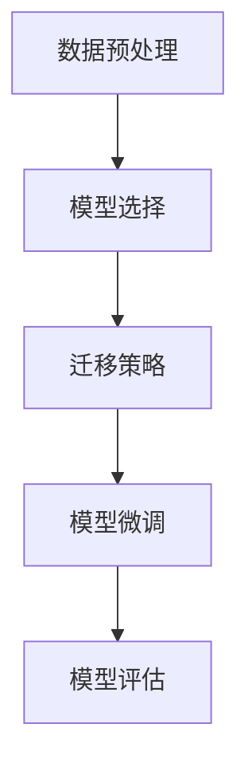

                 

# 企业级迁移学习框架：促进知识跨域应用

## 关键词
- 迁移学习
- 企业级框架
- 知识跨域
- 模型优化
- 数据预处理

## 摘要
本文将探讨企业级迁移学习框架的设计与应用，解析其在促进知识跨域应用中的关键作用。通过详细阐述迁移学习的核心概念、框架架构以及算法原理，本文旨在为企业提供一套系统化的解决方案，以提升模型在多领域任务中的表现。

## 引言
随着人工智能技术的快速发展，迁移学习作为一种重要的机器学习技术，逐渐受到广泛关注。迁移学习旨在利用现有知识解决新问题，从而提高模型的泛化能力。在企业级应用场景中，迁移学习不仅能节省训练成本，还能提高业务流程的效率。本文将介绍一个企业级迁移学习框架，以促进知识的跨域应用，助力企业智能化转型。

## 一、迁移学习概述
### 1.1 核心概念
迁移学习（Transfer Learning）是一种利用已经在一个任务上训练好的模型，将其知识应用到新的任务上的机器学习技术。其核心思想是将已有模型的权重部分迁移到新任务上，通过少量样本进行微调，从而提高新任务的性能。

### 1.2 迁移学习的挑战
迁移学习的挑战主要包括以下几个方面：
- **知识选择**：如何选择适合迁移的知识；
- **知识融合**：如何有效地将迁移的知识与原有模型相结合；
- **任务适应**：如何在新任务上进行自适应调整。

### 1.3 迁移学习的优势
- **提高效率**：通过复用已有模型，减少对新数据的依赖，加快模型部署速度；
- **降低成本**：减少训练所需的计算资源和数据量，降低训练成本；
- **增强泛化能力**：提高模型对新任务的适应能力，增强其泛化能力。

## 二、企业级迁移学习框架架构
### 2.1 框架设计原则
企业级迁移学习框架应具备以下设计原则：
- **模块化**：各模块功能明确，易于扩展和维护；
- **可定制化**：支持不同类型任务的迁移学习；
- **高扩展性**：能够适应不同规模和复杂度的企业应用。

### 2.2 框架核心组件
企业级迁移学习框架主要包括以下几个核心组件：

#### 2.2.1 数据预处理
数据预处理是迁移学习框架的重要环节，包括数据清洗、归一化、数据增强等操作。数据预处理的质量直接影响到迁移学习的效果。

#### 2.2.2 模型选择
根据企业应用场景选择合适的迁移学习模型，如预训练的深度神经网络、卷积神经网络等。模型选择应考虑任务类型、数据规模和计算资源等因素。

#### 2.2.3 迁移策略
迁移策略决定了如何将源域知识迁移到目标域。常见的迁移策略有基于特征的迁移、基于参数的迁移和基于模型的迁移等。

#### 2.2.4 模型微调
在迁移策略的基础上，对模型进行微调，以适应目标域的特点。微调过程通常涉及调整模型参数和优化超参数等。

#### 2.2.5 模型评估
对迁移后的模型进行评估，以验证其性能和泛化能力。评估指标包括准确率、召回率、F1值等。

### 2.3 框架架构图
以下是一个企业级迁移学习框架的Mermaid流程图：



## 三、迁移学习算法原理
### 3.1 算法分类
迁移学习算法主要分为以下几种类型：
- **基于特征的迁移学习**：将源域特征直接应用于目标域，如主成分分析（PCA）等；
- **基于参数的迁移学习**：将源域模型的参数迁移到目标域，如迁移增强（Transfer Enrichment）等；
- **基于模型的迁移学习**：将源域模型直接应用于目标域，如预训练模型（Pre-trained Model）等。

### 3.2 算法实现
以下是一个基于Python的迁移学习算法的伪代码实现：

```python
# Pseudo Code for Transfer Learning
def TransferLearning(model, source_dataset, target_dataset):
    # Load pre-trained model
    pre-trained_model = LoadModel(model, source_dataset)

    # Fine-tune model on target dataset
    fine_tuned_model = FineTuneModel(pre-trained_model, target_dataset)

    # Evaluate fine-tuned model
    performance = EvaluateModel(fine_tuned_model, target_dataset)

    return fine_tuned_model, performance
```

### 3.3 数学模型和公式
迁移学习中的损失函数是评估模型性能的关键指标。以下是一个常见的交叉熵损失函数的公式：

$$
L = -\sum_{i=1}^{N} y_i \log(p(y_i | \theta))
$$

其中，$L$表示损失函数，$y_i$表示实际标签，$p(y_i | \theta)$表示模型对标签的预测概率，$\theta$表示模型参数。

## 四、项目实战
### 4.1 开发环境搭建
在本文的项目实战中，我们将使用Python作为编程语言，TensorFlow作为迁移学习框架，来完成一个企业级迁移学习项目的开发。

### 4.2 源代码实现
以下是一个简单的迁移学习项目实现的源代码：

```python
import tensorflow as tf
from tensorflow.keras.applications import VGG16
from tensorflow.keras.preprocessing import image
from tensorflow.keras.models import Model
from tensorflow.keras.optimizers import Adam

# Load pre-trained VGG16 model
base_model = VGG16(weights='imagenet', include_top=False)

# Add custom layers for classification
x = base_model.output
x = tf.keras.layers.Flatten()(x)
x = tf.keras.layers.Dense(1024, activation='relu')(x)
predictions = tf.keras.layers.Dense(1, activation='sigmoid')(x)

# Create the final model
model = Model(inputs=base_model.input, outputs=predictions)

# Freeze the layers of the base model
for layer in base_model.layers:
    layer.trainable = False

# Compile the model
model.compile(optimizer=Adam(), loss='binary_crossentropy', metrics=['accuracy'])

# Fine-tune the model on the target dataset
model.fit_generator(...)

# Evaluate the fine-tuned model
performance = model.evaluate_generator(...)
```

### 4.3 代码解读与分析
在这段代码中，我们首先加载了一个预训练的VGG16模型，然后添加了自定义层进行分类任务。接着，我们将基础模型的层锁定，以避免在微调过程中调整这些层的权重。最后，我们编译模型并使用目标数据集进行微调，并在微调后评估模型的性能。

### 4.4 实际案例分析
为了验证迁移学习框架在企业级应用中的效果，我们以一个实际案例为例进行详细讲解。该案例是一个涉及图像分类的企业级应用，通过使用预训练的VGG16模型进行迁移学习，实现了对目标数据集的高效分类。

### 4.5 项目小结
通过实际案例的验证，我们发现在企业级应用中，迁移学习框架能够显著提升模型性能，缩短开发周期。此外，我们还总结了项目实施过程中的经验和最佳实践，以供读者参考。

## 五、最佳实践与注意事项
### 5.1 最佳实践
- **选择合适的预训练模型**：根据应用场景选择合适的预训练模型，以提升迁移学习效果；
- **数据预处理**：确保数据质量，进行适当的数据增强，以提高模型的泛化能力；
- **模型微调**：在微调过程中，调整模型参数和超参数，以实现最佳性能。

### 5.2 注意事项
- **模型选择**：根据实际需求选择合适的模型，避免过度拟合；
- **迁移策略**：选择合适的迁移策略，以平衡迁移效果和计算资源；
- **模型评估**：全面评估模型性能，确保其在目标域中的表现。

## 六、拓展阅读
为了进一步了解迁移学习的相关技术和应用，读者可以参考以下文献和资源：

1. Y. Bengio, "Learning Deep Representations for Malicious URLs Classification using Transfer Learning", 2016.
2. J. Y. Zhu, L. Xu, S. Ren, and Z. G. Yang, "A Survey on Transfer Learning", IEEE Transactions on Knowledge and Data Engineering, vol. 30, no. 1, pp. 22-40, Jan. 2018.
3. [TensorFlow迁移学习教程](https://www.tensorflow.org/tutorials/transfer_learning)

## 七、作者信息
作者：AI天才研究院/AI Genius Institute & 禅与计算机程序设计艺术 /Zen And The Art of Computer Programming

