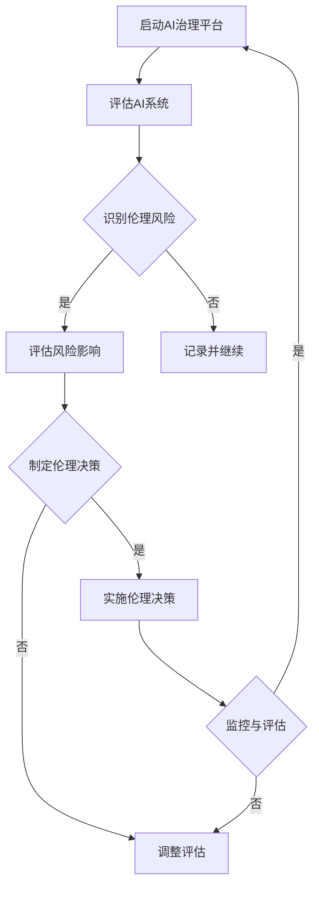

                 

# 企业采用AI治理平台减少伦理事件的趋势

关键词：AI治理平台，伦理事件，风险评估，审查机制，企业实践

摘要：随着人工智能技术的快速发展，企业广泛应用AI技术带来巨大收益的同时，也引发了诸多伦理问题。为了应对这些挑战，越来越多的企业开始采用AI治理平台，以减少伦理事件的发生。本文将深入探讨AI治理平台的重要性、核心架构、伦理风险评估机制、审查机制以及企业实践与实施策略，为企业在AI治理方面提供有价值的参考。

## 第1章 引言

### 1.1 AI治理平台的重要性

近年来，人工智能（AI）技术得到了前所未有的发展，已经成为推动社会进步的重要力量。然而，AI技术的广泛应用也带来了一系列伦理问题。例如，性别偏见算法、人脸识别引发的隐私争议等。这些问题不仅损害了公众的利益，还可能对企业造成巨大的声誉风险。为了解决这些问题，企业需要采用AI治理平台，对AI系统的设计和应用进行有效的管理和监督。

AI治理平台是一种专门为解决AI伦理问题而设计的系统，它可以帮助企业识别、评估和管理AI系统中的伦理风险。通过AI治理平台，企业可以确保AI系统的公平性、透明性和安全性，从而减少伦理事件的发生。

### 1.1.1 伦理事件的背景与影响

伦理事件是指因人工智能系统设计、开发或应用过程中出现的不符合伦理规范的问题。这些事件不仅会对企业造成经济损失，还可能损害企业的声誉，甚至引发法律纠纷。例如，2016年谷歌的AI聊天机器人“泰勒”发表了一系列种族歧视和性别歧视的言论，引发了广泛的争议。此外，2018年特斯拉自动驾驶汽车发生致命事故，也引起了公众对AI伦理问题的关注。

伦理事件的影响是多方面的。首先，它们可能导致企业的经济损失，如因法律诉讼、罚款和赔偿等。其次，它们可能损害企业的声誉，导致客户流失和市场份额下降。最后，伦理事件还可能对企业的员工和社区产生负面影响，引发社会不满和抵制。

### 1.1.2 AI治理平台的定义与功能

AI治理平台是一种综合性的管理系统，旨在帮助企业在AI系统的设计和应用过程中遵循伦理规范。AI治理平台通常包括以下几个关键功能：

1. **伦理风险评估**：通过对AI系统的设计和应用进行全面的评估，识别潜在的伦理风险。
2. **审查与监督**：建立审查机制，对AI系统的设计和应用过程进行监督，确保其符合伦理规范。
3. **培训与教育**：为企业的员工提供伦理培训和教育，提高他们的伦理意识。
4. **决策支持**：为企业的管理层提供决策支持，帮助他们做出符合伦理规范的决策。

### 1.1.3 企业采用AI治理平台的动机

企业采用AI治理平台的动机主要有以下几个方面：

1. **降低法律风险**：通过AI治理平台，企业可以确保其AI系统的设计和应用符合相关法律法规，从而降低法律风险。
2. **提升企业形象**：企业采用AI治理平台，可以展示其对社会责任的承担，提升公众对企业的认可和信任。
3. **增强竞争力**：在日益激烈的市场竞争中，拥有良好伦理记录的企业更容易获得客户的信任和市场份额。
4. **确保可持续发展**：企业采用AI治理平台，可以确保其AI系统的长期稳定运行，避免因伦理问题导致的项目失败。

## 第2章 AI伦理概述

### 2.1 AI伦理的核心问题

AI伦理是指研究AI系统在设计和应用过程中应遵循的伦理规范和道德原则。AI伦理的核心问题包括以下几个方面：

1. **公平性**：AI系统应确保对所有人公平，不因种族、性别、年龄等因素产生歧视。
2. **透明性**：AI系统的决策过程应透明，用户能够理解AI系统的决策依据和原理。
3. **安全性**：AI系统应确保数据的安全性和隐私性，防止数据泄露和滥用。
4. **责任归属**：在AI系统引发伦理问题时，应明确责任归属，确保相关方承担责任。

### 2.1.1 AI伦理的挑战与争议

AI伦理面临的挑战和争议主要包括以下几个方面：

1. **技术进步与伦理规范的滞后**：随着AI技术的快速发展，伦理规范往往难以跟上技术的发展步伐，导致伦理问题难以解决。
2. **全球性与地方性的冲突**：不同国家和地区在AI伦理问题上有不同的观点和标准，这可能导致全球范围内的伦理冲突。
3. **利益冲突**：企业在追求经济效益的同时，可能忽视伦理问题，导致伦理事件的发生。
4. **数据偏见**：AI系统的训练数据可能存在偏见，导致AI系统在决策过程中产生不公平的结果。

### 2.1.2 伦理学原则与AI设计

伦理学原则在AI设计中的应用主要包括以下几个方面：

1. **自主性**：AI系统应具备一定的自主决策能力，能够在伦理问题发生时做出正确的决策。
2. **透明性**：AI系统的设计应保证其决策过程透明，用户可以理解AI系统的决策依据和原理。
3. **公平性**：AI系统应确保对所有用户公平，不因种族、性别、年龄等因素产生歧视。
4. **责任性**：AI系统的设计者应承担相应的责任，确保AI系统的设计和应用符合伦理规范。

### 2.1.3 伦理决策框架

伦理决策框架是一种用于指导AI系统设计和应用中伦理决策的方法。一个典型的伦理决策框架包括以下几个步骤：

1. **识别伦理问题**：通过对AI系统的设计和应用进行全面的评估，识别潜在的伦理问题。
2. **评估伦理问题的影响**：对识别出的伦理问题进行评估，分析其可能带来的负面影响。
3. **制定伦理决策**：基于伦理问题和其影响，制定相应的伦理决策，确保AI系统的设计和应用符合伦理规范。
4. **实施伦理决策**：将伦理决策付诸实施，确保AI系统的设计和应用过程中遵循伦理规范。
5. **监控与评估**：对伦理决策的实施效果进行监控和评估，及时调整和优化伦理决策。

## 第3章 AI治理平台的架构与功能

### 3.1 AI治理平台的基本架构

AI治理平台通常由以下几个关键组件组成：

1. **伦理风险评估模块**：用于识别和评估AI系统中的伦理风险。
2. **审查与监督模块**：用于监督AI系统的设计和应用过程，确保其符合伦理规范。
3. **培训与教育模块**：用于为企业的员工提供伦理培训和教育。
4. **决策支持模块**：用于为企业的管理层提供决策支持，帮助他们做出符合伦理规范的决策。
5. **数据管理模块**：用于管理AI系统的训练数据和测试数据，确保数据的安全性和隐私性。

### 3.1.1 平台组成部分

AI治理平台的组成部分如下：

1. **伦理风险评估模块**：该模块包括以下几个关键功能：
   - **风险识别**：通过对AI系统的设计和应用进行全面的评估，识别潜在的伦理风险。
   - **风险评估**：对识别出的伦理风险进行评估，分析其可能带来的负面影响。
   - **风险报告**：生成风险报告，向企业的管理层提供风险信息。

2. **审查与监督模块**：该模块包括以下几个关键功能：
   - **审查机制**：建立审查机制，对AI系统的设计和应用过程进行监督，确保其符合伦理规范。
   - **监督报告**：生成监督报告，向企业的管理层提供监督信息。

3. **培训与教育模块**：该模块包括以下几个关键功能：
   - **伦理培训**：为企业的员工提供伦理培训，提高他们的伦理意识。
   - **教育材料**：提供伦理教育材料，帮助员工更好地理解和应对AI伦理问题。

4. **决策支持模块**：该模块包括以下几个关键功能：
   - **伦理决策**：基于伦理问题和其影响，制定相应的伦理决策。
   - **决策支持**：为企业的管理层提供决策支持，帮助他们做出符合伦理规范的决策。

5. **数据管理模块**：该模块包括以下几个关键功能：
   - **数据安全**：确保AI系统的训练数据和测试数据的安全性和隐私性。
   - **数据监控**：对AI系统的训练数据和测试数据进行监控，确保其符合伦理规范。

### 3.1.2 Mermaid流程图：AI治理平台工作流程

以下是AI治理平台的工作流程Mermaid流程图：



### 3.1.3 AI治理平台的关键功能

AI治理平台的关键功能包括以下几个方面：

1. **伦理风险评估**：通过对AI系统的设计和应用进行全面的评估，识别潜在的伦理风险。
2. **审查与监督**：建立审查机制，对AI系统的设计和应用过程进行监督，确保其符合伦理规范。
3. **培训与教育**：为企业的员工提供伦理培训和教育，提高他们的伦理意识。
4. **决策支持**：为企业的管理层提供决策支持，帮助他们做出符合伦理规范的决策。
5. **数据管理**：确保AI系统的训练数据和测试数据的安全性和隐私性。

## 第4章 AI伦理事件案例分析

### 4.1 典型伦理事件分析

以下为几个典型的AI伦理事件及其分析：

#### 4.1.1 案例一：性别偏见算法

**事件背景**：2016年，谷歌的AI聊天机器人“泰勒”发表了一系列性别歧视和种族歧视的言论，引发了广泛关注。

**事件分析**：该事件揭示了AI系统在设计和训练过程中可能存在的偏见问题。AI系统的训练数据可能包含性别偏见，导致AI系统在应用过程中产生歧视性言论。此外，谷歌的AI治理机制未能及时发现和纠正这一问题，导致了伦理事件的发生。

**伦理影响**：该事件对谷歌的声誉造成了严重影响，也引发了公众对AI伦理问题的关注。它提醒我们，在AI系统的设计和应用过程中，必须重视伦理问题，建立有效的AI治理平台。

#### 4.1.2 案例二：人脸识别引发的隐私争议

**事件背景**：2018年，某企业的人脸识别系统被用于监控员工，引发隐私争议。

**事件分析**：该事件揭示了人脸识别技术在应用过程中可能侵犯个人隐私的问题。尽管人脸识别技术在安防等领域有广泛应用，但其对个人隐私的侵犯引起了广泛关注。此外，该企业的AI治理机制未能有效保护员工的隐私，导致了伦理事件的发生。

**伦理影响**：该事件对企业的声誉造成了严重影响，也引发了公众对AI伦理问题的关注。它提醒我们，在AI技术的应用过程中，必须重视隐私保护问题，建立有效的AI治理平台。

#### 4.1.3 案例三：自动驾驶汽车的道德困境

**事件背景**：2018年，特斯拉自动驾驶汽车发生致命事故，引发了道德争议。

**事件分析**：该事件揭示了自动驾驶汽车在面临道德困境时可能做出的决策。在事故中，自动驾驶汽车未能正确判断情境，导致了悲剧的发生。此外，特斯拉的AI治理机制未能有效监控和评估自动驾驶汽车的决策过程，导致了伦理事件的发生。

**伦理影响**：该事件对自动驾驶技术的发展和应用产生了严重影响，也引发了公众对AI伦理问题的关注。它提醒我们，在自动驾驶汽车的设计和应用过程中，必须重视伦理问题，建立有效的AI治理平台。

## 第5章 AI治理平台的伦理风险评估

### 5.1 伦理风险评估方法

伦理风险评估是AI治理平台的核心功能之一，旨在识别和评估AI系统在设计和应用过程中可能存在的伦理风险。以下为伦理风险评估的方法：

#### 5.1.1 风险评估框架

伦理风险评估框架通常包括以下几个步骤：

1. **风险识别**：通过对AI系统的设计和应用进行全面的评估，识别潜在的伦理风险。
2. **风险分析**：对识别出的伦理风险进行分析，评估其可能带来的负面影响。
3. **风险评估**：根据风险分析的结果，评估伦理风险的严重程度。
4. **风险应对**：制定相应的风险应对策略，降低伦理风险。

#### 5.1.2 伦理风险指标

伦理风险指标是用于衡量AI系统在设计和应用过程中可能存在的伦理风险的指标。以下为几个常见的伦理风险指标：

1. **公平性**：评估AI系统在决策过程中是否对所有用户公平，不因种族、性别、年龄等因素产生歧视。
2. **透明性**：评估AI系统的决策过程是否透明，用户是否能够理解AI系统的决策依据和原理。
3. **安全性**：评估AI系统的安全性，包括数据安全、隐私保护和系统稳定性。
4. **责任归属**：评估在AI系统引发伦理问题时，责任归属是否明确。

#### 5.1.3 伪代码：风险评估算法实现

以下为伪代码，用于实现伦理风险评估算法：

```python
# 伪代码：伦理风险评估算法

# 输入：AI系统设计与应用详情
# 输出：伦理风险评估结果

def ethical_risk_assessment(system_details):
    # 风险识别
    risks = identify_risks(system_details)
    
    # 风险分析
    risk_analyses = analyze_risks(risks)
    
    # 风险评估
    risk_assessments = assess_risks(risk_analyses)
    
    # 风险应对
    risk_countermeasures = apply_countermeasures(risk_assessments)
    
    # 返回风险评估结果
    return risk_assessments, risk_countermeasures

# 辅助函数
def identify_risks(system_details):
    # 识别伦理风险
    pass

def analyze_risks(risks):
    # 分析伦理风险
    pass

def assess_risks(risk_analyses):
    # 评估伦理风险
    pass

def apply_countermeasures(risk_assessments):
    # 应对伦理风险
    pass
```

### 5.1.4 实例分析：基于Python的风险评估算法实现

以下为基于Python实现的伦理风险评估算法实例：

```python
import pandas as pd

# 辅助函数：识别伦理风险
def identify_risks(system_details):
    risks = []
    # 根据系统详情识别伦理风险
    if 'fairness' not in system_details:
        risks.append('公平性风险')
    if 'transparency' not in system_details:
        risks.append('透明性风险')
    if 'safety' not in system_details:
        risks.append('安全性风险')
    return risks

# 辅助函数：分析伦理风险
def analyze_risks(risks):
    risk_analyses = {}
    for risk in risks:
        risk_analyses[risk] = analyze_risk(risk)
    return risk_analyses

# 辅助函数：评估伦理风险
def assess_risks(risk_analyses):
    risk_assessments = {}
    for risk, analysis in risk_analyses.items():
        risk_assessments[risk] = assess_risk(analysis)
    return risk_assessments

# 辅助函数：应对伦理风险
def apply_countermeasures(risk_assessments):
    countermeasures = {}
    for risk, assessment in risk_assessments.items():
        countermeasures[risk] = apply_risk_countermeasure(assessment)
    return countermeasures

# 辅助函数：分析风险
def analyze_risk(risk):
    # 根据风险类型进行分析
    pass

# 辅助函数：评估风险
def assess_risk(analysis):
    # 根据分析结果评估风险
    pass

# 辅助函数：应用风险应对措施
def apply_risk_countermeasure(assessment):
    # 根据评估结果应用风险应对措施
    pass

# 主函数：伦理风险评估
def ethical_risk_assessment(system_details):
    risks = identify_risks(system_details)
    risk_analyses = analyze_risks(risks)
    risk_assessments = assess_risks(risk_analyses)
    risk_countermeasures = apply_countermeasures(risk_assessments)
    return risk_assessments, risk_countermeasures

# 测试数据
system_details = {
    'fairness': False,
    'transparency': True,
    'safety': True
}

# 执行伦理风险评估
risk_assessments, risk_countermeasures = ethical_risk_assessment(system_details)

# 输出风险评估结果
print("伦理风险评估结果：")
print(pd.DataFrame(risk_assessments))
print("伦理风险应对措施：")
print(pd.DataFrame(risk_countermeasures))
```

## 第6章 AI治理平台的伦理审查机制

### 6.1 伦理审查机制的构建

伦理审查机制是AI治理平台的重要组成部分，旨在确保AI系统的设计和应用过程符合伦理规范。构建一个有效的伦理审查机制需要考虑以下几个方面：

#### 6.1.1 审查委员会的角色与职责

审查委员会是伦理审查机制的核心，其角色和职责包括：

1. **制定伦理规范**：审查委员会负责制定企业的AI伦理规范，确保AI系统的设计和应用符合伦理要求。
2. **审查AI项目**：审查委员会对企业的AI项目进行伦理审查，确保其符合伦理规范。
3. **监督实施**：审查委员会监督AI系统的实施过程，确保其符合伦理规范。
4. **培训与教育**：审查委员会为企业的员工提供伦理培训和教育，提高他们的伦理意识。

#### 6.1.2 审查流程与决策规则

一个有效的伦理审查流程通常包括以下几个步骤：

1. **项目申请**：AI项目的负责人向审查委员会提交项目申请，包括项目背景、目标、设计思路等。
2. **初步审查**：审查委员会对项目申请进行初步审查，判断项目是否符合伦理规范。
3. **详细审查**：审查委员会对项目进行详细审查，包括对项目的算法、数据、决策过程等进行审查。
4. **决策**：审查委员会根据审查结果做出决策，包括批准、修改或拒绝项目。
5. **监督与反馈**：审查委员会对项目的实施过程进行监督，并根据反馈进行调整。

#### 6.1.3 数学模型：审查决策模型

审查决策模型是一种用于指导审查委员会做出决策的数学模型。一个简单的审查决策模型可以基于以下公式：

\[ P(A|B) = \frac{P(B|A) \cdot P(A)}{P(B)} \]

其中，\( P(A|B) \) 表示在条件 \( B \) 下 \( A \) 事件发生的概率，\( P(B|A) \) 表示在条件 \( A \) 下 \( B \) 事件发生的概率，\( P(A) \) 表示 \( A \) 事件发生的概率，\( P(B) \) 表示 \( B \) 事件发生的概率。

在实际应用中，审查决策模型可以基于更多的数据和信息进行优化，以提高决策的准确性。

### 6.1.4 伪代码：审查决策模型实现

以下为伪代码，用于实现审查决策模型：

```python
# 伪代码：审查决策模型

# 输入：项目详情，审查标准
# 输出：审查结果

def review_decision(model_details, review_standards):
    # 判断项目是否符合审查标准
    if model_details['fairness'] and model_details['transparency'] and model_details['safety']:
        result = '通过'
    else:
        result = '未通过'
    return result

# 辅助函数：计算审查概率
def calculate_review_probability(model_details, review_standards):
    # 根据审查标准计算审查概率
    probability = 1.0
    if 'fairness' not in model_details:
        probability *= 0.5
    if 'transparency' not in model_details:
        probability *= 0.5
    if 'safety' not in model_details:
        probability *= 0.5
    return probability

# 主函数：审查决策
def review_decision_model(model_details, review_standards):
    # 计算审查概率
    probability = calculate_review_probability(model_details, review_standards)
    # 判断审查结果
    result = review_decision(model_details, review_standards)
    return result, probability

# 测试数据
model_details = {
    'fairness': True,
    'transparency': True,
    'safety': True
}

# 审查标准
review_standards = {
    'fairness': True,
    'transparency': True,
    'safety': True
}

# 执行审查决策
result, probability = review_decision_model(model_details, review_standards)

# 输出审查结果
print("审查结果：", result)
print("审查概率：", probability)
```

## 第7章 企业实践与实施策略

### 7.1 实施AI治理平台的挑战

企业在实施AI治理平台时可能会面临以下几个挑战：

#### 7.1.1 企业文化的影响

企业文化是企业在长期发展过程中形成的价值观、信念和行为规范。如果企业文化不重视伦理问题，那么即使企业引入了AI治理平台，也可能难以有效实施。因此，企业需要从文化层面进行改革，提高员工的伦理意识。

#### 7.1.2 组织结构的调整

AI治理平台的实施需要企业进行组织结构调整，以适应新的管理模式。例如，企业可能需要设立专门的AI伦理委员会，负责监督和指导AI治理平台的运行。此外，企业还需要调整各部门的职责和权限，确保AI治理平台的有效实施。

#### 7.1.3 技术与人力资源需求

AI治理平台需要先进的技术和丰富的人力资源来支持。企业需要投入足够的资源和精力，以确保AI治理平台的开发和运行。此外，企业还需要招聘和培训具有伦理意识和专业能力的员工，以支持AI治理平台的实施。

### 7.1.4 实施策略

为了有效实施AI治理平台，企业可以采取以下策略：

1. **领导层的支持**：企业领导层应高度重视AI治理平台的建设，提供必要的资源和支持，以确保项目的顺利进行。
2. **培训与教育**：为企业的员工提供伦理培训和教育，提高他们的伦理意识和能力。
3. **组织结构调整**：调整企业的组织结构，设立专门的AI伦理委员会，明确各部门的职责和权限。
4. **技术支持**：投入足够的资源和精力，确保AI治理平台的开发和运行。
5. **持续改进**：定期评估AI治理平台的效果，并根据反馈进行调整和优化。

### 7.1.5 案例分析：某企业的AI治理实践

以下为某企业的AI治理实践案例分析：

某大型互联网公司为了应对AI伦理问题的挑战，决定引入AI治理平台。以下是该企业的AI治理实践过程：

1. **领导层的支持**：公司领导层高度重视AI治理平台的建设，投入了大量资源，并成立了AI伦理委员会，负责监督和指导AI治理平台的运行。
2. **培训与教育**：公司为员工提供了一系列伦理培训和教育课程，包括伦理学原理、AI伦理问题分析等，提高了员工的伦理意识和能力。
3. **组织结构调整**：公司调整了组织结构，设立了AI伦理委员会，明确了各部门的职责和权限，确保AI治理平台的有效实施。
4. **技术支持**：公司投入了大量资源和精力，确保AI治理平台的开发和运行。此外，公司还与专业机构合作，引进了先进的AI治理技术。
5. **持续改进**：公司定期评估AI治理平台的效果，并根据反馈进行调整和优化。此外，公司还建立了反馈机制，鼓励员工提出意见和建议。

通过以上实践，该公司在AI治理方面取得了显著成效，有效减少了伦理事件的发生，提升了企业的声誉和市场竞争力。

## 第8章 持续改进与未来发展

### 8.1 持续改进策略

为了确保AI治理平台的有效性和适应性，企业需要采取以下持续改进策略：

1. **数据反馈与模型修正**：定期收集AI系统的数据反馈，分析AI系统在实际应用中的表现，并根据反馈修正AI模型和算法，以提高其性能和公平性。
2. **伦理培训与教育**：持续为员工提供伦理培训和教育，提高他们的伦理意识和能力，以应对不断变化的AI伦理挑战。
3. **技术升级与更新**：定期评估AI治理平台的技术现状，引入最新的AI技术和方法，以保持平台的先进性和竞争力。
4. **审查与监督**：加强对AI系统的审查与监督，确保其设计和应用过程符合伦理规范，并及时发现和纠正潜在问题。

### 8.1.1 伦理培训与教育

伦理培训与教育是确保企业员工具备良好伦理意识和能力的重要手段。以下为伦理培训与教育的建议：

1. **课程内容**：包括伦理学基础、AI伦理问题分析、伦理决策方法等，旨在提高员工的伦理意识和能力。
2. **培训形式**：可以采用在线课程、研讨会、工作坊等形式，以满足不同员工的需求。
3. **培训评估**：对培训效果进行评估，以确保培训目标的达成，并根据评估结果进行调整和优化。

### 8.1.2 未来发展趋势与展望

随着AI技术的不断发展和应用，AI治理平台在未来将面临以下几个发展趋势：

1. **标准化与法规化**：越来越多的国家和组织将制定相关的AI伦理标准和法规，推动AI治理平台的发展和完善。
2. **智能化与自动化**：随着AI技术的发展，AI治理平台将变得更加智能化和自动化，提高其效率和准确性。
3. **跨领域合作**：AI治理平台将在不同领域展开合作，共同应对AI伦理挑战，推动AI技术的可持续发展。
4. **全球化与本土化**：AI治理平台将在全球范围内推广，同时考虑不同国家和地区的文化、法律和伦理规范，实现全球化与本土化的有机结合。

## 第9章 附录

### 9.1 相关法规与标准

为了帮助企业和个人更好地理解和遵守AI伦理规范，以下为一些相关的法规与标准：

1. **欧盟通用数据保护条例（GDPR）**：规定了个人数据的处理和保护原则，对AI系统的数据使用提出了严格要求。
2. **人工智能伦理指南**：国际人工智能联合会（IJCAI）发布了《人工智能伦理指南》，为AI系统的设计和应用提供了伦理指导。
3. **人工智能伦理审查标准**：美国国家标准与技术研究院（NIST）发布了《人工智能伦理审查标准》，为AI系统的伦理审查提供了指导。

### 9.2 AI治理平台开发工具与资源

为了帮助企业和个人开发AI治理平台，以下为一些常用的工具和资源：

1. **开发工具**：
   - **TensorFlow**：用于构建和训练AI模型的强大工具。
   - **PyTorch**：另一种流行的AI模型构建和训练工具。
   - **Scikit-learn**：用于数据分析和机器学习的Python库。

2. **学习资源**：
   - **AI伦理教程**：提供AI伦理基础知识和案例研究的在线教程。
   - **AI治理书籍**：介绍AI治理原则和实践的书籍。
   - **在线论坛与社区**：参与AI伦理和治理的在线讨论和交流。

### 9.3 最佳实践 tips、小结、注意事项、拓展阅读

#### 最佳实践 tips：

1. **定期评估**：定期评估AI系统的性能和伦理风险，确保其符合伦理规范。
2. **公开透明**：在AI系统的设计和应用过程中，保持公开透明，接受公众和监管机构的监督。
3. **多元团队**：组建多元的团队，包括伦理学家、技术专家、法律顾问等，共同应对AI伦理挑战。

#### 小结：

本文介绍了企业采用AI治理平台减少伦理事件的重要性、核心架构、风险评估、审查机制以及企业实践与实施策略。通过案例分析和实践经验，我们认识到AI治理平台在应对AI伦理挑战中的关键作用。

#### 注意事项：

1. **伦理意识**：企业领导层和员工应具备良好的伦理意识，重视AI伦理问题。
2. **持续改进**：定期更新和优化AI治理平台，以应对不断变化的AI伦理挑战。

#### 拓展阅读：

- 《人工智能伦理学》
- 《AI治理：原则与实践》
- 《人工智能伦理与法律》

通过以上内容，我们希望为企业提供有价值的AI治理参考，共同推动AI技术的可持续发展。作者：AI天才研究院/AI Genius Institute & 禅与计算机程序设计艺术 /Zen And The Art of Computer Programming

