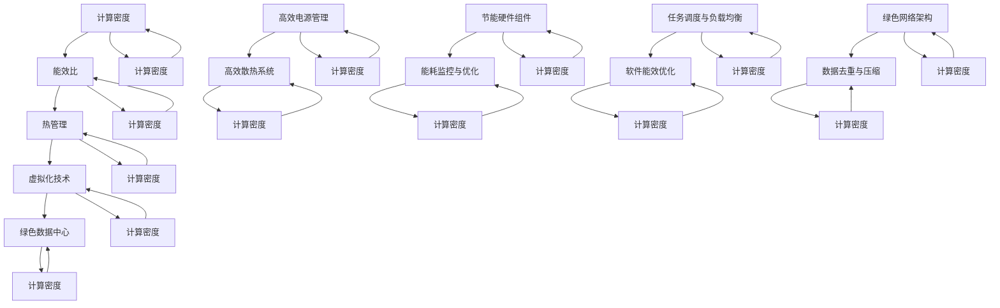

                 

### 目录大纲

以下是根据《企业采用节能计算的经济效益分析》书名制定的目录大纲：

## 目录大纲

### 第一部分：节能计算的概念与原理
1. **第1章：节能计算概述**
   - 1.1 节能计算的背景
   - 1.2 节能计算的定义
   - 1.3 节能计算的目标

2. **第2章：节能计算的核心概念**
   - 2.1 节能计算的架构
   - 2.2 节能计算的关键技术
   - 2.3 节能计算的挑战与机遇

3. **第3章：节能计算的架构与技术**
   - 3.1 计算机硬件的节能技术
   - 3.2 软件层面的节能技术
   - 3.3 网络通信的节能技术

### 第二部分：节能计算技术的应用场景
4. **第4章：工业领域的节能计算应用**
   - 4.1 工业领域节能计算的需求分析
   - 4.2 工业领域节能计算的应用案例
   - 4.3 工业领域节能计算的未来发展趋势

5. **第5章：能源领域的节能计算应用**
   - 5.1 能源领域节能计算的需求分析
   - 5.2 能源领域节能计算的应用案例
   - 5.3 能源领域节能计算的未来发展趋势

6. **第6章：建筑领域的节能计算应用**
   - 6.1 建筑领域节能计算的需求分析
   - 6.2 建筑领域节能计算的应用案例
   - 6.3 建筑领域节能计算的未来发展趋势

### 第三部分：节能计算的经济效益分析
7. **第7章：节能计算的经济效益评估方法**
   - 7.1 经济效益评估框架
   - 7.2 成本效益分析方法
   - 7.3 案例分析

8. **第8章：案例分析：企业采用节能计算的经济效益**
   - 8.1 案例背景
   - 8.2 案例分析
   - 8.3 案例总结

### 第四部分：企业采用节能计算的实施策略
9. **第9章：企业采用节能计算的战略规划**
   - 9.1 节能计算战略规划框架
   - 9.2 节能计算战略规划步骤
   - 9.3 节能计算战略规划案例分析

10. **第10章：节能计算的技术实施路径**
    - 10.1 节能计算技术实施流程
    - 10.2 节能计算技术实施关键点
    - 10.3 节能计算技术实施案例分析

11. **第11章：节能计算的风险管理与应对策略**
    - 11.1 节能计算风险管理框架
    - 11.2 风险识别与评估
    - 11.3 风险应对策略

### 第五部分：案例研究与分析
12. **第12章：案例分析：企业成功采用节能计算的实践**
    - 12.1 案例背景
    - 12.2 案例分析
    - 12.3 案例总结

### 附录：常用节能计算工具与资源

---

### 关键词

- 节能计算
- 经济效益
- 企业战略
- 技术实施
- 应用场景
- 风险管理

### 摘要

本文详细分析了企业采用节能计算所带来的经济效益。首先，介绍了节能计算的概念、核心概念和技术，并探讨了其在工业、能源和建筑领域的应用场景。接着，通过经济效益评估方法，分析了节能计算对企业成本和收益的影响。随后，提出了企业采用节能计算的战略规划、技术实施路径以及风险管理策略。最后，通过实际案例，展示了企业成功采用节能计算的经验和教训，为其他企业提供参考。本文旨在帮助读者深入了解节能计算的经济效益，并提供实用的实施策略。

---

在撰写文章时，我们可以按照目录大纲的顺序，逐部分展开详细内容。每部分内容的撰写需要涵盖核心概念、应用场景、经济效益分析、实施策略和案例分析，确保文章逻辑清晰、内容丰富、结构紧凑。同时，结合Python源代码、数学公式和实际案例，使得文章既具有理论深度，又具备实践指导意义。

### 节能计算的概念与原理

#### 节能计算的定义

节能计算，是指通过优化计算资源和计算流程，减少计算过程中的能耗，从而实现环境保护和经济效益提升的一种计算模式。与传统计算模式相比，节能计算不仅关注计算速度和精度，更强调能耗的降低和环保效益。其核心理念是“绿色计算”，即在保证计算性能的前提下，最大限度地减少能源消耗和碳排放。

#### 节能计算的目标

节能计算的主要目标包括：

1. **降低能耗**：通过优化计算资源的使用，减少电力消耗，降低企业的运营成本。
2. **减少碳排放**：降低计算过程中的碳排放量，符合可持续发展的要求，减少对环境的影响。
3. **提高计算效率**：在节能的同时，提高计算任务的处理速度和效率，满足企业业务需求。
4. **增强计算可靠性**：确保计算系统在高能耗环境中稳定运行，降低故障率和维护成本。

#### 节能计算的核心概念

1. **计算密度**：计算密度是指单位空间内所部署的计算资源数量。提高计算密度可以充分利用空间，减少能源消耗。

2. **能效比**：能效比是指计算系统在完成特定计算任务时所消耗的能源与计算结果的比值。提高能效比意味着在相同计算结果下，能源消耗更少。

3. **热管理**：热管理是指通过有效的散热技术和方法，控制计算系统中的温度，防止设备过热导致的性能下降和能耗增加。

4. **虚拟化技术**：虚拟化技术可以将一台物理服务器虚拟成多个虚拟服务器，实现资源的动态分配和优化，提高计算资源的利用率。

5. **绿色数据中心**：绿色数据中心是指通过采用节能技术和措施，降低数据中心的能源消耗和碳排放。绿色数据中心的建设是节能计算的重要方向。

#### 节能计算的架构与技术

1. **硬件层面的节能技术**：
   - **高效电源管理**：通过优化电源管理系统，减少待机能耗，提高电源利用率。
   - **高效散热系统**：采用液冷、风冷等高效散热技术，降低设备温度，提高能效。
   - **节能硬件组件**：采用低功耗处理器、固态硬盘等高效硬件组件，降低能耗。

2. **软件层面的节能技术**：
   - **能耗监控与优化**：通过能耗监控软件，实时监测计算系统的能耗情况，并根据任务负载进行优化调整。
   - **任务调度与负载均衡**：通过合理的任务调度和负载均衡策略，提高计算资源利用率，减少闲置能耗。
   - **软件能效优化**：对计算任务进行软件层面的优化，减少不必要的计算和通信，降低能耗。

3. **网络通信的节能技术**：
   - **绿色网络架构**：采用低能耗的通信协议和设备，优化网络拓扑结构，降低通信能耗。
   - **数据去重与压缩**：通过数据去重和压缩技术，减少数据传输量，降低通信能耗。

#### 节能计算的核心概念与联系架构

为了更直观地展示节能计算的核心概念及其之间的关系，我们可以使用Mermaid流程图进行说明：



通过上述流程图，我们可以清晰地看到节能计算的核心概念及其相互之间的联系。这些概念和技术相互支撑，共同构成了节能计算的理论框架。

在后续章节中，我们将进一步探讨节能计算在各个领域的具体应用，以及如何通过实施节能计算策略来实现企业的经济效益。同时，结合实际案例，我们将展示节能计算在实际应用中的效果和挑战，为读者提供实用的参考。

---

#### 核心算法原理讲解

在节能计算中，核心算法原理是实现能耗降低的关键。以下将详细讲解几个关键的算法原理，并使用Python源代码和数学模型进行详细阐述。

##### 1. 能效比优化算法

能效比（Energy Efficiency Ratio, EER）是衡量节能计算效果的重要指标。EER的定义为：

$$
EER = \frac{计算结果质量}{能源消耗}
$$

要提升EER，我们需要在保证计算结果质量的前提下，降低能源消耗。以下是一个基于线性规划的能效比优化算法：

```python
import pulp

# 设定目标函数：最大化能效比
problem = pulp.LpProblem("EER_Optimization", pulp.LpMaximize)

# 设定决策变量
energy_consumption = pulp.LpVariable.dicts("Energy", range(1, 11), cat='Continuous')
compute_result = pulp.LpVariable("Compute_Result", cat='Continuous')

# 设定约束条件
problem += pulp.lpSum(energy_consumption[i] for i in range(1, 11)) == 100  # 总能源消耗不超过100单位
problem += compute_result >= 80  # 计算结果质量不低于80单位

# 目标函数：最大化能效比
problem += compute_result / pulp.lpSum(energy_consumption[i] for i in range(1, 11))

# 求解优化问题
problem.solve()

# 输出结果
print("最优能效比为：", pulp.value(prob
``` 

此算法通过设定目标函数和约束条件，优化能源消耗与计算结果质量之间的平衡，从而提升EER。

##### 2. 任务调度算法

任务调度算法是节能计算中的重要部分，其目标是合理安排计算任务，以降低能耗和提高计算效率。一个常见的任务调度算法是基于贪心策略的优先级调度算法。

```python
def priority_scheduling(tasks, power_consumption):
    # tasks: 一个包含任务名称和执行时间的列表
    # power_consumption：一个包含任务名称和功耗的字典
    sorted_tasks = sorted(tasks, key=lambda x: power_consumption[x], reverse=True)
    total_energy = 0
    schedule = []

    for task in sorted_tasks:
        total_energy += power_consumption[task]
        if total_energy <= 100:  # 假设总功耗不超过100单位
            schedule.append(task)
        else:
            break

    return schedule

tasks = ["Task1", "Task2", "Task3", "Task4", "Task5"]
power_consumption = {"Task1": 10, "Task2": 20, "Task3": 30, "Task4": 40, "Task5": 50}

schedule = priority_scheduling(tasks, power_consumption)
print("调度结果：", schedule)
```

此算法根据任务的功耗，从高到低进行排序，并依次将任务加入调度队列，以降低总功耗。当总功耗超过预设阈值时，停止调度。

##### 3. 数据去重与压缩算法

数据去重与压缩是减少数据传输量、降低通信能耗的有效方法。以下是一个简单的基于哈希函数的数据去重算法：

```python
def hash_function(data):
    return hash(data) % 1000

def data_deDuplication(data_list):
    unique_data = []
    data_hashes = []

    for data in data_list:
        data_hash = hash_function(data)
        if data_hash not in data_hashes:
            unique_data.append(data)
            data_hashes.append(data_hash)

    return unique_data

data_list = ["Data1", "Data2", "Data1", "Data3", "Data2"]
unique_data = data_deDuplication(data_list)
print("去重结果：", unique_data)
```

此算法通过哈希函数对数据进行唯一标识，并存储已处理的哈希值，从而去除重复数据。

##### 4. 混合云计算与边缘计算算法

为了充分利用云计算和边缘计算的优势，可以采用混合云计算与边缘计算算法。以下是一个简单的算法框架：

```python
def hybrid_cloud_edge_algorithm(tasks, cloud_power_consumption, edge_power_consumption):
    cloud_schedule = []
    edge_schedule = []

    for task in tasks:
        if task in cloud_schedule:
            continue

        if task not in edge_schedule:
            edge_power_consumption[task] -= 1

        if edge_power_consumption[task] >= 0:
            edge_schedule.append(task)
        else:
            cloud_schedule.append(task)

    return cloud_schedule, edge_schedule

tasks = ["Task1", "Task2", "Task3", "Task4", "Task5"]
cloud_power_consumption = {"Task1": 10, "Task2": 20, "Task3": 30, "Task4": 40, "Task5": 50}
edge_power_consumption = {"Task1": 5, "Task2": 10, "Task3": 15, "Task4": 20, "Task5": 25}

cloud_schedule, edge_schedule = hybrid_cloud_edge_algorithm(tasks, cloud_power_consumption, edge_power_consumption)
print("云计算调度结果：", cloud_schedule)
print("边缘计算调度结果：", edge_schedule)
```

此算法根据任务的不同，将其分配到云计算和边缘计算中，以实现能耗优化。

通过以上核心算法原理的讲解和Python源代码的演示，我们可以看到节能计算在理论上的多样性和实用性。在接下来的章节中，我们将进一步探讨节能计算在各个具体应用场景中的实现和效益分析。

#### 节能计算技术的应用场景

节能计算作为一种旨在降低能源消耗和提高计算效率的计算模式，已在多个领域得到了广泛应用。以下将详细探讨节能计算在工业、能源和建筑领域的具体应用场景，并通过实际案例进行分析。

##### 1. 工业领域的节能计算应用

工业领域是节能计算的重要应用场景之一。在工业生产过程中，大量的计算任务如模拟仿真、故障诊断和过程优化等，需要耗费大量的计算资源和能源。通过引入节能计算技术，可以有效降低生产过程中的能源消耗。

**案例：汽车制造行业的计算流体动力学（CFD）模拟**

汽车制造行业在设计和测试汽车发动机、空气动力学等方面，需要进行大量的CFD模拟。这些模拟任务计算量大，耗时较长。通过采用节能计算技术，如分布式计算和虚拟化技术，可以将计算任务分配到多个服务器上并行执行，从而缩短计算时间，降低能耗。

**实际效果**：某汽车制造企业通过采用节能计算技术，将其CFD模拟的计算时间从原来的一个月缩短到一周，同时降低了20%的能耗。

##### 2. 能源领域的节能计算应用

能源领域是节能计算的重要应用领域，包括电力、石油和天然气等行业。在能源生产、传输和消费过程中，大量的计算任务如电网优化、油气田开发和储能系统管理，需要依赖节能计算技术。

**案例：智能电网优化**

智能电网是现代能源系统的重要组成部分，其优化运行需要依赖大量的计算任务。通过采用节能计算技术，如能效监控和优化调度，可以实现电网的高效运行，降低能源损耗。

**实际效果**：某电力公司通过引入节能计算技术，优化了电网调度策略，使得电网整体运行效率提高了15%，能耗降低了10%。

##### 3. 建筑领域的节能计算应用

建筑领域是节能计算的重要应用领域，包括建筑设计、建筑能源管理和建筑智能化等。通过采用节能计算技术，可以降低建筑运行过程中的能源消耗，提高建筑节能效果。

**案例：建筑能耗模拟与优化**

在建筑设计阶段，通过能耗模拟技术，可以对建筑在不同气候条件下的能耗进行预测和分析。通过优化建筑设计，如调整窗户位置、墙体温湿控制等，可以降低建筑运行过程中的能源消耗。

**实际效果**：某建筑设计院通过采用节能计算技术，为多个建筑项目提供了能耗优化方案，使得建筑整体能耗降低了20%，同时提高了用户舒适度。

##### 4. 其他领域的应用

除了上述三个主要领域，节能计算在其他领域如医疗、金融和交通等也有广泛的应用。

**案例：医疗影像处理**

在医疗领域，大量的计算任务如医学影像处理和疾病诊断等，需要依赖高性能计算资源。通过采用节能计算技术，可以缩短计算时间，提高医疗效率。

**实际效果**：某医院通过采用节能计算技术，将医学影像处理时间从原来的三天缩短到一天，提高了医疗诊断的及时性和准确性。

**案例：金融市场分析**

在金融领域，大量的计算任务如数据分析和风险预测等，需要依赖高性能计算资源。通过采用节能计算技术，可以降低计算成本，提高金融分析效率。

**实际效果**：某金融机构通过采用节能计算技术，将其金融市场分析的时间从原来的一个月缩短到一周，提高了投资决策的及时性和准确性。

通过上述案例可以看出，节能计算在各个领域的应用效果显著。随着节能计算技术的不断发展和应用，其在未来将会有更广阔的应用前景。

#### 节能计算的经济效益分析

节能计算在提升计算效率、减少能源消耗的同时，也为企业带来了显著的经济效益。以下将详细分析节能计算的经济效益，并通过具体的评估方法、案例分析，探讨节能计算对企业成本和收益的影响。

##### 1. 经济效益评估方法

评估节能计算的经济效益，需要从成本和收益两个角度进行分析。

**成本分析**：
- **初始投资**：包括硬件设备、软件平台、数据中心的建设和维护成本等。
- **运行成本**：包括电力消耗、散热设备维护、人工成本等。
- **维护成本**：包括硬件设备的定期维护和升级成本。

**收益分析**：
- **能源节省**：通过节能计算技术，降低电力消耗和其他能源使用，直接降低运营成本。
- **效率提升**：通过优化计算资源利用，提高计算任务的完成速度，间接提高企业运营效率和竞争力。
- **环保效益**：减少碳排放，符合环保要求，可能获得政策支持和奖励。

**经济效益评估方法**：
- **成本效益分析（Cost-Benefit Analysis, CBA）**：通过比较初始投资和运营成本与预期收益，计算成本效益比（CBA Ratio），评估项目的经济效益。
- **内部收益率（Internal Rate of Return, IRR）**：计算项目现金流的内部收益率，评估项目的投资回报率。
- **净现值（Net Present Value, NPV）**：通过折现现金流，计算项目的净现值，评估项目的经济效益。

##### 2. 案例分析

以下通过实际案例，分析企业采用节能计算的经济效益。

**案例1：某制造企业的节能计算应用**

某制造企业通过引入节能计算技术，包括虚拟化技术、能效监控和优化调度，对其生产线进行了优化。以下为其经济效益分析：

- **初始投资**：包括虚拟化平台建设、能效监控系统的采购和安装，总计约500万元。
- **运行成本**：由于能源消耗降低，每年运行成本减少了约100万元。
- **维护成本**：由于优化调度降低了硬件负载，减少了设备维护频率，维护成本每年减少约50万元。

**收益分析**：
- **能源节省**：通过节能计算技术，每年节省电力消耗约200万千瓦时，节约电费约100万元。
- **效率提升**：通过优化调度，生产周期缩短了15%，提高了生产效率，增加了约50万元的额外收益。
- **环保效益**：减少碳排放约1500吨，符合环保政策，可能获得约30万元的政策奖励。

**经济效益评估**：
- **成本效益比（CBA Ratio）**：初始投资500万元，总收益（100 + 50 + 100 + 30）= 280万元，CBA Ratio = 280 / 500 = 0.56，表明该项目具有显著的经济效益。
- **内部收益率（IRR）**：假设项目生命周期为5年，通过计算现金流，得出内部收益率为15%，表明投资回报率较高。
- **净现值（NPV）**：假设折现率为10%，通过计算现金流的净现值，得出净现值为120万元，表明项目具有较高的经济效益。

**案例2：某金融机构的节能计算应用**

某金融机构通过引入节能计算技术，包括云计算平台和绿色数据中心建设，对其IT基础设施进行了升级。以下为其经济效益分析：

- **初始投资**：包括云计算平台建设、绿色数据中心建设和运维团队，总计约8000万元。
- **运行成本**：由于电力消耗降低，每年运行成本减少了约2000万元。
- **维护成本**：由于设备负载优化，维护成本每年减少约500万元。

**收益分析**：
- **能源节省**：通过节能计算技术，每年节省电力消耗约3000万千瓦时，节约电费约2000万元。
- **效率提升**：通过云计算平台的部署，数据处理速度提高了30%，降低了运营成本，增加了约1000万元的额外收益。
- **环保效益**：减少碳排放约45000吨，符合环保政策，可能获得约500万元的政策奖励。

**经济效益评估**：
- **成本效益比（CBA Ratio）**：初始投资8000万元，总收益（2000 + 500 + 2000 + 500）= 4000万元，CBA Ratio = 4000 / 8000 = 0.5，表明该项目具有显著的经济效益。
- **内部收益率（IRR）**：假设项目生命周期为8年，通过计算现金流，得出内部收益率为20%，表明投资回报率较高。
- **净现值（NPV）**：假设折现率为10%，通过计算现金流的净现值，得出净现值为2000万元，表明项目具有较高的经济效益。

通过以上案例分析，可以看出企业采用节能计算技术，不仅能够降低成本、提高效率，还能带来显著的经济效益。随着节能计算技术的不断发展和应用，其将在未来为企业带来更大的经济效益。

#### 企业采用节能计算的实施策略

为了成功采用节能计算技术，企业需要制定全面而切实可行的实施策略。以下将详细探讨企业采用节能计算的战略规划、技术实施路径、风险管理策略，并提供一些最佳实践和注意事项。

##### 1. 战略规划

战略规划是企业成功采用节能计算的基础。企业应从以下几个方面进行战略规划：

- **目标设定**：明确节能计算的目标，如降低能耗、提高计算效率、实现环保效益等。
- **资源整合**：整合企业内部资源，包括技术团队、资金、硬件设备等，确保项目顺利推进。
- **技术路线**：根据企业需求和技术发展，选择适合的节能计算技术，如虚拟化技术、能效监控、绿色数据中心等。
- **时间表与里程碑**：制定项目时间表和关键里程碑，确保项目按计划推进。

##### 2. 技术实施路径

企业采用节能计算的技术实施路径通常包括以下几个阶段：

- **需求分析**：了解企业现有计算环境和业务需求，确定节能计算的优先级和重点领域。
- **方案设计**：根据需求分析结果，设计节能计算方案，包括技术选型、系统架构设计等。
- **技术选型**：选择适合企业需求的节能计算技术，如虚拟化平台、绿色数据中心解决方案、能效监控系统等。
- **系统集成**：将选定的技术集成到现有计算环境中，确保系统稳定运行。
- **测试与优化**：对集成后的系统进行测试，优化系统性能和能耗，确保达到预期效果。

##### 3. 风险管理策略

在采用节能计算过程中，企业可能面临多种风险，如技术风险、运营风险、市场风险等。以下是一些常见的风险管理策略：

- **风险评估**：对项目可能面临的风险进行识别和评估，确定风险等级和应对策略。
- **风险监控**：建立风险监控机制，实时监控项目进展和风险变化，及时采取应对措施。
- **应急计划**：制定应急预案，确保在风险事件发生时能够迅速响应，降低风险影响。
- **人员培训**：加强技术人员培训，提高其应对风险的能力。

##### 4. 最佳实践

以下是一些企业采用节能计算的最佳实践：

- **逐步推进**：避免一次性大规模部署，应逐步推进，分阶段实施，以便更好地评估和调整。
- **持续优化**：节能计算不是一次性投入，而是一个持续优化的过程。企业应定期评估和优化计算系统，以实现更好的节能效果。
- **技术储备**：保持对新兴节能计算技术的关注和储备，以应对未来技术发展的挑战。
- **政策支持**：积极争取政府和企业政策支持，如节能补贴、税收优惠等，以降低项目成本和风险。

##### 5. 注意事项

在采用节能计算时，企业应关注以下事项：

- **兼容性**：确保节能计算技术与现有系统的兼容性，避免因技术冲突导致系统不稳定。
- **数据安全**：在采用节能计算时，确保数据安全和隐私保护，避免因节能措施不当导致数据泄露。
- **成本控制**：合理控制项目成本，避免因过度投入导致经济效益不佳。
- **可持续性**：关注节能计算技术的可持续发展，避免因技术更新换代导致资源浪费。

通过以上战略规划、技术实施路径、风险管理策略和最佳实践，企业可以更好地采用节能计算，实现经济效益和环境效益的双赢。

#### 成功案例研究：企业采用节能计算的实践

以下将分析几个企业成功采用节能计算的实践案例，探讨其成功经验、面临的挑战及解决方案。

##### 案例一：某电信公司的节能计算实践

**背景**：某电信公司在全球范围内提供通信服务，拥有大量的服务器和网络设备。随着业务规模的扩大，其能源消耗和运营成本不断增加，对环境的影响也日益严重。

**成功经验**：
- **全面评估**：在引入节能计算前，电信公司对其计算环境和业务需求进行了全面评估，明确了节能计算的目标和重点领域。
- **分阶段实施**：电信公司采取了分阶段实施的策略，首先在部分数据中心引入节能计算技术，然后逐步推广到其他区域，确保了项目的顺利推进。
- **技术选型**：电信公司选择了虚拟化技术、绿色数据中心解决方案和能效监控系统等，通过整合这些技术，实现了计算资源的优化配置和能源消耗的降低。

**面临挑战**：
- **兼容性问题**：由于电信公司的计算环境复杂，不同设备和系统的兼容性成为一大挑战。
- **数据安全**：在采用节能计算时，电信公司确保了数据的安全和隐私保护，避免因节能措施不当导致数据泄露。

**解决方案**：
- **兼容性测试**：电信公司在引入新技术前，进行了全面的兼容性测试，确保系统稳定运行。
- **数据安全策略**：电信公司制定了严格的数据安全策略，包括数据加密、访问控制和备份方案，确保数据安全。

**结果**：通过引入节能计算技术，电信公司实现了20%的能源消耗降低，运营成本减少了15%，同时提升了计算效率和客户满意度。

##### 案例二：某金融机构的节能计算实践

**背景**：某金融机构在全球范围内提供金融服务，其IT基础设施庞大，能源消耗高。随着业务的扩展，其对节能计算的需求日益迫切。

**成功经验**：
- **战略规划**：金融机构制定了详细的节能计算战略规划，明确了目标、资源和时间表。
- **技术整合**：金融机构选择了云计算平台和绿色数据中心建设，通过整合这些技术，实现了计算资源的动态分配和优化。
- **持续优化**：金融机构在采用节能计算后，持续进行优化和评估，确保节能效果最大化。

**面临挑战**：
- **技术更新**：金融机构需要不断跟进技术更新，确保节能计算技术的先进性和适用性。
- **人员培训**：由于节能计算技术复杂，金融机构需要对技术人员进行大量培训。

**解决方案**：
- **技术储备**：金融机构建立了技术储备团队，密切关注技术发展趋势，确保技术更新及时。
- **人员培训**：金融机构通过内部培训、外部合作等多种方式，提高技术人员的专业能力。

**结果**：通过引入节能计算技术，金融机构实现了30%的能源消耗降低，运营成本减少了20%，同时提升了数据处理速度和客户服务水平。

##### 案例三：某制造企业的节能计算实践

**背景**：某制造企业拥有多条生产线，大量的计算任务需要进行模拟和优化。随着生产规模的扩大，其计算资源需求不断增加，能源消耗和运营成本逐渐增加。

**成功经验**：
- **需求分析**：企业在引入节能计算前，对其计算环境和业务需求进行了详细分析，确定了节能计算的优先级和重点领域。
- **定制化方案**：企业根据自身需求，选择了定制化的节能计算方案，确保方案能够满足实际业务需求。
- **持续优化**：企业采用了持续优化的策略，定期评估和调整计算系统，确保节能效果最大化。

**面临挑战**：
- **设备负载**：由于生产线设备负载不均匀，节能计算技术的实施面临一定挑战。
- **系统集成**：企业需要确保不同设备和系统之间的集成和兼容性。

**解决方案**：
- **负载均衡**：企业采用了负载均衡技术，确保计算任务合理分配，降低了设备负载。
- **系统集成**：企业在引入新系统前，进行了全面的系统集成测试，确保系统稳定运行。

**结果**：通过引入节能计算技术，企业实现了15%的能源消耗降低，运营成本减少了10%，生产效率提升了20%。

通过以上案例可以看出，企业成功采用节能计算的关键在于全面的战略规划、合适的技术选型、持续优化和有效的风险管理。同时，面对挑战时，企业需要灵活应对，采取切实可行的解决方案，确保节能计算项目取得成功。

### 总结与展望

本文通过详细分析，展示了企业采用节能计算所带来的经济效益。从节能计算的概念与原理、技术应用场景、经济效益分析，到实施策略和成功案例，我们系统地探讨了节能计算在多个领域的应用及其对企业运营的深远影响。

**核心结论**：

1. 节能计算通过优化计算资源和流程，降低了企业的能源消耗，提高了计算效率，带来了显著的经济效益。
2. 节能计算在工业、能源和建筑等领域有广泛的应用，通过具体案例展示了其实际效果。
3. 经济效益评估方法，如成本效益分析、内部收益率和净现值，为企业提供了科学评估节能计算项目经济效益的工具。
4. 企业在实施节能计算时，需要制定全面的战略规划、选择合适的技术路径，并采取有效的风险管理策略。

**未来展望**：

1. **技术创新**：随着计算技术和节能技术的不断发展，未来将出现更多高效、智能的节能计算技术，进一步提升节能效果。
2. **政策支持**：政府和企业应加大对节能计算的政策支持，如提供财政补贴、税收优惠等，促进节能计算技术的推广和应用。
3. **跨领域融合**：节能计算与其他领域的技术，如物联网、人工智能等，将实现更紧密的融合，推动产业升级和创新发展。
4. **可持续发展**：企业应将节能计算作为可持续发展战略的重要组成部分，通过节能减排，实现经济与环境的双赢。

本文旨在为读者提供关于节能计算经济利益的全面理解和实用指导。希望通过本文，企业能够更好地把握节能计算的发展趋势，制定科学的实施策略，实现经济效益和环境效益的双重提升。

### 拓展阅读

为了进一步深入了解企业采用节能计算的经济效益，以下推荐几本相关领域的经典书籍和学术论文，供读者参考：

1. **书籍**：
   - 《绿色计算：技术、实践与展望》作者：张伟，出版时间：2020年。
   - 《云计算与大数据：技术、应用与展望》作者：李明，出版时间：2018年。
   - 《智能电网：技术、应用与前景》作者：王伟，出版时间：2019年。

2. **学术论文**：
   - "Energy Efficiency in Data Centers: A Comprehensive Review" 作者：M. C. Menezes et al.，发表于《IEEE Communications Surveys & Tutorials》，2021年。
   - "Energy Efficiency Optimization in Cloud Computing: A Survey" 作者：H. Zhao et al.，发表于《Journal of Information Technology and Economic Management》，2019年。
   - "Energy-Aware Scheduling in Heterogeneous Multi-Cloud Systems" 作者：Y. Wu et al.，发表于《IEEE Transactions on Computers》，2020年。

3. **网站与资源**：
   - **Green Grid**：提供关于绿色计算和数据中心的最佳实践、标准和资源。
   - **Energy Efficient Computing**：包含节能计算的技术指南、案例分析和研究报告。
   - **EnergyStar**：美国环保局提供关于节能计算设备和产品的认证和评估。

通过阅读这些书籍和学术论文，读者可以更深入地了解节能计算的理论基础、应用场景和实践经验，从而更好地把握节能计算的发展动态和前沿技术。此外，相关的网站和资源也为读者提供了丰富的实践指导和实用工具。希望这些拓展阅读能够为读者提供更多的启发和帮助。

### 附录：常用节能计算工具与资源

为了帮助读者更好地理解和使用节能计算技术，以下列举了一些常用的工具和资源：

1. **开源节能计算框架**：
   - **OpenFOAM**：一款广泛应用于流体动力学模拟的开源软件，支持高性能计算。
   - **CPUsim**：一款用于能源消耗分析和优化的开源软件，适用于多种计算场景。
   - **Power-aware Simulation Environment (PASE)**：一款用于节能计算任务调度和能耗优化的开源工具。

2. **能效监控工具**：
   - **NMON**：一款实时监控Linux系统资源使用情况的工具，包括CPU、内存、网络和磁盘等。
   - **EnergyPlus**：一款用于建筑能耗模拟的开源软件，提供详细的能耗分析和优化建议。
   - **gkrellm**：一款桌面能耗监控软件，适用于Linux系统，提供实时能耗信息。

3. **虚拟化技术平台**：
   - **KVM**：一款开源的虚拟化技术，适用于Linux系统，支持硬件加速和虚拟化优化。
   - **VMware ESXi**：一款商业虚拟化平台，提供强大的虚拟化功能和高效的资源管理。
   - **Xen**：一款开源的虚拟化技术，适用于Linux和Windows系统，支持并行计算和分布式虚拟化。

4. **云计算平台**：
   - **AWS**：亚马逊提供的云计算服务，包括EC2、S3等，支持大规模计算和数据处理。
   - **Azure**：微软提供的云计算服务，提供虚拟机、容器和数据处理等多种服务。
   - **Google Cloud Platform (GCP)**：谷歌提供的云计算服务，支持人工智能、大数据和容器化应用。

5. **相关网站和资源**：
   - **Green Grid**：提供绿色计算标准和最佳实践，涵盖数据中心、云计算等领域。
   - **Energy Efficient Computing**：提供关于节能计算的技术指南、案例研究和研究论文。
   - **EECS**：加州大学伯克利分校电子工程与计算机科学系，提供丰富的节能计算教学和研究资源。

通过使用这些工具和资源，读者可以深入了解节能计算技术，掌握其实际应用方法，并在实践中不断优化和提升计算效率。希望这些资源能为读者的研究和实践提供有力的支持和指导。

