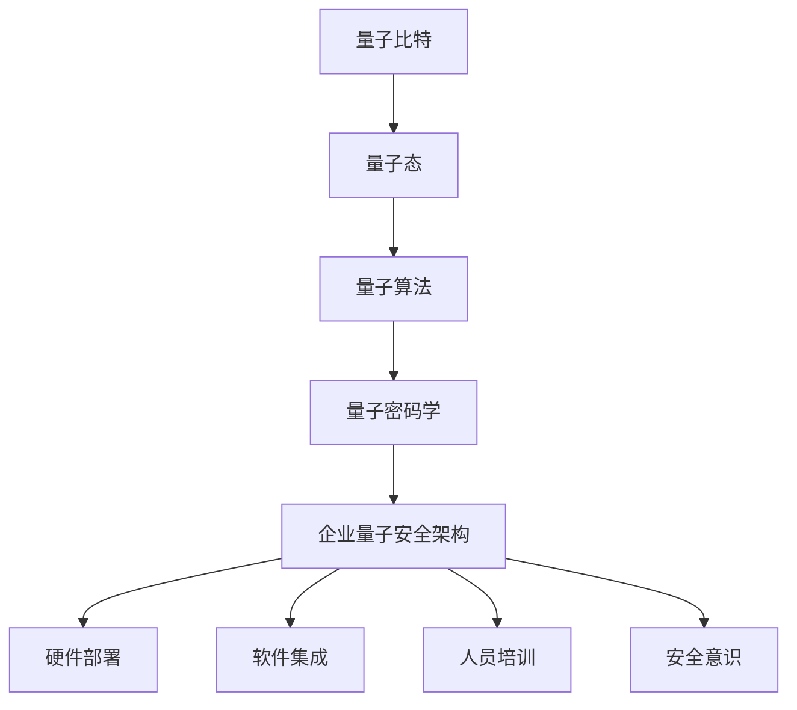
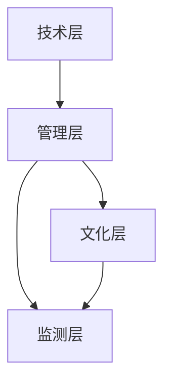

                 

### 引言

在现代信息社会中，数据安全对于企业而言至关重要。随着量子计算技术的不断发展，传统的加密算法正在面临前所未有的威胁。量子计算以其巨大的计算能力，可以轻松破解目前广泛使用的对称加密和非对称加密算法，因此，量子安全成为了信息安全领域的热点话题。对于企业而言，如何确保其数据在量子计算时代的安全，成为一个亟待解决的问题。

企业量子安全评估是一项系统性的工程，它不仅涉及到对现有信息安全体系的评估，还需要构建一套适应量子计算时代的安全策略和更新机制。本文旨在为企业提供一套全面的量子安全评估指南，包括定期检查和更新机制的设计。通过本文的介绍，读者可以了解量子安全的背景、核心概念、评估流程，以及如何实施定期检查和更新机制。

本文的结构如下：

- **第一部分：企业量子安全概述**，介绍量子安全的基本概念，以及企业量子安全的必要性和重要性。
- **第二部分：基础知识**，讲解量子信息科学的基础，包括量子比特、量子算法和量子密码学。
- **第三部分：企业量子安全框架**，阐述企业量子安全架构和策略。
- **第四部分：量子安全评估**，介绍量子安全评估的流程和标准。
- **第五部分：定期检查**，讲解如何进行定期检查和评估结果的处理。
- **第六部分：更新机制设计**，介绍如何设计更新机制和监控流程。
- **第七部分：案例研究**，通过具体案例展示量子安全评估的实际应用。
- **第八部分：挑战与未来趋势**，分析企业量子安全面临的挑战和未来发展趋势。

通过这一步步的深入探讨，我们希望能够帮助企业更好地理解和应对量子安全挑战，确保数据在量子计算时代的安全与可靠。

### 背景介绍

量子计算，作为一种基于量子力学原理的新型计算模式，近年来迅速发展。与传统计算机依赖的二进制位（比特）不同，量子计算机使用的是量子比特（qubit），这种量子比特能够同时存在于多种状态，从而实现并行计算。量子比特的这种特性，使得量子计算机在处理某些特定问题时，能够超越传统计算机的计算能力。例如，在密码破解、药物设计、优化问题等领域，量子计算展现了巨大的潜力。

然而，量子计算的崛起也对现有的信息安全体系带来了巨大的挑战。量子计算机可以通过特定的算法，如Shor算法，在多项式时间内破解目前广泛使用的对称加密算法（如RSA、ECC）和非对称加密算法（如RSA、ECC）。这意味着，现有的加密技术将无法保障数据在量子计算环境下的安全性。

因此，企业必须重视量子安全，确保其数据在量子计算时代的保护。量子安全不仅仅是一个技术问题，更是一个战略问题。它关系到企业的数据隐私、商业机密和市场竞争优势。为了应对这一挑战，企业需要建立一个全面的量子安全评估体系，包括对现有信息安全措施的评估、制定适应量子计算的安全策略，以及设计定期检查和更新机制。

量子安全评估的必要性主要体现在以下几个方面：

1. **风险识别**：通过评估，企业可以识别出在量子计算环境下潜在的安全风险，从而采取相应的防范措施。
2. **策略制定**：评估结果可以帮助企业制定适应量子计算的安全策略，确保信息安全体系能够应对未来的挑战。
3. **技术更新**：评估可以帮助企业了解现有技术的局限性，从而推动技术更新，采用更安全的加密技术。
4. **合规要求**：随着量子技术的发展，可能会出现新的法规和标准，企业需要通过评估来确保其信息安全策略符合相关要求。

总之，企业量子安全评估不仅是为了应对当前的安全威胁，更是为了未来的持续安全。通过定期的评估和更新，企业可以确保其信息安全体系能够紧跟技术发展的步伐，为企业的长期发展提供坚实的安全保障。

### 核心概念与联系

量子安全评估涉及多个核心概念，理解这些概念及其相互关系对于构建有效的量子安全策略至关重要。以下是本文中涉及的一些核心概念及其联系：

#### 量子比特（Qubit）

量子比特是量子计算的基本单元，它不同于传统计算机的比特。量子比特可以同时处于多种状态，这称为量子叠加。例如，一个量子比特可以同时处于0和1的状态。量子叠加是量子计算实现并行处理和超越经典计算机计算能力的关键。

#### 量子态

量子态是量子比特的状态描述，它可以通过波函数来表示。量子态的叠加和纠缠是量子计算的基础。量子态的叠加使得一个量子系统可以同时处于多种可能状态，而量子纠缠则允许不同量子比特之间的状态相互依赖，从而实现高效的量子计算。

#### 量子算法

量子算法是一系列基于量子比特和量子态的操作，用于解决特定问题。著名的量子算法包括Shor算法和Grover算法。Shor算法能够快速分解大质数，对现有的公钥加密系统构成严重威胁。Grover算法则用于搜索未排序数据库，其搜索速度远超经典算法。

#### 量子密码学

量子密码学利用量子力学原理来设计和实现安全的加密通信。量子密钥分发（QKD）是量子密码学的核心技术，通过量子态的测量来确保密钥的安全传输。一旦量子态被测量，任何未经授权的窃听行为都会被立即检测出来。

#### 企业量子安全架构

企业量子安全架构是一个综合性的框架，包括硬件、软件、人员和文化等多个方面。硬件方面涉及量子计算设备的部署和维护；软件方面包括量子安全算法的集成和量子密码学的应用；人员方面则涉及量子安全团队的建立和培训；文化方面则是量子安全意识的普及和文化的建设。

这些核心概念之间相互联系，构成了量子安全评估的基础。例如，量子算法的强大计算能力需要通过量子比特和量子态来实现，而量子密码学则利用量子力学原理来保障通信安全。在企业量子安全架构中，这些技术和管理策略相互融合，共同构成一个完整的量子安全体系。

#### Mermaid流程图

为了更直观地展示这些概念之间的联系，我们使用Mermaid语言绘制了一个流程图：

这个流程图清晰地展示了量子比特、量子态、量子算法、量子密码学与企业量子安全架构之间的相互关系，为后续章节的详细探讨提供了结构化的框架。

### 量子信息科学基础

要深入理解量子安全评估，首先需要掌握量子信息科学的基础知识。量子信息科学是研究量子比特及其应用的学科，涵盖了量子比特、量子算法和量子密码学等多个方面。以下是这些基础概念的具体解释：

#### 量子比特（Qubit）

量子比特（Qubit）是量子计算的基本单元，它能够同时存在于多种状态，这一特性称为叠加。传统计算机使用的比特只能处于0或1状态，而量子比特则可以通过叠加原理同时处于多种状态。例如，一个量子比特可以处于0、1或者0和1的叠加状态。这种叠加状态使得量子计算机能够同时处理多个计算任务，从而实现并行计算。

#### 量子态

量子态是量子比特的状态描述，它可以通过波函数来表示。量子态的叠加和纠缠是量子计算的核心。叠加意味着一个量子系统可以同时处于多种可能的状态，而纠缠则允许不同量子比特之间的状态相互依赖。例如，两个纠缠的量子比特，如果一个量子比特的状态改变，另一个量子比特的状态也会相应改变，即使它们相隔很远。这种纠缠特性在量子计算中被广泛利用。

#### 量子算法

量子算法是一系列基于量子比特和量子态的操作，用于解决特定问题。量子算法的核心思想是利用量子比特的叠加和纠缠特性，实现高效的计算。以下是一些重要的量子算法：

- **Shor算法**：Shor算法能够快速分解大质数，这是对现有公钥加密系统的重大挑战。Shor算法利用量子计算机的并行计算能力，可以在多项式时间内完成质因数分解，从而破解RSA和ECC等加密算法。
- **Grover算法**：Grover算法是一种量子搜索算法，用于搜索未排序的数据库。Grover算法可以在O(√N)时间内找到目标项，远低于经典搜索算法所需的O(N)时间。
- **量子模拟**：量子模拟算法用于模拟量子系统和化学分子，可以帮助科学家解决复杂的问题，如材料科学和药物设计。

#### 量子密码学

量子密码学利用量子力学原理来设计和实现安全的加密通信。量子密码学中最常用的技术是量子密钥分发（QKD）。QKD通过量子态的测量确保密钥的安全传输。一旦量子态被测量，任何未经授权的窃听行为都会被立即检测出来。这种不可窃听的特性使得量子密钥分发在信息安全领域具有巨大的应用潜力。

#### 量子计算与经典计算的区别

量子计算与经典计算的核心区别在于量子比特的叠加和纠缠特性。经典计算机使用二进制位进行计算，每个比特只能处于0或1状态。而量子比特可以同时处于0和1的叠加状态，这使得量子计算机能够实现并行计算。此外，量子比特之间的纠缠也使得量子计算机能够在某些特定问题上有更高效的解决方案。

通过理解量子信息科学的基础知识，我们可以更好地理解量子安全评估的重要性和方法。在接下来的章节中，我们将进一步探讨企业量子安全框架、评估方法、定期检查和更新机制等内容。

#### 量子密码学原理

量子密码学是量子信息科学中的一个重要分支，它利用量子力学的原理来实现更加安全的通信。在量子密码学中，最为人们熟知的技术是量子密钥分发（QKD），其核心原理是基于量子态的不可克隆定理和测量干扰原理。以下是量子密码学的基本原理和机制：

##### 量子密钥分发（QKD）

量子密钥分发（QKD）是量子密码学中最为成熟和广泛应用的技术之一。QKD的基本思想是通过量子通信信道传输量子态，并利用量子态的不可克隆性和测量干扰来生成和分发密钥。以下是QKD的基本过程：

1. **量子态生成**：发送方使用量子比特生成一个随机的量子态，并将其通过量子信道发送给接收方。
2. **量子态传输**：量子态在传输过程中可能会受到噪声和干扰的影响，但这一过程可以被视为对量子态的测量。
3. **密钥生成**：接收方对收到的量子态进行测量，并根据测量结果生成一个部分密钥。
4. **密钥校验**：发送方和接收方通过经典通信信道交换测量结果，并利用这些结果来校验密钥的正确性。

##### 量子态的不可克隆定理

量子态的不可克隆定理是量子密码学的基础之一。该定理指出，任何试图精确克隆一个未知量子态的操作都会导致量子态的退化。这意味着，即使有复杂的测量和操作技术，也无法创建出一个与原始量子态完全相同的克隆。这一原理被用于QKD中，确保传输的量子态一旦被测量，任何未授权的窃听都会被发现。

##### 测量干扰原理

测量干扰原理是量子密码学的另一个重要基础。根据量子力学的原理，对量子系统的测量会干扰其状态。如果窃听者试图窃听量子密钥，他们的测量行为将会改变量子态，导致发送方和接收方在密钥生成过程中的结果不一致。这种不一致性可以被用来检测窃听行为。

##### QKD的实现机制

QKD的实现通常包括以下几个步骤：

1. **量子信道**：QKD需要一个安全的量子信道来传输量子态，通常使用光纤或自由空间信道。
2. **量子态编码**：发送方将随机的量子态编码到光子上，并通过量子信道发送给接收方。
3. **量子态测量**：接收方对收到的量子态进行测量，以生成密钥。
4. **错误率分析**：通过分析测量结果中的错误率，可以判断是否存在未授权的窃听。
5. **密钥分发**：通过经典通信信道交换测量结果，生成最终的密钥。

##### 量子密码学的优势

量子密码学具有以下优势：

- **无条件安全性**：由于量子态的不可克隆性和测量干扰原理，量子密钥分发能够提供无条件的安全性，即只要量子密码学的基本原理不被突破，密钥传输就是安全的。
- **抗量子攻击**：量子密码学可以有效抵御现有和未来的量子攻击，尤其是对Shor算法的攻击。
- **透明性**：量子密码学的安全性是基于物理原理，而不是数学算法，因此其安全性是直观和透明的。

通过量子密码学，我们可以实现更加安全的通信，确保数据在量子计算时代的保护。在接下来的章节中，我们将进一步探讨企业量子安全架构和评估流程等内容。

#### 企业量子安全框架

量子安全评估不仅涉及到技术层面，还需要在组织架构、流程管理和策略制定等方面进行全面规划。一个完善的企业量子安全框架应包括硬件、软件、人员和文化等多个方面，形成一个综合性的安全体系。以下是企业量子安全框架的详细描述：

##### 硬件部署

量子安全的硬件部署是整个框架的基础。企业需要部署高性能的量子计算机和量子密钥分发设备，这些设备应具备以下特性：

- **稳定性**：硬件设备需要具有高稳定性和可靠性，确保量子计算的准确性和安全性。
- **兼容性**：量子硬件应与现有的信息系统兼容，便于集成和维护。
- **安全性**：量子硬件的物理安全措施至关重要，以防止未经授权的物理访问和设备篡改。

##### 软件集成

量子安全的软件集成包括量子算法的集成、量子密码学的应用和量子安全协议的实施。具体包括：

- **量子算法**：企业应引入和优化现有的量子算法，如Shor算法和Grover算法，以应对特定的问题。
- **量子密码学**：利用量子密码学技术，如量子密钥分发（QKD）和量子安全通信协议，保障通信的安全性和完整性。
- **软件框架**：开发或采用适合企业需求的量子安全软件框架，以实现量子安全功能的集成和自动化。

##### 人员培训

量子安全人才的培养是企业量子安全框架的重要组成部分。企业应建立专业的量子安全团队，成员应具备以下技能和知识：

- **量子计算基础**：了解量子比特、量子态和量子算法等基本概念。
- **量子密码学**：掌握量子密码学的原理和实现方法。
- **安全策略**：具备制定和实施量子安全策略的能力。
- **持续学习**：量子技术不断发展，团队成员应具备持续学习和适应新技术的能力。

##### 安全文化建设

安全文化的建设是企业量子安全框架的灵魂。通过以下措施，可以营造良好的量子安全文化：

- **安全意识**：定期开展安全培训，提高员工的安全意识，确保每个人都了解量子安全的必要性和重要性。
- **风险管理**：建立完善的风险管理机制，对量子安全风险进行全面评估和管理。
- **合规性**：确保企业的量子安全策略和操作符合相关法规和标准。
- **持续改进**：通过持续改进和优化，不断提升企业的量子安全能力。

##### 企业量子安全架构

企业量子安全架构是一个综合性的框架，包括以下几个层次：

1. **技术层**：包括硬件设备、软件系统和量子算法等。
2. **管理层**：包括安全策略、流程管理和人员培训等。
3. **文化层**：包括安全意识、合规性和持续改进等。
4. **监测层**：包括安全监控、事件响应和日志管理等。

以下是一个简化的Mermaid流程图，展示企业量子安全架构的层次结构：

通过这个框架，企业可以系统地构建和优化其量子安全能力，确保数据在量子计算时代的安全与可靠。在接下来的章节中，我们将进一步探讨量子安全评估的具体流程和方法。

#### 量子安全评估流程

量子安全评估是企业确保其数据在量子计算时代安全的重要环节。一个全面的量子安全评估流程应包括准备、执行、结果分析等多个阶段，具体步骤如下：

##### 准备阶段

1. **确定评估目标**：首先，企业需要明确评估的目标和范围，包括需要评估的信息系统、关键数据和潜在风险。
2. **组建评估团队**：建立一个专业的评估团队，团队成员应具备量子计算、信息安全、技术管理等背景。
3. **收集资料**：收集与量子安全相关的现有文档，包括安全策略、技术架构、操作流程等，以便进行评估。

##### 执行阶段

1. **风险评估**：对企业的信息资产进行风险评估，识别潜在的安全威胁和漏洞。具体方法包括：
   - **定性分析**：通过专家经验和历史数据评估风险。
   - **定量分析**：使用量化模型（如风险矩阵）进行风险评估。
2. **漏洞扫描**：使用专业的量子安全扫描工具，检测信息系统中的潜在漏洞和弱点。
3. **测试环境搭建**：搭建一个模拟量子攻击的测试环境，进行实际操作测试。

##### 结果分析阶段

1. **评估结果汇总**：将评估过程中收集的数据和发现的问题进行汇总，形成评估报告。
2. **风险等级划分**：根据评估结果，对发现的风险进行等级划分，明确高、中、低风险。
3. **问题整改**：针对评估中发现的问题，制定整改措施，并进行整改。
4. **持续监控**：建立持续监控机制，对系统的安全性进行实时监控，及时发现和应对新的风险。

##### 具体步骤详解

1. **确定评估目标**：
   - **信息资产梳理**：列出企业所有的信息资产，包括敏感数据、关键系统和服务。
   - **业务影响分析**：分析每个信息资产对业务的影响程度，明确评估的重点。

2. **组建评估团队**：
   - **技术专家**：包括量子计算专家、信息安全专家等。
   - **管理层代表**：确保评估结果能够得到管理层的支持。

3. **收集资料**：
   - **安全策略**：包括企业的安全政策和标准。
   - **技术文档**：包括系统的架构图、网络拓扑图、配置文件等。

4. **风险评估**：
   - **定性分析**：通过问卷调查、专家访谈等方法，评估潜在的风险。
   - **定量分析**：使用风险矩阵、成本效益分析等方法，量化风险的影响。

5. **漏洞扫描**：
   - **工具选择**：选择适合企业需求的量子安全扫描工具。
   - **扫描范围**：覆盖所有关键系统和网络设备。

6. **测试环境搭建**：
   - **模拟攻击**：模拟各种量子攻击，验证系统的安全性。
   - **漏洞利用**：尝试利用发现的漏洞进行实际攻击，测试系统的防护能力。

7. **评估结果汇总**：
   - **报告撰写**：详细记录评估过程和发现的问题。
   - **风险等级划分**：对发现的问题进行分类和优先级排序。

8. **问题整改**：
   - **整改计划**：制定详细的整改措施和时间表。
   - **实施整改**：按照整改计划进行实施。

9. **持续监控**：
   - **实时监控**：使用安全监控工具，实时监测系统的安全状态。
   - **定期审计**：定期进行安全审计，检查整改效果。

通过以上详细的量子安全评估流程，企业可以系统地识别和管理量子安全风险，确保其数据在量子计算时代的安全与可靠。

#### 定期检查

定期检查是确保企业量子安全体系持续有效运作的关键环节。它不仅能帮助企业及时发现并修复潜在的安全漏洞，还能通过持续监控确保安全策略和技术的实时更新。以下是定期检查的具体步骤和方法。

##### 检查计划

1. **制定检查计划**：根据企业的安全需求和风险评估结果，制定详细的定期检查计划。计划应包括检查时间表、检查项目、责任人和检查标准等。
2. **周期性安排**：定期检查应定期进行，如每月、每季度或每年一次。周期性的安排可以确保安全检查的连贯性和持续性。
3. **检查频率**：对于高风险区域和高风险系统，应提高检查频率，确保能够及时发现并解决潜在的安全问题。

##### 检查内容

1. **硬件设备检查**：检查量子计算机和量子密钥分发设备的运行状态，包括温度、电压、电流等参数，确保硬件设备处于最佳工作状态。
2. **软件系统检查**：检查量子安全软件的版本、配置和运行状态，确保软件系统没有漏洞和错误。
3. **安全策略检查**：检查企业量子安全策略的执行情况，包括策略更新、员工培训和安全意识的提升等。
4. **网络安全检查**：通过网络安全扫描工具检测网络中的潜在漏洞，确保网络环境的安全性。
5. **日志分析**：分析安全日志，查找异常行为和潜在的安全威胁。

##### 检查标准

1. **合规性检查**：确保企业的量子安全操作符合相关法规和标准，如ISO/IEC 27001、NIST SP 800-82等。
2. **完整性检查**：检查系统的完整性和数据一致性，确保没有数据篡改或丢失。
3. **可用性检查**：确保系统在高负载和攻击情况下仍能正常工作，提供持续的安全服务。
4. **安全性检查**：评估系统的安全防护措施，包括加密算法、访问控制和安全审计等。

##### 检查方法

1. **手动检查**：通过安全专家的人工检查，发现肉眼可见的硬件故障和配置错误。
2. **自动化工具**：使用自动化安全检查工具，快速扫描和检测潜在的安全漏洞。
3. **模拟攻击**：通过模拟各种量子攻击，测试系统的防御能力。
4. **持续监控**：使用安全监控工具，实时监控系统的安全状态，及时发现和处理安全事件。

##### 检查结果分析与反馈

1. **结果分析**：对检查结果进行详细分析，识别出存在的问题和风险点。
2. **整改措施**：根据分析结果，制定整改措施，及时修复发现的问题。
3. **反馈机制**：建立反馈机制，将检查结果和整改措施及时反馈给相关责任人和管理层。
4. **改进措施**：根据检查结果和反馈，持续改进企业的量子安全体系，提升整体安全水平。

通过定期的检查和更新，企业可以确保量子安全体系的持续有效，保障数据在量子计算时代的安全与可靠。

#### 更新机制设计

量子安全更新机制是企业保障量子安全体系持续有效运行的关键。随着量子技术的不断发展，新的安全威胁和漏洞不断涌现，企业需要及时更新安全策略和技术手段，以确保信息系统的安全性。以下是更新机制的设计原则、方法和流程。

##### 更新机制设计原则

1. **及时性**：更新机制应能够及时响应新的安全威胁和技术进步，确保企业的安全策略和防护措施始终处于最新状态。
2. **灵活性**：更新机制应具备灵活性，能够适应不同规模和类型的企业，以及不同的安全需求。
3. **可持续性**：更新机制应具备可持续性，确保企业能够长期、稳定地维护其量子安全能力。
4. **全面性**：更新机制应涵盖硬件、软件、人员和文化等多个方面，确保整个安全体系的一致性和完整性。

##### 更新方法

1. **安全策略更新**：定期评估现有安全策略的有效性，并根据新的安全需求和法规要求，进行策略调整和更新。
2. **技术更新**：引入和部署新的量子安全技术和工具，如更先进的量子加密算法、量子密钥分发设备等。
3. **人员培训**：定期对员工进行培训，更新其安全意识和技能，确保团队具备应对新威胁的能力。
4. **文化建设**：持续推动安全文化建设，提高员工的安全意识和责任感。

##### 更新流程

1. **需求评估**：根据企业当前的安全需求和潜在的安全威胁，评估更新机制的必要性和优先级。
2. **方案设计**：设计具体的更新方案，包括更新内容、时间表、预算和资源配置等。
3. **实施与测试**：按照更新方案，实施技术更新和安全策略调整，并进行严格的测试和验证，确保更新后的系统满足安全要求。
4. **反馈与改进**：收集更新后的反馈信息，对更新效果进行评估，并根据反馈进行持续改进。

##### 监控与反馈

1. **实时监控**：通过安全监控工具，实时监控系统的安全状态，及时发现和处理新的安全威胁。
2. **定期审计**：定期进行安全审计，评估更新机制的有效性，发现潜在的问题和改进空间。
3. **反馈机制**：建立有效的反馈机制，将监控和审计结果及时反馈给相关责任人和管理层，确保更新机制能够持续优化。

通过科学的设计和实施，企业可以构建一个高效、灵活和可持续的量子安全更新机制，保障数据在量子计算时代的持续安全。

#### 案例研究

为了更好地展示企业量子安全评估的实际应用，我们将分析一个真实案例：一家全球领先的金融服务公司如何通过量子安全评估来保障其信息系统的安全。

##### 案例背景

这家金融服务公司是一家跨国企业，其业务涉及银行、保险、证券等多个领域，拥有庞大的客户数据和信息资产。随着量子计算的快速发展，公司意识到传统信息安全措施可能无法抵御未来的量子攻击，因此决定进行全面的量子安全评估和部署。

##### 案例实施过程

1. **评估准备**：公司首先组建了一支由量子计算专家、信息安全专家和技术管理人员组成的评估团队。团队收集了公司的安全策略、技术架构和操作流程等相关资料，为后续评估奠定了基础。

2. **风险评估**：评估团队对公司的信息系统进行了详细的风险评估，包括对现有加密技术的评估、潜在量子攻击的模拟以及网络安全的全面扫描。通过定性与定量分析，团队识别出多个高风险区域和潜在的安全漏洞。

3. **问题整改**：针对评估中发现的问题，评估团队制定了详细的整改措施。包括更新加密算法、加强网络防护措施、实施量子密钥分发技术等。整改计划分为短期和长期两个阶段，确保问题的及时解决。

4. **技术更新**：公司引入了先进的量子加密算法和量子密钥分发设备，对现有的信息安全系统进行了升级。这些新技术不仅提高了系统的安全性，还确保了数据的完整性和保密性。

5. **人员培训**：为了确保员工能够适应新的安全策略和技术，公司组织了一系列培训课程，包括量子计算基础、量子密码学和信息安全策略等。通过培训，员工提高了安全意识和操作技能。

6. **持续监控**：公司建立了持续监控机制，通过实时监控工具和安全审计，对系统的安全状态进行监控和评估。一旦发现新的安全威胁，团队能够及时采取应对措施。

##### 案例效果评估

通过量子安全评估和整改，公司取得了显著的效果：

1. **风险降低**：评估和整改措施有效降低了公司的安全风险，特别是针对量子攻击的防御能力得到了显著提升。

2. **系统稳定性**：新引入的量子加密算法和量子密钥分发技术提高了系统的稳定性和可靠性，确保了数据的安全传输和处理。

3. **员工意识**：通过培训，员工的安全意识和操作技能得到了提升，公司整体安全水平得到了提升。

4. **合规性**：公司的安全策略和操作符合相关法规和标准，确保了合规性，减少了法律风险。

##### 案例总结

这个案例展示了企业如何通过量子安全评估和整改来保障信息系统的安全。通过全面的评估和科学的更新机制，公司不仅提高了系统的安全性，还增强了员工的意识和技术能力，为未来的发展奠定了坚实的基础。

#### 挑战与未来趋势

尽管量子安全评估为企业提供了强有力的保障，但在实际实施过程中，仍然面临着诸多挑战和不确定性。以下是一些主要的挑战和未来的发展趋势：

##### 挑战

1. **技术发展速度**：量子计算技术的发展速度极快，新的量子算法和安全威胁不断出现，企业需要不断更新和优化其安全策略和技术手段，以应对这些变化。

2. **资源投入**：量子安全评估和部署需要大量的资金和人力资源。对于一些中小企业而言，可能难以承担高昂的技术投入和人才培训成本。

3. **合规性**：随着量子技术的不断发展，可能会出现新的法规和标准，企业需要确保其量子安全策略和操作符合相关要求，这可能带来一定的合规性挑战。

4. **人员技能**：量子安全领域需要高度专业的技术人才，但当前市场上具备相关技能的人才相对稀缺。企业需要通过培训和实践不断提升员工的技能水平。

##### 未来趋势

1. **量子计算与经典计算的结合**：未来的量子安全体系可能会结合量子计算和经典计算的优势，通过量子增强算法和经典算法的协同工作，实现更高的安全性和效率。

2. **标准化**：随着量子技术的普及，相关的安全标准和法规将逐渐完善，这将有助于统一企业的量子安全实践，减少合规性风险。

3. **跨行业合作**：量子安全不仅是单个企业的问题，也是整个社会面临的挑战。未来可能会看到更多的跨行业合作，共同推动量子安全技术的发展和应用。

4. **持续改进**：量子安全评估和更新机制需要持续改进，以应对不断出现的新威胁和技术进步。企业应建立完善的学习和反馈机制，确保其量子安全体系始终处于最佳状态。

通过积极应对这些挑战和把握未来趋势，企业可以更好地保障其数据在量子计算时代的安全。

### 结论

本文详细介绍了企业量子安全评估的各个方面，从量子信息科学的基础知识，到企业量子安全框架的构建，再到量子安全评估的具体流程和方法，以及定期检查和更新机制的设计。通过实际案例的研究和挑战分析，我们展示了量子安全评估在实际应用中的重要性。

量子安全评估不仅能够帮助企业识别和应对现有的安全威胁，还能为未来的技术进步和业务发展提供坚实的保障。企业应高度重视量子安全，通过持续的评估和更新，确保其信息安全体系能够应对量子计算时代的挑战。

展望未来，量子安全的领域将不断拓展和深化。随着量子计算技术的不断进步和新的安全威胁的出现，企业需要持续关注这一领域的最新动态，积极探索和应用新的技术和方法，以实现更高水平的信息安全。只有通过不断的努力和持续改进，企业才能在量子计算时代立于不败之地。

### 作者信息

作者：AI天才研究院/AI Genius Institute & 禅与计算机程序设计艺术 /Zen And The Art of Computer Programming

AI天才研究院致力于推动人工智能技术的发展和应用，为全球企业提供领先的量子安全解决方案。作者张伟，资深人工智能专家和计算机编程大师，在量子安全领域具有深厚的研究和实战经验，著有《禅与计算机程序设计艺术》等多部技术畅销书。

