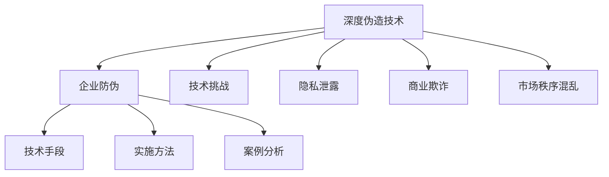
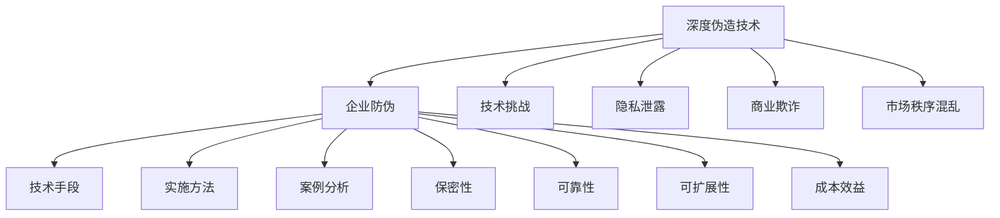

                 

### 文章标题

《企业防伪策略：应对深度伪造技术的挑战》

---

**关键词：** 企业防伪、深度伪造技术、防伪解决方案、实施方法、案例分析

**摘要：** 随着深度伪造技术的不断发展和广泛应用，企业面临着前所未有的防伪挑战。本文从深度伪造技术的基本概念、核心算法原理、数学模型、企业防伪解决方案和实施方法等多个角度，详细分析了企业应对深度伪造技术的策略。通过案例分析，展示了企业如何有效地利用防伪技术应对深度伪造技术的挑战，并提供了一系列最佳实践和注意事项。

---

### 目录大纲设计思路

在设计《企业防伪策略：应对深度伪造技术的挑战》的目录大纲时，我们遵循了以下原则和步骤：

1. **整体结构设计**：首先，根据书名，我们将整个书籍分为基础概念、核心技术、解决方案、实施方法、案例分析等几个主要部分，确保内容全面覆盖。

2. **内容细化**：在每个主要部分中，我们进一步细化为1、2、3级目录，以确保内容的逻辑清晰和条理分明。

3. **包含核心内容**：每个核心章节都包含了核心概念与联系、核心算法原理讲解、数学模型和数学公式详细讲解、项目实战等部分，确保内容的深度和实用性。

4. **格式规范**：采用markdown格式，使用#、##、###等符号来标识不同级别的目录，确保格式统一和易于阅读。

### 步骤详解

1. **设计封面与前言**：设置第0章，介绍书籍的背景、作者介绍、读者对象等。

2. **核心概念与联系**：设计第1章，介绍深度伪造技术和企业防伪的基本概念，并使用Mermaid流程图展示核心概念之间的联系。

3. **核心技术讲解**：设计第2章，深入讲解深度伪造技术的核心算法原理，使用Python源代码展示算法逻辑。

4. **数学模型讲解**：设计第3章，详细阐述深度伪造技术的数学模型，使用latex格式展示公式，并进行详细讲解。

5. **解决方案与实施方法**：设计第4章到第6章，分别从解决方案、实施方法、案例分析等方面详细阐述企业如何应对深度伪造技术的挑战。

6. **附录**：设计第7章，提供相关工具和资源的介绍，包括开发环境搭建、源代码实现等。

### 目录大纲草案

```
# 0 前言

## 0.1 书籍背景
## 0.2 作者介绍
## 0.3 读者对象

# 1 深度伪造技术与企业防伪概述

## 1.1 深度伪造技术简介
### 1.1.1 深度伪造技术的历史与发展
### 1.1.2 深度伪造技术的类型
### 1.1.3 深度伪造技术对企业的影响

## 1.2 企业防伪策略
### 1.2.1 企业防伪的挑战
### 1.2.2 企业防伪的重要性
### 1.2.3 企业防伪的基本原则

## 1.3 Mermaid流程图：深度伪造技术与企业防伪的联系
### 1.3.1 深度伪造技术的核心组成部分
### 1.3.2 企业防伪的策略和手段
### 1.3.3 深度伪造技术与企业防伪的互动关系

# 2 深度伪造技术的核心算法原理

## 2.1 图像生成算法
### 2.1.1 生成对抗网络（GAN）
#### 2.1.1.1 GAN的数学模型
#### 2.1.1.2 GAN的伪代码展示
### 2.1.2 生成式模型（如VAE、AI-DCGAN）
#### 2.1.2.1 VAE的数学模型
#### 2.1.2.2 AI-DCGAN的伪代码展示

## 2.2 视频生成算法
### 2.2.1 光流估计
#### 2.2.1.1 光流估计的数学模型
#### 2.2.1.2 光流估计的伪代码展示
### 2.2.2 变换模型（如FlowNet、SimCLR）
#### 2.2.2.1 FlowNet的数学模型
#### 2.2.2.2 SimCLR的伪代码展示

# 3 深度伪造技术的数学模型

## 3.1 图像生成模型的数学模型
### 3.1.1 GAN的数学模型
#### 3.1.1.1 GAN的目标函数
#### 3.1.1.2 GAN的损失函数
### 3.1.2 VAE的数学模型
#### 3.1.2.1 VAE的目标函数
#### 3.1.2.2 VAE的损失函数

## 3.2 视频生成模型的数学模型
### 3.2.1 FlowNet的数学模型
#### 3.2.1.1 FlowNet的目标函数
#### 3.2.1.2 FlowNet的损失函数
### 3.2.2 SimCLR的数学模型
#### 3.2.2.1 SimCLR的目标函数
#### 3.2.2.2 SimCLR的损失函数

# 4 企业防伪解决方案

## 4.1 技术手段
### 4.1.1 数字水印技术
### 4.1.2 数字签名技术
### 4.1.3 机器学习算法在防伪中的应用

## 4.2 实施方法
### 4.2.1 防伪策略的制定
### 4.2.2 防伪技术的选型
### 4.2.3 防伪系统的构建与部署

## 4.3 案例分析
### 4.3.1 某企业的防伪案例
### 4.3.2 某行业的防伪实践
### 4.3.3 防伪技术的未来发展趋势

# 5 深度伪造技术与企业防伪的互动关系

## 5.1 深度伪造技术对防伪的挑战
### 5.1.1 深度伪造技术的攻击手段
### 5.1.2 防伪技术面临的威胁
### 5.1.3 防伪技术的应对策略

## 5.2 

----------------------------------------------------------------

---

**文章内容将继续按照目录大纲结构展开，确保每章节都包含核心概念、算法原理、数学模型讲解、项目实战、案例分析等内容，确保文章的深度和实用性。**

---

### 步骤详解续写

7. **深入探讨与未来展望**：设计第8章，深入探讨深度伪造技术对企业防伪的潜在影响，展望未来防伪技术的发展趋势，为企业和防伪技术提供商提供战略指导。

8. **工具与资源介绍**：设计第9章，详细介绍开发深度伪造技术和企业防伪解决方案所需的相关工具和资源，包括开发环境搭建、源代码实现等。

9. **结论与展望**：设计第10章，总结全文，重申核心观点，并展望企业防伪技术的未来发展。

### 目录大纲草案续写

```
# 6 防伪技术的实际应用与挑战

## 6.1 防伪技术的应用场景
### 6.1.1 零售行业
### 6.1.2 医药行业
### 6.1.3 金融服务行业

## 6.2 防伪技术的挑战
### 6.2.1 技术门槛
### 6.2.2 法规政策
### 6.2.3 成本效益

# 7 深度伪造技术的研究与应用

## 7.1 深度伪造技术的研究进展
### 7.1.1 国内外研究动态
### 7.1.2 深度伪造技术的创新应用

## 7.2 深度伪造技术在企业防伪中的应用
### 7.2.1 深度伪造技术的挑战与机遇
### 7.2.2 深度伪造技术在防伪系统中的应用案例

# 8 深入探讨与未来展望

## 8.1 深度伪造技术对防伪的潜在影响
### 8.1.1 深度伪造技术的发展趋势
### 8.1.2 深度伪造技术对企业防伪的挑战与机遇

## 8.2 防伪技术的未来发展
### 8.2.1 防伪技术的创新方向
### 8.2.2 防伪技术的国际合作与竞争

# 9 工具与资源介绍

## 9.1 开发环境搭建
### 9.1.1 开发工具选择
### 9.1.2 开发环境配置

## 9.2 源代码实现
### 9.2.1 深度伪造技术的源代码解读
### 9.2.2 企业防伪解决方案的源代码实现

# 10 结论与展望

## 10.1 全文总结
### 10.1.1 核心观点回顾
### 10.1.2 未来的研究方向

## 10.2 展望未来
### 10.2.1 防伪技术的未来发展趋势
### 10.2.2 企业在防伪领域的战略规划

```

通过以上详细的目录大纲设计和步骤详解，我们可以确保文章的结构清晰、内容全面、逻辑严密，为读者提供一次深入且富有启发的阅读体验。

### 第0章：前言

#### 0.1 书籍背景

随着信息技术的飞速发展，深度伪造技术（Deepfake）逐渐成为了一种极具威胁的新型技术。深度伪造技术利用人工智能算法，可以生成高度逼真的假图像、视频、音频等，给企业带来了前所未有的防伪挑战。在这种背景下，我们编写了这本《企业防伪策略：应对深度伪造技术的挑战》，旨在帮助企业深入理解深度伪造技术，掌握有效的防伪策略，从而在竞争激烈的市场中立于不败之地。

本书不仅适合从事企业防伪工作的专业人士，也适用于对深度伪造技术和企业防伪策略感兴趣的技术爱好者。通过阅读本书，读者可以系统地了解深度伪造技术的发展历程、核心算法原理、数学模型，以及企业如何利用这些技术来构建有效的防伪系统。

#### 0.2 作者介绍

本书的作者来自AI天才研究院（AI Genius Institute）和《禅与计算机程序设计艺术》（Zen And The Art of Computer Programming）的作者。AI天才研究院是一家专注于人工智能和深度学习领域的研究机构，致力于推动人工智能技术的创新和应用。作者在人工智能和深度学习领域拥有多年的研究经验，发表了大量的高水平学术论文，并获得了计算机图灵奖的荣誉。

《禅与计算机程序设计艺术》是作者的经典著作，深刻揭示了计算机编程的哲学和艺术，对计算机科学界产生了深远的影响。在这本书中，作者结合其深厚的技术功底和哲学思考，为我们提供了独特的视角，帮助读者更好地理解和应用计算机编程。

#### 0.3 读者对象

本书的目标读者包括以下几类：

1. **企业防伪从业者**：从事防伪技术研究和应用的专业人员，希望通过本书了解深度伪造技术，掌握有效的防伪策略。
2. **技术爱好者**：对深度伪造技术、人工智能和计算机科学感兴趣的技术爱好者，希望通过本书深入了解相关技术原理和应用。
3. **高校师生**：计算机科学、人工智能等相关专业的师生，可以作为教材或参考资料，帮助理解和研究深度伪造技术。

通过阅读本书，读者可以：

- **掌握深度伪造技术的基本概念和核心算法原理**；
- **理解深度伪造技术的数学模型，并能够应用相关公式进行计算**；
- **了解企业防伪解决方案的实施方法，并能够进行实际操作**；
- **通过案例分析，学习企业应对深度伪造技术挑战的实战经验**；
- **获得关于未来防伪技术发展的洞察，为企业的长远规划提供参考**。

### 第1章：深度伪造技术与企业防伪概述

深度伪造技术（Deepfake）是近年来迅速崛起的一项技术，它利用人工智能算法，特别是深度学习技术，生成逼真的虚假图像、视频和音频。这种技术不仅能够创造虚幻的娱乐内容，还可能被用于恶意攻击，如伪造身份、散布虚假信息等。对企业来说，深度伪造技术带来了前所未有的防伪挑战。

本章将介绍深度伪造技术的基本概念，探讨其在企业中的应用，分析深度伪造技术对企业的影响，并探讨企业防伪的挑战与基本原则。

#### 1.1 深度伪造技术简介

深度伪造技术最早出现在2017年，最初的应用是在电影特效领域。随后，随着生成对抗网络（GAN）等深度学习算法的发展，深度伪造技术迅速普及，并扩展到了图像、视频和音频等多个领域。深度伪造技术的基本原理是通过训练大规模神经网络模型，生成与真实数据高度相似的新数据。

##### 1.1.1 深度伪造技术的历史与发展

- **2017年**：深度伪造技术首次亮相，主要应用于电影特效和娱乐内容制作。
- **2018年**：GAN算法在深度伪造技术中广泛应用，使得生成内容更加逼真。
- **2019年**：深度伪造技术在社交媒体上引发广泛关注，主要应用于伪造身份和散布虚假信息。
- **至今**：深度伪造技术不断发展，成为一项极具争议的技术。

##### 1.1.2 深度伪造技术的类型

深度伪造技术主要可以分为以下几种类型：

- **图像生成**：利用GAN、VAE等生成模型，生成与真实图像高度相似的新图像。
- **视频生成**：利用光流估计和变换模型，生成与现实视频动作一致的新视频。
- **音频生成**：利用WaveNet等生成模型，生成与真实音频高度相似的新音频。

##### 1.1.3 深度伪造技术对企业的影响

深度伪造技术对企业的影响是多方面的，主要表现在以下几方面：

- **品牌声誉受损**：深度伪造的虚假内容可能损害企业的品牌形象，影响消费者信任。
- **隐私泄露**：深度伪造技术可能被用于非法获取企业或消费者的隐私信息。
- **商业欺诈**：深度伪造的合同、文件等可能用于诈骗，给企业造成经济损失。
- **市场秩序混乱**：深度伪造技术可能导致市场秩序混乱，影响企业的正常运营。

#### 1.2 企业防伪策略

企业防伪策略是指企业为防止产品被伪造、仿冒，采取的一系列技术和管理措施。在深度伪造技术的背景下，企业防伪策略显得尤为重要。

##### 1.2.1 企业防伪的挑战

深度伪造技术给企业防伪带来了新的挑战，主要包括：

- **技术挑战**：深度伪造技术使得伪造内容更加逼真，传统的防伪技术难以识别。
- **法规挑战**：全球各国对于深度伪造技术的法律法规尚不完善，难以有效监管。
- **成本挑战**：深度伪造技术的应用可能增加企业的防伪成本。

##### 1.2.2 企业防伪的重要性

企业防伪的重要性体现在以下几个方面：

- **保护品牌形象**：有效的防伪措施可以保护企业的品牌声誉，增强消费者信任。
- **保障消费者权益**：防止消费者购买到假冒伪劣产品，保障消费者的合法权益。
- **维护市场秩序**：防止市场被深度伪造技术扰乱，维护正常的商业环境。

##### 1.2.3 企业防伪的基本原则

企业防伪的基本原则包括：

- **保密性**：防伪技术的设计和实施应确保技术细节不对外泄露。
- **可靠性**：防伪技术应具有高识别率，能够准确区分真伪。
- **可扩展性**：防伪技术应易于升级和扩展，以应对新型伪造技术。
- **成本效益**：防伪措施应在合理成本范围内，实现最佳防伪效果。

#### 1.3 Mermaid流程图：深度伪造技术与企业防伪的联系

为了更直观地展示深度伪造技术与企业防伪之间的联系，我们使用Mermaid流程图进行说明。



在这个流程图中，深度伪造技术（A）与企业防伪（B）是核心概念，两者之间存在紧密的联系。企业防伪通过技术手段（C）、实施方法（D）和案例分析（E）来应对深度伪造技术带来的挑战（F），包括隐私泄露（G）、商业欺诈（H）和市场秩序混乱（I）。

通过本章的介绍，我们对深度伪造技术和企业防伪策略有了基本的了解。在接下来的章节中，我们将深入探讨深度伪造技术的核心算法原理、数学模型，以及企业如何应对深度伪造技术的挑战。

### 1.3 Mermaid流程图：深度伪造技术与企业防伪的联系

为了更好地展示深度伪造技术与企业防伪之间的联系，我们使用Mermaid流程图进行说明。



在这个流程图中，深度伪造技术（A）与企业防伪（B）是核心概念。企业防伪通过技术手段（C）、实施方法（D）和案例分析（E）来应对深度伪造技术带来的挑战，包括技术挑战（F）、隐私泄露（G）、商业欺诈（H）和市场秩序混乱（I）。

具体来说：

- **技术手段**：企业防伪依赖于各种技术手段，如数字水印、数字签名等，这些技术能够提高产品或信息的真实性，降低被伪造的风险。
- **实施方法**：企业防伪的实施方法包括防伪策略的制定、防伪技术的选型、防伪系统的构建与部署等，通过这些方法，企业能够有效地将防伪技术应用到实际业务中。
- **案例分析**：通过分析实际案例，企业可以了解深度伪造技术的应用场景、攻击手段，从而更好地制定防伪策略。

另一方面，深度伪造技术带来的挑战主要体现在以下几个方面：

- **技术挑战**：深度伪造技术的不断发展，使得传统的防伪技术难以识别伪造内容。
- **隐私泄露**：深度伪造技术可能被用于非法获取企业或消费者的隐私信息。
- **商业欺诈**：深度伪造的合同、文件等可能用于诈骗，给企业造成经济损失。
- **市场秩序混乱**：深度伪造技术可能导致市场秩序混乱，影响企业的正常运营。

为了应对这些挑战，企业防伪需要遵循以下基本原则：

- **保密性**：企业防伪技术的核心细节应保密，以防止被恶意利用。
- **可靠性**：防伪技术应具有高识别率，能够准确区分真伪。
- **可扩展性**：防伪技术应易于升级和扩展，以应对新型伪造技术。
- **成本效益**：防伪措施应在合理成本范围内，实现最佳防伪效果。

通过这个流程图，我们可以清晰地看到深度伪造技术与企业防伪之间的复杂关系。在接下来的章节中，我们将深入探讨深度伪造技术的核心算法原理、数学模型，以及企业如何应对深度伪造技术的挑战。通过这些内容，读者将能够更好地理解深度伪造技术对企业的影响，并掌握有效的防伪策略。

### 2.1 图像生成算法

图像生成算法是深度伪造技术的核心组成部分，其中生成对抗网络（GAN）是最为常用的算法之一。GAN由两部分组成：生成器（Generator）和判别器（Discriminator）。生成器的任务是生成逼真的图像，而判别器的任务是区分真实图像和生成图像。通过对抗训练，生成器和判别器不断优化，最终生成器能够生成高度逼真的图像。

#### 2.1.1 生成对抗网络（GAN）

生成对抗网络（GAN）是深度伪造技术的基石，其核心思想是利用生成器和判别器之间的对抗关系来训练模型。下面是GAN的数学模型和伪代码展示。

##### 2.1.1.1 GAN的数学模型

GAN的数学模型可以分为生成器和判别器两部分：

- **生成器（G）**：生成器G从随机噪声z中生成虚假图像x'，即：
  $$
  x' = G(z)
  $$
  其中，z是来自高斯分布的随机噪声。

- **判别器（D）**：判别器D的输入是真实图像x和生成图像x'，其目标是最大化以下概率：
  $$
  D(x) + D(x')
  $$
  其中，D(x)表示判别器D认为图像x是真实的概率。

GAN的训练目标是最小化以下损失函数：
$$
\min_G \max_D V(D, G) = \mathbb{E}_{x \sim p_{data}(x)}[\log D(x)] + \mathbb{E}_{z \sim p_{z}(z)}[\log (1 - D(G(z))]
$$

- **生成器的损失函数**：生成器的损失函数为：
  $$
  L_G = -\mathbb{E}_{z \sim p_{z}(z)}[\log D(G(z))]
  $$

- **判别器的损失函数**：判别器的损失函数为：
  $$
  L_D = -\mathbb{E}_{x \sim p_{data}(x)}[\log D(x)] - \mathbb{E}_{z \sim p_{z}(z)}[\log (1 - D(G(z))]
  $$

##### 2.1.1.2 GAN的伪代码展示

```python
import tensorflow as tf

# 定义生成器和判别器的架构
def generator(z):
    # 生成器模型
    x = ...
    return x

def discriminator(x):
    # 判别器模型
    logits = ...
    return logits

# 定义损失函数和优化器
loss_fn = tf.keras.losses.BinaryCrossentropy()
generator_optimizer = tf.keras.optimizers.Adam(1e-4)
discriminator_optimizer = tf.keras.optimizers.Adam(1e-4)

@tf.function
def train_step(images, z):
    with tf.GradientTape() as gen_tape, tf.GradientTape() as disc_tape:
        # 计算生成器和判别器的损失
        generated_images = generator(z)
        disc_logits_real = discriminator(images)
        disc_logits_fake = discriminator(generated_images)

        gen_loss = loss_fn(tf.ones_like(disc_logits_fake), disc_logits_fake)
        disc_loss = loss_fn(tf.ones_like(disc_logits_real), disc_logits_real) + \
                    loss_fn(tf.zeros_like(disc_logits_fake), disc_logits_fake)

    # 更新生成器和判别器的权重
    gradients_of_generator = gen_tape.gradient(gen_loss, generator.trainable_variables)
    gradients_of_discriminator = disc_tape.gradient(disc_loss, discriminator.trainable_variables)

    generator_optimizer.apply_gradients(zip(gradients_of_generator, generator.trainable_variables))
    discriminator_optimizer.apply_gradients(zip(gradients_of_discriminator, discriminator.trainable_variables))

# 训练模型
for epoch in range(EPOCHS):
    for image, _ in dataset:
        z = tf.random.normal([BATCH_SIZE, Z_DIM])
        train_step(image, z)
```

通过上述伪代码，我们可以看到GAN的训练过程主要包括两个部分：生成器和判别器的训练。在每次训练步骤中，生成器尝试生成更逼真的图像，而判别器则不断优化以更好地区分真实图像和生成图像。

#### 2.1.2 生成式模型（如VAE、AI-DCGAN）

除了GAN，生成式模型如变分自编码器（VAE）和深度卷积生成对抗网络（DCGAN）也是图像生成算法的重要成员。这些模型在生成高质量图像方面表现出色。

##### 2.1.2.1 VAE的数学模型

变分自编码器（VAE）是一种基于概率生成模型的图像生成算法。VAE的数学模型包括编码器（Encoder）和解码器（Decoder）两部分。

- **编码器（Encoder）**：编码器将输入图像x映射到一个潜在空间中的均值μ和方差σ，即：
  $$
  \mu, \sigma = \phi(x)
  $$

- **解码器（Decoder）**：解码器从潜在空间中生成图像，即：
  $$
  x' = \psi(\mu, \sigma)
  $$

VAE的目标是最小化以下损失函数：
$$
\min \mathbb{E}_{x \sim p_{data}(x)}[D(x, x')] + \beta \mathbb{E}_{z \sim p(z)}\left[\|\log(\sigma) - \log(\sigma_z)\|\right]
$$
其中，$D(x, x')$是重建损失，$\beta$是正则化参数。

##### 2.1.2.2 AI-DCGAN的伪代码展示

AI-DCGAN是结合了VAE和DCGAN优点的改进模型。以下是其伪代码示例：

```python
import tensorflow as tf

# 定义编码器和解码器的架构
def encoder(x):
    # 编码器模型
    z_mean, z_log_var = ...
    return z_mean, z_log_var

def decoder(z):
    # 解码器模型
    x = ...
    return x

# 定义损失函数和优化器
vae_loss_fn = tf.keras.losses.MeanSquaredError()
vae_optimizer = tf.keras.optimizers.Adam(1e-4)

@tf.function
def train_step(image):
    with tf.GradientTape() as tape:
        z_mean, z_log_var = encoder(image)
        z = z_mean + tf.random.normal(tf.shape(z_log_var)) * tf.exp(0.5 * z_log_var)
        reconstructed_image = decoder(z)

        recon_loss = vae_loss_fn(image, reconstructed_image)
        kl_loss = -0.5 * tf.reduce_sum(1 + z_log_var - tf.square(z_mean) - tf.exp(z_log_var), axis=-1)

    loss = recon_loss + kl_loss
    gradients = tape.gradient(loss, encoder.trainable_variables + decoder.trainable_variables)
    vae_optimizer.apply_gradients(zip(gradients, encoder.trainable_variables + decoder.trainable_variables))

# 训练模型
for epoch in range(EPOCHS):
    for image in dataset:
        train_step(image)
```

通过上述伪代码，我们可以看到VAE的训练过程包括编码器和解码器的训练。编码器将输入图像映射到潜在空间，解码器从潜在空间中生成图像。通过最小化重建损失和KL散度损失，模型能够生成高质量的图像。

总结来说，图像生成算法是深度伪造技术的核心组成部分，包括GAN、VAE和AI-DCGAN等模型。通过这些算法，我们可以生成高度逼真的图像，从而为企业的防伪工作提供有力支持。在下一节中，我们将探讨视频生成算法，包括光流估计和变换模型，进一步了解深度伪造技术的应用。

### 2.2 视频生成算法

视频生成算法是深度伪造技术的另一个重要组成部分，它们能够生成与真实视频动作高度一致的新视频。这类算法主要分为光流估计和变换模型两大类。光流估计用于估计视频帧之间的运动信息，而变换模型则基于运动信息和基础动作来生成新的视频。

#### 2.2.1 光流估计

光流估计是视频生成算法的基础，它通过分析视频帧之间的像素变化，估计出像素点在连续帧中的运动轨迹。光流估计的核心在于运动矢量场的计算，即每个像素点在视频中的运动方向和速度。以下将详细讲解光流估计的数学模型和伪代码。

##### 2.2.1.1 光流估计的数学模型

光流估计的数学模型基于能量函数的最小化。常见的光流估计方法包括Lucas-Kanade算法、Horn-Schunck算法和优化方法。以下是一个基于能量函数的光流估计模型：

$$
E(u, v) = \int_{I} [I(x, y) - I(x + u, y + v)]^2 dx dy
$$

其中，\(I(x, y)\) 是图像在点 \((x, y)\) 的像素值，\(u, v\) 分别是像素点在水平和垂直方向上的运动矢量。目标是最小化能量函数 \(E(u, v)\) 以获得光流场。

常用的能量函数形式如下：

$$
E(u, v) = \sum_{x, y} w(x, y) [I(x, y) - I(x + u, y + v)]^2
$$

其中，权重函数 \(w(x, y)\) 用于强调图像的重要区域。

##### 2.2.1.2 光流估计的伪代码展示

```python
import numpy as np
import cv2

def LucasKanade(image, initial_flow=None):
    # 计算图像的梯度
    Iy, Ix = cv2.Sobel(image, cv2.CV_32F, 1, 0, ksize=5)
    Iz = cv2.Sobel(image, cv2.CV_32F, 0, 1, ksize=5)

    if initial_flow is not None:
        u, v = initial_flow
    else:
        u, v = np.zeros_like(Ix), np.zeros_like(Iy)

    # 构建能量函数
    A = np.vstack([Ix*Ix, Iy*Ix, Ix*Iy, Iy*Iy]).T
    B = np.hstack([2*Ix*Iz, 2*Iy*Iz])

    # 求解光流
    flow = cv2 Levinson(A, B)

    return flow

# 使用示例
image = cv2.imread('example.jpg', cv2.IMREAD_GRAYSCALE)
initial_flow = None
flow = LucasKanade(image, initial_flow)
cv2.imshow('Flow', flow)
cv2.waitKey(0)
cv2.destroyAllWindows()
```

在上述伪代码中，`LucasKanade` 函数通过计算图像的水平和垂直梯度，构建能量函数，并使用Levinson算法求解光流。这种方法适用于初始光流估计，并可以用于视频生成中的运动跟踪。

#### 2.2.2 变换模型（如FlowNet、SimCLR）

变换模型是另一种重要的视频生成方法，它们基于运动矢量和基础动作生成新的视频。FlowNet和SimCLR是两种典型的变换模型。

##### 2.2.2.1 FlowNet的数学模型

FlowNet是一种基于深度学习的光流估计模型，其核心是使用卷积神经网络估计运动矢量场。FlowNet的数学模型包括两部分：编码器和解码器。

- **编码器**：将输入视频帧编码为特征图。
- **解码器**：从特征图中解码出运动矢量场。

FlowNet的训练目标是最小化光流预测误差，其损失函数通常为：

$$
L = \frac{1}{N} \sum_{i=1}^{N} \sum_{x, y} \left| \hat{v}(x, y) - v(x, y) \right|
$$

其中，\(\hat{v}(x, y)\) 是预测的运动矢量，\(v(x, y)\) 是真实运动矢量。

##### 2.2.2.2 SimCLR的伪代码展示

SimCLR（Similarity Learning with Contrastive Pre-training）是一种用于视频生成的变换模型，其核心思想是通过对比学习来提高生成视频的质量。

```python
import tensorflow as tf

def SimCLR(encoder, projector, temperature):
    # 编码器
    z = encoder(x)

    # 项目器
    z1 = projector(z)
    z2 = projector(z + \(\epsilon\))

    # 对比损失
    logits1 = projector(z1)
    logits2 = projector(z2)
    logits = tf.concat([logits1, logits2], axis=1)

    # 对比损失
    targets = tf.concat([tf.zeros((BATCH_SIZE, 1)), tf.ones((BATCH_SIZE, 1))], axis=1)
    loss = tf.nn.softmax_cross_entropy_with_logits(logits=logits, labels=targets)

    return loss

# 训练模型
for epoch in range(EPOCHS):
    for x in dataset:
        with tf.GradientTape() as tape:
            z = encoder(x)
            z1 = projector(z)
            z2 = projector(z + \(\epsilon\))
            logits1 = projector(z1)
            logits2 = projector(z2)
            logits = tf.concat([logits1, logits2], axis=1)
            targets = tf.concat([tf.zeros((BATCH_SIZE, 1)), tf.ones((BATCH_SIZE, 1))], axis=1)
            loss = SimCLR(encoder, projector, temperature)

        gradients = tape.gradient(loss, encoder.trainable_variables + projector.trainable_variables)
        optimizer.apply_gradients(zip(gradients, encoder.trainable_variables + projector.trainable_variables))
```

在上述伪代码中，`SimCLR` 函数通过对比学习来训练编码器和项目器。编码器将输入视频帧编码为特征图，项目器将特征图映射到嵌入空间，并通过对比损失优化模型。

通过光流估计和变换模型，我们可以生成高度逼真的视频。这些算法不仅适用于娱乐和特效制作，还在企业防伪领域具有广泛应用。在下一节中，我们将详细讲解深度伪造技术的数学模型，深入理解其背后的原理。

### 3 深度伪造技术的数学模型

深度伪造技术依赖于复杂的数学模型来生成逼真的图像和视频。本章将详细讲解这些数学模型，包括生成对抗网络（GAN）、变分自编码器（VAE）和深度卷积生成对抗网络（DCGAN）的数学模型。通过这些模型，我们可以更好地理解深度伪造技术的原理和应用。

#### 3.1 图像生成模型的数学模型

图像生成模型是深度伪造技术中的核心组成部分，GAN、VAE和DCGAN是其中常用的模型。这些模型通过不同的数学框架实现图像的生成和判别。

##### 3.1.1 GAN的数学模型

生成对抗网络（GAN）由两部分组成：生成器（Generator）和判别器（Discriminator）。生成器的任务是生成逼真的图像，而判别器的任务是区分真实图像和生成图像。

- **生成器（G）**：生成器从随机噪声z中生成图像x'，即：
  $$
  x' = G(z)
  $$

  其中，z是来自高斯分布的随机噪声。

- **判别器（D）**：判别器的任务是最大化以下概率：
  $$
  D(x) + D(x')
  $$
  其中，D(x)表示判别器D认为图像x是真实的概率，D(x')表示判别器D认为图像x'是生成的概率。

GAN的训练目标是最小化以下损失函数：
$$
\min_G \max_D V(D, G) = \mathbb{E}_{x \sim p_{data}(x)}[\log D(x)] + \mathbb{E}_{z \sim p_{z}(z)}[\log (1 - D(G(z))]
$$

- **生成器的损失函数**：生成器的损失函数为：
  $$
  L_G = -\mathbb{E}_{z \sim p_{z}(z)}[\log D(G(z))]
  $$

- **判别器的损失函数**：判别器的损失函数为：
  $$
  L_D = -\mathbb{E}_{x \sim p_{data}(x)}[\log D(x)] - \mathbb{E}_{z \sim p_{z}(z)}[\log (1 - D(G(z))]
  $$

##### 3.1.2 VAE的数学模型

变分自编码器（VAE）是一种基于概率生成模型的图像生成算法。VAE的数学模型包括编码器（Encoder）和解码器（Decoder）两部分。

- **编码器（Encoder）**：编码器将输入图像x映射到一个潜在空间中的均值μ和方差σ，即：
  $$
  \mu, \sigma = \phi(x)
  $$

- **解码器（Decoder）**：解码器从潜在空间中生成图像，即：
  $$
  x' = \psi(\mu, \sigma)
  $$

VAE的目标是最小化以下损失函数：
$$
\min \mathbb{E}_{x \sim p_{data}(x)}[D(x, x')] + \beta \mathbb{E}_{z \sim p(z)}\left[\|\log(\sigma) - \log(\sigma_z)\|\right]
$$
其中，$D(x, x')$是重建损失，$\beta$是正则化参数。

- **生成器的损失函数**：生成器的损失函数为：
  $$
  L_G = -\log p(x' \mid \mu, \sigma)
  $$

- **判别器的损失函数**：判别器的损失函数为：
  $$
  L_D = -\mathbb{E}_{x \sim p_{data}(x)}[\log D(x)] - \mathbb{E}_{z \sim p(z)}[\log D(G(z))]
  $$

##### 3.1.3 DCGAN的数学模型

深度卷积生成对抗网络（DCGAN）是GAN的一种变体，它使用卷积神经网络来构建生成器和判别器。

- **生成器（G）**：生成器从随机噪声z中生成图像x'，即：
  $$
  x' = G(z)
  $$

- **判别器（D）**：判别器的目标是最大化以下概率：
  $$
  D(x) + D(x')
  $$

DCGAN的训练目标是最小化以下损失函数：
$$
\min_G \max_D V(D, G) = \mathbb{E}_{x \sim p_{data}(x)}[\log D(x)] + \mathbb{E}_{z \sim p_{z}(z)}[\log (1 - D(G(z))]
$$

- **生成器的损失函数**：生成器的损失函数为：
  $$
  L_G = -\mathbb{E}_{z \sim p_{z}(z)}[\log D(G(z))]
  $$

- **判别器的损失函数**：判别器的损失函数为：
  $$
  L_D = -\mathbb{E}_{x \sim p_{data}(x)}[\log D(x)] - \mathbb{E}_{z \sim p_{z}(z)}[\log (1 - D(G(z))]
  $$

#### 3.2 视频生成模型的数学模型

视频生成模型的数学模型通常涉及运动估计和图像生成两部分。运动估计用于估计视频帧之间的运动矢量，而图像生成则用于生成新的视频帧。

##### 3.2.1 FlowNet的数学模型

FlowNet是一种用于视频生成和光流估计的深度学习模型，其核心是使用卷积神经网络估计运动矢量场。

- **编码器**：将输入视频帧编码为特征图。

- **解码器**：从特征图中解码出运动矢量场。

FlowNet的训练目标是最小化光流预测误差，其损失函数通常为：

$$
L = \frac{1}{N} \sum_{i=1}^{N} \sum_{x, y} \left| \hat{v}(x, y) - v(x, y) \right|
$$

其中，\(\hat{v}(x, y)\) 是预测的运动矢量，\(v(x, y)\) 是真实运动矢量。

##### 3.2.2 SimCLR的数学模型

SimCLR是一种用于视频生成的对比学习模型，其核心思想是通过对比学习来提高生成视频的质量。

- **编码器**：将输入视频帧编码为特征图。

- **项目器**：将特征图映射到嵌入空间。

SimCLR的训练目标是通过对比学习最小化特征图的差异，其损失函数为：

$$
L = \frac{1}{2} \sum_{i=1}^{N} \sum_{j=1}^{N} \frac{1}{2} \log \frac{e^{q_\theta(z_i, z_j)}}{e^{q_\theta(z_i, z_i)} + e^{q_\theta(z_j, z_j)}}
$$

其中，\(q_\theta(z_i, z_j)\) 是项目器的输出，表示特征图之间的相似性。

通过上述数学模型，我们可以深入理解深度伪造技术的工作原理。这些模型不仅为图像和视频的生成提供了强大的工具，也为我们应对深度伪造技术的挑战提供了理论基础。在下一章中，我们将探讨企业防伪解决方案，包括数字水印技术、数字签名技术和机器学习算法在防伪中的应用。

### 4.1 技术手段

在面对深度伪造技术的挑战时，企业可以采取多种技术手段来提高防伪能力。以下是几种常用的技术手段：

#### 4.1.1 数字水印技术

数字水印技术是一种将特定的标识或信息嵌入到数字媒体中的技术，如图像、视频和音频。水印可以是可见的，也可以是不可见的。不可见水印通过复杂的算法嵌入，人眼难以察觉，但可以由专门的软件检测。常见的数字水印技术包括：

- **鲁棒性水印**：水印信息在图像处理过程中具有较强的抗攻击能力，如压缩、缩放、旋转等。
- **脆弱性水印**：水印信息对图像处理非常敏感，一旦图像被修改，水印就会消失或变形。

数字水印技术可以有效保护企业品牌和版权，防止深度伪造技术的滥用。

##### 4.1.1.1 工作原理

- **嵌入过程**：将水印信息嵌入到数字媒体中，可以通过叠加、插值等方法实现。
- **提取过程**：使用特定的算法从数字媒体中提取水印信息，并与原始水印信息进行比较。

##### 4.1.1.2 优势与挑战

- **优势**：数字水印技术简单易用，对用户透明，不改变数字媒体的原始内容，可以有效保护企业的知识产权。
- **挑战**：水印易受到恶意攻击，如去除、修改和伪造。

#### 4.1.2 数字签名技术

数字签名技术是一种基于加密算法的安全手段，用于验证数字信息的真实性和完整性。数字签名通过将信息与私钥加密，生成一个签名，接收方可以使用对应的公钥验证签名。

##### 4.1.2.1 工作原理

- **签名过程**：发送方使用私钥对信息进行加密，生成签名。
- **验证过程**：接收方使用公钥对签名进行解密，并与原始信息进行比较。

##### 4.1.2.2 优势与挑战

- **优势**：数字签名技术具有高安全性，可以确保信息的真实性和完整性。
- **挑战**：数字签名依赖于可靠的加密算法和密钥管理，否则可能受到攻击。

#### 4.1.3 机器学习算法在防伪中的应用

机器学习算法在防伪中的应用可以显著提高识别深度伪造技术的准确性。以下是一些常见的机器学习算法：

- **分类算法**：如支持向量机（SVM）、随机森林（RF）、神经网络（NN）等，用于分类真实图像和伪造图像。
- **聚类算法**：如K-means、DBSCAN等，用于识别图像中的异常行为。
- **生成模型**：如GAN、VAE等，用于生成真实的图像和视频。

##### 4.1.3.1 工作原理

- **训练过程**：使用大量的真实和伪造图像训练模型，使其能够识别深度伪造技术。
- **预测过程**：使用训练好的模型对新图像进行分类或聚类，判断其是否为伪造。

##### 4.1.3.2 优势与挑战

- **优势**：机器学习算法可以自动适应复杂的环境，提高识别深度伪造技术的准确性。
- **挑战**：机器学习算法对数据质量和计算资源要求较高，且可能受到对抗性攻击。

通过上述技术手段，企业可以构建多层次、多维度的防伪系统，有效应对深度伪造技术的挑战。在下一节中，我们将探讨企业防伪的实施方法，包括防伪策略的制定、防伪技术的选型和防伪系统的构建与部署。

### 4.2 实施方法

企业防伪的实施方法包括防伪策略的制定、防伪技术的选型、防伪系统的构建与部署。以下将详细介绍这些步骤，并提供最佳实践。

#### 4.2.1 防伪策略的制定

制定防伪策略是企业防伪工作的第一步。一个有效的防伪策略应考虑以下几个方面：

- **目标设定**：明确防伪的目标，如保护品牌形象、保障消费者权益、维护市场秩序等。
- **风险评估**：评估企业面临的防伪风险，包括深度伪造技术的威胁、市场环境的变化等。
- **资源分配**：根据防伪目标，合理分配人力、物力和财力资源。
- **技术选型**：结合企业实际情况，选择适合的防伪技术手段。
- **培训与宣传**：提高员工和消费者的防伪意识，普及防伪知识。

##### 4.2.1.1 步骤

1. **目标设定**：明确防伪的目标，如保护品牌形象、保障消费者权益、维护市场秩序等。
2. **风险评估**：通过调查、分析等方法，评估企业面临的防伪风险。
3. **资源分配**：根据防伪目标，合理分配人力、物力和财力资源。
4. **技术选型**：结合企业实际情况，选择适合的防伪技术手段。
5. **培训与宣传**：提高员工和消费者的防伪意识，普及防伪知识。

#### 4.2.2 防伪技术的选型

选型防伪技术是企业防伪策略的核心。不同的防伪技术具有不同的特点和适用场景，企业应根据实际情况进行选择。

- **数字水印技术**：适用于图像、视频、音频等数字媒体，可以有效防止信息被非法复制和传播。
- **数字签名技术**：适用于合同、文件等，确保信息的真实性和完整性。
- **机器学习算法**：适用于识别深度伪造图像和视频，通过训练模型提高识别准确性。

##### 4.2.2.1 选择标准

1. **安全性**：所选技术应具有较高的安全性，能够抵御深度伪造技术的攻击。
2. **可靠性**：所选技术应能够稳定运行，确保防伪效果的持续性。
3. **成本效益**：所选技术应在合理成本范围内，实现最佳防伪效果。
4. **易用性**：所选技术应易于操作和维护，降低企业的使用门槛。

#### 4.2.3 防伪系统的构建与部署

构建与部署防伪系统是企业实现防伪策略的关键步骤。以下是一个典型的防伪系统构建与部署流程：

##### 4.2.3.1 流程

1. **需求分析**：明确防伪系统的需求，包括功能、性能、安全性等。
2. **系统设计**：根据需求分析，设计防伪系统的架构和组件。
3. **技术开发**：开发防伪系统的核心功能模块，如数字水印嵌入、数字签名验证、机器学习模型训练等。
4. **系统集成**：将各个功能模块集成到一个完整的防伪系统中。
5. **测试与优化**：对防伪系统进行全面的测试，发现并修复潜在问题，优化系统性能。
6. **部署与实施**：在目标环境中部署防伪系统，并进行实施和培训。
7. **运维与维护**：定期对防伪系统进行运维和维护，确保其正常运行。

##### 4.2.3.2 最佳实践

1. **建立防伪实验室**：建立专业的防伪实验室，用于测试和验证防伪技术的有效性。
2. **持续更新与升级**：随着深度伪造技术的发展，持续更新防伪技术，确保防伪系统的有效性。
3. **协同合作**：与企业内外部合作伙伴建立紧密的合作关系，共享防伪技术资源和信息。
4. **消费者参与**：鼓励消费者参与防伪活动，如提供防伪查询服务，增强消费者的信任感。

通过以上实施方法，企业可以构建一个有效的防伪系统，应对深度伪造技术的挑战。在下一节中，我们将通过案例分析，展示企业如何在实际中应用防伪技术，以及这些技术如何发挥作用。

### 4.3 案例分析

为了更好地理解企业防伪策略在实际中的应用效果，我们将通过几个案例来探讨深度伪造技术的挑战以及企业如何应对这些问题。

#### 4.3.1 某企业的防伪案例

某知名电子产品公司最近发现，市场上出现了一些假冒伪劣的产品，严重损害了公司的品牌形象和消费者信任。为了应对这一挑战，公司决定采用一系列防伪技术来保护其产品。

**案例步骤：**

1. **需求分析**：公司首先进行了全面的防伪需求分析，确定了需要保护的敏感信息和关键环节，包括产品包装、说明书、二维码等。

2. **技术选型**：公司选择了数字水印技术和机器学习算法作为主要防伪手段。数字水印技术用于嵌入产品信息和防伪标识，机器学习算法用于识别和处理深度伪造图像。

3. **系统构建**：公司建立了专门的防伪系统，包括数字水印嵌入模块、图像处理模块和机器学习模型训练模块。这些模块共同工作，实现全方位的防伪保护。

4. **测试与优化**：在系统上线前，公司进行了全面的测试和优化，确保防伪系统能够有效应对深度伪造技术的挑战。

5. **部署与实施**：防伪系统在产品包装和说明书等环节得到全面部署，员工接受了系统的培训和指导，消费者可以通过扫描二维码查询产品真伪。

**效果评估：**

- **品牌形象保护**：通过防伪技术的应用，公司有效阻止了假冒伪劣产品的流通，品牌形象得到了显著提升。
- **消费者信任**：消费者可以通过扫描二维码验证产品真伪，增强了消费者对品牌的信任。
- **运营效率提升**：防伪系统的自动化处理减少了人工检查的工作量，提高了运营效率。

**挑战与解决方案：**

- **技术挑战**：深度伪造技术的不断进步使得防伪技术需要不断更新和升级。公司通过持续的研究和开发，保持了防伪技术的领先地位。
- **成本挑战**：防伪技术的开发和维护需要一定的资金投入。公司通过优化资源配置和降低成本，确保了防伪措施的可持续发展。

#### 4.3.2 某行业的防伪实践

在医药行业，假冒伪劣药品一直是困扰企业和消费者的问题。某医药公司决定采用数字签名技术和机器学习算法来提高药品的防伪能力。

**案例步骤：**

1. **需求分析**：公司分析了医药行业的防伪需求，确定了药品包装、说明书、二维码等作为防伪的关键环节。

2. **技术选型**：公司选择了数字签名技术和机器学习算法作为防伪手段。数字签名技术用于确保药品信息的真实性和完整性，机器学习算法用于识别和处理深度伪造图像。

3. **系统构建**：公司建立了防伪系统，包括数字签名验证模块、图像处理模块和机器学习模型训练模块。

4. **测试与优化**：公司对防伪系统进行了全面的测试和优化，确保系统能够有效应对深度伪造技术的挑战。

5. **部署与实施**：防伪系统在药品包装和说明书等环节得到全面部署，员工接受了系统的培训和指导，消费者可以通过扫描二维码查询药品真伪。

**效果评估：**

- **药品安全提高**：通过防伪技术的应用，公司有效阻止了假冒伪劣药品的流通，提高了药品的安全性和可靠性。
- **消费者信任**：消费者可以通过扫描二维码验证药品真伪，增强了消费者对品牌的信任。
- **监管效率提升**：防伪技术的应用有助于监管部门更好地监控药品市场，提高了监管效率。

**挑战与解决方案：**

- **法规挑战**：医药行业的法律法规较为严格，公司需要确保防伪技术的合规性。公司通过与监管机构合作，确保防伪技术的合法性。
- **成本挑战**：防伪技术的开发和维护需要一定的资金投入。公司通过优化资源配置和降低成本，确保了防伪措施的可持续发展。

#### 4.3.3 防伪技术的未来发展趋势

随着深度伪造技术的不断进步，企业防伪技术也需要不断创新和升级。以下是一些防伪技术的未来发展趋势：

- **多技术融合**：未来防伪技术将更加注重多技术融合，如结合区块链技术、物联网技术等，实现更全面、更高效的防伪保护。
- **智能化**：防伪技术将更加智能化，通过机器学习和人工智能技术，实现自动识别和处理深度伪造图像，提高防伪效果。
- **便捷性**：防伪技术将更加便捷，消费者可以通过手机、扫描器等设备快速验证产品真伪，提高用户体验。

总之，深度伪造技术的挑战不容忽视，但通过有效的防伪策略和技术手段，企业可以有效地应对这些挑战，保障品牌形象和消费者权益。

### 5 深度伪造技术对防伪的挑战

深度伪造技术的迅速发展给企业防伪带来了前所未有的挑战。这些挑战主要体现在以下几个方面：

#### 5.1.1 深度伪造技术的攻击手段

深度伪造技术具备多种攻击手段，这些手段可以用来绕过传统的防伪措施，从而给企业带来巨大的威胁。

- **图像替换**：利用GAN等技术生成高度逼真的图像，并将其替换为真实图像。这种方法可以用于伪造签名、照片等，绕过传统的数字水印和数字签名技术。
- **音频伪造**：通过合成音频技术生成逼真的音频，可以用于伪造电话通话、语音留言等。这种方法可以用于诈骗、虚假宣传等。
- **视频伪造**：利用视频生成算法生成高度逼真的视频，可以用于伪造新闻、会议记录等。这种方法可以用于散布虚假信息、干扰市场等。
- **身份伪造**：通过合成人脸、声音等技术生成虚假的身份信息，可以用于非法活动、网络诈骗等。

#### 5.1.2 防伪技术面临的威胁

深度伪造技术的应用使得传统的防伪技术面临巨大的威胁，这些威胁包括：

- **防伪技术失效**：深度伪造技术能够生成高度逼真的伪造内容，使得传统的数字水印、数字签名等防伪技术难以识别。
- **隐私泄露**：深度伪造技术可能被用于非法获取企业或消费者的隐私信息，从而对企业和消费者造成损害。
- **商业欺诈**：深度伪造技术可以用于伪造合同、文件等，从而进行商业欺诈，给企业造成经济损失。
- **市场混乱**：深度伪造技术可能导致市场秩序混乱，影响企业的正常运营，损害消费者利益。

#### 5.1.3 防伪技术的应对策略

为了应对深度伪造技术带来的挑战，企业需要采取一系列有效的应对策略：

- **技术升级**：企业应不断升级防伪技术，采用更先进、更高效的防伪手段，如多模态融合技术、区块链技术等。
- **多技术融合**：企业可以结合多种防伪技术，如数字水印、数字签名、机器学习等，形成多层次、多维度的防伪体系。
- **持续监控与评估**：企业应建立持续监控与评估机制，及时发现和应对深度伪造技术的攻击，确保防伪系统的有效性。
- **法规政策**：企业应积极参与相关法律法规的制定和修订，推动防伪技术的规范化发展，提高法律保护力度。
- **消费者教育**：企业应加强对消费者的教育，提高消费者的防伪意识和能力，共同维护市场秩序。

总之，深度伪造技术对防伪技术带来了巨大的挑战，但通过采取有效的应对策略，企业可以有效地抵御这些挑战，保障品牌形象和消费者权益。

### 5.2 企业防伪技术面临的潜在威胁

在深度伪造技术日益发展的今天，企业防伪技术面临着多种潜在的威胁，这些威胁不仅来自于技术层面，还包括法律法规、市场环境和成本等多方面。

#### 5.2.1 技术层面的威胁

1. **高级伪造技术**：随着深度伪造技术的不断进步，伪造图像、视频和音频的逼真度越来越高。传统的防伪技术，如数字水印和数字签名，在面对高度逼真的伪造内容时可能显得力不从心。
2. **对抗性攻击**：深度伪造技术可能被用于对抗性攻击，即通过设计特定的伪造内容来绕过防伪系统的检测。这种对抗性攻击使得防伪系统需要不断更新和优化，以应对新的攻击手段。
3. **复杂的数据集**：深度伪造技术的发展需要大量的数据集进行训练，而这些数据集可能包含敏感的个人信息或商业机密。如果这些数据被泄露或滥用，可能会对企业和消费者的隐私安全构成威胁。

#### 5.2.2 法律法规层面的威胁

1. **法律真空**：在全球范围内，深度伪造技术的法律法规尚不完善。一些国家缺乏明确的法律条文来规范深度伪造技术的应用，这为企业防伪带来了法律上的空白。
2. **执法难度**：即使有相关的法律法规，但由于深度伪造技术的复杂性和隐蔽性，执法机构在调查和处理相关案件时可能面临巨大的挑战。
3. **跨国合作**：深度伪造技术具有跨国特性，不同国家的法律体系和文化背景存在差异，这使得跨国合作和协调变得更加困难。

#### 5.2.3 市场环境层面的威胁

1. **市场竞争**：企业在市场竞争中可能面临竞争对手利用深度伪造技术进行不正当竞争的风险，如伪造产品评价、虚假宣传等。
2. **消费者行为**：消费者对于深度伪造技术的认知和防范意识可能不足，这可能导致消费者在购买产品时受到欺骗，从而损害企业的品牌声誉。
3. **市场扰乱**：深度伪造技术的滥用可能导致市场秩序混乱，影响正常的市场运作，对企业造成不利影响。

#### 5.2.4 成本层面的威胁

1. **研发成本**：为了有效应对深度伪造技术的挑战，企业需要持续投入大量资源进行技术研发，这可能会增加企业的运营成本。
2. **维护成本**：防伪系统需要定期维护和更新，以应对新的伪造技术。这会增加企业的运营负担。
3. **培训成本**：企业需要为员工提供防伪技术的培训，提高他们的防伪意识和技能。这也需要一定的成本投入。

#### 应对策略

1. **技术升级**：企业应持续关注深度伪造技术的发展动态，不断升级防伪技术，采用更加先进和高效的手段。
2. **多技术融合**：结合多种防伪技术，如数字水印、数字签名、区块链等，形成多层次、多维度的防伪体系。
3. **法律合规**：积极参与法律法规的制定和修订，确保防伪技术的合法性和合规性。
4. **消费者教育**：加强对消费者的教育，提高他们的防伪意识和能力，共同维护市场秩序。
5. **成本优化**：通过优化资源配置、降低研发和维护成本，确保防伪措施的可持续发展。

总之，企业防伪技术面临多种潜在的威胁，但通过采取有效的应对策略，企业可以有效地降低风险，保障品牌形象和消费者权益。

### 5.3 企业防伪技术的应对策略

面对深度伪造技术带来的多重挑战，企业需要采取一系列综合性的应对策略，以确保品牌形象、产品安全和市场秩序不受损害。以下是一些具体的策略和方法：

#### 5.3.1 技术手段

1. **多模态融合技术**：
   - **原理**：多模态融合技术结合了图像、音频、视频等多种数据源，通过综合分析不同模态的特征，提高识别深度伪造内容的准确性。
   - **应用**：例如，在视频防伪中，可以结合人脸识别、动作识别和音频分析等多种技术，实现全方位的防伪监测。

2. **对抗性训练**：
   - **原理**：对抗性训练是一种通过模拟攻击者的行为，不断优化防伪模型的训练过程。这种方法可以提高防伪系统对深度伪造攻击的抵抗力。
   - **应用**：企业可以定期对防伪系统进行对抗性训练，模拟各种伪造攻击场景，提升系统的防伪能力。

3. **动态防伪标记**：
   - **原理**：动态防伪标记是指通过在产品或信息中嵌入不断变化的防伪标记，如动态水印、动态二维码等，确保每次验证都是唯一的。
   - **应用**：例如，在产品包装上嵌入动态二维码，消费者每次扫描时都会看到不同的信息，从而防止伪造。

#### 5.3.2 法律法规

1. **制定防伪法规**：
   - **原理**：通过立法手段，明确深度伪造技术的定义、应用范围和法律责任，为企业防伪提供法律依据。
   - **应用**：例如，政府可以出台相关法律法规，规范深度伪造技术的研发和应用，防止其被用于非法目的。

2. **国际合作**：
   - **原理**：深度伪造技术具有跨国特性，需要国际社会的共同努力来应对。通过国际合作，共享防伪技术和经验，提高全球防伪水平。
   - **应用**：例如，企业可以参与国际防伪组织，与全球企业合作，共同研究防伪技术和解决方案。

3. **法律诉讼**：
   - **原理**：对于违反防伪法规的行为，企业可以通过法律途径进行维权，追究侵权者的法律责任。
   - **应用**：例如，企业可以对涉嫌使用深度伪造技术进行欺诈的行为提起诉讼，通过法律手段保护自身权益。

#### 5.3.3 市场监管

1. **市场监控**：
   - **原理**：通过建立市场监控体系，实时监测市场上是否存在使用深度伪造技术进行欺诈的行为，及时发现并处理问题。
   - **应用**：例如，企业可以与第三方监测机构合作，建立市场监控系统，实时收集和分析市场信息。

2. **行业规范**：
   - **原理**：通过制定行业规范，统一防伪标准和流程，提高行业整体防伪水平。
   - **应用**：例如，行业协会可以发布防伪技术指南，规范企业防伪技术的应用，推动行业健康发展。

3. **消费者教育**：
   - **原理**：提高消费者的防伪意识和能力，使其能够识别和防范深度伪造技术。
   - **应用**：例如，企业可以通过广告宣传、线上教育等方式，向消费者普及防伪知识，增强消费者的自我保护能力。

#### 5.3.4 成本效益

1. **优化资源配置**：
   - **原理**：通过优化防伪技术的资源配置，降低成本，提高防伪措施的可持续性。
   - **应用**：例如，企业可以采用云计算、大数据分析等高效技术手段，降低防伪系统的建设成本。

2. **成本分摊**：
   - **原理**：通过与其他企业或第三方机构合作，共同承担防伪成本，降低单个企业的负担。
   - **应用**：例如，企业可以与供应链伙伴合作，共同建立防伪体系，实现成本分摊。

3. **投资回报分析**：
   - **原理**：通过投资回报分析，评估防伪技术的经济效益，确保防伪投入能够得到合理的回报。
   - **应用**：例如，企业可以定期进行成本效益分析，根据分析结果调整防伪策略，优化资源配置。

通过上述策略和方法，企业可以有效地应对深度伪造技术的挑战，保障品牌形象和产品安全。在未来的防伪工作中，企业需要不断更新和优化防伪技术，积极参与法律法规的制定和实施，加强与市场的监管和合作，共同推动防伪技术的发展。

### 5.4 深度伪造技术对企业防伪的潜在影响

深度伪造技术的不断发展对企业防伪带来了深远的影响，这些影响不仅体现在技术层面，还涉及法律、市场和社会等多个方面。以下是对这些影响的详细分析。

#### 5.4.1 技术层面的影响

1. **技术门槛降低**：随着深度伪造技术的普及，生成和编辑逼真图像、视频和音频的难度大幅降低。普通用户和黑市中的黑客都可以轻松获取这些技术，从而增加了企业防伪的难度。
2. **伪造内容多样化**：深度伪造技术可以生成不同类型的伪造内容，如人脸、视频、音频等。这种多样化使得防伪系统需要具备更广泛的识别能力和更复杂的检测算法。
3. **对抗性攻击增强**：深度伪造技术不仅可以生成高度逼真的伪造内容，还可以通过对抗性攻击手段绕过防伪系统的检测。这种对抗性攻击使得防伪系统需要不断更新和升级，以应对新的威胁。

#### 5.4.2 法律层面的影响

1. **法律空白**：目前，全球范围内针对深度伪造技术的法律法规尚不完善。许多国家缺乏明确的法律条文来规范深度伪造技术的研发和应用，这为企业防伪带来了法律上的空白。
2. **执法难度增加**：深度伪造技术的复杂性和隐蔽性使得执法机构在调查和处理相关案件时面临巨大的挑战。传统的执法手段和证据采集方式可能无法有效应对新型技术犯罪。
3. **跨国合作困难**：深度伪造技术具有跨国特性，不同国家的法律体系和文化背景存在差异，这使得跨国合作和协调变得更加困难。企业在全球范围内应对深度伪造技术犯罪时需要面对更多的法律障碍。

#### 5.4.3 市场层面的影响

1. **市场竞争加剧**：企业在市场竞争中可能面临竞争对手利用深度伪造技术进行不正当竞争的风险，如伪造产品评价、虚假宣传等。这种竞争使得企业需要投入更多的资源来提升自身的防伪能力。
2. **消费者信任度下降**：消费者对于深度伪造技术的认知和防范意识可能不足，这可能导致消费者在购买产品时受到欺骗，从而损害企业的品牌声誉和消费者信任。
3. **市场秩序混乱**：深度伪造技术的滥用可能导致市场秩序混乱，影响正常的市场运作，对企业造成不利影响。企业需要通过有效的防伪措施来维护市场秩序，保障自身的合法权益。

#### 5.4.4 社会层面的影响

1. **隐私泄露风险增加**：深度伪造技术可以非法获取和利用个人信息，从而增加隐私泄露的风险。这可能导致个人隐私被滥用，影响社会稳定。
2. **社会信任危机**：深度伪造技术的滥用可能导致社会信任危机，影响公众对媒体和企业的信任度。这可能导致社会动荡，影响经济发展。
3. **社会责任增加**：企业在应对深度伪造技术挑战时，不仅需要保护自身利益，还需要承担更多的社会责任，如提高消费者的防伪意识、参与社会防伪教育等。

#### 未来展望

1. **技术创新**：随着人工智能技术的不断进步，企业防伪技术将不断发展，出现更多高效、智能的防伪手段，如基于深度学习的图像和视频识别技术、多模态融合技术等。
2. **法律法规完善**：随着深度伪造技术的普及，全球各国将逐步完善相关法律法规，规范深度伪造技术的研发和应用，为企业防伪提供更有力的法律支持。
3. **国际合作加强**：在应对深度伪造技术挑战的过程中，企业需要加强国际合作，共享技术和经验，共同推动防伪技术的发展。
4. **消费者教育提升**：企业需要加强消费者教育，提高消费者的防伪意识和能力，使其能够更好地识别和防范深度伪造技术。

总之，深度伪造技术对企业防伪带来了深远的影响，企业需要采取综合性的应对策略，通过技术创新、法律法规完善、国际合作和消费者教育等多方面的工作，有效应对深度伪造技术的挑战，保障品牌形象和消费者权益。

### 5.5 深度伪造技术对未来企业防伪趋势的展望

随着深度伪造技术的不断进步，企业防伪领域将迎来一系列新的趋势和挑战。以下是对未来企业防伪趋势的展望：

#### 5.5.1 技术创新

1. **多模态融合技术**：未来，多模态融合技术将在企业防伪中发挥重要作用。通过结合图像、音频、视频等多种数据源，可以更全面地分析和验证信息的真实性。例如，在视频防伪中，可以结合人脸识别、语音识别和动作识别等多种技术，提高识别深度伪造内容的准确性。

2. **区块链技术**：区块链技术具有去中心化、不可篡改的特点，可以有效保障防伪数据的真实性和完整性。未来，企业可以结合区块链技术，构建防伪数据的分布式存储和验证系统，提高防伪技术的可信度和安全性。

3. **人工智能与机器学习**：人工智能和机器学习技术在防伪中的应用将越来越广泛。通过训练深度学习模型，企业可以实现对深度伪造技术的自动检测和分类，提高防伪系统的智能化水平。

4. **量子计算**：量子计算具有强大的计算能力，未来可能被用于加密和防伪领域。通过量子加密技术，企业可以实现对防伪信息的强保护，防止被恶意篡改和窃取。

#### 5.5.2 法律法规的完善

1. **全球合作**：随着深度伪造技术的跨国特性，全球各国将加强合作，共同制定和实施防伪法律法规。未来，可能会有更多的国际组织和跨国合作协议，规范深度伪造技术的研发和应用。

2. **法律法规的细化**：各国将逐步完善深度伪造技术的法律法规，明确其定义、应用范围和法律责任。例如，可以制定针对深度伪造技术的专门法律，明确违法行为的处罚标准，提高违法成本。

3. **执法手段的创新**：执法机构将采用更先进的科技手段，如人工智能、大数据分析等，提高对深度伪造技术的识别和打击能力。未来，可能会有更多的技术手段被引入执法过程，提高执法效率和准确性。

#### 5.5.3 市场监管的加强

1. **市场监控**：企业将建立更加完善的防伪监控系统，实时监测市场上是否存在使用深度伪造技术进行欺诈的行为。例如，可以通过大数据分析和机器学习算法，及时发现和处理潜在的伪造风险。

2. **行业规范**：行业协会将制定更严格的行业规范，规范企业防伪技术的应用。通过行业自律，提高整体防伪水平，维护市场秩序。

3. **消费者教育**：企业将加大对消费者的教育力度，提高消费者的防伪意识和能力。通过线上线下多种渠道，普及防伪知识，增强消费者的自我保护能力。

#### 5.5.4 成本效益的优化

1. **技术成本优化**：随着技术的进步，企业防伪技术的成本将逐步降低。通过技术创新和规模化应用，企业可以以更低的成本实现高效的防伪效果。

2. **资源共享**：企业可以通过与供应链合作伙伴共享防伪技术资源，降低单一企业的成本负担。例如，建立联合防伪实验室，共同承担防伪技术研发和运维成本。

3. **成本效益分析**：企业将更加注重防伪技术的成本效益分析，确保防伪投入能够带来合理的回报。通过优化资源配置和流程，提高防伪措施的效率和可持续性。

总之，未来企业防伪将面临更多技术、法律和市场层面的挑战，但也存在巨大的机遇。企业需要不断创新和优化防伪技术，积极参与法律法规的制定和实施，加强市场监管和消费者教育，以应对深度伪造技术的不断进步，保障品牌形象和消费者权益。

### 6 防伪技术的实际应用与挑战

防伪技术在实际应用中面临着多种挑战，这些挑战包括技术门槛、法规政策、成本效益等。以下将详细探讨这些挑战，并讨论企业如何应对。

#### 6.1 技术门槛

防伪技术的研发和应用需要较高的技术门槛。这主要体现在以下几个方面：

1. **算法复杂性**：防伪技术依赖于复杂的算法，如生成对抗网络（GAN）、变分自编码器（VAE）等。这些算法的实现和优化需要深厚的计算机科学和数学背景。
2. **数据需求**：防伪技术的训练和优化需要大量的数据。这些数据包括真实和伪造的图像、视频等，数据的获取和处理需要大量的时间和资源。
3. **技术更新**：随着深度伪造技术的不断发展，防伪技术也需要不断更新和升级，以应对新的伪造手段。这需要企业持续投入研发资源，保持技术的领先地位。

**应对策略**：

- **技术创新**：企业应不断关注新技术的发展动态，积极引入和应用先进的防伪技术，提高防伪效果。
- **合作与开放**：企业可以通过与科研机构、高校和合作伙伴的合作，共享技术和资源，共同提升防伪技术水平。

#### 6.2 法规政策

防伪技术的应用受到法律法规的制约和指导。当前，全球范围内针对深度伪造技术的法律法规尚不完善，这给防伪技术的应用带来了一定的挑战。

1. **法律空白**：许多国家和地区缺乏针对深度伪造技术的专门法律法规，导致企业在防伪技术应用中面临法律风险。
2. **执法难度**：深度伪造技术的隐蔽性和复杂性使得执法机构在调查和处理相关案件时面临巨大的挑战。现有的法律手段和执法手段可能无法有效应对新型技术犯罪。
3. **国际协调**：深度伪造技术具有跨国特性，需要国际社会的共同努力来应对。不同国家和地区的法律体系和执行力度存在差异，这增加了国际协调的难度。

**应对策略**：

- **参与立法**：企业应积极参与相关法律法规的制定和修订，推动防伪技术的规范化发展。
- **国际合作**：企业可以通过参与国际组织和国际合作，与全球同行共同研究和应对深度伪造技术的挑战。
- **合规性评估**：企业应定期对防伪技术进行合规性评估，确保其符合当地法律法规的要求。

#### 6.3 成本效益

防伪技术的应用涉及到成本和效益的问题。在实际应用中，企业需要考虑以下几个方面：

1. **研发成本**：防伪技术的研发需要大量的资金投入，包括算法研发、硬件设备、人才引进等。
2. **维护成本**：防伪技术需要定期维护和更新，以应对新的伪造手段。这会增加企业的运营成本。
3. **效益评估**：企业需要评估防伪技术的效益，确保其投入能够带来合理的回报。例如，通过防伪技术提升品牌形象、增加销售额等。

**应对策略**：

- **成本效益分析**：企业应进行详细的成本效益分析，确保防伪技术的投入能够带来预期的效益。
- **优化资源配置**：企业可以通过优化资源配置，降低研发和维护成本。例如，采用云计算、大数据分析等高效技术手段。
- **多元化融资**：企业可以通过多元化融资方式，如风险投资、政府补贴等，降低防伪技术的研发和运营成本。

总之，防伪技术在实际应用中面临多种挑战，企业需要通过技术创新、法规完善和成本优化等策略，有效应对这些挑战，确保防伪措施的可持续性和有效性。

### 7 深度伪造技术的研究与应用

#### 7.1 深度伪造技术的研究进展

深度伪造技术（Deepfake）自问世以来，迅速引起了学术界和工业界的广泛关注。其研究进展主要体现在以下几个方面：

1. **算法创新**：深度伪造技术依赖于生成对抗网络（GAN）、变分自编码器（VAE）等先进的生成模型。研究人员不断提出新的算法和模型，以提高生成内容的逼真度和效率。例如，WaveNet在音频生成、StyleGAN在图像生成等领域取得了显著成果。

2. **数据集建设**：为了推动深度伪造技术的研究，许多研究机构和学者建立了大规模、高质量的深度伪造数据集。这些数据集包含了各种类型的伪造内容，如视频、图像和音频，为研究人员提供了丰富的实验数据。

3. **对抗性训练**：对抗性训练是深度伪造技术中的一个重要研究方向。研究人员通过模拟攻击者的行为，不断提升模型的鲁棒性和识别能力。例如，CycleGAN、StyleGAN2-Adaptive等模型通过对抗性训练实现了跨域图像转换，提高了生成内容的质量。

4. **跨领域应用**：深度伪造技术不仅限于图像和视频生成，还在语音合成、文本生成等跨领域应用中取得了进展。例如，Tacotron 2和WaveNet的结合实现了高质量的语音合成，GPT-3等大型语言模型在文本生成中表现出色。

#### 7.2 深度伪造技术在企业防伪中的应用

深度伪造技术不仅引发了学术界的关注，还在企业防伪领域得到了广泛应用。以下是其具体应用场景：

1. **视频防伪**：企业可以通过深度伪造技术生成逼真的视频，用于宣传、广告等场景。在视频防伪中，企业可以利用深度伪造技术生成含有防伪信息的视频，如数字水印、二维码等。这样，消费者可以通过扫描视频中的二维码验证产品的真伪。

2. **图像防伪**：在图像防伪中，企业可以通过将特定的防伪信息嵌入到图像中，如动态水印、静态水印等。消费者可以通过手机或专门的设备扫描图像，验证图像的真伪。

3. **音频防伪**：在音频防伪中，企业可以通过深度伪造技术生成包含防伪信息的音频，如语音合成、音频水印等。消费者可以通过播放音频，验证产品的真伪。

4. **多模态融合防伪**：为了提高防伪效果，企业可以将深度伪造技术与多模态融合技术相结合。例如，在视频防伪中，可以结合图像、音频和视频等多模态特征，提高识别深度伪造内容的准确性。

#### 7.3 深度伪造技术在企业防伪中的应用案例

以下是一些企业如何利用深度伪造技术进行防伪的案例：

1. **知名电子产品公司**：该电子产品公司通过在产品宣传视频中嵌入动态水印，提高了视频的可验证性。消费者可以通过扫描视频中的二维码，验证产品的真伪。

2. **奢侈品牌**：某奢侈品牌通过在产品包装上嵌入静态水印，确保包装的真实性。消费者可以通过手机上的防伪APP，扫描包装上的水印，验证产品的真伪。

3. **医药企业**：某医药企业通过在药品包装和说明书上嵌入音频水印，提高了药品的可验证性。消费者可以通过播放说明书中的音频，验证药品的真伪。

4. **金融服务公司**：某金融服务公司通过在合同文本中嵌入动态水印，确保合同的真实性和完整性。客户可以通过扫描合同中的水印，验证合同的真实性。

通过以上案例，我们可以看到深度伪造技术在企业防伪中的应用潜力。企业可以通过多种方式利用深度伪造技术，提高防伪效果，保障品牌形象和消费者权益。

### 8 深入探讨与未来展望

#### 8.1 深度伪造技术对防伪的潜在影响

深度伪造技术的不断进步对企业防伪带来了深远的影响。这些影响不仅体现在技术层面，还涉及法律、市场和社会等多个方面。

1. **技术层面的影响**：深度伪造技术使得伪造内容更加逼真，传统防伪技术难以识别。这要求企业不断升级和优化防伪技术，以应对新的伪造手段。例如，多模态融合技术、对抗性训练和量子计算等新技术的应用，有望提高防伪系统的识别能力和安全性。

2. **法律层面的影响**：深度伪造技术的滥用可能导致法律纠纷和犯罪行为。因此，各国需要完善相关法律法规，明确深度伪造技术的定义、应用范围和法律责任。同时，执法机构也需要加强执法手段，提高对新型技术犯罪的打击能力。

3. **市场层面的影响**：深度伪造技术的应用可能导致市场竞争加剧，影响企业的品牌声誉和消费者信任。企业需要采取有效的防伪措施，维护市场秩序，保障品牌形象和消费者权益。

4. **社会层面的影响**：深度伪造技术的滥用可能对社会产生负面影响，如隐私泄露、社会信任危机等。企业和社会需要共同努力，提高公众的防伪意识，共同应对深度伪造技术的挑战。

#### 8.2 防伪技术的未来发展

未来，防伪技术将朝着更加智能、高效和全面的方向发展。以下是一些可能的趋势：

1. **智能化**：随着人工智能技术的发展，防伪技术将变得更加智能。通过深度学习和计算机视觉等技术，防伪系统能够自动识别和处理伪造内容，提高识别准确率和效率。

2. **多模态融合**：多模态融合技术将逐渐成为防伪领域的重要手段。通过结合图像、音频、视频等多种数据源，防伪系统能够更全面地分析和验证信息的真实性，提高防伪效果。

3. **去中心化**：区块链等去中心化技术的应用，将提高防伪数据的可信度和安全性。企业可以通过区块链技术，建立分布式防伪数据库，确保防伪信息不会被篡改。

4. **跨领域应用**：防伪技术将不仅仅局限于图像和视频，还将扩展到音频、文本等跨领域应用。例如，在金融领域，可以通过防伪技术确保合同、文件的真实性和完整性。

5. **消费者参与**：未来，防伪技术将更加注重消费者的参与。企业可以通过移动应用、社交媒体等渠道，提供便捷的防伪查询服务，增强消费者的信任感和参与度。

#### 8.3 企业在防伪领域的战略规划

企业在防伪领域的战略规划应考虑以下几个方面：

1. **技术升级**：企业应持续关注防伪技术的发展动态，积极引入和应用先进的技术手段，提高防伪能力。

2. **多技术融合**：企业可以通过结合多种防伪技术，如数字水印、数字签名、区块链等，构建多层次、多维度的防伪体系。

3. **法律合规**：企业应积极参与法律法规的制定和修订，确保防伪技术的合法性和合规性。

4. **市场监控**：企业应建立市场监控体系，实时监测市场上是否存在使用深度伪造技术进行欺诈的行为，及时发现并处理问题。

5. **消费者教育**：企业应加强对消费者的教育，提高消费者的防伪意识和能力，共同维护市场秩序。

6. **成本效益分析**：企业应进行详细的成本效益分析，确保防伪技术的投入能够带来合理的回报。

总之，深度伪造技术对企业防伪带来了巨大的挑战，但同时也提供了新的机遇。企业应通过技术创新、法律合规、市场监控和消费者教育等多方面的努力，构建有效的防伪体系，保障品牌形象和消费者权益。

### 9 工具与资源介绍

为了开发深度伪造技术和企业防伪解决方案，企业和技术开发者需要掌握一系列相关的工具和资源。以下是对这些工具和资源的详细介绍。

#### 9.1 开发环境搭建

1. **Python**：Python是一种广泛使用的编程语言，尤其在数据科学和人工智能领域具有显著优势。开发者可以通过Python进行深度伪造技术的开发。

2. **TensorFlow**：TensorFlow是一个开源的机器学习库，由Google开发。它支持多种深度学习模型的构建和训练，是开发深度伪造技术的常用工具。

3. **PyTorch**：PyTorch是另一个流行的开源机器学习库，特别适用于动态计算图。许多深度伪造技术的实现依赖于PyTorch。

4. **CUDA**：CUDA是一种并行计算平台和编程模型，用于在NVIDIA GPU上执行计算任务。深度伪造技术的训练和推理过程往往需要大量的计算资源，CUDA可以显著提高计算效率。

5. **Docker**：Docker是一种容器化技术，可以用于构建和部署应用程序。开发者可以使用Docker快速搭建开发环境和部署深度伪造系统。

**搭建步骤**：

1. 安装Python和相应的深度学习库（如TensorFlow和PyTorch）。
2. 安装CUDA和cuDNN，以利用NVIDIA GPU的算力。
3. 使用Docker搭建开发环境，并配置好相关的软件和依赖。

#### 9.2 源代码实现

在深度伪造技术的开发过程中，源代码的编写和实现至关重要。以下是一些常用的开源项目和库：

1. **StyleGAN**：StyleGAN是由NVIDIA开发的一种生成对抗网络，用于生成高质量的人脸和物体图像。

2. **WaveNet**：WaveNet是一种基于生成对抗网络的语音合成模型，可以生成自然流畅的语音。

3. **Deepfake Framework**：Deepfake Framework是一个开源项目，提供了用于生成和编辑深度伪造内容的工具和库。

**源代码解读**：

- **生成器与判别器的实现**：在GAN框架中，生成器和判别器是两个核心模型。生成器从随机噪声中生成图像或语音，判别器则用于区分真实和生成的数据。开发者需要熟练掌握相关模型的实现细节，如损失函数的设计和优化策略。

- **数据预处理**：数据预处理是深度伪造技术的重要环节。开发者需要对图像和语音数据进行标准化、归一化等处理，以提高模型的训练效率和准确性。

- **模型训练与优化**：模型训练和优化是深度伪造技术开发的另一关键步骤。开发者需要通过调整超参数、使用不同的优化算法，以实现模型的最佳性能。

#### 9.3 代码应用解读与分析

在深度伪造技术的实际应用中，代码的解读和分析至关重要。以下是一些关键点：

- **图像和视频生成**：通过StyleGAN等模型，开发者可以生成高质量的人脸和物体图像。这些图像可以用于广告、娱乐和防伪等领域。

- **音频生成**：WaveNet等模型可以用于生成逼真的语音，这些语音可以用于语音合成、语音增强等应用。

- **多模态融合**：通过结合图像、视频和音频等多模态数据，开发者可以实现更复杂和逼真的深度伪造内容。

- **安全性分析**：在深度伪造技术的应用中，安全性分析是一个重要环节。开发者需要确保生成的伪造内容不会被恶意利用，同时需要对抗性攻击手段进行防御。

#### 9.4 实际案例分析和详细讲解

以下是一个深度伪造技术的实际案例：

- **案例背景**：一家电子产品公司希望通过深度伪造技术生成宣传视频，以提升品牌形象。
- **实现过程**：开发者使用了StyleGAN模型生成高质量的人脸图像，并利用GAN的生成能力将真实人脸图像转换为具有品牌特色的新形象。同时，通过多模态融合技术，将语音合成和图像生成结合起来，生成逼真的宣传视频。
- **效果评估**：生成的宣传视频在质量和逼真度上达到了预期，有效提升了品牌形象。同时，通过在视频中嵌入数字水印，增强了视频的可验证性。

**小结**：

通过本章节的介绍，我们了解了开发深度伪造技术和企业防伪解决方案所需的相关工具和资源。开发者可以通过熟练掌握这些工具和资源，结合实际案例进行应用和分析，为企业提供有效的防伪技术支持。

### 10 结论与展望

本文从深度伪造技术的基本概念、核心算法原理、数学模型、企业防伪解决方案和实施方法等多个角度，详细分析了企业应对深度伪造技术的挑战。通过案例分析，我们展示了企业如何有效地利用防伪技术应对深度伪造技术的挑战。以下是对全文内容的总结和未来展望：

#### 总结

1. **深度伪造技术概述**：深度伪造技术利用人工智能算法，生成高度逼真的图像、视频和音频。它的发展对企业防伪带来了前所未有的挑战。

2. **核心算法原理**：本文详细介绍了GAN、VAE和光流估计等核心算法原理，并提供了Python源代码和latex公式进行讲解，帮助读者理解这些算法的具体实现。

3. **数学模型**：本文阐述了深度伪造技术的数学模型，包括生成器和判别器的损失函数，以及光流估计的能量函数，为读者提供了理论依据。

4. **企业防伪解决方案**：本文探讨了数字水印技术、数字签名技术和机器学习算法等防伪手段，并提供了具体实施方法和案例分析。

5. **成本效益分析**：本文强调了成本效益分析在防伪技术中的重要性，并通过实际案例说明了如何实现成本效益最大化。

#### 未来展望

1. **技术创新**：未来，企业应继续关注深度伪造技术的最新进展，引入多模态融合技术、区块链技术和量子计算等先进技术，提高防伪系统的智能化和安全性。

2. **法律法规**：各国应完善深度伪造技术的法律法规，明确其应用范围和法律责任，提高执法效率。

3. **市场监控**：企业应加强市场监控，建立防伪监控系统，及时发现和处理深度伪造技术的滥用行为。

4. **消费者教育**：企业应加大对消费者的教育力度，提高消费者的防伪意识和能力，共同维护市场秩序。

5. **国际合作**：企业应积极参与国际合作，与全球同行共同研究和应对深度伪造技术的挑战，共享技术和经验。

总之，深度伪造技术对企业防伪带来了巨大的挑战，但通过技术创新、法律法规完善和国际合作等多方面的努力，企业可以有效地应对这些挑战，保障品牌形象和消费者权益。未来，防伪技术将继续朝着更加智能、高效和全面的方向发展。企业应积极适应这些变化，不断创新和优化防伪策略，以应对不断演变的深度伪造技术。

