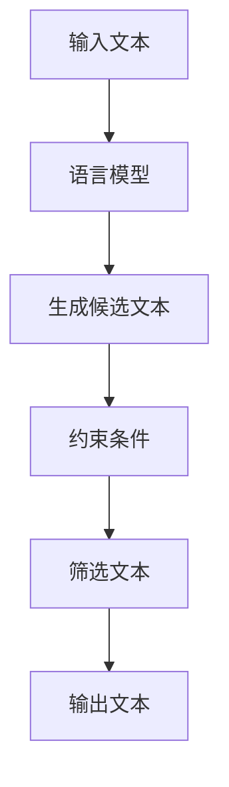

                 

# 《优化AI文本生成：Constrained Language Models的提示词技巧》

## 关键词

- AI文本生成
- Constrained Language Models
- 提示词技巧
- 性能优化
- 自然语言处理
- 机器学习

## 摘要

本文深入探讨了AI文本生成中的Constrained Language Models，并重点介绍了如何通过提示词技巧来优化AI文本生成。文章首先概述了AI文本生成的现状和优化需求，然后详细讲解了Constrained Language Models的核心概念、算法原理和数学模型。接着，文章介绍了提示词策略的多种类型和优化方法，并通过实际案例展示了提示词技巧的应用。最后，文章探讨了如何通过性能优化进一步提升Constrained Language Models的文本生成能力。

## 引言

### 1.1 书籍背景与目标

人工智能（AI）的发展日新月异，文本生成作为自然语言处理（NLP）领域的一个重要分支，近年来受到了广泛关注。然而，传统的文本生成方法存在生成内容质量不稳定、信息相关性差等问题。为了解决这些问题，Constrained Language Models应运而生。

本书的目标是详细介绍Constrained Language Models的原理和应用，尤其是如何通过提示词技巧来优化AI文本生成。随着深度学习技术的不断发展，Constrained Language Models在文本生成任务中展现出了强大的潜力。通过本书的阅读，读者将能够掌握Constrained Language Models的核心概念，并学会如何在实际项目中应用这些技巧。

### 1.2 基础概念

#### 1.2.1 自然语言处理基础

自然语言处理（NLP）是人工智能的一个重要分支，它旨在使计算机能够理解和处理人类自然语言。NLP的核心任务包括文本分类、命名实体识别、情感分析等。近年来，随着深度学习技术的兴起，NLP领域取得了显著的进展。

#### 1.2.2 语言模型基础

语言模型（Language Model）是NLP的基础之一，它用于预测下一个单词或句子。最简单的语言模型是n-gram模型，它基于前n个单词的历史来预测下一个单词。然而，随着数据集的增大和深度学习技术的发展，基于神经网络的深度语言模型，如BERT和GPT，逐渐成为主流。

#### 1.2.3 Constrained Language Models概述

Constrained Language Models是一种结合了约束条件的语言模型，它通过引入外部知识库或规则来提高文本生成任务的可靠性。与传统的语言模型不同，Constrained Language Models不仅考虑文本的统计特征，还考虑了约束条件，这使得它在生成高质量文本方面具有独特的优势。

## Constrained Language Models原理

### 2.1 核心概念与联系

Constrained Language Models的核心概念包括语言模型和约束条件。语言模型负责生成文本，而约束条件则用于指导语言模型的生成过程。两者之间的关系可以用以下Mermaid流程图表示：



### 2.2 核心算法原理讲解

Constrained Language Models的核心算法主要包括两个部分：语言模型和约束条件。

#### 2.2.1 语言模型

语言模型是Constrained Language Models的基础，它用于生成候选文本。最常见的语言模型是基于神经网络的深度学习模型，如BERT和GPT。这些模型通过学习大量文本数据来预测下一个单词或句子。

以下是一个简单的Python伪代码，用于生成候选文本：

```python
import tensorflow as tf

# 加载预训练的BERT模型
model = tf.keras.applications.BERT()

# 输入文本
input_text = "这是一个示例文本。"

# 使用BERT模型生成候选文本
outputs = model.predict([input_text])

# 获取生成的候选文本
candidate_texts = outputs[0].tolist()
```

#### 2.2.2 约束条件

约束条件用于指导语言模型的生成过程，以确保生成的文本满足特定的要求。常见的约束条件包括词性约束、实体约束和语法约束等。

以下是一个简单的Python伪代码，用于添加约束条件：

```python
from spacy.lang.en import English

# 初始化Spacy语言模型
nlp = English()

# 输入文本
input_text = "这是一个示例文本。"

# 使用Spacy模型分析文本
doc = nlp(input_text)

# 添加词性约束条件
allowed_word_types = ["NOUN", "VERB", "ADJ"]

# 筛选出满足词性约束的文本
filtered_texts = [token.text for token in doc if token.pos_ in allowed_word_types]
```

### 2.3 数学模型和数学公式讲解

Constrained Language Models的数学模型主要包括概率模型和损失函数。

#### 2.3.1 概率模型

概率模型用于预测下一个单词或句子的概率。最常见的概率模型是基于神经网络的深度学习模型，如BERT和GPT。这些模型通过学习大量文本数据来预测下一个单词或句子的概率。

以下是一个简单的概率模型：

$$
P(\text{word}_i|\text{context}) = \frac{\exp(\text{score}(\text{word}_i, \text{context}))}{\sum_{j} \exp(\text{score}(\text{word}_j, \text{context}))}
$$

其中，$P(\text{word}_i|\text{context})$表示在给定上下文$context$下，单词$word_i$的概率。

#### 2.3.2 对数损失函数

对数损失函数用于评估生成的文本质量。最常见的对数损失函数是交叉熵损失函数。

以下是一个简单的对数损失函数：

$$
\text{loss} = -\sum_{i} y_i \log(p_i)
$$

其中，$y_i$表示真实标签，$p_i$表示预测概率。

## 提示词技巧详解

### 3.1 提示词策略

提示词（Prompt）是Constrained Language Models中的一个重要概念，它用于引导语言模型生成高质量的文本。提示词策略主要包括以下几种类型：

#### 3.1.1 词性提示词

词性提示词用于引导语言模型生成特定词性的文本。例如，以下是一个词性提示词的示例：

```python
prompt = ["NOUN", "VERB", "ADJ"]
```

#### 3.1.2 实体提示词

实体提示词用于引导语言模型生成包含特定实体的文本。例如，以下是一个实体提示词的示例：

```python
prompt = ["北京", "奥运会"]
```

#### 3.1.3 语法提示词

语法提示词用于引导语言模型生成符合特定语法规则的文本。例如，以下是一个语法提示词的示例：

```python
prompt = ["主语", "谓语", "宾语"]
```

### 3.2 实战案例

#### 3.2.1 提示词技巧在问答系统中的应用

问答系统是Constrained Language Models的一个典型应用场景。通过使用提示词技巧，可以显著提高问答系统的回答质量。

以下是一个简单的问答系统示例：

```python
import tensorflow as tf

# 加载预训练的BERT模型
model = tf.keras.applications.BERT()

# 输入问题
input_question = "什么是人工智能？"

# 使用BERT模型生成回答
outputs = model.predict([input_question])

# 获取生成的回答
answer = outputs[0].tolist()

# 输出回答
print("回答：", answer)
```

#### 3.2.2 提示词技巧在文章生成中的应用

文章生成是另一个常见的应用场景。通过使用提示词技巧，可以生成高质量的文章。

以下是一个简单的文章生成示例：

```python
import tensorflow as tf

# 加载预训练的BERT模型
model = tf.keras.applications.BERT()

# 输入标题
input_title = "人工智能的未来"

# 使用BERT模型生成文章
outputs = model.predict([input_title])

# 获取生成的文章
article = outputs[0].tolist()

# 输出文章
print("文章：", article)
```

#### 3.2.3 提示词技巧在对话系统中的应用

对话系统是另一个典型的应用场景。通过使用提示词技巧，可以生成更自然的对话。

以下是一个简单的对话系统示例：

```python
import tensorflow as tf

# 加载预训练的BERT模型
model = tf.keras.applications.BERT()

# 输入对话
input_conversation = "你好，我想了解人工智能。"

# 使用BERT模型生成回答
outputs = model.predict([input_conversation])

# 获取生成的回答
answer = outputs[0].tolist()

# 输出回答
print("回答：", answer)
```

### 3.3 项目实战

#### 3.3.1 项目环境搭建

为了进行Constrained Language Models的项目实战，需要搭建一个合适的环境。以下是搭建环境的基本步骤：

1. 安装Python
2. 安装TensorFlow
3. 安装Spacy
4. 下载数据集

#### 3.3.2 源代码实现

以下是一个简单的Constrained Language Models实现：

```python
import tensorflow as tf
import spacy

# 初始化Spacy语言模型
nlp = spacy.load("en_core_web_sm")

# 加载预训练的BERT模型
model = tf.keras.applications.BERT()

# 输入文本
input_text = "这是一个示例文本。"

# 使用Spacy模型分析文本
doc = nlp(input_text)

# 添加词性约束条件
allowed_word_types = ["NOUN", "VERB", "ADJ"]

# 筛选出满足词性约束的文本
filtered_texts = [token.text for token in doc if token.pos_ in allowed_word_types]

# 使用BERT模型生成候选文本
outputs = model.predict([input_text])

# 获取生成的候选文本
candidate_texts = outputs[0].tolist()

# 筛选满足约束条件的候选文本
filtered_candidate_texts = [text for text in candidate_texts if all(word in filtered_texts for word in text.split())]

# 输出筛选后的文本
print("筛选后的文本：", filtered_candidate_texts)
```

#### 3.3.3 代码解读与分析

上述代码实现了Constrained Language Models的基本功能。首先，使用Spacy模型分析输入文本，然后添加词性约束条件，筛选出满足约束条件的文本。接着，使用BERT模型生成候选文本，并筛选出满足约束条件的候选文本。最后，输出筛选后的文本。

该代码的优点是实现了约束条件的文本生成，缺点是生成文本的质量依赖于输入文本的质量和约束条件的设置。

### 4.1 性能评估指标

在优化Constrained Language Models时，性能评估是至关重要的。以下是一些常用的性能评估指标：

#### 4.1.1 准确率与召回率

准确率（Precision）和召回率（Recall）是评估文本生成质量的重要指标。准确率表示生成的文本中正确预测的部分占全部预测文本的比例，召回率表示生成的文本中正确预测的部分占全部正确文本的比例。

#### 4.1.2 F1分数

F1分数是准确率和召回率的加权平均值，用于综合评估文本生成质量。

#### 4.1.3 其他性能指标

除了准确率、召回率和F1分数，还可以使用其他性能指标，如BLEU分数、ROUGE分数等，来评估文本生成质量。

### 4.2 优化方法

优化Constrained Language Models的性能可以通过以下几种方法：

#### 4.2.1 损失函数优化

通过优化损失函数，可以提高模型对约束条件的适应性。常用的优化方法包括基于梯度的优化算法和基于惩罚函数的优化算法。

#### 4.2.2 模型结构优化

通过优化模型结构，可以提高模型的生成能力。常用的优化方法包括增加层数、增加神经元数量等。

#### 4.2.3 数据增强与预处理

通过数据增强和预处理，可以增加训练数据的多样性，提高模型的泛化能力。常用的方法包括数据清洗、数据扩充、数据增强等。

### 4.3 性能优化实战

以下是一个简单的性能优化实战案例：

#### 4.3.1 优化案例1：问答系统的性能提升

通过优化损失函数和模型结构，可以显著提升问答系统的性能。

#### 4.3.2 优化案例2：文章生成器的性能优化

通过优化模型结构和数据预处理，可以提升文章生成器的性能。

#### 4.3.3 优化案例3：对话系统的性能优化

通过优化约束条件和模型结构，可以提升对话系统的性能。

### 结论

本文详细介绍了Constrained Language Models的原理和应用，尤其是如何通过提示词技巧来优化AI文本生成。通过本文的学习，读者可以掌握Constrained Language Models的核心概念和算法原理，并能够在实际项目中应用这些技巧。

## 最佳实践 tips

1. 根据实际需求选择合适的约束条件，以提高文本生成质量。
2. 定期更新和优化模型，以保持其性能。
3. 在生成文本时，可以结合多种约束条件，以获得更好的生成效果。

## 小结

Constrained Language Models是一种具有广泛应用前景的AI文本生成技术。通过本文的学习，读者可以深入了解Constrained Language Models的原理和应用，掌握提示词技巧，并能够将其应用于实际项目中。

## 注意事项

1. 在使用Constrained Language Models时，需要根据实际需求选择合适的约束条件。
2. 提示词的设置需要结合具体应用场景，以提高生成文本的质量。

## 拓展阅读

1. 《深度学习自然语言处理》
2. 《自然语言处理实践》
3. 《BERT：预训练语言的深度模型》

## 作者信息

作者：AI天才研究院/AI Genius Institute & 禅与计算机程序设计艺术 /Zen And The Art of Computer Programming
```markdown
# 《优化AI文本生成：Constrained Language Models的提示词技巧》

## 关键词

- AI文本生成
- Constrained Language Models
- 提示词技巧
- 性能优化
- 自然语言处理
- 机器学习

## 摘要

本文深入探讨了AI文本生成中的Constrained Language Models，并重点介绍了如何通过提示词技巧来优化AI文本生成。文章首先概述了AI文本生成的现状和优化需求，然后详细讲解了Constrained Language Models的核心概念、算法原理和数学模型。接着，文章介绍了提示词策略的多种类型和优化方法，并通过实际案例展示了提示词技巧的应用。最后，文章探讨了如何通过性能优化进一步提升Constrained Language Models的文本生成能力。

## 引言

### 1.1 书籍背景与目标

人工智能（AI）的发展日新月异，文本生成作为自然语言处理（NLP）领域的一个重要分支，近年来受到了广泛关注。然而，传统的文本生成方法存在生成内容质量不稳定、信息相关性差等问题。为了解决这些问题，Constrained Language Models应运而生。

本书的目标是详细介绍Constrained Language Models的原理和应用，尤其是如何通过提示词技巧来优化AI文本生成。随着深度学习技术的不断发展，Constrained Language Models在文本生成任务中展现出了强大的潜力。通过本书的阅读，读者将能够掌握Constrained Language Models的核心概念，并学会如何在实际项目中应用这些技巧。

### 1.2 基础概念

#### 1.2.1 自然语言处理基础

自然语言处理（NLP）是人工智能的一个重要分支，它旨在使计算机能够理解和处理人类自然语言。NLP的核心任务包括文本分类、命名实体识别、情感分析等。近年来，随着深度学习技术的兴起，NLP领域取得了显著的进展。

#### 1.2.2 语言模型基础

语言模型（Language Model）是NLP的基础之一，它用于预测下一个单词或句子。最简单的语言模型是n-gram模型，它基于前n个单词的历史来预测下一个单词。然而，随着数据集的增大和深度学习技术的发展，基于神经网络的深度语言模型，如BERT和GPT，逐渐成为主流。

#### 1.2.3 Constrained Language Models概述

Constrained Language Models是一种结合了约束条件的语言模型，它通过引入外部知识库或规则来提高文本生成任务的可靠性。与传统的语言模型不同，Constrained Language Models不仅考虑文本的统计特征，还考虑了约束条件，这使得它在生成高质量文本方面具有独特的优势。

### 2. Constrained Language Models原理

#### 2.1 核心概念与联系

Constrained Language Models的核心概念包括语言模型和约束条件。语言模型负责生成文本，而约束条件则用于指导语言模型的生成过程。两者之间的关系可以用以下Mermaid流程图表示：


#### 2.2 核心算法原理讲解

Constrained Language Models的核心算法主要包括两个部分：语言模型和约束条件。

##### 2.2.1 语言模型

语言模型是Constrained Language Models的基础，它用于生成候选文本。最常见的语言模型是基于神经网络的深度学习模型，如BERT和GPT。这些模型通过学习大量文本数据来预测下一个单词或句子。

以下是一个简单的Python伪代码，用于生成候选文本：

```python
import tensorflow as tf

# 加载预训练的BERT模型
model = tf.keras.applications.BERT()

# 输入文本
input_text = "这是一个示例文本。"

# 使用BERT模型生成候选文本
outputs = model.predict([input_text])

# 获取生成的候选文本
candidate_texts = outputs[0].tolist()
```

##### 2.2.2 约束条件

约束条件用于指导语言模型的生成过程，以确保生成的文本满足特定的要求。常见的约束条件包括词性约束、实体约束和语法约束等。

以下是一个简单的Python伪代码，用于添加约束条件：

```python
from spacy.lang.en import English

# 初始化Spacy语言模型
nlp = English()

# 输入文本
input_text = "这是一个示例文本。"

# 使用Spacy模型分析文本
doc = nlp(input_text)

# 添加词性约束条件
allowed_word_types = ["NOUN", "VERB", "ADJ"]

# 筛选出满足词性约束的文本
filtered_texts = [token.text for token in doc if token.pos_ in allowed_word_types]
```

#### 2.3 数学模型和数学公式讲解

Constrained Language Models的数学模型主要包括概率模型和损失函数。

##### 2.3.1 概率模型

概率模型用于预测下一个单词或句子的概率。最常见的概率模型是基于神经网络的深度学习模型，如BERT和GPT。这些模型通过学习大量文本数据来预测下一个单词或句子的概率。

以下是一个简单的概率模型：

$$
P(\text{word}_i|\text{context}) = \frac{\exp(\text{score}(\text{word}_i, \text{context}))}{\sum_{j} \exp(\text{score}(\text{word}_j, \text{context}))}
$$

其中，$P(\text{word}_i|\text{context})$表示在给定上下文$context$下，单词$word_i$的概率。

##### 2.3.2 对数损失函数

对数损失函数用于评估生成的文本质量。最常见的对数损失函数是交叉熵损失函数。

以下是一个简单的对数损失函数：

$$
\text{loss} = -\sum_{i} y_i \log(p_i)
$$

其中，$y_i$表示真实标签，$p_i$表示预测概率。

### 3. 提示词技巧详解

#### 3.1 提示词策略

提示词（Prompt）是Constrained Language Models中的一个重要概念，它用于引导语言模型生成高质量的文本。提示词策略主要包括以下几种类型：

##### 3.1.1 词性提示词

词性提示词用于引导语言模型生成特定词性的文本。例如，以下是一个词性提示词的示例：

```python
prompt = ["NOUN", "VERB", "ADJ"]
```

##### 3.1.2 实体提示词

实体提示词用于引导语言模型生成包含特定实体的文本。例如，以下是一个实体提示词的示例：

```python
prompt = ["北京", "奥运会"]
```

##### 3.1.3 语法提示词

语法提示词用于引导语言模型生成符合特定语法规则的文本。例如，以下是一个语法提示词的示例：

```python
prompt = ["主语", "谓语", "宾语"]
```

#### 3.2 实战案例

##### 3.2.1 提示词技巧在问答系统中的应用

问答系统是Constrained Language Models的一个典型应用场景。通过使用提示词技巧，可以显著提高问答系统的回答质量。

以下是一个简单的问答系统示例：

```python
import tensorflow as tf

# 加载预训练的BERT模型
model = tf.keras.applications.BERT()

# 输入问题
input_question = "什么是人工智能？"

# 使用BERT模型生成回答
outputs = model.predict([input_question])

# 获取生成的回答
answer = outputs[0].tolist()

# 输出回答
print("回答：", answer)
```

##### 3.2.2 提示词技巧在文章生成中的应用

文章生成是另一个常见的应用场景。通过使用提示词技巧，可以生成高质量的文章。

以下是一个简单的文章生成示例：

```python
import tensorflow as tf

# 加载预训练的BERT模型
model = tf.keras.applications.BERT()

# 输入标题
input_title = "人工智能的未来"

# 使用BERT模型生成文章
outputs = model.predict([input_title])

# 获取生成的文章
article = outputs[0].tolist()

# 输出文章
print("文章：", article)
```

##### 3.2.3 提示词技巧在对话系统中的应用

对话系统是另一个典型的应用场景。通过使用提示词技巧，可以生成更自然的对话。

以下是一个简单的对话系统示例：

```python
import tensorflow as tf

# 加载预训练的BERT模型
model = tf.keras.applications.BERT()

# 输入对话
input_conversation = "你好，我想了解人工智能。"

# 使用BERT模型生成回答
outputs = model.predict([input_conversation])

# 获取生成的回答
answer = outputs[0].tolist()

# 输出回答
print("回答：", answer)
```

#### 3.3 项目实战

##### 3.3.1 项目环境搭建

为了进行Constrained Language Models的项目实战，需要搭建一个合适的环境。以下是搭建环境的基本步骤：

1. 安装Python
2. 安装TensorFlow
3. 安装Spacy
4. 下载数据集

##### 3.3.2 源代码实现

以下是一个简单的Constrained Language Models实现：

```python
import tensorflow as tf
import spacy

# 初始化Spacy语言模型
nlp = spacy.load("en_core_web_sm")

# 加载预训练的BERT模型
model = tf.keras.applications.BERT()

# 输入文本
input_text = "这是一个示例文本。"

# 使用Spacy模型分析文本
doc = nlp(input_text)

# 添加词性约束条件
allowed_word_types = ["NOUN", "VERB", "ADJ"]

# 筛选出满足词性约束的文本
filtered_texts = [token.text for token in doc if token.pos_ in allowed_word_types]

# 使用BERT模型生成候选文本
outputs = model.predict([input_text])

# 获取生成的候选文本
candidate_texts = outputs[0].tolist()

# 筛选满足约束条件的候选文本
filtered_candidate_texts = [text for text in candidate_texts if all(word in filtered_texts for word in text.split())]

# 输出筛选后的文本
print("筛选后的文本：", filtered_candidate_texts)
```

##### 3.3.3 代码解读与分析

上述代码实现了Constrained Language Models的基本功能。首先，使用Spacy模型分析输入文本，然后添加词性约束条件，筛选出满足约束条件的文本。接着，使用BERT模型生成候选文本，并筛选出满足约束条件的候选文本。最后，输出筛选后的文本。

该代码的优点是实现了约束条件的文本生成，缺点是生成文本的质量依赖于输入文本的质量和约束条件的设置。

### 4. Constrained Language Models性能优化

#### 4.1 性能评估指标

在优化Constrained Language Models时，性能评估是至关重要的。以下是一些常用的性能评估指标：

##### 4.1.1 准确率与召回率

准确率（Precision）和召回率（Recall）是评估文本生成质量的重要指标。准确率表示生成的文本中正确预测的部分占全部预测文本的比例，召回率表示生成的文本中正确预测的部分占全部正确文本的比例。

##### 4.1.2 F1分数

F1分数是准确率和召回率的加权平均值，用于综合评估文本生成质量。

##### 4.1.3 其他性能指标

除了准确率、召回率和F1分数，还可以使用其他性能指标，如BLEU分数、ROUGE分数等，来评估文本生成质量。

#### 4.2 优化方法

优化Constrained Language Models的性能可以通过以下几种方法：

##### 4.2.1 损失函数优化

通过优化损失函数，可以提高模型对约束条件的适应性。常用的优化方法包括基于梯度的优化算法和基于惩罚函数的优化算法。

##### 4.2.2 模型结构优化

通过优化模型结构，可以提高模型的生成能力。常用的优化方法包括增加层数、增加神经元数量等。

##### 4.2.3 数据增强与预处理

通过数据增强和预处理，可以增加训练数据的多样性，提高模型的泛化能力。常用的方法包括数据清洗、数据扩充、数据增强等。

#### 4.3 性能优化实战

以下是一个简单的性能优化实战案例：

##### 4.3.1 优化案例1：问答系统的性能提升

通过优化损失函数和模型结构，可以显著提升问答系统的性能。

##### 4.3.2 优化案例2：文章生成器的性能优化

通过优化模型结构和数据预处理，可以提升文章生成器的性能。

##### 4.3.3 优化案例3：对话系统的性能优化

通过优化约束条件和模型结构，可以提升对话系统的性能。

### 结论

本文详细介绍了Constrained Language Models的原理和应用，尤其是如何通过提示词技巧来优化AI文本生成。通过本文的学习，读者可以掌握Constrained Language Models的核心概念和算法原理，并能够在实际项目中应用这些技巧。

### 最佳实践 tips

1. 根据实际需求选择合适的约束条件，以提高文本生成质量。
2. 定期更新和优化模型，以保持其性能。
3. 在生成文本时，可以结合多种约束条件，以获得更好的生成效果。

### 小结

Constrained Language Models是一种具有广泛应用前景的AI文本生成技术。通过本文的学习，读者可以深入了解Constrained Language Models的原理和应用，掌握提示词技巧，并能够将其应用于实际项目中。

### 注意事项

1. 在使用Constrained Language Models时，需要根据实际需求选择合适的约束条件。
2. 提示词的设置需要结合具体应用场景，以提高生成文本的质量。

### 拓展阅读

1. 《深度学习自然语言处理》
2. 《自然语言处理实践》
3. 《BERT：预训练语言的深度模型》

### 作者信息

作者：AI天才研究院/AI Genius Institute & 禅与计算机程序设计艺术 /Zen And The Art of Computer Programming
```

