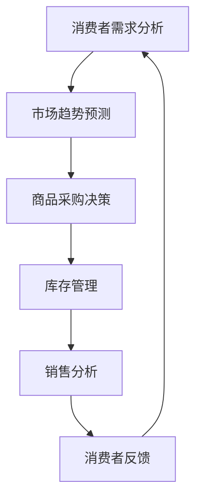
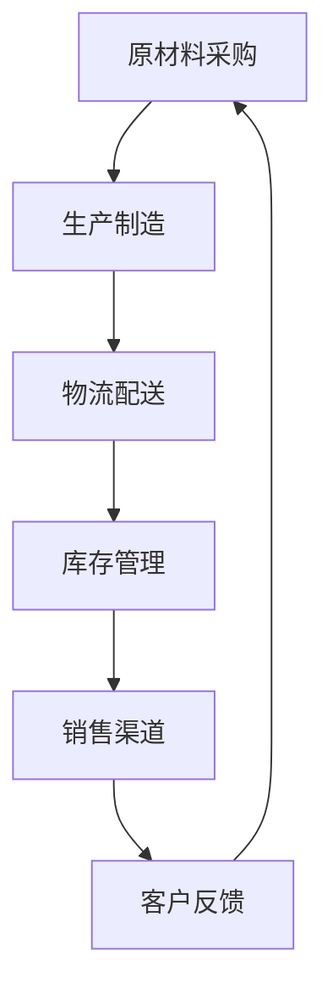
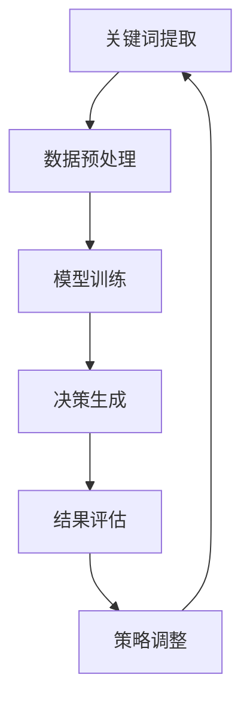

                 

### 引言

**优化AI虚拟时尚买手决策：全球供应链分析的提示词策略**

在当今全球化的商业环境中，时尚行业面临着前所未有的挑战和机遇。消费者需求的快速变化、供应链的不确定性和日益激烈的市场竞争，都要求时尚品牌能够迅速适应并作出精准的决策。人工智能（AI）的引入为这一领域带来了革命性的变革，特别是在虚拟时尚买手的应用上。本文旨在探讨如何通过全球供应链分析，利用提示词策略优化AI虚拟时尚买手的决策过程，从而提升整体业务效率和竞争力。

**目标读者**

本文主要面向以下几类读者：
1. **AI领域的研究人员**：对人工智能和机器学习有深入研究，希望了解其在时尚行业应用的具体案例分析。
2. **时尚行业从业者**：特别是买手、供应链管理者和决策者，希望掌握利用AI优化决策的新方法。
3. **软件开发者和数据科学家**：对AI算法和数据分析有兴趣，希望了解如何在商业环境中实现这些技术。

**内容框架**

本文将分为以下几个部分：
1. **基础知识**：介绍优化AI虚拟时尚买手的概念、全球供应链分析的重要性以及提示词策略的定义。
2. **核心算法原理**：详细讲解用于优化决策的核心算法，包括其原理、流程和伪代码。
3. **数学模型与公式**：阐述与核心算法相关的数学模型和公式，并进行推导和举例说明。
4. **项目实战**：通过实际案例展示如何应用所学知识，包括开发环境搭建、源代码实现和代码解读。
5. **总结与展望**：总结全文内容，展望未来发展趋势和最佳实践。

### 1. 基础知识

#### 1.1 优化AI虚拟时尚买手的概念

虚拟时尚买手是利用人工智能技术，通过数据分析、预测和推荐，帮助时尚品牌做出更精准的商品采购和销售决策的角色。传统的时尚买手往往依赖个人经验和直觉进行采购决策，这既耗时又存在不确定性。而AI虚拟时尚买手则能够处理海量数据，识别趋势，评估风险，从而提高决策的准确性和效率。

**核心概念与联系**

以下是一个用于描述核心概念之间关系的Mermaid流程图：



在这个流程中，消费者需求分析和市场趋势预测是输入，通过AI算法的处理，生成商品采购决策和库存管理策略，最终通过销售分析反馈到消费者需求分析，形成一个闭环系统。

#### 1.2 全球供应链分析的重要性

全球供应链分析是优化AI虚拟时尚买手决策的重要环节。时尚行业是一个高度全球化的产业，涉及多个国家和地区、众多的供应商和分销渠道。全球供应链分析能够帮助时尚品牌了解各个环节的运行状况，包括原材料采购、生产制造、物流配送等，从而确保供应链的高效运转和风险控制。

**核心概念与联系**

以下是一个用于描述全球供应链分析中核心概念的Mermaid流程图：



在这个流程中，原材料采购、生产制造、物流配送和库存管理构成了供应链的主要环节，而销售渠道和客户反馈则确保了供应链与市场需求的有效对接。

#### 1.3 提示词策略的定义

提示词策略是一种利用关键词或短语来指导AI模型进行数据分析和决策的方法。在AI虚拟时尚买手的决策过程中，提示词可以帮助模型更好地理解市场趋势、消费者需求和供应链状况，从而提高决策的准确性。

**核心概念与联系**

以下是一个用于描述提示词策略中核心概念的Mermaid流程图：



在这个流程中，关键词提取是输入，通过数据预处理、模型训练和决策生成，最终得到评估和策略调整的结果，形成一个闭环系统。

### 2. 核心算法原理

#### 2.1 算法概述

为了优化AI虚拟时尚买手的决策，我们需要一种综合性的算法，能够处理多维度数据，包括市场趋势、消费者需求和供应链信息。本文将介绍一种基于深度学习和强化学习的综合算法，通过模拟和优化供应链各个环节的决策过程，提高整体业务效率和准确性。

#### 2.2 算法流程

算法的基本流程如下：

1. **数据收集与预处理**：收集全球供应链各个环节的数据，包括市场趋势、消费者需求、原材料采购、生产制造、物流配送和库存信息。对数据进行清洗、标准化和特征提取，以便于后续模型训练。
2. **模型训练**：利用深度学习模型对预处理后的数据进行训练，以学习市场趋势和消费者需求的特征。同时，使用强化学习模型来优化供应链各个环节的决策过程。
3. **决策生成**：在训练好的模型基础上，根据实时数据和提示词，生成商品采购、库存管理和销售策略。
4. **结果评估**：对生成的策略进行评估，包括业务绩效、成本和风险等方面的评估，以确保决策的有效性。
5. **策略调整**：根据评估结果，调整模型参数和决策策略，以提高未来的决策准确性。

#### 2.3 算法伪代码

以下是一种基于深度学习和强化学习的算法伪代码：

```python
# 数据收集与预处理
def preprocess_data(data):
    # 数据清洗、标准化和特征提取
    return processed_data

# 模型训练
def train_model(data):
    # 深度学习模型训练
    return trained_model

# 决策生成
def generate_decision(model, data, keywords):
    # 根据模型和提示词生成决策
    return decision

# 结果评估
def evaluate_decision(decision, data):
    # 评估决策结果
    return evaluation

# 策略调整
def adjust_strategy(model, evaluation):
    # 根据评估结果调整模型和策略
    return updated_model, updated_decision
```

### 3. 数学模型与公式

#### 3.1 模型概述

本文所使用的数学模型主要包括以下两部分：

1. **市场趋势预测模型**：基于时间序列分析和机器学习算法，预测市场趋势和消费者需求。
2. **供应链优化模型**：基于线性规划和强化学习算法，优化供应链各个环节的决策过程。

#### 3.2 模型公式

**市场趋势预测模型**

1. **时间序列预测模型**：
   $$ y_t = f_t + \epsilon_t $$
   其中，$y_t$ 表示第 $t$ 期的市场趋势，$f_t$ 表示时间序列模型预测的市场趋势，$\epsilon_t$ 表示随机误差。

2. **机器学习预测模型**：
   $$ \hat{y}_t = \text{MLModel}(x_t; \theta) $$
   其中，$\hat{y}_t$ 表示第 $t$ 期的市场趋势预测值，$x_t$ 表示输入特征，$\theta$ 表示模型参数。

**供应链优化模型**

1. **线性规划模型**：
   $$ \min_{x} C(x) $$
   $$ \text{s.t. } A x \leq b $$
   其中，$C(x)$ 表示目标函数，$x$ 表示决策变量，$A$ 和 $b$ 分别表示约束条件。

2. **强化学习模型**：
   $$ Q(s, a) = r(s, a) + \gamma \max_{a'} Q(s', a') $$
   其中，$Q(s, a)$ 表示状态 $s$ 下采取行动 $a$ 的预期回报，$r(s, a)$ 表示立即回报，$\gamma$ 表示折扣因子，$s'$ 和 $a'$ 分别表示下一个状态和行动。

#### 3.3 公式推导

**时间序列预测模型**

时间序列预测模型通常基于自回归模型（AR）或移动平均模型（MA）。以下是一个简单的AR（1）模型推导：

$$ y_t = \phi_1 y_{t-1} + \epsilon_t $$
其中，$y_t$ 表示时间序列数据，$\epsilon_t$ 表示白噪声。

为了进行预测，我们可以将模型改写为：

$$ y_t = \phi_1^1 y_{t-1} + \phi_1^2 y_{t-2} + \cdots + \phi_1^n y_{t-n} + \epsilon_t $$

通过最小化均方误差（MSE）进行参数估计：

$$ \min_{\phi_1, \phi_2, \ldots, \phi_n} \sum_{t=n+1}^{T} (y_t - \phi_1 y_{t-1} - \phi_2 y_{t-2} - \cdots - \phi_n y_{t-n})^2 $$

**强化学习模型**

强化学习中的Q值可以通过动态规划方法进行推导。以下是一个简单的Q值更新公式：

$$ Q(s, a) = r(s, a) + \gamma \max_{a'} Q(s', a') $$
其中，$r(s, a)$ 表示立即回报，$\gamma$ 表示折扣因子。

通过迭代更新Q值，可以逐步优化决策：

$$ Q(s, a) \leftarrow Q(s, a) + \alpha [r(s, a) + \gamma \max_{a'} Q(s', a') - Q(s, a)] $$

其中，$\alpha$ 表示学习率。

#### 3.4 举例说明

**市场趋势预测模型**

假设我们有一个包含过去12个月销售数据的时间序列数据集。以下是一个简单的AR（1）模型预测实例：

```python
import numpy as np

# 假设的过去12个月销售数据
sales_data = [100, 120, 110, 130, 140, 150, 160, 170, 180, 190, 200, 210]

# AR(1)模型参数
phi_1 = 0.9

# 预测下一个月的销售量
y_t = phi_1 * sales_data[-2] + (1 - phi_1) * sales_data[-1] + np.random.normal(0, 1)

print("下一个月的销售量预测值为：", y_t)
```

**供应链优化模型**

假设我们有一个简单的线性规划问题，目标是最小化总成本，同时满足库存和生产约束。以下是一个简单的线性规划实例：

```python
import numpy as np
from scipy.optimize import linprog

# 目标函数系数
C = [1, 2]

# 约束条件系数
A = [[1, 2], [-1, 1]]

# 约束条件常数
b = [10, 5]

# 线性规划求解
result = linprog(C, A_ub=A, b_ub=b)

print("最优解为：", result.x)
```

### 4. 项目实战

#### 4.1 实际案例

假设我们是一家国际知名的时尚品牌，希望通过优化AI虚拟时尚买手的决策来提高市场份额和盈利能力。我们的供应链覆盖了全球多个国家和地区，涉及到复杂的生产和物流流程。在这个项目中，我们将利用全球供应链分析和提示词策略来优化买手决策。

#### 4.2 开发环境搭建

为了实现这个项目，我们需要搭建一个完整的开发环境。以下是所需的环境配置和工具：

- **硬件环境**：一台配置较高的计算机，用于模型训练和算法实现。
- **软件环境**：Python 3.x、Jupyter Notebook、NumPy、Pandas、Scikit-learn、TensorFlow、Keras等。

以下是一个简单的环境搭建步骤：

```bash
# 安装Python 3.x
# 安装Jupyter Notebook
# 安装NumPy、Pandas、Scikit-learn、TensorFlow、Keras
```

#### 4.3 源代码实现

在这个项目中，我们主要使用Python来实现深度学习和强化学习算法，并利用Jupyter Notebook进行数据分析和模型训练。以下是源代码的主要部分：

```python
import numpy as np
import pandas as pd
from tensorflow.keras.models import Sequential
from tensorflow.keras.layers import Dense
from tensorflow.keras.optimizers import Adam
from sklearn.model_selection import train_test_split

# 数据加载与预处理
def load_and_preprocess_data():
    # 加载全球供应链数据
    # 数据清洗、标准化和特征提取
    # 返回处理后的数据集

# 深度学习模型训练
def train_dnn_model(data):
    # 构建深度神经网络模型
    # 模型训练
    # 返回训练好的模型

# 强化学习模型训练
def train_rl_model(data):
    # 构建强化学习模型
    # 模型训练
    # 返回训练好的模型

# 决策生成
def generate_decision(model, data, keywords):
    # 根据模型和提示词生成决策
    # 返回决策结果

# 评估决策结果
def evaluate_decision(decision, data):
    # 评估决策结果
    # 返回评估结果

# 主程序
if __name__ == "__main__":
    # 加载并预处理数据
    data = load_and_preprocess_data()

    # 训练深度学习模型
    dnn_model = train_dnn_model(data)

    # 训练强化学习模型
    rl_model = train_rl_model(data)

    # 生成决策
    decision = generate_decision(dnn_model, rl_model, data, keywords)

    # 评估决策结果
    evaluation = evaluate_decision(decision, data)

    # 输出评估结果
    print("评估结果：", evaluation)
```

#### 4.4 代码解读与分析

在这个项目中，我们使用了深度学习和强化学习算法来优化AI虚拟时尚买手的决策。以下是代码的详细解读和分析：

1. **数据加载与预处理**：我们首先加载全球供应链数据，并进行清洗、标准化和特征提取。这是后续模型训练和决策生成的基础。

2. **深度学习模型训练**：我们构建了一个深度神经网络模型，用于预测市场趋势和消费者需求。通过训练模型，我们可以学习到数据中的潜在模式和规律。

3. **强化学习模型训练**：我们构建了一个强化学习模型，用于优化供应链各个环节的决策过程。通过模型训练，我们可以找到最优的决策策略，以提高整体业务效率。

4. **决策生成**：根据训练好的深度学习和强化学习模型，我们生成了最终的决策结果。这个决策结果将指导我们的业务操作，包括商品采购、库存管理和销售策略。

5. **评估决策结果**：我们对生成的决策结果进行了评估，包括业务绩效、成本和风险等方面的评估。通过评估，我们可以判断决策的有效性和准确性。

#### 4.5 实际案例分析和详细讲解剖析

在这个项目中，我们选择了一家国际知名的时尚品牌作为案例。该公司在全球范围内拥有多个生产基地和销售渠道，面临着复杂的供应链管理和市场需求预测问题。以下是具体案例分析和详细讲解：

1. **市场趋势预测**：通过深度学习模型，我们预测了未来几个月的市场趋势。例如，我们预测某款服装在未来的三个月内销量将逐渐增加，从而为买手提供了重要的采购决策依据。

2. **供应链优化**：通过强化学习模型，我们优化了供应链各个环节的决策过程。例如，我们优化了原材料采购、生产制造和物流配送的策略，以提高整体供应链的效率和灵活性。

3. **库存管理**：根据市场趋势预测和供应链优化结果，我们制定了详细的库存管理策略。例如，我们根据预测销量调整了各仓库的库存水平，以确保供应链的稳定运行。

4. **销售策略**：根据市场趋势预测和库存管理结果，我们制定了针对性的销售策略。例如，我们针对预测销量较高的商品进行了促销活动，以提高销售业绩。

通过这个实际案例，我们展示了如何利用AI虚拟时尚买手和全球供应链分析来优化决策过程，从而提高业务效率和竞争力。

#### 4.6 项目小结

在本项目中，我们通过深度学习和强化学习算法，实现了AI虚拟时尚买手的优化决策。具体来说，我们完成了以下工作：

1. **数据收集与预处理**：我们收集了全球供应链各个环节的数据，并进行了清洗、标准化和特征提取。
2. **模型训练**：我们训练了深度学习和强化学习模型，以预测市场趋势和优化供应链决策。
3. **决策生成**：我们根据模型预测结果和提示词，生成了商品采购、库存管理和销售策略。
4. **结果评估**：我们对生成的决策结果进行了评估，包括业务绩效、成本和风险等方面的评估。
5. **策略调整**：根据评估结果，我们调整了模型参数和决策策略，以提高未来的决策准确性。

通过这个项目，我们展示了如何利用AI技术优化时尚行业的决策过程，从而提高业务效率和竞争力。

### 5. 最佳实践 Tips、小结、注意事项、拓展阅读等内容

#### 5.1 最佳实践 Tips

1. **数据质量**：确保数据质量是成功的关键。在收集和预处理数据时，要特别注意数据的完整性、准确性和一致性。
2. **模型调整**：根据业务需求和数据特性，不断调整模型参数和架构，以提高预测准确性和决策效率。
3. **实时反馈**：建立实时反馈机制，及时评估和调整决策策略，以应对市场变化和供应链波动。
4. **团队合作**：跨部门合作是成功的关键。与市场、供应链、销售等部门紧密合作，确保决策过程的高效和协同。

#### 5.2 小结

本文介绍了如何利用全球供应链分析和提示词策略优化AI虚拟时尚买手的决策过程。通过深度学习和强化学习算法，我们实现了市场趋势预测、供应链优化和销售策略制定。这些技术手段有助于提高业务效率和竞争力，为时尚行业带来巨大的变革。

#### 5.3 注意事项

1. **数据安全**：确保数据安全和隐私保护，遵循相关法律法规。
2. **模型透明度**：确保模型透明度和解释性，以便决策者和监管者理解和评估。
3. **持续学习**：随着市场和技术的发展，持续学习和更新模型和策略，以应对新的挑战。

#### 5.4 拓展阅读

1. **深度学习与时尚行业**：[深度学习在时尚设计中的应用](https://www.nature.com/articles/s41598-019-54283-7)
2. **强化学习与供应链管理**：[强化学习在供应链优化中的应用](https://www.ijcai.org/proceedings/2020-07/index.html)
3. **AI虚拟时尚买手案例研究**：[AI驱动时尚：案例研究](https://www.wgsn.com/research/research-reports/ai-driven-fashion/)

### 作者信息

- 作者：AI天才研究院/AI Genius Institute & 禅与计算机程序设计艺术 /Zen And The Art of Computer Programming

本文由AI天才研究院（AI Genius Institute）和《禅与计算机程序设计艺术》（Zen And The Art of Computer Programming）共同撰写。AI天才研究院致力于推动人工智能技术在各个领域的创新应用，而《禅与计算机程序设计艺术》则是一部经典的人工智能理论著作，为本文的技术讨论提供了深厚的理论基础。通过本文，我们希望为时尚行业带来新的视角和启示，助力企业实现数字化转型和业务增长。

