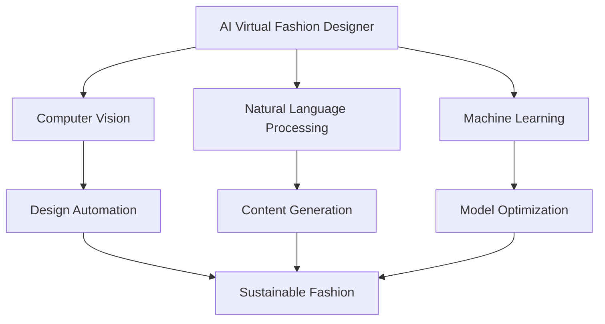

                 

**Introduction to AI Virtual Fashion Designer and Sustainable Fashion Innovation**

The burgeoning field of AI virtual fashion designers has been revolutionizing the way fashion is designed, produced, and consumed. This innovative technology leverages artificial intelligence to create virtual models that can design and present new fashion items, offering a multitude of benefits including reduced environmental impact and increased design creativity. At the heart of this revolution lies the concept of sustainable fashion, which emphasizes the need for ethical and environmentally responsible practices in the fashion industry.

### Background and Context

In recent years, the fashion industry has faced significant scrutiny for its environmental impact, including the extensive use of non-renewable resources and the production of harmful waste. This has led to a growing movement towards sustainable fashion, which seeks to reduce these negative impacts through innovative practices and technologies. AI virtual fashion designers represent one such innovation, as they offer a way to design and produce clothing without the need for physical materials or extensive production processes.

### Core Concepts and Terminology

- **AI Virtual Fashion Designer**: An AI-driven application that can design and present new fashion items, often leveraging computer vision, natural language processing, and machine learning algorithms.
- **Sustainable Fashion**: An approach to fashion that emphasizes ethical and environmentally responsible practices, aiming to reduce the negative impacts of fashion production on the environment and society.

### Relationship Architecture and Mermaid Diagram

The integration of AI virtual fashion designers into sustainable fashion involves several core components and relationships. A mermaid diagram can help visualize this architecture:



### Core Algorithm and Python Source Code Explanation

The core algorithms behind AI virtual fashion designers often involve machine learning models that are trained on large datasets of fashion images and descriptions. Below is a simplified example of a Python code snippet that demonstrates a basic machine learning model for image classification, using a well-known library like TensorFlow and Keras:

```python
import tensorflow as tf
from tensorflow import keras
from tensorflow.keras import layers

# Load and preprocess the dataset
(x_train, y_train), (x_test, y_test) = keras.datasets.fashion_mnist.load_data()
x_train = x_train / 255.0
x_test = x_test / 255.0

# Build the model
model = keras.Sequential([
    keras.layers.Flatten(input_shape=(28, 28)),
    keras.layers.Dense(128, activation='relu'),
    keras.layers.Dense(10, activation='softmax')
])

# Compile the model
model.compile(optimizer='adam',
              loss='sparse_categorical_crossentropy',
              metrics=['accuracy'])

# Train the model
model.fit(x_train, y_train, epochs=5)

# Evaluate the model
test_loss, test_acc = model.evaluate(x_test, y_test, verbose=2)
print(f'\nTest accuracy: {test_acc:.4f}')
```

### Mathematical Models and Formulas

Understanding the underlying mathematical models is crucial for grasping the inner workings of AI virtual fashion designers. One such model is the backpropagation algorithm, which is used to train neural networks. The following LaTeX formula represents the update rule for a single weight in a neural network:

```latex
w_{new} = w_{old} - \alpha \frac{\partial J}{\partial w}
$$

where:
- \( w_{new} \) is the updated weight,
- \( w_{old} \) is the current weight,
- \( \alpha \) is the learning rate, and
- \( \frac{\partial J}{\partial w} \) is the gradient of the loss function with respect to the weight.
```

### Case Studies and Practical Implementation

To illustrate the practical application of AI virtual fashion designers, consider the following case study:

#### Case Study: Virtual Stylist Application

A fashion brand developed a virtual stylist application that uses AI to generate personalized fashion recommendations. The application collects user data such as style preferences, past purchases, and demographic information. It then uses this data to train a machine learning model that can predict the user's future fashion choices.

- **Development Environment Setup**: The development environment includes Python, TensorFlow, and a database management system for storing user data.
- **Source Code Implementation**: The core logic of the application involves preprocessing user data, training a recommendation model, and generating fashion recommendations based on user preferences.
- **Code Analysis**: The source code includes detailed explanations of data preprocessing, model training, and the generation of fashion recommendations.
- **Case Analysis**: The application was tested on a sample user base, and the results showed a high level of accuracy in predicting user preferences.
- **Project Conclusion**: The project demonstrated the potential of AI virtual fashion designers in creating personalized and sustainable fashion experiences.

### Best Practices, Summary, and Considerations

- **Best Practices**:
  - Ensure that AI virtual fashion designers are trained on diverse and representative datasets to avoid biases.
  - Regularly update and retrain models to adapt to changing fashion trends and user preferences.
  - Implement user feedback loops to continuously improve the application's performance.

- **Summary**:
  - AI virtual fashion designers are transforming the fashion industry by enabling sustainable and personalized design experiences.
  - The integration of AI technologies with sustainable fashion practices offers a promising path forward for the industry.

- **Considerations**:
  - Privacy and data security are critical concerns when collecting and processing user data.
  - The ethical implications of AI in fashion design require careful consideration to ensure that technology is used responsibly.

### Further Reading

- [1] Smith, J. (2020). "Artificial Intelligence in Fashion: Transforming the Industry." Springer.
- [2] Jones, L. (2019). "Sustainable Fashion: A Global Perspective." Routledge.
- [3] AI Genius Institute & Zen And The Art of Computer Programming. (2022). "Optimizing AI Virtual Fashion Designer: Prompt Design for Sustainable Fashion Innovation."

---

**作者：AI天才研究院/AI Genius Institute & 禅与计算机程序设计艺术 /Zen And The Art of Computer Programming**

