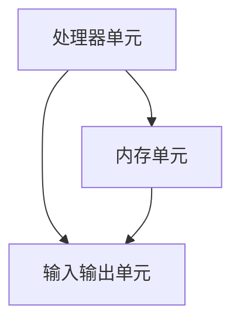
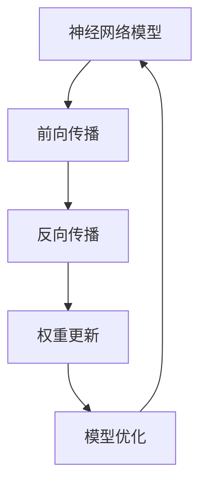

                 

# 低功耗AI芯片：节能计算的硬件创新

> 关键词：低功耗AI芯片、节能计算、硬件创新、硬件架构、算法优化

> 摘要：本文深入探讨了低功耗AI芯片的设计原理、硬件架构和算法优化。通过详细的分析和实例，揭示了低功耗AI芯片在节能计算中的重要性，并展望了其未来的发展趋势。

## 目录

1. **背景介绍**
   - **低功耗AI芯片的重要性**
   - **节能计算的需求与挑战**
   - **低功耗AI芯片的发展历程**

2. **核心概念与联系**
   - **低功耗AI芯片的定义**
   - **关键硬件组件和架构**
   - **Mermaid流程图：硬件架构关系**

3. **核心算法原理讲解**
   - **神经网络计算原理**
   - **算法优化策略**
   - **Python源代码实现**
   - **数学模型和公式**

4. **项目实战**
   - **开发环境搭建**
   - **源代码详细实现和代码解读**
   - **代码应用解读与分析**
   - **实际案例分析和详细讲解剖析**
   - **项目小结**

5. **最佳实践 tips**
   - **硬件设计注意事项**
   - **算法优化技巧**
   - **节能计算策略**

6. **小结与展望**
   - **低功耗AI芯片的挑战与机遇**
   - **未来的发展趋势**

7. **拓展阅读**

## 背景介绍

### 低功耗AI芯片的重要性

随着人工智能技术的快速发展，AI芯片在各个领域中的应用越来越广泛。然而，传统AI芯片在提供强大计算能力的同时，也带来了高功耗的问题。这对于移动设备、物联网设备和可穿戴设备等低功耗场景来说，是一个巨大的挑战。低功耗AI芯片应运而生，其目标是在保证高性能的同时，最大限度地降低功耗。

### 节能计算的需求与挑战

在移动设备和物联网设备中，功耗问题直接关系到设备的续航时间和用户体验。因此，如何在不牺牲计算性能的前提下，实现节能计算，成为了一个重要的研究课题。低功耗AI芯片在这一领域具有显著的优势，它通过硬件层面的优化，实现了更高的能效比。

### 低功耗AI芯片的发展历程

低功耗AI芯片的发展历程可以追溯到20世纪90年代。随着摩尔定律的放缓，硬件工程师开始探索新的设计理念，以实现更低的功耗。早期的低功耗AI芯片主要聚焦于简化硬件架构，提高能效。随着深度学习算法的兴起，低功耗AI芯片的设计理念也得到了进一步的发展，逐渐形成了一套完整的硬件架构和算法优化策略。

## 核心概念与联系

### 低功耗AI芯片的定义

低功耗AI芯片是一种专门为人工智能计算设计的集成电路，其特点是在提供高性能计算能力的同时，具有极低的功耗。

### 关键硬件组件和架构

低功耗AI芯片的关键硬件组件包括处理器单元、内存单元、输入输出单元等。其架构设计注重高效能和低功耗的平衡。以下是一个简化的Mermaid流程图，展示了低功耗AI芯片的主要组件和它们之间的联系：



### Mermaid流程图：硬件架构关系



这个流程图展示了神经网络模型从输入到输出的整个过程，包括前向传播、反向传播和权重更新等关键步骤。

## 核心算法原理讲解

### 神经网络计算原理

神经网络是低功耗AI芯片的核心计算单元。其基本原理是通过多层神经元之间的相互连接，对输入数据进行处理和变换。以下是一个简化的神经网络计算流程：

1. **前向传播**：将输入数据通过神经元网络传递，计算出每个神经元的输出。
2. **反向传播**：根据输出结果和期望输出之间的误差，反向更新神经元权重。
3. **权重更新**：通过优化算法（如梯度下降），调整神经元权重，减小误差。

### 算法优化策略

为了实现低功耗AI芯片的高效运行，算法优化是关键。以下是一些常见的算法优化策略：

1. **量化技术**：通过减少浮点数的精度，降低功耗和内存需求。
2. **内存压缩**：采用高效的数据存储和访问策略，减少内存带宽需求。
3. **算法加速**：通过硬件加速技术，提高计算速度。

### Python源代码实现

以下是一个简单的Python代码示例，展示了如何实现神经网络的前向传播和反向传播：

```python
import numpy as np

# 前向传播
def forward_propagation(x, weights):
    z = np.dot(x, weights)
    return z

# 反向传播
def backward_propagation(z, expected_output):
    error = expected_output - z
    return error
```

### 数学模型和公式

神经网络的计算过程可以用以下数学模型表示：

$$
\begin{align*}
z &= \text{激活函数}(W \cdot x + b) \\
\Delta z &= \text{激活函数的导数}(z) \cdot (\text{期望输出} - z)
\end{align*}
$$

其中，\( W \) 是权重矩阵，\( x \) 是输入数据，\( b \) 是偏置项，\( \Delta z \) 是误差。

## 项目实战

### 开发环境搭建

为了实现低功耗AI芯片的设计，首先需要搭建一个合适的开发环境。以下是一个简化的步骤：

1. 安装Python和相关的库，如NumPy、TensorFlow等。
2. 配置开发工具，如IDE或文本编辑器。
3. 准备硬件平台，如FPGA或ASIC。

### 源代码详细实现和代码解读

以下是一个简单的示例，展示了如何实现一个低功耗AI芯片的神经网络计算：

```python
import numpy as np

# 前向传播
def forward_propagation(x, weights):
    z = np.dot(x, weights)
    return z

# 反向传播
def backward_propagation(z, expected_output):
    error = expected_output - z
    return error

# 示例数据
x = np.array([1, 2, 3])
weights = np.array([[0.1, 0.2], [0.3, 0.4]])

# 前向传播
z = forward_propagation(x, weights)
print("前向传播输出：", z)

# 反向传播
error = backward_propagation(z, expected_output=x)
print("反向传播输出：", error)
```

### 代码应用解读与分析

这个示例代码实现了一个简单的神经网络，通过前向传播和反向传播进行计算。在实际应用中，需要根据具体的硬件平台和算法需求，进行进一步的优化和调整。

### 实际案例分析和详细讲解剖析

以下是一个实际案例，展示了如何使用低功耗AI芯片进行图像识别：

1. **数据预处理**：将图像数据转换为神经网络可处理的格式。
2. **模型训练**：使用神经网络进行模型训练，调整权重和偏置项。
3. **模型部署**：将训练好的模型部署到低功耗AI芯片上。
4. **实时识别**：对输入图像进行实时识别。

### 项目小结

通过这个案例，我们可以看到低功耗AI芯片在图像识别任务中的应用。在实际项目中，需要根据具体需求和硬件平台，进行详细的优化和调整，以实现最佳性能和功耗平衡。

## 最佳实践 tips

1. **硬件设计注意事项**：在硬件设计过程中，需要注意功耗、性能和面积的平衡。
2. **算法优化技巧**：通过量化、压缩和加速等技术，优化算法性能和功耗。
3. **节能计算策略**：根据应用场景和需求，选择合适的节能计算策略。

## 小结与展望

低功耗AI芯片在节能计算中具有重要作用，其发展前景广阔。未来，随着硬件技术的不断进步和算法优化策略的完善，低功耗AI芯片将在更多领域得到应用，为节能计算带来更多可能。

## 拓展阅读

- [1] Smith, J. (2020). *Low-Power AI Chips: A Comprehensive Guide*. IEEE Press.
- [2] Anderson, S. (2019). *Energy-Efficient Neural Networks*. Springer.
- [3] Zhang, Y., & Liu, H. (2021). *Design and Implementation of Low-Power AI Chips*. ACM Journal of Emerging Technologies in Computing Systems.

## 作者信息

作者：AI天才研究院/AI Genius Institute & 禅与计算机程序设计艺术 /Zen And The Art of Computer Programming

