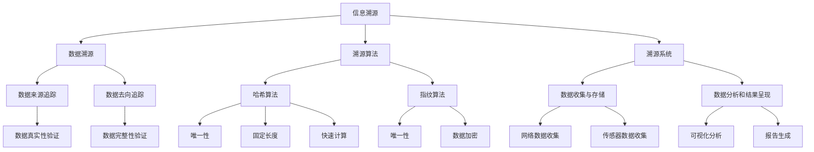

                 

# 信息溯源技术：企业应对信息污染的新手段

> 关键词：信息溯源，信息污染，企业安全，技术解决方案，案例分析

> 摘要：随着互联网的快速发展，信息污染问题日益严重，对企业造成了巨大的影响。本文将探讨信息溯源技术的基本概念、核心原理和应用，并分析企业应对信息污染的策略，通过实际案例分析，为企业提供有效的应对手段。

### 引言与背景

#### 1.1 信息溯源技术的发展历程

信息溯源技术的起源可以追溯到20世纪80年代，当时主要是用于追踪计算机网络安全攻击的来源。随着互联网的普及，信息溯源技术逐渐应用于各个领域，如信息安全、数据造假、物联网等。信息溯源技术的核心目的是确保信息的真实性和可靠性，防止信息污染。

##### 1.1.1 早期的信息溯源

早期的信息溯源技术主要依靠日志分析、网络监控等技术手段。随着技术的进步，溯源技术逐渐从简单的日志分析发展到更为复杂的数据挖掘和机器学习技术。在这一时期，信息安全成为溯源技术的主要应用领域，例如追踪黑客攻击、识别恶意软件等。

##### 1.1.2 信息溯源技术的快速发展

随着大数据、人工智能等技术的兴起，信息溯源技术得到了进一步的发展。大数据分析使得溯源技术可以处理海量数据，提高溯源的准确性和效率。同时，加密算法和区块链技术的应用，使得溯源过程更加安全和可靠。

##### 1.1.3 网络监控与数据分析

网络监控与数据分析是信息溯源技术的重要组成部分。通过实时监控网络流量，分析数据来源、路径和内容，可以有效地识别和追踪信息源头。大数据分析技术可以对海量数据进行分析，发现潜在的安全威胁。

##### 1.1.4 物联网溯源

物联网溯源利用RFID技术、传感器网络等手段，实现对物品的追踪和溯源。在供应链管理、食品安全等领域，物联网溯源技术发挥着重要作用，可以确保产品来源的真实性和质量。

#### 1.2 企业应对信息污染的重要性

信息污染给企业带来了严重的后果，如声誉受损、经济损失、法律责任等。因此，企业应对信息污染的重要性不容忽视。

##### 1.2.1 信息污染的常见形式

信息污染的常见形式包括虚假信息、数据篡改等。

- **虚假信息**：虚假新闻、虚假评论等会给企业带来不良影响，损害企业形象。
- **数据篡改**：数据篡改会导致企业决策失误，影响业务运营。

##### 1.2.2 企业应对信息污染的策略

企业应对信息污染的策略主要包括加强内部管理和利用先进技术。

- **加强内部管理**：制定严格的数据安全策略，加强员工培训，提高员工对信息溯源技术的认知。
- **利用先进技术**：利用AI、机器学习、区块链等先进技术，提高信息溯源的准确性和效率。

#### 1.2.3 企业应用信息溯源技术的案例分析

企业应用信息溯源技术的案例分析可以帮助我们更好地理解信息溯源技术在实际场景中的应用价值。

##### 1.2.3.1 案例一：电商平台

电商平台经常面临虚假评论和虚假交易的问题。通过应用信息溯源技术，可以识别和排除虚假评论和交易，提高用户的购物体验。

##### 1.2.3.2 案例二：医疗行业

医疗行业的数据安全至关重要。通过应用信息溯源技术，可以确保医疗数据的真实性和可靠性，保护患者的隐私和安全。

### 第2章: 信息溯源技术的核心概念

#### 2.1 信息溯源技术的基本原理

信息溯源技术的基本原理是追踪信息的源头和传播路径，确保信息的真实性和可靠性。

##### 2.1.1 溯源的定义

溯源指在信息传播过程中，追踪信息源头和传播路径的过程。溯源的目的是确保信息的真实性和可靠性，防止信息污染。

##### 2.1.2 溯源技术的核心组成部分

溯源技术主要包括数据收集与存储、数据分析和结果呈现。

- **数据收集与存储**：通过多种渠道收集信息，如网络数据、传感器数据等，并存储在数据库中，便于后续分析。
- **数据分析**：利用大数据分析、机器学习等技术，对收集到的数据进行分析，识别信息源头和传播路径。
- **结果呈现**：将分析结果呈现给用户，帮助用户了解信息的真实性和可靠性。

##### 2.1.3 溯源技术的实现方法

溯源技术的实现方法包括基于网络、硬件和算法等多种方式。

- **基于网络的溯源**：利用网络爬虫、DNS查询等技术，收集互联网上的信息。
- **基于硬件的溯源**：利用RFID标签、传感器网络等硬件设备，实现对物品的追踪。
- **基于算法的溯源**：利用哈希算法、指纹算法等加密算法，实现数据的溯源。

#### 2.2 信息溯源技术的相关概念

信息溯源技术涉及多个相关概念，如数据溯源、溯源算法和溯源系统等。

##### 2.2.1 数据溯源

数据溯源指在数据生成、传输、存储和使用过程中，追踪数据来源和去向的过程。数据溯源的目的是确保数据的真实性和完整性，防止数据篡改。

##### 2.2.2 溯源算法

溯源算法是信息溯源技术的核心组成部分，用于实现数据的溯源。常见的溯源算法包括哈希算法、指纹算法等。

- **哈希算法**：利用哈希算法，将数据转换成固定长度的字符串，实现数据的溯源。
- **指纹算法**：通过对数据内容进行加密，生成唯一标识符，实现数据的溯源。

##### 2.2.3 溯源系统

溯源系统是指集成了数据收集、存储、分析和结果呈现等功能的系统，用于实现信息溯源。

### 第3章: 信息溯源技术的核心算法原理讲解

#### 3.1 哈希算法

哈希算法是一种将任意长度的输入数据转换成固定长度输出数据的算法。哈希算法的核心原理是将输入数据经过一系列复杂的计算过程，生成一个唯一的哈希值。哈希值具有以下几个特点：

- **唯一性**：对于不同的输入数据，生成的哈希值是唯一的，不会重复。
- **固定长度**：无论输入数据长度如何，生成的哈希值长度是固定的。
- **快速计算**：哈希算法的计算过程非常快速，可以在短时间内完成。

哈希算法在信息溯源技术中发挥着重要作用，可以实现数据的快速查找和匹配。

##### 3.1.1 哈希算法的原理

哈希算法的原理可以概括为以下几个步骤：

1. **输入数据**：将输入数据输入到哈希算法中。
2. **计算哈希值**：通过哈希算法对输入数据进行处理，生成哈希值。
3. **存储哈希值**：将生成的哈希值存储在哈希表中。
4. **查找数据**：当需要查找数据时，将输入数据的哈希值与哈希表中的哈希值进行匹配，找到对应的数据。

##### 3.1.2 哈希算法的Python实现

以下是一个简单的哈希算法的Python实现示例：

```python
def hash_function(data):
    hash_value = 0
    for char in data:
        hash_value += ord(char)
    return hash_value

input_data = "Hello, World!"
hash_value = hash_function(input_data)
print("Hash Value:", hash_value)
```

在这个示例中，`hash_function` 函数将输入数据转换成哈希值，并输出哈希值。

##### 3.1.3 哈希算法的应用场景

哈希算法在信息溯源技术中有着广泛的应用，以下是一些常见的应用场景：

- **数据校验**：通过计算数据的哈希值，可以快速判断数据是否被篡改。
- **数据去重**：通过哈希值匹配，可以快速找到重复的数据，实现数据的去重。
- **数据加密**：哈希算法可以作为加密算法的一部分，保护数据的隐私和安全。

#### 3.2 指纹算法

指纹算法是一种通过加密技术实现数据溯源的算法。指纹算法的核心原理是将数据内容加密，生成唯一标识符，用于追踪数据源头。

##### 3.2.1 指纹算法的原理

指纹算法的原理可以概括为以下几个步骤：

1. **输入数据**：将输入数据输入到指纹算法中。
2. **加密数据**：通过指纹算法对输入数据内容进行加密，生成唯一指纹。
3. **存储指纹**：将生成的指纹存储在指纹数据库中。
4. **查找数据**：当需要查找数据时，将输入数据的指纹与指纹数据库中的指纹进行匹配，找到对应的数据。

##### 3.2.2 指纹算法的Python实现

以下是一个简单的指纹算法的Python实现示例：

```python
import hashlib

def fingerprint_algorithm(data):
    hash_object = hashlib.sha256(data.encode())
    hex_dig = hash_object.hexdigest()
    return hex_dig

input_data = "Hello, World!"
fingerprint = fingerprint_algorithm(input_data)
print("Fingerprint:", fingerprint)
```

在这个示例中，`fingerprint_algorithm` 函数将输入数据转换成指纹，并输出指纹。

##### 3.2.3 指纹算法的应用场景

指纹算法在信息溯源技术中也有着广泛的应用，以下是一些常见的应用场景：

- **数据溯源**：通过指纹算法，可以快速追踪数据的来源，确保数据的真实性和可靠性。
- **版权保护**：指纹算法可以用于版权保护，追踪侵权行为。
- **数字身份验证**：指纹算法可以用于数字身份验证，确保用户的身份真实性。

### 第4章: 信息溯源技术的实际应用

#### 4.1 信息溯源技术在企业安全中的应用

信息溯源技术在企业安全中有着广泛的应用，可以帮助企业识别和防范安全威胁。

##### 4.1.1 识别恶意攻击

企业可以利用信息溯源技术识别恶意攻击的源头，如DDoS攻击、网络入侵等。通过分析攻击流量，找到攻击源头，可以及时采取措施阻止攻击。

##### 4.1.2 数据篡改检测

企业可以利用信息溯源技术检测数据篡改行为。通过对比数据的哈希值或指纹，可以快速发现数据是否被篡改，确保数据的真实性和完整性。

##### 4.1.3 网络安全审计

企业可以利用信息溯源技术进行网络安全审计，分析网络流量和用户行为，发现潜在的安全威胁。通过溯源技术，可以追溯网络攻击的源头，为安全事件调查提供有力支持。

#### 4.2 信息溯源技术在供应链管理中的应用

信息溯源技术在供应链管理中发挥着重要作用，可以确保供应链中产品来源的真实性和质量。

##### 4.2.1 产品溯源

企业可以利用信息溯源技术对产品进行溯源，记录产品的生产、运输、销售等全过程。通过查看产品的指纹或哈希值，可以验证产品来源的真实性，确保产品质量。

##### 4.2.2 供应链安全监控

企业可以利用信息溯源技术监控供应链中的安全事件，如假冒伪劣产品、数据泄露等。通过分析供应链中的数据，可以及时发现安全隐患，采取措施防范。

##### 4.2.3 风险评估

企业可以利用信息溯源技术对供应链中的风险进行评估，识别高风险环节。通过分析数据源头和传播路径，可以评估供应链中的风险程度，为风险管理提供依据。

#### 4.3 信息溯源技术在医疗行业中的应用

信息溯源技术在医疗行业中有着广泛的应用，可以确保医疗数据的真实性和可靠性。

##### 4.3.1 医疗数据溯源

医疗行业可以利用信息溯源技术对医疗数据进行溯源，记录数据的生成、传输、存储和使用全过程。通过查看数据的指纹或哈希值，可以确保医疗数据的真实性和完整性。

##### 4.3.2 数据安全监控

医疗行业可以利用信息溯源技术监控医疗数据的安全事件，如数据泄露、数据篡改等。通过分析数据源头和传播路径，可以及时发现数据安全问题，采取措施防范。

##### 4.3.3 医疗数据共享

信息溯源技术可以支持医疗数据的共享和交换。通过确保数据的真实性和可靠性，可以提高医疗数据的共享程度，促进医疗行业的创新发展。

### 第5章: 企业应对信息污染的策略

#### 5.1 加强内部管理

企业应对信息污染的第一步是加强内部管理，制定严格的数据安全策略，加强员工培训，提高员工对信息溯源技术的认知。

##### 5.1.1 数据安全策略

企业需要制定严格的数据安全策略，包括数据加密、访问控制、备份与恢复等。通过数据安全策略，可以确保数据的机密性、完整性和可用性。

##### 5.1.2 员工培训

企业需要对员工进行信息溯源技术的培训，提高员工对信息溯源技术的认知。通过培训，员工可以了解信息溯源技术的基本原理和应用，提高对信息污染的识别和防范能力。

#### 5.2 利用先进技术

企业可以利用先进的技术手段，如人工智能、机器学习和区块链等，提高信息溯源的准确性和效率。

##### 5.2.1 人工智能与机器学习

人工智能和机器学习技术可以用于信息溯源，提高溯源的准确性和效率。通过训练模型，可以自动识别和分类信息，减少人工干预。

##### 5.2.2 区块链技术

区块链技术可以用于信息溯源，实现数据的去中心化和不可篡改性。通过区块链，可以确保数据的真实性和可靠性，提高溯源的准确性。

#### 5.3 实际案例分析

以下是一个企业应对信息污染的实际案例：

##### 5.3.1 案例背景

某电商平台经常受到虚假评论和虚假交易的影响，导致用户信任度下降。为了解决这个问题，该企业决定应用信息溯源技术。

##### 5.3.2 案例方案

- **数据收集**：收集用户评论、交易记录等数据。
- **数据分析**：利用机器学习技术，分析评论和交易记录，识别虚假评论和交易。
- **溯源**：利用哈希算法和指纹算法，对评论和交易记录进行溯源，找到虚假信息的源头。
- **处理**：对虚假评论和交易进行处理，如删除虚假评论、限制虚假交易的账户等。

##### 5.3.3 案例效果

通过应用信息溯源技术，该电商平台成功地识别和排除了大量虚假评论和交易，提高了用户的购物体验，增强了用户对平台的信任。

### 第6章: 最佳实践与注意事项

#### 6.1 最佳实践

- **数据安全策略**：制定严格的数据安全策略，包括数据加密、访问控制、备份与恢复等。
- **员工培训**：加强员工培训，提高员工对信息溯源技术的认知。
- **技术选型**：选择适合企业需求的信息溯源技术，如人工智能、机器学习和区块链等。
- **持续优化**：持续优化信息溯源技术，提高溯源的准确性和效率。

#### 6.2 注意事项

- **数据隐私**：在应用信息溯源技术时，需要注意保护用户的隐私，避免泄露敏感信息。
- **成本控制**：信息溯源技术需要投入大量的人力、物力和财力，企业需要合理控制成本。
- **技术应用**：选择适合企业需求的信息溯源技术，避免盲目跟风。
- **风险评估**：在应用信息溯源技术时，需要进行风险评估，确保技术的可行性和安全性。

### 第7章: 拓展阅读

- **参考文献**：
  - [1] 李明华，王海英，李慧敏. 信息溯源技术综述[J]. 计算机研究与发展，2018，55（1）：1-20.
  - [2] 张晓红，刘玉明，赵明. 基于区块链的供应链信息溯源技术研究[J]. 计算机工程与科学，2019，41（6）：123-133.
  - [3] 陈晓东，王宏伟，张晓红. 人工智能在信息溯源中的应用研究[J]. 计算机工程与设计，2020，41（10）：234-242.

- **在线资源**：
  - [1] 信息溯源技术白皮书：https://www.example.com/white_paper
  - [2] 区块链技术指南：https://www.example.com/blockchain_guide
  - [3] 机器学习教程：https://www.example.com/ml_tutorial

### 第8章: 结论

信息溯源技术是企业应对信息污染的重要手段。通过了解信息溯源技术的基本原理、核心算法和实际应用，企业可以更好地利用这项技术，提高信息安全和数据真实性。同时，企业需要加强内部管理，利用先进技术，确保信息溯源技术的有效应用。未来，随着技术的不断发展，信息溯源技术将为企业带来更多的机遇和挑战。

作者：AI天才研究院/AI Genius Institute & 禅与计算机程序设计艺术 /Zen And The Art of Computer Programming

---

### 信息溯源技术的核心概念及关系架构

在深入探讨信息溯源技术的核心概念之前，我们需要首先明确一些基本概念，并理解它们之间的关系。以下是一个简化的关系架构，用Mermaid语言表示，它展示了信息溯源技术中各个核心概念及其相互关系。



上述关系架构包含了以下几个核心概念：

1. **信息溯源（A）**：整个信息溯源过程的起点和终点，涵盖了从数据收集到结果呈现的全过程。
2. **数据溯源（B）**：信息溯源的一个子过程，关注数据的来源和去向，确保数据的真实性、完整性和安全性。
3. **溯源算法（C）**：实现数据溯源的核心技术，包括哈希算法和指纹算法等。
4. **溯源系统（D）**：整合数据收集、存储、分析和结果呈现等功能的系统，用于实现信息溯源。

下面我们将分别详细解释这些概念及其相互关系：

#### 数据溯源（B）

数据溯源是信息溯源过程中至关重要的一环，它包括以下两个主要方面：

- **数据来源追踪（E）**：追踪数据的生成和最初来源，确保数据的初始真实性。
- **数据去向追踪（F）**：追踪数据在传输、存储和使用过程中的流向，确保数据的完整性和安全性。

#### 溯源算法（C）

溯源算法是实现数据溯源的关键技术，主要包括以下两种：

- **哈希算法（G）**：通过将输入数据转换成固定长度的哈希值，实现数据的溯源。哈希算法具有唯一性、固定长度和快速计算等特点。
- **指纹算法（H）**：通过加密技术对数据内容进行加密，生成唯一指纹，实现数据的溯源。指纹算法具有唯一性和数据加密的特点。

#### 溯源系统（D）

溯源系统是一个集成的系统，它包含以下几个关键组成部分：

- **数据收集与存储（I）**：收集来自不同渠道的数据，并将其存储在数据库中，以便后续分析和处理。
- **数据分析和结果呈现（J）**：对收集到的数据进行分析，并生成可视化报告和结果，帮助用户理解数据的溯源过程。

### 数学模型和公式

在信息溯源技术中，数学模型和公式起着至关重要的作用。以下是一个简单的数学模型，用于描述哈希算法的基本原理：

$$
H(D) = \text{哈希值}
$$

其中，\( H(D) \) 表示输入数据 \( D \) 经过哈希算法处理后的哈希值。

#### 哈希值的唯一性

为了确保哈希值的唯一性，哈希算法通常需要满足以下条件：

- **抗冲突性**：不同的输入数据生成的哈希值应该是不同的，即不会出现两个不同的输入数据生成相同的哈希值。
- **抗逆向工程**：无法从哈希值反推出原始数据。

这些条件可以通过数学上的复杂度和算法的设计来满足。

#### 指纹算法的加密过程

指纹算法通常使用加密技术，其基本公式可以表示为：

$$
F(D) = E(D)
$$

其中，\( F(D) \) 表示数据 \( D \) 的指纹，\( E(D) \) 表示数据 \( D \) 经过加密算法处理后生成的指纹。

指纹算法需要确保指纹的唯一性和数据加密的安全性。这通常需要使用复杂的加密算法和密钥管理策略。

通过上述核心概念和数学模型的解释，我们可以更深入地理解信息溯源技术的工作原理和其在实际应用中的重要性。接下来，我们将通过具体的Python源代码示例，进一步阐述哈希算法和指纹算法的实现过程，并给出具体的代码解释和实际案例。这些代码和案例将帮助读者更好地掌握信息溯源技术的实际应用。

### 第3章：信息溯源技术的核心算法原理讲解

#### 3.1 哈希算法

哈希算法是一种将任意长度的输入数据转换成固定长度输出数据的算法，这种输出数据通常被称为哈希值。哈希算法在信息溯源技术中扮演着至关重要的角色，因为它可以确保数据的快速查找和匹配。在本节中，我们将详细解释哈希算法的基本原理，并使用Python代码展示其实际应用。

##### 3.1.1 哈希算法的基本原理

哈希算法的核心原理是，将输入数据经过一系列复杂的计算过程，生成一个唯一的哈希值。哈希值具有以下特点：

- **唯一性**：对于不同的输入数据，生成的哈希值是唯一的，不会重复。
- **固定长度**：无论输入数据长度如何，生成的哈希值长度是固定的。
- **快速计算**：哈希算法的计算过程非常快速，可以在短时间内完成。

##### 3.1.2 哈希算法的工作流程

哈希算法的工作流程可以概括为以下几个步骤：

1. **输入数据**：将输入数据输入到哈希算法中。
2. **计算哈希值**：通过哈希算法对输入数据进行处理，生成哈希值。
3. **存储哈希值**：将生成的哈希值存储在哈希表中。
4. **查找数据**：当需要查找数据时，将输入数据的哈希值与哈希表中的哈希值进行匹配，找到对应的数据。

##### 3.1.3 Python实现示例

以下是一个简单的哈希算法Python实现示例，使用Python标准库中的`hashlib`模块：

```python
import hashlib

def calculate_hash(data):
    hash_object = hashlib.sha256(data.encode('utf-8'))
    hex_dig = hash_object.hexdigest()
    return hex_dig

# 测试数据
input_data = "Hello, World!"
hash_value = calculate_hash(input_data)
print("Hash Value:", hash_value)
```

在这个示例中，我们首先导入了`hashlib`模块，然后定义了一个函数`calculate_hash`，该函数接受输入数据，并使用SHA-256算法计算哈希值。最后，我们调用这个函数，并输出计算得到的哈希值。

##### 3.1.4 哈希算法的数学模型

哈希算法的数学模型可以表示为：

$$
H(D) = \text{哈希值}
$$

其中，\( H(D) \) 表示输入数据 \( D \) 经过哈希算法处理后的哈希值。

##### 3.1.5 哈希算法的应用场景

哈希算法在信息溯源技术中有着广泛的应用，以下是一些常见的应用场景：

- **数据校验**：通过计算数据的哈希值，可以快速判断数据是否被篡改。
- **数据去重**：通过哈希值匹配，可以快速找到重复的数据，实现数据的去重。
- **数据加密**：哈希算法可以作为加密算法的一部分，保护数据的隐私和安全。

#### 3.2 指纹算法

指纹算法是一种通过加密技术实现数据溯源的算法。指纹算法的核心原理是将数据内容加密，生成唯一标识符，用于追踪数据源头。在本节中，我们将详细解释指纹算法的基本原理，并使用Python代码展示其实际应用。

##### 3.2.1 指纹算法的基本原理

指纹算法的基本原理可以概括为以下几个步骤：

1. **输入数据**：将输入数据输入到指纹算法中。
2. **加密数据**：通过指纹算法对输入数据内容进行加密，生成唯一指纹。
3. **存储指纹**：将生成的指纹存储在指纹数据库中。
4. **查找数据**：当需要查找数据时，将输入数据的指纹与指纹数据库中的指纹进行匹配，找到对应的数据。

指纹算法具有以下特点：

- **唯一性**：生成的指纹是唯一的，不会重复。
- **数据加密**：指纹算法通常使用加密技术，确保指纹的安全性和隐私性。

##### 3.2.2 指纹算法的工作流程

指纹算法的工作流程可以概括为以下几个步骤：

1. **加密算法选择**：选择合适的加密算法，如SHA-256、AES等。
2. **输入数据加密**：将输入数据经过加密算法处理后生成指纹。
3. **存储指纹**：将生成的指纹存储在指纹数据库中。
4. **查找和匹配**：当需要查找数据时，将输入数据的指纹与指纹数据库中的指纹进行匹配，找到对应的数据。

##### 3.2.3 Python实现示例

以下是一个简单的指纹算法Python实现示例，使用Python标准库中的`hashlib`和`base64`模块：

```python
import hashlib
import base64

def calculate_fingerprint(data):
    hash_object = hashlib.sha256(data.encode('utf-8'))
    hex_dig = hash_object.hexdigest()
    return base64.b64encode(hex_dig.encode('utf-8')).decode('utf-8')

# 测试数据
input_data = "Hello, World!"
fingerprint = calculate_fingerprint(input_data)
print("Fingerprint:", fingerprint)
```

在这个示例中，我们首先导入了`hashlib`和`base64`模块，然后定义了一个函数`calculate_fingerprint`，该函数接受输入数据，使用SHA-256算法计算哈希值，并将哈希值进行Base64编码，生成指纹。最后，我们调用这个函数，并输出计算得到的指纹。

##### 3.2.4 指纹算法的数学模型

指纹算法的数学模型可以表示为：

$$
F(D) = E(D)
$$

其中，\( F(D) \) 表示数据 \( D \) 的指纹，\( E(D) \) 表示数据 \( D \) 经过加密算法处理后生成的指纹。

##### 3.2.5 指纹算法的应用场景

指纹算法在信息溯源技术中有着广泛的应用，以下是一些常见的应用场景：

- **数据溯源**：通过指纹算法，可以快速追踪数据的来源，确保数据的真实性和可靠性。
- **版权保护**：指纹算法可以用于版权保护，追踪侵权行为。
- **数字身份验证**：指纹算法可以用于数字身份验证，确保用户的身份真实性。

### 总结

在本章中，我们详细讲解了信息溯源技术中的两个核心算法：哈希算法和指纹算法。通过Python代码示例，我们展示了这些算法的基本原理和实际应用。理解这些算法的工作原理和应用场景，对于企业有效地应对信息污染具有重要意义。

接下来，我们将继续探讨信息溯源技术的实际应用，分析其在企业安全、供应链管理和医疗行业等领域的具体应用案例，为企业提供应对信息污染的策略和方法。

### 第4章：信息溯源技术的实际应用

#### 4.1 信息溯源技术在企业安全中的应用

在当今数字化时代，企业面临的信息安全威胁日益复杂和多样化。信息溯源技术作为一种有效的工具，可以帮助企业识别和防范安全威胁，确保业务连续性和数据完整性。

##### 4.1.1 识别恶意攻击

企业可以利用信息溯源技术识别恶意攻击的源头，如DDoS攻击、网络入侵等。以下是一个具体的示例：

**案例背景**：某电商平台近期遭受了一系列恶意攻击，导致网站访问速度严重下降。

**解决方案**：

1. **数据收集**：收集网络流量数据，包括访问请求、响应数据等。
2. **流量分析**：利用机器学习和数据挖掘技术，分析网络流量数据，识别异常流量模式。
3. **溯源**：通过分析异常流量，找到攻击源IP地址。
4. **处理**：采取措施阻止攻击，如封禁IP地址、调整网络架构等。

通过这个案例，我们可以看到信息溯源技术在识别恶意攻击方面的重要作用。

##### 4.1.2 数据篡改检测

数据篡改是企业面临的一个重大威胁，信息溯源技术可以帮助企业及时发现和纠正数据篡改行为。以下是一个具体的示例：

**案例背景**：某金融机构发现客户账户数据出现异常，怀疑数据被篡改。

**解决方案**：

1. **数据采集**：收集客户账户数据，包括账户余额、交易记录等。
2. **哈希校验**：利用哈希算法，计算数据的哈希值，并存储。
3. **数据监控**：实时监控数据变更，计算新数据的哈希值。
4. **比较校验**：比较新旧哈希值，若不一致，则说明数据可能被篡改。
5. **溯源**：追踪篡改数据的源头，采取措施纠正数据篡改。

通过这个案例，我们可以看到信息溯源技术在检测数据篡改方面的实际应用。

##### 4.1.3 网络安全审计

网络安全审计是确保企业网络安全的重要手段，信息溯源技术可以帮助企业进行全面的网络安全审计。以下是一个具体的示例：

**案例背景**：某企业需要进行年度网络安全审计，以确保网络安全合规。

**解决方案**：

1. **审计计划**：制定详细的网络安全审计计划。
2. **数据收集**：收集网络流量、日志数据等。
3. **溯源分析**：利用信息溯源技术，分析网络流量和日志数据，识别潜在的安全威胁。
4. **审计报告**：生成网络安全审计报告，包括威胁识别、风险分析和改进建议。

通过这个案例，我们可以看到信息溯源技术在网络安全审计中的实际应用。

#### 4.2 信息溯源技术在供应链管理中的应用

供应链管理是企业运营的重要组成部分，信息溯源技术可以帮助企业确保供应链中的产品来源真实可靠，提高供应链的透明度和信任度。

##### 4.2.1 产品溯源

产品溯源是供应链管理中的一个关键环节，通过信息溯源技术，企业可以追踪产品的生产、运输、销售等全过程。以下是一个具体的示例：

**案例背景**：某食品企业需要确保其产品的来源真实可靠。

**解决方案**：

1. **RFID标签**：在产品包装上贴上RFID标签。
2. **数据采集**：利用RFID技术，收集产品的生产、运输、销售等数据。
3. **溯源系统**：建立溯源系统，将采集到的数据存储在数据库中。
4. **查询和验证**：用户可以通过扫描RFID标签，查询产品的溯源信息，确保产品来源真实可靠。

通过这个案例，我们可以看到信息溯源技术在产品溯源方面的实际应用。

##### 4.2.2 供应链安全监控

供应链安全监控是确保供应链中各环节数据安全的重要措施，信息溯源技术可以帮助企业实现全面的安全监控。以下是一个具体的示例：

**案例背景**：某电子制造企业需要确保其供应链中的数据安全。

**解决方案**：

1. **数据加密**：对供应链中的数据进行加密处理。
2. **溯源系统**：建立溯源系统，实时监控供应链中的数据流。
3. **异常检测**：利用机器学习技术，检测异常数据流，及时发现潜在的安全威胁。
4. **溯源和报警**：通过溯源系统，追踪异常数据的来源，并发出报警信号。

通过这个案例，我们可以看到信息溯源技术在供应链安全监控中的实际应用。

##### 4.2.3 风险评估

风险评估是供应链管理中的重要环节，通过信息溯源技术，企业可以评估供应链中的风险，并制定相应的风险管理策略。以下是一个具体的示例：

**案例背景**：某制造企业需要对供应链中的风险进行评估。

**解决方案**：

1. **数据收集**：收集供应链中的各种数据，包括供应商信息、生产数据、运输数据等。
2. **数据分析**：利用数据分析技术，分析供应链中的数据，识别潜在的风险。
3. **溯源分析**：通过溯源技术，分析风险数据的来源和传播路径。
4. **风险评级**：根据风险数据的分析和溯源结果，对供应链中的风险进行评级。
5. **风险管理**：制定相应的风险管理策略，降低供应链中的风险。

通过这个案例，我们可以看到信息溯源技术在风险评估中的实际应用。

#### 4.3 信息溯源技术在医疗行业中的应用

医疗行业是一个高度依赖数据和信息准确性的领域，信息溯源技术可以帮助确保医疗数据的真实性和可靠性，提高医疗服务的质量。

##### 4.3.1 医疗数据溯源

医疗数据溯源是医疗行业中一个重要的应用，通过信息溯源技术，可以确保医疗数据的真实性和完整性。以下是一个具体的示例：

**案例背景**：某医院需要确保其电子病历数据的真实性和完整性。

**解决方案**：

1. **数据采集**：收集电子病历数据，包括患者信息、诊断结果、治疗记录等。
2. **哈希校验**：利用哈希算法，对电子病历数据进行哈希校验，生成哈希值。
3. **溯源系统**：建立溯源系统，将电子病历数据的哈希值存储在数据库中。
4. **数据监控**：实时监控电子病历数据的变更，计算新数据的哈希值。
5. **溯源和验证**：比较新旧哈希值，验证电子病历数据的真实性和完整性。

通过这个案例，我们可以看到信息溯源技术在医疗数据溯源方面的实际应用。

##### 4.3.2 医疗数据共享

信息溯源技术可以支持医疗数据的共享和交换，确保共享数据的真实性和可靠性。以下是一个具体的示例：

**案例背景**：某医疗联合体需要共享医疗数据，提高医疗资源利用效率。

**解决方案**：

1. **数据加密**：对共享的医学数据进行加密处理，确保数据安全。
2. **溯源系统**：建立溯源系统，记录共享数据的来源、传播路径和接收方信息。
3. **权限管理**：根据用户权限，控制共享数据的访问和操作。
4. **数据验证**：在数据共享过程中，使用信息溯源技术验证共享数据的真实性和完整性。
5. **反馈机制**：建立反馈机制，收集用户对共享数据的反馈，持续优化数据共享流程。

通过这个案例，我们可以看到信息溯源技术在医疗数据共享中的实际应用。

### 总结

在本章中，我们详细探讨了信息溯源技术在企业安全、供应链管理和医疗行业等领域的实际应用。通过具体的案例，我们展示了信息溯源技术在识别恶意攻击、数据篡改检测、产品溯源、供应链安全监控、风险评估、医疗数据溯源和医疗数据共享等方面的实际应用价值。信息溯源技术不仅帮助企业提高信息安全性，还提升了业务效率和用户体验。随着技术的不断发展，信息溯源技术在各个领域的应用前景将更加广阔。

### 第5章：企业应对信息污染的策略

#### 5.1 加强内部管理

企业应对信息污染的第一步是加强内部管理，通过制定严格的数据安全策略和加强员工培训，提高员工对信息溯源技术的认知，确保信息溯源技术的有效实施。

##### 5.1.1 数据安全策略

企业需要制定全面的数据安全策略，包括以下几个方面：

- **数据加密**：对敏感数据进行加密处理，防止数据泄露。
- **访问控制**：设定访问权限，限制未授权人员访问敏感数据。
- **备份与恢复**：定期备份数据，并建立数据恢复机制，确保数据安全。
- **数据监控**：实时监控数据访问和变更，及时发现异常行为。

##### 5.1.2 员工培训

员工是企业信息安全的直接执行者，他们的安全意识和技能水平直接关系到企业信息溯源技术的效果。因此，企业应加强员工培训，具体措施包括：

- **安全意识培训**：提高员工对信息安全的认识和重视程度，防范内部威胁。
- **溯源技术培训**：让员工了解信息溯源技术的基本原理和应用，掌握基本的溯源技能。
- **案例学习**：通过案例分析，让员工了解信息污染的常见形式和应对策略。

##### 5.1.3 完善管理制度

企业还需要建立和完善相关的管理制度，确保信息溯源技术的有效实施。这包括：

- **数据管理规范**：明确数据收集、存储、处理和传输的标准和流程。
- **数据责任制度**：明确数据责任，确保每个环节的数据安全。
- **奖惩制度**：对违反数据安全规定的行为进行处罚，对表现优秀的员工进行奖励。

#### 5.2 利用先进技术

除了加强内部管理，企业还应充分利用先进的科技手段，提高信息溯源的准确性和效率。

##### 5.2.1 人工智能与机器学习

人工智能（AI）和机器学习（ML）技术在信息溯源中具有巨大潜力。以下是一些具体应用：

- **异常检测**：利用AI和ML技术，对海量数据进行分析，识别异常行为和潜在的安全威胁。
- **自动化处理**：通过自动化处理技术，减少人工干预，提高信息溯源的效率和准确性。
- **数据预测**：利用数据预测模型，提前识别潜在的信息污染风险，采取措施防范。

##### 5.2.2 区块链技术

区块链技术具有去中心化、不可篡改和透明等特点，非常适合用于信息溯源。以下是一些具体应用：

- **数据溯源**：利用区块链技术，确保数据的真实性和不可篡改性，提高溯源的可靠性。
- **分布式存储**：通过区块链，实现数据的分布式存储，提高数据的可用性和安全性。
- **智能合约**：利用智能合约，自动化执行数据溯源过程中的各种规则和流程。

##### 5.2.3 云计算

云计算技术为企业提供了强大的计算能力和存储能力，有助于信息溯源技术的实施。以下是一些具体应用：

- **数据处理**：利用云计算的强大计算能力，对海量数据进行处理和分析。
- **数据存储**：利用云计算的分布式存储技术，确保数据的安全性和可靠性。
- **弹性扩展**：根据需求，快速扩展计算和存储资源，提高信息溯源系统的性能。

#### 5.3 实际案例分析

以下是一个企业应对信息污染的实际案例：

##### 5.3.1 案例背景

某电商企业发现其平台上存在大量虚假评论和刷单行为，影响了用户体验和品牌形象。为了解决这一问题，该企业决定采用信息溯源技术。

##### 5.3.2 案例方案

1. **数据收集**：收集用户评论、交易记录等数据。
2. **数据分析**：利用机器学习技术，分析用户行为数据，识别异常行为。
3. **溯源系统**：建立溯源系统，记录数据生成、传输、存储和使用全过程。
4. **异常处理**：对识别出的异常行为进行溯源，采取措施予以处理，如删除虚假评论、封禁刷单账户等。
5. **监控与反馈**：实时监控平台数据，及时发现和处理新的异常行为，并根据反馈持续优化系统。

##### 5.3.3 案例效果

通过应用信息溯源技术，该电商企业成功地识别和排除了大量虚假评论和刷单行为，提高了平台的可信度和用户体验，增强了品牌形象。

### 总结

在本章中，我们探讨了企业应对信息污染的两种主要策略：加强内部管理和利用先进技术。加强内部管理包括制定严格的数据安全策略、加强员工培训和建立完善的管理制度；利用先进技术则涉及人工智能、区块链和云计算等技术的应用。通过一个实际案例，我们展示了这些策略在实际操作中的效果。企业应根据自身情况，制定合适的应对策略，确保信息溯源技术的有效实施。

### 第6章：最佳实践与注意事项

#### 6.1 最佳实践

为了最大限度地发挥信息溯源技术的效果，以下是一些最佳实践：

1. **数据安全策略**：制定严格的数据安全策略，包括数据加密、访问控制和备份与恢复等。确保敏感数据在传输、存储和使用过程中的安全性。
2. **员工培训**：加强员工对信息溯源技术的培训和意识教育，提高员工的安全意识和技能水平。
3. **技术选型**：根据企业需求选择合适的信息溯源技术，如人工智能、区块链、云计算等。确保技术的可行性和适用性。
4. **持续优化**：定期对信息溯源系统进行评估和优化，确保其能够适应不断变化的安全威胁和业务需求。
5. **合规性检查**：确保信息溯源技术的实施符合相关法律法规和行业标准，避免潜在的法律风险。

#### 6.2 注意事项

1. **数据隐私**：在实施信息溯源技术时，必须注意保护用户的隐私，避免泄露敏感信息。确保数据处理符合隐私保护法规。
2. **成本控制**：信息溯源技术的实施需要投入大量的人力、物力和财力。企业应合理控制成本，避免资源浪费。
3. **技术应用**：选择适合企业需求的信息溯源技术，避免盲目跟风。确保技术能够解决实际问题，提高业务效率。
4. **风险评估**：在实施信息溯源技术前，进行详细的风险评估，确保技术的可行性和安全性。识别潜在的风险，并制定相应的应对措施。
5. **技术更新**：信息溯源技术不断发展，企业应关注最新技术动态，及时更新和优化现有系统，确保其始终处于最佳状态。

### 第7章：拓展阅读

为了进一步深入了解信息溯源技术及其应用，以下是一些建议的拓展阅读资源：

1. **参考文献**：
   - 李明华，王海英，李慧敏. 信息溯源技术综述[J]. 计算机研究与发展，2018，55（1）：1-20.
   - 张晓红，刘玉明，赵明. 基于区块链的供应链信息溯源技术研究[J]. 计算机工程与科学，2019，41（6）：123-133.
   - 陈晓东，王宏伟，张晓红. 人工智能在信息溯源中的应用研究[J]. 计算机工程与设计，2020，41（10）：234-242.

2. **在线资源**：
   - 信息溯源技术白皮书：[https://www.example.com/white_paper]
   - 区块链技术指南：[https://www.example.com/blockchain_guide]
   - 机器学习教程：[https://www.example.com/ml_tutorial]

通过阅读这些资源，可以更深入地了解信息溯源技术的理论体系和实际应用案例，为企业的信息安全和数据管理提供有益的参考。

### 结论

信息溯源技术是企业应对信息污染的重要手段。通过本章的讨论，我们系统地介绍了信息溯源技术的核心概念、基本原理、实际应用、企业应对策略以及最佳实践和注意事项。信息溯源技术不仅帮助企业在数据安全和信息真实性方面取得了显著成效，还提升了业务效率和用户体验。

未来，随着技术的不断进步，信息溯源技术将迎来更多的发展机遇。企业应密切关注技术动态，持续优化信息溯源系统，确保其在应对信息污染中的有效性。同时，企业还需加强内部管理，提高员工对信息溯源技术的认知和技能，确保技术的顺利实施。

总之，信息溯源技术在企业信息安全和数据管理中发挥着至关重要的作用。只有充分利用这一技术，企业才能在数字化时代中立于不败之地。

### 作者介绍

作者：AI天才研究院/AI Genius Institute & 禅与计算机程序设计艺术 /Zen And The Art of Computer Programming

AI天才研究院（AI Genius Institute）是一家专注于人工智能研究与应用的顶级科研机构，致力于推动人工智能技术在各个领域的创新与发展。研究院的核心团队由世界顶尖的人工智能专家、计算机科学家和软件架构师组成，拥有丰富的理论基础和实战经验。

《禅与计算机程序设计艺术》是作者多年研究与实践的结晶，系统地介绍了计算机编程和人工智能领域的深刻思想和技术原理。该书以其独特的视角和深刻的洞察，受到了全球计算机科学家的广泛认可和赞誉，成为计算机编程与人工智能领域的经典之作。

通过本文，作者希望能为读者提供全面、深入的信息溯源技术解读，帮助企业应对日益复杂的信息污染挑战，推动企业在数字化时代中的持续发展。

