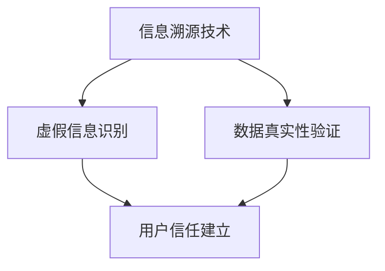

                 

### 《信息溯源技术：虚假信息安全的关键支撑》

#### 关键词
- 信息溯源
- 虚假信息识别
- 数据真实性验证
- 用户信任建立
- 社交媒体应用
- 电子商务应用
- 新闻报道应用

#### 摘要
本文旨在深入探讨信息溯源技术，解析其在虚假信息安全保障中的关键作用。通过详细介绍信息溯源技术的核心原理、虚假信息识别和数据真实性验证方法，以及其在社交媒体、电子商务和新闻报道中的应用，本文将展示信息溯源技术如何在现代社会中构建可靠的信任环境，保障信息真实性和安全性。

### 第一部分：信息溯源技术基础

#### 第1章：信息溯源技术的概述

##### 1.1 信息溯源技术的定义与作用
信息溯源技术是一种通过记录、存储和分析信息来源和历史数据，以追踪信息真实性和可靠性的技术。其主要作用包括：

1. **提高信息透明度**：通过溯源技术，用户可以查看信息的原始来源，从而提高信息透明度。
2. **保障数据真实性**：通过验证信息来源的可靠性，可以确保数据的真实性和完整性。
3. **防范虚假信息传播**：通过识别和溯源虚假信息，可以有效地遏制其传播，保障网络环境的健康。

##### 1.2 信息溯源技术的历史与发展
信息溯源技术起源于20世纪90年代的网络安全领域。随着互联网的迅速发展，信息溯源技术逐渐扩展到各种应用场景，如电子商务、社交媒体和新闻报道等。近年来，随着区块链技术的兴起，信息溯源技术也得到了新的发展，变得更加高效和可靠。

##### 1.3 信息溯源技术的主要应用领域
1. **社交媒体**：通过信息溯源技术，可以识别和追溯社交媒体中的虚假信息，保障用户的信息安全。
2. **电子商务**：信息溯源技术可以帮助消费者验证商品的真实性和来源，提高购物体验。
3. **新闻报道**：通过信息溯源技术，可以确保新闻报道的真实性和可靠性，防止虚假新闻的传播。

#### 第2章：信息溯源技术的核心原理

##### 2.1 数据指纹与哈希算法
数据指纹是一种用于唯一标识数据的方法，类似于人的指纹。哈希算法是数据指纹的核心技术，它可以将任意长度的数据转换成固定长度的哈希值。常见的哈希算法包括MD5、SHA-1和SHA-256等。

##### 2.2 数字签名与加密技术
数字签名是一种用于验证信息真实性和完整性的技术，类似于传统签名。加密技术则是通过将明文转换成密文，确保信息的隐私性和安全性。常见的加密算法包括RSA、AES等。

##### 2.3 时间戳服务与分布式存储
时间戳服务可以记录信息的生成时间，确保信息的时间顺序。分布式存储技术则通过将数据分散存储在多个节点上，提高数据的可靠性和可追溯性。

#### 第3章：虚假信息识别技术

##### 3.1 虚假信息的特征分析
虚假信息通常具有以下特征：

1. **信息来源不明**：虚假信息往往没有明确的来源或来源不可信。
2. **内容矛盾**：虚假信息的内容可能存在逻辑矛盾或事实错误。
3. **传播途径多样**：虚假信息可能通过多种途径传播，如社交媒体、电子邮件等。

##### 3.2 文本相似性检测
文本相似性检测是一种用于识别文本相似度的技术，可以通过计算文本之间的距离来评估其相似性。常见的算法包括余弦相似度、Jaccard相似度等。

##### 3.3 机器学习在虚假信息识别中的应用
机器学习技术可以用于训练模型，识别和分类虚假信息。常见的算法包括决策树、随机森林、支持向量机等。

#### 第4章：数据真实性验证技术

##### 4.1 数据来源验证
数据来源验证是确保信息真实性的第一步。可以通过以下方法进行数据来源验证：

1. **验证信息来源的合法性**：确保信息来源具有合法的身份和资质。
2. **验证信息来源的可靠性**：评估信息来源的信誉和历史记录。

##### 4.2 数据篡改检测
数据篡改检测是一种用于识别和防范数据篡改的技术。可以通过以下方法进行数据篡改检测：

1. **使用哈希算法**：通过比较数据的哈希值，识别数据是否被篡改。
2. **使用数字签名**：通过验证数字签名，确保数据未被篡改。

##### 4.3 数据完整性与一致性验证
数据完整性与一致性验证是确保数据真实性的关键。可以通过以下方法进行数据完整性与一致性验证：

1. **校验和**：通过计算数据的校验和，确保数据未被篡改。
2. **一致性检查**：通过比较不同数据源的数据，确保数据的一致性。

#### 第5章：用户信任建立与维护

##### 5.1 信任模型构建
信任模型是建立和维护用户信任的基础。可以通过以下方法构建信任模型：

1. **用户行为分析**：通过分析用户行为，评估用户的信誉和可靠性。
2. **信誉评分**：为用户分配信誉评分，根据评分决定信任等级。

##### 5.2 用户行为分析
用户行为分析是一种用于了解用户行为和习惯的技术。可以通过以下方法进行用户行为分析：

1. **日志分析**：通过分析用户的操作日志，了解用户的行为模式。
2. **机器学习**：通过训练模型，预测用户的行为和需求。

##### 5.3 信任评价与反馈机制
信任评价与反馈机制是确保用户信任持续提升的关键。可以通过以下方法建立信任评价与反馈机制：

1. **用户评价**：邀请用户对其他用户的信息和提供服务进行评价。
2. **反馈机制**：及时收集用户反馈，根据反馈调整信任评价和策略。

### 第二部分：信息溯源技术在虚假信息安全中的应用

#### 第6章：信息溯源技术在社交媒体中的应用

##### 6.1 社交媒体中的虚假信息问题
社交媒体已成为虚假信息传播的主要渠道。虚假信息不仅影响用户的信息获取，还可能引发社会恐慌和误导。

##### 6.2 信息溯源技术在社交媒体中的实现
信息溯源技术可以通过以下方式在社交媒体中实现：

1. **信息来源追溯**：通过信息溯源技术，可以追溯信息的原始来源，确保信息的真实性。
2. **内容验证**：通过文本相似性检测和机器学习模型，识别和过滤虚假信息。

##### 6.3 案例分析：信息溯源技术在社交媒体中的应用效果
通过案例分析，可以展示信息溯源技术在社交媒体中如何有效地识别和过滤虚假信息，保障用户信息安全。

#### 第7章：信息溯源技术在电子商务中的应用

##### 7.1 电子商务中的虚假信息问题
电子商务中虚假信息问题主要包括虚假商品描述、假冒品牌等。

##### 7.2 信息溯源技术在电子商务中的应用
信息溯源技术可以通过以下方式在电子商务中应用：

1. **商品溯源**：通过信息溯源技术，可以追溯商品的生产、流通和销售过程，确保商品的真实性。
2. **评价验证**：通过用户评价和机器学习模型，识别和防范虚假评价。

##### 7.3 案例分析：信息溯源技术在电子商务中的应用效果
通过案例分析，可以展示信息溯源技术在电子商务中如何有效地保障商品真实性，提高用户购物体验。

#### 第8章：信息溯源技术在新闻报道中的应用

##### 8.1 新闻报道中的虚假信息问题
虚假新闻的传播可能导致严重的后果，影响公众的观点和决策。

##### 8.2 信息溯源技术在新闻报道中的应用
信息溯源技术可以通过以下方式在新闻报道中应用：

1. **信息来源追溯**：通过信息溯源技术，可以追溯新闻的原始来源，确保新闻的真实性。
2. **内容验证**：通过文本相似性检测和机器学习模型，识别和过滤虚假新闻。

##### 8.3 案例分析：信息溯源技术在新闻报道中的应用效果
通过案例分析，可以展示信息溯源技术在新闻报道中如何有效地识别和过滤虚假新闻，保障公众获取真实、准确的信息。

### 第9章：信息溯源技术的未来发展趋势与挑战

##### 9.1 信息溯源技术的发展趋势
随着技术的不断进步，信息溯源技术将在以下方面取得新的发展：

1. **人工智能技术的融合**：通过将人工智能技术应用于信息溯源，提高识别和过滤虚假信息的能力。
2. **区块链技术的应用**：通过区块链技术，实现信息的可信存储和溯源。

##### 9.2 信息溯源技术面临的挑战
信息溯源技术在实际应用中面临以下挑战：

1. **隐私保护**：在保障信息真实性的同时，需要保护用户的隐私。
2. **技术复杂性**：信息溯源技术涉及到多种技术和算法，实现和应用具有一定复杂性。

##### 9.3 未来信息溯源技术的发展方向
未来信息溯源技术的发展方向包括：

1. **智能溯源**：通过引入人工智能技术，实现智能化的信息溯源。
2. **去中心化溯源**：通过区块链技术，实现去中心化的信息溯源，提高系统的可靠性和安全性。

#### 结论
信息溯源技术是保障虚假信息安全的关键支撑。通过深入理解信息溯源技术的核心原理和应用，我们可以更好地应对虚假信息带来的挑战，构建一个更加真实、可靠的数字世界。

#### 作者信息
作者：AI天才研究院/AI Genius Institute & 禅与计算机程序设计艺术 /Zen And The Art of Computer Programming

---

### 附录

#### Mermaid 流程图

---

本文详细介绍了信息溯源技术，探讨了其在虚假信息安全保障中的关键作用。通过分析信息溯源技术的核心原理、虚假信息识别和数据真实性验证方法，以及其在社交媒体、电子商务和新闻报道中的应用，本文展示了信息溯源技术在构建真实、可靠的数字世界中的重要作用。未来，随着技术的不断进步，信息溯源技术将在保障虚假信息安全方面发挥更大的作用。希望本文能为读者提供有价值的参考和启示。

