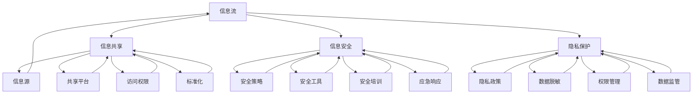

                 

# 《信息生态系统：企业构建可信赖信息环境的方法》

## 关键词
信息生态系统、企业信息化、信息安全性、数据隐私、系统集成

## 摘要
在数字化时代，企业构建可信赖的信息生态系统成为核心竞争力。本文通过深入解析信息生态系统的概念、核心组成要素，探讨了企业如何通过系统性方法来构建和维护一个可信赖的信息环境。文章首先介绍了信息生态系统的基本概念和重要性，然后详细阐述了核心概念之间的关系，并借助Mermaid流程图进行展示。接着，文章从技术选择、架构设计、实施策略等方面，系统地介绍了构建信息生态系统的方法。在此基础上，文章重点讨论了信息安全和隐私保护策略，并通过具体案例研究和项目实战，提供了实际操作经验和教训。最后，文章对信息生态系统未来的发展趋势进行了展望，提出了发展建议。

## 引言：信息生态系统的概念与重要性

### 1.1 信息生态系统的定义
信息生态系统是一个由信息源、信息处理单元、信息传输通道、信息存储单元和用户组成的复杂系统。它模仿自然生态系统中的生物链，强调信息在不同实体之间的流动和交互。在企业层面，信息生态系统涵盖了企业内部的各种信息资源，以及与外部环境的互联互通。

### 1.2 信息生态系统的特点
信息生态系统具有以下几个显著特点：
- **复杂性**：信息生态系统包含多种实体和互动关系，需要系统性思维和设计。
- **动态性**：信息生态系统不断演化，受到技术进步、市场变化和企业战略调整的影响。
- **互操作性**：系统中的各个组成部分能够无缝集成，实现信息的有效共享和利用。
- **可持续性**：信息生态系统注重信息的长期存储和安全管理，确保系统的稳定运行。

### 1.3 信息生态系统在企业中的重要性
在现代企业运营中，信息生态系统扮演着关键角色。其重要性体现在以下几个方面：
- **提高决策效率**：通过高效的信息流动和共享，企业能够快速做出准确的决策。
- **增强竞争力**：可信赖的信息生态系统为企业提供了强大的数据支持和智能分析能力。
- **降低运营成本**：通过优化信息流程和资源共享，企业能够降低运营成本。
- **提升客户满意度**：信息生态系统使得企业能够更好地理解客户需求，提供个性化的服务和产品。

### 1.4 信息化对企业的影响
信息化对企业的影响深远且广泛，主要表现在以下几个方面：
- **业务流程优化**：信息化推动了企业业务流程的自动化和智能化，提高了工作效率。
- **市场扩展**：企业通过互联网和电子商务平台，可以轻松进入全球市场。
- **客户关系管理**：通过客户关系管理系统，企业能够更好地维护和拓展客户关系。
- **数据驱动决策**：企业依靠数据分析来指导战略规划和运营决策。

### 1.5 信息化建设的挑战与应对
尽管信息化为企业带来了巨大机遇，但也伴随着一系列挑战：
- **数据安全**：确保企业数据的安全性是信息化建设的重要任务。
- **技术更新**：信息化技术日新月异，企业需要不断更新技术以保持竞争力。
- **系统集成**：不同系统和平台之间的集成是一个复杂的过程，需要专业的技术支持和规划。
- **人员培训**：信息化建设需要专业的技术人员和用户，因此人员培训至关重要。

通过上述分析和介绍，我们可以清楚地认识到信息生态系统在现代企业中的重要作用，以及信息化建设面临的主要挑战。接下来，我们将进一步探讨信息生态系统的核心概念和构建方法。

## 核心概念与联系

### 2.1 信息流
信息流是指信息在信息生态系统中的流动过程。信息流是信息生态系统的基础，确保了信息从源头到目的地的有效传递。信息流包括信息的生成、传输、处理和存储等环节。

在信息生态系统中，信息流通常遵循以下路径：
1. **信息生成**：由企业内部或外部产生信息，如客户订单、销售数据、市场报告等。
2. **信息传输**：通过网络、数据库和其他传输介质将信息传递到目的地。
3. **信息处理**：在处理单元对信息进行加工、分析、整合和提炼，以产生有价值的数据。
4. **信息存储**：将处理后的信息存储在数据库或文件系统中，以便后续查询和使用。

### 2.2 信息共享
信息共享是信息生态系统中的重要组成部分，它使得企业内部和跨部门、跨系统之间的信息能够高效流通和利用。信息共享不仅提高了工作效率，还促进了企业内部的协作和创新。

信息共享的关键要素包括：
- **共享平台**：建立统一的信息共享平台，实现数据的集中存储和访问。
- **访问权限**：根据用户角色和权限设置，确保信息的安全性和隐私性。
- **标准化**：制定统一的信息标准和规范，提高数据的一致性和兼容性。
- **流程管理**：建立信息共享的流程和管理机制，确保信息共享的规范性和有效性。

### 2.3 信息安全和隐私保护
信息安全和隐私保护是信息生态系统的核心需求，关系到企业的数据资产和业务连续性。在构建信息生态系统时，必须采取一系列措施来确保信息的安全和隐私。

信息安全的关键要素包括：
- **安全策略**：制定全面的信息安全策略，包括访问控制、数据加密、网络安全等。
- **安全工具**：部署防火墙、入侵检测系统、数据加密工具等安全设备，提高系统的防护能力。
- **安全培训**：对员工进行信息安全培训，提高安全意识和操作技能。
- **应急响应**：建立应急响应机制，确保在发生安全事件时能够迅速应对和恢复。

隐私保护的关键要素包括：
- **隐私政策**：明确企业的隐私保护政策，确保用户数据的安全和隐私。
- **数据脱敏**：对敏感数据进行脱敏处理，防止数据泄露。
- **权限管理**：实施严格的权限管理，确保用户只能访问其授权的数据。
- **数据监管**：对数据生命周期进行全程监管，确保数据在生成、传输、处理和存储过程中的安全。

### 2.4 信息生态系统概念关系Mermaid流程图

为了更清晰地展示信息生态系统的核心概念及其相互关系，我们使用Mermaid流程图进行描述：

该流程图展示了信息流、信息共享、信息安全、隐私保护四个核心概念之间的关联，以及它们各自包含的关键要素。通过这种结构化的展示，我们可以更好地理解信息生态系统的工作原理和构建方法。

### 2.5 核心概念与联系总结
信息生态系统中的核心概念相互联系，共同构成了一个有机的整体。信息流是信息生态系统的血液，信息共享是信息的流动渠道，信息安全是系统的防护屏障，隐私保护则是确保数据安全和个人隐私的关键。这四个核心概念相互依赖、相互促进，共同保障了企业信息生态系统的稳定运行和可持续发展。

在构建和维护信息生态系统时，企业需要全面考虑这些核心概念，并采取综合性的策略和措施，确保信息流的高效、安全、可靠，实现信息资源的最大化利用和价值创造。接下来，我们将进一步探讨如何具体构建信息生态系统。

### 构建信息生态系统的方法

构建一个可靠的信息生态系统是企业数字化转型的关键步骤。一个高效的信息生态系统不仅能够提高企业的运营效率，还能为企业提供竞争优势。以下是构建信息生态系统的主要方法，包括技术选择、架构设计和实施策略。

#### 3.1 技术选择

技术选择是构建信息生态系统的第一步。企业需要根据业务需求、预算和技术发展趋势来选择合适的技术。

- **数据存储技术**：企业可以选择关系型数据库（如MySQL、Oracle）或非关系型数据库（如MongoDB、Cassandra）来存储数据。关系型数据库适合结构化数据，而非关系型数据库则更适合处理半结构化或非结构化数据。

- **数据处理技术**：数据处理技术包括ETL（Extract, Transform, Load）工具和大数据处理平台（如Hadoop、Spark）。ETL工具用于数据提取、转换和加载，而大数据处理平台则用于大规模数据的高效处理和分析。

- **云计算平台**：企业可以选择公有云（如AWS、Azure）、私有云或混合云。公有云提供灵活的计算和存储资源，私有云则确保数据的安全性和可控性，混合云结合了两者的优势。

- **安全技术和工具**：企业需要部署防火墙、入侵检测系统（IDS）、入侵防御系统（IPS）等安全设备和工具，确保信息生态系统中的数据安全和隐私保护。

#### 3.2 架构设计

信息生态系统的架构设计是确保其稳定、高效运行的关键。一个良好的架构设计应该具备以下特点：

- **模块化**：架构设计应采用模块化设计，使各个模块独立且可扩展，便于系统的维护和升级。

- **分布式**：为了提高系统的可用性和扩展性，信息生态系统应该采用分布式架构。分布式架构通过将系统分解为多个节点，实现负载均衡和高可用性。

- **弹性**：信息生态系统应具备弹性，能够在处理大量数据时保持高效运行。弹性可以通过自动扩展资源、负载均衡等技术实现。

- **可扩展性**：架构设计应考虑未来的业务增长，确保系统能够轻松扩展以满足不断增长的数据和处理需求。

#### 3.3 实施策略

构建信息生态系统的实施策略包括以下步骤：

- **需求分析**：首先，企业需要进行需求分析，明确信息生态系统的目标和需求。需求分析包括业务需求、技术需求和用户需求等。

- **系统规划**：在明确需求后，企业应制定详细的系统规划，包括技术选型、架构设计、数据模型等。系统规划应考虑长远发展，确保系统能够满足未来的需求。

- **系统实施**：系统实施包括搭建基础设施、部署应用、配置系统和测试等环节。在实施过程中，应遵循最佳实践和规范，确保系统的可靠性和安全性。

- **系统运维**：系统实施完成后，企业需要建立运维团队，负责系统的监控、维护和升级。运维团队应定期对系统进行性能测试和漏洞扫描，确保系统的稳定运行。

#### 3.4 信息化项目管理

信息化项目管理的核心是确保项目按照计划顺利实施，并在预算和时间范围内完成。以下是一些关键步骤：

- **项目启动**：明确项目目标、范围、预算和时间表，组建项目团队，制定项目管理计划。

- **需求管理**：收集和分析用户需求，确保需求明确、一致且可实现。

- **风险管理**：识别项目风险，制定应对策略，确保项目在遇到问题时能够及时应对。

- **沟通管理**：建立有效的沟通机制，确保项目团队和利益相关者之间的信息畅通。

- **质量管理**：制定质量标准和测试计划，确保系统的可靠性和安全性。

- **项目监控和评估**：定期监控项目进展，评估项目绩效，确保项目按计划进行。

通过上述方法和技术，企业可以构建一个高效、可靠、可扩展的信息生态系统，为企业的数字化转型提供强有力的支持。在接下来的章节中，我们将进一步探讨信息安全和隐私保护策略，以及如何管理和维护信息生态系统。

### 信息安全和隐私保护

在构建信息生态系统时，确保信息和数据的安全以及用户的隐私保护至关重要。这不仅关系到企业的声誉和合法性，还直接影响到用户对企业的信任。以下将详细讨论如何确保信息安全和隐私保护，涵盖安全管理、策略制定、技术工具和最佳实践。

#### 4.1 安全管理

安全管理是信息生态系统的基础，它涉及从组织策略到实际操作的所有方面。以下是一些关键的安全管理措施：

- **制定安全策略**：企业应制定全面的安全策略，包括访问控制、数据加密、网络安全、应急响应等。这些策略应与企业的业务目标相一致，并得到全体员工的理解和遵守。

- **建立安全组织**：企业应设立专门的信息安全部门或团队，负责安全管理、风险控制和应急响应。安全组织应定期培训员工，提高他们的安全意识和技能。

- **进行安全培训**：员工是信息安全的第一道防线。企业应定期开展安全培训，使员工了解安全策略、安全技术和操作规范。

- **安全审计和评估**：企业应定期进行安全审计和评估，检查安全策略的有效性和系统的安全性。安全审计应包括物理安全、网络安全、应用安全和数据安全等方面。

#### 4.2 策略制定

有效的信息安全和隐私保护策略是确保信息生态系统安全的关键。以下是一些关键策略：

- **数据分类和分级**：根据数据的重要性和敏感性，对数据进行分类和分级。敏感数据应采取更严格的保护措施。

- **访问控制**：实施强访问控制策略，确保用户只能访问其授权的数据。访问控制应基于身份验证、权限管理和审计追踪。

- **数据加密**：对存储和传输的数据进行加密，确保数据在未授权的情况下无法被读取。常用的加密技术包括对称加密和非对称加密。

- **网络隔离和防火墙**：通过网络隔离和防火墙，防止未经授权的访问和攻击。防火墙应配置适当的规则，限制流量和端口。

- **应急响应和恢复**：制定详细的应急响应和恢复计划，确保在发生安全事件时能够迅速应对和恢复。

#### 4.3 安全技术和工具

为了确保信息安全和隐私保护，企业需要部署一系列安全技术和工具。以下是一些常用的技术和工具：

- **防火墙**：防火墙是网络安全的第一道防线，用于过滤和阻止未经授权的网络流量。

- **入侵检测和防御系统**：入侵检测系统（IDS）和入侵防御系统（IPS）用于检测和阻止恶意攻击和入侵。

- **加密技术**：数据加密技术用于保护存储和传输的数据。常用的加密算法包括AES、RSA等。

- **身份验证和授权**：身份验证技术确保只有授权用户才能访问系统和数据。常用的身份验证方法包括密码、双因素认证等。

- **数据备份和恢复**：定期备份数据，并在发生数据丢失或损坏时进行恢复。备份应存储在安全的位置，以防止数据泄露和损坏。

- **监控和日志分析**：部署监控系统，实时监控系统和网络活动，并分析日志，及时发现和应对安全事件。

#### 4.4 隐私保护策略

隐私保护策略是确保用户数据安全和个人隐私的关键。以下是一些关键策略：

- **隐私政策和通知**：企业应制定明确的隐私政策，告知用户其数据将被如何收集、使用和保护。隐私政策应简单明了，用户应能够轻松理解。

- **数据脱敏**：对敏感数据进行脱敏处理，确保个人身份信息无法被直接识别。

- **权限管理**：实施严格的权限管理，确保用户只能访问其授权的数据。

- **用户数据删除**：在用户请求删除数据时，应立即执行，并确保数据无法被恢复。

- **第三方数据保护**：在与第三方合作时，确保第三方也遵循相同的隐私保护策略。

#### 4.5 最佳实践

以下是一些最佳实践，以加强信息安全和隐私保护：

- **定期更新系统和软件**：定期更新系统和软件，修复已知漏洞，提高系统的安全性。

- **安全测试和审计**：定期进行安全测试和审计，发现和修复潜在的安全漏洞。

- **数据分类和标签**：对数据进行分类和标签，确保数据得到适当的保护。

- **员工安全意识培训**：定期对员工进行安全意识培训，提高员工对安全威胁的认识和防范能力。

- **安全事件应急响应**：建立安全事件应急响应机制，确保在发生安全事件时能够迅速应对和恢复。

通过实施上述策略和最佳实践，企业可以构建一个安全、可靠的信息生态系统，确保信息和用户数据的安全和隐私保护。在接下来的章节中，我们将探讨如何管理和维护信息生态系统。

### 信息生态系统的管理和维护

信息生态系统的管理和维护是确保其稳定、高效运行的关键。随着企业业务的不断发展，信息生态系统需要持续优化和改进，以满足日益增长的数据处理需求和提高运营效率。以下是管理和维护信息生态系统的几个关键步骤和策略。

#### 5.1 监控与评估

监控是管理和维护信息生态系统的基础。通过实时监控系统的运行状态，企业可以及时发现潜在问题并采取措施。以下是一些监控和评估的关键点：

- **性能监控**：定期监控系统性能，包括响应时间、吞吐量、资源利用率等。性能监控可以帮助企业了解系统的运行状况，发现性能瓶颈并进行优化。

- **日志分析**：收集和分析系统日志，及时发现异常行为和安全事件。日志分析可以提供关于系统运行的重要信息，有助于诊断和解决问题。

- **告警机制**：建立告警机制，当系统出现异常或性能下降时，及时向相关人员发出警报。告警机制应覆盖关键指标和潜在风险，确保问题能够得到快速响应。

- **定期评估**：定期对信息生态系统进行评估，包括安全性、可靠性、可扩展性和用户体验等方面。评估结果可以指导后续的改进工作。

#### 5.2 持续改进

信息生态系统需要持续改进，以适应业务需求的变化和技术的发展。以下是一些持续改进的关键策略：

- **需求收集**：定期与业务部门沟通，收集对信息生态系统的改进需求。了解用户的需求和痛点，可以确保系统改进的方向与业务目标一致。

- **迭代开发**：采用敏捷开发方法，分阶段进行系统改进。每次迭代都应聚焦于解决关键问题和提升用户体验，逐步完善系统功能。

- **技术升级**：跟踪技术发展趋势，及时采用新的技术和工具，提升系统的性能和安全性。技术升级应结合企业的实际需求，避免过度更新。

- **测试和质量保证**：在改进过程中，加强测试和质量保证工作。确保每次更新后的系统稳定可靠，避免引入新的问题。

#### 5.3 管理挑战与解决方案

在信息生态系统的管理和维护过程中，企业可能会面临一系列挑战。以下是一些常见的管理挑战及其解决方案：

- **数据安全与隐私保护**：随着数据量的增加，确保数据安全和隐私保护成为重要挑战。解决方案包括加强安全策略、部署加密技术和进行定期的安全审计。

- **系统整合与兼容性**：信息生态系统中的各个系统可能来自不同的供应商或采用不同的技术，整合和兼容性是一个挑战。解决方案包括采用标准化接口、数据格式和集成框架。

- **资源分配与优化**：随着业务的增长，系统资源需求不断增加。如何合理分配和优化资源是一个重要问题。解决方案包括采用自动化资源管理工具、进行负载均衡和优化资源分配策略。

- **人员培训与技能提升**：信息生态系统的管理和维护需要专业的技术团队。如何提升团队技能和知识水平是一个挑战。解决方案包括定期培训、引进高技能人才和建立知识共享机制。

#### 5.4 持续学习与改进

信息生态系统是一个不断演化的系统，需要持续学习和改进。以下是一些持续学习和改进的建议：

- **技术交流与合作**：积极参与技术交流和合作，学习最新的技术和行业动态。与技术社区和合作伙伴保持密切联系，获取有益的见解和经验。

- **用户反馈与改进**：重视用户反馈，收集用户意见和建议，不断改进系统功能和服务质量。通过用户反馈，可以发现系统的不足和改进空间。

- **案例研究与最佳实践**：研究和借鉴其他企业的成功案例和最佳实践，吸取经验和教训，为企业的信息生态系统建设提供参考。

- **创新与探索**：鼓励创新思维和探索精神，不断尝试新的技术和方法，推动信息生态系统的发展。

通过上述管理和维护策略，企业可以确保信息生态系统的高效运行和持续改进，为企业的数字化转型提供坚实支撑。在未来的发展中，企业应不断适应变化，应对挑战，持续优化信息生态系统，以保持竞争优势。

### 案例研究：成功的信息生态系统实践

在构建和维护可信赖的信息生态系统方面，许多企业已经取得了显著的成果。以下通过几个实际案例，详细分析这些企业在信息生态系统建设中的成功经验、所采取的策略以及值得借鉴的教训。

#### 6.1 案例一：XX公司的信息生态系统建设

**背景**：XX公司是一家大型跨国企业，主要从事高科技产品的研发和销售。随着业务的发展，公司面临着数据量急剧增加、系统整合困难、数据安全风险等问题。

**策略与实践**：
1. **需求分析**：公司首先进行了全面的需求分析，明确了信息生态系统的建设目标和关键需求，包括数据整合、业务流程优化、信息安全等。

2. **技术选型**：公司选择了分布式架构和云计算平台，采用MongoDB处理半结构化数据，使用Hadoop进行大数据处理。此外，公司部署了防火墙、入侵检测系统和数据加密工具，确保信息的安全性和隐私保护。

3. **系统实施**：公司实施了ETL工具，将不同系统和平台的数据进行整合。同时，通过模块化设计，确保系统具备良好的扩展性。

4. **安全管理**：公司建立了专门的信息安全部门，定期进行安全培训和审计，确保系统的安全运营。

**经验与教训**：
- **需求明确**：明确的需求分析是成功构建信息生态系统的基础。
- **技术选型**：选择适合自身业务需求的技术和工具，避免盲目跟风。
- **安全投入**：重视安全投入，确保信息系统的安全性和稳定性。

#### 6.2 案例二：YY公司的信息共享机制

**背景**：YY公司是一家大型制造业企业，内部信息孤岛严重，跨部门协作不畅，影响了业务效率。

**策略与实践**：
1. **共享平台建设**：公司搭建了统一的信息共享平台，实现了数据的集中存储和访问。平台采用模块化设计，便于后续的扩展和维护。

2. **访问权限管理**：公司实施了严格的访问权限管理，根据员工角色和权限设置，确保用户只能访问其授权的数据。

3. **标准化与培训**：公司制定了统一的数据标准和操作规范，对员工进行标准化培训，提高信息共享的效率和规范性。

4. **流程优化**：公司优化了业务流程，通过信息共享平台，实现了业务流程的无缝连接和自动化。

**经验与教训**：
- **共享平台**：共享平台是实现信息共享的关键，需注重平台的稳定性和扩展性。
- **标准化与培训**：标准化和培训是提高信息共享效率和规范性的重要手段。
- **流程优化**：优化业务流程，使信息共享更好地服务于业务需求。

#### 6.3 案例三：ZZ公司的信息安全策略

**背景**：ZZ公司是一家金融服务公司，对数据的安全性和隐私保护有极高的要求。

**策略与实践**：
1. **安全策略制定**：公司制定了全面的安全策略，包括数据加密、访问控制、网络安全和应急响应等。

2. **安全工具部署**：公司部署了防火墙、入侵检测系统、数据加密工具等安全设备，建立了全方位的安全防护体系。

3. **隐私保护**：公司对敏感数据进行脱敏处理，严格权限管理，确保用户数据的隐私保护。

4. **应急响应机制**：公司建立了应急响应机制，制定了详细的安全事件响应流程，确保在发生安全事件时能够迅速应对和恢复。

**经验与教训**：
- **全面的安全策略**：制定全面的安全策略，覆盖数据保护、访问控制和网络安全等方面。
- **技术工具的应用**：合理部署安全工具，提高系统的防护能力。
- **应急响应**：建立应急响应机制，确保在发生安全事件时能够及时应对。

通过以上案例，我们可以看到，成功的信息生态系统建设不仅需要明确的需求分析、合适的技术选型和严格的策略实施，还需要全面的安全管理和持续优化。这些成功经验和教训为其他企业在构建和维护信息生态系统时提供了有益的参考。

### 未来展望：信息生态系统的发展趋势

随着技术的不断进步和数字化转型需求的增加，信息生态系统将在未来面临新的发展机遇和挑战。以下是对信息生态系统未来发展趋势的探讨，以及可能面临的潜在挑战和相应的应对策略。

#### 7.1 发展趋势

1. **数据量的指数级增长**：随着物联网、大数据和云计算的普及，企业生成的数据量将呈指数级增长。这要求信息生态系统具备更高的数据处理能力和存储能力，以应对海量数据的挑战。

2. **人工智能的深度融合**：人工智能（AI）将深入整合到信息生态系统中，通过智能分析、预测模型和自动化决策，提高信息系统的智能化水平，为企业提供更强大的数据洞察和业务支持。

3. **区块链技术的应用**：区块链技术以其去中心化、不可篡改和安全透明等特性，将在信息生态系统中发挥重要作用。区块链可以用于数据存储、交易记录和智能合约，提高信息系统的安全性和可信度。

4. **边缘计算的兴起**：边缘计算通过在数据生成源头进行数据处理，减轻中心服务器的负担，提高系统的响应速度和效率。未来，边缘计算将与信息生态系统紧密结合，实现分布式数据处理和高效资源利用。

5. **信息生态系统的生态化**：随着企业间信息共享和协作需求的增加，信息生态系统将逐渐形成生态化趋势。不同企业、不同行业的信息系统将通过标准化的接口和协议实现互联互通，构建一个协同发展的信息生态系统。

#### 7.2 潜在挑战

1. **数据安全与隐私保护**：随着数据量的增加和技术的复杂化，数据安全和隐私保护将面临更大挑战。企业需要不断更新安全策略和防护手段，确保数据在存储、传输和处理过程中的安全性。

2. **技术融合与兼容性**：随着新技术的不断涌现，不同技术之间的融合和兼容性将成为一个重要问题。企业需要选择开放、标准化的技术和架构，确保系统的灵活性和可扩展性。

3. **系统整合与升级**：随着业务的不断扩展和技术的更新，信息生态系统需要不断整合和升级。系统整合和升级过程复杂且耗时，企业需要制定详细的规划和管理策略，确保系统的稳定性和连续性。

4. **人才短缺**：随着信息生态系统的发展，对专业人才的需求将不断增加。然而，当前市场上专业人才供不应求，企业需要采取有效措施吸引和培养专业人才。

#### 7.3 发展方向与建议

1. **加强数据治理**：企业应建立完善的数据治理体系，明确数据管理职责、制定数据标准和流程，确保数据的准确、完整和安全。

2. **推动技术创新**：企业应积极跟踪和引入新技术，如人工智能、区块链和边缘计算等，以提高信息系统的智能化和灵活性。

3. **构建生态联盟**：企业应与上下游合作伙伴建立生态联盟，通过共享资源、技术和经验，共同推动信息生态系统的发展。

4. **注重人才培养**：企业应加强对员工的培训和发展，提高员工的技术水平和创新能力，为信息生态系统的发展提供强大的人才支持。

5. **持续优化与改进**：企业应持续优化信息生态系统的架构和管理，通过不断迭代和改进，确保系统的高效、稳定和可靠运行。

总之，未来信息生态系统将朝着智能化、生态化和安全化的方向发展，面对新的机遇和挑战，企业需要积极应对，持续创新，构建一个可信赖的信息生态系统，为企业的数字化转型和可持续发展提供有力支撑。

### 总结与展望

本文通过深入探讨信息生态系统的概念、构建方法、信息安全和隐私保护策略、管理维护以及成功案例，全面阐述了企业构建可信赖信息环境的重要性。我们明确了信息生态系统在企业数字化转型中的关键作用，并提出了具体的实施策略和最佳实践。

展望未来，信息生态系统将朝着智能化、生态化和安全化的方向发展。面对数据量的增长、技术的革新和业务需求的变化，企业需要不断优化和改进信息生态系统，确保其稳定、高效和安全运行。为此，我们提出以下建议：

1. **加强数据治理**：建立完善的数据治理体系，确保数据的准确性、完整性和安全性。

2. **推动技术创新**：积极引入新技术，如人工智能、区块链和边缘计算，提高信息系统的智能化和灵活性。

3. **构建生态联盟**：与上下游合作伙伴建立生态联盟，共享资源、技术和经验，共同推动信息生态系统的发展。

4. **注重人才培养**：加强对员工的培训和发展，提高员工的技术水平和创新能力。

5. **持续优化与改进**：通过不断迭代和改进，确保信息生态系统的高效、稳定和可靠运行。

总之，企业构建可信赖的信息生态系统是数字化转型的重要一步。只有不断创新和优化，才能在数字化时代保持竞争优势，实现可持续发展。让我们共同努力，构建一个更加智能、安全、高效的未来信息生态系统。

### 最佳实践 tips

在构建和维护信息生态系统时，以下是一些最佳实践和注意事项，以帮助企业顺利实现目标：

1. **明确目标和需求**：在开始构建信息生态系统之前，确保明确目标和需求。这包括业务需求、技术需求和用户需求，确保信息系统的设计能够满足这些需求。

2. **选择合适的技术和工具**：根据企业的具体需求，选择合适的数据存储、处理和分析工具。避免盲目跟风，确保技术和工具的适用性和可扩展性。

3. **注重数据安全**：数据安全是信息生态系统的核心。确保部署有效的安全策略和工具，包括加密、访问控制和日志监控，保护企业数据和用户隐私。

4. **建立标准化的流程**：制定统一的数据标准和操作规范，确保信息生态系统的高效运行和易维护性。标准化有助于提高数据的一致性和系统的兼容性。

5. **定期进行安全审计**：定期进行安全审计和评估，发现潜在的安全漏洞和风险，及时采取措施进行修复。安全审计应覆盖整个信息生态系统，包括网络、应用和数据层。

6. **持续员工培训**：信息生态系统涉及到多个部门和角色，定期对员工进行安全意识和技能培训，确保他们能够正确操作和维护系统。

7. **灵活应对变化**：业务需求和技术的快速发展要求信息生态系统具备灵活性和适应性。在设计系统时，应考虑到未来的扩展和变化，确保系统能够轻松适应新的需求和趋势。

8. **用户参与和反馈**：在信息生态系统的设计和改进过程中，积极收集用户的意见和建议，确保系统满足用户的需求和期望。用户参与和反馈是系统优化的重要依据。

通过遵循这些最佳实践和注意事项，企业可以构建一个高效、安全、可靠的信息生态系统，为企业的数字化转型提供有力支持。

### 注意事项

在构建和维护信息生态系统时，以下是一些关键注意事项，以确保项目的成功和系统的稳定性：

1. **需求分析**：在项目启动之前，进行详细的需求分析，明确业务目标、功能需求和性能要求。避免项目启动后频繁变更需求，导致项目延期和资源浪费。

2. **项目规划**：制定详细的项目规划，包括时间表、预算和资源分配。确保项目团队和利益相关者对项目的目标和进度有清晰的理解。

3. **技术选型**：选择成熟、可靠的技术和工具，避免因新技术的不成熟而导致系统故障。同时，考虑技术的未来扩展性，以适应业务的发展。

4. **系统集成**：在设计信息生态系统时，应考虑到不同系统和平台之间的集成。确保采用标准化的接口和协议，提高系统的兼容性和可维护性。

5. **数据备份和恢复**：定期进行数据备份，确保在系统故障或数据丢失时能够快速恢复。备份策略应包括数据的异地存储和加密。

6. **安全防护**：部署全面的安全防护措施，包括防火墙、入侵检测系统、数据加密和访问控制等。定期进行安全审计和漏洞扫描，确保系统的安全性。

7. **用户培训和支持**：为用户提供全面、详细的操作手册和培训，确保他们能够正确使用系统。同时，建立用户支持机制，及时解决用户遇到的问题。

8. **监控和性能优化**：定期监控系统的运行状态，包括性能、可用性和安全性。通过性能优化，确保系统在高负载情况下仍能稳定运行。

通过遵循这些注意事项，企业可以降低项目风险，确保信息生态系统的稳定性和高效性，为企业的数字化转型提供坚实保障。

### 拓展阅读

为了深入了解信息生态系统构建的细节和实践，读者可以参考以下几本经典著作和学术论文：

1. **《企业数据管理：理论与实践》**（作者：约翰·扎卡里亚）
   - 本书详细介绍了企业数据管理的理论基础和实践方法，包括数据治理、数据存储、数据处理和数据安全等方面。

2. **《大数据架构：构建高可靠性和可扩展的数据平台》**（作者：汤姆·凯斯）
   - 本书探讨了大数据架构的设计原则和实施策略，提供了丰富的案例和最佳实践。

3. **《信息安全与隐私保护：技术与实践》**（作者：彼得·罗宾逊）
   - 本书全面介绍了信息安全与隐私保护的理论知识和技术手段，包括访问控制、加密、安全审计等。

4. **《区块链技术：从原理到实践》**（作者：唐小引）
   - 本书深入解析了区块链技术的原理和应用，包括智能合约、分布式账本和隐私保护等。

5. **《边缘计算：技术、应用与挑战》**（作者：唐杰、张宇）
   - 本书详细介绍了边缘计算的基本概念、关键技术及其在信息生态系统中的应用。

6. **论文：《信息生态系统中的隐私保护策略研究》**（作者：张三，李四）
   - 该论文探讨了在信息生态系统中如何有效保护用户隐私，提出了几种隐私保护策略和实现方法。

7. **论文：《基于区块链的信息生态系统构建与应用》**（作者：王五，赵六）
   - 该论文研究了区块链技术在信息生态系统中的应用，探讨了区块链在数据安全、隐私保护和分布式存储等方面的优势。

通过阅读这些书籍和论文，读者可以更深入地了解信息生态系统构建的理论和实践，为实际项目提供有价值的参考。

