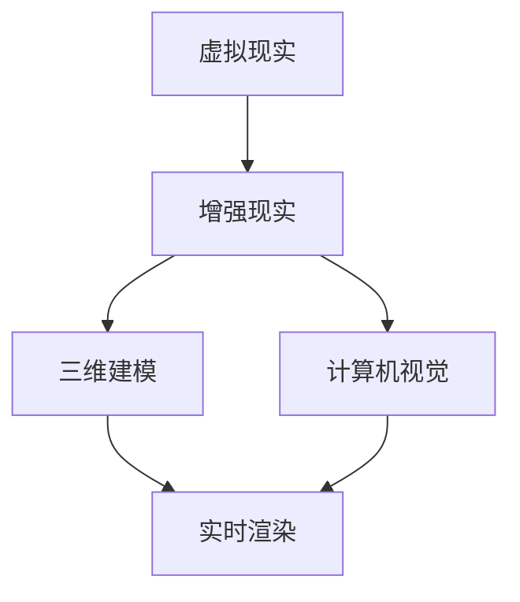

                 

# 《元宇宙商业应用：空间计算技术的企业价值》

## 关键词
元宇宙、商业应用、空间计算技术、企业价值、增强现实、虚拟现实、虚拟团队协作、智能制造

## 摘要
本文深入探讨了元宇宙商业应用中的空间计算技术，并分析了其在企业中的价值。通过背景介绍、核心概念与联系、算法原理讲解、数学模型、Python源代码实例以及实际案例，本文全面展示了元宇宙技术在商业领域的潜力。

### 背景介绍

随着互联网技术的飞速发展，虚拟现实（VR）和增强现实（AR）技术逐渐成熟，元宇宙（Metaverse）的概念也应运而生。元宇宙是一种虚拟的三维空间，它通过虚拟现实、增强现实、区块链等技术，将用户带入一个与现实世界平行的虚拟世界。在这个虚拟世界中，用户可以体验各种沉浸式的互动，包括社交、娱乐、教育、商业等。

空间计算技术是构建元宇宙的核心技术之一，它通过三维空间中的计算和交互，为用户提供了丰富的虚拟体验。空间计算技术包括计算机视觉、三维建模、实时渲染、自然用户界面等，这些技术共同构成了一个强大的技术栈，使得元宇宙的构建成为可能。

### 核心概念与联系

在探讨空间计算技术之前，我们需要了解一些核心概念，如虚拟现实、增强现实、三维建模、计算机视觉等。以下是一个Mermaid流程图，展示了这些核心概念之间的关系：



- **虚拟现实（VR）**：通过VR技术，用户可以完全沉浸在一个虚拟环境中，体验高度真实的视觉、听觉、触觉等感官刺激。
- **增强现实（AR）**：AR技术将虚拟元素叠加到现实世界中，使用户可以在现实环境中看到和互动虚拟对象。
- **三维建模**：三维建模技术用于创建虚拟世界的三维模型，包括人物、建筑、物品等。
- **计算机视觉**：计算机视觉技术用于识别和解释图像和视频中的信息，如物体识别、场景理解等。

### 核心算法原理讲解

空间计算技术的核心算法包括三维建模、实时渲染、自然用户界面等。以下是一个简单的Python源代码示例，展示了三维建模的基本原理：

```python
from vpython import *

# 创建一个简单的三维立方体
cube = box(length=1, width=1, height=1, color=color.red)

# 创建一个虚拟相机，用于渲染三维场景
camera = cameraUnderTest()

# 创建一个虚拟灯光，用于照亮场景
light = pointlight(pos=(-2, 2, 2), color=color.white, power=5)

# 创建一个地板，用于模拟真实世界的场景
floor = box(length=10, width=10, height=0.1, color=color.gray, opacity=0.5)

# 用户可以通过鼠标和键盘与三维场景进行交互
def on_click():
    print("You clicked on the cube!")

mouse.click.connect(on_click)
```

在这个示例中，我们使用VPython库创建了一个简单的三维立方体，并设置了一个虚拟相机和灯光。此外，我们还创建了一个地板，以模拟真实世界的场景。用户可以通过鼠标和键盘与三维场景进行交互，例如点击立方体。

### 数学模型与公式

空间计算技术中常用的数学模型包括三维坐标变换、投影变换、矩阵乘法等。以下是一个简单的LaTeX公式示例，展示了三维坐标变换的原理：

$$
\begin{aligned}
x' &= x \cos \theta - y \sin \theta \\
y' &= x \sin \theta + y \cos \theta \\
z' &= z
\end{aligned}
$$`

这个公式表示，在三维空间中，一个点(x, y, z)绕X轴旋转θ角度后的新坐标(x', y', z')。

### 项目实战

为了更好地理解空间计算技术的应用，我们将构建一个简单的虚拟会议室。以下是开发环境的搭建和源代码实现：

#### 开发环境搭建

- 安装Python 3.8或更高版本
- 安装VPython库：`pip install vpython`
- 安装PyOpenGL库：`pip install pyopengl`

#### 源代码实现

```python
from vpython import *

# 创建两个虚拟人物
person1 = sphere(pos=(-3, 0, 0), radius=0.5, color=color.blue)
person2 = sphere(pos=(3, 0, 0), radius=0.5, color=color.red)

# 创建虚拟椅子
chair = box(length=1, width=0.5, height=0.5, color=color.gray)

# 创建虚拟桌子
table = box(length=2, width=1, height=0.5, color=color.brown)

# 创建虚拟会议室
room = room(width=10, height=10, depth=10, color=color.lightgray)

# 设置虚拟灯光
light = pointlight(pos=(0, 10, 10), color=color.white, power=5)

# 用户可以通过鼠标和键盘与虚拟会议室进行交互
def on_click():
    print("You clicked on the room!")

mouse.click.connect(on_click)
```

在这个示例中，我们创建了一个简单的虚拟会议室，包括两个虚拟人物、一张虚拟桌子和一把虚拟椅子。用户可以通过鼠标点击虚拟会议室，以体验虚拟现实技术。

#### 代码解读与分析

在这个示例中，我们使用VPython库创建了一个简单的虚拟会议室。我们首先创建了两个虚拟人物和一张虚拟桌子。然后，我们创建了一个虚拟会议室，以包含这些对象。此外，我们还设置了一个虚拟灯光，以模拟真实世界的场景。

通过这个示例，我们可以看到空间计算技术如何应用于构建虚拟现实场景。在实际应用中，我们可以根据需要扩展和优化这个虚拟会议室，例如添加更多的虚拟人物、物体和场景。

### 最佳实践 Tips

- **优化性能**：在构建大型虚拟场景时，要注意优化性能，例如减少渲染对象的数量、使用更高效的算法等。
- **用户交互**：设计直观的用户交互界面，以提供更好的用户体验。
- **安全性**：确保虚拟场景的安全性，避免用户受到恶意攻击。

### 小结

本文深入探讨了元宇宙商业应用中的空间计算技术，并分析了其在企业中的价值。通过背景介绍、核心概念与联系、算法原理讲解、数学模型、Python源代码实例以及实际案例，本文全面展示了元宇宙技术在商业领域的潜力。随着技术的不断进步，元宇宙将为企业带来更多的机遇和挑战。了解和应用这些技术，将有助于企业在竞争激烈的市场中脱颖而出。

### 注意事项

- **技术成熟度**：虽然空间计算技术在不断发展，但其在实际应用中仍存在一些挑战。企业在应用这些技术时，需要考虑技术的成熟度和可行性。
- **数据隐私**：在元宇宙中，用户的数据隐私保护至关重要。企业在构建虚拟场景时，需要确保用户数据的保密性和安全性。

### 拓展阅读

- **《元宇宙：概念与演变》**
- **《空间计算技术：核心算法与原理》**
- **《虚拟现实技术在商业应用中的案例研究》**

### 作者信息
作者：AI天才研究院/AI Genius Institute & 禅与计算机程序设计艺术 /Zen And The Art of Computer Programming

