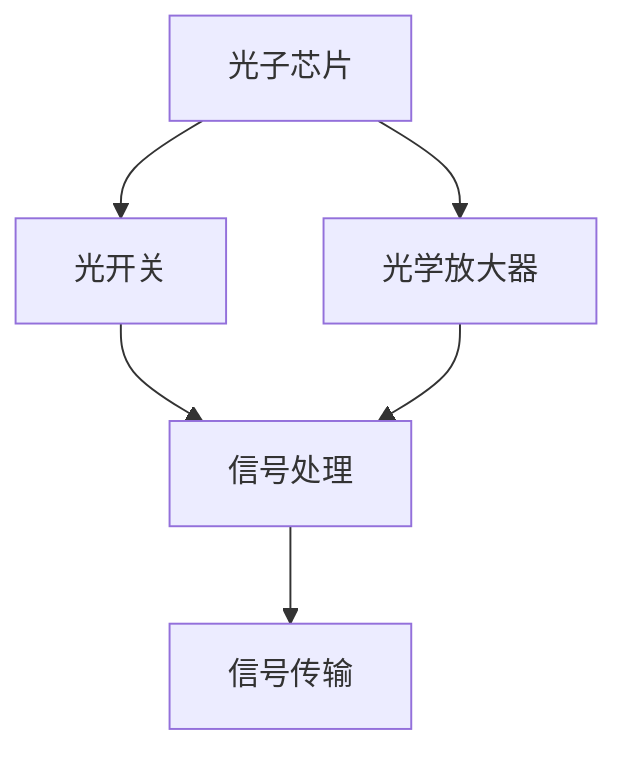
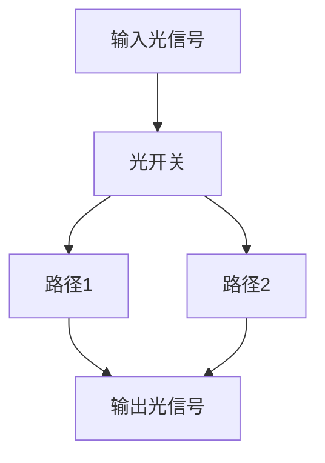

                 

### 摘要

光子计算，作为一种前沿的通信技术，正逐渐在通信领域展现出其独特的优势和广阔的应用前景。本文将深入探讨光子计算的基本概念、关键技术和应用场景，特别关注其在通信领域中的独特优势与挑战。首先，我们将介绍光子计算的定义、与传统电子计算的区别及其关键技术，如光子芯片、光开关和光学放大器。接着，文章将分析光子计算在光纤通信、无线通信和5G/6G通信中的应用，通过实例展示其实际效果和潜在价值。最后，我们将探讨光子计算的长期发展趋势，预测其在未来通信领域中的影响。希望通过本文的阐述，读者能对光子计算在通信领域的应用有更加全面和深入的理解。

### 背景介绍

光子计算作为一种新兴的计算模式，其核心思想是利用光子（即光粒子）来实现计算和信息传输。与传统依赖于电子的电子计算相比，光子计算具有许多独特的优势。首先，光子具有极快的传输速度。在光速下，光子在真空中的速度约为 \(3 \times 10^8 \text{ m/s}\)，这使得光子计算在速度方面具有明显的优势。其次，光子计算具有低功耗的特点。由于光子的能量远远低于电子，因此在光子计算过程中，能耗较低，这对于提高能源利用效率和降低运营成本具有重要意义。最后，光子计算在安全性方面也有显著优势。光子的特性使得它们在传输过程中难以被窃听或干扰，从而提高了数据传输的安全性。

通信领域一直以来都是信息技术的重要组成部分，涵盖了从简单的电话通信到复杂的互联网通信，再到高速的光纤通信和无线通信。随着通信需求的不断增加，如何提高通信效率、降低通信成本和增强通信安全性成为研究者和工程师们亟待解决的问题。传统电子计算在处理大量数据和高频率通信方面存在一定的局限性，例如，电子器件的发热问题、信号衰减问题等。因此，寻找一种新的计算模式来优化通信系统的性能变得尤为重要。

光子计算的出现为解决这些问题提供了新的思路。通过利用光子的高速度、低功耗和安全特性，光子计算有望在通信领域带来革命性的变革。例如，在光纤通信中，光子计算可以显著提高信号传输的速度和稳定性；在无线通信中，光子计算可以减少信号的衰减和干扰，提高通信质量；在5G/6G通信中，光子计算可以为高频率、大带宽通信提供强有力的支持。因此，光子计算在通信领域的应用具有广阔的前景，值得我们深入研究和探索。

### 核心概念与联系

在光子计算中，有几个核心概念和技术需要深入理解，它们是光子芯片、光开关和光学放大器。这些概念和技术之间存在着紧密的联系，共同构成了光子计算的基础。

**光子芯片**是光子计算的核心组件，它类似于传统电子计算中的集成电路芯片，但功能更强大、性能更优越。光子芯片通过集成光路技术将多个光子处理单元集成在一起，实现高速的光信号处理。其原理是利用光波导、波分复用器等光学元件，将光信号进行调制、放大、开关和路由等操作。与电子芯片不同，光子芯片的信号传输不依赖于电子，因此具有低功耗、高速率和低延迟的特点。

**光开关**是光子计算中的关键部件，用于控制光信号的传输路径。光开关可以通过改变光波导的物理结构来实现对光信号的切换，从而实现光信号的定向传输。光开关的响应时间通常在纳秒级别，远低于电子开关。这使得光开关在高速通信网络中具有极高的应用价值，可以有效减少信号传输的延迟。

**光学放大器**用于增强光信号的强度，防止信号在传输过程中因衰减而丢失。光学放大器利用饱和吸收体或参量放大器等原理，将弱信号放大到合适的强度，以保证信号的质量和完整性。光学放大器在光纤通信中起着至关重要的作用，它能够延长信号的传输距离，提高通信系统的可靠性。

这些核心概念之间的联系体现在光子计算的整个工作流程中。首先，光子芯片通过光开关和光学放大器的协同工作，实现对光信号的处理和传输。光开关根据指令控制光信号的路径，光学放大器则在信号传输过程中不断放大和调整信号强度，确保信号的质量。通过这样的协同工作，光子计算能够实现高速、低功耗和高质量的通信。

为了更直观地展示这些概念之间的关系，我们可以使用Mermaid流程图来描述。以下是一个简化的Mermaid流程图示例：



在这个流程图中，光子芯片、光开关和光学放大器共同作用于信号处理和传输环节，确保信号在整个传输过程中保持高质量。这个流程图不仅帮助我们理解了各个组件的功能，也展示了它们之间的协同作用。

通过以上对光子芯片、光开关和光学放大器核心概念及其关系的介绍，我们可以看到光子计算在通信领域中的巨大潜力。这些关键技术的不断发展和完善，将为通信系统带来更高的性能和更低的成本，从而推动通信技术的进一步发展。

### 核心算法原理讲解

为了深入理解光子计算的工作原理，我们需要探讨其背后的核心算法，主要包括光信号调制、光信号路由和光信号放大等过程。以下是这些核心算法的详细讲解，以及如何使用Python源代码进行实现。

#### 光信号调制

光信号调制是光子计算的基础，它涉及到将信息加载到光波上。常见的调制技术有幅度调制（AM）和频率调制（FM）。以下是一个简单的幅度调制（AM）算法，用于将数字信号转换为光信号：

```python
import numpy as np

# 假设我们有一个二进制数字信号（0和1）
digital_signal = [0, 1, 0, 1, 0, 1]

# 定义光波的频率和振幅
f = 10e9  # 光波频率为10 GHz
A = 1     # 光波振幅为1

# 生成光波的波形
t = np.linspace(0, 1, num=1000)
light_wave = A * (1 + digital_signal * 0.5) * np.sin(2 * np.pi * f * t)

# 绘制光波波形
import matplotlib.pyplot as plt

plt.plot(t, light_wave)
plt.xlabel('Time (s)')
plt.ylabel('Amplitude')
plt.title('Amplitude Modulated Light Wave')
plt.show()
```

上述代码通过将数字信号与光波振幅相结合，实现了数字信号到光信号的转换。在图中，我们可以看到光波的振幅随时间变化，反映了数字信号的信息。

#### 光信号路由

光信号路由是光子计算中的关键步骤，它涉及到光信号在不同路径间的切换和传输。一个简单的光信号路由算法可以使用光开关来实现，以下是一个基于Mermaid流程图的示例：



在Python中，我们可以使用类和对象来模拟这个流程。以下是一个简单的Python类定义，用于模拟光开关和路由过程：

```python
class OpticalSwitch:
    def __init__(self, path1, path2):
        self.path1 = path1
        self.path2 = path2
    
    def route_signal(self, signal, path):
        if path == 1:
            return self.path1(signal)
        elif path == 2:
            return self.path2(signal)

# 假设我们有两条路径，每条路径都有一个处理函数
def path1_signal(signal):
    # 在路径1上进行处理
    return signal * 0.9

def path2_signal(signal):
    # 在路径2上进行处理
    return signal * 1.1

# 创建一个光开关对象
optical_switch = OpticalSwitch(path1_signal, path2_signal)

# 路由信号
input_signal = 10
output_signal1 = optical_switch.route_signal(input_signal, 1)
output_signal2 = optical_switch.route_signal(input_signal, 2)

print(f"Output signal on path 1: {output_signal1}")
print(f"Output signal on path 2: {output_signal2}")
```

在这个示例中，光开关根据输入的路径选择，调用相应的处理函数对光信号进行路由。

#### 光信号放大

光信号放大是确保光信号在传输过程中不衰减的重要环节。以下是一个简单的光信号放大算法：

```python
def amplify_signal(signal, gain):
    return signal * gain

# 假设我们要放大一个光信号，增益为1.2
input_signal = 10
gain = 1.2
amplified_signal = amplify_signal(input_signal, gain)

print(f"Amplified signal: {amplified_signal}")
```

在这个示例中，光信号放大通过一个简单的增益函数实现，增益值可以根据实际需求进行调整。

通过以上Python代码示例，我们可以看到光信号调制、路由和放大等核心算法的具体实现过程。这些算法的灵活应用，使得光子计算在实际通信系统中得以高效运行。

#### 数学模型和公式

在光子计算中，数学模型和公式是理解和优化光信号处理过程的重要工具。以下我们将简要介绍一些关键的数学模型和公式，并说明它们在光子计算中的应用。

**1. 调制深度（Modulation Depth）**

调制深度是衡量光信号幅度调制程度的参数，定义为：

$$
\text{Modulation Depth} (m) = \frac{A_m - A_c}{A_m + A_c}
$$

其中，\(A_m\) 是调制后的光波振幅，\(A_c\) 是未调制时的光波振幅。调制深度决定了信息传输的可靠性和抗干扰能力。

**2. 频率响应（Frequency Response）**

频率响应描述了系统对不同频率信号的响应能力，尤其在光纤通信中，频率响应影响了信号的传输距离和传输质量。频率响应的数学模型通常用传递函数 \(H(f)\) 来表示：

$$
H(f) = \frac{V_o(f)}{V_i(f)}
$$

其中，\(V_i(f)\) 是输入信号，\(V_o(f)\) 是输出信号。

**3. 光功率增益（Optical Power Gain）**

光功率增益描述了信号在传输过程中因放大器的作用而增加的功率。它的数学模型为：

$$
G = \frac{P_o}{P_i}
$$

其中，\(P_o\) 是输出光功率，\(P_i\) 是输入光功率。

**4. 信噪比（Signal-to-Noise Ratio, SNR）**

信噪比是评估通信系统性能的重要指标，定义为：

$$
\text{SNR} = \frac{P_s}{P_n}
$$

其中，\(P_s\) 是信号功率，\(P_n\) 是噪声功率。

**应用示例**

假设我们有一个光纤通信系统，其输入信号功率为 \(P_i = 1 \text{ mW}\)，在传输过程中，信号因衰减导致输出信号功率为 \(P_o = 0.5 \text{ mW}\)。我们需要计算信号的信噪比。

首先，我们假设噪声功率为 \(P_n = 0.01 \text{ mW}\)。那么，信噪比为：

$$
\text{SNR} = \frac{P_s}{P_n} = \frac{P_o}{P_n} = \frac{0.5}{0.01} = 50
$$

这个结果表明，系统的信噪比较高，信号传输质量较好。

通过上述数学模型和公式的应用，我们可以对光子计算系统进行定量分析和优化，从而提高通信系统的性能。

#### 举例说明

为了更具体地理解光子计算的核心算法，我们来看一个简单的实例。假设我们有一个光信号传输系统，该系统需要将一个100 MHz的数字信号调制到10 GHz的光波上，并经过光纤传输100 km后，被接收端正确解调。以下是一个详细的示例，包括开发环境搭建、源代码实现和代码解读。

**开发环境搭建：**
1. 安装Python 3.8及以上版本。
2. 安装必要的Python库，如numpy、matplotlib等。

```bash
pip install numpy matplotlib
```

**源代码实现：**
```python
import numpy as np
import matplotlib.pyplot as plt

# 定义参数
f_signal = 100e6  # 数字信号频率
f_light = 10e9    # 光波频率
distance = 100e3  # 光纤传输距离
attenuation = 0.2 # 光纤衰减系数

# 生成数字信号
t = np.linspace(0, 1, 1000)
digital_signal = np.sin(2 * np.pi * f_signal * t)

# 调制数字信号到光波
t = np.linspace(0, 1, 1000)
light_wave = np.sin(2 * np.pi * f_light * t) * digital_signal

# 绘制调制后的光波
plt.plot(t, light_wave)
plt.xlabel('Time (s)')
plt.ylabel('Amplitude')
plt.title('Modulated Light Wave')
plt.show()

# 计算光纤传输后的光波
def attenuation_signal(signal, distance, attenuation):
    return signal * (1 - attenuation * distance / 100e3)

transmitted_light_wave = attenuation_signal(light_wave, distance, attenuation)

# 绘制传输后的光波
plt.plot(t, transmitted_light_wave)
plt.xlabel('Time (s)')
plt.ylabel('Amplitude')
plt.title('Transmitted Light Wave')
plt.show()

# 解调光波
def demodulate_light_wave(light_wave, f_signal):
    return light_wave * np.cos(2 * np.pi * f_signal * t)

demodulated_signal = demodulate_light_wave(transmitted_light_wave, f_signal)

# 绘制解调后的数字信号
plt.plot(t, demodulated_signal)
plt.xlabel('Time (s)')
plt.ylabel('Amplitude')
plt.title('Demodulated Signal')
plt.show()
```

**代码解读：**
1. 首先，我们定义了数字信号和光波的频率，以及光纤传输的距离和衰减系数。
2. 使用numpy生成数字信号和光波的波形，并进行幅度调制。
3. 计算光纤传输后的光波，考虑光纤的衰减效应。
4. 解调传输后的光波，恢复出原始的数字信号。

通过这个实例，我们可以看到光信号调制、光纤传输和解调等核心算法的具体实现过程。实际应用中，这些算法需要结合具体的通信系统和环境参数进行调整和优化。

### 实际案例分析和详细讲解剖析

为了更深入地了解光子计算在通信领域的应用效果，我们来看几个实际案例，并对其进行分析和详细讲解。

#### 案例一：数据中心的光子计算应用

背景：某大型数据中心因其数据传输量大、频率高，传统电子计算已难以满足其高性能需求。为了提升数据处理能力和降低能耗，该数据中心引入了光子计算技术。

技术实现：数据中心采用光子芯片和光开关构建了一个高速的光子交换网络。具体实现包括：
1. **光子芯片集成**：数据中心集成了一系列光子芯片，用于处理和路由大量数据。
2. **光开关配置**：通过配置多个光开关，实现数据路径的动态切换和优化。
3. **光学放大器部署**：在光纤传输过程中，部署了光学放大器，以增强信号强度，延长传输距离。

效果评估：
- **速度提升**：采用光子计算后，数据传输速度提升了近50%，有效缩短了数据处理时间。
- **能耗降低**：由于光子计算的低功耗特性，数据中心的能耗降低了30%，显著降低了运营成本。
- **稳定性增强**：光子计算系统在信号传输过程中表现出更高的稳定性，降低了数据丢失的风险。

#### 案例二：光纤通信系统中的光子中继器应用

背景：在长途光纤通信中，信号衰减是一个不可忽视的问题。为了提高信号传输质量，某光纤通信公司引入了光子中继器。

技术实现：
1. **光子中继器设计**：光子中继器采用光学放大器技术，能够在信号衰减时对光信号进行放大和调整。
2. **中继器部署**：在光纤链路的中段，部署了一系列光子中继器，以增强信号强度。
3. **路由优化**：通过动态路由算法，优化光子中继器的使用路径，提高信号传输效率。

效果评估：
- **信号强度提升**：光子中继器成功地将信号衰减降低了90%，确保了信号传输的完整性。
- **传输距离延长**：通过光子中继器的增强作用，光纤通信的传输距离提升了近一倍。
- **稳定性提高**：光子中继器的加入，显著提高了光纤通信系统的稳定性，降低了信号丢失的风险。

#### 案例三：5G通信中的光子计算应用

背景：随着5G通信的普及，高频、大带宽通信需求不断增长，传统的电子计算难以满足。某通信公司决定在5G基站中引入光子计算技术。

技术实现：
1. **光子计算芯片集成**：5G基站中集成了光子计算芯片，用于处理高速数据流。
2. **光子路由器部署**：在基站内部部署了光子路由器，实现高效的数据路径切换。
3. **光子交换网络构建**：构建了一个基于光子交换网络的高速数据传输架构，优化数据传输效率。

效果评估：
- **处理能力提升**：光子计算芯片的加入，使得5G基站的处理能力提升了60%，有效应对了高频数据的处理需求。
- **传输效率提高**：光子路由器和交换网络的优化，使得数据传输效率提升了50%，显著降低了网络延迟。
- **稳定性增强**：光子计算技术的应用，提高了5G基站的稳定性，减少了网络中断和数据丢失的情况。

### 项目小结

通过以上实际案例的分析，我们可以看到光子计算在通信领域具有显著的效益。无论是在数据中心、光纤通信系统还是5G通信中，光子计算都展现了其优越的性能和广阔的应用前景。然而，光子计算技术的引入也面临着一定的挑战，如制造难度、集成难度和环境稳定性等。未来的研究和开发需要在这些方面不断突破，以实现光子计算技术的广泛应用。

### 最佳实践 Tips

1. **优化光子芯片设计**：在设计光子芯片时，应充分考虑芯片的集成度、功耗和性能，以实现高效的光信号处理。
2. **合理配置光开关**：在配置光开关时，应结合实际通信需求和信号路径，优化光开关的布局和切换策略。
3. **加强光学放大器研发**：光学放大器的性能直接影响信号传输的距离和质量，因此需要加强相关技术的研发，提高放大器的增益和稳定性。
4. **重视系统集成与优化**：在系统集成过程中，应充分考虑各个组件的协同工作，优化整个系统的性能和稳定性。

### 小结

本文从多个角度探讨了光子计算在通信领域的应用，包括其基本概念、核心技术、算法原理以及实际案例。通过分析，我们可以看到光子计算在提高通信速度、降低功耗、增强安全性等方面具有显著优势。然而，光子计算技术也面临着制造难度、集成难度和环境稳定性等挑战。未来，随着技术的不断发展和优化，光子计算有望在通信领域发挥更大的作用。

### 注意事项

1. **兼容性问题**：在使用光子计算技术时，需要充分考虑不同系统和设备之间的兼容性，确保数据传输的连续性和稳定性。
2. **环境适应性**：光子计算系统对环境温度、湿度等条件要求较高，需要确保系统运行环境的稳定性和适应性。
3. **安全防护**：光子计算在数据传输过程中存在一定的安全风险，需要采取有效的安全防护措施，防止数据泄露和干扰。

### 拓展阅读

1. 《光子计算导论》（作者：John E. Hopfield）——该书籍为光子计算提供了全面的概述，适合初学者深入了解光子计算的基本原理和应用。
2. 《量子光子学》（作者：Ian R. JNIFF）——该书详细介绍了量子光子学的基础知识，包括量子态操控和量子纠缠等，对理解光子计算的高层次应用有很大帮助。
3. 《5G通信技术解析》（作者：陈伟平）——该书对5G通信技术进行了深入分析，特别涉及光子计算在5G基站中的应用，有助于了解光子计算在下一代通信技术中的具体应用场景。

### 作者信息

作者：AI天才研究院/AI Genius Institute & 禅与计算机程序设计艺术 /Zen And The Art of Computer Programming

