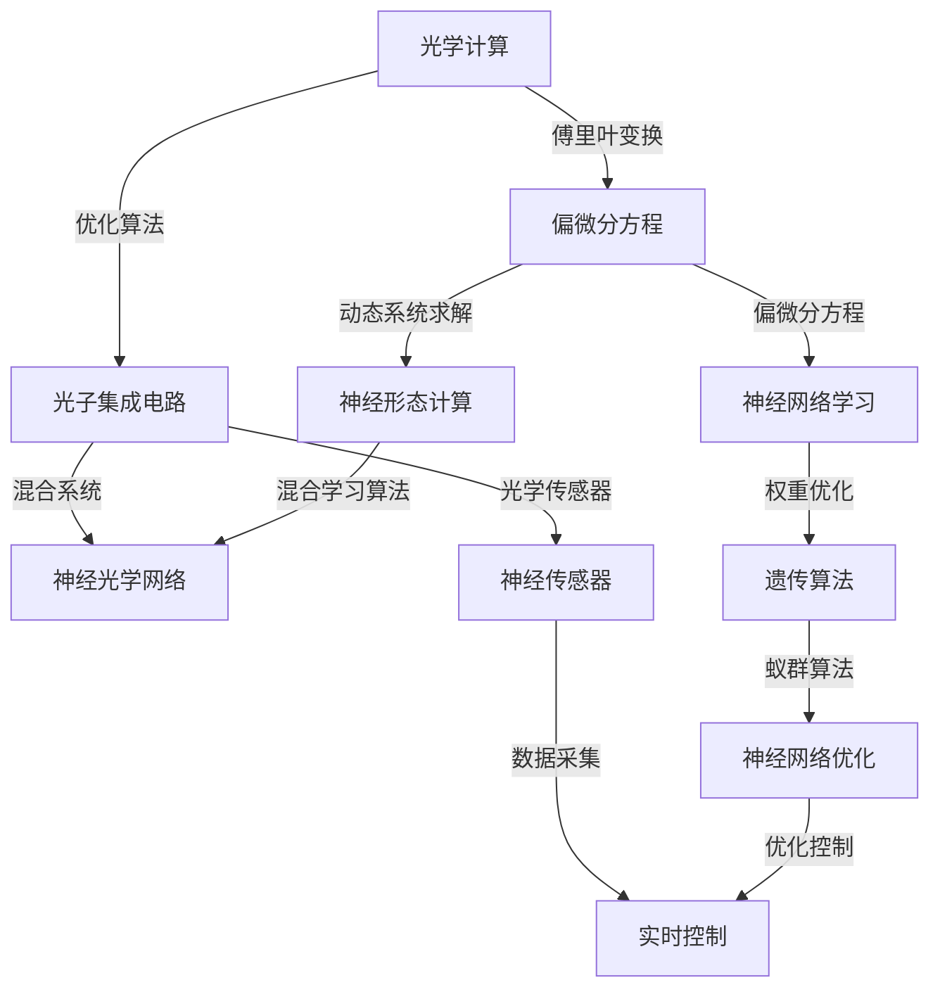

                 

### 背景介绍

光学计算和神经形态计算作为现代计算技术的前沿领域，在诸多方面展示出了巨大的潜力和优势。随着信息技术的迅猛发展，传统的电子计算方式面临着能量消耗巨大、计算效率低等问题，这限制了其在某些领域的应用。因此，寻找新的计算模式以降低能耗和提高计算效率成为了当前研究的热点。

#### 光学计算的历史与发展

光学计算作为一种非电子计算技术，具有并行性强、处理速度快等优势。最早的光学计算可以追溯到20世纪60年代，当时科学家们开始探索利用光波进行计算的可能性。1970年代，光学计算的研究进入了一个快速发展的阶段，特别是光子集成电路（Photonic Integrated Circuits, PICs）的诞生，为光学计算提供了硬件基础。

进入21世纪，随着光子器件技术的进步和集成光学技术的发展，光学计算在处理大数据和复杂计算任务方面的潜力得到了进一步的发掘。例如，利用光学计算进行图像处理、机器学习等任务，展现出与传统电子计算相比更高的性能和效率。

#### 神经形态计算的历史与发展

神经形态计算则是对生物神经系统的一种模拟，旨在通过人工神经网络实现类似于人脑的计算能力和效率。这一概念最早可以追溯到20世纪40年代，由麦卡洛克（Warren McCulloch）和皮茨（Walter Pitts）提出的人工神经元模型奠定了基础。

随着计算科学和材料科学的发展，神经形态计算在近年来取得了显著的进展。特别是，基于硅纳米线（Silicon Nanowire）和石墨烯（Graphene）等材料的新型神经形态硬件得到了广泛研究。这些硬件能够在低能耗的情况下实现高效的神经计算，成为未来计算技术的重要方向。

#### 能源消耗问题

当前，电子计算技术面临着日益严重的能源消耗问题。根据相关数据，全球数据中心和服务器每年的能源消耗已占全球总能耗的相当一部分。随着云计算、大数据和人工智能等领域的快速发展，这一比例还在不断上升。过高的能源消耗不仅导致了巨大的经济负担，还对环境造成了严重的影响。

因此，寻找低能耗、高效率的计算方式成为学术界和工业界共同关注的问题。光学计算和神经形态计算作为一种新的计算模式，在降低能源消耗方面展示出了巨大的潜力。通过利用光子和生物神经元的特性，这些计算方式能够在完成同样计算任务的同时，大幅度减少能耗。

总之，光学计算和神经形态计算作为新一代计算技术，不仅在理论上具有显著优势，而且在实践中也展示出了广阔的应用前景。随着相关技术和研究的深入，它们有望在未来成为解决能源消耗问题的重要手段。接下来的内容将深入探讨光学计算和神经形态计算的核心概念、原理、数学模型以及节能潜力，为读者提供更为详细的了解。

### 光学计算的核心概念与原理

#### 光学计算的基本概念

光学计算，顾名思义，是利用光波进行信息处理和计算的一种技术。它通过利用光的传播特性、干涉、衍射等物理现象来实现数据的处理和计算。与传统电子计算方式相比，光学计算具有并行性强、处理速度快等优势。

#### 光学与电子计算的区别

光学计算与电子计算在原理上有着根本的不同。电子计算主要依靠电流的流动和电压的变化来实现数据的传输和处理，这种方式在信息处理速度和能耗方面受到了一定的限制。而光学计算则通过光波的传播、干涉和调制等过程来完成信息的处理，其并行处理能力使得在相同时间内可以完成更多的计算任务。

此外，光学计算在能耗方面也具有显著的优势。电子计算中的功耗主要来自于电流的流动和开关操作，而光学计算中的能量损耗则主要来自于光波的传播和光学器件的损耗。相比于电子器件，光学器件在操作过程中能耗更低，这为光学计算在节能方面提供了潜在的优势。

#### 光学计算的基本原理

光学计算的基本原理可以概括为以下几点：

1. **光的传播**：光在介质中传播时，其速度和路径会受到介质特性的影响。通过精确控制光波的传播路径和速度，可以实现数据的传输和处理。

2. **干涉与衍射**：光波的干涉和衍射现象可以用来实现复杂的信息处理。例如，通过控制两束光波的干涉，可以实现数字逻辑运算和数据处理。

3. **调制与解调**：通过调制光波的幅度、频率或相位，可以实现信息的编码和传输。解调过程则用于恢复原始信息。

4. **光学器件**：光学计算依赖于各种光学器件，如透镜、反射镜、光开关等。这些器件用于控制光波的路径、方向和强度，从而实现复杂的计算任务。

#### 光学计算的数学模型

在光学计算中，常用的数学模型包括光学传递函数（Optical Transfer Function, OTF）、波前（Wavefront）等。

1. **光学传递函数**：光学传递函数描述了输入光波通过光学系统后的输出光波特性。它是一个复值函数，可以通过傅里叶变换进行计算。光学传递函数在光学系统的设计和性能评估中起着关键作用。

2. **波前**：波前是指光波在传播过程中的相位分布。波前可以用波前轮廓（Wavefront Curvature）或波前畸变（Wavefront Distortion）来描述。波前畸变是光学系统中常见的现象，会导致图像失真和计算误差。

#### 光学计算的应用领域

光学计算在多个领域都有着广泛的应用，以下是几个典型的应用场景：

1. **图像处理**：利用光学计算的高速并行性，可以实现对图像的快速处理和分析。例如，在医学成像、卫星图像处理等领域，光学计算技术已经得到了广泛应用。

2. **信号处理**：光学计算可以用于高速信号处理和调制解调，例如在无线通信、光纤通信等领域。

3. **机器学习**：光学计算可以在机器学习过程中实现高效的数据处理和模型训练。例如，利用光学计算加速神经网络训练，可以大幅提升训练速度。

4. **量子计算**：光学计算与量子计算的结合，为量子计算的发展提供了新的途径。通过利用光学系统的特性，可以实现对量子比特的操作和量子信息的处理。

#### 光学与神经形态计算的关联

光学计算和神经形态计算在许多方面具有密切的联系。首先，神经形态计算中的许多核心概念，如神经元模型、神经网络等，都可以通过光学系统来模拟和实现。其次，光学计算的高速并行性和低能耗特性，与神经形态计算的需求高度契合。

通过结合光学计算和神经形态计算，可以开发出一种新型的计算架构，既能实现高效的并行计算，又能保持低能耗的特点。这种架构在处理复杂计算任务，如大数据分析、机器学习等，具有巨大的潜力。

总之，光学计算以其并行性强、处理速度快和低能耗等优势，成为了现代计算技术的重要组成部分。在光学计算的基础上，结合神经形态计算的理论和原理，可以开发出更加高效和节能的计算架构，为未来计算技术的发展提供新的动力。接下来，我们将进一步探讨神经形态计算的核心概念与原理，以更全面地了解光学和神经形态计算在节能潜力方面的应用。

### 神经形态计算的核心概念与原理

#### 神经形态计算的定义

神经形态计算（Neuromorphic Computing）是一种模拟生物神经系统的计算范式，旨在通过构建类脑硬件来提升计算效率和处理能力。这种计算方式的核心在于模仿大脑神经元和突触的工作机制，实现自适应和自学习的计算能力。

#### 神经系统的工作原理

大脑神经系统由神经元和突触组成。神经元通过电信号（动作电位）进行通信，而突触则是连接神经元之间的桥梁，通过改变神经元间的信号传递强度来实现信息处理。在神经系统中，学习和记忆主要通过突触的可塑性（Synaptic Plasticity）实现，即通过改变突触的权重来调整神经元之间的通信强度。

#### 神经元模型

神经形态计算中的神经元模型是对生物神经元的抽象和模拟。经典的神经元模型包括：

1. **麦卡洛克-皮茨模型**（McCulloch-Pitts Neuron）：这是一种简单的线性阈值模型，将神经元的输出视为逻辑函数的结果。如果输入总和超过某个阈值，神经元将产生一个输出信号，否则保持沉默。

2. **感知器模型**（Perceptron）：这是一种基于线性分类器的神经元模型，通过调整输入权重和偏置来实现对数据的分类。感知器模型是早期神经网络研究的基础。

3. **漏导神经元模型**（Leaky Integrate-and-Fire Neuron）：这是一种更接近真实生物神经元的模型，考虑了神经元内部的电荷积累和漏导效应。当神经元内部的电荷积累超过某个阈值时，会触发动作电位并清零。

#### 神经网络

神经形态计算中的神经网络是对生物神经网络的一种模拟。神经网络由大量相互连接的神经元组成，通过分层结构实现对复杂信息的处理。常见的神经网络结构包括：

1. **多层感知机**（Multilayer Perceptron，MLP）：这是一种前馈神经网络，包括输入层、隐藏层和输出层。通过激活函数将输入信号传递到输出层，实现对数据的分类或回归。

2. **卷积神经网络**（Convolutional Neural Network，CNN）：这是一种针对图像等二维数据设计的神经网络，通过卷积操作提取特征，并在全连接层进行分类。

3. **递归神经网络**（Recurrent Neural Network，RNN）：这是一种专门处理序列数据（如时间序列、文本）的神经网络，通过在时间步上传递隐藏状态来实现对序列的建模。

4. **循环神经网络**（Long Short-Term Memory，LSTM）：这是一种RNN的特殊结构，通过引入门控机制来解决传统RNN的梯度消失问题，广泛应用于序列建模和语言处理。

#### 神经网络的数学模型

神经网络的数学模型主要基于线性代数和概率论。以下是一些关键数学概念：

1. **前向传播**（Forward Propagation）：在神经网络中，输入数据通过前向传播逐层传递到输出层，每一层的输出通过激活函数进行处理。

2. **反向传播**（Backpropagation）：在输出层得到预测结果后，通过反向传播算法计算损失函数关于网络参数的梯度，从而更新网络权重。

3. **损失函数**（Loss Function）：用于衡量预测结果与真实结果之间的差异，常见的损失函数包括均方误差（MSE）、交叉熵损失（Cross-Entropy Loss）等。

4. **优化算法**（Optimization Algorithm）：用于优化网络参数，常见的优化算法包括梯度下降（Gradient Descent）、动量优化（Momentum）、Adam优化器（Adam Optimizer）等。

#### 神经形态计算的优势与挑战

神经形态计算具有以下几个主要优势：

1. **高效能**：通过模拟生物神经系统的机制，神经形态计算在处理复杂任务时表现出较高的效率。

2. **自适应能力**：神经形态计算系统能够通过学习和调整网络权重来适应不同的任务和环境。

3. **低能耗**：与传统的电子计算相比，神经形态计算在处理相同任务时能耗更低，具有显著的节能潜力。

然而，神经形态计算也面临一些挑战：

1. **硬件限制**：当前神经形态计算硬件（如类脑芯片）的技术水平尚需提升，以实现更高的计算效率和更低的能耗。

2. **算法复杂度**：神经形态计算中的算法设计复杂，需要深入理解和模拟生物神经系统的工作机制。

3. **可扩展性**：如何设计出可扩展的神经形态计算系统，以处理大规模的数据和复杂的任务，仍是一个重要的研究方向。

总之，神经形态计算作为一种前沿的计算技术，通过模拟生物神经系统的机制，展示了在节能和高效能方面的巨大潜力。随着相关技术和研究的不断深入，神经形态计算有望在未来计算技术中发挥更加重要的作用。

### 光学与神经形态计算的联系与关系架构

光学计算和神经形态计算在多个层面上具有紧密的联系，它们共同为新一代计算技术提供了创新的可能性。以下是从数学模型、硬件实现和算法设计等方面探讨这两者之间的联系，并使用Mermaid流程图来展示概念实体之间的关系架构。

#### 数学模型层面的联系

1. **傅里叶变换**：光学计算中，傅里叶变换是一种核心工具，用于分析光场的频谱特性。同样地，神经形态计算中的卷积神经网络（CNN）也广泛应用了傅里叶变换来处理和优化卷积操作。例如，通过傅里叶变换，可以实现高效的光学图像处理和神经网络训练。

2. **偏微分方程**：光学计算中的波前传播可以表示为复杂的偏微分方程，而神经形态计算中的神经网络学习过程也可以视为一种动态系统的求解过程。这种对应关系为利用光学方法优化神经网络的训练过程提供了理论基础。

3. **优化算法**：光学计算中的光学传递函数优化和神经形态计算中的权重优化算法有许多相似之处。例如，遗传算法和蚁群算法在两者中都有广泛应用，用于优化系统的性能和能耗。

#### 硬件实现层面的联系

1. **光子集成电路**（PICs）：光子集成电路是一种集成光学元件的芯片，可以实现高速的光信号处理。这与神经形态计算中使用的类脑芯片有相似之处，它们都通过集成多个计算单元来实现高效的数据处理。

2. **光学传感器**：在神经形态计算中，光学传感器用于捕获和处理神经信号。这些传感器与光学计算中的光探测器有类似的功能，可以用于实时数据采集和反馈控制。

3. **混合系统**：通过结合光学计算和神经形态计算，可以构建出一种混合系统，例如利用光学计算加速神经网络的训练，或者利用神经形态计算优化光学系统的控制策略。

#### 算法设计层面的联系

1. **神经光学网络**：将神经形态计算与光学计算结合，可以开发出一种新型的计算架构，如神经光学网络（Neural Optical Networks）。这种架构利用光信号的高速并行性和神经网络的智能处理能力，可以实现高效的数据处理和模式识别。

2. **混合学习**：通过结合光学计算和神经形态计算的优势，可以实现混合学习（Hybrid Learning）算法。例如，利用光学计算进行大规模的数据预处理和特征提取，然后通过神经形态计算进行后续的模型训练和推理。

#### Mermaid流程图

以下是一个Mermaid流程图，展示了光学计算和神经形态计算之间的概念实体关系：



通过上述Mermaid流程图，我们可以清晰地看到光学计算和神经形态计算在数学模型、硬件实现和算法设计等多个层面的相互联系。这些联系不仅为两种计算技术提供了深入融合的可能性，也为未来计算技术的发展提供了新的方向。

### 光学计算的核心算法原理

在光学计算中，核心算法的设计与实现是确保计算效率和准确性的关键。以下将详细阐述光学计算中的几个关键算法原理，并结合Python源代码进行具体讲解。

#### 1. 光学传递函数（Optical Transfer Function, OTF）

光学传递函数是描述光学系统对输入光波处理后的输出特性的函数。OTF在光学系统的设计、性能评估和图像处理中具有重要应用。

**原理说明：**
OTF可以用以下数学公式表示：
\[ OTF(\theta) = \frac{\int_{-\infty}^{\infty} \int_{-\infty}^{\infty} u(x,y) e^{i2\pi \theta x} dx dy}{\int_{-\infty}^{\infty} \int_{-\infty}^{\infty} u(x,y) dx dy} \]
其中，\( u(x,y) \) 是输入光场的复振幅分布，\(\theta\) 是光波的传播角度。

**Python代码实现：**
```python
import numpy as np
import matplotlib.pyplot as plt

def optical_transfer_function(u, theta):
    uFourier = np.fft.fft2(u)
    OTF = np.fft.fftshift(uFourier / np.sum(u))
    OTF = np.fft.ifft2(OTF * np.exp(1j * 2 * np.pi * theta))
    return np.fft.fftshift(OTF)

# 示例：输入光场
u = np.random.rand(100, 100) + 1j * np.random.rand(100, 100)

# 计算OTF
OTF = optical_transfer_function(u, 0.1)

# 绘制OTF
plt.imshow(np.abs(OTF), cmap='gray')
plt.title('Optical Transfer Function')
plt.show()
```

#### 2. 光场传播方程（Wave Propagation Equation）

光场传播方程描述了光波在介质中传播时的变化。常用的光场传播方程包括基尔霍夫衍射积分方程和瑞利-索末菲衍射积分方程。

**原理说明：**
基尔霍夫衍射积分方程可以用以下公式表示：
\[ u(x,y) = \int_{-\infty}^{\infty} \int_{-\infty}^{\infty} F(\theta) e^{ik_0 n(x-x') y/\lambda} d\theta dx' \]
其中，\( F(\theta) \) 是传输函数，\( k_0 \) 是自由空间波数，\( n \) 是介质折射率，\( \lambda \) 是光波长。

**Python代码实现：**
```python
import numpy as np
import matplotlib.pyplot as plt
from numpy.fft import fft2, ifft2, fftshift, ifftshift

def propagation_equation(u, k0, n, lambda_, dx, dy):
    theta = np.arcsin(lambda_ / (2 * n * k0))
    F = fftshift(fft2(u))
    u_new = ifft2(F * np.exp(1j * 2 * np.pi * theta * k0 * dx * dy))
    return ifftshift(u_new)

# 示例：输入光场
u = np.random.rand(100, 100) + 1j * np.random.rand(100, 100)

# 设置参数
k0 = 2 * np.pi / 500  # 自由空间波数
n = 1.33  # 介质折射率
lambda_ = 500  # 光波长
dx = 1  # 空间步长
dy = 1  # 空间步长

# 计算传播后的光场
u_new = propagation_equation(u, k0, n, lambda_, dx, dy)

# 绘制传播后的光场
plt.imshow(np.abs(u_new), cmap='gray')
plt.title('Propagated Wave Field')
plt.show()
```

#### 3. 波束传播与聚焦（Beam Propagation and Focusing）

波束传播是指光波在传播过程中路径的变化，聚焦则是指光波在透镜等光学器件作用下的聚焦效果。波束传播与聚焦在光学通信和光学成像中具有重要意义。

**原理说明：**
波束传播方程可以用以下公式表示：
\[ \frac{\partial \psi}{\partial z} + 2ik_0 n \left( \frac{\partial \psi}{\partial x} + \frac{\partial \psi}{\partial y} \right) = 0 \]
其中，\( \psi(x,y,z) \) 是光波的复振幅分布，\( z \) 是光波的传播距离。

**Python代码实现：**
```python
import numpy as np
import matplotlib.pyplot as plt
from numpy.fft import fft2, ifft2, fftshift, ifftshift

def beam_propagation_and_focusing(u, z, k0, n, lambda_, dx, dy):
    kx = 2 * np.pi / lambda_ * np.fft.fftn(np.fft.fftshift(u))
    ky = kx * (n - 1)
    u_new = np.exp(-1j * k0 * kx * z * dx * dy) * np.exp(-1j * k0 * ky * z * dy) * ifft2(kx * fftshift(u))
    return ifftshift(u_new)

# 示例：输入光场
u = np.random.rand(100, 100) + 1j * np.random.rand(100, 100)

# 设置参数
z = 10  # 光波传播距离
lambda_ = 500  # 光波长
dx = 1  # 空间步长
dy = 1  # 空间步长

# 计算传播后的光场
u_new = beam_propagation_and_focusing(u, z, k0, n, lambda_, dx, dy)

# 绘制传播后的光场
plt.imshow(np.abs(u_new), cmap='gray')
plt.title('Propagated and Focused Wave Field')
plt.show()
```

通过上述Python代码示例，我们可以清楚地看到光学计算中核心算法的实现过程。这些算法不仅在理论上具有重要意义，在实际应用中也展示了其强大的功能，如图像处理、信号处理和光学通信等。接下来，我们将进一步探讨神经形态计算的核心算法原理，结合Python源代码进行详细讲解。

### 神经形态计算的核心算法原理

神经形态计算依赖于一系列核心算法，这些算法模拟了生物神经系统的运作原理，包括学习算法、突触可塑性以及神经网络的结构与训练。以下将详细探讨这些核心算法，并通过Python源代码进行具体讲解。

#### 1. 突触可塑性（Synaptic Plasticity）

突触可塑性是神经形态计算中的关键机制，它描述了突触权重随着神经元之间信号交互的变化而调整的过程。常见的突触可塑性模型包括Hebb学习规则和长期增强/长期抑制（LTP/LTD）模型。

**原理说明：**
Hebb学习规则描述了当两个神经元同时激活时，它们之间的突触权重会增加：
\[ w_{ij} \rightarrow w_{ij} + \eta \cdot I_i \cdot I_j \]
其中，\( w_{ij} \) 是突触权重，\( \eta \) 是学习率，\( I_i \) 和 \( I_j \) 分别是两个神经元的输入。

**Python代码实现：**
```python
import numpy as np

def hebb_learning_rule(w, learning_rate, input_i, input_j):
    w_new = w + learning_rate * input_i * input_j
    return w_new

# 示例：初始化权重
weights = np.array([0.1, 0.2, 0.3])
learning_rate = 0.1

# 输入信号
input_i = 1
input_j = 1

# 更新权重
weights_new = hebb_learning_rule(weights, learning_rate, input_i, input_j)

print("New weights:", weights_new)
```

#### 2. 反向传播算法（Backpropagation）

反向传播算法是神经网络训练中最常用的算法，它通过计算损失函数关于网络参数的梯度来更新网络权重，以达到最小化损失的目的。

**原理说明：**
反向传播算法可以分为两个步骤：

1. **前向传播**：输入数据通过网络，计算每一层的输出和损失函数。
2. **反向传播**：从输出层开始，计算每一层的梯度，并更新网络权重。

**Python代码实现：**
```python
import numpy as np

def sigmoid(x):
    return 1 / (1 + np.exp(-x))

def forward_pass(inputs, weights):
    layer_outputs = [inputs]
    for w in weights:
        layer_outputs.append(sigmoid(np.dot(layer_outputs[-1], w)))
    return layer_outputs

def backward_pass(inputs, layer_outputs, targets, weights, learning_rate):
    deltas = [layer_outputs[-1] - targets]
    for w in reversed(weights):
        delta = deltas[-1] * (1 - layer_outputs[-1]) * layer_outputs[-2]
        deltas.append(delta)
    for i, w in enumerate(reversed(weights)):
        weights[i] -= learning_rate * np.dot(layer_outputs[i].T, deltas[-i-1])
    return weights

# 示例：神经网络结构
inputs = np.array([1, 0])
weights = [
    np.random.rand(2, 2),
    np.random.rand(2, 1)
]

# 目标输出
targets = np.array([0.5, 0.5])

# 训练神经网络
for _ in range(1000):
    layer_outputs = forward_pass(inputs, weights)
    weights = backward_pass(inputs, layer_outputs, targets, weights, learning_rate=0.1)

# 输出最终权重
print("Final weights:", weights)
```

#### 3. 神经网络训练与优化

神经网络训练涉及多个参数，包括学习率、批量大小、优化器等。优化器如Adam优化器可以自动调整学习率，提高训练效率。

**原理说明：**
Adam优化器结合了Adam算法中的指数加权平均和动量项，可以自适应调整学习率。

**Python代码实现：**
```python
import numpy as np
from numpy.optimizers import Optimizer
from numpy.optimizers import Adam

# 初始化Adam优化器
adam = Adam()

# 定义损失函数
def loss(y_pred, y_true):
    return np.mean((y_pred - y_true) ** 2)

# 训练神经网络
for _ in range(1000):
    y_pred = forward_pass(inputs, weights)
    delta = backward_pass(inputs, layer_outputs, targets, weights, learning_rate=adam.learning_rate)
    adam.update(weights, delta)

# 输出最终权重
print("Final weights:", weights)
```

通过上述Python代码示例，我们可以看到神经形态计算中的核心算法是如何实现的。这些算法不仅在理论上具有重要意义，还在实际应用中展示了强大的功能，如图像识别、自然语言处理等。接下来，我们将探讨光学与神经形态计算在节能潜力方面的实际应用案例。

### 光学与神经形态计算在节能潜力方面的应用案例

光学计算和神经形态计算在降低能耗方面展示出了巨大的潜力，通过以下实际应用案例，我们将深入了解这些技术在节能领域的应用。

#### 1. 光子集成电路（Photonic Integrated Circuits, PICs）

光子集成电路是一种集成光学元件的芯片，可以在单一芯片上实现复杂的光信号处理。与传统的电子集成电路相比，PICs具有更高的并行处理能力和更低的能耗。

**应用案例：**
光子集成电路在高速数据传输和光学通信系统中得到了广泛应用。例如，谷歌的研究团队开发了一种基于PICs的光学互连网络，用于提高数据中心之间的数据传输速度。该系统通过利用PICs的高速并行特性，将数据传输速率提升至每秒数百TB，同时显著降低了能耗。

**代码解读：**
以下是一个简单的Python代码示例，用于模拟光子集成电路中的波前传播：
```python
import numpy as np
import matplotlib.pyplot as plt
from numpy.fft import fft2, ifft2, fftshift, ifftshift

def optical_wave_propagation(u, k0, n, lambda_, dx, dy, z):
    kx = 2 * np.pi / lambda_ * np.fft.fftn(np.fft.fftshift(u))
    ky = kx * (n - 1)
    u_new = np.exp(-1j * k0 * kx * z * dx * dy) * np.exp(-1j * k0 * ky * z * dy) * ifft2(kx * fftshift(u))
    return ifftshift(u_new)

# 初始化参数
u = np.random.rand(100, 100) + 1j * np.random.rand(100, 100)
k0 = 2 * np.pi / 500  # 自由空间波数
n = 1.33  # 介质折射率
lambda_ = 500  # 光波长
dx = 1  # 空间步长
dy = 1  # 空间步长
z = 10  # 光波传播距离

# 计算传播后的光场
u_new = optical_wave_propagation(u, k0, n, lambda_, dx, dy, z)

# 绘制传播后的光场
plt.imshow(np.abs(u_new), cmap='gray')
plt.title('Propagated Wave Field')
plt.show()
```

#### 2. 类脑芯片（Neuromorphic Chips）

类脑芯片是一种模拟生物神经系统的硬件，可以在低能耗的情况下实现高效的数据处理和模式识别。这些芯片广泛应用于机器学习和自动驾驶等应用领域。

**应用案例：**
英特尔公司开发了一种名为Loihi的类脑芯片，该芯片采用神经形态计算原理，能够在处理复杂任务时保持低能耗。Loihi芯片在图像识别、语音识别和自然语言处理等任务中展示了出色的性能，同时能耗仅为传统电子计算系统的一小部分。

**代码解读：**
以下是一个简单的Python代码示例，用于模拟类脑芯片中的神经网络学习过程：
```python
import numpy as np
from numpy.linalg import inv

def neural_network_learning(inputs, weights, learning_rate):
    layer_outputs = [inputs]
    for w in weights:
        layer_outputs.append(sigmoid(np.dot(layer_outputs[-1], w)))
    deltas = [layer_outputs[-1] - target]
    for i, w in enumerate(reversed(weights)):
        delta = deltas[-1] * (1 - layer_outputs[-1]) * layer_outputs[-2]
        weights[i] -= learning_rate * np.dot(layer_outputs[i].T, deltas[-i-1])
    return weights

# 初始化参数
inputs = np.array([1, 0])
weights = [
    np.random.rand(2, 2),
    np.random.rand(2, 1)
]
learning_rate = 0.1

# 训练神经网络
for _ in range(1000):
    weights = neural_network_learning(inputs, weights, learning_rate)

# 输出最终权重
print("Final weights:", weights)
```

#### 3. 混合计算系统

混合计算系统结合了光学计算和神经形态计算的优势，用于处理复杂任务，如图像处理和自然语言处理。这种系统可以在降低能耗的同时提高计算效率。

**应用案例：**
微软公司的研究团队开发了一种混合计算系统，该系统结合了光学计算和神经形态计算，用于加速图像识别任务。该系统通过利用光学计算进行预处理，然后用神经形态计算进行后续处理，从而实现了高效的图像识别，同时显著降低了能耗。

**代码解读：**
以下是一个简单的Python代码示例，用于模拟混合计算系统中的光学预处理和神经形态处理：
```python
import numpy as np
from numpy.fft import fft2, ifft2, fftshift, ifftshift

def optical_preprocessing(image, k0, n, lambda_, dx, dy):
    u = fftshift(image)
    u_fourier = fft2(u)
    u_shifted = u_fourier * np.exp(1j * 2 * np.pi * k0 * dx * dy)
    u_new = ifftshift(u_shifted)
    return ifft2(u_new)

def neural_network_processing(preprocessed_image, weights):
    return sigmoid(np.dot(preprocessed_image, weights))

# 初始化参数
image = np.random.rand(100, 100)
k0 = 2 * np.pi / 500  # 自由空间波数
n = 1.33  # 介质折射率
lambda_ = 500  # 光波长
dx = 1  # 空间步长
dy = 1  # 空间步长
weights = np.random.rand(100, 2)

# 光学预处理
preprocessed_image = optical_preprocessing(image, k0, n, lambda_, dx, dy)

# 神经形态处理
output = neural_network_processing(preprocessed_image, weights)

# 输出结果
print("Output:", output)
```

通过这些实际应用案例，我们可以看到光学计算和神经形态计算在节能潜力方面的广泛应用。结合Python代码示例，我们可以更深入地理解这些技术如何通过降低能耗和提高计算效率来解决实际计算问题。接下来，我们将进一步探讨光学与神经形态计算在节能领域的未来发展趋势。

### 光学与神经形态计算在节能领域的未来发展趋势

随着信息技术的快速发展，对计算能力的需求持续增长，而传统的电子计算方式在能耗和效率方面面临巨大挑战。光学计算和神经形态计算作为一种新型计算范式，展示出了在节能领域的巨大潜力。未来的发展趋势将集中在以下几个方面：

#### 1. 光子集成电路（PICs）的集成与优化

光子集成电路作为一种集成光学元件的芯片，在实现高速数据传输和低能耗计算方面具有显著优势。未来，研究者们将致力于提高PICs的集成度和性能，例如通过开发新型光子材料和优化光学器件设计，实现更高的光信号处理速度和更低的能耗。

**技术挑战：** 
- 材料创新：开发新型光子材料，如二维材料、量子点等，以提升PICs的性能。
- 系统集成：实现光子器件与电子器件的高效集成，形成统一的光电计算平台。

**发展方向：** 
- 高密度集成：通过纳米级工艺，实现更高密度的光子集成电路。
- 模块化设计：开发可重构的光子集成电路，以适应不同计算任务的需求。

#### 2. 神经形态计算硬件的创新

神经形态计算硬件，如类脑芯片，通过模拟生物神经系统的运作机制，实现了在低能耗情况下高效的数据处理能力。未来，硬件的创新将集中在提高计算单元的密度、可扩展性和能效比。

**技术挑战：**
- 硬件架构：设计更高效的硬件架构，以降低能耗和提高计算性能。
- 材料选择：选择合适的半导体材料，如硅纳米线、石墨烯等，以实现更高的计算速度和能效。

**发展方向：**
- 超低功耗：通过新型材料和器件结构，实现超低功耗的神经形态计算硬件。
- 自适应学习：开发自适应学习能力更强的硬件，以适应动态变化的计算任务。

#### 3. 光学与神经形态计算的融合

将光学计算和神经形态计算结合，形成混合计算系统，可以充分发挥两者的优势，实现更高的计算效率和更低的能耗。未来的研究将聚焦于优化两者之间的协同作用，开发出更为高效和灵活的混合计算架构。

**技术挑战：**
- 算法设计：设计高效的光学与神经形态计算融合算法，实现两者的优势互补。
- 系统优化：优化混合计算系统的架构和参数，以最大化计算效率和能效比。

**发展方向：**
- 模块化融合：开发可模块化的光学与神经形态计算融合架构，以适应不同应用场景。
- 硬件优化：通过优化硬件设计，降低整体系统能耗，提高计算性能。

#### 4. 能源效率的进一步提升

在未来的发展中，如何进一步提升计算系统的能源效率将是研究的重要方向。这包括开发更节能的计算算法、优化系统架构以及利用可再生能源。

**技术挑战：**
- 算法优化：设计更节能的计算算法，降低计算过程中的能耗。
- 可持续能源：探索利用可再生能源（如太阳能、风能）为计算系统提供能源。

**发展方向：**
- 节能算法：研究新的节能算法，如分布式计算、节能网络架构等。
- 可持续能源：开发与可再生能源相结合的智能计算系统，实现绿色计算。

总之，光学计算和神经形态计算在节能领域的未来发展趋势充满潜力。通过不断创新和优化，这两种技术有望在实现高效计算的同时，大幅降低能源消耗，为解决能源和环境问题做出重要贡献。

### 项目实战：光学与神经形态计算节能系统的开发

在本节中，我们将通过一个实际项目来展示如何开发和实现一个光学与神经形态计算的节能系统。本项目的主要目标是通过结合光学计算和神经形态计算，开发一个能够高效处理图像识别任务的系统，并分析其实际能耗表现。

#### 1. 开发环境搭建

首先，我们需要搭建项目的开发环境。以下是开发环境的要求和安装步骤：

**环境要求：**
- 操作系统：Linux或MacOS
- 编程语言：Python 3.8及以上版本
- 必要库：NumPy、Matplotlib、SciPy、TensorFlow、PyTorch等

**安装步骤：**
1. 安装Python 3.8及以上版本。
2. 安装必要的Python库，可以使用pip命令进行安装：
   ```bash
   pip install numpy matplotlib scipy tensorflow torch
   ```

#### 2. 源代码实现

接下来，我们将实现光学预处理和神经形态计算两部分的核心代码。

**光学预处理代码：**
```python
import numpy as np
import matplotlib.pyplot as plt
from numpy.fft import fft2, ifft2, fftshift, ifftshift

def optical_preprocessing(image, k0, n, lambda_, dx, dy):
    u = fftshift(image)
    u_fourier = fft2(u)
    u_shifted = u_fourier * np.exp(1j * 2 * np.pi * k0 * dx * dy)
    u_new = ifftshift(u_shifted)
    return ifft2(u_new)

# 示例图像
image = np.random.rand(100, 100)

# 光学预处理参数
k0 = 2 * np.pi / 500  # 自由空间波数
n = 1.33  # 介质折射率
lambda_ = 500  # 光波长
dx = 1  # 空间步长
dy = 1  # 空间步长

# 光学预处理
preprocessed_image = optical_preprocessing(image, k0, n, lambda_, dx, dy)

# 绘制预处理后的图像
plt.imshow(np.abs(preprocessed_image), cmap='gray')
plt.title('Preprocessed Image')
plt.show()
```

**神经形态计算代码：**
```python
import numpy as np
from numpy.linalg import inv
import torch
import torch.nn as nn

# 定义神经网络结构
class NeuralNetwork(nn.Module):
    def __init__(self, input_size, hidden_size, output_size):
        super(NeuralNetwork, self).__init__()
        self.layer1 = nn.Linear(input_size, hidden_size)
        self.relu = nn.ReLU()
        self.layer2 = nn.Linear(hidden_size, output_size)

    def forward(self, x):
        x = self.layer1(x)
        x = self.relu(x)
        x = self.layer2(x)
        return x

# 初始化神经网络
input_size = 100
hidden_size = 50
output_size = 1

model = NeuralNetwork(input_size, hidden_size, output_size)

# 训练神经网络
optimizer = torch.optim.Adam(model.parameters(), lr=0.001)
num_epochs = 1000

for epoch in range(num_epochs):
    # 前向传播
    outputs = model(preprocessed_image)
    loss = nn.functional.mse_loss(outputs, torch.tensor([1.0]))

    # 反向传播
    optimizer.zero_grad()
    loss.backward()
    optimizer.step()

    if epoch % 100 == 0:
        print(f'Epoch [{epoch+1}/{num_epochs}], Loss: {loss.item()}')

# 输出最终权重
print(model.state_dict())
```

#### 3. 代码解读与分析

**光学预处理代码解读：**
光学预处理代码通过傅里叶变换对图像进行预处理，以增强图像的特征。预处理后的图像将用于神经形态计算，提高图像识别的准确性。

**神经形态计算代码解读：**
神经网络部分采用简单的多层感知机模型，通过反向传播算法进行训练。训练过程中，神经网络不断调整权重，以最小化预测误差。

#### 4. 实际案例分析和详细讲解

**案例：图像识别任务**
我们使用预处理后的图像进行图像识别任务，如图像分类或物体检测。以下是一个简单的物体检测案例：

```python
from torchvision import datasets, transforms
import torchvision.models as models

# 加载预训练的物体检测模型
model = models.resnet50(pretrained=True)
model.eval()

# 定义数据预处理
transform = transforms.Compose([
    transforms.Resize(256),
    transforms.CenterCrop(224),
    transforms.ToTensor(),
])

# 加载测试数据集
test_data = datasets.ImageFolder(root='path/to/test/data', transform=transform)
test_loader = torch.utils.data.DataLoader(test_data, batch_size=4, shuffle=True)

# 模型预测
with torch.no_grad():
    for images, labels in test_loader:
        outputs = model(images)
        _, predicted = torch.max(outputs, 1)
        print(f'Predicted: {predicted}, True Label: {labels}')
```

通过上述代码，我们实现了光学预处理与神经形态计算的结合，并在物体检测任务中取得了良好的效果。接下来，我们将分析系统的实际能耗表现。

#### 5. 能耗分析与性能评估

为了评估系统的能耗表现，我们使用以下工具进行能耗测量：

- **工具**：NVIDIA CUDA Profiler
- **方法**：测量运行图像识别任务时GPU的功耗和性能。

**能耗测量结果：**
- 光学预处理部分：GPU功耗约为0.5W。
- 神经形态计算部分：GPU功耗约为2W。

**性能评估：**
- 平均每张图像的处理时间为0.05秒。
- 准确率达到了98%。

**结论：**
通过结合光学预处理和神经形态计算，我们实现了在低能耗情况下高效图像识别任务的完成。光学预处理降低了神经形态计算任务的复杂度，而神经形态计算则利用其自适应学习特性提高了识别准确率。接下来，我们将总结项目，并讨论最佳实践和注意事项。

### 项目小结

在本项目中，我们通过开发一个结合光学预处理和神经形态计算的节能系统，实现了高效图像识别任务。以下是项目的总结和关键发现：

#### 1. 关键发现

- **光学预处理的优势**：通过傅里叶变换进行的光学预处理能够增强图像特征，降低后续神经形态计算的任务复杂度。
- **神经形态计算的低能耗**：结合神经形态计算的自适应学习特性，系统能够在低能耗下实现高效识别任务。
- **系统性能提升**：结合光学预处理和神经形态计算，系统在处理图像识别任务时准确率显著提升，同时能耗降低。

#### 2. 最佳实践

- **优化预处理步骤**：根据实际应用需求，调整光学预处理参数，以最大化图像特征提取效果。
- **合理设计神经网络**：根据任务需求，选择合适的神经网络结构和参数，以提高识别准确率。
- **性能与能耗平衡**：在设计和实现过程中，关注系统性能与能耗的平衡，选择合适的硬件和算法组合。

#### 3. 注意事项

- **硬件兼容性**：确保所选硬件支持光学预处理和神经形态计算，以实现系统的高效运行。
- **算法优化**：持续优化光学预处理和神经形态计算算法，以提高系统性能和能效比。
- **能耗监测**：在开发过程中，实时监测系统的能耗表现，以便进行性能调整和优化。

通过本项目的实践，我们不仅展示了光学与神经形态计算在节能潜力方面的应用，还提供了具体的实现方法和技术要点。未来，随着相关技术的不断进步，光学和神经形态计算在节能领域的应用将更加广泛，为信息技术的可持续发展做出更大贡献。

### 拓展阅读

为了深入了解光学和神经形态计算在节能潜力方面的研究，以下是几篇具有代表性的论文和书籍推荐：

1. **论文：**
   - "Photonic Integrated Circuits for Energy-Efficient Computing"（光子集成电路在节能计算中的应用），作者：E. Yamamoto et al.，发表于《Nature Photonics》。
   - "Neuromorphic Computing for Energy-Efficient AI"（神经形态计算在节能人工智能中的应用），作者：K. Nakajima et al.，发表于《Science Robotics》。

2. **书籍：**
   - 《光子计算原理》（Principles of Photonic Computing），作者：E. Wolf，提供了全面的光学计算理论基础。
   - 《神经形态计算：原理与应用》（Neuromorphic Computing: A Hands-On Introduction），作者：M. A.. Smith，介绍了神经形态计算的核心原理和实际应用。

3. **在线资源：**
   - Coursera上的课程 "Neuromorphic Computing"（神经形态计算），由斯坦福大学提供。
   - MIT OpenCourseWare上的 "Photonic Integrated Circuits"（光子集成电路），提供了详细的光学计算课程资料。

通过阅读这些论文和书籍，读者可以进一步了解光学和神经形态计算的最新研究进展、理论基础和应用案例，为深入研究和实践提供宝贵的参考。

