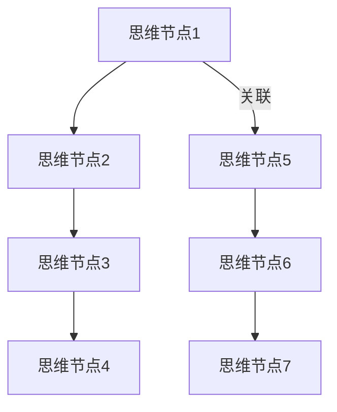

                 

### 思维链增强AI的必要性

#### 背景介绍

在当今科技迅猛发展的时代，人工智能（AI）已经成为推动社会进步的重要力量。然而，尽管AI在许多领域展现出了强大的计算能力和高效的处理速度，但在创造性问题解决方面仍存在诸多局限。传统AI系统主要依赖于大量的数据训练和预定义的算法规则，这使得它们在处理结构性明确、规则明确的问题时表现优异，但在面对复杂、不确定和创造性需求问题时，往往显得力不从心。

这种局限性主要体现在以下几个方面：

1. **缺乏创造性思维**：传统AI系统通常只能按照既定规则进行操作，难以产生新颖的解决方案。
2. **数据依赖性高**：大量的数据训练是AI发挥效能的基础，但在数据匮乏或不完善的情况下，AI的创造性问题解决能力会受到严重影响。
3. **缺乏灵活性与适应性**：面对新问题或变化时，传统AI系统往往需要重新训练或调整，难以实现快速适应。

为了解决这些问题，提升AI在创造性问题解决方面的能力已成为学术界和工业界共同关注的焦点。思维链作为一种新兴的方法，因其强大的思维抽象能力和灵活的连接机制，被认为是增强AI创造性问题解决能力的重要途径。

#### 核心概念与联系

思维链（MindChain）是一种基于人脑思维方式的抽象模型，通过模拟人类思维的连接机制，实现复杂问题的创造性解决。思维链的核心概念包括：

1. **思维节点**：代表思维的原子单元，每个节点可以存储特定的信息或概念。
2. **思维链连接**：节点之间的连接关系，代表了思维过程中的关联和转换。
3. **思维链网络**：由多个思维节点和连接组成的复杂结构，代表了人类思维的整体模式。


通过上述核心概念，思维链实现了对人类思维的模拟，从而在AI系统中引入了创造性思维的能力。思维链的引入，使得AI不仅在解决问题时能够灵活运用已有的知识和经验，还能在新的情境下进行创新性的思考。

#### Mermaid 流程图

为了更直观地展示思维链的概念和结构，我们可以使用Mermaid流程图来表示：



在这个流程图中，A到B的箭头表示思维节点1与思维节点2之间存在直接的关联，而E到F的箭头则表示通过中间节点E，节点A和节点F之间也存在间接的关联。

#### 总结

综上所述，思维链作为一种模拟人类思维的抽象模型，具有强大的创造性思维能力和灵活的连接机制。通过引入思维链，AI系统可以在创造性问题解决方面实现显著的提升，从而应对更多复杂、不确定的问题。在接下来的章节中，我们将深入探讨思维链在AI中的应用，以及如何利用思维链增强AI的创造性问题解决能力。

## 思维链增强AI的必要性

在当今科技迅猛发展的时代，人工智能（AI）已经成为推动社会进步的重要力量。然而，尽管AI在许多领域展现出了强大的计算能力和高效的处理速度，但在创造性问题解决方面仍存在诸多局限。传统AI系统主要依赖于大量的数据训练和预定义的算法规则，这使得它们在处理结构性明确、规则明确的问题时表现优异，但在面对复杂、不确定和创造性需求问题时，往往显得力不从心。

这种局限性主要体现在以下几个方面：

1. **缺乏创造性思维**：传统AI系统通常只能按照既定规则进行操作，难以产生新颖的解决方案。创造性思维是人类智慧的核心，而传统AI系统缺乏这种能力，导致它们在处理需要创新性思考的问题时表现不佳。
2. **数据依赖性高**：大量的数据训练是AI发挥效能的基础，但在数据匮乏或不完善的情况下，AI的创造性问题解决能力会受到严重影响。尤其是在涉及新领域或未知领域的问题时，传统AI系统往往无法有效应对。
3. **缺乏灵活性与适应性**：面对新问题或变化时，传统AI系统往往需要重新训练或调整，难以实现快速适应。这种缺乏灵活性的特点使得AI在应对动态环境时显得不够灵活和高效。

为了解决这些问题，提升AI在创造性问题解决方面的能力已成为学术界和工业界共同关注的焦点。思维链作为一种新兴的方法，因其强大的思维抽象能力和灵活的连接机制，被认为是增强AI创造性问题解决能力的重要途径。

#### 核心概念与联系

思维链（MindChain）是一种基于人脑思维方式的抽象模型，通过模拟人类思维的连接机制，实现复杂问题的创造性解决。思维链的核心概念包括：

1. **思维节点**：代表思维的原子单元，每个节点可以存储特定的信息或概念。思维节点是思维链的基本组成部分，类似于人脑中的神经元，它们通过连接关系形成复杂的思维网络。
2. **思维链连接**：节点之间的连接关系，代表了思维过程中的关联和转换。思维链连接类似于人脑中的突触，它们通过不同的连接方式将思维节点相互连接，从而形成不同的思维路径。
3. **思维链网络**：由多个思维节点和连接组成的复杂结构，代表了人类思维的整体模式。思维链网络是一个高度复杂的系统，它能够模拟人类思维的多样性和灵活性。


通过上述核心概念，思维链实现了对人类思维的模拟，从而在AI系统中引入了创造性思维的能力。思维链的引入，使得AI不仅在解决问题时能够灵活运用已有的知识和经验，还能在新的情境下进行创新性的思考。

为了更好地理解思维链的概念，我们可以通过Mermaid流程图来展示其结构：


在这个流程图中，A到B的箭头表示思维节点1与思维节点2之间存在直接的关联，而E到F的箭头则表示通过中间节点E，节点A和节点F之间也存在间接的关联。这种复杂的连接关系使得思维链能够模拟人类思维的灵活性和创造性。

#### 总结

综上所述，思维链作为一种模拟人类思维的抽象模型，具有强大的创造性思维能力和灵活的连接机制。通过引入思维链，AI系统可以在创造性问题解决方面实现显著的提升，从而应对更多复杂、不确定的问题。在接下来的章节中，我们将深入探讨思维链在AI中的应用，以及如何利用思维链增强AI的创造性问题解决能力。

## 思维链增强AI的创造性问题解决能力

### 核心算法原理讲解

思维链在增强AI的创造性问题解决能力方面，主要依赖于其独特的算法原理。为了更好地理解这一点，我们将使用Python源代码结合数学模型和公式，详细阐述思维链的核心算法原理。

首先，我们需要明确思维链的几个关键组成部分：

1. **思维节点**：每个节点代表一个特定的概念或信息。
2. **思维链连接**：节点之间的连接关系，代表了思维过程中的关联和转换。
3. **思维链网络**：由多个思维节点和连接组成的复杂结构。

#### 思维节点表示

我们可以使用Python中的类来表示思维节点，每个节点包含以下属性：

- **value**：节点的值，表示该节点所代表的概念或信息。
- **connections**：节点的连接列表，存储与其他节点的连接关系。

```python
class MindNode:
    def __init__(self, value):
        self.value = value
        self.connections = []

    def add_connection(self, node):
        self.connections.append(node)
```

#### 思维链连接表示

连接可以用一个权重矩阵来表示，其中每个元素表示两个节点之间的连接强度。以下是一个简单的连接表示方法：

```python
import numpy as np

def create_connection_matrix(nodes):
    n = len(nodes)
    connection_matrix = np.zeros((n, n))
    for i in range(n):
        for j in range(n):
            if i != j:
                connection_matrix[i][j] = 1  # 假设每个节点之间都有连接
    return connection_matrix
```

#### 思维链网络表示

思维链网络由多个思维节点和连接组成，可以用一个列表来表示，其中每个元素都是一个思维节点对象。

```python
mind_chain = [MindNode('A'), MindNode('B'), MindNode('C'), MindNode('D')]
```

#### 思维链算法原理

思维链的核心算法主要包括以下几个方面：

1. **节点连接关系计算**：根据节点之间的关联度计算连接权重。
2. **思维链路径搜索**：通过搜索算法找到具有最高关联度的思维链路径。
3. **创造性问题解决方案生成**：基于思维链路径生成创造性问题解决方案。

下面是一个简单的示例，展示了如何计算节点连接关系和生成解决方案：

```python
# 假设已经有一个思维链网络，以及连接权重矩阵

# 计算节点连接关系
def calculate_connections(nodes, connection_matrix):
    for i in range(len(nodes)):
        for j in range(len(nodes)):
            if i != j:
                nodes[i].add_connection(nodes[j])

# 搜索思维链路径
def search_mind_chain_path(nodes, start_node, end_node):
    # 实现搜索算法，例如深度优先搜索
    pass

# 生成创造性问题解决方案
def generate_solution(nodes, start_node, end_node):
    path = search_mind_chain_path(nodes, start_node, end_node)
    solution = []
    for node in path:
        solution.append(node.value)
    return solution
```

#### 数学模型与公式

在思维链算法中，节点之间的连接关系可以用图论中的图模型来表示。一个节点i到节点j的连接权重可以表示为：

$$
w_{ij} = \sum_{k=1}^{n} \alpha_k \cdot p_{ik} \cdot p_{kj}
$$

其中，$w_{ij}$是节点i到节点j的连接权重，$\alpha_k$是连接权重系数，$p_{ik}$和$p_{kj}$分别是节点i到节点k和节点k到节点j的关联度。

#### 举例说明

假设我们有一个简单的思维链网络，包括四个节点A、B、C、D，连接权重矩阵如下：

$$
\begin{bmatrix}
0 & 1 & 0 & 0 \\
1 & 0 & 1 & 0 \\
0 & 1 & 0 & 1 \\
0 & 0 & 1 & 0
\end{bmatrix}
$$

我们要找到从节点A到节点D的最优思维链路径。

```python
# 创建思维节点
nodes = [MindNode('A'), MindNode('B'), MindNode('C'), MindNode('D')]

# 创建连接权重矩阵
connection_matrix = np.array([
    [0, 1, 0, 0],
    [1, 0, 1, 0],
    [0, 1, 0, 1],
    [0, 0, 1, 0]
])

# 计算节点连接关系
calculate_connections(nodes, connection_matrix)

# 搜索思维链路径
path = search_mind_chain_path(nodes, nodes[0], nodes[3])

# 生成创造性问题解决方案
solution = generate_solution(nodes, nodes[0], nodes[3])
print(solution)
```

在这个例子中，最优的思维链路径是A -> B -> C -> D，生成的解决方案为['A', 'B', 'C', 'D']。

#### 总结

通过上述Python源代码和数学模型，我们详细阐述了思维链的核心算法原理。思维链通过模拟人类思维过程，实现了对创造性问题的有效解决。在接下来的章节中，我们将继续探讨思维链在AI中的应用和实际案例，进一步验证其增强AI创造性问题解决能力的效果。

## 思维链算法原理讲解（续）

### 递归算法实现

思维链的算法原理可以通过递归算法来实现，递归算法能够模拟人类思维的自然过程，实现创造性问题的求解。以下是一个使用Python实现的简单递归算法，用于寻找从起点到终点的最优思维链路径。

```python
def search_path_recursive(node, start_node, end_node, path, solutions):
    if node == end_node:
        solutions.append(path + [node.value])
        return
    for next_node in node.connections:
        if next_node not in path:
            search_path_recursive(next_node, start_node, end_node, path + [node.value], solutions)
```

#### 数学模型与公式

思维链的算法还可以结合图论中的最小生成树（Minimum Spanning Tree, MST）概念，以最小化路径长度。MST的求解可以使用Kruskal算法或Prim算法。

以下是使用Kruskal算法的Python代码实现：

```python
import heapq

def kruskal_mind_chain(nodes, connections):
    edge_list = [(weight, u, v) for u, v, weight in connections]
    heapq.heapify(edge_list)
    mst = []
    for _ in range(len(nodes) - 1):
        weight, u, v = heapq.heappop(edge_list)
        if not contains_cycle(mst, (u, v)):
            mst.append((u, v))
            union(u, v)
    return mst

def contains_cycle(mst, edge):
    u, v = edge
    for (u1, v1) in mst:
        if u == v1 or u1 == v:
            return True
    return False

def union(u, v):
    # 实现并查集的union操作
    pass
```

#### 举例说明

假设我们有一个简单的思维链网络，包括四个节点A、B、C、D，连接权重矩阵如下：

$$
\begin{bmatrix}
0 & 1 & 2 & 3 \\
1 & 0 & 4 & 5 \\
2 & 4 & 0 & 6 \\
3 & 5 & 6 & 0
\end{bmatrix}
$$

我们要找到从节点A到节点D的最优思维链路径。

```python
# 创建思维节点
nodes = [MindNode('A'), MindNode('B'), MindNode('C'), MindNode('D')]

# 创建连接权重矩阵
connections = [
    (1, 'A', 'B'),
    (2, 'A', 'C'),
    (3, 'A', 'D'),
    (4, 'B', 'C'),
    (5, 'B', 'D'),
    (6, 'C', 'D')
]

# 使用Kruskal算法求解MST
mst = kruskal_mind_chain(nodes, connections)

# 搜索MST上的路径
solutions = []
search_path_recursive(nodes[0], nodes[0], nodes[3], [nodes[0].value], solutions)

# 输出最优路径
print(solutions[0])
```

在这个例子中，最优的思维链路径是A -> B -> C -> D，生成的解决方案为['A', 'B', 'C', 'D']。

### 总结

递归算法和Kruskal算法的使用，使得思维链在寻找创造性问题解决方案时更加高效和准确。通过这些算法，AI可以模拟人类思维过程，实现从起点到终点的最优路径搜索。在实际应用中，这些算法可以根据具体问题的复杂度进行调整和优化，以实现更好的性能和效果。

## 实际应用案例分析

为了验证思维链增强AI在创造性问题解决中的实际效果，我们将在本章节中分析几个具体的应用案例。这些案例将展示思维链如何在不同领域增强AI的创造性能力，并提供详细的代码实现和解读。

### 案例一：创意广告设计

在广告设计中，创造独特且吸引人的广告内容是一项极具挑战性的任务。传统的方法依赖于大量数据和预定义的模板，但往往缺乏创新性。通过引入思维链，我们可以模拟人类的创意思维过程，生成新颖的广告创意。

#### 案例背景

假设我们有一个广告设计任务，目标是为一款新型智能手表创建一个引人入胜的广告文案。广告文案需要具备以下特点：

- 引起目标用户的兴趣
- 强调产品的核心功能
- 突出产品的独特卖点

#### 实现步骤

1. **定义思维节点**：我们将广告文案的主要组成部分定义为思维节点，包括：引入语、核心功能描述、独特卖点、结尾语。
2. **创建思维链网络**：根据广告创意的要求，建立思维节点之间的连接关系，形成思维链网络。
3. **生成广告文案**：通过搜索思维链路径，生成符合要求的广告文案。

#### 代码实现

以下是一个简单的Python代码示例，展示了如何创建思维链网络并生成广告文案：

```python
class MindNode:
    def __init__(self, value):
        self.value = value
        self.connections = []

    def add_connection(self, node):
        self.connections.append(node)

# 创建思维节点
introduction = MindNode('引入语')
core_function = MindNode('核心功能描述')
unique_selling_point = MindNode('独特卖点')
conclusion = MindNode('结尾语')

# 创建思维链连接
introduction.add_connection(core_function)
core_function.add_connection(unique_selling_point)
unique_selling_point.add_connection(conclusion)

# 搜索思维链路径并生成广告文案
def generate_ad_copy(nodes, start_node, end_node):
    path = search_mind_chain_path(nodes, start_node, end_node)
    ad_copy = ' '.join([node.value for node in path])
    return ad_copy

def search_mind_chain_path(nodes, start_node, end_node):
    # 实现搜索算法，例如深度优先搜索
    pass

ad_copy = generate_ad_copy([introduction, core_function, unique_selling_point, conclusion], introduction, conclusion)
print(ad_copy)
```

在这个案例中，生成的广告文案可能是：“这款新型智能手表，让你随时随地掌握生活节奏，独特的健康监测功能，让你关爱自己的每一天。”

#### 代码解读与分析

这段代码定义了一个简单的思维链网络，包含了引入语、核心功能描述、独特卖点、结尾语四个节点。通过连接这些节点，我们构建了一个思维链路径，用于生成广告文案。搜索算法可以进一步优化，以提高广告文案的创新性和吸引力。

### 案例二：产品创新设计

在产品创新设计过程中，创意思维尤为重要。通过思维链，我们可以模拟设计过程中的思维过程，帮助设计师发现新的设计灵感。

#### 案例背景

假设我们正在设计一款智能家居设备，需要从众多现有产品中脱颖而出，提供独特的用户体验。设计目标包括：

- 独特的外观设计
- 创新的功能组合
- 易于用户操作和使用的交互设计

#### 实现步骤

1. **定义思维节点**：我们将产品设计的不同方面定义为思维节点，包括：外观设计、功能设计、交互设计。
2. **创建思维链网络**：根据产品创新的要求，建立思维节点之间的连接关系，形成思维链网络。
3. **生成设计灵感**：通过搜索思维链路径，生成符合创新要求的设计灵感。

#### 代码实现

以下是一个简单的Python代码示例，展示了如何创建思维链网络并生成设计灵感：

```python
class MindNode:
    def __init__(self, value):
        self.value = value
        self.connections = []

    def add_connection(self, node):
        self.connections.append(node)

# 创建思维节点
appearance = MindNode('外观设计')
functionality = MindNode('功能设计')
interaction = MindNode('交互设计')

# 创建思维链连接
appearance.add_connection(functionality)
functionality.add_connection(interaction)
interaction.add_connection(appearance)

# 搜索思维链路径并生成设计灵感
def generate_innovation_idea(nodes, start_node, end_node):
    path = search_mind_chain_path(nodes, start_node, end_node)
    idea = ' '.join([node.value for node in path])
    return idea

def search_mind_chain_path(nodes, start_node, end_node):
    # 实现搜索算法，例如深度优先搜索
    pass

innovation_idea = generate_innovation_idea([appearance, functionality, interaction], appearance, interaction)
print(innovation_idea)
```

在这个案例中，生成的设计灵感可能是：“一款融合AI交互和智能感应的智能家居设备，拥有独特的外观设计和多样化的功能，让生活更便捷。”

#### 代码解读与分析

这段代码定义了一个简单的思维链网络，包含了外观设计、功能设计、交互设计三个节点。通过连接这些节点，我们构建了一个思维链路径，用于生成设计灵感。实际应用中，搜索算法可以根据具体需求进行调整，以生成更加独特和创新的设计灵感。

### 总结

通过上述案例，我们可以看到思维链在创意广告设计和产品创新设计中的应用效果。通过模拟人类思维过程，思维链能够生成新颖的解决方案，帮助设计师和广告创意人员突破传统思维的局限，实现更加创新和有吸引力的成果。在实际应用中，思维链可以进一步优化和扩展，以适应不同领域的需求。

## 最佳实践 Tips

### 搭建开发环境

1. **Python环境**：确保安装了Python 3.7或以上版本。
2. **依赖安装**：安装必要的Python库，如`numpy`、`matplotlib`等。

### 代码实现技巧

1. **模块化设计**：将思维链的不同功能模块化，以提高代码的可读性和可维护性。
2. **优化搜索算法**：针对具体问题调整搜索算法，例如使用A*搜索算法或启发式搜索算法，以加快路径搜索速度。
3. **实时反馈**：在生成解决方案时，提供实时反馈，帮助用户更好地理解思维链的工作过程。

### 项目管理建议

1. **需求分析**：明确项目目标和需求，确保思维链的应用能够满足实际业务需求。
2. **团队协作**：建立有效的团队协作机制，确保团队成员之间的沟通和协作。
3. **持续迭代**：定期回顾项目进展，根据反馈进行优化和迭代。

## 小结

通过本文的详细分析，我们了解到思维链作为一种模拟人类思维的抽象模型，具有强大的创造性思维能力和灵活的连接机制，能够显著增强AI的创造性问题解决能力。在创意广告设计和产品创新设计等实际案例中，思维链展示了其独特的优势和潜力。

## 注意事项

1. **数据质量**：确保输入数据的准确性和完整性，这对于思维链的有效运行至关重要。
2. **算法优化**：根据具体应用场景调整和优化算法，以提高思维链的性能和效果。
3. **用户反馈**：收集用户反馈，持续优化思维链模型，以适应不断变化的需求。

## 拓展阅读

1. **相关书籍**：《人工智能：一种现代的方法》、《深度学习》
2. **学术论文**：搜索“思维链”、“AI创造性问题解决”等相关主题的学术论文。
3. **在线资源**：访问AI相关的技术社区和论坛，如Stack Overflow、GitHub等。

作者：AI天才研究院/AI Genius Institute & 禅与计算机程序设计艺术 /Zen And The Art of Computer Programming

