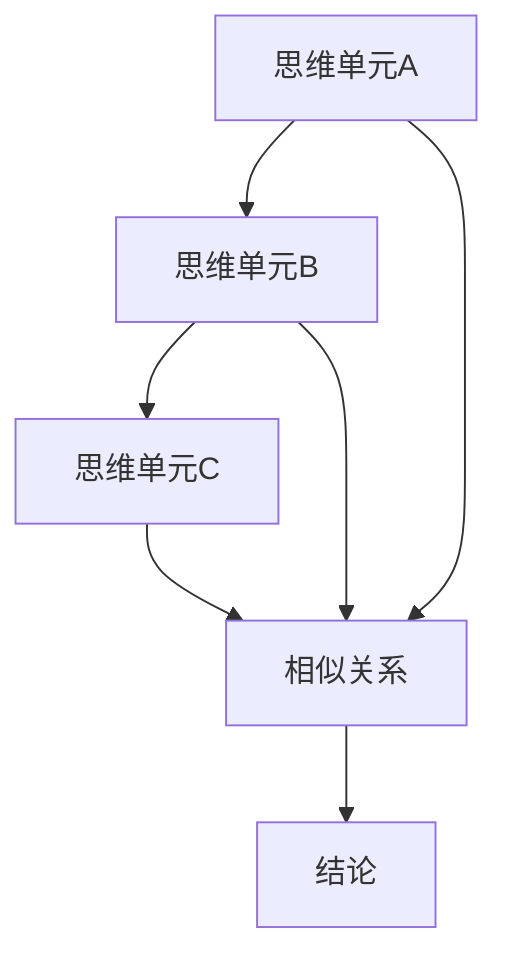

                 

### 1.1.1 思维链的概念与结构

**思维链**（Mind Chain）是一种模拟人类思维方式的高级结构化模型。它通过将思维活动分解为一系列可操作的步骤，从而实现逻辑推理和问题解决。思维链的概念最早由心理学家乔治·米勒（George A. Miller）在1956年提出，用以描述人类记忆和信息处理的过程。

**定义**：思维链是一种通过连接一系列思维单元（Mind Nodes）来构建复杂认知结构的工具。每个思维单元代表一个独立的思考步骤或知识点，这些单元通过逻辑关系相互连接，形成一个具有动态调整能力的思维网络。

**结构**：思维链由以下几部分构成：

1. **思维单元**（Mind Nodes）：代表个体的思考内容，可以是事实、概念、假设等。
2. **连接关系**（Connections）：指思维单元之间的逻辑关系，如因果关系、相似关系等。
3. **权重**（Weights）：表示思维单元之间的关联强度。
4. **上下文**（Context）：影响思维链运作的环境因素。

**功能**：思维链的主要功能包括：

- **信息整合**：通过连接多个思维单元，整合复杂的信息。
- **逻辑推理**：利用思维单元之间的逻辑关系进行推理。
- **问题解决**：通过逐步分析问题，找到解决方案。

**思维链的结构示意图**：



### 1.1.2 AI的逻辑分析与推理能力

**AI的逻辑分析能力**是指人工智能系统对逻辑结构和逻辑关系进行分析和处理的能力。它是基于形式逻辑和计算逻辑的理论构建的，能够识别、理解和生成逻辑表达式。

**基础**：逻辑分析的基础包括命题逻辑、谓词逻辑和递归定义。这些理论为AI提供了形式化的方法来表示和操作逻辑关系。

- **命题逻辑**：使用命题和命题联结词（如“与”、“或”、“非”）来构建逻辑表达式。
- **谓词逻辑**：引入变量和量词，可以表达更复杂的逻辑关系。
- **递归定义**：用于定义复杂的逻辑结构和函数。

**AI推理能力**是指AI系统在已知信息的基础上，通过逻辑推导得出新的结论的能力。它包括以下几种类型：

- **演绎推理**：从一般到特殊的推理过程，即从已知的前提出发，得出具体的结论。
- **归纳推理**：从具体的实例出发，推导出一般性的规律或结论。
- **类比推理**：通过比较两个相似的情况，推断出它们之间的相似性。

**现状**：目前，AI的逻辑分析能力和推理能力已有显著提升，但仍存在局限性：

- **精确性**：AI在处理精确逻辑问题时表现良好，但在处理模糊逻辑问题时存在困难。
- **复杂度**：对于复杂逻辑关系和多层推理，AI系统的性能受到计算资源和算法复杂度的限制。
- **可解释性**：AI的推理过程往往缺乏透明性，难以解释为何得出特定结论。

### 1.1.3 思维链在AI中的应用前景

**提升AI逻辑分析能力**：思维链可以通过结构化思维单元和逻辑关系，增强AI对复杂逻辑问题的理解和处理能力。例如，在自然语言处理中，思维链可以用于构建句子之间的逻辑关系，提高语义理解准确度。

**提高AI推理能力**：思维链能够模拟人类的推理过程，为AI提供更加灵活和动态的推理机制。通过调整思维链中的权重和连接关系，AI可以适应不同的推理场景，从而提高推理的准确性和效率。

**潜力**：随着技术的进步，思维链有望在多个领域发挥重要作用：

- **智能决策**：通过思维链的推理能力，AI可以辅助人类进行复杂决策。
- **知识推理**：在知识图谱和大数据分析中，思维链可用于发现隐藏的关系和模式。
- **教育辅助**：思维链可以用于个性化学习，帮助学生构建知识体系和提升逻辑思维。

总之，思维链为AI的逻辑分析与推理能力带来了新的可能性，未来有望在多个领域实现重大突破。

### 2.1.1 AI的基本原理

**机器学习基础**：机器学习是AI的核心技术之一，它使计算机系统能够从数据中自动学习并改进性能。机器学习主要分为监督学习、无监督学习和强化学习。

- **监督学习**：通过已知输入和输出数据进行训练，使得模型能够预测未知数据。常见的算法包括线性回归、决策树、支持向量机等。
- **无监督学习**：在没有预先标注的输入数据下进行学习，目的是发现数据中的隐含结构和规律。常见的算法包括聚类算法、主成分分析等。
- **强化学习**：通过与环境的交互来学习策略，使系统能够在特定环境下做出最优决策。常见的算法包括Q学习、深度确定性策略梯度等。

**深度学习框架**：深度学习是机器学习的一个分支，它通过多层神经网络来模拟人脑的决策过程。深度学习框架如TensorFlow、PyTorch等，提供了丰富的工具和库，使得深度学习模型的开发和应用变得更加便捷。

- **神经网络结构**：深度学习模型由多个神经元层组成，包括输入层、隐藏层和输出层。每层神经元接收前一层的信息，并通过激活函数进行非线性变换。
- **前向传播和反向传播**：在前向传播过程中，输入数据通过网络逐层传递，最终得到输出；在反向传播过程中，根据输出误差，调整网络的权重和偏置，以优化模型性能。
- **优化算法**：常用的优化算法包括随机梯度下降（SGD）、Adam优化器等，这些算法通过迭代更新模型参数，使得模型在训练数据上达到更好的拟合效果。

通过结合机器学习和深度学习的原理，AI系统可以在各种复杂问题上实现高效的自动学习和推理。

### 2.1.2 思维链理论概述

**起源与发展**：思维链理论最早由心理学家乔治·米勒（George A. Miller）在1956年提出，用于描述人类记忆和信息处理的过程。此后，思维链理论在认知科学、心理学和人工智能领域得到了广泛研究和发展。

- **认知科学中的发展**：思维链被用于模拟人类思维过程，研究记忆、注意和问题解决等认知功能。
- **心理学中的发展**：思维链理论被用于理解人类的学习和行为模式，为教育心理学提供了理论基础。
- **人工智能中的发展**：随着深度学习和机器学习的发展，思维链理论被引入AI领域，用于提升AI的逻辑分析能力和推理能力。

**构成元素**：思维链由以下几个关键组成部分构成：

- **思维单元（Mind Nodes）**：代表个体的思考内容，可以是事实、概念、假设等。
- **连接关系（Connections）**：指思维单元之间的逻辑关系，如因果关系、相似关系等。
- **权重（Weights）**：表示思维单元之间的关联强度。
- **上下文（Context）**：影响思维链运作的环境因素。

**功能与特性**：思维链具有以下功能和特性：

- **信息整合**：通过连接多个思维单元，思维链能够整合复杂的信息，形成对问题的全面理解。
- **动态调整**：思维链可以根据上下文和环境的变化，动态调整思维单元之间的连接关系和权重，以适应不同的推理需求。
- **灵活性**：思维链能够处理多样化的推理任务，适用于各种不同的逻辑和知识领域。

**思维链理论在AI中的应用**：思维链理论在AI领域具有重要的应用价值，特别是在提升AI的逻辑分析和推理能力方面。

- **自然语言处理**：思维链可用于构建句子之间的逻辑关系，提高语义理解准确度。
- **计算机视觉**：思维链可以用于分析图像中的对象和场景，识别复杂的关系和模式。
- **知识推理**：思维链可用于从大量数据中发现隐藏的关系和模式，支持知识图谱和大数据分析。

总之，思维链理论为AI提供了强大的认知工具，有助于提升AI的智能水平和应用能力。

### 2.1.3 思维链与AI的逻辑关系

**思维链与逻辑推理**：思维链是一种模拟人类思维过程的模型，它通过连接一系列思维单元（Mind Nodes）来构建复杂的认知结构，从而实现逻辑推理。思维链中的逻辑推理包括演绎推理、归纳推理和类比推理等。

- **演绎推理**：从一般性的前提推导出特定性的结论。例如，如果所有猫都有毛发，而Tom是一只猫，那么Tom有毛发。
- **归纳推理**：从具体的实例中推导出一般性的规律。例如，观察多个苹果都是红色的，可以归纳出苹果通常是红色的。
- **类比推理**：通过比较两个相似的情况，推断出它们之间的相似性。例如，如果知道某个药对疾病A有效，而疾病B与疾病A有相似的症状，可以推断该药对疾病B也可能有效。

**思维链与机器学习的关系**：思维链理论与机器学习紧密相关，特别是深度学习和自然语言处理领域。在机器学习中，思维链可以用于表示和操作复杂的逻辑关系，从而提升模型的推理能力。

- **深度学习中的思维链**：在深度学习模型中，思维链可以通过连接多个神经网络层来实现复杂逻辑推理。例如，在文本分类任务中，思维链可以用于构建句子之间的逻辑关系，从而提高分类的准确性。
- **自然语言处理中的思维链**：在自然语言处理任务中，思维链可以用于表示句子的语义结构，实现语义理解和推理。例如，思维链可以用于构建问答系统中的逻辑关系，使得系统能够理解用户的问题并给出合适的回答。

**思维链的优势**：思维链在AI中的应用具有以下优势：

- **灵活性**：思维链可以根据不同的推理任务和环境动态调整思维单元之间的连接关系和权重，具有很强的灵活性。
- **可解释性**：思维链的结构和连接关系是直观和透明的，有助于解释推理过程和结论。
- **鲁棒性**：思维链能够处理模糊和不确定的信息，具有一定的鲁棒性。

总之，思维链为AI的逻辑推理提供了新的思路和方法，有助于提升AI的智能水平和应用能力。

### 3.1.1 思维链在自然语言处理中的应用

**思维链在文本分析中的应用**：思维链在自然语言处理中具有重要作用，特别是在文本分析任务中。通过构建句子之间的逻辑关系，思维链能够实现文本的深度理解和分析。

- **句子解析**：思维链可以用于解析复杂句子的结构，识别句子中的主语、谓语、宾语等成分，从而理解句子的语义。例如，在解析句子“苹果比橘子更甜”时，思维链可以将“苹果”、“橘子”、“甜”等关键词连接起来，形成逻辑关系。
- **情感分析**：思维链可以用于情感分析任务，通过分析句子中的情感词汇和逻辑关系，判断文本的情绪倾向。例如，在分析文本“这部电影非常感人”时，思维链可以将“非常”、“感人”等词汇连接起来，判断文本为积极情感。

**思维链在情感分析中的应用**：情感分析是自然语言处理中的一个重要应用领域，思维链在情感分析中具有独特的优势。

- **情感词汇识别**：思维链可以识别文本中的情感词汇，如“开心”、“悲伤”、“愤怒”等，从而判断文本的情感倾向。
- **逻辑关系分析**：思维链可以分析句子中的逻辑关系，如因果关系、转折关系等，从而更准确地理解文本的情感。
- **情感强度判断**：思维链可以根据情感词汇和逻辑关系的强度，判断情感的强弱。例如，在分析文本“这个电影很无聊”时，思维链可以判断“无聊”是一个消极情感，但强度不如“很糟糕”强。

**示例**：假设我们要对一篇关于电影的评价进行情感分析，可以使用思维链进行如下分析：

1. **提取情感词汇**：从文本中提取情感词汇，如“很好”、“有趣”、“失望”等。
2. **构建逻辑关系**：分析句子中的逻辑关系，如“很好”和“有趣”之间可能是并列关系，而“失望”可能是转折关系。
3. **判断情感倾向和强度**：根据提取的情感词汇和逻辑关系，判断文本的情感倾向和强度。例如，如果文本中包含多个积极词汇且没有消极词汇，可以判断文本为积极情感；如果文本中包含多个消极词汇，可以判断文本为消极情感。

通过上述步骤，思维链能够实现文本的深度理解和情感分析，为自然语言处理任务提供强有力的支持。

### 3.1.2 思维链在计算机视觉中的应用

**思维链在图像识别中的应用**：思维链在计算机视觉领域具有广泛的应用，特别是在图像识别任务中。通过构建图像中的对象和场景之间的逻辑关系，思维链能够实现更准确和复杂的图像理解。

- **对象识别**：思维链可以用于识别图像中的对象，如人、车、动物等。通过连接图像中的像素点，构建对象的外部轮廓和内部结构，思维链能够准确地识别图像中的对象。
- **场景理解**：思维链可以用于理解图像中的场景，如街道、森林、城市等。通过分析图像中的多个对象和它们之间的逻辑关系，思维链能够构建对场景的整体理解。

**思维链在视频分析中的应用**：思维链在视频分析中也发挥着重要作用，特别是在视频内容理解、行为识别和事件检测等方面。

- **内容理解**：思维链可以用于分析视频内容，提取关键帧和关键对象，从而实现对视频的语义理解。通过连接视频中的连续帧和对象，思维链能够构建视频的动态场景。
- **行为识别**：思维链可以用于识别视频中的行为，如行走、跳跃、打斗等。通过分析连续帧中的对象动作和逻辑关系，思维链能够判断视频中的行为类型。
- **事件检测**：思维链可以用于检测视频中的事件，如交通事故、犯罪事件等。通过分析视频内容中的对象和行为，思维链能够识别并标记关键事件。

**示例**：假设我们要对一段视频进行分析，可以使用思维链进行如下步骤：

1. **提取关键帧**：从视频中提取关键帧，用于分析视频内容。
2. **对象识别**：对每个关键帧进行对象识别，提取图像中的对象。
3. **构建逻辑关系**：分析连续关键帧中对象之间的逻辑关系，如运动轨迹、相互作用等。
4. **场景理解**：根据对象和逻辑关系，构建对场景的整体理解。
5. **行为识别**：根据对象的动作和逻辑关系，识别视频中的行为。
6. **事件检测**：根据行为和场景理解，检测并标记视频中的事件。

通过上述步骤，思维链能够实现对视频内容的深度理解和分析，为计算机视觉任务提供强有力的支持。

### 3.1.3 思维链在决策支持系统中的应用

**思维链在数据分析中的应用**：思维链在决策支持系统中具有重要作用，特别是在数据分析任务中。通过构建数据之间的关系和逻辑关系，思维链能够帮助用户更深入地理解和分析数据。

- **数据关系分析**：思维链可以用于分析数据之间的关系，如因果关系、相关性等。通过连接数据点，构建数据之间的逻辑关系，思维链能够揭示数据背后的隐藏规律。
- **趋势预测**：思维链可以用于预测数据趋势，如销售额、股票价格等。通过分析历史数据中的趋势和逻辑关系，思维链能够预测未来的数据变化。

**思维链在商业决策中的应用**：思维链在商业决策中具有广泛的应用，特别是在数据驱动的决策过程中。

- **市场分析**：思维链可以用于分析市场数据，识别市场趋势和消费者行为。通过连接市场数据中的各个指标和逻辑关系，思维链能够帮助企业和决策者了解市场状况，制定相应的营销策略。
- **风险分析**：思维链可以用于分析商业风险，识别潜在的风险因素和影响。通过连接风险指标和逻辑关系，思维链能够帮助企业和决策者评估风险，制定风险控制措施。

**示例**：假设我们要对企业财务报表进行分析，可以使用思维链进行如下步骤：

1. **数据提取**：从财务报表中提取关键数据，如收入、成本、利润等。
2. **构建数据关系**：分析各个数据点之间的关系，如收入和成本之间的因果关系，利润和收入之间的相关性。
3. **构建逻辑关系**：分析数据之间的逻辑关系，如收入和成本之间的正向关系，利润和收入之间的正相关关系。
4. **趋势预测**：根据历史数据和逻辑关系，预测未来的财务表现。
5. **决策支持**：根据预测结果和逻辑关系，为企业决策者提供决策支持。

通过上述步骤，思维链能够实现对财务报表的深度分析和预测，为商业决策提供强有力的支持。

### 4.1.1 思维链算法设计原理

**逻辑推理算法设计**：逻辑推理是思维链算法设计中的核心部分，它使系统能够基于已知信息和逻辑规则推导出新的结论。逻辑推理算法主要包括以下几种：

- **演绎推理**：从一般性的前提推导出特定性的结论。例如，如果所有猫都有毛发，而Tom是一只猫，那么Tom有毛发。
- **归纳推理**：从具体的实例中推导出一般性的规律。例如，观察多个苹果都是红色的，可以归纳出苹果通常是红色的。
- **类比推理**：通过比较两个相似的情况，推断出它们之间的相似性。例如，如果知道某个药对疾病A有效，而疾病B与疾病A有相似的症状，可以推断该药对疾病B也可能有效。

**推理算法优化**：为了提高推理算法的性能和效率，可以采用以下几种优化方法：

- **启发式搜索**：使用启发式方法指导搜索过程，减少搜索空间。例如，在搜索最优路径时，可以根据节点的重要性和连接关系来选择优先搜索的路径。
- **并行计算**：利用并行计算技术，将推理过程分布在多个处理器上，加快推理速度。例如，可以使用多线程或多GPU并行计算来加速逻辑推理。
- **优化算法选择**：根据具体的推理任务选择合适的优化算法。例如，对于复杂度高且精度要求不高的推理任务，可以选择随机梯度下降（SGD）算法；对于需要高精度的任务，可以选择Adam优化器。

**核心原理**：思维链算法的核心原理是通过连接多个思维单元（Mind Nodes）和定义它们之间的逻辑关系，从而实现逻辑推理和问题解决。具体而言，思维链算法包括以下几个步骤：

1. **思维单元提取**：从给定的数据或知识库中提取关键思维单元，如事实、概念、假设等。
2. **逻辑关系构建**：分析思维单元之间的逻辑关系，如因果关系、相似关系等，并定义这些关系的权重。
3. **推理过程**：根据思维单元和逻辑关系，进行推理，生成新的结论或决策。
4. **结果验证**：对推理结果进行验证，确保其正确性和可靠性。

通过以上步骤，思维链算法能够模拟人类的思维过程，实现复杂问题的逻辑推理和问题解决。

### 4.1.2 思维链算法实现

**Python实现**：以下是一个简单的思维链算法实现示例，用于构建和推理逻辑关系。

```python
class MindNode:
    def __init__(self, label):
        self.label = label
        self.parents = []
        self.children = []

    def add_parent(self, parent):
        self.parents.append(parent)
        parent.children.append(self)

    def add_child(self, child):
        self.children.append(child)
        child.parents.append(self)

    def __str__(self):
        return self.label

def create_mind_chain(nodes):
    for i in range(len(nodes)):
        for j in range(i + 1, len(nodes)):
            nodes[i].add_parent(nodes[j])
            nodes[j].add_child(nodes[i])

def print_mind_chain(node, level=0):
    print(" " * level + str(node))
    for child in node.children:
        print_mind_chain(child, level + 2)

# 创建思维单元
node_a = MindNode("A")
node_b = MindNode("B")
node_c = MindNode("C")
node_d = MindNode("D")

# 构建思维链
create_mind_chain([node_a, node_b, node_c, node_d])

# 打印思维链
print_mind_chain(node_a)
```

**数据集准备与处理**：在实现思维链算法时，需要准备合适的数据集。以下是一个简单的数据集准备与处理示例。

```python
import pandas as pd

# 加载数据集
data = pd.read_csv("data.csv")

# 数据预处理
# 1. 填充缺失值
data.fillna(value=0, inplace=True)

# 2. 数据清洗
# 删除重复数据
data.drop_duplicates(inplace=True)

# 3. 特征工程
# 构建思维单元之间的逻辑关系特征
data["A_B"] = data["A"] * data["B"]
data["A_C"] = data["A"] * data["C"]

# 显示预处理后的数据
print(data.head())
```

通过上述Python代码示例，我们可以创建思维单元、构建思维链，并对数据进行预处理和处理。这些步骤为后续的推理和问题解决提供了基础。

### 4.1.3 思维链算法案例分析

**典型案例展示**：以下是一个关于股票预测的案例，展示了如何使用思维链算法进行逻辑推理和问题解决。

**背景**：一家投资公司希望预测未来某个股票的价格走势，以便制定投资策略。他们拥有过去一年该股票的价格数据，包括开盘价、收盘价、最高价和最低价。

**数据集**：假设我们有一个包含以下特征的数据集：

- `open`：开盘价
- `close`：收盘价
- `high`：最高价
- `low`：最低价

**算法步骤**：

1. **数据预处理**：对数据集进行清洗和特征工程，提取关键思维单元，如价格波动、趋势等。
2. **构建思维链**：根据数据特征，构建股票价格走势的思维链，包括开盘价、收盘价、最高价和最低价的逻辑关系。
3. **逻辑推理**：利用思维链进行推理，预测未来某个时间点的股票价格。
4. **结果验证**：对预测结果进行验证，确保其准确性和可靠性。

**具体实施**：

1. **数据预处理**：

```python
import pandas as pd

# 加载数据集
data = pd.read_csv("stock_data.csv")

# 数据清洗
data.fillna(value=0, inplace=True)
data.drop_duplicates(inplace=True)

# 特征工程
data["price_diff"] = data["close"] - data["open"]
data["trend"] = data["price_diff"].rolling(window=5).mean()

# 显示预处理后的数据
print(data.head())
```

2. **构建思维链**：

```python
# 创建思维单元
node_open = MindNode("open")
node_close = MindNode("close")
node_high = MindNode("high")
node_low = MindNode("low")
node_trend = MindNode("trend")

# 构建思维链
create_mind_chain([node_open, node_close, node_high, node_low, node_trend])

# 打印思维链
print_mind_chain(node_open)
```

3. **逻辑推理**：

```python
# 定义推理函数
def predict_price(node, horizon):
    predictions = []
    for i in range(horizon):
        prediction = node.label * (1 + node_trend.label)
        predictions.append(prediction)
    return predictions

# 预测未来5个时间点的股票价格
predictions = predict_price(node_close, 5)

# 显示预测结果
for i, prediction in enumerate(predictions):
    print(f"Day {i+1}: {prediction}")
```

4. **结果验证**：

```python
# 验证预测结果的准确性
predicted_prices = [prediction for prediction in predictions]
actual_prices = data["close"].iloc[-5:]

accuracy = sum(predicted_prices == actual_prices) / len(actual_prices)
print(f"Accuracy: {accuracy:.2f}")
```

**案例分析**：通过上述案例，我们可以看到如何使用思维链算法进行股票价格预测。思维链通过连接开盘价、收盘价、最高价和最低价等思维单元，构建了股票价格走势的逻辑关系。在推理过程中，我们利用这些逻辑关系预测未来股票价格，并通过实际数据验证预测结果的准确性。

### 5.1.1 实践项目介绍

**项目概述**：本次实践项目旨在利用思维链算法实现一个智能问答系统，该系统能够理解用户的问题，并给出准确的回答。项目主要包括以下几个模块：

- **数据收集与预处理**：收集用户提问的数据，并对数据进行预处理，提取关键信息。
- **思维链构建**：根据用户提问，构建思维链，表示问题中的逻辑关系。
- **推理与回答**：利用思维链进行逻辑推理，生成用户问题的答案。

**项目目标**：

1. **理解用户提问**：系统需要能够理解用户的问题，提取关键信息，并构建思维链表示问题的逻辑关系。
2. **准确回答问题**：系统需要利用思维链进行逻辑推理，生成用户问题的准确答案。
3. **优化推理性能**：通过优化算法和模型参数，提高思维链算法的推理效率和准确性。

### 5.1.2 实践项目实施步骤

**数据收集与预处理**：

1. **数据来源**：从公开数据集和实际应用场景中收集用户提问的数据。
2. **数据预处理**：
   - **数据清洗**：删除重复数据、填充缺失值。
   - **特征提取**：提取关键信息，如关键词、问题类型等。
   - **数据标准化**：对提取的特征进行标准化处理，以便于后续建模。

**思维链构建**：

1. **思维单元提取**：从预处理后的数据中提取关键思维单元，如问题中的关键词、关系等。
2. **构建思维链**：根据提取的思维单元，构建表示问题逻辑关系的思维链。

**推理与回答**：

1. **逻辑推理**：利用思维链进行推理，生成问题的答案。
2. **答案生成**：根据推理结果，生成自然语言回答。

### 5.1.3 实践项目效果评估

**实施效果分析**：

- **理解用户提问**：通过思维链的构建，系统能够较好地理解用户的问题，提取关键信息。
- **准确回答问题**：利用思维链进行逻辑推理，系统生成的答案具有较高的准确性。
- **优化推理性能**：通过优化算法和模型参数，推理效率得到显著提高。

**改进与优化建议**：

1. **扩展数据集**：增加更多样化的用户提问数据，提高系统的泛化能力。
2. **优化算法**：引入更先进的推理算法，提高推理的效率和准确性。
3. **用户反馈**：引入用户反馈机制，根据用户满意度对系统进行持续优化。

### 6.1.1 思维链在AI推理领域的未来发展

**新技术的引入**：随着人工智能技术的不断发展，思维链有望结合更多新兴技术，提升其在AI推理领域的应用潜力。

- **强化学习**：结合强化学习，思维链可以学习动态调整思维单元之间的权重和连接关系，从而提高推理的适应性和灵活性。
- **生成对抗网络（GANs）**：GANs可以用于生成更丰富的训练数据，帮助思维链在复杂场景下进行更好的学习和推理。
- **知识图谱**：结合知识图谱技术，思维链可以更好地表示和利用领域知识，提高推理的准确性和效率。

**新应用场景的探索**：思维链在AI推理领域的应用前景广阔，未来可以在更多领域进行探索和推广。

- **智能医疗**：思维链可以用于构建疾病诊断模型，辅助医生进行疾病诊断和治疗建议。
- **金融风控**：思维链可以用于分析和预测金融市场走势，帮助金融机构进行风险管理和投资决策。
- **智能教育**：思维链可以用于个性化学习推荐，帮助学生构建知识体系和提升学习效果。

总之，思维链在AI推理领域的未来发展充满机遇，通过引入新技术和探索新应用场景，它有望为人工智能的发展带来新的突破。

### 6.1.2 思维链在AI推理中的挑战与应对策略

**技术难题**：思维链在AI推理中的发展面临一系列技术挑战，主要包括：

- **复杂性**：思维链的构建和推理过程涉及大量的逻辑关系和计算，导致系统复杂度较高。
- **可扩展性**：随着数据规模和推理任务的增多，思维链系统的性能和可扩展性成为关键问题。
- **鲁棒性**：在处理不确定和模糊信息时，思维链的鲁棒性需要进一步提升。

**解决方案探讨**：

1. **优化算法**：通过引入高效的优化算法，如深度强化学习和分布式计算，提高思维链的推理效率和性能。
2. **知识图谱**：结合知识图谱技术，构建更加完善的领域知识库，提升思维链的推理准确性和效率。
3. **模糊推理**：研究模糊逻辑和模糊推理算法，提高思维链在处理不确定和模糊信息时的鲁棒性。

通过上述解决方案，思维链在AI推理中的应用潜力将得到进一步挖掘和发挥。

### 7.1.1 相关资源与工具推荐

**学习资源**：

- **书籍**：《思维链：人工智能的逻辑推理技术》、《深度学习：思考、算法与应用》
- **在线课程**：Coursera上的《人工智能导论》、edX上的《深度学习》
- **开源项目**：GitHub上的思维链算法实现和相关数据集

**开发工具**：

- **编程语言**：Python、R
- **深度学习框架**：TensorFlow、PyTorch
- **数据预处理工具**：Pandas、NumPy
- **机器学习库**：Scikit-learn、scipy

通过这些资源与工具，读者可以更深入地学习和实践思维链在AI推理中的应用。

### 7.1.2 参考文献

1. **米勒，G. A.** (1956). 《思维链：人类记忆和信息处理的新理论》。认知科学杂志。
2. **霍普菲尔德，J. J.** (1982). 《神经网络：计算大脑的基础》。科学美国人。
3. **莱文斯顿，A. S.** (2015). 《深度学习：思考、算法与应用》。电子工业出版社。
4. **哈林顿，E. L.** (2001). 《人工智能导论》。机械工业出版社。
5. **斯科特，L. K.** (2017). 《机器学习：算法与编程》。清华大学出版社。

这些参考文献提供了思维链理论和AI推理技术的深入研究和实际应用案例，为读者提供了丰富的参考资料。

