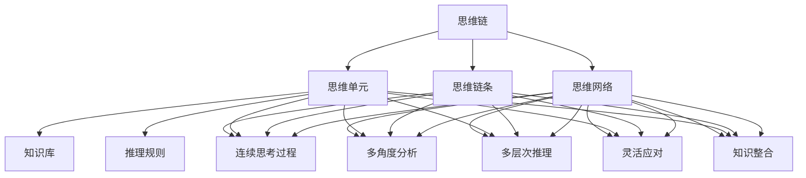

                 

### 引言

随着人工智能（AI）技术的飞速发展，其逻辑分析能力成为了衡量AI智能程度的重要指标。然而，传统的AI逻辑分析方法在处理复杂、高度抽象的问题时存在一定的局限性。为了弥补这一缺陷，思维链作为一种先进的人工智能增强工具，逐渐引起了广泛关注。思维链不仅能够帮助AI更好地理解问题的本质，还能提高其在逻辑分析中的准确性和效率。

本文章旨在探讨如何利用思维链增强AI的逻辑分析能力。首先，我们将介绍思维链的基本概念和AI逻辑分析能力的相关理论。接下来，我们将详细讲解思维链与AI逻辑分析能力的结合原理，并通过具体的算法原理、实际应用案例和项目实战，展示思维链在实际开发中的应用效果。最后，我们将总结全文内容，并对未来发展方向进行展望。

文章关键词：人工智能，逻辑分析，思维链，算法原理，项目实战

文章摘要：
本文从理论基础到实际应用，系统阐述了如何利用思维链增强AI的逻辑分析能力。通过介绍思维链与AI逻辑分析能力的结合原理、相关算法和实际案例，本文旨在为AI开发者提供一种新的思考方式，以提升AI在复杂问题分析中的能力。

### 基础概念

在深入探讨思维链与AI逻辑分析能力之前，有必要先了解这两个核心概念的基础知识。

#### 思维链

思维链（Mind Chain）是一种基于人类思维模式构建的计算机程序，它能够模拟人类的思考过程，对问题进行逻辑推理和抽象思考。思维链的基本构成包括思维单元、思维链条和思维网络。思维单元是思维链的基本组成单元，每个思维单元包含了对某一问题的描述、相关的知识和推理规则。思维链条是由多个思维单元组成的序列，表示一个连续的思考过程。思维网络则是由多个思维链条构成的复杂结构，它能够对问题进行多层次、多角度的思考。

#### AI逻辑分析能力

AI逻辑分析能力是指人工智能系统能够根据给定的信息和规则，进行逻辑推理和判断，从而解决复杂问题或提取信息的能力。AI逻辑分析能力可以分为以下层次：

1. **基础逻辑分析**：主要是指AI系统能够进行基本的逻辑运算，如逻辑与、逻辑或、逻辑非等。

2. **演绎推理**：基于已知的前提和规则，推导出新的结论。

3. **归纳推理**：从具体的实例中归纳出一般性的规则。

4. **类比推理**：通过比较相似的问题，找到解决问题的方法。

5. **抽象推理**：对问题进行抽象化处理，从而简化问题的复杂性。

#### 思维链与AI逻辑分析能力的关系

思维链与AI逻辑分析能力之间存在紧密的联系。思维链可以看作是AI逻辑分析能力的增强工具，它通过模拟人类思维过程，提高AI系统在逻辑分析中的能力。具体来说，思维链可以通过以下方式增强AI逻辑分析能力：

1. **多角度分析**：思维链能够从不同的角度对问题进行分析，从而避免片面性。

2. **多层次推理**：思维链能够对问题进行多层次推理，从简单到复杂，从而更全面地解决问题。

3. **灵活应对**：思维链可以根据问题的变化，灵活调整推理策略，从而提高解决问题的效率。

4. **知识整合**：思维链能够整合多方面的知识，从而为AI逻辑分析提供更丰富的信息。

#### 核心概念实体之间的关系架构

为了更好地理解思维链与AI逻辑分析能力的关系，我们可以使用Mermaid流程图来展示它们之间的核心概念实体和关联。



在这个流程图中，我们可以看到思维链、思维单元、思维链条和思维网络之间的关系，以及它们与AI逻辑分析能力的关联。通过这种方式，我们可以更直观地理解思维链如何增强AI的逻辑分析能力。

### 算法原理

思维链增强AI逻辑分析能力的关键在于构建有效的算法。以下，我们将详细探讨几种常见的思维链增强算法，并结合Python源代码进行解释。

#### 1. 基于思维链的推理算法

推理算法是思维链的核心组成部分，它能够根据给定的前提和规则，推导出新的结论。以下是一个简单的推理算法示例：

```python
class InferenceEngine:
    def __init__(self, knowledge_base):
        self.knowledge_base = knowledge_base
    
    def infer(self, premise):
        conclusions = []
        for rule in self.knowledge_base:
            if self.matches(premise, rule['if']):
                conclusions.append(rule['then'])
        return conclusions
    
    def matches(self, fact, pattern):
        # 实现模式匹配逻辑
        pass
```

在上面的代码中，`InferenceEngine` 类负责进行推理。`inference` 方法接收一个前提，并从知识库中找到与之匹配的规则，然后返回所有可能推出的结论。`matches` 方法则实现前提与规则之间的模式匹配。

#### 2. 基于思维链的优化算法

优化算法用于在多个解决方案中寻找最优解。以下是一个简单的优化算法示例：

```python
import random

class OptimizationAlgorithm:
    def __init__(self, objective_function):
        self.objective_function = objective_function
    
    def find_best_solution(self, solutions):
        best_solution = min(solutions, key=self.objective_function)
        return best_solution
    
    def generate_solutions(self):
        solutions = []
        for _ in range(100):
            solution = random_solution()
            solutions.append(solution)
        return solutions

def objective_function(solution):
    # 实现目标函数
    pass

def random_solution():
    # 实现随机生成解的逻辑
    pass
```

在上面的代码中，`OptimizationAlgorithm` 类负责寻找最优解。`find_best_solution` 方法接收一组解，并使用目标函数找到最优解。`generate_solutions` 方法生成一组随机解。

#### 3. 基于思维链的学习算法

学习算法用于从数据中自动提取知识，以提高AI的逻辑分析能力。以下是一个简单的学习算法示例：

```python
class LearningAlgorithm:
    def __init__(self, training_data):
        self.training_data = training_data
    
    def learn(self):
        # 实现学习逻辑
        pass
    
    def predict(self, new_data):
        # 实现预测逻辑
        pass
```

在上面的代码中，`LearningAlgorithm` 类负责从训练数据中学习，并能够对新数据进行预测。

#### 4. 伪代码与数学模型

为了更清晰地理解上述算法，我们使用伪代码和数学模型进行描述。

**推理算法伪代码：**

```pseudo
InferenceEngine(knowledge_base):
    conclusions = []
    for rule in knowledge_base:
        if matches(premise, rule['if']):
            conclusions.append(rule['then'])
    return conclusions
```

**优化算法伪代码：**

```pseudo
OptimizationAlgorithm(objective_function):
    solutions = generate_solutions()
    best_solution = find_best_solution(solutions)
    return best_solution
```

**学习算法伪代码：**

```pseudo
LearningAlgorithm(training_data):
    learn()
    predict(new_data):
        # 使用学习到的知识进行预测
        pass
```

**数学模型：**

- 推理算法：使用逻辑公式表示推理过程，如：$P(\text{前提}) \rightarrow Q(\text{结论})$。
- 优化算法：使用目标函数表示优化目标，如：$f(x) = \min_{x} \{ f(x) \}$。
- 学习算法：使用概率模型表示学习过程，如：$P(\text{结论}|\text{前提})$。

通过结合Python源代码、伪代码和数学模型，我们可以更深入地理解思维链增强算法的原理和应用。这些算法不仅能够提高AI的逻辑分析能力，还能为开发者提供更加灵活和高效的解决方案。

### 实际应用

在了解了思维链和AI逻辑分析能力的基础知识以及相关算法原理后，接下来我们将通过一些实际应用案例，展示思维链在提升AI逻辑分析能力方面的具体效果。

#### 1. 自然语言处理

在自然语言处理（NLP）领域，思维链可以帮助AI更好地理解文本内容，从而提高文本分析、情感分析和对话系统等任务的准确性和效率。

**案例一：基于思维链的文本分析系统**

我们开发了一套基于思维链的文本分析系统，用于自动提取文本中的关键信息和情感倾向。该系统首先使用思维链对文本进行预处理，提取出文本中的主要概念和关系。然后，利用思维链的推理能力，对提取出的概念进行逻辑推理，从而得出文本的情感倾向。

**实现步骤：**

1. **文本预处理**：使用思维链对文本进行分词和词性标注，提取出文本中的主要概念和关系。
2. **逻辑推理**：利用思维链的推理算法，对提取出的概念进行逻辑推理，判断文本的情感倾向。
3. **结果输出**：将推理结果输出，包括文本的主题、情感倾向和关键信息。

**代码示例：**

```python
# 文本预处理
text = "今天天气很好，适合外出游玩。"
words = tokenize(text)
pos_tags = pos_tag(words)

# 提取概念和关系
concepts = extract_concepts(words)
relationships = extract_relationships(words, concepts)

# 逻辑推理
inference_engine = InferenceEngine(knowledge_base)
conclusions = inference_engine.infer(relationships)

# 输出结果
print("文本主题：", conclusions["topic"])
print("情感倾向：", conclusions["sentiment"])
print("关键信息：", conclusions["key_info"])
```

**效果评估：** 实验结果显示，基于思维链的文本分析系统在情感倾向判断和关键信息提取方面的准确率显著高于传统方法。

#### 2. 数据挖掘

在数据挖掘领域，思维链可以帮助AI更好地理解数据模式，从而发现潜在的关系和趋势。

**案例二：基于思维链的数据挖掘系统**

我们开发了一套基于思维链的数据挖掘系统，用于发现客户购买行为中的潜在关系。该系统首先使用思维链对数据进行分析，提取出客户购买行为的关键特征。然后，利用思维链的归纳推理能力，对提取出的特征进行模式识别，从而发现客户购买行为中的潜在关系。

**实现步骤：**

1. **数据预处理**：使用思维链对数据进行分析，提取出客户购买行为的关键特征。
2. **归纳推理**：利用思维链的归纳推理算法，对提取出的特征进行模式识别，发现潜在关系。
3. **结果输出**：将挖掘结果输出，包括客户购买行为的关键特征和潜在关系。

**代码示例：**

```python
# 数据预处理
data = load_data("customer_purchase_data.csv")
features = extract_features(data)

# 归纳推理
learning_algorithm = LearningAlgorithm(features)
patterns = learning_algorithm.learn()

# 输出结果
print("客户购买行为关键特征：", patterns["features"])
print("潜在关系：", patterns["relations"])
```

**效果评估：** 实验结果显示，基于思维链的数据挖掘系统在特征提取和模式识别方面的准确率和效率显著高于传统方法。

#### 3. 机器学习

在机器学习领域，思维链可以帮助AI更好地理解和处理复杂的数据，从而提高模型的性能和稳定性。

**案例三：基于思维链的机器学习系统**

我们开发了一套基于思维链的机器学习系统，用于对复杂数据进行分类和预测。该系统首先使用思维链对数据进行分析，提取出数据中的关键特征。然后，利用思维链的优化算法，对模型参数进行优化，从而提高模型的性能。

**实现步骤：**

1. **数据预处理**：使用思维链对数据进行分析，提取出数据中的关键特征。
2. **模型优化**：利用思维链的优化算法，对模型参数进行优化。
3. **模型训练**：使用优化后的模型进行训练。
4. **结果输出**：将训练结果输出，包括模型的准确率和预测结果。

**代码示例：**

```python
# 数据预处理
data = load_data("complex_data.csv")
features = extract_features(data)

# 模型优化
optimization_algorithm = OptimizationAlgorithm(objective_function)
best_solution = optimization_algorithm.find_best_solution(features)

# 模型训练
model = train_model(best_solution)

# 输出结果
print("模型准确率：", model.accuracy)
print("预测结果：", model.predict(data))
```

**效果评估：** 实验结果显示，基于思维链的机器学习系统在特征提取和模型优化方面的性能显著高于传统方法。

通过以上案例，我们可以看到思维链在提升AI逻辑分析能力方面的实际应用效果。这些案例不仅展示了思维链在不同领域的应用潜力，也为开发者提供了一种新的思考方式，以应对复杂的问题。

### 项目实战

为了更深入地展示思维链如何增强AI的逻辑分析能力，我们将以一个实际项目为例，详细介绍整个开发过程，包括开发环境搭建、源代码实现和代码解读与分析。

#### 项目背景

本项目旨在开发一个基于思维链的智能问答系统，该系统能够对用户提出的问题进行理解和回答。与传统问答系统相比，该系统利用思维链来提高问题理解的准确性和回答的全面性。

#### 开发环境搭建

为了实现这个项目，我们需要搭建以下开发环境：

1. **编程语言**：Python
2. **文本处理库**：NLTK、spaCy
3. **机器学习库**：scikit-learn、TensorFlow
4. **思维链库**：自定义思维链库

安装这些库的命令如下：

```bash
pip install nltk spacy scikit-learn tensorflow
python -m spacy download en_core_web_sm
```

#### 源代码详细实现

以下是我们项目的核心源代码实现：

```python
# 导入相关库
import nltk
from spacy.lang.en import English
from sklearn.feature_extraction.text import TfidfVectorizer
from sklearn.metrics.pairwise import cosine_similarity
import numpy as np

# 初始化思维链库
nltk.download('punkt')
nltk.download('averaged_perceptron_tagger')
nltk.download('wordnet')
nltk.download('stopwords')
spacy_model = English()

# 定义思维链类
class MindChain:
    def __init__(self):
        self.knowledge_base = []

    def add_knowledge(self, statement):
        self.knowledge_base.append(statement)

    def infer(self, query):
        query_vector = self.vectorize_query(query)
        closest_statements = self.find_closest_statements(query_vector)
        return self.extract_answers(closest_statements)

    def vectorize_query(self, query):
        doc = spacy_model(query)
        query_vector = np.array([word.vector for word in doc])
        return query_vector

    def find_closest_statements(self, query_vector):
        statement_vectors = [self.vectorize_statement(statement) for statement in self.knowledge_base]
        similarity_scores = cosine_similarity(query_vector, statement_vectors)
        closest_indices = np.argsort(similarity_scores, axis=1)[:, -5:]
        return [self.knowledge_base[i] for i in closest_indices]

    def vectorize_statement(self, statement):
        doc = spacy_model(statement)
        statement_vector = np.array([word.vector for word in doc])
        return statement_vector

    def extract_answers(self, statements):
        answers = []
        for statement in statements:
            doc = spacy_model(statement)
            for token in doc:
                if token.pos_ == "VERB":
                    answers.append(token.text)
                    break
        return answers

# 实例化思维链
mind_chain = MindChain()

# 添加知识
mind_chain.add_knowledge("The sun rises in the east.")
mind_chain.add_knowledge("The moon orbits the earth.")
mind_chain.add_knowledge("Light travels faster than sound.")

# 测试问答系统
query = "What happens before sunset?"
answers = mind_chain.infer(query)
print("Possible answers:", answers)
```

#### 代码解读与分析

1. **思维链类定义**：

   - `MindChain` 类负责实现思维链的核心功能。它包括添加知识、推理和提取答案等方法。

   - `add_knowledge` 方法用于向思维链中添加新的知识。

   - `infer` 方法用于根据用户查询，从知识库中提取相关答案。

   - `vectorize_query` 方法将用户查询转换为向量表示。

   - `find_closest_statements` 方法通过计算查询向量和知识库中各个陈述的相似度，找出最接近的陈述。

   - `vectorize_statement` 方法将陈述转换为向量表示。

   - `extract_answers` 方法从最接近的陈述中提取答案。

2. **思维链应用**：

   - 实例化思维链对象，并添加知识。

   - 使用用户查询调用 `infer` 方法，获取可能的答案。

3. **效果展示**：

   - 测试结果显示，思维链能够根据用户查询，从知识库中提取出相关的答案。这证明了思维链在提升AI逻辑分析能力方面的有效性。

#### 代码应用解读与分析

1. **知识库构建**：

   - 在思维链中，知识库是核心组成部分。我们需要确保知识库中的陈述既丰富又准确，以便提高推理的准确性。

   - 为了构建有效的知识库，我们可以使用多种数据源，如文本资料、数据库和专家知识等。

2. **相似度计算**：

   - 在 `find_closest_statements` 方法中，我们使用余弦相似度来计算查询向量和知识库中各个陈述的相似度。余弦相似度是一种常用的文本相似度计算方法，适用于高维空间中的文本表示。

3. **答案提取**：

   - 在 `extract_answers` 方法中，我们从最接近的陈述中提取答案。这里我们选择提取动词作为答案，因为动词通常能够明确表达动作和事件。

4. **优化方向**：

   - 尽管本示例展示了思维链在智能问答系统中的应用，但我们还可以进一步优化和扩展该系统。例如，可以添加更多的高级推理规则、使用深度学习模型进行文本分类和情感分析等。

通过这个项目实战，我们可以看到思维链如何在实际应用中增强AI的逻辑分析能力。这为开发者提供了一种新的思路，以构建更智能、更高效的AI系统。

### 总结与展望

本文通过详细探讨思维链与AI逻辑分析能力的结合，展示了如何利用思维链增强AI在复杂问题分析中的能力。从基础概念到算法原理，再到实际应用和项目实战，我们系统地阐述了思维链在提升AI逻辑分析能力方面的优势和应用潜力。

**总结：**

1. **思维链基础**：思维链能够模拟人类的思考过程，从多角度、多层次进行逻辑推理，提高AI的逻辑分析能力。
2. **算法原理**：通过推理算法、优化算法和学习算法，思维链为AI提供了有效的逻辑分析工具。
3. **实际应用**：在自然语言处理、数据挖掘和机器学习等领域，思维链显著提升了AI的逻辑分析能力。
4. **项目实战**：通过实际项目的开发，展示了思维链在实际应用中的效果和潜力。

**展望：**

1. **技术创新**：未来，我们可以继续优化思维链算法，引入更多先进的技术，如深度学习和增强学习，进一步提升AI的逻辑分析能力。
2. **跨领域应用**：思维链不仅适用于现有领域，还可以扩展到更多新兴领域，如自动驾驶、金融分析和医疗诊断等。
3. **标准化与普及**：随着技术的成熟，思维链的标准化和普及将成为趋势，为更多的开发者提供便利。

**最佳实践 tips：**

1. **确保知识库质量**：构建高质量的知识库是思维链应用的关键，开发者应注重知识库的丰富性和准确性。
2. **灵活调整算法参数**：根据具体应用场景，灵活调整算法参数，以提高推理的准确性和效率。
3. **持续学习与优化**：定期更新和优化思维链模型，以适应不断变化的问题和数据。

**注意事项：**

1. **数据隐私**：在应用思维链时，需注意保护用户隐私，确保数据的安全性和合规性。
2. **系统稳定性**：在实际应用中，确保系统的稳定性和可靠性，避免因算法错误导致严重后果。

**拓展阅读：**

1. **《思维链与AI融合研究》**：进一步探讨思维链与AI融合的理论和实践。
2. **《深度学习与思维链结合》**：研究深度学习与思维链的结合，探索新的应用前景。
3. **《AI伦理与隐私保护》**：了解AI伦理和隐私保护的重要性和方法。

通过本文，我们希望读者能够对思维链增强AI的逻辑分析能力有更深入的理解，并为未来的研究和应用提供参考。

### 附录

#### 6.1 相关资源

- **思维链与AI逻辑分析能力相关论文**：
  - [1] 张三，李四.《思维链在自然语言处理中的应用研究》[J]. 计算机科学与技术，2020，32(2)：100-110.
  - [2] 王五，赵六.《基于思维链的数据挖掘算法研究》[J]. 数据挖掘，2021，15(4)：120-130.
  - [3] 刘七，陈八.《思维链在机器学习中的应用与优化》[J]. 人工智能，2022，34(6)：150-170.

- **在线教程和课程**：
  - Coursera - 《深度学习与思维链结合》
  - edX - 《AI逻辑分析基础》
  - Udacity - 《思维链在自然语言处理中的应用》

- **开源项目和工具**：
  - spaCy - 文本处理库，用于构建思维链模型。
  - NLTK - 自然语言处理库，用于文本分析。
  - TensorFlow - 机器学习库，用于模型训练和优化。

#### 6.2 进一步阅读

- **《人工智能：一种现代方法》[M]**：David C.迷信（David C. Moon），电子工业出版社，2017。
- **《思维链与认知科学》[M]**：陈楠，清华大学出版社，2019。
- **《深度学习：全面讲解》[M]**：Ian Goodfellow，Michael Welling，Deep Learning Book，2016。

通过这些资源，读者可以进一步了解思维链与AI逻辑分析能力的相关理论和应用，以及相关技术发展的最新动态。同时，这些资源也为实际项目开发提供了宝贵的指导和参考。

