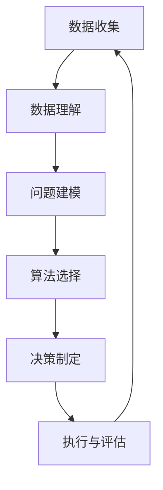
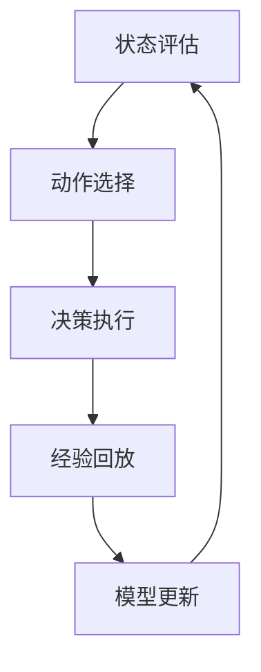

                 

### 利用思维链增强AI的问题解决和决策能力

在人工智能（AI）迅猛发展的今天，AI系统的能力已经跨越了传统计算机程序所能达到的界限。然而，尽管AI在处理大规模数据、识别模式、执行重复性任务方面表现出色，但在问题解决和决策制定方面仍面临诸多挑战。这不仅仅是因为AI算法的复杂性，还因为现实世界问题的多维度和不确定性。为了提升AI在这些方面的能力，我们需要引入一个强大的概念——思维链（Mind Chain）。本文将逐步解析思维链的概念、结构以及其在AI问题解决和决策能力提升中的关键作用。

### 关键词

- **思维链（Mind Chain）**
- **人工智能（AI）**
- **问题解决（Problem Solving）**
- **决策制定（Decision Making）**
- **认知过程（Cognitive Process）**
- **机器学习（Machine Learning）**
- **强化学习（Reinforcement Learning）**
- **自然语言处理（Natural Language Processing）**

### 摘要

本文旨在探讨如何通过构建和优化思维链来增强人工智能在问题解决和决策制定方面的能力。首先，我们将介绍思维链的基本概念，包括其结构、核心环节和各环节之间的互动关系。接着，我们将详细探讨AI在数据收集与理解、问题建模、算法选择、决策制定、执行与评估等环节中的应用。最后，我们将分析思维链在不同AI领域，如机器学习、自然语言处理和强化学习中的应用案例，并提出未来发展的挑战和方向。

## 第一部分: 思维链基础与AI应用

### 第1章: 思维链概述

#### 1.1 思维链的概念与重要性

思维链（Mind Chain）是一种模拟人类思维过程的抽象模型，它由一系列相互关联的认知处理步骤组成，每个步骤都是前一个步骤的延续和扩展。在人工智能领域，思维链被视为一种能够增强AI问题解决和决策能力的框架。

##### 1.1.1 思维链的定义

思维链是一种有序的认知处理链，它由数据收集、理解、问题建模、算法选择、决策制定和执行评估等环节组成。每个环节都是思维链中的一个节点，这些节点通过相互作用和反馈，形成了一个完整的认知过程。

##### 1.1.2 思维链在AI中的角色

思维链在AI中的应用主要体现在以下几个方面：

1. **问题解决**：通过思维链，AI系统能够对复杂问题进行建模和求解，从而提高问题解决的能力。
2. **决策制定**：思维链为AI系统提供了一种结构化的决策制定过程，使其能够做出更明智的决策。
3. **学习和适应**：思维链中的每个环节都可以根据反馈进行优化，从而使AI系统在学习和适应过程中变得更加高效。

##### 1.1.3 思维链与问题解决的关系

思维链与问题解决之间存在着密切的联系。首先，问题解决通常需要从数据中提取信息，这一过程与思维链中的数据收集和理解环节紧密相关。其次，问题解决通常需要建立模型，这一过程与思维链中的问题建模环节相对应。最后，问题解决需要执行和评估决策，这一过程与思维链中的决策制定和执行评估环节相吻合。

通过思维链，AI系统可以在问题解决过程中实现以下目标：

1. **提高效率**：思维链提供了一个有序的步骤，使AI系统能够高效地处理复杂问题。
2. **增强适应性**：思维链中的每个环节都可以根据反馈进行优化，从而使AI系统能够适应不断变化的环境。

### Mermaid 流程图

以下是一个简化的思维链流程图，展示了各环节之间的关系：



### 思维链核心概念

1. **数据收集与理解**：这是思维链的起点，AI系统需要从各种来源收集数据，并对数据进行预处理和理解，以便后续的处理。
2. **问题建模**：在理解数据的基础上，AI系统需要建立相应的问题模型，这是解决问题的基础。
3. **算法选择**：根据问题模型选择合适的算法，这是解决问题的核心步骤。
4. **决策制定**：基于算法分析结果，AI系统需要制定决策，这是解决问题的关键环节。
5. **执行与评估**：执行决策，并对决策的效果进行评估，以指导后续的调整。

这些环节相互关联，形成一个闭环，使AI系统在问题解决和决策制定过程中能够不断优化和改进。

### 背景介绍

在当今的信息化时代，数据无处不在，如何从海量数据中提取有价值的信息，已成为许多领域面临的重要挑战。人工智能作为数据分析的有力工具，在处理复杂数据分析和决策制定方面具有巨大潜力。然而，传统的AI方法往往局限于特定的问题和领域，缺乏泛化能力和灵活适应性。为了解决这一问题，我们需要引入思维链这一概念，通过构建一个结构化的认知过程，使AI系统具备更强的自主学习和问题解决能力。

### 核心概念与联系

在思维链中，每个环节都是相互依赖和相互作用的，形成一个有机的整体。以下是一个简化的Mermaid流程图，展示了各环节之间的关系：


在这个流程图中，数据收集是整个思维链的起点，通过对数据的收集和理解，我们可以建立问题模型。问题建模是核心环节，它决定了我们选择哪种算法来解决问题。算法选择直接影响决策制定的准确性和有效性。决策制定是将算法分析结果转化为具体行动的过程，执行与评估则是对决策效果进行检验和反馈，以指导后续的调整。

### 数据收集与理解

在思维链的起点，数据收集和理解是至关重要的。数据是AI系统运作的基础，而数据的收集和理解决定了后续问题的建模和算法选择的准确性。

#### 数据收集

数据收集是思维链的第一步，它包括从各种来源获取数据，如数据库、传感器、互联网等。在数据收集过程中，我们需要考虑以下问题：

1. **数据来源**：确定数据的来源，包括内部数据库、外部API、开源数据集等。
2. **数据类型**：确定数据的类型，如结构化数据、非结构化数据等。
3. **数据量**：评估数据的规模，确保收集到的数据足够用于后续分析。

#### 数据预处理

在收集到数据后，我们需要进行数据预处理。数据预处理包括以下步骤：

1. **清洗**：去除数据中的噪声和错误，如缺失值、异常值等。
2. **转换**：将数据转换为适合分析和建模的格式，如数值化、标准化等。
3. **归一化**：对数据进行归一化处理，使其具有相同的尺度，便于后续分析。

#### 数据理解

数据理解是思维链中的关键环节，它涉及到对数据的深入分析和理解。以下是数据理解的一些核心步骤：

1. **数据模式识别**：通过统计分析和可视化方法，识别数据中的模式和信息。
2. **特征提取**：从数据中提取具有代表性的特征，以便后续的建模和分析。
3. **数据可视化**：利用可视化工具，将数据以图形化的形式展示，便于理解和分析。

### 数据模式识别

数据模式识别是数据理解的重要组成部分。通过模式识别，我们可以从数据中发现潜在的规律和关联。以下是几种常用的数据模式识别方法：

1. **聚类分析**：通过将数据划分为不同的簇，识别出数据中的相似模式和群体。
2. **分类分析**：根据数据的特征，将数据分为不同的类别，以识别出不同的模式。
3. **关联规则分析**：通过识别数据中的关联规则，发现不同变量之间的相互关系。

### 数据可视化

数据可视化是将数据以图形化的形式展示，以便更好地理解和分析。以下是几种常用的数据可视化方法：

1. **柱状图**：用于展示不同类别的数据分布情况。
2. **折线图**：用于展示数据随时间的变化趋势。
3. **散点图**：用于展示两个变量之间的关系。

通过数据收集与理解，我们可以为后续的问题建模和算法选择提供可靠的数据支持。这一环节的成功与否直接影响到整个思维链的性能和效果。

### 问题建模与算法选择

在思维链中，问题建模和算法选择是关键环节，它们决定了AI系统解决问题和做出决策的能力。

#### 问题建模

问题建模是将现实世界中的问题转化为可以由AI系统处理的数学模型。以下是问题建模的一些核心步骤：

1. **问题描述**：明确问题的目标和约束条件，以确定建模的方向和范围。
2. **变量定义**：定义问题中的变量，包括输入变量、中间变量和输出变量。
3. **模型构建**：根据问题描述和变量定义，构建相应的数学模型。
4. **模型验证**：通过验证模型的有效性和准确性，确保其能够正确地描述问题。

#### 算法选择

在问题建模的基础上，我们需要选择合适的算法来解决问题。以下是算法选择的一些核心步骤：

1. **算法类型**：根据问题的特点，选择适合的算法类型，如监督学习、无监督学习、强化学习等。
2. **算法评估**：评估不同算法的性能，包括准确性、效率、稳定性等。
3. **算法选择策略**：根据评估结果，选择最优或次优的算法。

### 算法类型

算法类型取决于问题的特点。以下是几种常见的算法类型：

1. **监督学习**：通过已有数据训练模型，然后利用训练好的模型对新数据进行预测。
2. **无监督学习**：没有预先标记的数据，算法通过自身学习发现数据中的模式和结构。
3. **强化学习**：通过与环境的交互学习，不断优化行为策略，以达到最大化奖励的目标。

### 算法评估

算法评估是选择合适算法的关键步骤。以下是算法评估的一些核心指标：

1. **准确性**：模型预测的正确率，用于评估模型的性能。
2. **效率**：算法执行的时间，用于评估算法的效率。
3. **稳定性**：算法在不同数据集上的表现，用于评估算法的稳定性。

通过问题建模和算法选择，我们可以为AI系统提供有效的解决方案。这一环节的成功与否直接影响到整个思维链的性能和效果。

### 决策制定与执行评估

在思维链中，决策制定和执行评估是关键环节，它们决定了AI系统在实际应用中的效果和适应性。

#### 决策制定

决策制定是基于算法分析结果，制定具体的行动策略。以下是决策制定的一些核心步骤：

1. **决策框架**：根据问题的目标和约束条件，建立决策框架。
2. **决策模型**：利用算法分析结果，构建决策模型。
3. **决策支持系统**：设计决策支持系统，提供决策依据。

#### 决策框架

决策框架是决策制定的基础，它包括以下部分：

1. **决策目标**：明确决策的目标，如最大化利润、最小化成本等。
2. **决策因素**：列出影响决策的因素，如市场需求、资源限制等。
3. **决策策略**：定义决策的策略，如选择最优策略、次优策略等。

#### 决策模型

决策模型是基于算法分析结果构建的，它包括以下部分：

1. **决策变量**：定义决策中的变量，如资源分配、产品选择等。
2. **决策规则**：根据算法分析结果，制定决策规则，如优先选择高利润产品等。
3. **决策结果**：预测决策的结果，如利润最大化、成本最小化等。

#### 执行与评估

执行与评估是对决策效果的检验和反馈。以下是执行与评估的一些核心步骤：

1. **决策执行**：根据决策模型，执行具体的行动策略。
2. **效果评估**：评估决策执行的效果，如利润增长、成本降低等。
3. **反馈调整**：根据评估结果，对决策进行调整，以优化决策效果。

#### 评估指标

评估决策效果的关键指标包括：

1. **准确性**：决策结果的准确性，如预测的市场需求与实际需求的匹配度。
2. **效率**：决策执行的效率，如资源分配的优化程度。
3. **稳定性**：决策在不同情况下的稳定性，如环境变化对决策的影响。

通过决策制定和执行评估，AI系统可以在实际应用中不断优化和改进，提高其问题解决和决策能力。

## 第二部分: 思维链在AI问题解决与决策中的应用

### 第5章: 思维链在机器学习中的运用

机器学习是人工智能的核心领域之一，其基本原理是通过从数据中学习规律，实现对未知数据的预测和分类。思维链在机器学习中发挥了重要作用，它为机器学习过程提供了结构化的步骤，使问题解决和决策制定更加高效和准确。

#### 5.1 机器学习中的思维链模型

在机器学习中，思维链模型通常包括以下环节：

1. **数据收集与理解**：收集和预处理数据，识别数据中的模式和特征。
2. **问题建模**：根据数据的特点和问题的需求，建立适当的数学模型。
3. **算法选择**：选择合适的算法，如线性回归、决策树、神经网络等。
4. **模型训练**：使用训练数据对算法模型进行训练，优化模型参数。
5. **决策制定**：利用训练好的模型对新数据进行预测和分类。
6. **执行与评估**：执行决策，评估模型的效果，并根据反馈进行模型优化。

#### 5.2 数据收集与理解

数据收集与理解是机器学习的起点。在这一阶段，AI系统需要从多种来源收集数据，并进行预处理。数据预处理包括数据清洗、数据转换和数据归一化等步骤。数据理解则涉及到数据模式识别和特征提取。

**代码示例：数据预处理**

```python
import pandas as pd
from sklearn.model_selection import train_test_split
from sklearn.preprocessing import StandardScaler

# 读取数据
data = pd.read_csv('data.csv')

# 数据清洗
data.dropna(inplace=True)

# 数据转换
X = data.drop('target', axis=1)
y = data['target']

# 数据归一化
scaler = StandardScaler()
X_scaled = scaler.fit_transform(X)

# 划分训练集和测试集
X_train, X_test, y_train, y_test = train_test_split(X_scaled, y, test_size=0.2, random_state=42)
```

#### 5.3 问题建模与算法选择

在问题建模阶段，我们需要根据数据的特点和问题的需求，选择合适的数学模型。不同的算法适用于不同类型的问题，如线性回归适用于回归问题，决策树适用于分类问题，神经网络适用于复杂的多变量问题。

**代码示例：选择和训练模型**

```python
from sklearn.linear_model import LinearRegression
from sklearn.tree import DecisionTreeClassifier
from sklearn.neural_network import MLPClassifier

# 线性回归
regressor = LinearRegression()
regressor.fit(X_train, y_train)

# 决策树
classifier = DecisionTreeClassifier()
classifier.fit(X_train, y_train)

# 神经网络
mlp = MLPClassifier()
mlp.fit(X_train, y_train)
```

#### 5.4 模型训练与评估

模型训练是机器学习的重要环节，通过训练数据优化模型参数，使其能够更好地拟合数据。训练完成后，我们需要对模型进行评估，以确定其性能。

**代码示例：模型评估**

```python
from sklearn.metrics import mean_squared_error, accuracy_score

# 线性回归评估
y_pred = regressor.predict(X_test)
mse = mean_squared_error(y_test, y_pred)
print(f"Linear Regression MSE: {mse}")

# 决策树评估
y_pred = classifier.predict(X_test)
accuracy = accuracy_score(y_test, y_pred)
print(f"Decision Tree Accuracy: {accuracy}")

# 神经网络评估
y_pred = mlp.predict(X_test)
accuracy = accuracy_score(y_test, y_pred)
print(f"MLP Classifier Accuracy: {accuracy}")
```

#### 5.5 决策制定与执行评估

在模型训练和评估完成后，我们可以利用训练好的模型进行决策制定。决策制定后，需要执行决策并评估其效果，以指导后续的模型优化。

**代码示例：决策执行与效果评估**

```python
# 决策执行
action = mlp.predict([new_data])

# 决策评估
# 假设有一个评估指标 function_evaluation
evaluation_score = function_evaluation(action, true_label)
print(f"Action Evaluation Score: {evaluation_score}")
```

通过上述步骤，我们可以利用思维链在机器学习中实现高效的模型训练、预测和评估。

### 第6章: 思维链在自然语言处理中的应用

自然语言处理（NLP）是人工智能的一个重要分支，其目标是使计算机能够理解、生成和处理人类语言。思维链在NLP中起到了关键作用，通过结构化的步骤，使NLP任务更加高效和准确。

#### 6.1 思维链在NLP中的作用

思维链在NLP中的应用主要体现在以下环节：

1. **文本预处理**：对原始文本进行清洗、分词、标注等预处理操作，以提取有效信息。
2. **语义理解**：通过语言模型和语义分析技术，理解文本中的语义内容，提取关键信息。
3. **语言生成**：根据语义理解和语言生成模型，生成符合语法和语义规则的文本。

#### 6.2 文本预处理

文本预处理是NLP的基础步骤，它包括以下操作：

1. **文本清洗**：去除文本中的无关信息，如HTML标签、特殊字符等。
2. **分词**：将文本拆分成单词或词组，以便进行后续处理。
3. **词性标注**：对每个词进行词性标注，如名词、动词、形容词等。
4. **实体识别**：识别文本中的特定实体，如人名、地名、组织名等。

**代码示例：文本预处理**

```python
import nltk
from nltk.tokenize import word_tokenize
from nltk.corpus import stopwords
from nltk.stem import WordNetLemmatizer

# 下载必要资源
nltk.download('punkt')
nltk.download('stopwords')
nltk.download('wordnet')

# 文本清洗
text = "This is an example sentence."
text = text.lower()  # 转换为小写
text = re.sub(r'\W+', ' ', text)  # 去除特殊字符

# 分词
tokens = word_tokenize(text)

# 去除停用词
stop_words = set(stopwords.words('english'))
filtered_tokens = [token for token in tokens if token not in stop_words]

# 词性标注
pos_tags = nltk.pos_tag(filtered_tokens)

# 词干提取
lemmatizer = WordNetLemmatizer()
lemmatized_tokens = [lemmatizer.lemmatize(token) for token in filtered_tokens]
```

#### 6.3 语义理解

语义理解是NLP的核心任务，它涉及到对文本中词汇和句子的深层含义进行分析和理解。以下是一些常见的语义理解方法：

1. **词向量表示**：将词汇表示为高维向量，通过向量运算实现语义理解。
2. **依存句法分析**：分析词汇之间的依存关系，理解句子结构。
3. **语义角色标注**：识别词汇在句子中的语义角色，如主语、谓语、宾语等。
4. **语义相似度计算**：计算词汇之间的语义相似度，用于文本相似性分析。

**代码示例：语义理解**

```python
from gensim.models import Word2Vec
from sklearn.metrics.pairwise import cosine_similarity

# 训练词向量模型
model = Word2Vec([filtered_tokens], size=100, window=5, min_count=1, workers=4)
word_vectors = model.wv

# 计算词汇相似度
similarity = word_vectors.similarity('apple', 'banana')
print(f"Semantic similarity between 'apple' and 'banana': {similarity}")
```

#### 6.4 语言生成

语言生成是NLP的另一个重要任务，它涉及到根据语义信息生成符合语法和语义规则的文本。以下是一些常见的语言生成方法：

1. **基于规则的方法**：使用语法规则生成文本，如模板匹配、句法分析等。
2. **基于统计的方法**：使用统计方法生成文本，如n-gram模型、隐马尔可夫模型等。
3. **基于神经的方法**：使用神经网络生成文本，如循环神经网络（RNN）、长短期记忆网络（LSTM）等。

**代码示例：语言生成**

```python
from keras.models import Sequential
from keras.layers import LSTM, Dense, Embedding
from keras.preprocessing.sequence import pad_sequences

# 数据预处理
sequences = pad_sequences([filtered_tokens], maxlen=100)

# 构建LSTM模型
model = Sequential()
model.add(Embedding(input_dim=10000, output_dim=64, input_length=100))
model.add(LSTM(128))
model.add(Dense(1, activation='sigmoid'))

# 训练模型
model.compile(optimizer='adam', loss='binary_crossentropy', metrics=['accuracy'])
model.fit(sequences, filtered_tokens, epochs=10, batch_size=32)

# 语言生成
generated_text = model.predict(sequences)
print(f"Generated text: {generated_text}")
```

通过上述步骤，我们可以利用思维链在自然语言处理中实现文本预处理、语义理解和语言生成，从而提升NLP系统的性能和应用价值。

### 第7章: 思维链在强化学习中的应用

强化学习是一种通过不断与环境的交互来学习策略的人工智能方法。思维链在强化学习中发挥了重要作用，通过结构化的思维链模型，强化学习系统能够更高效地学习策略并做出决策。

#### 7.1 强化学习的基本概念

强化学习（Reinforcement Learning, RL）是一种通过奖励机制来指导学习的过程。其基本概念包括：

1. **代理（Agent）**：执行动作并接收环境反馈的实体。
2. **环境（Environment）**：代理行动所处的环境，提供状态信息和奖励。
3. **状态（State）**：代理在环境中的当前状况。
4. **动作（Action）**：代理能够执行的行为。
5. **奖励（Reward）**：代理执行动作后，从环境中获得的即时反馈。
6. **策略（Policy）**：代理根据状态选择动作的规则。
7. **价值函数（Value Function）**：预测长期奖励的函数。
8. **模型（Model）**：对环境的动态和奖励机制的抽象表示。

#### 7.2 思维链在强化学习中的机制

思维链在强化学习中的应用主要体现在以下环节：

1. **状态评估**：评估当前状态的价值，为动作选择提供依据。
2. **动作选择**：根据状态评估结果，选择最优或次优动作。
3. **决策执行**：执行选定的动作，并获取环境反馈。
4. **经验回放**：将经验存储在记忆中，用于后续的模型训练。
5. **模型更新**：根据经验回放和奖励信号，更新策略和模型参数。

#### 7.3 思维链在强化学习中的应用

以下是一个简化的思维链模型，展示了在强化学习中的应用：



在这个模型中，代理首先评估当前状态的价值，选择最优动作。执行动作后，代理接收环境反馈并存储经验。随后，代理使用这些经验来更新策略和模型参数，以优化未来的决策。

#### 7.4 强化学习策略评估与优化

在强化学习中，策略评估和优化是关键步骤。以下是一些常用的策略评估和优化方法：

1. **策略评估（Policy Evaluation）**：
   - **蒙特卡罗方法**：通过多次模拟来评估策略的预期奖励。
   - **动态规划（Dynamic Programming）**：使用逆向推理计算策略的价值函数。

2. **策略优化（Policy Optimization）**：
   - **策略梯度方法**：通过梯度上升法优化策略参数。
   - **策略迭代（Policy Iteration）**：交替进行策略评估和策略改进。

3. **强化学习算法**：
   - **Q学习（Q-Learning）**：通过更新Q值来优化策略。
   - **深度Q网络（Deep Q-Network, DQN）**：使用深度神经网络来近似Q值函数。
   - **策略梯度提升（Actor-Critic）**：结合策略优化和价值评估的算法。

**代码示例：Q学习**

```python
import numpy as np
import random

# 环境模拟
class Environment:
    def step(self, action):
        # 根据动作更新状态和奖励
        # ...
        return next_state, reward, done

# Q学习算法
class QLearning:
    def __init__(self, actions, learning_rate=0.1, discount_factor=0.9):
        self.q_values = np.zeros((actions, actions))
        self.learning_rate = learning_rate
        self.discount_factor = discount_factor

    def update(self, state, action, reward, next_state, done):
        if not done:
            target = reward + self.discount_factor * np.max(self.q_values[next_state])
        else:
            target = reward
        current_q_value = self.q_values[state, action]
        new_q_value = current_q_value + self.learning_rate * (target - current_q_value)
        self.q_values[state, action] = new_q_value

# 实例化Q学习对象
q_learning = QLearning(actions=3)

# 进行N次迭代
for episode in range(N):
    state = env.reset()
    done = False
    while not done:
        action = np.argmax(q_learning.q_values[state])
        next_state, reward, done = env.step(action)
        q_learning.update(state, action, reward, next_state, done)
        state = next_state
```

通过上述代码，我们可以实现一个简单的Q学习算法，用于强化学习中的策略评估和优化。在实际应用中，我们可以根据具体问题和环境，选择合适的强化学习算法和策略优化方法。

### 第8章: 思维链在现实场景中的应用

思维链作为一种结构化的认知框架，在现实场景中的应用越来越广泛。以下是一些现实场景中的思维链应用案例，以及它们在实际问题解决和决策制定中的效果和挑战。

#### 8.1 企业管理决策

在企业管理决策中，思维链可以帮助企业进行战略规划和资源配置。以下是一个简化的思维链模型，用于企业战略规划：

1. **数据收集**：收集市场数据、财务数据、客户反馈等。
2. **数据理解**：分析市场趋势、竞争状况、客户需求等。
3. **问题建模**：建立企业战略目标模型，如市场份额、利润增长等。
4. **算法选择**：选择合适的算法，如线性规划、决策树等。
5. **决策制定**：制定企业战略计划，如产品线调整、市场拓展等。
6. **执行与评估**：执行战略计划，并定期评估效果，进行反馈调整。

**案例**：某大型企业在思维链的指导下，通过数据分析和市场研究，确定了新的市场拓展策略。在实施过程中，企业定期评估市场反应和财务表现，根据评估结果对策略进行优化。通过这种方式，企业成功地扩大了市场份额，并实现了利润增长。

**挑战**：企业管理决策面临数据质量、算法选择和决策执行等方面的挑战。特别是在大数据环境下，如何有效地处理和分析海量数据，以及如何确保算法的公正性和透明性，是亟待解决的问题。

#### 8.2 金融市场分析

在金融市场分析中，思维链可以帮助投资者进行市场预测和投资决策。以下是一个简化的思维链模型，用于金融市场分析：

1. **数据收集**：收集历史价格数据、交易量数据、宏观经济数据等。
2. **数据理解**：分析市场趋势、价格波动、相关性等。
3. **问题建模**：建立市场预测模型，如时间序列分析、回归分析等。
4. **算法选择**：选择合适的算法，如ARIMA、LSTM等。
5. **决策制定**：制定投资策略，如买入、卖出、持有等。
6. **执行与评估**：执行投资策略，并定期评估效果，进行反馈调整。

**案例**：某投资者在思维链的指导下，通过时间序列分析和机器学习算法，成功预测了市场趋势，并制定了相应的投资策略。在实施过程中，投资者定期跟踪市场变化，根据评估结果调整投资策略。通过这种方式，投资者实现了稳定的投资回报。

**挑战**：金融市场分析面临数据波动、算法过拟合和决策执行等方面的挑战。特别是在快速变化的金融市场中，如何有效地预测市场走势，以及如何确保算法的稳定性和可靠性，是亟待解决的问题。

#### 8.3 医疗诊断与预测

在医疗诊断与预测中，思维链可以帮助医生进行疾病诊断和患者管理。以下是一个简化的思维链模型，用于医疗诊断：

1. **数据收集**：收集患者病史、实验室检查结果、医学影像等。
2. **数据理解**：分析患者特征、疾病模式、关联关系等。
3. **问题建模**：建立疾病诊断模型，如决策树、支持向量机等。
4. **算法选择**：选择合适的算法，如神经网络、深度学习等。
5. **决策制定**：制定诊断决策，如疾病分类、治疗方案等。
6. **执行与评估**：执行诊断决策，并定期评估效果，进行反馈调整。

**案例**：某医院在思维链的指导下，通过深度学习和大数据分析，成功开发了一套智能诊断系统。该系统可以对患者的病史和检查结果进行综合分析，提出准确的诊断建议。在实施过程中，医院定期评估诊断系统的效果，并根据评估结果进行优化。通过这种方式，医院提高了诊断准确性，减轻了医生的工作负担。

**挑战**：医疗诊断与预测面临数据隐私、算法透明性和医疗伦理等方面的挑战。特别是在涉及患者隐私和生命安全的情况下，如何确保算法的公正性和可靠性，是亟待解决的问题。

#### 8.4 教育与培训

在教育与培训中，思维链可以帮助教育者进行课程设计和学生评估。以下是一个简化的思维链模型，用于教育与培训：

1. **数据收集**：收集学生学习数据、课程反馈等。
2. **数据理解**：分析学生学习特点、课程效果等。
3. **问题建模**：建立教育评估模型，如学生评价模型、课程优化模型等。
4. **算法选择**：选择合适的算法，如聚类分析、回归分析等。
5. **决策制定**：制定课程设计决策，如课程调整、教学方法改进等。
6. **执行与评估**：执行课程设计决策，并定期评估效果，进行反馈调整。

**案例**：某教育机构在思维链的指导下，通过数据分析和学生反馈，成功优化了课程设计和教学方法。教育者可以根据学生的实际情况，制定个性化的学习计划，提高学生的学习效果。在实施过程中，教育机构定期评估课程效果，并根据评估结果进行调整。通过这种方式，教育机构提高了教育质量和学生满意度。

**挑战**：教育与培训面临课程设计、教学方法、学生反馈等方面的挑战。特别是在个性化教育环境中，如何有效地满足学生的需求，以及如何确保教学方法的创新性和有效性，是亟待解决的问题。

通过以上案例，我们可以看到思维链在现实场景中的应用具有广泛的前景。然而，在实际应用中，还需要克服数据质量、算法选择、决策执行等方面的挑战，以充分发挥思维链的潜力。

## 第三部分: 思维链的未来发展与挑战

### 第9章: 思维链的未来发展

随着人工智能技术的不断进步，思维链在未来有着广阔的发展空间。以下是一些思维链未来发展的方向：

#### 9.1 新一代思维链技术

1. **多模态思维链**：随着多模态数据的普及，思维链需要能够处理来自不同模态的数据，如文本、图像、音频等。多模态思维链可以更好地捕捉问题的多样性和复杂性。
   
2. **增强学习思维链**：结合增强学习（Reinforcement Learning）的思维方式，思维链可以实现更加智能的决策制定和问题解决。

3. **认知图谱思维链**：认知图谱是一种将知识组织成网络结构的模型，思维链可以结合认知图谱，实现更高效的语义理解和知识推理。

#### 9.2 思维链在深度学习中的应用

深度学习是人工智能领域的一个重要分支，思维链在未来有望与深度学习技术深度融合，实现以下应用：

1. **自监督学习思维链**：自监督学习是一种无需标签数据的学习方式，思维链可以结合自监督学习方法，实现更高效的数据收集和理解。

2. **元学习思维链**：元学习是一种学习如何学习的方法，思维链可以结合元学习方法，实现快速适应新任务的能力。

3. **深度强化学习思维链**：深度强化学习结合了深度学习和强化学习的优势，思维链可以结合深度强化学习方法，实现更复杂的决策制定和问题解决。

#### 9.3 跨学科思维链

思维链不仅仅局限于人工智能领域，还可以跨学科应用，实现以下创新：

1. **生物信息学思维链**：在生物信息学中，思维链可以用于基因组数据分析、蛋白质结构预测等。

2. **社会科学思维链**：在社会科学领域，思维链可以用于社会网络分析、政策评估等。

3. **认知科学与思维链**：结合认知科学的研究，思维链可以更好地模拟人类的认知过程，实现更加人性化的智能系统。

### 第10章: 思维链的挑战与应对

尽管思维链具有巨大的潜力，但在实际应用中仍然面临诸多挑战。以下是一些主要挑战及应对策略：

#### 10.1 数据隐私与安全

**挑战**：思维链在处理大量数据时，可能涉及用户隐私和数据安全。

**应对策略**：
1. **隐私保护技术**：使用差分隐私、同态加密等技术保护数据隐私。
2. **数据匿名化**：对敏感数据进行匿名化处理，降低隐私泄露风险。
3. **安全审计**：建立严格的数据安全审计机制，确保数据安全和合规性。

#### 10.2 算法透明性与公平性

**挑战**：算法的透明性和公平性是公众关注的焦点，特别是当算法用于决策制定时。

**应对策略**：
1. **算法解释性方法**：开发可解释的AI算法，使算法的决策过程更加透明。
2. **算法偏见检测与纠正**：建立算法偏见检测机制，及时发现和纠正算法偏见。
3. **公平性评估**：定期对算法的公平性进行评估，确保其符合社会伦理和法律要求。

#### 10.3 人工智能伦理问题

**挑战**：人工智能的广泛应用引发了一系列伦理问题，如算法责任、人类替代等。

**应对策略**：
1. **伦理与法律框架**：建立人工智能伦理和法律框架，规范人工智能的应用。
2. **伦理审查委员会**：设立独立的伦理审查委员会，对人工智能项目进行伦理评估。
3. **公众参与**：鼓励公众参与人工智能伦理讨论，确保算法的应用符合社会期望。

通过应对上述挑战，思维链可以在未来更好地服务于人类社会，实现更加智能和可持续的发展。

### 最佳实践 tips、小结、注意事项、拓展阅读

#### 最佳实践 tips

1. **数据质量是基础**：在构建思维链时，确保数据的质量和准确性至关重要。
2. **灵活调整算法**：根据问题的特点和需求，选择和调整合适的算法。
3. **持续迭代与优化**：思维链需要不断迭代和优化，以适应不断变化的环境。

#### 小结

思维链作为一种结构化的认知框架，在人工智能领域具有重要的应用价值。通过思维链，AI系统可以更好地处理复杂问题、做出明智决策，并不断优化自身性能。

#### 注意事项

1. **确保数据隐私和安全**：在数据处理和应用过程中，严格保护用户隐私和数据安全。
2. **算法的透明性和公平性**：开发可解释的AI算法，确保其透明性和公平性。
3. **遵循伦理和法律要求**：在使用人工智能时，遵守相关伦理和法律要求。

#### 拓展阅读

- 《深度学习》（Ian Goodfellow, Yoshua Bengio, Aaron Courville著）
- 《人工智能：一种现代的方法》（Stuart Russell, Peter Norvig著）
- 《数据科学入门：基于Python》（Joel Grus著）
- 《机器学习实战》（Peter Harrington著）

作者：AI天才研究院/AI Genius Institute & 禅与计算机程序设计艺术 /Zen And The Art of Computer Programming

