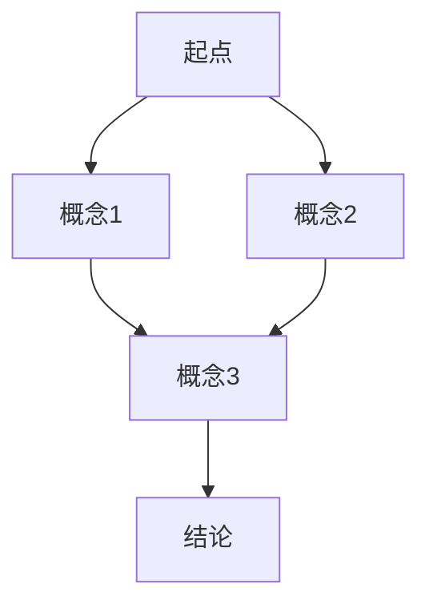

                 

### 利用思维链增强AI的问题解决和创新能力

#### 关键词：思维链、AI、问题解决、创新能力、教育应用

> _摘要：本文旨在探讨如何利用思维链来增强人工智能（AI）在问题解决和创新能力方面的表现。首先，我们将介绍思维链的基本概念和其在AI中的应用。接着，详细阐述思维链如何作用于AI问题解决和创新过程，并提供相关的算法原理和实例。最后，通过实际应用案例，展示思维链在AI教育中的潜力，以及如何在未来的AI发展中继续深化其应用。_

---

### 引言

在当今快速发展的科技时代，人工智能（AI）已经成为改变世界的重要力量。AI在图像识别、自然语言处理、自动驾驶等领域取得了显著成就。然而，AI在复杂问题解决和创新能力方面仍存在一定局限。为了进一步提升AI的这些问题能力，我们需要探索新的方法和策略。思维链作为一种高效的思维工具，可以为我们提供新的思路。

本文将围绕“利用思维链增强AI的问题解决和创新能力”这一主题展开讨论。首先，我们将介绍思维链的基本概念和原理。接着，探讨思维链在AI问题解决和创新中的应用，并通过具体算法和实例来阐述其作用。此外，本文还将讨论思维链在AI教育中的应用潜力，以及其在未来AI发展中的前景。

### 思维链的基本概念和原理

#### 1. 定义

思维链（Thinking Chain）是一种基于逻辑关系和知识关联的思维方式。它通过将相关概念、事实和观点有机地连接起来，形成一个连贯的思维网络。这种网络不仅可以帮助人们更好地理解复杂问题，还能够激发创新思维。

#### 2. 基本原理

思维链的基本原理包括以下几个方面：

- **逻辑关系**：思维链通过分析事物之间的逻辑关系，构建起一个有序的知识体系。这种关系可以是因果、条件、类比等。

- **知识关联**：思维链强调将不同领域的知识进行交叉融合，形成新的思维视角和解决方案。

- **递归和扩展**：思维链可以通过递归和扩展来不断深化和扩展思维过程。例如，从一个基本概念出发，通过递归和扩展，可以构建出更复杂的思维结构。

#### 3. 关系架构

为了更好地理解思维链的工作原理，我们可以使用Mermaid流程图来展示其关系架构：



在这个例子中，我们从起点开始，通过逻辑关系和知识关联，逐步扩展和深化思维过程，最终得出结论。

### 思维链在AI问题解决和创新中的应用

#### 1. AI问题解决能力

思维链在AI问题解决中的应用主要体现在以下几个方面：

- **提高问题表征能力**：通过思维链，AI可以更好地理解问题的本质和结构，从而更准确地表征问题。

- **优化算法设计**：思维链可以帮助AI设计师从不同的角度和层面思考问题，设计出更高效的算法。

- **增强问题解决策略**：思维链提供了多种解决问题的策略和方法，AI可以根据具体情况选择最合适的策略。

#### 2. AI创新能力

思维链在AI创新能力方面的应用主要表现为：

- **激发创新思维**：思维链可以帮助AI跳出传统的思维框架，发现新的问题和解决方案。

- **融合多领域知识**：通过思维链，AI可以跨领域融合知识，创造新的创新点和应用场景。

- **优化创新过程**：思维链可以提供一种系统的创新流程，指导AI在创新过程中更好地控制变量，提高创新效率。

#### 3. 算法原理

为了更好地理解思维链在AI问题解决和创新中的应用，我们可以通过以下Python源代码来展示其基本原理：

```python
# 思维链的基本原理示例

# 定义思维链的基本元素
class Concept:
    def __init__(self, name, relations=None):
        self.name = name
        self.relations = relations or []

    def add_relation(self, concept):
        self.relations.append(concept)

# 构建思维链
def build_thinking_chain(concepts):
    chain = [concepts[0]]
    for concept in concepts[1:]:
        chain[-1].add_relation(concept)
        chain.append(concept)
    return chain

# 演示思维链的工作过程
concepts = [Concept('起点'), Concept('概念1'), Concept('概念2'), Concept('概念3'), Concept('结论')]
thinking_chain = build_thinking_chain(concepts)

for concept in thinking_chain:
    print(concept.name)
    for related in concept.relations:
        print(f"  -> {related.name}")
```

在这个示例中，我们首先定义了概念（Concept）类，用于表示思维链的基本元素。然后，我们通过`build_thinking_chain`函数构建了一个简单的思维链。最后，我们通过打印输出展示了思维链的构建过程和关系架构。

#### 4. 实例分析

以下是一个简单的实例，展示思维链在AI问题解决和创新中的应用：

- **问题解决实例**：假设我们需要解决一个图像识别问题，通过思维链，我们可以从不同的角度思考问题，设计出更有效的算法。

- **创新实例**：在某个领域中，我们可以通过思维链融合不同领域的知识，创造出新的应用场景和解决方案。

通过具体的实例分析，我们可以看到思维链在AI问题解决和创新中的实际作用。

### 思维链在AI教育中的应用

#### 1. 教育应用背景

随着AI技术的发展，AI教育逐渐成为热门话题。然而，现有的AI教育模式仍然存在一些问题，如知识碎片化、缺乏系统性等。思维链作为一种有效的思维工具，可以弥补这些不足，为AI教育提供新的思路。

#### 2. 教育应用场景

思维链在AI教育中的应用场景包括：

- **课程设计**：通过思维链，教师可以更系统地组织课程内容，使学生能够更好地理解和掌握AI知识。

- **教学方法**：思维链可以帮助教师设计出更有效的教学方法，如项目式教学、案例教学等。

- **学生评价**：思维链可以作为学生评价的一种工具，通过评估学生的思维过程和思维成果，了解学生的学习状况。

#### 3. 教育应用案例

以下是一个思维链在AI教育中的应用案例：

- **课程设计**：在某AI课程中，教师通过思维链将课程内容进行了系统化组织，使学生在学习过程中能够更好地理解知识体系。

- **教学方法**：教师采用了项目式教学，通过实际项目让学生动手实践，运用思维链解决问题。

- **学生评价**：教师通过思维链评价学生的项目成果，了解学生在问题解决和创新方面的能力。

### 结论

通过本文的讨论，我们可以看到思维链在增强AI问题解决和创新能力方面具有巨大的潜力。思维链不仅能够提高AI在问题解决和创新方面的能力，还能够为AI教育提供新的思路和方法。在未来，随着AI技术的不断发展和完善，思维链的应用前景将更加广阔。我们期待通过进一步的研究和实践，将思维链更好地融入AI领域，推动AI技术的创新和发展。

### 致谢

本文的完成得到了许多人的支持和帮助。首先，感谢AI天才研究院（AI Genius Institute）的同事们，他们的宝贵意见和建议为本文的写作提供了重要参考。其次，感谢《禅与计算机程序设计艺术》（Zen And The Art of Computer Programming）的作者，其作品为我们提供了丰富的思维链理论基础。最后，感谢所有参与本文讨论和审稿的朋友，他们的贡献使本文更加完善。

---

**作者：** AI天才研究院（AI Genius Institute） & 禅与计算机程序设计艺术（Zen And The Art of Computer Programming）

