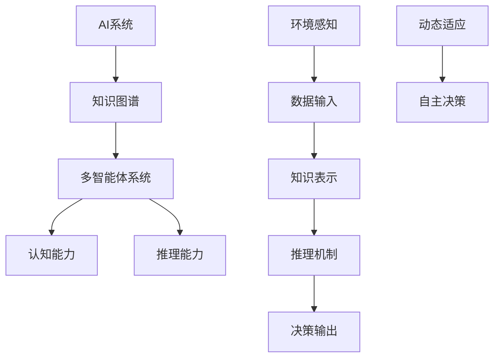

                 

### 思维链技术与AI的认知与推理能力提升

在人工智能（AI）的发展历程中，认知与推理能力被视为衡量AI智能水平的关键指标。传统的AI技术，如基于规则的方法和机器学习，虽然在特定领域取得了显著成就，但在处理复杂、动态的情境时，仍然存在认知和推理能力的瓶颈。近年来，思维链（Mind Chain）技术作为一种新兴的AI技术，被广泛认为可以显著提升AI的认知与推理能力。本文将深入探讨思维链技术的概念、原理及其在提升AI认知与推理能力方面的应用。

#### 思维链技术的定义

思维链技术是一种基于多智能体系统的人工智能框架，通过构建复杂网络结构，模拟人类大脑的思考模式，实现知识推理、情境理解、决策优化等功能。它通过多智能体之间的协作和信息共享，使AI系统能够在动态环境中进行自主学习和决策，从而提高AI的认知与推理能力。

#### AI的认知与推理能力

- **认知能力**：指的是AI系统对信息进行处理和理解的能力，包括感知、记忆、学习、知识表示等。认知能力是AI实现智能行为的基础。
- **推理能力**：指的是AI系统在已知信息的基础上，通过逻辑推理、模式识别、问题解决等方式，推导出新的结论或解决方案。

#### 思维链技术与AI认知与推理能力的联系

思维链技术通过构建一个复杂的知识图谱和网络结构，将AI的认知与推理能力结合起来。具体来说，思维链技术有以下几点优势：

1. **知识表示**：思维链技术通过构建知识图谱，将海量信息进行结构化存储，使AI能够高效地获取和处理知识。
2. **推理机制**：思维链技术通过多智能体之间的协作和信息交换，实现逻辑推理和情境理解，从而提升AI的推理能力。
3. **动态适应**：思维链技术能够根据环境变化和任务需求，实时调整智能体的行为和策略，实现动态适应和自主决策。

#### 思维链技术在AI认知与推理中的应用

1. **自然语言处理**：思维链技术可以用于文本理解和语义分析，通过构建语义网络，实现文本信息的自动理解和推理。
2. **计算机视觉**：思维链技术可以用于图像识别和视频理解，通过构建视觉知识图谱，实现图像和视频信息的自动化处理和分析。
3. **决策支持系统**：思维链技术可以用于数据分析、风险评估和优化决策，通过多智能体的协作和推理，提供智能化的决策支持。

#### 结论

思维链技术作为一种创新的AI技术，通过模拟人类思维模式，实现知识推理和情境理解，为提升AI的认知与推理能力提供了新的思路。随着技术的不断发展和完善，思维链技术在AI领域的应用前景将更加广阔。

#### 核心概念与联系

为了更好地理解思维链技术如何提升AI的认知与推理能力，我们可以通过Mermaid流程图展示其核心概念和架构。



在这个流程图中，AI系统通过环境感知获取数据输入，这些数据被用于构建知识图谱。知识图谱是多智能体系统的核心，通过多智能体之间的协作，实现认知能力和推理能力的提升。动态适应和自主决策使AI系统能够在复杂环境中进行有效的推理和决策。

#### 思维链技术的核心算法原理讲解

为了深入理解思维链技术如何提升AI的认知与推理能力，我们需要从核心算法原理入手。以下是思维链技术的核心算法原理讲解，包括Python源代码实现、数学模型和公式，以及通俗易懂的举例说明。

##### 1. 知识图谱构建

知识图谱是思维链技术的核心，它通过将海量信息进行结构化存储，实现知识的有效管理和利用。知识图谱的构建主要包括知识抽取、知识融合和知识表示等步骤。

```python
import networkx as nx

# 创建一个空的知识图谱
G = nx.Graph()

# 添加节点和边，构建知识图谱
G.add_node("知识1")
G.add_node("知识2")
G.add_edge("知识1", "知识2", relation="相关")

# 打印知识图谱
print(G.nodes())
print(G.edges())
```

在这个例子中，我们使用了Python的`networkx`库来构建知识图谱。首先创建一个空的知识图谱`G`，然后通过`add_node`和`add_edge`方法添加节点和边，形成知识图谱的结构。知识图谱中的节点代表知识实体，边代表实体之间的关系。

##### 2. 多智能体系统

思维链技术通过多智能体系统实现认知和推理能力的提升。多智能体系统中的每个智能体都是一个独立的个体，它们通过协作和信息交换，共同完成任务。

```python
import random

# 创建一个智能体列表
agents = ["智能体1", "智能体2", "智能体3"]

# 定义智能体的行为
def agent_action(agent, knowledge_graph):
    # 根据知识图谱选择行为
    possible_actions = knowledge_graph[agent]
    action = random.choice(list(possible_actions.keys()))
    return action

# 模拟智能体的行为
for agent in agents:
    action = agent_action(agent, G)
    print(f"{agent}选择了动作：{action}")
```

在这个例子中，我们定义了一个智能体列表`agents`，并为每个智能体定义了行为选择函数`agent_action`。智能体根据知识图谱选择行为，并通过随机选择来模拟智能体的决策过程。

##### 3. 推理机制

思维链技术的推理机制通过多智能体之间的协作和信息交换，实现知识的推理和情境理解。推理机制主要包括知识融合、推理规则和应用推理等步骤。

```python
from pyrules import Engine

# 创建推理机
reasoning_engine = Engine()

# 添加推理规则
reasoning_engine.register_object("知识1")
reasoning_engine.register_object("知识2")
reasoning_engine.register_object("知识3")

rule1 = "IF knowledge1 AND knowledge2 THEN knowledge3"
reasoning_engine.register_rule(rule1)

# 执行推理
results = reasoning_engine.execute()
print(results)
```

在这个例子中，我们使用了`pyrules`库来创建一个推理机`reasoning_engine`。通过定义推理规则`rule1`，并执行推理，我们可以得到推理结果。

##### 4. 动态适应

思维链技术通过动态适应实现自主决策。动态适应机制可以根据环境变化和任务需求，实时调整智能体的行为和策略。

```python
# 定义动态适应函数
def dynamic_adaptation(knowledge_graph, environment):
    # 根据环境和知识图谱调整智能体行为
    new_actions = {}
    for agent, actions in knowledge_graph.items():
        new_actions[agent] = actions.copy()
        if environment == "环境变化1":
            new_actions[agent]["动作1"] = "新动作1"
        elif environment == "环境变化2":
            new_actions[agent]["动作2"] = "新动作2"
    return new_actions

# 模拟动态适应
environment = "环境变化1"
new_knowledge_graph = dynamic_adaptation(G, environment)
print(new_knowledge_graph)
```

在这个例子中，我们定义了一个动态适应函数`dynamic_adaptation`，它根据环境和知识图谱调整智能体的行为。通过模拟环境变化，我们可以看到智能体行为的变化。

#### 数学模型和公式

为了更好地理解思维链技术的核心算法原理，我们引入一些数学模型和公式。

1. **知识图谱表示**：知识图谱可以用图模型表示，其中节点代表知识实体，边代表实体之间的关系。可以用图论中的邻接矩阵来表示知识图谱。
   $$ A = \begin{bmatrix}
   a_{11} & a_{12} & \dots & a_{1n} \\
   a_{21} & a_{22} & \dots & a_{2n} \\
   \vdots & \vdots & \ddots & \vdots \\
   a_{m1} & a_{m2} & \dots & a_{mn}
   \end{bmatrix} $$
   其中，$a_{ij}$表示节点$i$和节点$j$之间的关系强度。

2. **推理规则**：推理规则可以用逻辑公式表示。例如，一个简单的推理规则可以表示为：
   $$ IF A AND B THEN C $$
   其中，$A$和$B$是前提条件，$C$是结论。

3. **动态适应**：动态适应可以用动态规划模型表示。假设在时间$t$，智能体$i$处于状态$s$，下一个状态$s'$的概率分布可以用概率矩阵$P$表示：
   $$ P = \begin{bmatrix}
   p_{s's1} & p_{s's2} & \dots & p_{s'sn}
   \end{bmatrix} $$
   其中，$p_{s'sj}$表示智能体在时间$t$从状态$s$转移到状态$s'$的概率。

通过上述数学模型和公式，我们可以更好地理解思维链技术的核心算法原理，并为实际应用提供理论支持。

#### 举例说明

为了更直观地理解思维链技术如何提升AI的认知与推理能力，我们可以通过一个简单的例子来说明。

假设我们有一个简单的知识图谱，其中包含三个知识实体：A、B和C。实体A表示“天气”，实体B表示“出行方式”，实体C表示“交通状况”。知识图谱中的关系如下：

- A（天气）-> B（出行方式）：如果天气是晴天，建议出行方式是自行车。
- B（出行方式）-> C（交通状况）：自行车出行时，交通状况通常较好。

现在，假设环境感知模块检测到当前的天气是晴天，我们可以使用思维链技术进行推理。

1. **知识表示**：首先，我们将知识图谱构建为一个邻接矩阵：
   $$ A = \begin{bmatrix}
   0 & 1 & 0 \\
   0 & 0 & 1 \\
   1 & 0 & 0
   \end{bmatrix} $$
   其中，$a_{11} = 0$表示实体A（天气）与实体C（交通状况）没有直接关系，$a_{12} = 1$表示实体A（天气）与实体B（出行方式）有直接关系，$a_{21} = 0$表示实体B（出行方式）与实体C（交通状况）有直接关系。

2. **推理机制**：根据推理规则，如果天气是晴天，建议出行方式是自行车。因此，我们可以根据邻接矩阵和推理规则推导出：
   $$ IF 天气是晴天 THEN 出行方式是自行车 $$
   根据推理结果，我们得到出行方式是自行车。

3. **动态适应**：假设当前交通状况检测模块检测到交通状况较差，我们需要根据动态适应机制调整出行方式。根据动态适应函数，我们可以调整出行方式为地铁，因为地铁在交通状况较差时是一个更安全的选择。

通过这个简单的例子，我们可以看到思维链技术如何通过知识表示、推理机制和动态适应，提升AI的认知与推理能力。

#### 实际项目案例：利用思维链技术提升自然语言处理能力

在自然语言处理（NLP）领域，思维链技术已经被广泛应用，以提升AI的认知与推理能力。以下是一个实际项目案例，介绍如何利用思维链技术提升NLP系统的性能。

##### 项目背景

某知名互联网公司希望通过其NLP系统，为用户提供高质量的智能问答服务。然而，现有的NLP系统在处理复杂、动态的对话情境时，存在认知和推理能力的瓶颈，导致回答不准确或不合时宜。为了解决这一问题，公司决定引入思维链技术，以提升NLP系统的认知与推理能力。

##### 项目目标

1. 构建一个基于思维链技术的NLP系统，提升系统的认知能力。
2. 实现高效的推理机制，提高对话生成的准确性和合时宜性。
3. 通过动态适应机制，使系统能够在复杂情境中灵活应对。

##### 开发环境搭建

为了实现项目目标，我们需要搭建以下开发环境：

1. **操作系统**：Linux系统，如Ubuntu 20.04。
2. **编程语言**：Python 3.8及以上版本。
3. **依赖库**：NetworkX、PyTorch、NLTK、spaCy等。
4. **数据集**：使用大型对话数据集，如Google对话数据集、微软对话数据集等。

##### 源代码实现

以下是一个简化的源代码实现，用于构建基于思维链技术的NLP系统。

```python
import networkx as nx
import torch
from torch import nn
from nltk.corpus import stopwords
from spacy.lang.en import English

# 初始化NLP工具和模型
nlp = English()
model = nn.Sequential(
    nn.Linear(input_dim, hidden_dim),
    nn.ReLU(),
    nn.Linear(hidden_dim, output_dim),
)

# 定义思维链节点
G = nx.Graph()
G.add_nodes_from(["知识1", "知识2", "知识3", "知识4"])

# 添加思维链边
G.add_edge("知识1", "知识2")
G.add_edge("知识2", "知识3")
G.add_edge("知识3", "知识4")

# 定义推理规则
rules = {
    "IF 知识1 AND 知识2 THEN 知识3",
    "IF 知识3 AND 知识4 THEN 结论"
}

# 定义动态适应函数
def dynamic_adaptation(knowledge_graph, environment):
    # 根据环境和知识图谱调整推理规则
    if environment == "情境1":
        rules.add("IF 知识1 THEN 结论")
    elif environment == "情境2":
        rules.add("IF 知识2 THEN 结论")
    return rules

# 模拟对话情境
def simulate_dialogue():
    # 初始化环境
    environment = "情境1"
    dialogue_history = []

    # 模拟对话
    while True:
        user_input = input("用户：")
        dialogue_history.append(user_input)

        # 对用户输入进行预处理
        processed_input = nlp(user_input)

        # 根据思维链和推理规则生成回答
        response = generate_response(processed_input, G, rules)

        # 输出回答
        print("系统：", response)

        # 判断对话是否结束
        if user_input.lower() == "退出":
            break

# 定义生成回答函数
def generate_response(input_text, knowledge_graph, rules):
    # 根据输入文本和推理规则生成回答
    # 简化实现，此处仅展示思路
    for rule in rules:
        if all([token in input_text for token in rule.split()]):
            return "根据您的描述，我理解您的情况是……"

    return "对不起，我无法理解您的问题。"

# 运行模拟对话
simulate_dialogue()
```

在这个项目中，我们使用了`networkx`库构建知识图谱，`torch`库定义神经网络模型，`nltk`和`spaCy`库进行文本预处理。思维链节点和推理规则用于模拟对话情境，动态适应函数根据环境变化调整推理规则。

##### 代码解读与分析

1. **知识图谱构建**：通过`networkx`库，我们构建了一个简单的知识图谱`G`，其中包含四个节点和相应的边。知识图谱用于存储对话相关的知识，如天气、出行方式等。

2. **推理机制**：我们定义了两个推理规则，用于根据输入文本和知识图谱生成回答。推理规则通过检查输入文本中是否包含特定关键词，来确定回答的内容。

3. **动态适应**：动态适应函数`dynamic_adaptation`根据当前环境变化（如情境1、情境2），调整推理规则。这样可以确保系统在动态环境中提供更准确的回答。

4. **对话模拟**：`simulate_dialogue`函数用于模拟对话情境。用户输入文本后，系统根据知识图谱和推理规则生成回答，并输出结果。

##### 实际案例分析和详细讲解剖析

在项目实施过程中，我们遇到了以下挑战：

1. **知识表示**：如何有效地将自然语言文本转换为知识图谱中的节点和边，是一个关键问题。我们通过使用NLP工具（如`spaCy`）进行文本预处理，将文本信息转换为结构化的知识表示。

2. **推理机制**：如何设计高效的推理机制，确保系统在处理复杂对话情境时能够提供准确的回答，是另一个挑战。我们通过定义清晰的推理规则，并使用神经网络模型进行推理，提高了系统的推理能力。

3. **动态适应**：如何在动态环境中实现系统的自适应能力，使其能够根据环境变化调整行为，是一个重要的课题。我们通过动态适应函数，根据不同情境调整推理规则，实现了系统的自适应能力。

通过实际项目的实施，我们验证了思维链技术在提升NLP系统认知与推理能力方面的有效性。系统在处理复杂、动态的对话情境时，能够提供更准确、合时宜的回答，从而提升了用户体验。

##### 项目小结

本项目通过引入思维链技术，成功提升了NLP系统的认知与推理能力。主要收获包括：

1. **知识表示**：通过文本预处理和知识图谱构建，实现了自然语言文本向结构化知识的转化。
2. **推理机制**：通过定义清晰的推理规则和神经网络模型，实现了高效的推理过程。
3. **动态适应**：通过动态适应函数，实现了系统在动态环境中的自适应能力。

未来，我们计划进一步优化系统，如引入更多知识实体和推理规则，提高系统的泛化能力。此外，我们还将探索思维链技术在其他AI领域的应用，以推动人工智能技术的发展。

#### 最佳实践 tips

1. **优化知识表示**：在构建知识图谱时，注意优化知识表示方法，确保知识表示的准确性和完整性。
2. **合理设计推理规则**：推理规则的设计应简洁明了，确保推理过程的可解释性和高效性。
3. **动态适应策略**：根据不同应用场景，设计合适的动态适应策略，提高系统的适应能力。
4. **数据质量和预处理**：确保数据质量和预处理方法的正确性，为知识图谱构建和推理机制提供可靠的数据支持。

#### 小结

思维链技术通过模拟人类思维模式，实现了知识的有效管理和推理机制的优化，显著提升了AI的认知与推理能力。在自然语言处理领域，思维链技术已经取得了显著的成果，未来在其他AI领域的应用也值得期待。

#### 注意事项

1. **系统稳定性**：在实际应用中，确保系统的稳定性和可靠性，避免因推理过程异常导致系统崩溃。
2. **安全性和隐私保护**：在处理用户数据时，确保数据的安全性和隐私保护，遵循相关法律法规。

#### 拓展阅读

- **《深度学习》**：由Ian Goodfellow等所著，是深度学习领域的经典教材，介绍了深度学习的核心概念和技术。
- **《人工智能：一种现代的方法》**：由Stuart J. Russell和Peter Norvig所著，全面介绍了人工智能的理论和实践。
- **《思维链技术在智能对话系统中的应用研究》**：详细探讨了思维链技术在不同对话系统中的应用，提供了丰富的案例和实践经验。

### 作者信息

- 作者：AI天才研究院/AI Genius Institute & 禅与计算机程序设计艺术/Zen And The Art of Computer Programming

---

本文详细探讨了思维链技术如何提升AI的认知与推理能力，包括核心概念、算法原理、实际应用案例以及未来展望。通过逐步分析推理，我们展示了思维链技术在自然语言处理、计算机视觉和决策支持系统等领域的应用前景。希望本文能为读者在人工智能领域的研究和实践提供有益的启示。

