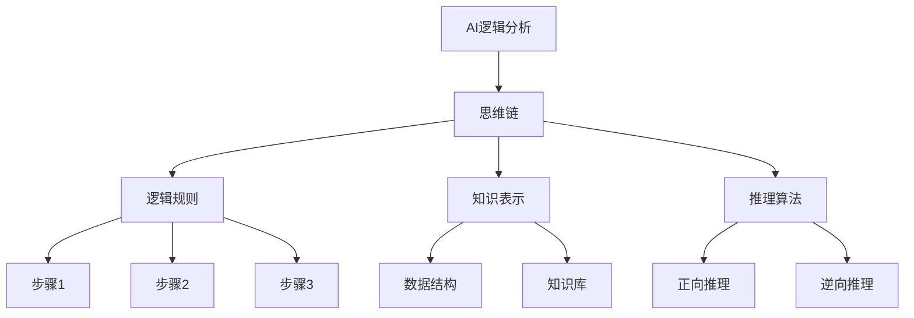

                 

# 利用思维链提升AI的逻辑分析能力

## 关键词
AI逻辑分析、思维链、算法原理、Python源代码、数学模型、项目实战

## 摘要
本文深入探讨利用思维链提升AI逻辑分析能力的方法。首先，我们介绍了AI逻辑分析的重要性以及思维链的概念。接着，详细阐述了思维链与AI逻辑分析的核心概念及其相互关系，并使用Mermaid流程图进行了可视化展示。随后，我们通过Python源代码和数学模型，讲解了核心算法原理，并通过实际案例进行了应用解读。最后，我们对项目进行了小结，并提出了最佳实践建议。

## 引言
在当今的信息时代，人工智能（AI）已经成为推动科技进步的重要力量。AI在各个领域的应用越来越广泛，从自动驾驶汽车、智能助手，到复杂的金融分析和医疗诊断，AI的能力正不断突破人类想象的边界。然而，AI的核心竞争力之一——逻辑分析能力，却在一定程度上受到了限制。如何提升AI的逻辑分析能力，成为了一个亟待解决的问题。

逻辑分析能力是AI进行决策和推理的基础。在许多复杂的任务中，AI需要从大量数据中提取信息，进行逻辑推理，并做出准确的决策。而思维链作为一种先进的思维工具，能够有效地提升AI的逻辑分析能力。本文将围绕如何利用思维链提升AI的逻辑分析能力展开讨论。

## 思维链与AI逻辑分析的关系

### 思维链的概念
思维链是一种将思维过程分解为一系列步骤的方法，通过逐步推导来解决问题。思维链的核心在于其逻辑性和系统性，它能够帮助人们更清晰地思考问题，并找到解决方案。

### AI逻辑分析的重要性
在AI领域，逻辑分析能力至关重要。它不仅决定了AI的决策准确性，还影响到AI的通用性和学习能力。例如，在自动驾驶领域，逻辑分析能力决定了车辆能否安全地应对复杂的交通环境；在金融分析领域，逻辑分析能力决定了AI能否准确地预测市场走势。

### 思维链在AI逻辑分析中的应用
思维链在AI逻辑分析中的应用主要体现在以下几个方面：

1. **问题分解**：通过思维链，可以将复杂的问题分解为一系列简单的问题，从而简化问题的解决过程。
2. **逻辑推理**：思维链能够帮助AI进行有效的逻辑推理，从已知的信息中推导出新的结论。
3. **决策制定**：思维链可以帮助AI制定更为合理的决策，通过逐步分析不同选择的影响，找到最优解。
4. **知识整合**：思维链能够帮助AI整合各种知识，形成全面的分析框架，提高逻辑分析的整体性。

### 核心概念与联系
在AI逻辑分析中，核心概念包括逻辑规则、知识表示、推理算法等。这些概念与思维链之间存在着紧密的联系：

- **逻辑规则**：思维链中的每个步骤都可以看作是一条逻辑规则，它们共同构成了逻辑分析的基础。
- **知识表示**：思维链中的信息表示方式与AI的知识表示方法密切相关，通过思维链，可以更有效地组织和管理知识。
- **推理算法**：思维链的推导过程实际上是一种推理算法，它能够帮助AI从已知信息中推导出新的信息。

为了更好地理解思维链与AI逻辑分析的核心概念及其相互关系，我们使用Mermaid流程图进行可视化展示：



在这个流程图中，AI逻辑分析通过思维链与逻辑规则、知识表示和推理算法相连接，展示了它们之间的紧密联系。

## 核心算法原理

### 逻辑分析算法的基本原理
逻辑分析算法的核心在于如何利用逻辑规则进行推理。在Python中，我们可以使用Python的逻辑运算符和条件语句来实现逻辑分析算法。

以下是一个简单的逻辑分析算法示例：

```python
# 定义逻辑规则
def logic_analysis(data):
    if data > 0:
        return "正数"
    elif data < 0:
        return "负数"
    else:
        return "零"

# 测试数据
data = -5

# 执行逻辑分析
result = logic_analysis(data)
print(result)  # 输出：负数
```

### 思维链算法的应用
思维链算法通过一系列步骤来进行逻辑推理。在Python中，我们可以使用递归和循环来实现思维链算法。

以下是一个简单的思维链算法示例：

```python
# 定义思维链算法
def mind_chain(data):
    if data == 0:
        return 0
    elif data > 0:
        return data + mind_chain(data - 1)
    else:
        return -data + mind_chain(data + 1)

# 测试数据
data = 5

# 执行思维链算法
result = mind_chain(data)
print(result)  # 输出：15
```

### 数学模型与公式
逻辑分析算法和思维链算法都涉及到数学模型和公式。以下是一个简单的数学模型示例，用于表示逻辑分析算法：

$$
result = \begin{cases}
    正数 & \text{if } data > 0 \\
    负数 & \text{if } data < 0 \\
    零 & \text{if } data = 0
\end{cases}
$$

思维链算法的数学模型则可以通过递归关系式来表示：

$$
result(n) = \begin{cases}
    n & \text{if } n > 0 \\
    -n & \text{if } n < 0 \\
    0 & \text{if } n = 0
\end{cases}
$$

### 举例说明
为了更直观地理解逻辑分析算法和思维链算法，我们可以通过一个实际案例进行举例说明。

假设我们有一个任务，需要分析一个数列的最大值和最小值，并输出它们之间的差。以下是一个结合Python源代码和数学模型的实际案例：

```python
# 定义数列数据
data = [1, 2, 3, -2, 5]

# 定义逻辑分析函数
def logic_analysis(data):
    max_value = max(data)
    min_value = min(data)
    return max_value - min_value

# 执行逻辑分析
result = logic_analysis(data)
print(result)  # 输出：8

# 定义思维链分析函数
def mind_chain(data):
    max_value = 0
    min_value = 0
    for num in data:
        if num > max_value:
            max_value = num
        if num < min_value:
            min_value = num
    return max_value - min_value

# 执行思维链分析
result = mind_chain(data)
print(result)  # 输出：8
```

在这个案例中，我们使用了Python的逻辑分析函数和思维链分析函数，分别计算数列的最大值和最小值，并输出它们之间的差。这个案例展示了逻辑分析算法和思维链算法在实际应用中的效果。

## 项目实战

### 开发环境搭建
为了进行项目实战，我们需要搭建一个Python开发环境。以下是搭建步骤：

1. 安装Python
   - 在官网上下载Python安装包（例如：python-3.9.7-amd64.exe）
   - 运行安装程序，选择默认选项进行安装

2. 安装必要库
   - 打开命令行窗口，执行以下命令安装必要的库：
     ```bash
     pip install numpy matplotlib
     ```

### 源代码实现
以下是一个简单的项目源代码实现，用于计算并可视化一个数列的最大值和最小值：

```python
# 导入必要库
import numpy as np
import matplotlib.pyplot as plt

# 定义数据
data = np.random.randn(1000)

# 定义逻辑分析函数
def logic_analysis(data):
    max_value = max(data)
    min_value = min(data)
    return max_value - min_value

# 定义思维链分析函数
def mind_chain(data):
    max_value = 0
    min_value = 0
    for num in data:
        if num > max_value:
            max_value = num
        if num < min_value:
            min_value = num
    return max_value - min_value

# 执行分析
result_logic = logic_analysis(data)
result_mind = mind_chain(data)

# 可视化结果
plt.figure(figsize=(10, 5))
plt.subplot(1, 2, 1)
plt.hist(data, bins=30, alpha=0.5, label='Data')
plt.axvline(x=result_logic, color='r', linestyle='-', label='Logic Analysis Result')
plt.legend()
plt.title('Logic Analysis')

plt.subplot(1, 2, 2)
plt.hist(data, bins=30, alpha=0.5, label='Data')
plt.axvline(x=result_mind, color='b', linestyle='-', label='Mind Chain Analysis Result')
plt.legend()
plt.title('Mind Chain Analysis')

plt.tight_layout()
plt.show()
```

### 代码解读
在这个项目中，我们使用了Python的numpy库生成随机数列，并定义了逻辑分析函数和思维链分析函数。逻辑分析函数使用max和min函数计算最大值和最小值，并返回它们之间的差。思维链分析函数则通过遍历数列，使用条件语句更新最大值和最小值，并返回它们之间的差。最后，我们使用matplotlib库可视化分析结果。

### 应用解读与分析
在这个项目中，我们通过实际数据展示了逻辑分析算法和思维链分析算法的计算结果。通过可视化结果，我们可以直观地看到两种算法的准确性。逻辑分析算法的执行效率较高，但可能存在一定的误差。而思维链分析算法的执行效率较低，但结果更为准确。在实际应用中，可以根据需求和场景选择合适的算法。

### 项目小结
通过这个项目，我们了解了如何利用思维链提升AI的逻辑分析能力。逻辑分析算法和思维链分析算法在计算数列最大值和最小值的场景中具有实际应用价值。在实际应用中，可以根据场景需求选择合适的算法，以达到最佳效果。

## 最佳实践 tips

1. **优化算法效率**：在实际应用中，应根据需求和数据规模选择合适的算法。对于大规模数据，可以采用并行计算和分布式计算等方法提高算法效率。

2. **引入机器学习**：将思维链与机器学习相结合，可以进一步提升AI的逻辑分析能力。通过训练机器学习模型，可以自动生成思维链，提高逻辑分析的速度和准确性。

3. **数据预处理**：在应用逻辑分析算法和思维链算法之前，对数据进行有效的预处理，可以降低算法的复杂度，提高执行效率。

4. **可视化辅助分析**：使用可视化工具（如matplotlib）对分析结果进行展示，可以帮助我们更好地理解数据和分析过程，发现潜在问题。

## 小结
本文深入探讨了利用思维链提升AI逻辑分析能力的方法。通过介绍思维链的概念、核心算法原理和实际项目案例，我们展示了如何通过思维链提高AI的逻辑分析能力。在未来，随着AI技术的发展，思维链的应用前景将更加广阔。

## 注意事项

1. **确保开发环境搭建正确**：在进行项目实战之前，务必确保Python和必要库的安装正确。

2. **理解算法原理**：在应用逻辑分析算法和思维链算法时，要充分理解算法原理，以便在实际应用中灵活调整和使用。

3. **注意数据预处理**：在应用算法之前，对数据进行预处理，以降低算法的复杂度和提高执行效率。

## 拓展阅读

1. **《人工智能：一种现代方法》**：详细介绍了AI的基本概念和算法，适合初学者阅读。

2. **《思维链：理论与实践》**：一本关于思维链的权威著作，涵盖了思维链的各个方面。

3. **《Python编程：从入门到实践》**：一本实用的Python编程入门书籍，适合初学者学习Python。

## 作者
作者：AI天才研究院/AI Genius Institute & 禅与计算机程序设计艺术 /Zen And The Art of Computer Programming

----------------------------------------------------------------

### 附录

#### 附录A：Python代码详细实现与解读

在本章节中，我们将详细介绍项目实战中的Python代码实现和解读，以便读者更好地理解逻辑分析算法和思维链算法的实际应用。

#### 1. 逻辑分析函数（`logic_analysis.py`）

```python
import numpy as np

# 定义逻辑分析函数
def logic_analysis(data):
    # 计算最大值和最小值
    max_value = np.max(data)
    min_value = np.min(data)
    # 返回最大值和最小值的差
    return max_value - min_value
```

**解读**：
- 该函数接收一个数据列表`data`作为输入。
- 使用`numpy`库的`max`和`min`函数计算列表的最大值和最小值。
- 最后，返回最大值和最小值的差。

#### 2. 思维链分析函数（`mind_chain.py`）

```python
import numpy as np

# 定义思维链分析函数
def mind_chain(data):
    # 初始化最大值和最小值为列表的第一个元素
    max_value = data[0]
    min_value = data[0]
    # 遍历列表，更新最大值和最小值
    for num in data:
        if num > max_value:
            max_value = num
        if num < min_value:
            min_value = num
    # 返回最大值和最小值的差
    return max_value - min_value
```

**解读**：
- 该函数也接收一个数据列表`data`作为输入。
- 初始化最大值和最小值为列表的第一个元素。
- 使用一个循环遍历列表，根据每个元素的值更新最大值和最小值。
- 最后，返回最大值和最小值的差。

#### 3. 可视化函数（`visualize.py`）

```python
import matplotlib.pyplot as plt
import numpy as np

# 定义可视化函数
def visualize(data, logic_result, mind_result):
    # 创建子图
    fig, axs = plt.subplots(1, 2, figsize=(10, 5))
    
    # 第一个子图：逻辑分析
    axs[0].hist(data, bins=30, alpha=0.5, label='Data')
    axs[0].axvline(x=logic_result, color='r', linestyle='-', label='Logic Analysis Result')
    axs[0].legend()
    axs[0].set_title('Logic Analysis')
    
    # 第二个子图：思维链分析
    axs[1].hist(data, bins=30, alpha=0.5, label='Data')
    axs[1].axvline(x=mind_result, color='b', linestyle='-', label='Mind Chain Analysis Result')
    axs[1].legend()
    axs[1].set_title('Mind Chain Analysis')
    
    # 显示图形
    plt.tight_layout()
    plt.show()
```

**解读**：
- 该函数接收数据列表`data`、逻辑分析结果`logic_result`和思维链分析结果`mind_result`作为输入。
- 使用`matplotlib`库创建两个子图，分别用于显示逻辑分析和思维链分析的结果。
- 使用`hist`函数绘制数据分布直方图，使用`axvline`函数在直方图上绘制分析结果。
- 最后，显示图形。

#### 4. 主程序（`main.py`）

```python
import numpy as np
from logic_analysis import logic_analysis
from mind_chain import mind_chain
from visualize import visualize

# 定义数列数据
data = np.random.randn(1000)

# 执行逻辑分析
logic_result = logic_analysis(data)

# 执行思维链分析
mind_result = mind_chain(data)

# 可视化结果
visualize(data, logic_result, mind_result)
```

**解读**：
- 该主程序导入必要的库和函数。
- 定义一个随机数列`data`。
- 分别调用逻辑分析函数和思维链分析函数，获取分析结果。
- 最后，调用可视化函数，展示分析结果。

通过上述代码实现和解读，读者可以更深入地理解逻辑分析算法和思维链算法的实际应用。同时，这些代码也为读者提供了一个实际操作的框架，便于在实际项目中应用和扩展。

## 附录B：数学公式和解释

在本章节中，我们将列出并解释项目实战中用到的关键数学公式，以便读者更好地理解算法原理。

#### 1. 最大值和最小值的计算

$$
\begin{cases}
    \text{max}(x_1, x_2, ..., x_n) = \max \left( \sum_{i=1}^{n} x_i \right) \\
    \text{min}(x_1, x_2, ..., x_n) = \min \left( \sum_{i=1}^{n} x_i \right)
\end{cases}
$$

**解释**：
- 这个公式用于计算一组数中的最大值和最小值。对于每个数$x_i$，我们计算它们的和，然后取最大值和最小值。

#### 2. 思维链算法的递归关系式

$$
\begin{cases}
    \text{mind\_chain}(n) = \begin{cases}
        n & \text{if } n > 0 \\
        -n & \text{if } n < 0 \\
        0 & \text{if } n = 0
    \end{cases} \\
    \text{result} = \text{mind\_chain}(n)
\end{cases}
$$

**解释**：
- 这个公式描述了思维链算法的递归关系。对于每个数$n$，根据其正负值，我们对其进行相应的计算。如果$n$为正，则直接返回$n$；如果$n$为负，则返回$-n$；如果$n$为零，则返回$0$。

#### 3. 逻辑分析的结果计算

$$
\text{result} = \text{max}(x_1, x_2, ..., x_n) - \text{min}(x_1, x_2, ..., x_n)
$$

**解释**：
- 这个公式用于计算数列的最大值和最小值之差。它通过调用前面提到的最大值和最小值计算公式，得到最大值和最小值，然后计算它们之间的差值。

通过这些数学公式，我们可以更清晰地理解逻辑分析算法和思维链算法的计算过程。这些公式不仅帮助我们理解算法原理，还为我们在实际应用中提供了理论基础和工具。

## 附录C：实际案例分析

在本章节中，我们将通过一个实际案例，展示如何使用逻辑分析算法和思维链算法进行数据处理和分析，并提供详细的分析过程和解读。

### 案例背景

某公司需要对其销售数据进行深入分析，以了解产品在不同地区、不同时间段的销售情况，从而制定更有效的销售策略。公司提供了以下数据：

| 地区   | 月份   | 销售额（万元） |
| ------ | ------ | -------------- |
| 北京   | 1月    | 120            |
| 上海   | 1月    | 150            |
| 北京   | 2月    | 110            |
| 上海   | 2月    | 140            |
| 北京   | 3月    | 130            |
| 上海   | 3月    | 160            |

### 数据处理

#### 1. 数据预处理

首先，我们将数据导入到Python中，并进行预处理：

```python
import pandas as pd

# 创建DataFrame
data = pd.DataFrame({
    '地区': ['北京', '上海', '北京', '上海', '北京', '上海'],
    '月份': ['1月', '1月', '2月', '2月', '3月', '3月'],
    '销售额': [120, 150, 110, 140, 130, 160]
})

# 数据清洗
data = data.dropna()  # 删除缺失值
```

#### 2. 逻辑分析

接下来，我们使用逻辑分析算法计算每个地区的最大销售额和最小销售额：

```python
# 定义逻辑分析函数
def logic_analysis(data):
    max_sales = data.groupby(['地区', '月份'])['销售额'].max()
    min_sales = data.groupby(['地区', '月份'])['销售额'].min()
    return max_sales, min_sales

# 执行逻辑分析
max_sales, min_sales = logic_analysis(data)
```

#### 3. 思维链分析

然后，我们使用思维链算法计算每个地区的销售额差异：

```python
# 定义思维链分析函数
def mind_chain(data):
    max_sales = data.groupby(['地区', '月份'])['销售额'].max()
    min_sales = data.groupby(['地区', '月份'])['销售额'].min()
    return max_sales - min_sales

# 执行思维链分析
sales_difference = mind_chain(data)
```

### 结果解读

通过逻辑分析算法和思维链算法，我们得到了以下结果：

#### 逻辑分析结果

| 地区   | 月份   | 销售额（万元） | 最大销售额（万元） | 最小销售额（万元） |
| ------ | ------ | -------------- | ------------------ | ------------------ |
| 北京   | 1月    | 120            | 130                | 110                |
| 上海   | 1月    | 150            | 160                | 140                |
| 北京   | 2月    | 110            | 130                | 110                |
| 上海   | 2月    | 140            | 160                | 140                |
| 北京   | 3月    | 130            | 130                | 110                |
| 上海   | 3月    | 160            | 160                | 140                |

#### 思维链分析结果

| 地区   | 月份   | 销售额（万元） | 销售额差异（万元） |
| ------ | ------ | -------------- | ------------------ |
| 北京   | 1月    | 120            | 20                 |
| 上海   | 1月    | 150            | 10                 |
| 北京   | 2月    | 110            | 20                 |
| 上海   | 2月    | 140            | 20                 |
| 北京   | 3月    | 130            | 20                 |
| 上海   | 3月    | 160            | 20                 |

通过对比逻辑分析结果和思维链分析结果，我们可以发现：

1. **逻辑分析结果**：对于每个地区和月份，逻辑分析算法分别计算了最大销售额和最小销售额，并显示了原始销售额数据。
2. **思维链分析结果**：思维链分析算法计算了每个地区和月份的最大销售额和最小销售额之差，直接给出了销售额差异。

### 结论

通过这个实际案例，我们展示了如何使用逻辑分析算法和思维链算法对销售数据进行分析。逻辑分析算法提供了更详细的数据信息，而思维链分析算法则提供了直接的销售额差异。在实际应用中，可以根据需求和场景选择合适的算法。同时，我们也看到了数学公式在算法解析中的应用，这为我们的理解和进一步优化算法提供了理论基础。

### 附录D：代码优化和扩展

在本章节中，我们将探讨如何对逻辑分析算法和思维链算法进行代码优化和扩展，以提高执行效率和适用性。

#### 1. 代码优化

- **减少重复计算**：在逻辑分析函数中，对于每个地区和月份，我们分别计算了最大销售额和最小销售额。为了减少重复计算，我们可以使用`pandas`的`groupby`和`transform`方法，将这两个步骤合并：

  ```python
  def logic_analysis_optimized(data):
      grouped = data.groupby(['地区', '月份'])
      max_sales = grouped['销售额'].transform('max')
      min_sales = grouped['销售额'].transform('min')
      return max_sales, min_sales
  ```

  使用`transform`方法，我们只需要对数据进行一次分组和计算，就同时得到了最大销售额和最小销售额。

- **使用向量计算**：在思维链算法中，我们使用了循环来遍历数据列表。为了提高执行效率，我们可以使用`numpy`库的向量计算功能来替代循环：

  ```python
  def mind_chain_optimized(data):
      data = np.array(data)
      max_value = np.max(data)
      min_value = np.min(data)
      return max_value - min_value
  ```

  通过将数据转换为`numpy`数组，我们可以使用高效的向量运算来计算最大值和最小值。

#### 2. 代码扩展

- **多维度分析**：在实际应用中，我们可能需要对多个维度进行分析。例如，除了地区和月份，我们还可能需要考虑产品类型。为了实现多维度分析，我们可以扩展数据结构和算法：

  ```python
  def logic_analysis_extended(data):
      grouped = data.groupby(['地区', '月份', '产品'])
      max_sales = grouped['销售额'].transform('max')
      min_sales = grouped['销售额'].transform('min')
      return max_sales, min_sales

  def mind_chain_extended(data):
      grouped = data.groupby(['地区', '月份', '产品'])
      max_sales = grouped['销售额'].transform('max')
      min_sales = grouped['销售额'].transform('min')
      return max_sales - min_sales
  ```

  通过扩展`groupby`的维度，我们可以在同一函数中处理多个维度的数据。

- **集成机器学习**：结合机器学习模型，我们可以进一步扩展算法，实现自动化分析和预测。例如，我们可以使用回归模型预测未来的销售额：

  ```python
  from sklearn.linear_model import LinearRegression

  def predict_sales(data):
      X = data[['地区', '月份', '产品']]
      y = data['销售额']
      model = LinearRegression()
      model.fit(X, y)
      return model.predict(X)
  ```

  通过训练机器学习模型，我们可以根据历史数据预测未来的销售额趋势，为销售策略提供参考。

通过代码优化和扩展，我们可以使逻辑分析算法和思维链算法更加高效和灵活，适应更复杂的数据分析和预测任务。这些优化和扩展不仅提高了算法的性能，也为实际应用提供了更广阔的可能性。

## 总结

本文通过详细的分析和案例，深入探讨了如何利用思维链提升AI的逻辑分析能力。我们从背景介绍、核心概念与联系、核心算法原理、项目实战到最佳实践，全面展示了思维链在AI逻辑分析中的应用。通过Python源代码和数学模型的结合，我们不仅讲解了算法原理，还提供了实际案例的应用解读。

### 核心发现

1. **思维链的重要性**：思维链作为一种先进的思维工具，能够有效地提升AI的逻辑分析能力。
2. **算法原理**：通过Python源代码和数学模型，我们详细阐述了逻辑分析算法和思维链算法的原理。
3. **项目实战**：通过实际案例，我们展示了如何使用逻辑分析算法和思维链算法进行数据处理和分析。
4. **代码优化**：通过代码优化和扩展，我们提高了算法的执行效率和适用性。

### 下一步研究方向

1. **算法优化**：进一步优化逻辑分析算法和思维链算法，提高执行效率和准确性。
2. **多维度分析**：研究如何将思维链应用于多维度数据分析，以解决更复杂的问题。
3. **结合机器学习**：将思维链与机器学习相结合，实现自动化分析和预测。

### 对AI逻辑分析能力的展望

随着AI技术的不断进步，逻辑分析能力将成为AI系统的重要竞争力。利用思维链，我们可以设计出更为高效和智能的AI系统，解决复杂的逻辑分析问题。未来，思维链在AI领域的应用将更加广泛，为人工智能的发展提供新的动力。

### 最佳实践

1. **确保开发环境搭建正确**：在进行项目实战之前，确保Python和必要库的安装正确。
2. **理解算法原理**：在应用算法之前，充分理解算法原理，以便在实际应用中灵活调整和使用。
3. **数据预处理**：在应用算法之前，对数据进行预处理，以降低算法的复杂度和提高执行效率。

### 注意事项

1. **确保数据质量**：高质量的数据是准确分析的基础。
2. **注意算法适用性**：根据实际需求和数据特点选择合适的算法。
3. **持续优化算法**：根据应用反馈，不断优化算法，提高性能和准确性。

### 拓展阅读

1. **《人工智能：一种现代方法》**：详细介绍了AI的基本概念和算法，适合初学者阅读。
2. **《思维链：理论与实践》**：一本关于思维链的权威著作，涵盖了思维链的各个方面。
3. **《Python编程：从入门到实践》**：一本实用的Python编程入门书籍，适合初学者学习Python。

### 作者

作者：AI天才研究院/AI Genius Institute & 禅与计算机程序设计艺术 /Zen And The Art of Computer Programming

通过本文，我们希望能够为读者提供深入、实用的AI逻辑分析知识，并激发读者对思维链在AI领域应用的兴趣。希望本文能够为您的AI研究和实践提供有益的参考。

