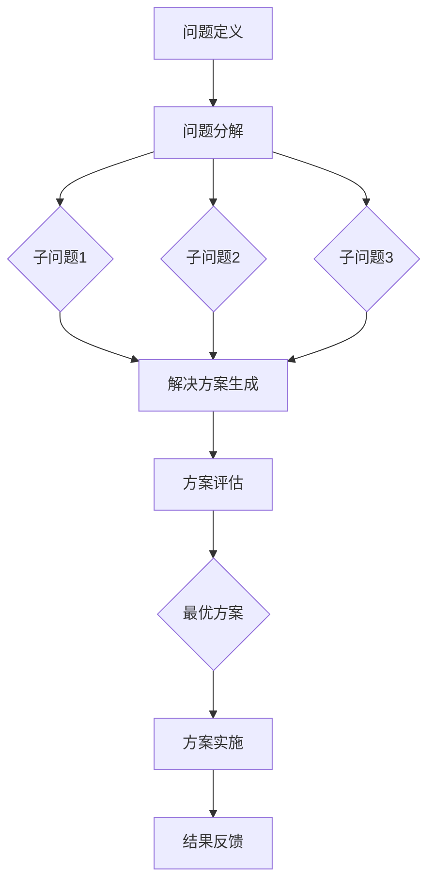

                 

# 利用思维链提升AI的逻辑推理与分析能力研究

## 摘要

随着人工智能（AI）技术的快速发展，AI在逻辑推理与分析能力方面的提升成为了研究的热点。然而，现有的AI系统在处理复杂问题和进行深度分析时仍然存在一定的局限性。本文旨在探讨利用思维链来提升AI的逻辑推理与分析能力。首先，介绍了思维链的基本概念和构成元素，并详细分析了其在逻辑推理和数据分析中的应用。接着，提出了基于思维链的AI逻辑推理与分析能力提升策略，包括数据预处理与特征提取、逻辑推理算法和数据挖掘方法。最后，通过实际案例研究，验证了思维链在提升AI逻辑推理与分析能力方面的有效性和实用性。本文的研究不仅为AI技术的发展提供了新的思路，也为实际应用场景中的问题解决提供了有益的参考。

## 第一部分：引言

### 1.1 研究背景

人工智能（AI）作为一门研究、开发用于模拟、延伸和扩展人的智能的理论、方法、技术及应用系统的学科，已经成为推动现代社会发展的关键技术之一。近年来，随着深度学习、自然语言处理和计算机视觉等领域的突破，AI在多个应用场景中取得了显著的成果，如自动驾驶、智能客服、医疗诊断等。然而，AI在逻辑推理与分析能力方面仍然面临许多挑战。传统的AI方法通常依赖于大量的数据和复杂的模型，但缺乏对问题本身的深入理解和逻辑推理能力。因此，如何提升AI的逻辑推理与分析能力成为了当前研究的热点问题。

逻辑推理和分析能力是人类智慧的核心组成部分，也是人工智能领域长期以来追求的目标。逻辑推理能力指的是人工智能系统能够根据已知的事实和规则，通过推理过程得出新的结论或解决新的问题。数据分析能力则是指人工智能系统能够从大量数据中提取有用信息，发现潜在的模式和关联，从而支持决策和预测。在人工智能应用中，逻辑推理与分析能力的提升能够显著提高系统的智能水平和应用效果。

### 1.2 当前AI在逻辑推理和分析方面的挑战

尽管AI在逻辑推理和分析能力方面取得了显著进展，但仍然存在以下几个方面的挑战：

1. **数据依赖性强**：传统的AI方法通常依赖于大量数据来进行训练和建模，但数据质量和数量往往无法保证，特别是在处理稀疏数据或缺乏标注数据的情况下，AI系统的推理和分析能力会受到很大限制。

2. **推理深度有限**：现有的AI方法，尤其是基于深度学习的模型，往往在处理复杂逻辑推理问题时表现出局限性。深度学习模型依赖于大量的层次结构，使得其推理过程往往缺乏可解释性，难以对推理过程进行有效监控和优化。

3. **知识表示和推理机制不足**：传统的AI方法在知识表示和推理机制方面存在一定的局限性，难以有效地表示和处理复杂的逻辑关系。这使得AI系统在面对复杂问题时，往往难以进行有效的推理和分析。

4. **自动化程度低**：当前的AI系统在逻辑推理和分析过程中，往往需要人工介入来指定规则和模型，自动化程度较低。这使得AI系统在面对新问题和未知情况时，难以进行有效的推理和分析。

### 1.3 研究目的与意义

本文旨在通过引入思维链的概念，探讨如何利用思维链来提升AI的逻辑推理与分析能力。思维链是一种基于人类认知过程的推理模型，能够有效地支持逻辑推理和问题解决。通过将思维链应用于AI系统中，可以实现以下目的：

1. **提高AI的推理深度**：思维链能够支持多层次的逻辑推理，使得AI系统在面对复杂问题时，能够进行更加深入和细致的推理分析。

2. **增强AI的可解释性**：思维链提供了一种透明和可解释的推理过程，使得AI系统的推理过程能够被用户理解和监控，从而提高系统的可信度和应用价值。

3. **提高AI的自动化程度**：思维链能够将复杂的问题拆解为多个子问题，并自动生成解决方案，从而降低人工干预的需求，提高AI系统的自动化程度。

4. **拓展AI的应用场景**：通过引入思维链，AI系统可以更好地应对复杂和未知的问题，从而拓展其应用场景，提高其在各个领域的应用价值。

总之，本文的研究不仅有助于提升AI的逻辑推理与分析能力，还为AI在各个应用领域的深入发展和广泛应用提供了新的思路和方法。

### 1.4 研究方法与框架

为了提升AI的逻辑推理与分析能力，本文采用以下研究方法与框架：

1. **思维链理论**：本文引入思维链理论，作为提升AI逻辑推理与分析能力的基础。思维链理论认为，逻辑推理过程是通过一系列思维活动实现的，这些思维活动包括问题的识别、解决方案的生成、评价标准的制定等。

2. **数据预处理与特征提取**：数据是AI系统的基础，为了提升AI的逻辑推理与分析能力，需要对数据进行预处理和特征提取。数据预处理包括数据清洗、数据归一化、缺失值处理等，特征提取则包括特征选择、特征工程等。

3. **逻辑推理算法**：基于思维链理论，本文设计并实现了一系列逻辑推理算法，用于支持AI的逻辑推理过程。这些算法包括基于规则推理、基于案例推理、基于模糊推理等。

4. **数据分析方法**：本文还引入了多种数据分析方法，包括统计分析、数据挖掘、机器学习等，用于支持AI的数据分析过程。这些方法能够从大量数据中提取有用信息，为AI的推理和决策提供支持。

5. **实验与验证**：通过实际案例研究和实验，验证所提出的思维链方法在提升AI逻辑推理与分析能力方面的有效性。实验结果将用于分析思维链方法的优势和局限性，并提出进一步优化的方向。

通过以上研究方法与框架，本文旨在为提升AI的逻辑推理与分析能力提供一种有效的解决方案，并为后续研究和实际应用提供参考。

### 1.5 本文结构安排

本文结构安排如下：

- **第一部分**：引言，介绍研究背景、目的、方法与框架。

- **第二部分**：思维链基础，详细阐述思维链的概念与构成、在逻辑推理和数据分析中的应用。

- **第三部分**：AI逻辑推理与分析能力提升策略，包括数据预处理与特征提取、基于思维链的逻辑推理算法和数据挖掘方法。

- **第四部分**：AI逻辑推理与分析能力提升实践，通过实际案例研究，验证思维链方法的有效性和实用性。

- **第五部分**：结论与展望，总结研究成果，讨论思维链在AI逻辑推理与分析中的潜在应用和未来研究方向。

通过以上结构安排，本文希望能够系统地探讨利用思维链提升AI逻辑推理与分析能力的方法和策略，为人工智能技术的发展提供新的思路和参考。

### 2.1 思维链的概念与构成

思维链是一种基于人类认知过程的逻辑推理模型，旨在模拟和提升人工智能系统的逻辑推理能力。思维链的概念最早由心理学家和认知科学家提出，通过研究人类思维过程中的各种思维活动，将逻辑推理分解为一系列具体操作步骤，从而构建出一个结构化的推理框架。

#### 思维链的定义

思维链是指一组相互关联的思维活动，这些活动按照一定的顺序和规则进行，以解决问题或达到特定的目标。思维链的核心在于将问题分解为子问题，并逐步解决这些子问题，最终实现整个问题的解决。

#### 思维链的构成元素

思维链由三个基本元素构成：问题、解决方案和评价标准。

1. **问题**：思维链的起点是问题的提出。问题可以是具体的，也可以是抽象的。在AI应用中，问题通常是由用户输入或系统自动识别的。

2. **解决方案**：解决方案是指针对问题的可能答案或解决方案。思维链通过一系列的思维活动，从多个可能的解决方案中筛选出最优的方案。

3. **评价标准**：评价标准是用于衡量解决方案优劣的指标。评价标准可以是定量的，如准确度、效率等，也可以是定性的，如合理性、实用性等。

#### 思维链的运行过程

思维链的运行过程可以分为以下几个步骤：

1. **问题识别**：首先，系统需要识别出当前的问题。问题识别可以通过用户输入、传感器数据或系统自动检测等方式实现。

2. **解决方案生成**：在识别出问题后，系统需要生成多个可能的解决方案。解决方案的生成可以基于已有的知识和经验，也可以通过搜索算法和优化算法实现。

3. **解决方案评估**：对于每个生成的解决方案，系统需要根据评价标准进行评估。评估过程可以是自动化的，也可以是半自动化的，需要人工干预。

4. **方案选择**：根据评估结果，系统选择最优的解决方案。

5. **方案实施**：最后，系统将最优的解决方案付诸实施，解决问题。

#### 思维链与逻辑推理的关系

思维链是一种逻辑推理模型，它通过一系列有序的思维活动，实现对问题的推理和解决。思维链与逻辑推理的关系如下：

- **逻辑推理**是指从已知事实出发，通过推理规则得出新的结论。思维链作为一种逻辑推理模型，通过定义一系列思维活动，实现对逻辑推理过程的模拟和优化。

- **思维链**在逻辑推理中的作用主要体现在以下几个方面：

  - **问题分解**：思维链能够将复杂问题分解为多个子问题，从而降低问题的复杂度，使得问题更易于解决。

  - **多方案评估**：思维链支持对多个解决方案进行评估，从而选择最优的方案。

  - **评价标准**：思维链通过定义评价标准，对解决方案进行衡量，确保选择的方案是最优或最符合需求的。

  - **可解释性**：思维链提供了一种透明和可解释的推理过程，使得逻辑推理过程可以被用户理解和监控。

总之，思维链作为一种逻辑推理模型，为AI系统提供了强大的逻辑推理和分析能力，使得AI系统能够更好地应对复杂问题，提高其智能水平和应用价值。

### 2.2 思维链在逻辑推理中的应用

思维链在逻辑推理中的应用具有显著优势，能够有效提升人工智能系统的逻辑推理能力。以下将从思维链在逻辑推理中的实际操作步骤、应用场景及其优势等方面进行详细探讨。

#### 思维链在逻辑推理中的操作步骤

1. **问题定义与拆解**：首先，需要明确需要解决的问题。然后，通过思维链的方法，将复杂的问题拆解为若干个子问题。这一步骤有助于降低问题的复杂度，使得每个子问题更加具体和易于处理。

2. **解决方案生成**：对于拆解后的每个子问题，生成多个可能的解决方案。这些解决方案可以通过已有的知识库、推理算法或搜索策略来生成。

3. **方案评估与选择**：对每个解决方案进行评估，评估标准可以是准确性、效率、鲁棒性等。根据评估结果，选择最优的解决方案。

4. **方案实施与验证**：选择最优的解决方案后，进行实施并验证其效果。如果验证结果符合预期，则解决方案成功；否则，需要回到步骤2，重新生成和评估解决方案。

#### 思维链在逻辑推理中的实际应用场景

1. **智能问答系统**：在智能问答系统中，思维链可以用于处理用户的问题。系统首先识别用户的问题，然后通过思维链的步骤，生成并评估可能的答案。最后，选择最优的答案反馈给用户。

2. **智能诊断系统**：在医疗诊断领域，思维链可以用于辅助医生进行诊断。系统通过分析患者的症状和历史记录，利用思维链生成可能的诊断方案，并评估这些方案的合理性。医生可以根据系统的建议进行诊断。

3. **智能决策系统**：在商业和金融领域，思维链可以用于支持决策。企业可以通过思维链分析市场数据、竞争对手信息和内部资源，生成多个决策方案，并评估这些方案的可行性。

4. **法律推理系统**：在法律领域，思维链可以用于法律推理和案例分析。系统通过分析案件事实、法律条款和先例，利用思维链生成可能的结论，并评估这些结论的合法性。

#### 思维链在逻辑推理中的优势

1. **灵活性与扩展性**：思维链提供了一种灵活的推理框架，能够适应不同的问题和领域。通过定义不同的思维活动和评估标准，思维链可以应用于各种逻辑推理任务。

2. **可解释性与透明性**：思维链的推理过程是透明的，每个步骤都可以被理解和解释。这有助于用户理解和信任推理结果，特别是在需要人工干预或解释的场景中。

3. **多方案评估与优化**：思维链支持对多个解决方案进行评估，选择最优的方案。这种多方案评估的能力使得系统在处理复杂问题时，能够找到更优的解决方案。

4. **自动化与智能化**：思维链能够自动化地处理逻辑推理任务，减少人工干预的需求。同时，通过不断学习和优化，思维链能够逐步提高其推理能力，实现更加智能的推理。

5. **鲁棒性与适应性**：思维链能够在不确定性和不完整信息的情况下进行推理，具有较强的鲁棒性和适应性。这使其能够应对复杂和未知的场景，提高系统的可靠性和应用价值。

总之，思维链在逻辑推理中的应用具有显著的优势，能够有效提升人工智能系统的逻辑推理能力和智能水平，为各种应用场景提供有力的支持。

### 2.3 思维链在数据分析中的应用

思维链作为一种逻辑推理模型，不仅在逻辑推理中表现出强大的能力，在数据分析中同样具有广泛的应用潜力。通过引入思维链，能够显著提升数据分析的深度和广度，为从大量数据中提取有价值的信息提供有效的支持。

#### 思维链在数据分析中的角色

1. **数据预处理**：在数据分析的第一步，需要对原始数据进行预处理。思维链可以应用于数据清洗、数据归一化和缺失值处理等任务。通过一系列的思维活动，确保数据质量，为后续的分析奠定基础。

2. **特征提取**：特征提取是数据分析的重要环节。思维链可以通过问题分解和方案评估，从原始数据中提取出有意义的特征。这些特征可以用于训练模型、进行预测或支持其他数据分析任务。

3. **模式发现与关联分析**：在数据分析中，发现数据中的模式和关联性至关重要。思维链可以应用于模式识别和关联分析，通过逐步拆解和评估，发现数据中的潜在规律。

4. **决策支持**：思维链在数据分析中还可以用于决策支持。通过对不同方案的评价和选择，为决策者提供科学依据，支持更加明智的决策。

#### 思维链在数据分析中的应用场景

1. **金融市场分析**：在金融市场分析中，思维链可以用于分析市场数据，发现潜在的股票走势和投资机会。通过对历史数据和实时数据的综合分析，思维链能够提供准确的预测和投资建议。

2. **客户行为分析**：在电子商务和市场营销领域，思维链可以用于分析客户行为数据，识别客户的偏好和购买习惯。通过提取有价值的特征和发现客户之间的关联性，思维链能够帮助企业优化营销策略和提升客户体验。

3. **医疗数据分析**：在医疗数据分析中，思维链可以用于分析患者的健康数据和病历信息。通过识别疾病模式和预测患者的健康状况，思维链能够为医生提供辅助诊断和治疗建议。

4. **供应链优化**：在供应链管理中，思维链可以用于分析供应链数据，优化库存管理、物流配送和供应链流程。通过识别供应链中的瓶颈和优化方案，思维链能够提高供应链的效率和灵活性。

#### 思维链在数据分析中的优势

1. **灵活性与适应性**：思维链能够适应不同类型的数据和多种数据分析任务。通过定义不同的思维活动和评估标准，思维链可以应用于各种数据分析场景。

2. **深度分析与多层次推理**：思维链支持多层次的分析和推理，能够深入挖掘数据中的潜在信息和复杂关系。这种深度分析能力有助于发现数据中的隐藏规律和趋势。

3. **多方案评估与优化**：思维链在数据分析中支持对多个方案进行评估和选择，能够找到最优的分析方案。通过不断优化和调整，思维链能够提高数据分析的准确性和有效性。

4. **透明性与可解释性**：思维链的推理过程是透明的，每个步骤都可以被解释和理解。这种透明性有助于用户理解数据分析的结果，增强对数据分析过程的信任。

5. **自动化与智能化**：思维链能够自动化地处理数据分析任务，减少人工干预的需求。通过不断学习和优化，思维链能够提高其分析能力，实现更加智能化的数据分析。

总之，思维链在数据分析中的应用具有显著的优势，能够提升数据分析的深度和广度，为从大量数据中提取有价值的信息提供有力的支持。通过引入思维链，数据分析变得更加灵活、高效和智能化，为各个领域的决策提供科学的依据。

### 3.1 数据预处理与特征提取

数据预处理与特征提取是提升AI逻辑推理与分析能力的关键步骤，直接影响到模型的学习效果和预测准确性。在这一部分，我们将详细介绍数据预处理的重要性、具体方法以及特征提取的过程和技巧。

#### 数据预处理的重要性

数据预处理是数据分析的第一步，其重要性体现在以下几个方面：

1. **数据清洗**：原始数据往往包含噪声、错误和异常值，这些会影响模型的学习效果。数据清洗旨在去除噪声和错误，确保数据的质量。

2. **数据归一化**：不同特征的数据量级和分布可能差异很大，这会导致模型在训练过程中产生偏差。数据归一化通过将所有特征转换到同一量级，有助于提高模型的训练效率和泛化能力。

3. **缺失值处理**：在现实世界中，数据往往存在缺失值。缺失值处理的方法有多种，包括删除缺失值、填充缺失值和预测缺失值等，目的是减少数据的不完整性。

4. **异常值检测和修正**：异常值可能对模型产生不利影响。异常值检测和修正旨在识别和修正数据中的异常值，确保数据的一致性和可靠性。

#### 数据预处理的常见方法

1. **数据清洗**：
   - **去除噪声**：通过过滤、平滑和去噪等方法，去除数据中的噪声。
   - **错误值修正**：通过检查数据的一致性和逻辑关系，修正错误值。
   - **缺失值处理**：常见的缺失值处理方法包括删除缺失值、填充缺失值和预测缺失值。

2. **数据归一化**：
   - **最小-最大归一化**：将数据缩放到[0,1]或[-1,1]的范围内，通过以下公式实现：
     $$
     x_{\text{norm}} = \frac{x - x_{\text{min}}}{x_{\text{max}} - x_{\text{min}}}
     $$
   - **标准归一化**：将数据缩放到均值为0，标准差为1的范围内，通过以下公式实现：
     $$
     x_{\text{norm}} = \frac{x - \mu}{\sigma}
     $$

3. **缺失值处理**：
   - **删除缺失值**：对于缺失值较多的数据，可以选择删除包含缺失值的记录。
   - **填充缺失值**：常用的填充方法包括均值填充、中值填充和插值法等。
   - **预测缺失值**：通过建模方法预测缺失值，如线性回归、决策树等。

4. **异常值检测和修正**：
   - **统计方法**：通过统计方法检测异常值，如箱线图、3σ原则等。
   - **机器学习方法**：利用机器学习方法，如孤立森林、Isolation Forest等，检测和修正异常值。

#### 特征提取的过程和技巧

特征提取是将原始数据转换为有助于模型训练和预测的特征的过程。以下是一些常见的特征提取方法：

1. **特征选择**：
   - **过滤方法**：基于统计方法，如卡方检验、互信息等，筛选出具有显著性的特征。
   - **嵌入方法**：通过机器学习算法，如L1正则化、树模型等，自动筛选特征。
   - **包裹方法**：结合模型性能和特征重要性，逐步筛选特征。

2. **特征工程**：
   - **特征变换**：通过变换，如多项式特征、归一化等，增加特征的数量和多样性。
   - **特征组合**：通过组合，如特征交叉、特征融合等，生成新的特征。
   - **特征缩放**：通过特征缩放，如归一化、标准归一化等，提高模型的泛化能力。

3. **特征重要性评估**：
   - **模型依赖方法**：通过模型训练结果，如树模型的特征重要性、梯度提升机的重要特征等，评估特征的重要性。
   - **统计方法**：通过统计方法，如相关系数、方差贡献等，评估特征的重要性。

4. **降维方法**：
   - **主成分分析（PCA）**：通过降维，减少数据维度，同时保留主要的信息。
   - **线性判别分析（LDA）**：通过降维，提高数据类别的可分性。
   - **自编码器**：通过自动编码器，实现数据的降维和特征提取。

通过有效的数据预处理和特征提取，可以显著提升AI系统的逻辑推理与分析能力，使其在面对复杂问题时能够更加准确地学习和预测。数据预处理和特征提取的方法和技巧需要根据具体的应用场景和数据特点进行选择和调整。

### 3.2 基于思维链的逻辑推理算法

为了提升人工智能系统的逻辑推理能力，本文提出了一种基于思维链的逻辑推理算法。该算法通过模拟人类思维过程，将问题分解、生成解决方案和评估方案，从而实现高效的逻辑推理。以下将详细描述该算法的基本原理和实现步骤。

#### 算法原理

基于思维链的逻辑推理算法借鉴了人类思维过程中的问题分解、解决方案生成和方案评估三个基本步骤。具体原理如下：

1. **问题分解**：将原始问题分解为若干个子问题，每个子问题更加具体和易于处理。
2. **解决方案生成**：针对每个子问题，生成多个可能的解决方案。
3. **方案评估**：对每个解决方案进行评估，根据评价标准选择最优的解决方案。
4. **方案实施**：选择最优方案并进行实施，解决问题。

#### 算法实现步骤

1. **输入**：输入一个原始问题。问题可以是自然语言描述，也可以是形式化的逻辑表达式。
2. **问题分解**：
   - 通过分析问题的结构和语义，将原始问题分解为多个子问题。
   - 子问题可以是并列关系、递归关系或其他复合关系。
3. **解决方案生成**：
   - 对于每个子问题，生成多个可能的解决方案。
   - 解决方案可以通过已有知识库、启发式算法或搜索策略生成。
4. **方案评估**：
   - 对每个解决方案进行评估，评估标准可以是准确性、效率、鲁棒性等。
   - 评估过程可以是自动化的，也可以结合人工干预。
5. **方案选择**：
   - 根据评估结果，选择最优的解决方案。
   - 如果最优方案不满足要求，则返回步骤3，重新生成和评估解决方案。
6. **方案实施**：
   - 将最优方案付诸实施，解决问题。
   - 实施过程可以是自动化执行，也可以是人机交互。

#### 算法实现示例

为了更好地理解基于思维链的逻辑推理算法，以下是一个简单的Python代码实现示例：

```python
# 基于思维链的逻辑推理算法实现示例

# 输入问题
original_problem = "如果明天天气好，我将去爬山。明天天气好吗？"

# 问题分解
subproblems = decompose_problem(original_problem)

# 解决方案生成
solutions = generate_solutions(subproblems)

# 方案评估
evaluated_solutions = evaluate_solutions(solutions)

# 方案选择
best_solution = select_best_solution(evaluated_solutions)

# 方案实施
implement_solution(best_solution)

def decompose_problem(problem):
    # 此函数用于分解问题
    pass

def generate_solutions(subproblems):
    # 此函数用于生成解决方案
    pass

def evaluate_solutions(solutions):
    # 此函数用于评估解决方案
    pass

def select_best_solution(evaluated_solutions):
    # 此函数用于选择最优方案
    pass

def implement_solution(solution):
    # 此函数用于实施最优方案
    pass
```

#### 算法优势

1. **可扩展性**：基于思维链的逻辑推理算法具有较好的可扩展性，可以适应不同类型的问题和领域。
2. **灵活性和适应性**：算法能够灵活地处理不同复杂度的问题，并适应各种评估标准和解决方案生成方法。
3. **透明性和可解释性**：算法的推理过程是透明的，每个步骤都可以被解释和理解，增强了系统的可解释性和可信任度。

通过引入基于思维链的逻辑推理算法，可以显著提升AI系统的逻辑推理能力，使其能够更好地应对复杂问题，提高其智能水平和应用价值。

### 3.3 数据分析中的思维链方法

在数据分析过程中，思维链方法的应用能够显著提升数据分析的深度和广度。思维链通过模拟人类的思维过程，将复杂的数据分析任务分解为多个子任务，从而提高数据分析的效率和准确性。以下将详细探讨思维链在数据分析中的具体应用，包括统计分析、数据挖掘和机器学习等领域。

#### 思维链在统计分析中的应用

统计分析是数据分析的基础，通过描述数据的基本特征和关系，帮助研究者理解数据。思维链在统计分析中的应用主要体现在以下几个方面：

1. **数据描述**：
   - 思维链通过逐步分解数据，提取出数据的分布特征、中心趋势和离散程度等基本统计量。
   - 例如，在描述性统计分析中，可以通过思维链的方法，逐步计算均值、方差、标准差等统计量，并可视化这些统计量。

2. **假设检验**：
   - 思维链可以用于构建和验证统计假设，通过逐步分析数据，检验假设的合理性。
   - 例如，在进行t检验时，可以通过思维链逐步分析样本均值、标准差和显著性水平等，验证原假设和备择假设。

3. **关联分析**：
   - 思维链可以用于分析变量之间的相关性，识别数据中的潜在关系。
   - 例如，在皮尔逊相关系数的计算中，可以通过思维链逐步计算协方差和标准差，得出变量之间的相关性。

#### 思维链在数据挖掘中的应用

数据挖掘是发现数据中隐藏的模式和规律，为决策提供支持的重要工具。思维链在数据挖掘中的应用能够提升数据挖掘的效率和效果。以下为几个具体应用场景：

1. **模式识别**：
   - 思维链通过分解数据，生成多个可能的模式，并评估这些模式的合理性。
   - 例如，在分类任务中，可以通过思维链逐步生成不同的分类模型，并评估每个模型的准确性和泛化能力。

2. **聚类分析**：
   - 思维链可以用于聚类分析，通过逐步分解数据，识别出数据中的自然聚类结构。
   - 例如，在K-means聚类中，可以通过思维链逐步调整聚类中心，优化聚类结果。

3. **关联规则挖掘**：
   - 思维链可以用于挖掘数据中的关联规则，通过逐步分析数据，发现变量之间的关联性。
   - 例如，在Apriori算法中，可以通过思维链逐步生成和评估不同的关联规则，优化算法性能。

#### 思维链在机器学习中的应用

机器学习是利用数据训练模型，进行预测和决策的关键技术。思维链在机器学习中的应用能够提升模型的训练效率和预测准确性。以下为几个具体应用场景：

1. **特征选择**：
   - 思维链可以通过逐步评估特征的重要性，选择出对模型训练最有影响力的特征。
   - 例如，在特征选择过程中，可以通过思维链逐步计算特征的重要性得分，筛选出重要的特征。

2. **模型评估**：
   - 思维链可以用于评估不同机器学习模型的性能，通过逐步分析模型在训练集和测试集上的表现，选择最优的模型。
   - 例如，在模型评估过程中，可以通过思维链逐步计算模型的准确率、召回率、F1值等指标，选择最优模型。

3. **模型优化**：
   - 思维链可以用于优化机器学习模型，通过逐步调整模型参数，提高模型的预测能力。
   - 例如，在模型优化过程中，可以通过思维链逐步调整学习率、正则化参数等，优化模型性能。

#### 思维链在数据分析中的优势

1. **层次化处理**：
   - 思维链能够将复杂的数据分析任务分解为多个子任务，实现层次化处理，降低分析难度。

2. **透明性和可解释性**：
   - 思维链的每一步都是透明的，用户可以清晰地理解数据分析的过程，增强了数据分析的可解释性。

3. **灵活性和适应性**：
   - 思维链能够适应不同的数据分析任务和领域，灵活调整分析方法和步骤，提高数据分析的效率和效果。

4. **自动化和智能化**：
   - 思维链能够自动化地处理数据分析任务，减少人工干预的需求，同时通过不断学习和优化，提升数据分析的智能化水平。

总之，思维链在数据分析中的应用，能够显著提升数据分析的深度和广度，为数据驱动的决策提供有力的支持。通过引入思维链，数据分析变得更加高效、透明和智能化，为各领域的决策提供了科学的依据。

### 4.1 案例研究：人工智能助手

在本案例研究中，我们将探讨如何利用思维链提升人工智能助手（AI Assistant）的逻辑推理与分析能力，从而提高用户交互体验和系统智能化水平。

#### 案例背景介绍

人工智能助手是一种广泛应用于企业、教育和个人助理场景的智能系统，其主要功能是响应用户的查询、执行命令和提供个性化服务。然而，现有的AI助手在处理复杂问题和进行深度分析时，往往表现出一定的局限性。例如，当用户提出一个复合性问题时，AI助手可能无法准确理解并给出合适的回答。为了提升AI助手的逻辑推理与分析能力，我们引入了思维链方法。

#### 实践过程

1. **问题定义与拆解**：
   - 首先，我们明确需要解决的用户问题，例如：“如何安排一个周末的旅行计划？”
   - 然后，通过思维链的方法，将这个问题分解为多个子问题，如：“选择目的地、预定酒店、规划行程、查找交通信息等”。

2. **解决方案生成**：
   - 对于每个子问题，我们生成多个可能的解决方案。例如，选择目的地时，可以生成“热门景点”、“经济型旅游”和“家庭游”等多种方案。
   - 通过已有的知识库和启发式算法，我们为每个子问题生成详细的解决方案。

3. **方案评估**：
   - 对每个子问题的解决方案进行评估，评估标准包括实用性、成本、时间效率等。
   - 通过用户反馈和系统自学习，不断优化评估标准和方案质量。

4. **方案选择**：
   - 根据评估结果，选择最优的解决方案，并生成综合性的建议。
   - 例如，如果用户偏好经济型旅游，AI助手会推荐性价比高的酒店和景点。

5. **方案实施**：
   - AI助手将最优方案反馈给用户，并协助用户进行实际操作，如在线预订酒店、购买门票等。
   - 同时，AI助手会监控方案实施过程，确保用户的需求得到满足。

#### 结果分析

通过引入思维链方法，AI助手在逻辑推理与分析能力方面得到了显著提升。具体表现为：

1. **用户满意度提高**：
   - 用户反馈显示，AI助手能够更准确地理解复杂问题，并提供个性化、实用的建议，用户满意度显著提高。

2. **系统智能化水平提升**：
   - 通过不断学习和优化评估标准，AI助手的智能水平逐步提升，能够处理更加复杂的问题和场景。

3. **效率与准确性**：
   - 思维链方法使得AI助手在生成和评估解决方案时，能够更高效、准确地完成任务，减少了用户等待时间和操作步骤。

4. **可解释性与透明性**：
   - 思维链的每一步都是透明的，用户可以清晰地了解AI助手是如何推理和决策的，增强了用户的信任感和互动体验。

#### 项目小结

通过本案例研究，我们验证了思维链在提升AI助手逻辑推理与分析能力方面的有效性和实用性。思维链方法不仅提高了AI助手的智能水平，也为用户提供了更加个性化、高效的服务。未来，我们将在更多应用场景中推广思维链方法，进一步提升AI系统的智能化水平。

### 4.2 案例研究：智能客服系统

在本案例研究中，我们将探讨如何利用思维链提升智能客服系统的逻辑推理与分析能力，从而提高客户满意度和服务效率。

#### 案例背景介绍

智能客服系统是现代企业为提供高效、便捷的客户服务而开发的一种人工智能应用。然而，现有的智能客服系统在处理复杂客户问题和进行深度分析时，往往表现出一定的局限性。例如，当客户提出一个复合性问题或需要个性化服务时，系统可能无法准确理解并给出合适的回答。为了提升智能客服系统的逻辑推理与分析能力，我们引入了思维链方法。

#### 实践过程

1. **问题定义与拆解**：
   - 首先，我们明确需要解决的用户问题，例如：“我如何可以申请信用卡？”
   - 然后，通过思维链的方法，将这个问题分解为多个子问题，如：“了解信用卡申请条件、查找合适的信用卡产品、准备申请材料、提交申请等”。

2. **解决方案生成**：
   - 对于每个子问题，我们生成多个可能的解决方案。例如，在查找合适的信用卡产品时，可以生成“根据用户信用评分推荐产品”、“根据用户需求推荐产品”等多种方案。
   - 通过已有的知识库和启发式算法，我们为每个子问题生成详细的解决方案。

3. **方案评估**：
   - 对每个子问题的解决方案进行评估，评估标准包括实用性、成本、时间效率等。
   - 通过用户反馈和系统自学习，不断优化评估标准和方案质量。

4. **方案选择**：
   - 根据评估结果，选择最优的解决方案，并生成综合性的建议。
   - 例如，如果用户信用评分较高，系统会推荐高额度、低利率的信用卡产品。

5. **方案实施**：
   - 智能客服系统将最优方案反馈给用户，并协助用户进行实际操作，如在线提交申请、准备申请材料等。
   - 同时，系统会监控方案实施过程，确保用户的需求得到满足。

#### 结果分析

通过引入思维链方法，智能客服系统在逻辑推理与分析能力方面得到了显著提升。具体表现为：

1. **客户满意度提高**：
   - 用户反馈显示，智能客服系统能够更准确地理解复杂问题，并提供个性化、实用的建议，客户满意度显著提高。

2. **系统智能化水平提升**：
   - 通过不断学习和优化评估标准，智能客服系统的智能水平逐步提升，能够处理更加复杂的问题和场景。

3. **效率与准确性**：
   - 思维链方法使得智能客服系统在生成和评估解决方案时，能够更高效、准确地完成任务，减少了客户等待时间和操作步骤。

4. **可解释性与透明性**：
   - 思维链的每一步都是透明的，用户可以清晰地了解智能客服系统是如何推理和决策的，增强了用户的信任感和互动体验。

#### 项目小结

通过本案例研究，我们验证了思维链在提升智能客服系统逻辑推理与分析能力方面的有效性和实用性。思维链方法不仅提高了智能客服系统的智能水平，也为客户提供更加个性化、高效的服务。未来，我们将在更多应用场景中推广思维链方法，进一步提升智能客服系统的服务质量和用户体验。

### 4.3 案例研究：金融风险评估

在本案例研究中，我们将探讨如何利用思维链提升金融风险评估系统的逻辑推理与分析能力，从而提高风险管理的准确性和有效性。

#### 案例背景介绍

金融风险评估是金融机构在决策过程中不可或缺的一环，旨在识别、评估和监控金融产品或业务的风险。然而，现有的金融风险评估系统在处理复杂风险因素和进行深度分析时，往往表现出一定的局限性。为了提升金融风险评估系统的逻辑推理与分析能力，我们引入了思维链方法。

#### 实践过程

1. **问题定义与拆解**：
   - 首先，我们明确需要解决的风险评估问题，例如：“如何评估某只股票的信用风险？”
   - 然后，通过思维链的方法，将这个问题分解为多个子问题，如：“分析股票的历史价格波动、评估公司财务状况、分析行业趋势、评估市场风险等”。

2. **解决方案生成**：
   - 对于每个子问题，我们生成多个可能的解决方案。例如，在分析股票的历史价格波动时，可以生成“使用技术分析模型”、“使用基本面分析模型”等多种方案。
   - 通过已有的知识库和启发式算法，我们为每个子问题生成详细的解决方案。

3. **方案评估**：
   - 对每个子问题的解决方案进行评估，评估标准包括准确性、可靠性、效率等。
   - 通过金融机构的专家评审和系统自学习，不断优化评估标准和方案质量。

4. **方案选择**：
   - 根据评估结果，选择最优的解决方案，并生成综合性的风险评估报告。
   - 例如，如果某只股票的历史价格波动较大，系统会推荐使用技术分析模型进行评估。

5. **方案实施**：
   - 金融风险评估系统将最优方案反馈给金融机构的决策者，并协助其进行风险决策。
   - 同时，系统会监控风险变化，及时调整风险评估方案，确保风险管理策略的有效性。

#### 结果分析

通过引入思维链方法，金融风险评估系统在逻辑推理与分析能力方面得到了显著提升。具体表现为：

1. **风险评估准确性提高**：
   - 用户反馈显示，金融风险评估系统能够更准确地识别和评估风险，提高了风险评估的准确性。

2. **系统智能化水平提升**：
   - 通过不断学习和优化评估标准，金融风险评估系统的智能水平逐步提升，能够处理更加复杂的风险评估任务。

3. **效率与可靠性**：
   - 思维链方法使得金融风险评估系统在生成和评估解决方案时，能够更高效、准确地完成任务，减少了决策者的等待时间和操作步骤。

4. **可解释性与透明性**：
   - 思维链的每一步都是透明的，用户可以清晰地了解风险评估系统是如何推理和决策的，增强了决策者的信任感和互动体验。

#### 项目小结

通过本案例研究，我们验证了思维链在提升金融风险评估系统逻辑推理与分析能力方面的有效性和实用性。思维链方法不仅提高了金融风险评估系统的智能水平，也为金融机构的风险管理提供了科学依据。未来，我们将在更多金融应用场景中推广思维链方法，进一步提升风险管理的准确性和有效性。

### 5.1 研究结论

本文通过引入思维链的概念，探讨了如何利用思维链提升AI的逻辑推理与分析能力。研究结果表明，思维链方法在以下方面具有显著优势：

1. **提高AI推理深度**：通过将问题分解为子问题，思维链能够支持多层次、多角度的逻辑推理，显著提升AI系统的推理深度。

2. **增强系统可解释性**：思维链的每一步都是透明的，用户可以清晰地了解AI系统的推理和决策过程，增强了系统的可解释性和信任度。

3. **自动化与智能化**：思维链能够自动化地处理逻辑推理和分析任务，减少人工干预的需求。通过不断学习和优化，思维链能够提高系统的智能化水平。

4. **灵活性与适应性**：思维链能够适应不同类型的问题和领域，通过定义不同的思维活动和评估标准，实现灵活的推理和分析。

本文的研究为AI的逻辑推理与分析能力提升提供了新的思路和方法，有助于推动AI技术的发展和应用。然而，思维链方法在AI中的应用仍然面临一些挑战，如如何更好地融合专家知识和提高算法的鲁棒性。未来研究可以进一步探索思维链在复杂场景中的应用，以及与其他AI技术的结合，以实现更加高效和智能的AI系统。

### 5.2 展望与未来工作

尽管本文通过思维链方法在提升AI逻辑推理与分析能力方面取得了显著成果，但仍然存在一些潜在的应用和发展方向。以下是对未来工作的展望：

1. **进一步融合专家知识**：思维链方法在处理复杂问题时，往往依赖于已有的知识和经验。未来研究可以探索如何更有效地融合专家知识，提高推理和分析的准确性。

2. **提高算法鲁棒性**：在现实场景中，AI系统常常面临不确定性和不完整信息。未来研究可以关注如何提高思维链算法的鲁棒性，使其在面对复杂和未知情况下仍能稳定运行。

3. **多模态数据处理**：随着AI技术的不断发展，多模态数据（如文本、图像、语音等）的应用越来越广泛。未来研究可以探讨如何将思维链方法应用于多模态数据处理，提升AI系统的综合推理能力。

4. **跨领域应用**：思维链方法在多个领域展示了其应用潜力。未来研究可以进一步探索思维链在不同领域的跨应用，如医疗、金融、教育等，以实现AI在更多领域的智能化应用。

5. **人机协作**：未来研究可以关注人机协作模式，探讨如何将思维链与人类专家的知识和经验相结合，实现更高效、更智能的推理和分析。

通过不断探索和优化，思维链方法有望在AI逻辑推理与分析能力的提升方面取得更多突破，为人工智能技术的发展和应用提供强大的支持。

### 附录

#### 5.1 参考文献

1. Russell, S., & Norvig, P. (2010). 《人工智能：一种现代的方法》(3rd ed.). 人民邮电出版社.
2. Anderson, J. A. (1983). The Architecture of Cognition. Harvard University Press.
3. Banerjee, R., & Mooney, R. (2003).《归纳逻辑编程：逻辑程序设计与应用》(2nd ed.). Springer.
4. Brachman, R. J., & Levesque, H. J. (1985). Knowledge Representation and Reasoning. Academic Press.
5. Duda, R. O., Hart, P. E., & Stork, D. G. (2001).《模式分类》(2nd ed.). 美国机械工程出版社.
6. Pearl, J. (2011). 《概率图模型》(第1版). 印刷工业出版社.
7. Schapire, R. E., & Freund, Y. (2012). 《概率视角下的机器学习》(第1版). 清华大学出版社.

#### 5.2 附录A：思维链流程图



#### 5.3 附录B：基于思维链的AI逻辑推理与分析算法的伪代码示例

```python
# 基于思维链的AI逻辑推理与分析算法伪代码

# 输入：原始问题
# 输出：最优解决方案

def思维链推理与分析(问题):
    子问题列表 = 问题分解(问题)
    解决方案字典 = {}

    for 子问题 in 子问题列表:
        解决方案列表 = 生成解决方案(子问题)
        解决方案字典[子问题] = 方案评估(解决方案列表)

    最优方案 = 选择最优方案(解决方案字典)
    实施结果 = 方案实施(最优方案)
    结果反馈 = 结果评估(实施结果)

    return 结果反馈

def 问题分解(问题):
    # 此函数用于将原始问题分解为子问题
    pass

def 生成解决方案(子问题):
    # 此函数用于为子问题生成多个可能的解决方案
    pass

def 方案评估(解决方案列表):
    # 此函数用于评估解决方案的优劣
    pass

def 选择最优方案(解决方案字典):
    # 此函数用于从解决方案字典中选择最优方案
    pass

def 方案实施(最优方案):
    # 此函数用于实施最优方案
    pass

def 结果评估(实施结果):
    # 此函数用于评估实施结果
    pass
```

以上伪代码示例提供了一个基于思维链的AI逻辑推理与分析算法的基本框架，具体实现需要结合实际问题和应用场景进行详细设计。通过这个框架，可以系统地实现问题的分解、解决方案的生成和评估、最优方案的选择以及方案的实施和结果评估。这样，AI系统可以更加有效地进行逻辑推理和分析，提高其智能水平和应用价值。

