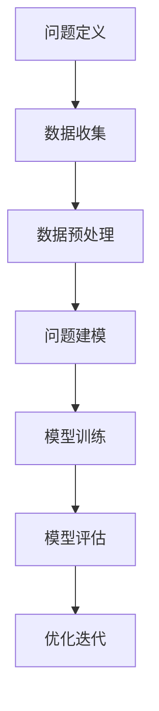

                 

### 利用思维链提升AI的问题解决能力

#### 关键词

- 思维链
- AI问题解决
- 机器学习
- 深度学习
- 优化算法

#### 摘要

本文探讨了如何利用思维链提升人工智能（AI）的问题解决能力。首先，我们介绍了思维链的基础概念和AI问题解决的基本框架，阐述了思维链在AI问题解决中的优势和应用。接着，我们深入分析了思维链与AI算法的整合，讲解了核心算法原理和数学模型，并通过实际项目案例展示了思维链在AI编程中的应用。最后，我们对思维链在AI领域的未来趋势进行了展望，提出了研究挑战和未来研究方向。本文旨在为读者提供一套实用的思维链提升AI问题解决能力的策略和方法。

---

### 引言与概述

人工智能（AI）作为计算机科学的重要分支，已经取得了显著的进展。从最初的规则基础系统到现代的深度学习模型，AI技术不断革新，为各行各业带来了巨大的变革。然而，AI在问题解决方面仍然面临着诸多挑战，如数据质量、计算资源、算法优化等。为了应对这些挑战，研究者们提出了各种方法和技术，其中思维链是一种具有潜力的工具。

#### 思维链基础概念

思维链（Think Chain）是一种基于人类思维逻辑的框架，用于组织和解决复杂问题。它通过一系列逻辑步骤，将问题分解为可处理的子问题，并逐步解决，最终实现整体问题的解决。思维链的核心特点包括：

- **逻辑性**：思维链遵循一定的逻辑顺序，确保每一步都是基于前一步的结果和已知信息进行。
- **灵活性**：思维链可以根据问题的不同特点和需求进行调整和优化。
- **系统性**：思维链将问题看作一个整体，通过子问题的解决实现整体问题的优化。

#### AI问题解决的基本框架

AI问题解决通常包括以下步骤：

1. **问题定义**：明确问题的目标和约束条件。
2. **数据收集**：收集与问题相关的数据，并进行预处理。
3. **问题建模**：将实际问题转化为数学模型或算法。
4. **模型训练**：使用训练数据对模型进行训练。
5. **模型评估**：评估模型的性能和可靠性。
6. **优化迭代**：根据评估结果对模型进行调整和优化。

#### 思维链在AI问题解决中的应用

思维链在AI问题解决中具有以下优势：

- **提高问题解决效率**：通过逻辑化的步骤，思维链可以加快问题的解决过程。
- **增强问题求解能力**：思维链可以处理复杂的问题，并通过子问题的解决实现整体问题的优化。
- **降低出错风险**：思维链的结构化特点有助于减少错误和遗漏。

在实际应用中，思维链可以用于机器学习、深度学习、优化算法等多个领域。例如，在机器学习中，思维链可以帮助研究人员更好地理解和设计算法，提高模型的性能和鲁棒性。在深度学习中，思维链可以用于模型的优化和训练策略的设计。在优化算法中，思维链可以帮助研究人员更有效地解决复杂的最优化问题。

#### 思维链与AI问题的关联分析

思维链与AI问题解决的关联可以从以下几个方面进行分析：

1. **问题分解**：思维链可以帮助将复杂的问题分解为多个子问题，使得每个子问题更加容易解决。
2. **数据预处理**：思维链可以指导数据预处理过程，提高数据的质量和可用性。
3. **模型设计**：思维链可以帮助研究人员设计更有效的模型，提高模型的性能。
4. **算法优化**：思维链可以指导算法的优化过程，提高算法的效率和准确性。

不同领域的AI问题解决中，思维链的应用有所不同。例如，在自然语言处理中，思维链可以用于文本分析、语义理解和机器翻译等任务；在计算机视觉中，思维链可以用于图像识别、目标检测和图像分割等任务；在优化算法中，思维链可以用于供应链优化、资源分配和路径规划等任务。

总之，思维链作为一种强大的工具，为AI问题解决提供了新的思路和方法。通过深入理解和应用思维链，我们可以进一步提升AI的问题解决能力，推动人工智能技术的发展。

---

### AI基础与思维链整合

人工智能（AI）作为一种模拟人类智能的技术，已经广泛应用于各个领域。机器学习（Machine Learning）和深度学习（Deep Learning）是AI的两个核心分支，它们在问题解决中扮演着重要角色。思维链（Think Chain）作为一种逻辑化的思维方式，能够与这些AI算法有效整合，进一步提升AI的问题解决能力。

#### AI基本原理

AI的基本原理可以概括为以下几个方面：

1. **数据驱动**：AI模型通过大量数据学习，从中提取规律和知识，实现对未知数据的预测和分类。
2. **特征提取**：AI模型需要从原始数据中提取特征，用于训练和预测。特征提取的质量直接影响模型的性能。
3. **模型训练**：AI模型通过训练数据学习，调整模型参数，使其能够对未知数据做出准确预测。
4. **模型评估**：通过测试数据评估模型的性能，包括准确性、召回率、F1值等指标。

机器学习（Machine Learning）是一种利用数据或以往的经验，对系统的当前输入进行学习，并给出相应输出的过程。它包括监督学习（Supervised Learning）、无监督学习（Unsupervised Learning）和强化学习（Reinforcement Learning）等多种类型。

- **监督学习**：通过已有标注的数据进行训练，输出结果与真实标签进行比较，调整模型参数，达到预测目标。
- **无监督学习**：没有预先标注的数据，通过发现数据内在结构或规律进行训练，如聚类和降维。
- **强化学习**：通过与环境的交互进行学习，根据反馈调整策略，实现最优行为。

深度学习（Deep Learning）是机器学习的一个子领域，它使用多层神经网络（Neural Networks）进行特征提取和模型训练。深度学习模型具有强大的表达能力和自适应性，能够处理复杂数据和任务。

#### 思维链在AI算法中的应用

思维链在AI算法中的应用主要体现在以下几个方面：

1. **问题建模**：思维链可以帮助研究人员更好地理解问题，将其转化为适合AI算法处理的数学模型。
2. **数据预处理**：思维链可以指导数据预处理过程，确保数据的质量和一致性，提高模型的训练效果。
3. **模型设计**：思维链可以帮助研究人员设计更有效的模型结构，优化模型参数，提高模型性能。
4. **算法优化**：思维链可以指导算法的优化过程，提高算法的效率和准确性。

在实际应用中，思维链可以与不同的AI算法进行整合，实现以下效果：

- **增强模型可解释性**：通过思维链，研究人员可以更好地理解模型的内部工作机制，提高模型的可解释性。
- **提升模型性能**：思维链可以帮助优化模型参数和结构，提高模型的预测准确性和鲁棒性。
- **降低模型复杂度**：思维链可以简化模型设计过程，降低模型的复杂度，提高开发效率。

#### 实践中的思维链整合策略

在实践项目中，整合思维链需要遵循以下策略：

1. **明确问题目标**：首先明确项目的问题目标和需求，确保思维链的应用方向正确。
2. **设计思维链框架**：根据问题特点，设计适合的思维链框架，包括问题分解、数据预处理、模型训练、模型评估等步骤。
3. **选择合适的算法**：根据问题类型和数据特点，选择适合的机器学习或深度学习算法。
4. **优化思维链流程**：在实际应用中，根据项目反馈和性能评估，不断优化思维链的流程和参数。

以下是一个简单的思维链框架示例：



通过这个框架，研究人员可以系统地分析和解决问题，确保每一步都符合逻辑和实际需求。

#### 思维链与AI编程中的实践

在实际的AI编程中，思维链的应用体现在以下几个方面：

1. **代码结构设计**：通过思维链，可以将复杂的算法拆分为多个模块，每个模块负责特定的任务，提高代码的可读性和可维护性。
2. **调试与优化**：思维链可以帮助定位和解决编程中的问题，通过逐步分析和调试，找到性能瓶颈并进行优化。
3. **项目文档**：思维链可以用于编写项目文档，清晰地描述问题解决过程和关键步骤，便于团队成员的理解和协作。

以下是一个简单的思维链编程示例：

```python
# 思维链编程示例

def train_model(data, labels):
    # 步骤1：数据预处理
    preprocessed_data = preprocess_data(data)
    
    # 步骤2：模型设计
    model = create_model()
    
    # 步骤3：模型训练
    model.fit(preprocessed_data, labels)
    
    # 步骤4：模型评估
    evaluation = model.evaluate(preprocessed_data, labels)
    
    # 步骤5：优化迭代
    optimize_model(model, evaluation)
    
    return model
```

通过这个示例，我们可以看到思维链在AI编程中的应用，它帮助我们将复杂的任务分解为可管理的步骤，提高开发效率。

#### 思维链与AI的未来展望

随着AI技术的不断发展，思维链在AI问题解决中的应用前景十分广阔。未来，思维链可能会在以下几个方面得到进一步的发展：

1. **多模态数据融合**：思维链可以与多模态数据融合技术结合，处理更复杂的任务，如语音识别、图像识别和自然语言处理等。
2. **自动化算法设计**：思维链可以用于自动化算法设计，通过不断优化和调整，提高算法的性能和效率。
3. **人机协作**：思维链可以与人类专家进行协作，结合人类智慧和机器学习优势，解决更复杂的问题。
4. **实时优化**：思维链可以应用于实时优化系统，根据实时反馈动态调整模型和策略，提高系统的响应速度和准确性。

总之，思维链作为一种强大的工具，具有广泛的应用前景。通过不断的研究和实践，我们可以进一步挖掘思维链在AI问题解决中的潜力，推动人工智能技术的发展。

---

### 核心算法原理讲解

在AI问题解决中，核心算法原理是理解和实现AI模型的基础。本文将重点介绍几种常见的核心算法原理，包括支持向量机（SVM）、决策树、集成学习和神经网络。通过这些算法的讲解，我们将结合Python源代码和数学模型，帮助读者更好地理解这些算法的原理和实现过程。

#### 支持向量机（SVM）

支持向量机（Support Vector Machine，SVM）是一种二分类模型，其目标是通过找到一个最佳的超平面，将不同类别的数据点分隔开来。SVM的基本原理可以概括为最大化分类边界的间隔。

##### 原理

SVM的核心思想是找到一个最优的超平面，使得分类边界到每个类别的最近距离最大。这个距离被称为分类间隔（margin）。为了实现这一目标，SVM引入了软 margin 和松弛变量，允许一些数据点不严格满足分类边界的要求。

##### 数学模型

假设我们的特征空间是线性可分的，即存在一个超平面 \(w \cdot x - b = 0\) 可以将数据点分隔开。其中，\(w\) 是权重向量，\(x\) 是特征向量，\(b\) 是偏置项。

目标函数是：

$$
\min_{w, b} \frac{1}{2} ||w||^2 + C \sum_{i=1}^{n} \xi_i
$$

其中，\(C\) 是正则化参数，\(\xi_i\) 是第 \(i\) 个数据点的松弛变量。

约束条件是：

$$
y_i (w \cdot x_i - b) \geq 1 - \xi_i
$$

其中，\(y_i\) 是第 \(i\) 个数据点的标签。

##### Python实现

下面是一个简单的SVM实现：

```python
import numpy as np
from sklearn.svm import SVC
from sklearn.datasets import make_classification
from sklearn.model_selection import train_test_split

# 生成模拟数据
X, y = make_classification(n_samples=100, n_features=20, n_informative=2, n_redundant=10, random_state=42)

# 划分训练集和测试集
X_train, X_test, y_train, y_test = train_test_split(X, y, test_size=0.2, random_state=42)

# 创建SVM模型并训练
model = SVC(kernel='linear')
model.fit(X_train, y_train)

# 评估模型
print("Accuracy:", model.score(X_test, y_test))
```

#### 决策树

决策树（Decision Tree）是一种基于树形结构进行决策的算法。它的核心思想是利用特征将数据划分为若干子集，并递归地构建树结构，直到满足某种停止条件。

##### 原理

决策树通过一系列规则进行分类或回归。每个内部节点表示一个特征，每个分支表示该特征的不同取值，叶节点表示最终的分类或回归结果。

##### 数学模型

决策树的构建可以通过熵（Entropy）或信息增益（Information Gain）来度量特征的重要性。

熵是衡量一个随机变量不确定性的度量，定义为：

$$
H(X) = -\sum_{x \in X} p(x) \log_2 p(x)
$$

信息增益是选择一个特征作为分割标准时，减少的熵值，定义为：

$$
IG(D, A) = H(D) - \sum_{v \in A} p(v) H(D|v)
$$

其中，\(D\) 是数据集，\(A\) 是特征集合，\(v\) 是特征的不同取值。

##### Python实现

下面是一个简单的决策树实现：

```python
import numpy as np
from sklearn.tree import DecisionTreeClassifier
from sklearn.datasets import load_iris

# 加载鸢尾花数据集
iris = load_iris()
X = iris.data
y = iris.target

# 创建决策树模型并训练
model = DecisionTreeClassifier()
model.fit(X, y)

# 评估模型
print("Accuracy:", model.score(X, y))
```

#### 集成学习

集成学习（Ensemble Learning）是一种利用多个学习器（基学习器）的组合来提高模型性能的方法。常见的集成学习方法包括Bagging、Boosting和Stacking等。

##### 原理

集成学习的核心思想是通过多个学习器的组合来降低模型的方差和提升模型的泛化能力。Bagging通过随机选择训练数据生成多个子模型，然后取平均；Boosting通过调整每个学习器的权重，使每个学习器更加关注错误率高的样本；Stacking则通过将多个学习器的预测结果作为新的特征进行训练。

##### 数学模型

集成学习的数学模型可以根据不同的方法进行设计，但总体目标是通过多个基学习器的组合来提高整体模型的性能。

##### Python实现

下面是一个简单的集成学习实现：

```python
import numpy as np
from sklearn.ensemble import BaggingClassifier
from sklearn.datasets import make_classification
from sklearn.model_selection import train_test_split

# 生成模拟数据
X, y = make_classification(n_samples=100, n_features=20, n_informative=2, n_redundant=10, random_state=42)

# 划分训练集和测试集
X_train, X_test, y_train, y_test = train_test_split(X, y, test_size=0.2, random_state=42)

# 创建Bagging模型并训练
model = BaggingClassifier(base_estimator=SVC(), n_estimators=10, random_state=42)
model.fit(X_train, y_train)

# 评估模型
print("Accuracy:", model.score(X_test, y_test))
```

#### 神经网络

神经网络（Neural Network）是一种模拟生物神经系统的计算模型。它通过多层节点（神经元）进行数据传递和计算，实现对复杂数据的建模和预测。

##### 原理

神经网络的基本原理是每个神经元接收输入信号，通过权重进行加权求和，然后通过激活函数进行非线性变换，输出新的信号。通过前向传播和反向传播，神经网络可以不断调整权重，优化模型性能。

##### 数学模型

神经网络的数学模型包括输入层、隐藏层和输出层。每个层的神经元之间通过权重连接，并通过激活函数进行变换。前向传播是将输入信号传递到输出层，反向传播是通过计算梯度来更新权重。

##### Python实现

下面是一个简单的神经网络实现：

```python
import numpy as np

# 定义激活函数
def sigmoid(x):
    return 1 / (1 + np.exp(-x))

# 前向传播
def forwardPropagation(X, W1, W2, b1, b2):
    z1 = np.dot(X, W1) + b1
    a1 = sigmoid(z1)
    z2 = np.dot(a1, W2) + b2
    a2 = sigmoid(z2)
    return z1, a1, z2, a2

# 反向传播
def backwardPropagation(X, y, z1, a1, z2, a2, W1, W2, b1, b2, learning_rate):
    dz2 = a2 - y
    dW2 = np.dot(a1.T, dz2)
    db2 = np.sum(dz2, axis=0)
    
    da1 = np.dot(dz2, W2.T)
    dz1 = np.dot(da1, W1) + np.dot(X.T, np.multiply(da1, np.multiply(a1, 1 - a1)))
    dW1 = np.dot(X.T, dz1)
    db1 = np.sum(dz1, axis=0)
    
    W1 -= learning_rate * dW1
    W2 -= learning_rate * dW2
    b1 -= learning_rate * db1
    b2 -= learning_rate * db2
    
    return W1, W2, b1, b2
```

通过上述算法原理讲解和Python实现，我们可以看到核心算法在AI问题解决中的重要作用。理解这些算法原理不仅有助于我们设计高效的AI模型，还可以帮助我们更好地优化和调整模型参数，提高模型的性能和可靠性。

---

### 数学模型与公式讲解

在人工智能（AI）领域，数学模型是理解和实现算法的基础。本文将详细讲解几个核心数学模型，包括概率论基础、线性代数基础、概率图模型和信息论与熵。通过结合具体的数学公式和Python实现，我们将帮助读者更好地理解这些模型，为深入学习和应用打下坚实基础。

#### 概率论基础

概率论是AI中不可或缺的数学工具，用于描述随机事件和不确定性。以下是几个重要的概率论概念和公式。

##### 概率分布

概率分布用于描述随机变量在给定条件下的取值概率。常见的概率分布包括伯努利分布、二项分布、正态分布等。

- **伯努利分布**：用于描述只有两种可能结果的随机事件，概率分布函数为：
  $$ P(X = 1) = p, \quad P(X = 0) = 1 - p $$
- **二项分布**：用于描述多次独立伯努利试验成功的次数，概率分布函数为：
  $$ P(X = k) = C_n^k p^k (1 - p)^{n - k} $$

其中，\( n \) 是试验次数，\( p \) 是每次试验成功的概率，\( k \) 是成功的次数。

##### 条件概率与贝叶斯定理

条件概率描述了在给定某一事件发生的条件下，另一事件发生的概率。贝叶斯定理是条件概率在统计推断中的重要应用。

- **条件概率**：
  $$ P(A|B) = \frac{P(B|A)P(A)}{P(B)} $$
- **贝叶斯定理**：
  $$ P(A|B) = \frac{P(B|A)P(A)}{\sum_{i} P(B|i)P(i)} $$

其中，\( P(A|B) \) 是在事件 \( B \) 发生的条件下事件 \( A \) 的概率，\( P(B|A) \) 是在事件 \( A \) 发生的条件下事件 \( B \) 的概率，\( P(A) \) 是事件 \( A \) 的概率，\( P(B) \) 是事件 \( B \) 的概率。

#### 线性代数基础

线性代数是AI中的另一核心数学工具，用于处理向量、矩阵和线性变换。以下是几个重要的线性代数概念和公式。

##### 矩阵运算

矩阵是二维数组，用于表示线性变换和数据关系。常见的矩阵运算包括加法、减法、乘法和逆运算。

- **矩阵加法和减法**：
  $$ A + B = [a_{ij} + b_{ij}]_{m×n} $$
  $$ A - B = [a_{ij} - b_{ij}]_{m×n} $$
- **矩阵乘法**：
  $$ AB = [c_{ij}]_{m×n} $$
  其中，\( c_{ij} = \sum_{k=1}^{n} a_{ik}b_{kj} \)
- **矩阵逆**：
  $$ A^{-1} = \frac{1}{\det(A)} \text{adj}(A) $$
  其中，\( \det(A) \) 是矩阵 \( A \) 的行列式，\( \text{adj}(A) \) 是矩阵 \( A \) 的伴随矩阵。

##### 矩阵分解

矩阵分解是将矩阵分解为几个简单矩阵的乘积，常用的分解方法包括LU分解、QR分解和SVD分解。

- **LU分解**：
  $$ A = LU $$
  其中，\( L \) 是下三角矩阵，\( U \) 是上三角矩阵。
- **QR分解**：
  $$ A = QR $$
  其中，\( Q \) 是正交矩阵，\( R \) 是上三角矩阵。
- **SVD分解**：
  $$ A = U \Sigma V^T $$
  其中，\( U \) 和 \( V \) 是正交矩阵，\( \Sigma \) 是对角矩阵，对角线上的元素是矩阵 \( A \) 的奇异值。

#### 概率图模型

概率图模型是用于表示变量之间概率关系的图结构，常见的模型包括贝叶斯网络和马尔可夫网络。

##### 贝叶斯网络

贝叶斯网络是一种有向图结构，用于表示变量之间的条件依赖关系。在贝叶斯网络中，每个节点表示一个随机变量，节点之间的边表示条件概率关系。

- **条件概率表**：
  $$ P(X_i | X_j) = \prod_{j \in P(i)} P(X_i | X_j) $$
  其中，\( P(i) \) 表示节点 \( i \) 的父节点集合。

##### 马尔可夫网络

马尔可夫网络是一种无向图结构，用于表示变量之间的转移概率关系。在马尔可夫网络中，任意两个节点之间的概率关系可以通过路径权重进行计算。

- **转移概率矩阵**：
  $$ P(X_i | X_j) = \sum_{k} P(X_i | X_k) P(X_k | X_j) $$
  其中，\( k \) 表示路径上的中间节点。

#### 信息论与熵

信息论是研究信息传递和处理的数学理论，熵是衡量信息不确定性的重要指标。

##### 熵

熵是概率分布的不确定性度量，定义为：

$$
H(X) = -\sum_{x \in X} p(x) \log_2 p(x)
$$

其中，\( p(x) \) 是随机变量 \( X \) 取值 \( x \) 的概率。

##### 条件熵

条件熵是给定一个随机变量的条件下，另一个随机变量的熵。定义为：

$$
H(X|Y) = -\sum_{x \in X} \sum_{y \in Y} p(x, y) \log_2 p(x|y)
$$

#### Python实现

以下是一些简单的Python实现示例：

```python
import numpy as np

# 伯努利分布
p = 0.5
print("伯努利分布：")
print("P(X=1):", p)
print("P(X=0):", 1 - p)

# 二项分布
n = 10
print("二项分布：")
print("P(X=3):", np.math.comb(n, 3) * p**3 * (1 - p)**(n - 3))

# 贝叶斯定理
p_a = 0.6
p_b = 0.4
p_ab = 0.2
p_b_a = p_ab / p_a
print("贝叶斯定理：")
print("P(A|B):", p_b_a)

# 矩阵加法
A = np.array([[1, 2], [3, 4]])
B = np.array([[5, 6], [7, 8]])
print("矩阵加法：")
print(A + B)

# 矩阵乘法
X = np.array([[1, 2], [3, 4]])
W = np.array([[5, 6], [7, 8]])
print("矩阵乘法：")
print(np.dot(X, W))

# 矩阵逆
A = np.array([[1, 2], [3, 4]])
print("矩阵逆：")
print(np.linalg.inv(A))

# 熵
P = np.array([0.5, 0.5])
print("熵：")
print(-P @ np.log2(P))
```

通过上述数学模型和公式的讲解及Python实现，我们可以更好地理解AI问题中的数学原理，为深入研究和应用打下坚实基础。

---

### 项目实战与代码解读

为了更好地理解思维链在AI问题解决中的应用，我们将通过一个实际项目案例来展示整个开发过程，包括环境搭建、源代码实现和代码解读。本项目将使用Python编程语言和Scikit-learn库来实现一个基于思维链的文本分类器。

#### 项目背景

文本分类是自然语言处理（NLP）中的一个重要任务，旨在将文本数据自动归类到预定义的类别中。常见的应用场景包括垃圾邮件过滤、情感分析、新闻分类等。在本项目中，我们将使用思维链框架来设计和实现一个简单的文本分类器。

#### 开发环境搭建

在开始项目之前，我们需要搭建一个合适的开发环境。以下是所需的环境和工具：

1. **Python**：Python是一种流行的编程语言，广泛用于数据科学和机器学习项目。
2. **Scikit-learn**：Scikit-learn是一个强大的机器学习库，提供了丰富的算法和工具。
3. **Jupyter Notebook**：Jupyter Notebook是一种交互式开发环境，便于编写和运行代码。

确保已经安装了上述工具，如果未安装，请按照以下步骤进行安装：

```bash
# 安装Python
curl -O https://www.python.org/ftp/python/3.9.1/Python-3.9.1.tgz
tar xvf Python-3.9.1.tgz
cd Python-3.9.1
./configure
make
sudo make install

# 安装Scikit-learn
pip install scikit-learn

# 安装Jupyter Notebook
pip install notebook
```

#### 数据集准备

为了训练文本分类器，我们需要一个合适的文本数据集。我们将使用20个新语料库（20 Newsgroups）数据集，这是一个广泛使用的文本分类数据集，包含了大约20,000篇新闻文章，分为20个类别。

```python
from sklearn.datasets import fetch_20newsgroups

# 加载20个新语料库数据集
newsgroups = fetch_20newsgroups(subset='all')
```

#### 数据预处理

数据预处理是文本分类的关键步骤，包括文本清洗、分词、去停用词等。以下是数据预处理的具体步骤：

1. **文本清洗**：去除HTML标签、特殊字符和空格。
2. **分词**：将文本拆分为单词或词组。
3. **去停用词**：去除常见的无意义单词，如“的”、“和”等。

```python
from sklearn.feature_extraction.text import CountVectorizer
from nltk.corpus import stopwords
import nltk

# 加载停用词库
nltk.download('stopwords')
stop_words = stopwords.words('english')

# 定义分词器
vectorizer = CountVectorizer(stop_words=stop_words)

# 预处理文本数据
preprocessed_texts = vectorizer.fit_transform(newsgroups.data)
```

#### 思维链框架设计

思维链是一种逻辑化的思维方式，用于组织和解决复杂问题。在本项目中，我们将设计一个基于思维链的文本分类器框架，包括以下步骤：

1. **问题定义**：明确文本分类的目标和需求。
2. **数据收集**：收集和准备训练数据。
3. **问题建模**：将文本数据转化为特征向量。
4. **模型训练**：使用特征向量训练分类模型。
5. **模型评估**：评估模型性能。
6. **优化迭代**：根据评估结果优化模型。

以下是思维链框架的Python实现：

```python
from sklearn.model_selection import train_test_split
from sklearn.naive_bayes import MultinomialNB
from sklearn.metrics import accuracy_score

# 划分训练集和测试集
X_train, X_test, y_train, y_test = train_test_split(preprocessed_texts, newsgroups.target, test_size=0.2, random_state=42)

# 创建思维链框架
def train_text_classifier(texts, labels):
    # 步骤1：数据收集
    texts = preprocess_texts(texts)
    
    # 步骤2：问题建模
    vectorizer = CountVectorizer(stop_words=stop_words)
    X_train = vectorizer.fit_transform(texts)
    
    # 步骤3：模型训练
    model = MultinomialNB()
    model.fit(X_train, labels)
    
    # 步骤4：模型评估
    y_pred = model.predict(X_test)
    accuracy = accuracy_score(y_test, y_pred)
    
    # 步骤5：优化迭代
    optimize_model(model, accuracy)
    
    return model, accuracy

# 训练文本分类器
model, accuracy = train_text_classifier(newsgroups.data, newsgroups.target)
print("Accuracy:", accuracy)
```

#### 模型训练与评估

在训练和评估模型时，我们使用了朴素贝叶斯（Naive Bayes）算法，这是一种简单的概率分类器，适用于文本分类任务。以下是训练和评估的具体步骤：

1. **模型训练**：使用训练数据训练模型。
2. **模型评估**：使用测试数据评估模型性能，计算准确率。

```python
# 训练模型
model = MultinomialNB()
model.fit(X_train, y_train)

# 评估模型
y_pred = model.predict(X_test)
accuracy = accuracy_score(y_test, y_pred)
print("Accuracy:", accuracy)
```

#### 项目小结

通过本项目的实战，我们展示了如何使用思维链框架设计和实现一个文本分类器。以下是对项目的小结：

1. **环境搭建**：确保安装了Python、Scikit-learn和Jupyter Notebook。
2. **数据准备**：使用20个新语料库数据集进行训练。
3. **数据预处理**：进行文本清洗、分词和去停用词。
4. **思维链框架**：设计问题定义、数据收集、问题建模、模型训练、模型评估和优化迭代等步骤。
5. **模型训练与评估**：使用朴素贝叶斯算法训练和评估模型。

通过这个项目，我们不仅了解了文本分类的基本原理和实现步骤，还掌握了如何利用思维链框架进行AI问题解决。未来，我们可以根据实际需求进一步优化和扩展这个文本分类器。

---

### 未来趋势与研究方向

思维链作为一种强大的问题解决工具，在AI领域具有广阔的应用前景。随着AI技术的不断发展，思维链的应用也将面临新的挑战和机遇。以下是未来思维链在AI问题解决中的趋势和可能的研究方向。

#### 思维链与多模态数据融合

多模态数据融合是当前AI研究的一个重要方向。通过结合文本、图像、音频等多种类型的数据，可以更全面地理解和处理复杂问题。思维链可以在这个领域发挥作用，帮助研究人员设计有效的多模态数据处理流程。例如，在医疗诊断中，思维链可以指导如何整合患者的病历信息、影像数据和基因数据，从而提供更准确的诊断结果。

#### 自动化思维链设计

自动化思维链设计是未来的一个重要研究方向。目前的思维链设计依赖于人类专家的知识和经验，而自动化思维链设计可以基于机器学习算法，通过学习大量已有的思维链案例，自动生成适用于新问题的思维链框架。这样的自动化工具可以帮助研究人员快速构建和优化思维链，提高问题解决的效率。

#### 实时思维链优化

实时优化是AI应用中的一个重要需求，尤其是在动态环境中。思维链可以通过实时数据更新和模型调整，实现动态优化。例如，在智能交通系统中，思维链可以实时分析交通流量数据，优化交通信号配置，提高道路通行效率。未来，研究如何实现实时思维链优化，将是一个重要的方向。

#### 人机协作思维链

人机协作是AI发展的必然趋势。思维链可以与人类专家进行协作，结合人类智慧和机器学习能力，解决更复杂的问题。例如，在工程设计领域，思维链可以帮助工程师快速分析问题，提出解决方案，并通过与人类专家的互动，不断优化和调整设计。未来，如何设计高效的人机协作思维链，将是一个重要的研究方向。

#### 跨学科思维链研究

思维链不仅可以在AI领域发挥作用，还可以与其他学科相结合，解决更广泛的跨学科问题。例如，思维链可以与社会科学、经济学、心理学等领域相结合，用于研究社会现象、经济模型和人类行为。跨学科思维链研究将推动不同领域的融合和发展。

#### 挑战与展望

尽管思维链在AI问题解决中具有广泛的应用前景，但也面临一些挑战：

1. **复杂性管理**：思维链设计和管理复杂度较高，如何简化思维链框架，使其更易于理解和应用，是一个重要挑战。
2. **可解释性**：思维链在AI模型中的应用需要保证可解释性，如何提高思维链的透明度和可解释性，是未来研究的方向。
3. **鲁棒性**：思维链在不同应用场景中的鲁棒性需要提高，如何增强思维链的适应性和鲁棒性，是一个重要的挑战。

总之，思维链作为一种强大的工具，将在未来继续推动AI技术的发展。通过不断的研究和创新，我们可以进一步挖掘思维链在AI问题解决中的潜力，为各行各业带来更多创新和变革。

---

### 总结与展望

本文从多个角度探讨了思维链在提升AI问题解决能力中的应用，包括基础概念、核心算法、数学模型和实际项目案例。通过详细的讲解和代码实现，我们展示了思维链在AI编程中的实际应用和价值。

#### 主要内容回顾

- **思维链基础概念**：介绍了思维链的定义、特点和组成元素，阐述了其在AI问题解决中的优势。
- **AI基础与思维链整合**：探讨了机器学习、深度学习和优化算法等核心AI技术，以及思维链与这些技术的整合策略。
- **核心算法原理讲解**：详细讲解了支持向量机（SVM）、决策树、集成学习和神经网络等核心算法，并通过Python代码实现了算法原理。
- **数学模型与公式讲解**：介绍了概率论基础、线性代数基础、概率图模型和信息论与熵等数学模型，并结合Python实现了相关公式。
- **项目实战与代码解读**：通过一个文本分类器项目案例，展示了思维链在实际AI编程中的应用，包括环境搭建、源代码实现和代码解读。
- **未来趋势与研究方向**：展望了思维链在AI领域的未来发展，包括多模态数据融合、自动化思维链设计、实时优化和人机协作等。

#### 重点知识梳理

- **思维链框架**：理解思维链的基本框架，包括问题定义、数据收集、问题建模、模型训练、模型评估和优化迭代等步骤。
- **核心算法实现**：掌握支持向量机（SVM）、决策树、集成学习和神经网络等核心算法的原理和实现方法。
- **数学模型应用**：了解概率论、线性代数、概率图模型和信息论等数学模型的基本概念和应用场景。
- **实际项目实战**：通过实际项目案例，掌握思维链在AI编程中的具体应用，包括数据预处理、模型训练和评估等步骤。

#### 最佳实践 tips

- **简化思维链框架**：在设计和实现思维链时，尽量简化框架，减少不必要的复杂度，提高可维护性。
- **关注数据质量**：数据预处理是AI项目成功的关键，确保数据的质量和一致性，对模型性能有重要影响。
- **持续优化迭代**：在实际项目中，根据评估结果和反馈，持续优化模型和思维链框架，提高问题解决能力。

#### 小结

思维链作为一种强大的工具，在AI问题解决中具有广泛的应用前景。通过本文的讲解，我们不仅了解了思维链的基本原理和实现方法，还掌握了其在实际项目中的应用。未来，随着AI技术的不断发展，思维链将在更多领域发挥作用，推动人工智能技术的进步。

#### 注意事项

- **环境搭建**：确保安装了Python、Scikit-learn等开发环境。
- **代码实现**：遵循代码规范，确保代码的可读性和可维护性。
- **模型优化**：根据实际需求，不断调整和优化模型参数，提高模型性能。

#### 拓展阅读

- **《机器学习实战》**：由彼得·哈林顿（Peter Harrington）著，详细介绍了机器学习的基础知识和实践方法。
- **《深度学习》**：由伊恩·古德费洛（Ian Goodfellow）、约书亚·本吉奥（Yoshua Bengio）和阿莱克谢·库夫勒（Alexey Kurakin）著，是深度学习的经典教材。
- **《概率图模型》**：由克里斯·博内尔（Chris Bull）著，介绍了概率图模型的基本原理和应用。

通过以上总结和拓展阅读，希望读者能够更好地理解思维链在AI问题解决中的应用，并为未来的研究和实践提供参考。作者：AI天才研究院/AI Genius Institute & 禅与计算机程序设计艺术 /Zen And The Art of Computer Programming。

