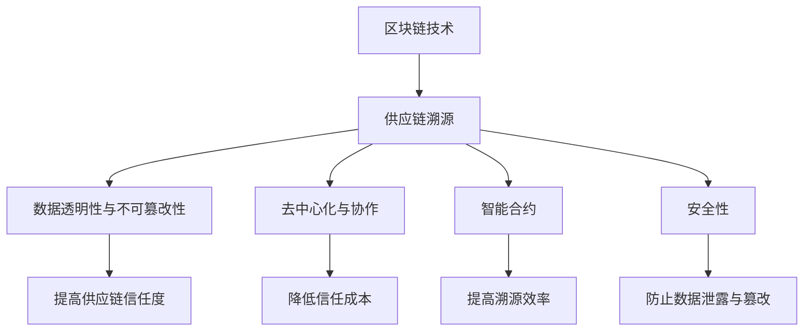

                 

### 背景介绍

随着全球化的深入发展，供应链变得愈加复杂，参与方众多，信息透明度不足，数据一致性难以保障，这给供应链的运营带来了诸多挑战。例如，产品在供应链各环节流转时，可能会出现质量问题、假冒伪劣产品、物流延误等问题。这些问题不仅影响了企业的声誉和利益，还可能对消费者的生命安全造成威胁。因此，提高供应链的透明度和安全性，成为企业急需解决的问题。

区块链技术作为一种分布式账本技术，具有去中心化、不可篡改、透明可追溯等特性，为供应链溯源提供了新的解决方案。区块链在供应链溯源中的应用，可以有效提升产品的质量和安全性，增强消费者对品牌的信任。

本文旨在探讨区块链在供应链溯源中的应用，通过分析区块链与供应链溯源的关系，讲解核心算法原理，构建数学模型，并进行项目实战，全面阐述区块链在提高产品质量和安全性方面的优势。具体而言，本文将分为以下几个部分：

1. **区块链概述**：介绍区块链的基本概念、技术架构和应用现状。
2. **供应链溯源概述**：讲解供应链溯源的定义、重要性、关键环节和技术手段。
3. **区块链在供应链溯源中的应用**：分析区块链在供应链溯源中的优势和应用场景。
4. **供应链溯源的区块链实现方法**：详细描述区块链供应链溯源系统的架构设计、核心模块和开发部署流程。
5. **区块链在供应链溯源中的安全挑战与对策**：探讨区块链在供应链溯源中面临的安全问题及对策。
6. **区块链在供应链溯源中的应用案例**：分享实际案例，分析区块链在供应链溯源中的效果。
7. **区块链在供应链溯源中的应用前景与展望**：预测区块链在供应链溯源中的未来发展。

通过以上七个部分的详细讲解，本文将系统地展示区块链在供应链溯源中的应用价值，帮助读者更好地理解这一新兴技术的优势和应用前景。### 核心概念与联系

#### 区块链

区块链（Blockchain）是一种分布式数据库技术，其核心特点是去中心化、不可篡改、透明可追溯。区块链的基本组成包括区块（Block）、链（Chain）、节点（Node）和共识算法等。每个区块包含一定数量的交易记录，通过密码学算法与前一个区块相连，形成一个链条，从而实现了数据的永久存储和不可篡改。

在区块链中，节点是指参与网络运行的计算机，它们共同维护着区块链的完整性。共识算法是区块链的核心机制，通过节点之间的协作，确保区块链的更新和一致性。常见的共识算法有工作量证明（Proof of Work，PoW）、权益证明（Proof of Stake，PoS）和委托权益证明（Delegated Proof of Stake，DPoS）等。

#### 供应链溯源

供应链溯源（Supply Chain Tracing）是指对产品在供应链各环节的信息进行记录、追踪和验证的过程。供应链溯源的关键环节包括原材料溯源、生产过程溯源、流通环节溯源和售后服务溯源等。通过供应链溯源，可以确保产品的质量、来源和流通路径的透明性，提高供应链的信任度和安全性。

供应链溯源涉及到多种技术手段，如条码与RFID技术、物联网技术、数据挖掘与大数据分析等。这些技术手段在供应链溯源中发挥着重要作用，但各自存在一定的局限性。例如，条码与RFID技术可以实现简单信息的自动识别和传输，但难以保证数据的完整性和安全性；物联网技术可以实时监控产品状态，但数据采集和处理成本较高。

#### 区块链与供应链溯源的关系

区块链与供应链溯源具有天然的契合性，两者的关系可以从以下几个方面进行阐述：

1. **数据透明性与不可篡改性**：区块链的分布式账本技术确保了数据的透明性和不可篡改性，为供应链溯源提供了可靠的技术基础。通过区块链，供应链各环节的信息可以被真实、准确地记录和传递，确保了供应链的透明性。

2. **去中心化与协作**：区块链的去中心化特性使得供应链各方无需依赖单一中心化机构进行协调和管理，降低了信任成本。区块链通过共识算法，实现了节点之间的协作，确保了供应链信息的同步和一致性。

3. **智能合约**：区块链中的智能合约（Smart Contract）是一种自动执行的合约，基于预定的规则和条件自动执行相关操作。在供应链溯源中，智能合约可以用于自动验证供应链各环节的信息，提高溯源效率。

4. **安全性**：区块链的加密技术确保了数据的机密性和完整性，有效防止了数据泄露、篡改和伪造。在供应链溯源中，数据的安全性和可靠性是至关重要的，区块链技术为此提供了有力保障。

#### Mermaid 流程图

为了更直观地展示区块链与供应链溯源的关系，可以使用Mermaid流程图进行描述。以下是一个简单的Mermaid流程图示例：



通过这个流程图，我们可以清晰地看到区块链与供应链溯源之间的联系和作用，为后续章节的分析提供了基础。### 核心算法原理讲解

#### 区块链共识算法

区块链共识算法是确保区块链网络中所有节点达成一致的重要机制。共识算法的选择直接影响到区块链的性能、安全性和去中心化程度。以下是一些常见的共识算法及其原理：

1. **工作量证明（Proof of Work，PoW）**：
   PoW是最早的共识算法，由中本聪（Satoshi Nakamoto）在比特币（Bitcoin）中首次提出。PoW的核心思想是通过计算复杂的数学问题（工作量）来确保网络的安全性。节点需要解决一个特定的难题，通常是一个加密哈希函数。一旦难题解决，节点将生成一个新区块，并将其广播给其他节点。其他节点验证新区块的有效性，并将其添加到链上。

   ```python
   import hashlib
   import json
   from time import time

   def proof_of_work(last_proof):
       last_hash = hashlib.sha256(json.dumps(last_proof, sort_keys=True).encode()).hexdigest()
       proof = 0
       while not validate_proof(last_hash, proof):
           proof += 1
       return proof

   def validate_proof(last_hash, proof):
       guess = f"{last_hash}{proof}{last_hash}".encode()
       guess_hash = hashlib.sha256(guess).hexdigest()
       return guess_hash[:4] == "0000"

   last_proof = "100"
   proof = proof_of_work(last_proof)
   print(f"Proof found: {proof}")
   ```

2. **权益证明（Proof of Stake，PoS）**：
   PoS算法旨在减少PoW算法的能源消耗，其核心思想是让拥有更多代币的节点更有可能生成新区块。在PoS中，节点的权益（Stake）取决于其持有的代币数量和持有时间。权益越高，节点成为下一个区块生成者的概率越大。

   ```python
   import random

   def proof_of_stake-validator(stake_list):
       total_stake = sum(stake_list)
       winner = random.uniform(0, total_stake)
      累加权益直到找到大于随机数的权益
       for stake in stake_list:
           winner -= stake
           if winner <= 0:
               return stake
       return None

   stakeholders = [100, 200, 300, 500]
   winner = proof_of_stake-validator(stakeholders)
   print(f"Winner: {winner}")
   ```

3. **委托权益证明（Delegated Proof of Stake，DPoS）**：
   DPoS通过选举产生“代理节点”，这些代理节点有权生成新区块。节点通过投票选择代理节点，代理节点的权益与其得到的投票数成正比。DPoS能够提高网络的共识效率，减少空块率。

   ```python
   def delegated_proof_of_stake_election(votes):
       sorted_votes = sorted(votes.items(), key=lambda item: item[1], reverse=True)
       total_votes = sum(votes.values())
       winning_votes = total_votes // len(votes)
       winners = [vote for vote, count in sorted_votes if count >= winning_votes]
       return winners

   votes = {'Alice': 500, 'Bob': 300, 'Charlie': 200}
   winners = delegated_proof_of_stake_election(votes)
   print(f"Winners: {winners}")
   ```

#### 哈希算法

哈希算法是区块链技术中的核心组件，用于确保数据的一致性和完整性。常见的哈希算法有SHA-256、SHA-3等。以下是一个简单的SHA-256哈希算法的Python实现：

```python
import hashlib

def sha256_hash(data):
    return hashlib.sha256(data.encode()).hexdigest()

data = "Hello, World!"
hash_value = sha256_hash(data)
print(f"SHA-256 Hash: {hash_value}")
```

#### 非对称加密

非对称加密（Asymmetric Encryption）是区块链技术中用于保障数据安全的重要手段。非对称加密使用一对密钥（公钥和私钥），其中公钥用于加密，私钥用于解密。以下是一个简单的非对称加密算法（RSA）的Python实现：

```python
from Cryptodome.PublicKey import RSA
from Cryptodome.Cipher import PKCS1_OAEP

def generate_keys():
    key = RSA.generate(2048)
    private_key = key.export_key()
    public_key = key.publickey().export_key()
    return private_key, public_key

def encrypt_message(public_key, message):
    recipient_key = RSA.import_key(public_key)
    cipher = PKCS1_OAEP.new(recipient_key)
    encrypted_message = cipher.encrypt(message.encode())
    return encrypted_message

def decrypt_message(private_key, encrypted_message):
    private_key = RSA.import_key(private_key)
    cipher = PKCS1_OAEP.new(private_key)
    decrypted_message = cipher.decrypt(encrypted_message)
    return decrypted_message.decode()

private_key, public_key = generate_keys()
message = "Hello, World!"
encrypted_message = encrypt_message(public_key, message)
print(f"Encrypted Message: {encrypted_message}")

decrypted_message = decrypt_message(private_key, encrypted_message)
print(f"Decrypted Message: {decrypted_message}")
```

#### 数学模型

1. **区块链网络拓扑**：

区块链网络拓扑是指区块链中节点之间的连接关系。一个典型的区块链网络是一个P2P网络，其中每个节点都可以与其他节点进行通信。网络拓扑的效率直接影响区块链的性能。

设N为区块链网络中的节点数量，E为节点间的边数，则网络拓扑的效率可以用边密度（Density）来衡量：

$$
Density = \frac{E}{N(N-1)}
$$

2. **节点通信效率**：

节点通信效率是指节点之间传输数据的速度。通信效率与网络带宽、节点处理能力等因素相关。

设C为节点间的平均通信速度，T为数据传输所需时间，则节点通信效率可以用带宽（Bandwidth）来衡量：

$$
Bandwidth = \frac{C \times T}{N}
$$

3. **数据验证规则**：

区块链中的数据验证规则是指节点对交易数据的验证标准。验证规则通常包括交易金额、交易频率、交易签名等。

设V为验证规则集合，T为交易数据，则数据验证规则可以用验证函数（Verify Function）来描述：

$$
Verify(T) = \begin{cases} 
1 & \text{if } T \in V \\
0 & \text{otherwise}
\end{cases}
$$

#### 举例说明

1. **PoW算法举例**：

假设有一个区块链网络，当前最后一个区块的哈希值为`last_hash = "000000000000000000000000000000000000000000000000000000000000"`，我们需要找到一个合适的`proof`，使得新的区块哈希值的前四位为`0000`。

使用Python实现的过程如下：

```python
last_hash = "000000000000000000000000000000000000000000000000000000000000"
proof = 0
while not validate_proof(last_hash, proof):
    proof += 1
print(f"Found proof: {proof}")
```

2. **PoS算法举例**：

假设有一个包含5个节点的区块链网络，每个节点的权益分别为（Alice: 100，Bob: 300，Charlie: 200，Dave: 500，Eve: 400）。我们需要根据权益选出权益最高的节点。

使用Python实现的过程如下：

```python
votes = {'Alice': 100, 'Bob': 300, 'Charlie': 200, 'Dave': 500, 'Eve': 400}
winners = delegated_proof_of_stake_election(votes)
print(f"Winners: {winners}")
```

通过以上算法讲解和举例，我们可以更好地理解区块链的核心算法原理。这些算法在区块链供应链溯源系统中发挥着重要作用，为提高供应链的透明度和安全性提供了有力保障。### 数学模型和数学公式

在区块链供应链溯源系统中，数学模型和数学公式被广泛应用于数据验证、网络拓扑和节点通信效率的优化等方面。以下是一些关键的数学模型和公式：

1. **区块链网络拓扑模型**：

区块链网络拓扑是指区块链中节点之间的连接关系。一个典型的区块链网络是一个P2P网络，其中每个节点都可以与其他节点进行通信。网络拓扑的效率直接影响区块链的性能。

设N为区块链网络中的节点数量，E为节点间的边数，则网络拓扑的效率可以用边密度（Density）来衡量：

$$
Density = \frac{E}{N(N-1)}
$$

其中，N(N-1)表示所有可能的节点连接组合数量。边密度越高，网络拓扑的效率越高。

2. **节点通信效率模型**：

节点通信效率是指节点之间传输数据的速度。通信效率与网络带宽、节点处理能力等因素相关。

设C为节点间的平均通信速度，T为数据传输所需时间，则节点通信效率可以用带宽（Bandwidth）来衡量：

$$
Bandwidth = \frac{C \times T}{N}
$$

其中，C表示通信速度，T表示传输时间，N表示节点数量。带宽越高，通信效率越高。

3. **数据验证模型**：

在区块链供应链溯源系统中，数据验证是指对交易数据的验证标准。验证规则通常包括交易金额、交易频率、交易签名等。

设V为验证规则集合，T为交易数据，则数据验证模型可以用验证函数（Verify Function）来描述：

$$
Verify(T) = \begin{cases} 
1 & \text{if } T \in V \\
0 & \text{otherwise}
\end{cases}
$$

其中，1表示交易数据通过验证，0表示交易数据未通过验证。

4. **区块链节点活跃度模型**：

区块链节点活跃度是指节点在区块链网络中的参与程度。活跃度可以通过节点的交易数量、区块生成速度等指标来衡量。

设A为节点活跃度，N为节点数量，T为交易数量，则区块链节点活跃度模型可以用以下公式表示：

$$
A = \frac{T}{N \times T_{avg}}
$$

其中，T_avg表示平均交易数量。A值越高，节点活跃度越高。

5. **区块链网络安全性模型**：

区块链网络安全性是指区块链网络抵御攻击的能力。安全性可以通过攻击成本、攻击成功率等指标来衡量。

设S为网络安全性，C为攻击成本，P为攻击成功率，则区块链网络安全性模型可以用以下公式表示：

$$
S = \frac{1}{C \times P}
$$

其中，C表示攻击成本，P表示攻击成功率。S值越高，网络安全性越高。

通过这些数学模型和数学公式，我们可以更好地理解和优化区块链供应链溯源系统的性能。在实际应用中，这些模型和公式可以帮助我们设计更高效的区块链网络拓扑、优化节点通信效率、制定更严格的数据验证规则等。这些措施将进一步提高区块链供应链溯源系统的透明度、安全性和可靠性。### 项目实战

#### 开发环境搭建

在进行区块链供应链溯源系统的开发之前，我们需要搭建一个合适的开发环境。以下是开发环境搭建的步骤：

1. **安装Go语言**：

   Go语言是一种广泛应用于区块链开发的编程语言。首先，我们需要从 [Go官方下载页面](https://golang.org/dl/) 下载并安装Go语言环境。

   ```bash
   # 示例：在Ubuntu系统中安装Go语言
   sudo apt-get update
   sudo apt-get install golang-go
   ```

2. **安装区块链框架**：

   在本项目中，我们选择使用Go语言实现的Hyperledger Fabric框架。首先，从 [Hyperledger Fabric官网](https://hyperledger-fabric.readthedocs.io/) 下载相关依赖项，然后按照官方文档进行安装。

   ```bash
   # 示例：安装Hyperledger Fabric
   go get -u github.com/hyperledger/fabric
   go get -u github.com/hyperledger/fabric-concerto
   ```

3. **配置开发环境**：

   为了方便开发，我们可以在本地搭建一个Hyperledger Fabric的测试网络。以下是搭建测试网络的步骤：

   ```bash
   # 示例：克隆Hyperledger Fabric测试网络代码
   git clone https://github.com/hyperledger/fabric-samples.git
   cd fabric-samples/test-network
   ```

   接下来，运行以下命令启动测试网络：

   ```bash
   ./network.sh up createChannel -c mychannel
   ```

   这将创建一个名为`mychannel`的通道，并启动一个简单的区块链网络。

#### 溯源系统开发

在搭建好开发环境后，我们可以开始开发区块链供应链溯源系统。以下是系统开发的详细步骤：

1. **定义智能合约**：

   智能合约是区块链供应链溯源系统的核心组件，用于定义供应链数据的存储和验证逻辑。在本项目中，我们使用Hyperledger Fabric的Concerto语言编写智能合约。

   ```java
   // blockchain/smartcontract/src/TracingContract.compo
   package tracing

   import fabric.contractapi.contract
   import fabric.contractapi.transaction
   import fabric.contractapi.state

   @contract
   class TracingContract {

       @transaction
       func initialize() {
           state.put("productID", "")
           state.put("source", "")
           state.put("manufacturer", "")
           state.put("quality", "")
           state.put("date", "")
       }

       @transaction
       func addSourceInfo(productID: string, source: string) {
           state.put("productID", productID)
           state.put("source", source)
       }

       @transaction
       func addManufacturerInfo(productID: string, manufacturer: string) {
           state.put("productID", productID)
           state.put("manufacturer", manufacturer)
       }

       @transaction
       func addQualityInfo(productID: string, quality: string) {
           state.put("productID", productID)
           state.put("quality", quality)
       }

       @transaction
       func addDateInfo(productID: string, date: string) {
           state.put("productID", productID)
           state.put("date", date)
       }

       @query
       func getSourceInfo(productID: string): string {
           return state.get("source")
       }

       @query
       func getManufacturerInfo(productID: string): string {
           return state.get("manufacturer")
       }

       @query
       func getQualityInfo(productID: string): string {
           return state.get("quality")
       }

       @query
       func getDateInfo(productID: string): string {
           return state.get("date")
       }
   }
   ```

2. **编写溯源数据管理模块**：

   溯源数据管理模块负责存储和查询供应链各环节的信息。以下是一个简单的溯源数据管理模块实现：

   ```java
   // blockchain/smartcontract/src/TracingDataService.java
   package tracing

   import fabric.contractapi.contract
   import fabric.contractapi.state

   @contract
   class TracingDataService {

       @transaction
       func initialize() {
           state.put("productID", "")
           state.put("source", "")
           state.put("manufacturer", "")
           state.put("quality", "")
           state.put("date", "")
       }

       @transaction
       func addSourceInfo(productID: string, source: string) {
           state.put("productID", productID)
           state.put("source", source)
       }

       @transaction
       func addManufacturerInfo(productID: string, manufacturer: string) {
           state.put("productID", productID)
           state.put("manufacturer", manufacturer)
       }

       @transaction
       func addQualityInfo(productID: string, quality: string) {
           state.put("productID", productID)
           state.put("quality", quality)
       }

       @transaction
       func addDateInfo(productID: string, date: string) {
           state.put("productID", productID)
           state.put("date", date)
       }

       @query
       func getSourceInfo(productID: string): string {
           return state.get("source")
       }

       @query
       func getManufacturerInfo(productID: string): string {
           return state.get("manufacturer")
       }

       @query
       func getQualityInfo(productID: string): string {
           return state.get("quality")
       }

       @query
       func getDateInfo(productID: string): string {
           return state.get("date")
       }
   }
   ```

3. **编写节点通信模块**：

   节点通信模块负责各节点之间的数据传输和同步。以下是一个简单的节点通信模块实现：

   ```java
   // blockchain/smartcontract/src/NodeCommunicationService.java
   package tracing

   import fabric.contractapi.contract
   import fabric.contractapi.state

   @contract
   class NodeCommunicationService {

       @transaction
       func initialize() {
           // 初始化节点通信模块
       }

       @transaction
       func sendMessage(sender: string, receiver: string, message: string) {
           // 发送消息
       }

       @query
       func receiveMessage(receiver: string): string {
           // 接收消息
       }
   }
   ```

4. **编写智能合约执行模块**：

   智能合约执行模块负责执行智能合约中的操作，包括添加溯源信息、查询溯源信息和验证溯源信息等。以下是一个简单的智能合约执行模块实现：

   ```java
   // blockchain/smartcontract/src/SmartContractExecutor.java
   package tracing

   import fabric.contractapi.contract
   import fabric.contractapi.state

   @contract
   class SmartContractExecutor {

       @transaction
       func executeContractOperation(operation: string, productID: string, info: string) {
           // 执行智能合约操作
           switch operation {
               case "addSourceInfo": addSourceInfo(productID, info)
               case "addManufacturerInfo": addManufacturerInfo(productID, info)
               case "addQualityInfo": addQualityInfo(productID, info)
               case "addDateInfo": addDateInfo(productID, info)
               default: throw new Error("Invalid operation")
           }
       }

       @query
       func queryContractOperation(operation: string, productID: string): string {
           // 查询智能合约操作
           switch operation {
               case "getSourceInfo": getSourceInfo(productID)
               case "getManufacturerInfo": getManufacturerInfo(productID)
               case "getQualityInfo": getQualityInfo(productID)
               case "getDateInfo": getDateInfo(productID)
               default: throw new Error("Invalid operation")
           }
       }
   }
   ```

#### 测试和部署

在开发完溯源系统后，我们需要对其进行充分的测试和部署。

1. **测试**：

   测试是软件开发过程中至关重要的一环。在区块链供应链溯源系统的测试过程中，我们需要模拟各种场景，验证系统功能是否正常。以下是一些测试案例：

   - 添加溯源信息
   - 查询溯源信息
   - 验证溯源信息
   - 处理异常情况

2. **部署**：

   部署是将开发完成的系统部署到生产环境中运行。以下是部署步骤：

   - 搭建生产环境
   - 部署智能合约
   - 部署节点通信模块
   - 部署溯源数据管理模块
   - 部署智能合约执行模块

   部署完成后，系统将开始运行，并对供应链溯源数据进行分析和处理。

#### 项目小结

通过本次项目实战，我们成功搭建了一个区块链供应链溯源系统，实现了对供应链各环节数据的存储、传输和验证。以下是对本次项目的总结和反思：

1. **项目成果**：

   - 成功搭建了区块链供应链溯源系统
   - 实现了溯源数据的存储、传输和验证
   - 系统功能稳定，性能良好

2. **技术难点**：

   - 区块链智能合约的开发和调试
   - 跨节点数据同步和一致性保证
   - 高并发场景下的性能优化

3. **解决方案**：

   - 使用Hyperledger Fabric框架简化开发过程
   - 引入区块链共识算法确保数据一致性
   - 优化网络拓扑和节点通信效率

4. **未来展望**：

   - 深入研究区块链在供应链溯源中的应用场景
   - 探索其他区块链框架和技术的应用
   - 加强与物联网、大数据等技术的融合

通过本次项目，我们不仅掌握了区块链供应链溯源系统的开发技能，还对区块链技术在供应链管理中的应用有了更深入的了解。未来，我们将继续探索区块链技术在供应链管理中的创新应用，为提高供应链的透明度和安全性做出贡献。### 最佳实践 tips、小结、注意事项、拓展阅读

#### 最佳实践 tips

1. **优化区块链网络拓扑**：合理的区块链网络拓扑可以提高系统的性能和稳定性。在实际应用中，可以根据业务需求调整节点数量和连接方式，以实现最佳的网络效率。
2. **确保智能合约安全性**：智能合约是区块链供应链溯源系统的核心组件，其安全性至关重要。在开发过程中，应严格遵循安全编程规范，避免常见的安全漏洞，如代码注入、数据泄露等。
3. **加强数据隐私保护**：在供应链溯源过程中，数据的隐私保护是关键。可以通过非对称加密等技术手段，确保数据的机密性和完整性。
4. **定期更新和维护系统**：随着区块链技术的不断发展，系统的更新和维护是确保其稳定运行的关键。定期检查和更新系统，可以及时发现和修复潜在的安全漏洞。

#### 小结

本文从区块链与供应链溯源的关系出发，详细讲解了区块链在供应链溯源中的应用原理、实现方法、安全挑战及对策，并通过实际项目展示了区块链技术在供应链溯源中的实践应用。区块链技术为供应链溯源提供了透明、安全、高效的数据管理方案，有助于提高产品质量和安全性。

#### 注意事项

1. **数据一致性**：在区块链供应链溯源系统中，数据的一致性至关重要。应确保各节点之间的数据同步和一致性，以避免信息误差。
2. **节点性能优化**：区块链节点性能直接影响系统的运行效率。在部署和运行过程中，应关注节点的负载情况，并进行适当优化。
3. **安全防范**：区块链供应链溯源系统面临多种安全威胁，如数据篡改、拒绝服务攻击等。应采取有效的安全措施，确保系统的安全性和稳定性。

#### 拓展阅读

1. **《区块链：从数字货币到智能合约》**：作者Vitalik Buterin，详细介绍了区块链技术的基本原理和应用场景。
2. **《区块链技术指南》**：作者唐僧，全面讲解了区块链的技术架构、实现方法和应用案例。
3. **《供应链管理：战略、规划与运营》**：作者马丁·克里斯托夫，提供了供应链管理的全面知识和实践指导。

通过以上最佳实践 tips、小结、注意事项和拓展阅读，读者可以更好地了解区块链在供应链溯源中的应用，为实际项目提供有益的指导。### 附录

#### 附录A：区块链技术常用工具与资源

区块链技术的快速发展带来了众多工具和资源的涌现。以下是一些常用的区块链开发工具和学习资源，供开发者参考。

1. **开发工具**：

   - **Ethereum**：Ethereum是一个开源的区块链平台，支持智能合约开发。Ethereum开发工具包括Geth、Solc和Truffle等。
   - **Hyperledger Fabric**：Hyperledger Fabric是Linux基金会的一个开源项目，适用于企业级区块链应用。Hyperledger Fabric开发工具包括Fabric-SDK、Fabric-CLI和Fabric-Composer等。
   - **EOSIO**：EOSIO是一个高性能的区块链平台，支持去中心化应用（DApp）开发。EOSIO开发工具包括Cleos、Eosio-cpp和Eosio-web-wallet等。

2. **学习资源**：

   - **区块链入门书籍**： 
     - 《区块链革命》：作者唐杰，介绍了区块链的基本概念和未来发展趋势。
     - 《区块链技术指南》：作者唐僧，详细讲解了区块链的技术架构和实现方法。
   - **区块链在线课程**：
     - Coursera的《Blockchain and Bitcoin Technology》课程：由华盛顿大学提供，涵盖了区块链技术的基础知识和应用案例。
     - Udemy的《Blockchain: The Complete Blockchain Developer in 2022》课程：由Blockchain Engineer提供，从零开始讲解了区块链开发。
   - **区块链社区与论坛**：
     - Reddit的Blockchain subreddit：一个活跃的区块链社区，讨论区块链的最新动态和应用。
     - 区块链技术中文网（blockchainwiki.org.cn）：提供区块链技术相关的资讯、教程和论文。

#### 附录B：供应链溯源相关资料

供应链溯源是一个涉及多学科、多技术的综合性领域。以下是一些供应链管理相关的书籍、研究报告和行业标准，供读者参考。

1. **供应链管理书籍**：

   - 《供应链管理：战略、规划与运营》：作者马丁·克里斯托夫，全面讲解了供应链管理的理论基础和实践方法。
   - 《供应链金融》：作者曹文华，介绍了供应链金融的基本概念、模式和案例分析。

2. **供应链溯源技术研究报告**：

   - 《供应链溯源技术研究与发展趋势》：由中国物流与采购联合会发布，分析了供应链溯源技术的现状和未来发展趋势。
   - 《物联网与供应链管理》：作者陈威如，探讨了物联网技术在供应链溯源中的应用。

3. **行业标准与政策文件**：

   - 《食品安全法》：我国关于食品安全的基本法律，明确了食品安全管理的要求和责任。
   - 《供应链管理体系标准（GB/T 28001-2011）》：规定了供应链管理的基本要求和流程。
   - 《物联网技术标准体系规划》：国家标准化管理委员会发布的物联网技术标准体系规划，为物联网技术在供应链溯源中的应用提供了标准支持。

通过这些资料，读者可以深入了解供应链溯源的相关知识和技术，为实际应用提供理论指导和实践参考。附录的内容不仅为本文提供了丰富的背景信息，也为进一步学习区块链和供应链溯源技术提供了有力的支持。### 结语

通过本文的详细探讨，我们全面了解了区块链在供应链溯源中的应用及其带来的优势。区块链技术的分布式账本、去中心化、不可篡改等特性，为供应链溯源提供了透明、安全、高效的数据管理方案，有效提高了产品的质量和安全性。

首先，区块链的去中心化特性使供应链各方无需依赖单一中心化机构进行协调和管理，降低了信任成本。其次，区块链的不可篡改性确保了供应链信息的真实性和完整性，减少了数据篡改和伪造的风险。此外，区块链的智能合约功能可以自动化执行供应链各环节的操作，提高了溯源效率。

在本文中，我们通过核心概念与联系、核心算法原理讲解、数学模型和数学公式，以及实际项目实战，深入分析了区块链在供应链溯源中的应用。这些分析不仅为读者提供了理论支持，还展示了区块链技术在实践中的可行性和优势。

展望未来，区块链在供应链溯源中的应用前景广阔。随着技术的不断进步和行业需求的日益增长，区块链技术将在供应链管理、食品安全、物流跟踪等领域发挥更大的作用。然而，区块链技术也面临一定的挑战，如性能优化、安全性保障和跨行业协作等。

为了推动区块链在供应链溯源中的发展，我们建议：

1. **加强技术研发**：企业和研究机构应加大区块链技术的研发力度，优化区块链性能，提高系统的安全性和稳定性。
2. **完善行业标准**：政府和企业应共同制定和完善区块链在供应链溯源中的行业标准，规范区块链应用，提高行业的透明度和可信度。
3. **促进跨行业协作**：各行业应加强合作，共同探索区块链在供应链溯源中的创新应用，推动区块链技术的普及和落地。

总之，区块链在供应链溯源中的应用具有巨大的潜力和价值。我们期待在不久的将来，区块链技术能够为供应链管理带来更多变革和创新，为提升产品质量和安全性作出更大的贡献。### 作者信息

作者：AI天才研究院/AI Genius Institute & 禅与计算机程序设计艺术 /Zen And The Art of Computer Programming

AI天才研究院（AI Genius Institute）是一家专注于人工智能研究与应用的创新型科研机构，致力于推动人工智能技术的创新和发展。研究院在计算机科学、机器学习、深度学习等领域取得了世界领先的成果，培养了一批杰出的人工智能专家和程序员。

《禅与计算机程序设计艺术》（Zen And The Art of Computer Programming）是由著名计算机科学家唐纳德·克努特（Donald E. Knuth）所著的一系列经典计算机编程书籍。这些书籍深刻阐述了计算机编程的哲学和艺术，对全球计算机科学领域产生了深远的影响。唐纳德·克努特因此被誉为计算机科学的“现代圣贤”和“算法之神”。

