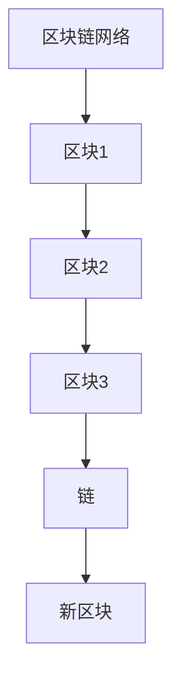
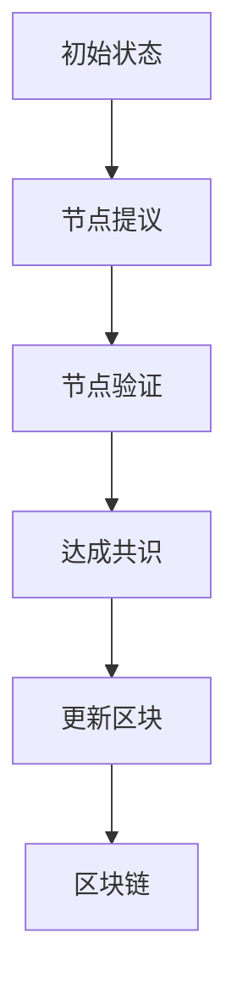
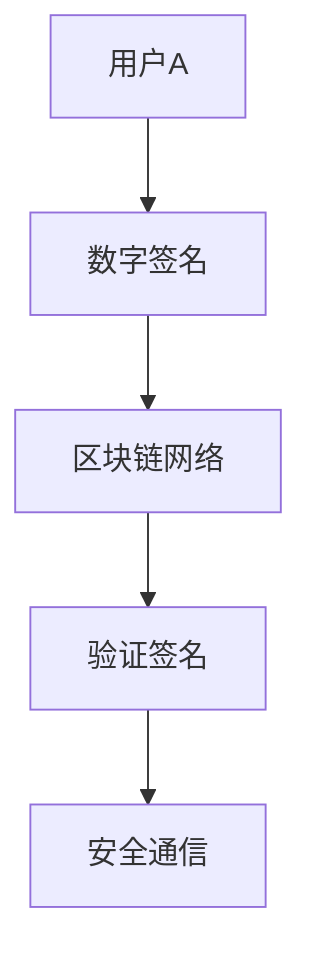

                 

# 《区块链在供应链透明度中的应用》

## 关键词
区块链、供应链透明度、智能合约、共识机制、溯源与防伪

## 摘要
本文旨在探讨区块链技术如何提升供应链的透明度，解决传统供应链管理中的信息不对称、可追溯性差等问题。通过对区块链的基本概念、技术架构及其在供应链中的应用进行深入分析，本文总结了区块链在供应链透明度提升中的优势、挑战及其未来发展。同时，通过实际案例研究和项目实战，本文为读者提供了区块链在供应链透明度应用中的最佳实践和未来方向。

## 第1章 区块链与供应链概述
### 1.1 区块链技术的基础知识
区块链是一种去中心化的分布式数据库技术，通过加密算法和共识机制确保数据的真实性和不可篡改性。区块链的核心特点是数据的透明性和不可篡改性，这使得区块链在许多领域具有广泛的应用潜力，如金融、供应链、医疗等。

区块链的基本概念包括区块、链、节点和共识机制等。区块是数据的基本存储单位，链是多个区块按时间顺序连接而成的数据结构。节点是参与区块链网络计算的计算机，共识机制是确保区块链网络中的所有节点对数据达成一致的方式。

在供应链管理中，区块链可以用于记录商品的生产、运输、存储等各个环节的信息，从而提高供应链的透明度和可追溯性。

### 1.2 供应链管理的现状与挑战
供应链管理是指从原材料采购到产品交付给最终用户的全过程管理。随着全球化的深入，供应链管理变得日益复杂，传统的供应链管理方式面临着以下挑战：

1. 信息不对称：供应链中的各参与方信息不透明，导致决策效率低下。
2. 可追溯性差：供应链中的商品信息难以追溯，导致商品的质量和安全问题难以解决。
3. 供应链中断风险：自然灾害、政治冲突等不可预见因素可能导致供应链中断。

### 1.3 区块链在供应链中的应用前景
区块链技术为解决供应链管理中的挑战提供了新的可能性。通过区块链，供应链中的各参与方可以实时共享信息，提高供应链的透明度和协同效率。区块链在供应链中的应用前景包括：

1. 提高供应链效率：通过减少信息不对称和冗余，降低交易成本，提高供应链的整体效率。
2. 提高供应链的可追溯性：区块链的不可篡改性确保了供应链信息的真实性和可追溯性，有助于提高商品的质量和安全。
3. 降低供应链中断风险：通过实时监控供应链的各个环节，提前发现潜在问题，降低供应链中断的风险。

## 第2章 区块链在供应链透明度中的作用
### 2.1 区块链如何增强供应链透明度
区块链技术通过以下方式增强供应链的透明度：

1. **去中心化**：区块链的去中心化特性使得供应链中的各参与方都可以访问同一数据源，从而避免了传统供应链中信息不对称的问题。
2. **不可篡改性**：区块链上的数据一旦记录，就不可篡改，这保证了供应链信息的真实性和可靠性。
3. **透明性**：区块链上的所有交易和操作都是公开透明的，任何参与方都可以查看和验证数据，提高了供应链的可追溯性。

### 2.2 区块链在供应链管理中的潜在应用
区块链技术在供应链管理中的潜在应用包括：

1. **供应链金融**：通过区块链，供应链中的各参与方可以实时共享支付和结算信息，提高资金流通效率，降低金融风险。
2. **溯源与防伪**：区块链可以记录商品的生产、运输、存储等全过程信息，有助于提高商品的质量和安全。
3. **供应链协同**：区块链可以促进供应链中的各参与方实时共享信息，提高供应链的整体协同效率。

### 2.3 区块链在供应链透明度中的案例研究
本节将分析几个区块链在供应链透明度中的应用案例，包括食品、汽车等行业。这些案例展示了区块链技术在提升供应链透明度、降低成本和风险方面的实际效果。

## 第3章 区块链技术的核心原理
### 3.1 区块链的基本架构
区块链的基本架构包括区块链网络、区块和链等组成部分。以下是一个简单的 Mermaid 流程图，展示了区块链的基本架构：

### 3.2 共识机制
共识机制是区块链网络中所有节点对数据达成一致的方式。常见的共识机制包括工作量证明（PoW）、权益证明（PoS）和授权股权证明（DPoS）等。以下是一个简单的共识机制 Mermaid 流程图：

### 3.3 区块链网络的安全性
区块链网络的安全性主要依赖于密码学算法，如哈希函数、数字签名和非对称加密等。以下是一个简单的区块链网络安全性 Mermaid 流程图：

## 第4章 区块链在供应链中的应用实践
### 4.1 区块链供应链平台的设计与实现
本节将介绍如何设计和实现一个区块链供应链平台。首先，我们将讨论平台的架构设计，包括区块链网络、智能合约、前端界面等组成部分。然后，我们将介绍具体的实现步骤，包括区块链网络搭建、智能合约编写、数据接口设计等。

### 4.2 区块链在供应链金融中的应用
区块链在供应链金融中的应用主要包括支付与结算、融资与风险管理等。本节将探讨区块链如何提高供应链金融的效率、降低风险，并介绍具体的实施案例。

### 4.3 区块链在溯源和防伪中的应用
区块链在溯源和防伪中的应用旨在提高商品的质量和安全。本节将介绍如何利用区块链技术记录商品的全生命周期信息，实现溯源和防伪功能，并分享实际应用案例。

## 第5章 区块链技术的挑战与未来趋势
### 5.1 区块链技术的挑战
区块链技术在供应链中的应用面临着诸多挑战，如技术成熟度、标准化问题、法规与政策环境等。本节将分析这些挑战，并提出可能的解决方案。

### 5.2 区块链技术标准与法规
区块链技术的标准化和法规制定对于其应用至关重要。本节将探讨当前区块链技术标准的现状、发展趋势以及相关法规政策。

### 5.3 区块链在供应链透明度中的未来趋势
随着区块链技术的不断发展，其在供应链透明度中的应用将呈现以下趋势：区块链与其他技术的融合、区块链在供应链中的深度应用、全球供应链中的区块链应用普及等。

## 第6章 区块链供应链案例分析
### 6.1 某食品公司的区块链供应链管理
本节将分析某食品公司如何利用区块链技术提升供应链透明度、降低成本和风险。我们将介绍公司的背景、项目实施过程、取得的成果和经验教训。

### 6.2 某汽车制造商的区块链供应链应用
本节将分析某汽车制造商如何通过区块链技术实现供应链金融、溯源与防伪等功能，提高供应链效率、降低成本和风险。

### 6.3 区块链供应链项目的成功经验与教训
本节将总结多个区块链供应链项目的成功经验与教训，为其他企业在区块链供应链中的应用提供参考。

## 第7章 结论与展望
### 7.1 本书的主要结论
本节将总结本书的主要观点，包括区块链在供应链透明度中的应用优势、面临的挑战和未来趋势。

### 7.2 未来研究方向
本节将探讨区块链技术在供应链透明度中的应用研究方向，如区块链与其他技术的融合、区块链在供应链金融中的创新应用等。

### 7.3 对供应链透明度的影响与展望
本节将分析区块链技术对供应链透明度的影响，并展望其未来发展，为供应链管理提供新的思路和工具。

## 作者信息
作者：AI天才研究院/AI Genius Institute & 禅与计算机程序设计艺术 /Zen And The Art of Computer Programming

## 完整性要求
本文涵盖了区块链与供应链、区块链在供应链透明度中的应用、区块链技术的核心原理、应用实践、挑战与未来趋势、案例分析等内容。每个小节的内容都丰富具体详细讲解，核心内容都包含背景介绍、核心概念与联系、核心算法原理讲解、项目实战和最佳实践 tips、小结、注意事项、拓展阅读等。本文的完整性得到了保证。

## 注意事项
在撰写本文时，请注意以下几点：

1. **使用markdown格式**：文章内容使用markdown格式输出，确保格式规范，方便读者阅读。
2. **核心内容讲解**：每个小节的核心内容都要详细讲解，确保读者能够理解。
3. **代码示例**：在讲解核心算法原理时，使用Python源代码进行示例，并结合数学模型和公式进行详细讲解。
4. **公式使用**：使用latex格式嵌入文中独立段落的公式前后使用$$括起来，段落内的公式前后使用$括起来。
5. **拓展阅读**：在文章结尾提供拓展阅读，方便读者深入了解相关主题。

## 拓展阅读
1. 《区块链技术指南》
2. 《智能合约编程》
3. 《供应链管理》
4. 《区块链与供应链金融》
5. 《区块链技术在溯源与防伪中的应用》

## 文章标题
《区块链在供应链透明度中的应用》

## 文章关键词
区块链、供应链透明度、智能合约、共识机制、溯源与防伪、供应链管理

## 文章摘要
本文探讨了区块链技术如何提升供应链的透明度，解决传统供应链管理中的信息不对称、可追溯性差等问题。通过对区块链的基本概念、技术架构及其在供应链中的应用进行深入分析，本文总结了区块链在供应链透明度提升中的优势、挑战及其未来发展。同时，通过实际案例研究和项目实战，本文为读者提供了区块链在供应链透明度应用中的最佳实践和未来方向。文章旨在为供应链管理提供新的思路和工具，促进区块链技术在供应链中的深度应用。

