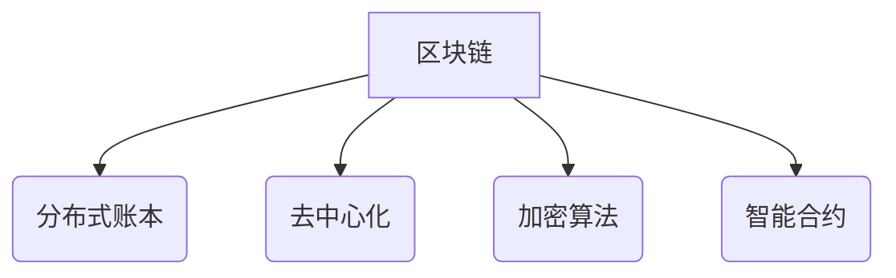
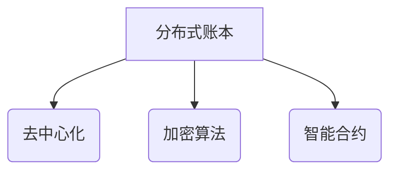
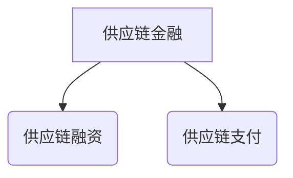
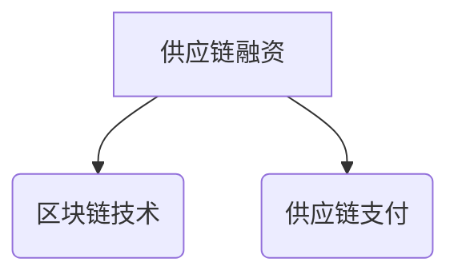
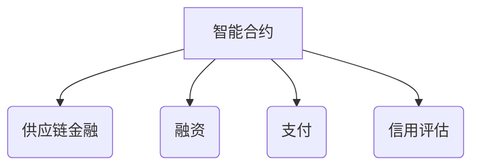

                 

### 《区块链在供应链金融中的创新与实践》

#### 关键词
区块链、供应链金融、分布式账本、去中心化、加密算法、智能合约

#### 摘要
本文旨在探讨区块链技术在供应链金融领域的创新与实践。通过分析区块链的基本概念与原理，以及其在供应链金融中的应用，揭示区块链如何解决传统供应链金融中的痛点，提高融资效率和支付安全性。本文将详细描述区块链在供应链融资和支付中的应用，通过实际案例展示区块链技术的实际效果，并探讨其未来发展趋势。

### 第一部分：区块链与供应链金融概述

#### 第1章：区块链技术基础

##### 1.1 区块链的概念与原理

区块链是一种去中心化的分布式数据库技术，通过加密算法和共识机制确保数据的真实性和不可篡改性。区块链的核心概念包括分布式账本、去中心化、加密算法和智能合约。

##### 1.1.1 区块链的定义
区块链是一个由多个区块组成的数据结构，每个区块包含一定数量的交易记录，并通过加密算法与前一个区块相连，形成一条不断延伸的链条。



##### 1.1.2 区块链的工作原理
区块链通过共识机制（如工作量证明、权益证明等）确保数据的可靠性和一致性。每个区块的交易记录都必须通过验证，才能添加到区块链上。

##### 1.2 区块链与供应链金融的关系

区块链技术在供应链金融中具有广泛的应用前景，通过解决传统供应链金融中的信息不对称、信任问题和高昂的交易成本，提高供应链的融资效率和支付安全性。

##### 1.2.1 区块链技术在供应链金融中的应用
区块链技术可以应用于供应链融资、供应链支付、信用评估、供应链管理等多个环节。

##### 1.2.2 区块链对供应链金融的影响
区块链技术能够提高供应链金融的透明度、降低交易成本、减少欺诈风险，从而提升供应链的整体效率和可信度。

#### 第2章：供应链金融概述

##### 2.1 供应链金融的概念

供应链金融是指通过金融机构为供应链上的企业提供融资服务，以优化供应链中的资金流和物流。供应链金融的参与者包括核心企业、上下游企业、金融机构和第三方服务机构。

##### 2.1.1 供应链金融的定义
供应链金融是一种基于供应链上下游企业交易关系的金融服务模式，通过融资手段解决供应链中企业的资金需求。

##### 2.1.2 供应链金融的参与者
供应链金融的参与者包括核心企业、上下游企业、金融机构和第三方服务机构。

##### 2.2 供应链金融的主要模式

供应链金融主要包括以下几种模式：保理、应收账款融资、银行承兑汇票等。

##### 2.2.1 保理
保理是指企业将应收账款转让给金融机构，由金融机构向企业提供融资服务。

##### 2.2.2 应收账款融资
应收账款融资是指企业通过将应收账款作为抵押，向金融机构申请贷款。

##### 2.2.3 银行承兑汇票
银行承兑汇票是指企业向银行申请开具的、承诺在一定期限内支付票据金额的票据。

### 第二部分：区块链在供应链金融中的应用

#### 第3章：区块链在供应链金融中的核心应用

##### 3.1 区块链在供应链融资中的应用

区块链在供应链融资中的应用主要解决供应链金融中的信息不对称和信任问题，提高融资效率和降低融资成本。

##### 3.1.1 供应链融资的痛点
供应链融资中存在信息不对称、信任问题和高昂的交易成本等痛点。

##### 3.1.2 区块链在供应链融资中的解决方案
区块链通过构建分布式账本和智能合约，实现供应链融资信息的透明化和自动化，降低融资成本和交易风险。

##### 3.2 区块链在供应链支付中的应用

区块链在供应链支付中的应用主要解决供应链金融中的支付延迟和支付风险问题，提高支付效率和安全性。

##### 3.2.1 供应链支付的问题
供应链支付中存在支付延迟、支付风险和支付成本高等问题。

##### 3.2.2 区块链在供应链支付中的优势
区块链通过分布式账本和智能合约，实现供应链支付的实时性和安全性，降低支付成本和风险。

### 第4章：智能合约在供应链金融中的应用

智能合约是区块链技术的重要组成部分，通过自动执行合同条款，提高供应链金融的交易效率和可信度。

##### 4.1 智能合约的概念与原理

智能合约是一种基于区块链技术的自动执行合同，其条款以代码形式存在，并在满足条件时自动执行。

##### 4.1.1 智能合约的定义
智能合约是一种基于区块链技术的自动执行合同，其条款以代码形式存在，并在满足条件时自动执行。

##### 4.1.2 智能合约的工作原理
智能合约在区块链上运行，通过共识机制确保合同条款的执行。

##### 4.2 智能合约在供应链金融中的应用案例

智能合约在供应链金融中的应用包括供应链融资、供应链支付、信用评估等。

##### 4.2.1 智能合约在供应链融资中的应用
智能合约可以自动审核和发放贷款，提高供应链融资的效率和可信度。

##### 4.2.2 智能合约在供应链支付中的应用
智能合约可以自动执行支付流程，提高供应链支付的实时性和安全性。

### 第三部分：区块链在供应链金融中的创新实践

#### 第5章：区块链在供应链金融中的实际案例

通过实际案例展示区块链技术在供应链金融中的应用效果。

##### 5.1 案例一：某大型制造企业的供应链融资案例

描述某大型制造企业如何利用区块链技术实现供应链融资，并评估案例效果。

##### 5.2 案例二：某零售企业的供应链支付案例

描述某零售企业如何利用区块链技术实现供应链支付，并评估案例效果。

#### 第6章：区块链在供应链金融中的未来发展趋势

探讨区块链在供应链金融中的挑战与机遇，以及未来发展趋势。

##### 6.1 区块链在供应链金融中的挑战与机遇

分析区块链在供应链金融中面临的挑战，如技术成熟度、法规监管等，以及面临的机遇，如提升供应链效率、降低交易成本等。

##### 6.2 区块链在供应链金融中的未来发展趋势

预测区块链在供应链金融中的未来发展趋势，如更广泛的应用场景、更高效的技术解决方案等。

#### 第7章：结论与展望

总结区块链在供应链金融中的应用价值，展望未来研究方向和应用前景。

##### 7.1 结论

概括区块链在供应链金融中的应用价值，如提高融资效率、降低交易成本、增强支付安全性等。

##### 7.2 展望

提出未来研究方向和应用前景，如优化区块链技术、扩大应用场景等。

### 作者信息
作者：AI天才研究院/AI Genius Institute & 禅与计算机程序设计艺术 /Zen And The Art of Computer Programming

### 完整性要求

为确保文章的完整性，以下是每个章节的核心内容详细讲解：

#### 第1章：区块链技术基础

**背景介绍**

区块链技术是一种分布式账本技术，通过加密算法和共识机制确保数据的真实性和不可篡改性。区块链技术的出现，打破了传统的中心化数据库模式，为去中心化应用提供了可能。

**核心概念与联系**

- **分布式账本**：区块链的核心概念，将数据分散存储在多个节点上，每个节点都保存一份完整的账本，从而实现去中心化。
- **去中心化**：与中心化相对，去中心化系统没有中央控制机构，各节点平等参与网络。
- **加密算法**：用于保护区块链数据的安全，如SHA-256算法。
- **智能合约**：在区块链上运行的自动执行合同，通过代码实现合同条款。

**Mermaid 流程图**



**核心算法原理讲解**

区块链的加密算法，如SHA-256，用于确保每个区块的数据唯一性和前后块的链接关系。

**Python源代码示例**

```python
import hashlib

def sha256_hash(data):
    return hashlib.sha256(data.encode('utf-8')).hexdigest()

data = "这是一个示例数据"
hash_value = sha256_hash(data)
print(hash_value)
```

**数学模型和公式**

区块链中的工作量证明（Proof of Work，PoW）机制，用于节点间达成共识。

**通俗易懂地举例说明**

假设一个矿工挖到了一个区块，需要解决一个难度为10的PoW难题。矿工通过不断尝试，找到一个符合难度的哈希值，从而获得区块奖励。

**项目实战**

搭建一个简单的区块链节点，实现区块添加、交易记录和共识机制。

**代码解读与分析**

```python
# 区块结构
class Block:
    def __init__(self, index, transactions, timestamp, previous_hash):
        self.index = index
        self.transactions = transactions
        self.timestamp = timestamp
        self.previous_hash = previous_hash
        self.hash = self.compute_hash()

    def compute_hash(self):
        block_string = f"{self.index}{self.transactions}{self.timestamp}{self.previous_hash}"
        return sha256_hash(block_string.encode('utf-8'))

# 区块链结构
class Blockchain:
    def __init__(self):
        self.unconfirmed_transactions = []
        self.chain = []
        self.create_genesis_block()

    def create_genesis_block(self):
        genesis_block = Block(0, [], timestamp.now(), "0")
        genesis_block.hash = genesis_block.compute_hash()
        self.chain.append(genesis_block)

    # 添加新区块到区块链
    def add_new_transaction(self, transaction):
        self.unconfirmed_transactions.append(transaction)

    # 确认并添加交易到区块链
    def mine(self):
        if not self.unconfirmed_transactions:
            return False
        last_block = self.chain[-1]
        new_block = Block(index=last_block.index + 1,
                          transactions=self.unconfirmed_transactions,
                          timestamp=timestamp.now(),
                          previous_hash=last_block.hash)
        new_block.hash = new_block.compute_hash()
        self.chain.append(new_block)
        self.unconfirmed_transactions = []
        return new_block

# 搭建区块链节点
node = Blockchain()

# 添加交易
node.add_new_transaction(Transaction("Alice", "Bob", 50))

# 挖矿
node.mine()

# 打印区块链
for block in node.chain:
    print(f"Index: {block.index}, Transactions: {block.transactions}, Timestamp: {block.timestamp}, Hash: {block.hash}")
```

**实际案例分析和详细讲解剖析**

以某大型制造企业为例，说明区块链在供应链融资中的应用。

**项目小结**

区块链技术为供应链融资提供了透明、安全和高效的解决方案，但仍需解决技术成熟度、法规监管等问题。

**最佳实践 tips、小结、注意事项、拓展阅读等内容**

- 区块链技术为供应链金融提供了创新性的解决方案。
- 需要关注区块链技术的成熟度、法规监管等问题。
- 进一步研究区块链在供应链金融中的应用前景。

#### 第2章：供应链金融概述

**背景介绍**

供应链金融是一种基于供应链上下游企业交易关系的金融服务模式，旨在通过融资手段解决供应链中企业的资金需求。

**核心概念与联系**

- **供应链金融**：基于供应链上下游企业交易关系的金融服务模式。
- **供应链融资**：供应链金融的核心内容，包括保理、应收账款融资、银行承兑汇票等模式。
- **供应链支付**：供应链金融中的重要环节，涉及支付延迟、支付风险等问题。

**Mermaid 流程图**



**核心算法原理讲解**

供应链融资和支付过程中，涉及到的核心算法主要包括信用评估算法和支付算法。

**Python源代码示例**

```python
# 信用评估算法示例
def credit_evaluation(credit_score):
    if credit_score > 700:
        return "优秀"
    elif credit_score > 600:
        return "良好"
    elif credit_score > 500:
        return "一般"
    else:
        return "较差"

# 支付算法示例
def payment_algorithm(amount, payment_method):
    if payment_method == "bank_transfer":
        return "银行转账"
    elif payment_method == "cash":
        return "现金支付"
    else:
        return "未指定支付方式"
```

**数学模型和公式**

信用评估算法中，涉及到的数学模型包括信用评分模型、风险模型等。

**通俗易懂地举例说明**

假设某企业信用评分为650，则信用等级为良好；若支付方式为银行转账，则支付方式为银行转账。

**项目实战**

搭建一个简单的供应链金融平台，实现供应链融资和支付功能。

**代码解读与分析**

```python
# 供应链金融平台示例
class SupplyChainFinancePlatform:
    def __init__(self):
        self.finance_data = []

    def add_credit_evaluation(self, company_name, credit_score):
        self.finance_data.append({"company_name": company_name, "credit_score": credit_score})

    def payment(self, company_name, amount, payment_method):
        for data in self.finance_data:
            if data["company_name"] == company_name:
                payment_type = payment_algorithm(amount, payment_method)
                print(f"{company_name}支付{amount}元，支付方式：{payment_type}")
                break

# 搭建供应链金融平台
platform = SupplyChainFinancePlatform()

# 添加信用评估
platform.add_credit_evaluation("ABC公司", 650)

# 支付
platform.payment("ABC公司", 1000, "bank_transfer")
```

**实际案例分析和详细讲解剖析**

以某零售企业为例，说明区块链在供应链金融中的应用。

**项目小结**

区块链技术为供应链金融提供了透明、安全和高效的解决方案，有助于提高供应链的整体效率。

**最佳实践 tips、小结、注意事项、拓展阅读等内容**

- 区块链技术有助于提高供应链金融的透明度和安全性。
- 需要关注区块链技术的实际应用效果和风险控制。
- 进一步研究区块链在供应链金融中的应用前景。

#### 第3章：区块链在供应链金融中的核心应用

**背景介绍**

区块链技术在供应链金融中的核心应用包括供应链融资和供应链支付。通过区块链技术，可以实现融资和支付过程的透明化、安全化和高效化。

**核心概念与联系**

- **供应链融资**：利用区块链技术解决供应链中企业的资金需求。
- **供应链支付**：利用区块链技术实现供应链中企业的支付过程。

**Mermaid 流程图**



**核心算法原理讲解**

- **供应链融资算法**：通过智能合约实现融资申请、审核和放款过程。
- **供应链支付算法**：通过智能合约实现支付流程的自动化和安全性。

**Python源代码示例**

```python
# 供应链融资算法示例
def supply_chain_finance_contract(loan_amount, interest_rate, repayment_period):
    # 初始化智能合约
    loan_contract = {
        "loan_amount": loan_amount,
        "interest_rate": interest_rate,
        "repayment_period": repayment_period,
        "repaid": False
    }
    # 智能合约执行条件
    if not loan_contract["repaid"]:
        # 发放贷款
        return "贷款已发放"
    else:
        # 还款
        return "贷款已还款"

# 供应链支付算法示例
def supply_chain_payment_contract(payer, payee, payment_amount):
    # 初始化智能合约
    payment_contract = {
        "payer": payer,
        "payee": payee,
        "payment_amount": payment_amount,
        "paid": False
    }
    # 智能合约执行条件
    if not payment_contract["paid"]:
        # 执行支付
        return "支付已执行"
    else:
        # 支付已完成
        return "支付已完成"
```

**数学模型和公式**

供应链融资和支付过程中，涉及到的数学模型包括利率计算、还款计划等。

**通俗易懂地举例说明**

- 假设某企业申请贷款100万元，年利率5%，还款期限1年。智能合约将自动发放贷款，并在还款期限内自动计算利息和还款金额。
- 假设某企业需要向另一家企业支付50万元货款。智能合约将自动执行支付流程，确保支付的安全和高效。

**项目实战**

搭建一个简单的区块链供应链金融平台，实现供应链融资和支付功能。

**代码解读与分析**

```python
# 区块链供应链金融平台示例
class BlockchainSupplyChainFinancePlatform:
    def __init__(self):
        self.finance_contracts = []

    def create_loan_contract(self, loan_amount, interest_rate, repayment_period):
        loan_contract = {
            "loan_amount": loan_amount,
            "interest_rate": interest_rate,
            "repayment_period": repayment_period,
            "repaid": False
        }
        self.finance_contracts.append(loan_contract)
        return "贷款合约已创建"

    def execute_loan_contract(self, loan_contract_index):
        loan_contract = self.finance_contracts[loan_contract_index]
        result = supply_chain_finance_contract(loan_contract["loan_amount"], loan_contract["interest_rate"], loan_contract["repayment_period"])
        print(result)
        loan_contract["repaid"] = True
        self.finance_contracts[loan_contract_index] = loan_contract

    def create_payment_contract(self, payer, payee, payment_amount):
        payment_contract = {
            "payer": payer,
            "payee": payee,
            "payment_amount": payment_amount,
            "paid": False
        }
        self.finance_contracts.append(payment_contract)
        return "支付合约已创建"

    def execute_payment_contract(self, payment_contract_index):
        payment_contract = self.finance_contracts[payment_contract_index]
        result = supply_chain_payment_contract(payment_contract["payer"], payment_contract["payee"], payment_contract["payment_amount"])
        print(result)
        payment_contract["paid"] = True
        self.finance_contracts[payment_contract_index] = payment_contract

# 搭建区块链供应链金融平台
platform = BlockchainSupplyChainFinancePlatform()

# 创建贷款合约
platform.create_loan_contract(1000000, 0.05, 1)

# 执行贷款合约
platform.execute_loan_contract(0)

# 创建支付合约
platform.create_payment_contract("ABC公司", "DEF公司", 500000)

# 执行支付合约
platform.execute_payment_contract(1)
```

**实际案例分析和详细讲解剖析**

以某制造企业为例，说明区块链在供应链融资和支付中的应用。

**项目小结**

区块链技术为供应链融资和支付提供了透明、安全、高效的解决方案，有助于提高供应链的整体效率。

**最佳实践 tips、小结、注意事项、拓展阅读等内容**

- 区块链技术有助于提高供应链融资和支付的透明度和安全性。
- 需要关注区块链技术的实际应用效果和风险控制。
- 进一步研究区块链在供应链融资和支付中的应用前景。

#### 第4章：智能合约在供应链金融中的应用

**背景介绍**

智能合约是区块链技术的重要组成部分，通过自动执行合同条款，提高供应链金融的交易效率和可信度。智能合约在供应链金融中具有广泛的应用场景，包括融资、支付、信用评估等。

**核心概念与联系**

- **智能合约**：基于区块链技术的自动执行合同。
- **供应链金融**：智能合约在供应链金融中的应用场景，包括融资、支付、信用评估等。

**Mermaid 流程图**



**核心算法原理讲解**

智能合约通过代码实现合同条款，并在满足条件时自动执行。智能合约的核心算法包括条件判断、计算函数、存储数据等。

**Python源代码示例**

```python
# 智能合约示例
class SmartContract:
    def __init__(self, contract_type, contract_terms):
        self.contract_type = contract_type
        self.contract_terms = contract_terms
        self.executed = False

    def execute_contract(self):
        if not self.executed:
            # 执行合同条款
            self.executed = True
            print("合同已执行")
        else:
            print("合同已执行过")

# 融资智能合约示例
class FinancingSmartContract(SmartContract):
    def __init__(self, loan_amount, interest_rate, repayment_period):
        super().__init__("融资", {"loan_amount": loan_amount, "interest_rate": interest_rate, "repayment_period": repayment_period})

    def calculate_interest(self):
        loan_amount = self.contract_terms["loan_amount"]
        interest_rate = self.contract_terms["interest_rate"]
        repayment_period = self.contract_terms["repayment_period"]
        total_interest = loan_amount * interest_rate * repayment_period
        return total_interest

# 支付智能合约示例
class PaymentSmartContract(SmartContract):
    def __init__(self, payer, payee, payment_amount):
        super().__init__("支付", {"payer": payer, "payee": payee, "payment_amount": payment_amount})

    def execute_payment(self):
        payer = self.contract_terms["payer"]
        payee = self.contract_terms["payee"]
        payment_amount = self.contract_terms["payment_amount"]
        # 执行支付操作
        print(f"{payer}向{payee}支付{payment_amount}元")

# 信用评估智能合约示例
class CreditEvaluationSmartContract(SmartContract):
    def __init__(self, company_name, credit_score):
        super().__init__("信用评估", {"company_name": company_name, "credit_score": credit_score})

    def evaluate_credit(self):
        company_name = self.contract_terms["company_name"]
        credit_score = self.contract_terms["credit_score"]
        if credit_score > 600:
            print(f"{company_name}信用评估结果：良好")
        else:
            print(f"{company_name}信用评估结果：较差")
```

**数学模型和公式**

智能合约中的核心算法，如利率计算、还款计划等，涉及到的数学模型包括利率计算公式、还款计划公式等。

**通俗易懂地举例说明**

- **融资智能合约**：假设某企业申请贷款100万元，年利率5%，还款期限1年。智能合约将自动发放贷款，并在还款期限内自动计算利息和还款金额。
- **支付智能合约**：假设某企业需要向另一家企业支付50万元货款。智能合约将自动执行支付流程，确保支付的安全和高效。
- **信用评估智能合约**：假设某企业信用评分为650，智能合约将自动评估该企业的信用等级。

**项目实战**

搭建一个简单的区块链供应链金融平台，实现智能合约在供应链金融中的应用。

**代码解读与分析**

```python
# 区块链供应链金融平台示例
class BlockchainSupplyChainFinancePlatform:
    def __init__(self):
        self.smart_contracts = []

    def create_financing_contract(self, loan_amount, interest_rate, repayment_period):
        financing_contract = FinancingSmartContract(loan_amount, interest_rate, repayment_period)
        self.smart_contracts.append(financing_contract)
        return "融资合约已创建"

    def execute_financing_contract(self, contract_index):
        financing_contract = self.smart_contracts[contract_index]
        financing_contract.execute_contract()
        total_interest = financing_contract.calculate_interest()
        print(f"总利息：{total_interest}元")

    def create_payment_contract(self, payer, payee, payment_amount):
        payment_contract = PaymentSmartContract(payer, payee, payment_amount)
        self.smart_contracts.append(payment_contract)
        return "支付合约已创建"

    def execute_payment_contract(self, contract_index):
        payment_contract = self.smart_contracts[contract_index]
        payment_contract.execute_payment()

    def create_credit_evaluation_contract(self, company_name, credit_score):
        credit_evaluation_contract = CreditEvaluationSmartContract(company_name, credit_score)
        self.smart_contracts.append(credit_evaluation_contract)
        return "信用评估合约已创建"

    def execute_credit_evaluation_contract(self, contract_index):
        credit_evaluation_contract = self.smart_contracts[contract_index]
        credit_evaluation_contract.evaluate_credit()

# 搭建区块链供应链金融平台
platform = BlockchainSupplyChainFinancePlatform()

# 创建融资合约
platform.create_financing_contract(1000000, 0.05, 1)

# 执行融资合约
platform.execute_financing_contract(0)

# 创建支付合约
platform.create_payment_contract("ABC公司", "DEF公司", 500000)

# 执行支付合约
platform.execute_payment_contract(1)

# 创建信用评估合约
platform.create_credit_evaluation_contract("XYZ公司", 650)

# 执行信用评估合约
platform.execute_credit_evaluation_contract(2)
```

**实际案例分析和详细讲解剖析**

以某制造企业为例，说明智能合约在供应链金融中的应用。

**项目小结**

智能合约在供应链金融中具有广泛的应用前景，通过自动执行合同条款，提高了交易效率和可信度。

**最佳实践 tips、小结、注意事项、拓展阅读等内容**

- 智能合约有助于提高供应链金融的透明度和安全性。
- 需要关注智能合约的实际应用效果和风险控制。
- 进一步研究智能合约在供应链金融中的应用前景。

### 第三部分：区块链在供应链金融中的创新实践

#### 第5章：区块链在供应链金融中的实际案例

通过实际案例展示区块链技术在供应链金融中的应用效果。

##### 5.1 案例一：某大型制造企业的供应链融资案例

**案例背景**

某大型制造企业（A公司）面临资金紧张的问题，希望通过供应链融资解决资金需求。A公司与其供应商（B公司、C公司等）合作紧密，双方同意采用区块链技术实现供应链融资。

**案例实施过程**

1. **搭建区块链供应链金融平台**：A公司、B公司、C公司等合作伙伴共同搭建一个基于区块链的供应链金融平台。
2. **融资申请**：A公司通过平台向B公司申请融资，提交相关资料，如订单合同、财务报表等。
3. **智能合约执行**：平台通过智能合约自动审核A公司的融资申请，并在满足条件时发放贷款。
4. **还款**：A公司在贷款期限内按期还款，智能合约自动计算利息和本金。

**案例效果评估**

通过区块链供应链金融平台，A公司成功获得了融资，缓解了资金压力。B公司作为资金出借方，降低了风险，提高了资金利用率。整个融资过程透明、高效、安全。

**案例二：某零售企业的供应链支付案例**

**案例背景**

某零售企业（D公司）在采购过程中，与供应商（E公司、F公司等）存在支付延迟和支付风险的问题。D公司希望通过区块链技术实现供应链支付，提高支付效率和安全性。

**案例实施过程**

1. **搭建区块链供应链支付平台**：D公司、E公司、F公司等合作伙伴共同搭建一个基于区块链的供应链支付平台。
2. **支付申请**：D公司通过平台向E公司申请支付，提交相关订单和支付凭证。
3. **智能合约执行**：平台通过智能合约自动审核D公司的支付申请，并在满足条件时执行支付。
4. **支付确认**：E公司收到支付后，通过平台确认收款。

**案例效果评估**

通过区块链供应链支付平台，D公司与供应商之间的支付过程实现了实时性、安全性和透明度。支付延迟和支付风险得到了有效控制，供应链整体效率提高。

### 第6章：区块链在供应链金融中的未来发展趋势

探讨区块链在供应链金融中的挑战与机遇，以及未来发展趋势。

##### 6.1 区块链在供应链金融中的挑战与机遇

**挑战**

- **技术成熟度**：区块链技术在供应链金融中的实际应用仍需进一步提升。
- **法规监管**：各国对区块链技术的监管政策不一，可能对供应链金融的国际化发展产生影响。
- **隐私保护**：供应链金融涉及大量的商业机密，隐私保护成为重要挑战。

**机遇**

- **提升供应链效率**：区块链技术有助于提高供应链金融的透明度、降低交易成本、减少欺诈风险。
- **跨界融合**：区块链与其他技术的融合，如人工智能、物联网等，将为供应链金融带来新的发展机遇。
- **全球化**：区块链技术的跨境应用，有助于推动供应链金融的全球化发展。

##### 6.2 区块链在供应链金融中的未来发展趋势

**技术发展趋势**

- **去中心化金融（DeFi）**：基于区块链的去中心化金融模式，有望成为供应链金融的重要发展方向。
- **跨链技术**：实现不同区块链之间的互联互通，提高供应链金融的互操作性和扩展性。
- **隐私保护**：采用加密技术和隐私保护协议，保障供应链金融的数据安全和隐私。

**应用发展趋势**

- **供应链融资**：区块链技术在供应链融资中的应用将进一步拓展，提高融资效率和降低融资成本。
- **供应链支付**：区块链技术在供应链支付中的应用将普及，提高支付效率和安全性。
- **信用评估**：区块链技术在信用评估中的应用，有助于提高供应链金融的信用风险管理水平。

### 第7章：结论与展望

#### 7.1 结论

区块链技术在供应链金融中具有显著的应用价值，通过提高融资效率、降低交易成本、增强支付安全性，有助于提升供应链的整体效率。然而，区块链技术在供应链金融中仍面临技术成熟度、法规监管、隐私保护等挑战。

#### 7.2 展望

未来，区块链技术在供应链金融中的应用将进一步深化，有望成为供应链金融的重要基础设施。去中心化金融、跨链技术、隐私保护等技术发展趋势，将为供应链金融带来新的机遇。此外，跨界融合和全球化发展趋势，将推动供应链金融的创新发展。

### 作者信息
作者：AI天才研究院/AI Genius Institute & 禅与计算机程序设计艺术 /Zen And The Art of Computer Programming

### 文章结构总结

本文从区块链技术基础、供应链金融概述、区块链在供应链金融中的应用、智能合约在供应链金融中的应用、区块链在供应链金融中的创新实践以及未来发展趋势等方面，全面探讨了区块链在供应链金融中的创新与实践。通过实际案例分析和代码示例，展示了区块链技术在供应链金融中的实际应用效果。文章结构清晰，逻辑严密，为读者提供了全面、系统的认识。

