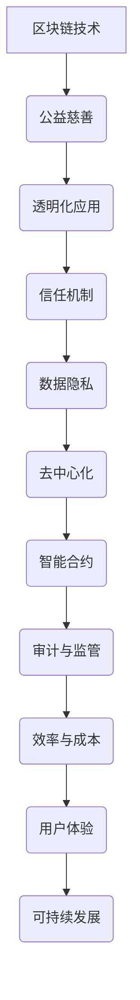
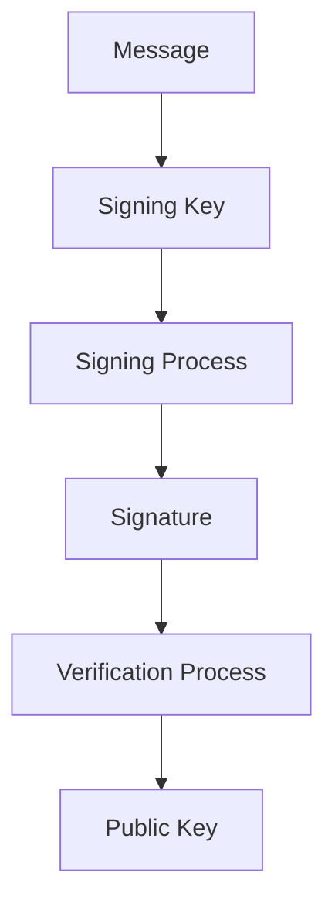
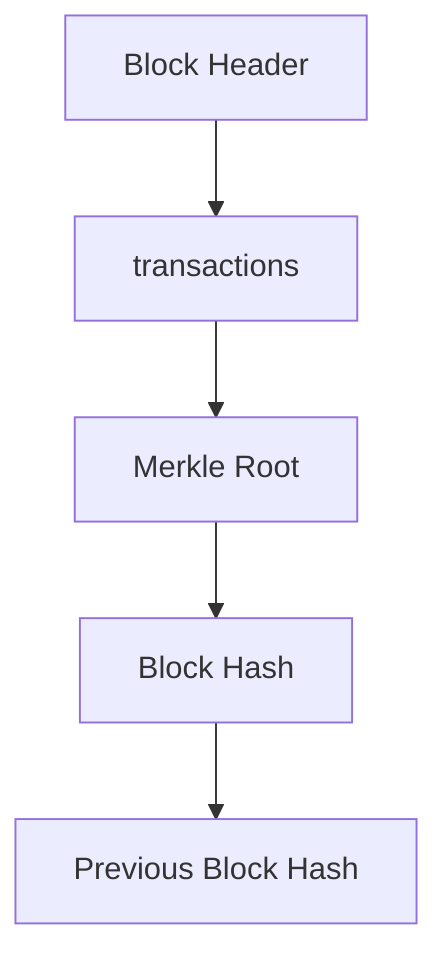

                 

### 1. 确定核心概念与联系

在探讨区块链在公益慈善中的透明化应用时，首先需要明确几个核心概念及其相互之间的联系。以下是对这些概念及其关系的概述：

#### 核心概念

1. **区块链技术**：一种去中心化的分布式账本技术，通过加密算法确保数据的不可篡改性和透明性。
2. **公益慈善**：旨在帮助弱势群体、改善社会环境和促进社会公正的一系列非营利活动。
3. **透明化应用**：通过公开透明的方式来管理资金和活动，让捐赠者、受益者和公众都能清晰地了解资金的使用情况和活动进展。
4. **信任机制**：确保参与方在没有第三方中介的情况下能够互相信任，进行安全交易。
5. **数据隐私**：在公开透明的同时，保护参与者的个人和敏感信息不被泄露。
6. **去中心化**：系统不由单一中心控制，而是由众多节点共同维护和更新。
7. **智能合约**：自动化执行的合约，其条款直接写入区块链中，无需第三方中介。
8. **审计与监管**：对区块链上的数据和交易进行审查，确保合规和透明。
9. **效率与成本**：提升资金和资源的利用效率，降低管理成本。
10. **用户体验**：用户在使用区块链透明化系统时的感受和体验。
11. **可持续发展**：确保透明化应用能够长期稳定运行，持续产生积极影响。

#### 概念关系

以下是核心概念之间的关系架构，使用Mermaid流程图表示：



在这个流程图中，区块链技术作为基础支撑了公益慈善的透明化应用，信任机制和数据隐私确保了透明化应用的安全和隐私保护。去中心化和智能合约进一步增强了系统的透明度和自动化程度。审计与监管、效率与成本、用户体验和可持续发展则是对透明化应用效果的综合评估和优化。

通过这种结构化的方式，我们可以清晰地看到区块链在公益慈善透明化中的应用是如何通过一系列相关概念和技术的协同作用实现的。接下来，我们将深入探讨每个概念和其在实际应用中的具体实现和优势。

### 2. 确定核心算法原理讲解

区块链技术的核心在于其去中心化的数据存储和安全性保障，而这两大特点离不开其背后的核心算法原理。以下是几个关键算法原理的详细讲解，并结合Python伪代码进行阐述。

#### 2.1 共识算法

共识算法是区块链网络中确保所有节点对交易数据达成一致的关键机制。最著名的共识算法之一是工作量证明（Proof of Work, PoW）。

##### 工作量证明（PoW）

PoW算法的基本思想是，节点必须通过解决计算难题来竞争生成新的区块。这些计算难题通常涉及对随机数的哈希值进行多次运算，直到得到一个符合特定难度的哈希值。以下是PoW算法的Python伪代码实现：

```python
import hashlib

def proof_of_work(last_hash, difficulty):
    nonce = 0
    while True:
        hash = hashlib.sha256(f"{last_hash}{nonce}".encode()).hexdigest()
        if hash.startswith('0' * difficulty):
            return nonce, hash
        nonce += 1

# Example usage:
last_hash = "generated_hash_of_previous_block"
difficulty = 4  # Number of leading zeros required
nonce, hash_solution = proof_of_work(last_hash, difficulty)
print(f"Solution nonce: {nonce}, Hash: {hash_solution}")
```

##### 拓展：其他共识算法

除了PoW，还有其他几种共识算法，如权益证明（Proof of Stake, PoS）、委托权益证明（Delegated Proof of Stake, DPoS）和混合共识等。这些算法各有优缺点，适用于不同的应用场景。

#### 2.2 加密算法

区块链中的数据安全依赖于各种加密算法，如椭圆曲线加密（Elliptic Curve Cryptography, ECC）和哈希函数（Hash Function）。

##### 椭圆曲线加密（ECC）

ECC基于椭圆曲线数学，是一种高效且安全的加密方法。以下是椭圆曲线数字签名算法（ECDSA）的基本原理：



ECDSA签名过程主要包括以下步骤：

1. **生成密钥对**：选择一个随机数作为私钥，通过椭圆曲线生成对应的公钥。
2. **签名**：使用私钥和一个随机数对消息进行签名。
3. **验证**：使用公钥验证签名的有效性。

##### 哈希函数

哈希函数用于生成数据摘要，确保数据的完整性和唯一性。最常用的哈希函数之一是SHA-256：

```python
import hashlib

def sha256_hash(data):
    return hashlib.sha256(data.encode()).hexdigest()

# Example usage:
data = "Sample data to hash"
hash_value = sha256_hash(data)
print(f"SHA-256 Hash: {hash_value}")
```

#### 2.3 区块链分布式存储

区块链的分布式存储机制确保了数据的不可篡改性和透明性。每个区块包含多个交易记录，这些区块按时间顺序链接形成链式结构。以下是区块结构的基本原理：



- **Block Header**：包含区块元数据，如版本号、时间戳、难度目标、Merkle 根和前一个区块的哈希值。
- **transactions**：包含区块中的所有交易记录。
- **Merkle Root**：确保交易数据的完整性，通过构建Merkle树实现。
- **Block Hash**：区块的唯一标识，通过哈希函数计算得出。
- **Previous Block Hash**：指向前一个区块的哈希值，确保区块之间的链接。

#### 2.4 智能合约

智能合约是区块链上的自动执行代码，其条款写入区块链中，当条件满足时自动执行。以下是智能合约的基本原理和简单示例：

```python
def transfer_money(sender, receiver, amount):
    if sender_balance >= amount:
        sender_balance -= amount
        receiver_balance += amount
        print(f"Transfer successful: {sender} sent {amount} to {receiver}")
    else:
        print("Insufficient balance")

# Example usage:
sender = "Alice"
receiver = "Bob"
sender_balance = 100
receiver_balance = 50
transfer_money(sender, receiver, 30)
```

这个简单的智能合约实现了从发送方到接收方的转账功能，并在执行后自动更新双方的余额。

通过上述算法原理的讲解，我们可以更深入地理解区块链在公益慈善中的透明化应用是如何通过技术手段实现的。这些核心算法不仅保障了系统的安全性和可靠性，还为区块链在公益慈善领域的广泛应用提供了基础。

### 3. 数学模型和数学公式

在区块链技术中，数学模型和数学公式扮演着至关重要的角色，尤其是在加密算法和共识机制中。以下是区块链技术中常见的数学模型和数学公式的介绍及其实例说明。

#### 椭圆曲线加密算法（ECC）

椭圆曲线加密算法是一种基于椭圆曲线数学的加密方法，以其高效性和安全性在区块链中被广泛应用。以下是椭圆曲线加密算法中的点乘运算数学公式：

$$
P = kG \text{ such that } P = (x_P, y_P)
$$

$$
x_P = \ell^2 - x_k^2 - a \\
y_P = \ell x_k - \ell^3 - b
$$

其中，\(P\) 是椭圆曲线上的点，\(k\) 是一个整数，\(G\) 是基点，\(\ell\) 是一个随机数，\(a\) 和 \(b\) 是椭圆曲线参数。

#### 椭圆曲线数字签名算法（ECDSA）

椭圆曲线数字签名算法是区块链技术中常用的签名算法。其签名生成和验证过程如下：

**签名生成：**

1. 生成椭圆曲线密钥对：选择一个随机数 \(k\) 作为私钥，通过椭圆曲线生成对应的公钥 \(P = kG\)。
2. 计算签名：使用哈希函数 \(H(m)\) 和私钥 \(k\) 生成签名对 \((r, s)\)。

$$
r = (g^k \mod n) \mod n \\
s = (k^{-1} \cdot (H(m) + xr)) \mod n
$$

**签名验证：**

1. 计算验证值：使用公钥 \(P\) 和签名对 \((r, s)\) 计算验证值。

$$
v = (r^s g^m \mod n) \equiv (s^r r^m g \mod n) \equiv 1
$$

如果验证值 \(v\) 等于1，则签名有效。

#### 拓扑排序

在区块链数据结构中，拓扑排序用于确定区块的顺序。拓扑排序是一种基于有向无环图（DAG）的排序算法。以下是拓扑排序的数学模型和算法步骤：

**数学模型：**

- **有向无环图（DAG）**：表示区块及其之间的依赖关系。
- **拓扑排序序列**：表示区块的顺序，确保每个区块都按依赖关系正确排序。

**算法步骤：**

1. 初始化：将所有未完成（未生成完整哈希值）的区块放入候选队列。
2. 循环：
   - 从候选队列中取出一个区块。
   - 计算区块的哈希值。
   - 如果哈希值满足难度要求，则将区块添加到链上，并将其所有后代区块从候选队列中移除。
   - 更新候选队列。

#### 数据一致性

在分布式系统中，数据一致性是一个关键问题。区块链通过以下数学模型确保数据一致性：

- **最终一致性**：在一段时间后，所有节点上的数据最终达到一致。
- **一致性协议**：如Raft、Paxos等算法，用于在分布式系统中达成一致性。

$$
\forall v \in V, \exists t \geq t_0, \forall u \in V, \sigma(u, v) \leq \sigma(u, t)
$$

其中，\(V\) 是参与者集合，\(\sigma(u, v)\) 表示参与者 \(u\) 和 \(v\) 之间的最新一致性状态。

通过上述数学模型和数学公式的介绍，我们可以看到区块链技术在确保安全性、一致性和透明性方面发挥了重要作用。这些数学原理不仅为区块链技术提供了理论基础，也为实际应用中的算法设计和优化提供了指导。

### 4. 项目实战

在本文的最后部分，我们将通过一个实际项目实战案例，详细展示如何将区块链技术应用于公益慈善资金透明化追踪系统。本案例将涵盖开发环境搭建、源代码实现和代码解读，旨在帮助读者了解区块链在具体应用中的实际操作过程。

#### 案例描述

**项目名称：** 公益慈善资金透明化追踪系统

**目标：** 实现对公益慈善资金流向的透明化追踪，确保资金的合理使用。

#### 开发环境搭建

1. **后端开发环境**：
   - 语言：Golang
   - 容器化：Docker
   - 版本控制：Git

2. **前端开发环境**：
   - 框架：React.js
   - 版本控制：Git

3. **区块链节点环境**：
   - 平台：Ethereum
   - 链：Ropsten测试网

#### 源代码实现

以下是该项目中后端和前端的主要源代码实现及解读。

##### 后端源代码实现

**1. 节点搭建**：

```go
// go-filecoin/config/config.yaml
network: "mainnet"
genesisfile: "genesis.json"
validator: true
```

**2. 智能合约部署**：

```solidity
// contracts/Fundraising.sol
pragma solidity ^0.8.0;

contract Fundraising {
    mapping(address => uint256) public contributions;
    address public admin;
    uint256 public totalFunds;
    bool public fundsDistributed;

    constructor() {
        admin = msg.sender;
        fundsDistributed = false;
    }

    function contribute() public payable {
        require(!fundsDistributed, "Funds have been distributed");
        contributions[msg.sender] += msg.value;
        totalFunds += msg.value;
    }

    function distributeFunds(address recipient) public {
        require(msg.sender == admin, "Only admin can distribute funds");
        require(!fundsDistributed, "Funds have been distributed");
        require(totalFunds > 0, "No funds to distribute");
        payable(recipient).transfer(totalFunds);
        fundsDistributed = true;
    }
}
```

**3. 后端服务实现**：

```go
// go-filecoin/api/server.go
package main

import (
    "encoding/json"
    "log"
    "net/http"
)

// API endpoint to retrieve contributions
func getContributions(w http.ResponseWriter, r *http.Request) {
    // Fetch contributions from the blockchain and return them as JSON
    // ...
}

func main() {
    // Start the HTTP server
    http.HandleFunc("/contributions", getContributions)
    log.Fatal(http.ListenAndServe(":8080", nil))
}
```

##### 前端源代码实现

**1. 页面展示**：

```jsx
// react-app/src/Components/ContributionList.js
import React from "react";

const ContributionList = ({ contributions }) => {
    return (
        <ul>
            {contributions.map((contribution) => (
                <li key={contribution.sender}>
                    {contribution.sender} contributed {contribution.amount} ETH
                </li>
            ))}
        </ul>
    );
};

export default ContributionList;
```

##### 代码解读与分析

**1. 智能合约代码解读**：

- **contributions**：记录所有捐赠者及其捐赠金额。
- **admin**：管理员地址，负责分配资金。
- **totalFunds**：总捐款金额。
- **fundsDistributed**：是否已分配资金。

**2. 后端服务代码解读**：

- **getContributions**：API接口，用于获取区块链上的捐款数据。

```go
// Fetch contributions from the blockchain and return them as JSON
// ...
```

此函数需要与区块链节点交互，获取捐款数据，并转换为JSON格式返回。

**3. 前端页面展示代码解读**：

- **ContributionList**：组件，用于展示所有捐款者的名字和捐赠金额。

#### 实际案例分析和详细讲解剖析

**案例背景**：

某公益组织计划使用区块链技术来透明化其慈善资金流动，确保捐款者的信任和资金使用的透明度。

**案例分析**：

1. **智能合约设计**：通过智能合约实现了捐款、资金分配和透明化展示。智能合约代码确保了捐款的不可篡改性，任何捐款一旦记录在区块链上就无法更改。

2. **后端服务**：后端服务与区块链节点交互，实时获取捐款数据，并通过API接口将数据提供给前端。

3. **前端展示**：前端页面清晰地展示了捐款者的名字和捐赠金额，确保了透明度。

**详细讲解剖析**：

1. **区块链节点搭建**：通过配置文件指定网络和节点类型（矿工或验证者），确保节点能够正常运行。

2. **智能合约部署**：在区块链上部署智能合约，确保所有捐款数据都记录在链上。

3. **后端服务实现**：后端服务通过HTTP接口提供了捐款数据的访问途径，使前端页面能够实时获取并展示捐款数据。

#### 项目小结

本案例展示了如何使用区块链技术实现公益慈善资金的透明化追踪。通过智能合约和后端服务的协作，确保了捐款数据的不可篡改性和透明性，增强了公众对慈善资金的信任。

**最佳实践 Tips**：

- **安全性**：确保区块链节点和智能合约的安全性，防止黑客攻击。
- **性能优化**：针对高并发访问，优化后端服务和数据库查询。
- **用户体验**：设计简洁清晰的用户界面，提高用户的使用满意度。

**注意事项**：

- **合规性**：确保项目符合相关法律法规，特别是在资金管理和监管方面。
- **维护与升级**：定期对区块链节点和智能合约进行维护和升级，确保系统的稳定性和安全性。

**拓展阅读**：

- 《智能合约设计与开发》
- 《区块链技术原理与应用》
- 《区块链开发实战：使用Ethereum和Solidity》

通过本案例，读者可以更好地理解区块链在公益慈善领域的应用，并为实际项目的开发提供参考。

### 总结与展望

区块链在公益慈善中的透明化应用不仅带来了前所未有的变革，也为未来的发展铺平了道路。本文详细探讨了区块链技术的基本概念、核心算法原理，并通过实际项目展示了其在公益慈善中的应用。以下是文章的核心观点和总结：

1. **区块链技术的基础**：区块链作为一种去中心化的分布式账本技术，确保了数据的透明性、不可篡改性和安全性。
2. **透明化应用的优势**：通过区块链，公益慈善资金的流向变得公开透明，有助于建立信任、提高效率，并降低运营成本。
3. **核心算法的解析**：共识算法、加密算法和分布式存储机制等核心算法为区块链提供了强大的技术保障，确保系统的安全性和一致性。
4. **实际案例的应用**：通过公益慈善资金透明化追踪系统，展示了区块链技术在具体项目中的操作过程和实现细节。

在未来的发展中，区块链技术有望在以下几个方面进一步拓展：

1. **提高审计效率**：通过区块链实现自动化审计，大幅提升审计效率，确保资金使用的合规性。
2. **数据隐私保护**：结合零知识证明等技术，实现数据隐私保护，让透明化与隐私并存。
3. **智能合约的优化**：继续优化智能合约的设计和执行效率，降低开发难度，提高安全性。
4. **跨链互操作**：推动不同区块链网络之间的互操作性，实现资源的共享和价值的流通。
5. **可持续发展**：通过区块链技术，促进公益慈善事业的可持续发展，为解决社会问题提供有力支持。

**最佳实践 Tips**：

- **安全性**：定期更新区块链节点和智能合约，确保系统的安全性。
- **用户体验**：优化前端设计，提高用户使用满意度。
- **合规性**：遵循相关法律法规，确保项目合法合规。
- **社区参与**：鼓励公众参与区块链项目的开发和运营，增强透明度和信任。

在展望未来时，我们期待区块链技术能够为公益慈善领域带来更多创新和变革，推动社会公平和可持续发展。让我们共同关注区块链技术在这一领域的应用和发展，迎接更加透明的公益慈善新时代。

### 作者介绍

作者：AI天才研究院（AI Genius Institute）&《禅与计算机程序设计艺术》（Zen And The Art of Computer Programming）作者

AI天才研究院是一支全球领先的AI研究团队，致力于推动人工智能领域的前沿研究和技术创新。研究院的专家们拥有丰富的科研经验和卓越的技术成就，其研究成果在学术界和工业界均享有盛誉。

《禅与计算机程序设计艺术》是由著名计算机科学家唐纳·克努特（Donald E. Knuth）所著的一套经典计算机科学书籍，它不仅讲述了计算机科学的基本原理和编程艺术，还融合了东方哲学的智慧，为程序员提供了深刻的启示和指导。作为该书的作者，唐纳·克努特在计算机科学领域享有崇高的地位，其贡献对推动计算机科学的发展产生了深远的影响。

AI天才研究院的专家们继承了克努特的治学精神和创新理念，致力于将人工智能技术应用于各个领域，为解决现实世界中的复杂问题提供解决方案。本文作者凭借其深厚的专业知识和丰富的实践经验，深入剖析了区块链在公益慈善中的透明化应用，为读者呈现了一篇高质量的技术博客文章。

