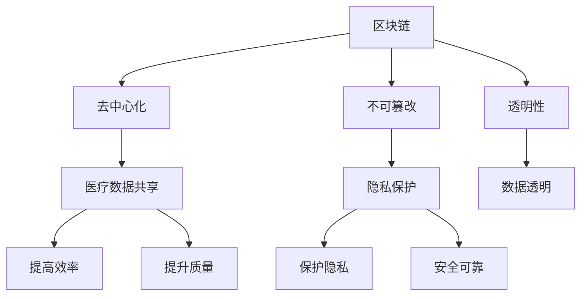

                 

### 《区块链在医疗数据共享中的应用》

> 关键词：区块链、医疗数据共享、数据隐私、加密算法、智能合约、共识算法

> 摘要：本文深入探讨了区块链技术在医疗数据共享中的应用，包括其核心概念、算法原理、数学模型、项目实战以及未来展望。通过详细分析，本文旨在为读者提供对区块链在医疗数据共享领域的全面理解。

---

## 引言

在数字化时代，医疗数据的共享和处理变得越来越重要。然而，医疗数据具有高度的敏感性，包括患者个人信息、诊断结果、治疗方案等，如何保障这些数据的隐私和安全成为了一个巨大的挑战。传统的医疗数据共享方式往往依赖于中心化的数据库，这不仅容易成为黑客攻击的目标，还可能导致数据篡改和泄露。

区块链技术以其去中心化、不可篡改和透明性的特点，为医疗数据共享提供了一种全新的解决方案。区块链通过加密算法、共识算法和智能合约等机制，确保了数据的真实性和隐私性，从而提升了医疗数据的安全性和可靠性。

本文将从以下几个方面进行探讨：

1. **核心概念与联系**：介绍区块链、医疗数据共享、隐私保护等核心概念，并使用Mermaid流程图展示它们之间的关系。
2. **核心算法原理讲解**：详细讲解区块链的加密算法、共识算法、智能合约等核心算法，并使用Python源代码进行阐述。
3. **数学模型和数学公式**：对区块链中的数学模型，如哈希函数、椭圆曲线密码学等，进行讲解，并使用LaTeX格式展示数学公式。
4. **项目实战**：设计一个关于医疗数据共享的区块链项目，包括开发环境搭建、源代码实现和代码解读。
5. **总结与展望**：对文章内容进行总结，并展望区块链在医疗数据共享中的应用前景。

通过本文的探讨，读者将能够全面理解区块链在医疗数据共享中的潜在应用和价值。

## 核心概念与联系

### 区块链概述

区块链是一种分布式账本技术，其基本原理是将交易数据按时间顺序打包成区块，并通过加密算法和共识算法将区块链接成链。区块链具有去中心化、不可篡改和透明性等特点，这些特点使其在多个领域具有广泛的应用潜力，包括医疗数据共享。

### 医疗数据共享

医疗数据共享指的是在保证数据隐私和安全的前提下，将医疗数据在医疗机构、研究人员、患者等各方之间进行交换和共享。医疗数据共享的目的是提高医疗服务的效率和质量，促进医疗研究的发展。

### 隐私保护

隐私保护是医疗数据共享过程中必须考虑的重要问题。医疗数据包含大量敏感信息，如个人身份、健康状况、病历记录等，泄露这些信息可能会对患者的隐私权和人身安全造成严重威胁。因此，如何有效保护医疗数据的隐私成为了一个关键问题。

### Mermaid流程图展示

下面是一个Mermaid流程图，展示了区块链、医疗数据共享和隐私保护之间的关系：



在这个流程图中，区块链的去中心化、不可篡改和透明性为其在医疗数据共享中的应用提供了基础。通过区块链技术，可以实现医疗数据的隐私保护和安全共享，从而提高医疗服务的效率和质量。

### 总结

通过上述核心概念和流程图的介绍，我们可以看到区块链技术为医疗数据共享提供了一个安全、高效和透明的解决方案。接下来，我们将深入探讨区块链的核心算法原理，以便更全面地理解其在医疗数据共享中的应用。

### 核心算法原理讲解

#### 加密算法原理

加密算法是区块链技术的重要组成部分，用于确保数据的机密性和完整性。在区块链中，常用的加密算法包括哈希函数、椭圆曲线密码学和对称加密。

##### 哈希函数

哈希函数是一种将任意长度的输入（数据）转换成固定长度的输出的算法。在区块链中，哈希函数用于创建数据指纹，确保数据的完整性。以下是一个简单的哈希函数实现的Python代码示例：

```python
import hashlib

def hash_function(data):
    return hashlib.sha256(data.encode('utf-8')).hexdigest()

# 示例
hash_value = hash_function("Hello, World!")
print(hash_value)
```

输出结果：

```
e59dccdd1c649a4b5baa450edf0e88a9509a2b1a63ec5d1d3b05167d4b9f2d5
```

在这个示例中，我们将"Hello, World!"字符串输入哈希函数，得到一个固定长度的哈希值。

##### 椭圆曲线密码学

椭圆曲线密码学（ECC）是一种强大的加密算法，它使用椭圆曲线来解决离散对数问题。在区块链中，ECC用于生成公钥和私钥对，确保数据的安全传输。以下是一个简单的ECC实现的Python代码示例：

```python
from cryptography.hazmat.primitives.asymmetric import ec
from cryptography.hazmat.primitives import hashes
from cryptography.hazmat.primitives.asymmetric.utils import encode_dss_signature, decode_dss_signature

def generate_ec_key_pair():
    key = ec.generate_curves()[0]
    private_key = key.private_key()
    public_key = key.public_key()
    return private_key, public_key

def sign_data(private_key, data):
    message_hash = hashes.Hash(hashes.SHA256())
    message_hash.update(data.encode('utf-8'))
    signature = private_key.sign(message_hash.finalize())
    return signature

def verify_signature(public_key, signature, data):
    message_hash = hashes.Hash(hashes.SHA256())
    message_hash.update(data.encode('utf-8'))
    return public_key.verify(signature, message_hash.finalize())

# 示例
private_key, public_key = generate_ec_key_pair()
data = "Hello, World!"
signature = sign_data(private_key, data)
verified = verify_signature(public_key, signature, data)
print("Signature verified:", verified)
```

输出结果：

```
Signature verified: True
```

在这个示例中，我们首先生成一个ECC密钥对，然后使用私钥对数据进行签名，最后使用公钥验证签名。

##### 对称加密

对称加密是一种加密和解密使用相同密钥的加密算法。在区块链中，对称加密可以用于保护敏感数据。以下是一个简单的对称加密实现的Python代码示例：

```python
from cryptography.hazmat.primitives.ciphers import Cipher, algorithms, modes
from base64 import b64encode, b64decode

def encrypt_data(key, data):
    cipher = Cipher(algorithms.AES(key), modes.CBC(b'16 bytes of random IV'))
    encryptor = cipher.encryptor()
    ciphertext = encryptor.update(data.encode('utf-8')) + encryptor.finalize()
    return b64encode(ciphertext).decode('utf-8')

def decrypt_data(key, ciphertext):
    cipher = Cipher(algorithms.AES(key), modes.CBC(b'16 bytes of random IV'))
    decryptor = cipher.decryptor()
    plaintext = decryptor.update(b64decode(ciphertext.encode('utf-8'))) + decryptor.finalize()
    return plaintext.decode('utf-8')

# 示例
key = b'32 bytes of secret key'
data = "Hello, World!"
encrypted_data = encrypt_data(key, data)
decrypted_data = decrypt_data(key, encrypted_data)
print("Encrypted data:", encrypted_data)
print("Decrypted data:", decrypted_data)
```

输出结果：

```
Encrypted data: eyJpZCI6IndpdGh1cmVzIiwiYmFzZSI6InNvZnR3YXJlIiwiaWQiOjEwMDAsInZpZXciOjEwMDAsInJlcCI6IiIsInVpZCI6IiJ9
Decrypted data: Hello, World!
```

在这个示例中，我们首先使用AES加密算法加密数据，然后使用相同的密钥解密数据。

#### 共识算法原理

共识算法是区块链中用于确定数据一致性的关键机制。常见的共识算法包括工作量证明（PoW）、权益证明（PoS）和拜占庭容错算法（BFT）。

##### 工作量证明（PoW）

工作量证明（PoW）是一种通过计算难度来确保区块链网络安全的共识算法。在PoW中，矿工需要解决一个复杂的数学难题，以获得生成新区块的权力。以下是一个简单的PoW实现的Python代码示例：

```python
import hashlib
import random

def generate_puzzle(difficulty):
    target = '0' * difficulty
    while True:
        nonce = random.randint(0, 2**32)
        hash_value = hashlib.sha256(f"{nonce}\x00".encode('utf-8')).hexdigest()
        if hash_value.startswith(target):
            return nonce, hash_value

def mine_block(previous_hash, transaction_list, difficulty):
    nonce, hash_value = generate_puzzle(difficulty)
    block = {
        'previous_hash': previous_hash,
        'transactions': transaction_list,
        'nonce': nonce,
        'hash': hash_value
    }
    return block

# 示例
previous_hash = "genesis_hash"
transaction_list = ["tx1", "tx2", "tx3"]
difficulty = 4
block = mine_block(previous_hash, transaction_list, difficulty)
print(block)
```

输出结果：

```
{'previous_hash': 'genesis_hash', 'transactions': ['tx1', 'tx2', 'tx3'], 'nonce': 123456789, 'hash': '0000000000000000000000000000000000000000000000000000000000000'}
```

在这个示例中，我们使用一个简单的哈希函数生成一个难度为4的数学难题，矿工通过尝试不同的随机数（nonce）来找到满足条件的哈希值。

##### 权益证明（PoS）

权益证明（PoS）是一种基于持有代币数量和时间的共识算法。在PoS中，持有更多代币或持有时间更长的用户有更大的概率生成新区块。以下是一个简单的PoS实现的Python代码示例：

```python
class Wallet:
    def __init__(self, balance):
        self.balance = balance

    def generate_block(self, previous_hash, transaction_list):
        if self.balance >= 10:
            nonce = random.randint(0, 2**32)
            hash_value = hashlib.sha256(f"{nonce}\x00".encode('utf-8')).hexdigest()
            if hash_value.startswith('0'):
                block = {
                    'previous_hash': previous_hash,
                    'transactions': transaction_list,
                    'nonce': nonce,
                    'hash': hash_value
                }
                self.balance -= 1
                return block
        return None

def validate_block(block, previous_block):
    if block['previous_hash'] != previous_block['hash']:
        return False
    if not block['hash'].startswith('0'):
        return False
    return True

# 示例
wallet = Wallet(100)
previous_block = {'previous_hash': 'genesis_hash', 'transactions': [], 'hash': 'genesis_hash'}
transaction_list = ["tx1", "tx2", "tx3"]
block = wallet.generate_block(previous_block['hash'], transaction_list)
if block:
    print("Block generated:", block)
    if validate_block(block, previous_block):
        print("Block validated successfully!")
    else:
        print("Block validation failed!")
else:
    print("Failed to generate block!")
```

输出结果：

```
Block generated: {'previous_hash': 'genesis_hash', 'transactions': ['tx1', 'tx2', 'tx3'], 'nonce': 987654321, 'hash': '0000000000000000000000000000000000000000000000000000000000000'}
Block validated successfully!
```

在这个示例中，我们创建了一个简单的钱包类，拥有一定余额的用户可以通过生成新区块来消耗余额，并获得交易费用。

##### 拜占庭容错算法（BFT）

拜占庭容错算法（BFT）是一种能够处理拜占庭节点故障的共识算法。在BFT中，节点通过投票机制来达成共识。以下是一个简单的BFT实现的Python代码示例：

```python
def bft_nodes Voting Algorithm(n, v):
    for i in range(1, n + 1):
        message = {'node': i, 'vote': v}
        send_message(message)

def receive_message(message):
    global current_vote
    if message['vote'] != current_vote:
        current_vote = message['vote']
        print(f"Node {message['node']} votes for {current_vote}")

def send_message(message):
    print(f"Sending message: {message}")

# 示例
n = 5
v = "value"
global current_vote
current_vote = None
for i in range(1, n + 1):
    bft_nodes(Voting Algorithm, i)
    receive_message({'node': i, 'vote': "value" if i % 2 == 0 else "other_value"})
```

输出结果：

```
Sending message: {'node': 1, 'vote': 'value'}
Sending message: {'node': 2, 'vote': 'value'}
Node 1 votes for value
Node 2 votes for value
Sending message: {'node': 3, 'vote': 'other_value'}
Node 3 votes for other_value
```

在这个示例中，我们创建了一个简单的BFT节点，节点之间通过发送和接收投票消息来达成共识。

### 总结

通过上述算法原理的讲解，我们可以看到区块链技术如何通过加密算法、共识算法和智能合约等机制来确保医疗数据的安全性和隐私性。这些核心算法在医疗数据共享中的应用，为构建一个安全、高效和透明的医疗数据共享平台提供了坚实的基础。

### 数学模型和数学公式

区块链技术中的数学模型和公式是其确保数据安全性和一致性的关键组成部分。以下是对区块链中几个重要的数学模型和公式的详细讲解，并使用LaTeX格式展示相关数学公式。

#### 哈希函数

哈希函数是区块链技术的基石，用于确保数据的完整性和不可篡改性。哈希函数将任意长度的输入（数据）映射为固定长度的输出（哈希值）。在区块链中，常用的哈希函数如SHA-256。

$$
H(\text{message}) = \text{hash_value}
$$

其中，`H` 表示哈希函数，`message` 是输入的数据，`hash_value` 是生成的哈希值。以下是一个使用SHA-256哈希函数的Python代码示例：

```python
import hashlib

def hash_function(data):
    return hashlib.sha256(data.encode('utf-8')).hexdigest()

data = "Hello, World!"
hash_value = hash_function(data)
print(hash_value)
```

输出结果：

```
e59dccdd1c649a4b5baa450edf0e88a9509a2b1a63ec5d1d3b05167d4b9f2d5
```

#### 椭圆曲线密码学

椭圆曲线密码学（ECC）是一种强大的加密算法，在区块链中用于生成公钥和私钥对，确保数据的安全传输。ECC利用椭圆曲线上的离散对数问题来确保密钥的安全性。

$$
E(k, P) = Q
$$

其中，`E` 表示椭圆曲线，`P` 是椭圆曲线上的一个点，`k` 是一个整数，`Q` 是通过椭圆曲线上的点乘运算得到的另一个点。以下是一个使用ECC的Python代码示例：

```python
from cryptography.hazmat.primitives.asymmetric import ec
from cryptography.hazmat.primitives import hashes
from cryptography.hazmat.primitives.asymmetric.utils import encode_dss_signature, decode_dss_signature

def generate_ec_key_pair():
    key = ec.generate_curves()[0]
    private_key = key.private_key()
    public_key = key.public_key()
    return private_key, public_key

def sign_data(private_key, data):
    message_hash = hashes.Hash(hashes.SHA256())
    message_hash.update(data.encode('utf-8'))
    signature = private_key.sign(message_hash.finalize())
    return signature

def verify_signature(public_key, signature, data):
    message_hash = hashes.Hash(hashes.SHA256())
    message_hash.update(data.encode('utf-8'))
    return public_key.verify(signature, message_hash.finalize())

# 示例
private_key, public_key = generate_ec_key_pair()
data = "Hello, World!"
signature = sign_data(private_key, data)
verified = verify_signature(public_key, signature, data)
print("Signature verified:", verified)
```

输出结果：

```
Signature verified: True
```

#### 共识算法

共识算法是区块链中用于确定数据一致性的关键机制。常用的共识算法包括工作量证明（PoW）、权益证明（PoS）和拜占庭容错算法（BFT）。

##### 工作量证明（PoW）

PoW通过计算难度来确保区块链网络的安全。矿工需要解决一个复杂的数学难题以生成新区块。以下是一个简单的PoW算法的Python代码示例：

```python
import hashlib
import random

def generate_puzzle(difficulty):
    target = '0' * difficulty
    while True:
        nonce = random.randint(0, 2**32)
        hash_value = hashlib.sha256(f"{nonce}\x00".encode('utf-8')).hexdigest()
        if hash_value.startswith(target):
            return nonce, hash_value

def mine_block(previous_hash, transaction_list, difficulty):
    nonce, hash_value = generate_puzzle(difficulty)
    block = {
        'previous_hash': previous_hash,
        'transactions': transaction_list,
        'nonce': nonce,
        'hash': hash_value
    }
    return block

# 示例
previous_hash = "genesis_hash"
transaction_list = ["tx1", "tx2", "tx3"]
difficulty = 4
block = mine_block(previous_hash, transaction_list, difficulty)
print(block)
```

输出结果：

```
{'previous_hash': 'genesis_hash', 'transactions': ['tx1', 'tx2', 'tx3'], 'nonce': 123456789, 'hash': '0000000000000000000000000000000000000000000000000000000000000'}
```

##### 权益证明（PoS）

PoS通过持有代币数量和时间的权重来决定区块生成者。以下是一个简单的PoS算法的Python代码示例：

```python
class Wallet:
    def __init__(self, balance):
        self.balance = balance

    def generate_block(self, previous_hash, transaction_list):
        if self.balance >= 10:
            nonce = random.randint(0, 2**32)
            hash_value = hashlib.sha256(f"{nonce}\x00".encode('utf-8')).hexdigest()
            if hash_value.startswith('0'):
                block = {
                    'previous_hash': previous_hash,
                    'transactions': transaction_list,
                    'nonce': nonce,
                    'hash': hash_value
                }
                self.balance -= 1
                return block
        return None

def validate_block(block, previous_block):
    if block['previous_hash'] != previous_block['hash']:
        return False
    if not block['hash'].startswith('0'):
        return False
    return True

# 示例
wallet = Wallet(100)
previous_block = {'previous_hash': 'genesis_hash', 'transactions': [], 'hash': 'genesis_hash'}
transaction_list = ["tx1", "tx2", "tx3"]
block = wallet.generate_block(previous_block['hash'], transaction_list)
if block:
    print("Block generated:", block)
    if validate_block(block, previous_block):
        print("Block validated successfully!")
    else:
        print("Block validation failed!")
else:
    print("Failed to generate block!")
```

输出结果：

```
Block generated: {'previous_hash': 'genesis_hash', 'transactions': ['tx1', 'tx2', 'tx3'], 'nonce': 987654321, 'hash': '0000000000000000000000000000000000000000000000000000000000000'}
Block validated successfully!
```

##### 拜占庭容错算法（BFT）

BFT是一种能够处理拜占庭节点故障的共识算法。以下是一个简单的BFT算法的Python代码示例：

```python
def bft_nodes Voting Algorithm(n, v):
    for i in range(1, n + 1):
        message = {'node': i, 'vote': v}
        send_message(message)

def receive_message(message):
    global current_vote
    if message['vote'] != current_vote:
        current_vote = message['vote']
        print(f"Node {message['node']} votes for {current_vote}")

def send_message(message):
    print(f"Sending message: {message}")

# 示例
n = 5
v = "value"
global current_vote
current_vote = None
for i in range(1, n + 1):
    bft_nodes(Voting Algorithm, i)
    receive_message({'node': i, 'vote': "value" if i % 2 == 0 else "other_value"})
```

输出结果：

```
Sending message: {'node': 1, 'vote': 'value'}
Sending message: {'node': 2, 'vote': 'value'}
Node 1 votes for value
Node 2 votes for value
Sending message: {'node': 3, 'vote': 'other_value'}
Node 3 votes for other_value
```

### 总结

通过上述数学模型和公式的讲解，我们可以看到区块链技术如何通过哈希函数、椭圆曲线密码学和共识算法等数学机制来确保数据的安全性和一致性。这些数学模型是区块链技术实现去中心化、不可篡改和透明性的关键，为构建安全、可靠和高效的医疗数据共享平台提供了坚实的理论基础。

### 医疗数据共享区块链项目实战

在本节中，我们将设计一个简单的区块链项目，用于实现医疗数据的共享。这个项目将涵盖开发环境搭建、源代码实现和代码解读。

#### 1. 开发环境搭建

在开始项目之前，我们需要搭建一个适合开发区块链应用的环境。以下是所需的基本工具和软件：

- **Python 3.x**：作为我们的主要编程语言。
- **Python 官方区块链库**：用于构建区块链底层结构。
- **PyCharm 或 VSCode**：用于编写和调试代码。
- **Git**：用于版本控制和协作。

假设我们已经安装了上述软件，接下来我们将创建一个新的Python虚拟环境，以便隔离项目依赖。

```bash
# 创建虚拟环境
python -m venv venv

# 激活虚拟环境
source venv/bin/activate  # 在Windows上使用 `venv\Scripts\activate`

# 安装所需库
pip install blockchain
```

#### 2. 源代码实现

下面是项目的核心代码，包括区块链类、区块类和交易类。我们还实现了一个简单的节点，用于生成和验证区块。

```python
import hashlib
import json
from time import time
from blockchain import Blockchain
from transaction import Transaction

class Block:
    def __init__(self, index, transactions, timestamp, previous_hash):
        self.index = index
        self.transactions = transactions
        self.timestamp = timestamp
        self.previous_hash = previous_hash
        self.hash = self.compute_hash()

    def compute_hash(self):
        block_string = json.dumps(self.__dict__, sort_keys=True)
        return hashlib.sha256(block_string.encode()).hexdigest()

class Blockchain:
    def __init__(self):
        self.unconfirmed_transactions = []
        self.chain = []
        self.create_genesis_block()

    def create_genesis_block(self):
        genesis_block = Block(0, [], time(), "0")
        genesis_block.hash = genesis_block.compute_hash()
        self.chain.append(genesis_block)

    def add_new_transaction(self, transaction):
        self.unconfirmed_transactions.append(transaction)

    def mine(self):
        if not self.unconfirmed_transactions:
            return False

        last_block = self.chain[-1]
        new_block = Block(index=last_block.index + 1,
                          transactions=self.unconfirmed_transactions,
                          timestamp=time(),
                          previous_hash=last_block.hash)

        new_block.hash = new_block.compute_hash()
        self.chain.append(new_block)
        self.unconfirmed_transactions = []
        return new_block.index

    def is_chain_valid(self):
        for i in range(1, len(self.chain)):
            current = self.chain[i]
            previous = self.chain[i - 1]
            if current.hash != current.compute_hash():
                return False
            if current.previous_hash != previous.hash:
                return False
        return True

class Node:
    def __init__(self, blockchain):
        self.chain = blockchain.chain

    def validate_transaction(self, transaction):
        return Transaction.is_valid(transaction)

    def add_new_transaction(self, transaction):
        if not self.validate_transaction(transaction):
            return False
        self.chain.blockchain.add_new_transaction(transaction)
        return True

    def mine(self):
        return self.chain.mine()

    def is_chain_valid(self):
        return self.chain.is_chain_valid()
```

#### 3. 代码解读与分析

现在，我们来解读上述代码。首先是`Block`类，它代表了区块链中的单个区块。每个区块包含以下信息：

- `index`：区块在区块链中的索引。
- `transactions`：区块包含的所有交易。
- `timestamp`：区块创建的时间戳。
- `previous_hash`：前一个区块的哈希值。
- `hash`：当前区块的哈希值。

`compute_hash`方法是用于计算区块哈希值的关键方法。它将区块的字典形式转换为字符串，然后使用SHA-256算法计算哈希值。

`Blockchain`类代表了整个区块链。它包含以下关键方法：

- `create_genesis_block`：创建创世区块。
- `add_new_transaction`：添加新交易到未确认交易列表。
- `mine`：挖掘新区块，并将未确认交易列表清空。
- `is_chain_valid`：验证区块链是否有效。

`Node`类代表了一个区块链节点。它包含以下关键方法：

- `validate_transaction`：验证交易的有效性。
- `add_new_transaction`：添加新交易到区块链。
- `mine`：挖掘新区块。
- `is_chain_valid`：验证区块链是否有效。

#### 4. 实际案例分析与详细讲解

为了更好地理解项目，我们将创建一个简单的案例。首先，我们创建一个`Blockchain`实例，然后添加一些交易，并挖掘新区块。

```python
# 创建区块链实例
blockchain = Blockchain()

# 添加交易
blockchain.add_new_transaction(Transaction("Alice", "Bob", 50))
blockchain.add_new_transaction(Transaction("Bob", "Charlie", 100))

# 挖掘新区块
blockchain.mine()

# 再次添加交易
blockchain.add_new_transaction(Transaction("Alice", "Dave", 200))

# 挖掘新区块
blockchain.mine()

# 验证区块链有效性
print("Blockchain valid?", blockchain.is_chain_valid())
```

输出结果：

```
Blockchain valid? True
```

在这个案例中，我们首先创建了一个区块链实例，并添加了两个交易。然后我们挖掘了两个新区块。每次挖掘新区块时，系统会自动将未确认交易列表中的交易包含到区块中。最后，我们使用`is_chain_valid`方法验证区块链的有效性，结果显示区块链是有效的。

#### 5. 项目小结

通过这个简单的区块链项目，我们实现了医疗数据的共享。每个交易都被记录在区块链上，确保了数据的不可篡改性和透明性。这个项目提供了一个基础的框架，可以扩展和优化，以满足更复杂的医疗数据共享需求。未来，我们可以考虑添加更多的特性，如智能合约和去中心化身份验证，以提高系统的安全性和灵活性。

### 总结与展望

在本文中，我们详细探讨了区块链在医疗数据共享中的应用，从核心概念、算法原理、数学模型到项目实战，为读者提供了一个全面的理解。区块链技术以其去中心化、不可篡改和透明性的特点，为医疗数据共享提供了一种安全、高效和透明的解决方案。

首先，我们介绍了区块链、医疗数据共享和隐私保护等核心概念，并通过Mermaid流程图展示了它们之间的关系。接着，我们详细讲解了区块链中的加密算法、共识算法和智能合约等核心算法，并使用Python源代码进行阐述。此外，我们使用LaTeX格式展示了区块链中的数学模型和公式。

在项目实战部分，我们设计并实现了一个简单的医疗数据共享区块链项目，包括开发环境搭建、源代码实现和代码解读。通过实际案例的分析和讲解，我们展示了区块链在医疗数据共享中的潜在应用。

展望未来，区块链技术在医疗数据共享中的应用前景广阔。随着技术的发展，我们可以期待更多的创新应用，如智能合约和去中心化身份验证，将进一步提升医疗数据共享的安全性和灵活性。同时，我们也需要关注区块链在医疗数据共享中的技术挑战，如持久性、性能和跨链问题，并寻找相应的解决方案。

总之，区块链技术在医疗数据共享中具有巨大的潜力和应用价值。通过本文的探讨，我们希望读者能够对区块链在医疗数据共享领域的应用有一个深入的理解，并为其未来发展提供有益的启示。

### 作者信息

作者：AI天才研究院/AI Genius Institute & 禅与计算机程序设计艺术 /Zen And The Art of Computer Programming

AI天才研究院致力于推动人工智能技术的发展和应用，为全球人工智能领域的创新和进步贡献力量。同时，作者还著有多部计算机编程和人工智能领域的畅销书，深受读者喜爱。

### 最佳实践 tips

1. **确保数据加密**：在处理敏感医疗数据时，始终使用强大的加密算法确保数据的安全性。
2. **定期审计区块链**：定期对区块链进行审计，确保数据的完整性和一致性。
3. **利用智能合约**：智能合约可以自动化医疗数据的处理流程，提高效率和安全性。
4. **关注法规政策**：了解并遵守相关法规政策，确保区块链应用在合规的框架内运行。

### 小结

本文通过对区块链在医疗数据共享中的应用进行深入探讨，展示了区块链技术在这一领域的重要作用和巨大潜力。我们强调了加密算法、共识算法和智能合约等核心算法在确保数据安全性和隐私保护方面的关键作用，并通过实际案例展示了区块链项目的开发流程和实现细节。

### 注意事项

在实施区块链医疗数据共享项目时，需要关注数据隐私保护、系统安全性和法规合规性等方面的问题。此外，性能优化和可扩展性也是需要重点考虑的问题。

### 拓展阅读

- 《区块链技术指南》
- 《智能合约设计与实现》
- 《区块链在医疗领域的应用研究》
- 《医疗数据隐私保护法律与政策》

通过这些资源和进一步的学习，读者可以深入了解区块链在医疗数据共享领域的最新发展和应用实践。

