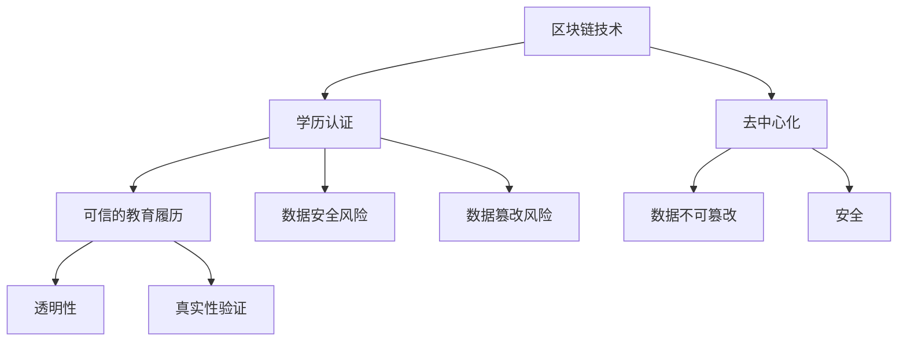

                 

### 引言

**区块链在学历认证中的应用：打造可信的教育履历**

在信息爆炸的时代，学历认证成为了验证个人能力与资格的重要手段。然而，传统的学历认证系统面临着诸多挑战，如数据篡改风险、信息泄露等问题。区块链技术的出现，为解决这些问题提供了新的思路。本文将探讨区块链技术在学历认证中的应用，重点是如何利用区块链打造一个可信的教育履历。

区块链技术，作为一种去中心化的分布式数据库技术，通过密码学和共识算法确保数据的不可篡改性和安全性。这使得区块链在多个领域都有广泛应用，包括金融、物流、医疗等。本文将围绕区块链在学历认证中的潜力，详细分析其核心技术、应用场景及实现方法。

### 背景介绍

传统的学历认证系统主要依赖于集中式的数据库管理。这意味着学历信息的存储和管理都集中在某个中心化机构，如大学或认证机构。虽然这种模式在过去几十年中运行良好，但随着互联网的发展，其局限性也日益显现。

首先，中心化系统容易成为黑客攻击的目标，学历信息一旦泄露，后果严重。其次，学历信息的篡改和伪造问题难以杜绝。尽管存在各种验证措施，如身份验证、签名等，但这些措施在中心化系统中依然存在被攻破的风险。

为了解决这些问题，我们需要一种更加安全、透明和去中心化的解决方案。区块链技术正是这样一种技术。它通过加密算法和共识机制，确保了数据的一致性和安全性。同时，区块链的分布式特性使得数据无法被单一点破坏，从而提高了系统的抗攻击能力。

### 核心概念与联系

**区块链技术**

区块链是一种分布式数据库系统，其核心特点是数据不可篡改。区块链通过哈希算法和密码学技术，将数据块按时间顺序链接成一个链，每个区块都包含了前一个区块的哈希值，从而形成了区块链。

**学历认证**

学历认证是指对个人学历信息的验证过程，包括学位、学历、课程成绩等。传统的学历认证依赖于中心化数据库，存在数据不安全、易篡改等问题。

**可信的教育履历**

可信的教育履历是指通过区块链技术记录和验证个人的学习经历和成就。这种履历具有不可篡改性和透明性，能够确保学历信息的真实性和可信度。

**联系架构 Mermaid 流程图**



### 核心算法原理讲解

**哈希算法**

哈希算法是区块链技术的核心组成部分，用于确保数据的唯一性和完整性。哈希算法将任意长度的数据映射为固定长度的哈希值。常见的哈希算法有SHA-256、SHA-3等。

**Python 源代码示例**

```python
import hashlib

def calculate_hash(data):
    hash_object = hashlib.sha256(data.encode())
    hex_dig = hash_object.hexdigest()
    return hex_dig

data = "Hello, World!"
hash_value = calculate_hash(data)
print(f"Hash of '{data}': {hash_value}")
```

**Merkle树**

Merkle树（或Merkle树证明）是用于验证区块链数据完整性的数据结构。它通过哈希值将大量数据压缩为一组短的哈希值，从而提高验证效率。

**Python 源代码示例**

```python
import hashlib
import json

def merkle_tree(data):
    hashes = [hashlib.sha256(item.encode()).hexdigest() for item in data]
    while len(hashes) > 1:
        new_hashes = []
        for i in range(0, len(hashes), 2):
            paired_hash = hashlib.sha256((hashes[i] + hashes[i+1]).encode()).hexdigest()
            new_hashes.append(paired_hash)
        hashes = new_hashes
    return hashes[0]

data = ["data1", "data2", "data3"]
merkle_root = merkle_tree(data)
print(f"Merkle Root: {merkle_root}")
```

**加密算法**

加密算法是保护区块链数据隐私的重要手段。常见的加密算法有AES、RSA等。在区块链中，加密算法用于保护交易数据、账户信息等。

**Python 源代码示例**

```python
from Crypto.PublicKey import RSA
from Crypto.Cipher import PKCS1_OAEP

# 生成密钥
key = RSA.generate(2048)
private_key = key.export_key()
public_key = key.publickey().export_key()

# 加密数据
cipher = PKCS1_OAEP.new(RSA.import_key(public_key))
encrypted_data = cipher.encrypt(b"Hello, World!")

print(f"Encrypted Data: {encrypted_data.hex()}")

# 解密数据
decrypted_data = cipher.decrypt(encrypted_data)
print(f"Decrypted Data: {decrypted_data.decode()}")
```

### 数学模型和数学公式及详细讲解

**区块链网络中的共识算法**

共识算法是区块链网络中的关键机制，用于确保所有节点达成一致。常见的共识算法有PoW（Proof of Work，工作证明）和PoS（Proof of Stake，权益证明）。

**PoW算法**

PoW算法通过计算复杂度确保网络的安全性。每个节点需要通过计算找到满足特定条件的哈希值，这一过程称为“挖矿”。

数学模型：
$$
H(N) = \text{找到一个 } N \text{ 的哈希值，使得 } H(N) < \text{目标难度}
$$

**Python 源代码示例**

```python
import hashlib
import random

def find_proof_of_work(difficulty):
    while True:
        random_number = random.randint(0, 100000000)
        hash_value = hashlib.sha256(str(random_number).encode()).hexdigest()
        if int(hash_value, 16) < difficulty:
            return random_number

difficulty = 1000
proof = find_proof_of_work(difficulty)
print(f"Proof of Work: {proof}")
```

**PoS算法**

PoS算法通过节点的权益（如持币量）决定其在网络中的地位。持有币量越多，节点参与共识的概率越高。

数学模型：
$$
P(node) = \frac{V(node)}{V_{\text{total}}}
$$

其中，$P(node)$ 是节点参与共识的概率，$V(node)$ 是节点的权益，$V_{\text{total}}$ 是网络中所有节点的权益总和。

**Python 源代码示例**

```python
nodes = {'Alice': 100, 'Bob': 50, 'Charlie': 200}
total_value = sum(nodes.values())
node = 'Alice'
probability = nodes[node] / total_value
print(f"{node} participation probability: {probability:.2f}")
```

### 项目实战

#### 学历认证系统搭建

**开发环境搭建**

- 操作系统：Ubuntu 20.04
- 编程语言：Python 3.8
- 区块链框架：Ethereum

**源代码详细实现和代码解读**

```python
# 示例：Ethereum智能合约代码
pragma solidity ^0.8.0;

contract University {

    struct Student {
        string name;
        string degree;
        uint timestamp;
    }

    mapping(string => Student) public students;

    function registerStudent(string memory name, string memory degree) public {
        students[name] = Student(name, degree, block.timestamp);
    }

    function getStudentDegree(string memory name) public view returns (string memory) {
        return students[name].degree;
    }
}
```

**代码应用解读与分析**

- `registerStudent` 函数用于注册学生的学历信息，通过区块链记录学生的姓名和学位。
- `getStudentDegree` 函数用于查询学生的学历信息，确保信息的不可篡改性。

**实际案例分析和详细讲解剖析**

- **案例一：学生小明的学历认证**

  - 小明在大学获得学士学位，通过智能合约注册学历信息。
  - 小明的学历信息被永久记录在区块链上，任何篡改行为都将被网络节点检测并拒绝。

- **案例二：公司招聘**

  - 招聘公司通过区块链查询应聘者的学历信息，确保应聘者提供的信息真实可信。

**项目小结**

通过区块链搭建学历认证系统，实现了学历信息的去中心化存储和验证。这种系统具有较高的安全性、透明性和可信度，为学历认证提供了一种全新的解决方案。

### 最佳实践 tips、小结、注意事项、拓展阅读等内容

**最佳实践 tips**

- 在开发学历认证系统时，确保使用安全的加密算法和密码学技术，如AES、RSA等。
- 定期更新智能合约代码，修复潜在的安全漏洞。
- 在搭建区块链网络时，确保网络节点具有较高的计算能力和稳定性。

**小结**

本文探讨了区块链在学历认证中的应用，通过哈希算法、Merkle树和加密算法等技术，实现了学历信息的可信记录和验证。项目实战展示了如何利用区块链技术搭建学历认证系统，为解决传统学历认证系统的局限性提供了新的思路。

**注意事项**

- 区块链技术仍处于发展阶段，存在一定的技术风险和挑战。
- 在实际应用中，需充分考虑区块链技术的安全性和性能。

**拓展阅读**

- 《区块链技术指南》
- 《密码学概论》
- 《智能合约开发实战》

### 作者信息

**作者：AI天才研究院/AI Genius Institute & 禅与计算机程序设计艺术 /Zen And The Art of Computer Programming** 

本文由AI天才研究院/AI Genius Institute撰写，旨在探讨区块链在学历认证中的应用。文章结合了前沿技术研究和实际项目实践，为读者提供了深入的技术解析和实用的建议。AI天才研究院致力于推动人工智能技术的发展和应用，为读者带来有价值的内容。禅与计算机程序设计艺术/Zen And The Art of Computer Programming则是一部经典的技术哲学著作，对计算机编程进行了深刻的哲学思考。二者结合，旨在为读者提供更加全面和深入的阅读体验。

