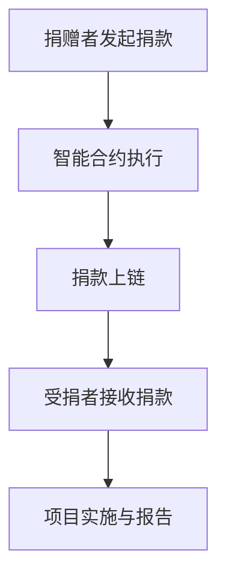

                 

### 文章标题

《区块链在慈善捐款追踪中的透明化应用》

### 关键词

区块链、慈善捐款、透明化、透明度、数据追踪、加密技术、智能合约

### 摘要

本文旨在探讨区块链技术在慈善捐款追踪中的潜在应用，重点分析其透明化的优势。文章首先介绍了区块链的基本概念和原理，以及其在慈善领域的应用前景。接着，详细阐述了区块链在慈善捐款追踪中的核心概念、技术原理和数学模型。随后，通过具体项目实战案例，展示了如何利用区块链技术实现慈善捐款的透明追踪。文章最后对区块链在慈善捐款追踪中的未来发展趋势进行了展望，并提供了相关的最佳实践建议和拓展阅读资源。

## 第一部分：区块链基础

### 第1章 区块链入门

区块链是一种分布式数据库技术，其核心特点是去中心化、不可篡改和透明性。它通过将数据分块存储并链接成链，从而实现了信息的透明追踪和高度安全性。区块链的出现，不仅革新了金融领域，还在多个行业中展现出巨大的潜力，包括慈善捐款追踪。

区块链技术最初由中本聪（Satoshi Nakamoto）在2008年提出，并于2009年创造了比特币（Bitcoin）这一第一个区块链应用。此后，区块链技术得到了迅速发展和广泛应用。

区块链的架构包括三个主要组件：数据区块、链式结构和加密技术。数据区块是区块链的基本存储单位，每个区块包含一定数量的交易记录。链式结构使得每个区块都与前一个区块通过哈希值连接，形成一条不可篡改的区块链。加密技术则保证了区块链数据的隐私和安全。

### 第2章 区块链技术发展

区块链技术自比特币诞生以来，已经经历了多个阶段的发展。从初期的区块链1.0，主要以数字货币为代表，到区块链2.0，实现了智能合约和去中心化应用（DApps）的开发，再到区块链3.0，将区块链与其他技术如人工智能、物联网等相结合，实现更广泛的应用场景。

目前，主流的区块链平台包括以太坊（Ethereum）、EOS、Hyperledger Fabric等。以太坊以其智能合约功能著称，成为去中心化应用开发的主要平台。EOS则注重可扩展性和高性能，适用于大型商业应用。Hyperledger Fabric则是一个由Linux基金会管理的区块链框架，适用于企业级应用。

随着区块链技术的不断成熟，越来越多的企业和机构开始探索将其应用于慈善捐款追踪等领域，以实现更高程度的透明度和信任。

### 第3章 慈善捐款与透明化

慈善捐款是指个人或组织出于爱心和责任感，自愿捐赠财物或服务的行为。然而，慈善领域的透明化问题长期以来备受关注。一方面，慈善机构的不透明操作可能导致捐款用途的不确定性，降低公众的信任度；另一方面，缺乏透明度也使得监管机构难以有效监督慈善活动，影响社会公平。

透明化的需求源于公众对慈善捐款知情权的追求。捐赠者希望能够清楚地了解自己的捐款如何被使用，慈善机构则需要在合法合规的前提下，公开详细的财务报告和项目进展。然而，传统的方法往往存在信息不对称和信任问题，难以满足公众的透明化需求。

区块链技术在慈善捐款追踪中的应用，可以有效地解决这些问题。通过区块链的不可篡改性和透明性，捐赠者和慈善机构可以实时查看捐款的流向和使用情况，确保资金的合理使用和公正分配。此外，区块链技术还可以提供高度安全的存储和传输机制，防止欺诈和恶意行为。

区块链在慈善领域的应用前景非常广阔。随着技术的不断进步和公众对透明度需求的提高，预计将有越来越多的慈善机构和捐赠者选择使用区块链技术进行捐款追踪，从而推动整个行业的健康发展。

### 第4章 区块链在慈善捐款追踪中的核心概念与联系

区块链在慈善捐款追踪中的应用，主要依赖于其去中心化、透明性和不可篡改的特性。为了深入理解这些特性如何发挥作用，我们需要首先了解区块链在慈善捐款追踪中的核心概念和联系。

#### 捐赠透明化的实现路径

区块链在慈善捐款追踪中的第一个关键概念是捐赠透明化。捐赠透明化指的是通过区块链技术，实现捐款从捐赠者到受捐者的全流程追踪，确保每一步操作的透明性和可验证性。具体实现路径如下：

1. **捐赠者发起捐款**：捐赠者通过区块链平台发起捐款，输入捐款金额和捐款目标信息。这一过程可以是线上捐款平台，也可以是移动应用等形式。

2. **智能合约执行**：捐款信息被发送到区块链网络后，智能合约开始执行。智能合约是一种自动执行的计算机协议，它可以确保捐款金额被正确分配，并记录在区块链上。

3. **捐款上链**：智能合约执行完成后，捐款信息会被记录在一个新的区块链区块中，并通过密码学技术加密存储，确保数据的安全性和不可篡改性。

4. **受捐者接收捐款**：受捐者可以通过区块链网络查看捐款信息，确认款项已到账，并根据智能合约的规则进行相应操作，如项目实施、费用报销等。

#### 区块链与慈善机构的合作模式

区块链在慈善捐款追踪中的应用，不仅需要技术的支持，还需要慈善机构和区块链平台的深度合作。以下是一些常见的合作模式：

1. **慈善机构作为区块链节点**：慈善机构可以作为区块链网络的一个节点，参与到区块链的共识过程中。这样，慈善机构可以直接监控捐款的流向和使用情况，提高操作的透明度。

2. **区块链平台提供技术支持**：区块链平台可以为慈善机构提供定制化的区块链解决方案，包括智能合约开发、区块链网络维护等。这有助于慈善机构更高效地管理捐款信息。

3. **合作开发透明化报告系统**：慈善机构与区块链平台可以合作开发透明的报告系统，将慈善项目的进展、财务状况等信息公开给捐赠者和社会公众。

#### 图4.1 捐赠透明化流程图

为了更直观地展示捐赠透明化的实现路径，我们使用Mermaid图来绘制流程图。



在这个流程图中，捐赠者发起捐款后，智能合约开始执行，将捐款信息记录在区块链上。受捐者可以实时查看捐款情况，并根据智能合约的规则进行项目实施和报告。通过这样的流程，实现了慈善捐款的全程透明化。

#### 核心概念与联系总结

区块链在慈善捐款追踪中的核心概念包括捐赠透明化、智能合约和区块链网络。捐赠透明化确保了捐款的全程可追踪性，智能合约则实现了捐款的自动化管理和分配，区块链网络则提供了安全可靠的数据存储和传输机制。

通过这些核心概念的相互联系，区块链在慈善捐款追踪中实现了去中心化、透明性和不可篡改的特性，从而提高了整个慈善行业的信任度和效率。

### 第5章 区块链在慈善捐款追踪中的核心技术原理

区块链在慈善捐款追踪中的应用，离不开其核心技术的支持。这些技术包括数据结构、加密算法和智能合约。下面将详细阐述这些技术的原理，并通过Python源代码示例进行说明。

#### 数据结构

区块链的数据结构是其核心，决定了数据存储和传输的方式。区块链的数据结构主要包括区块和链。

1. **区块**：区块是区块链的基本存储单位，每个区块包含一定数量的交易记录。区块由多个部分组成，包括区块头、交易数据和Merkle树等。

2. **链**：链是多个区块按时间顺序链接而成的数据结构。每个区块通过其哈希值与前一个区块链接，形成一条不可篡改的链。

在Python中，我们可以使用以下代码来创建一个简单的区块链数据结构：

```python
import hashlib
import json
from time import time

class Block:
    def __init__(self, index, transactions, timestamp, previous_hash):
        self.index = index
        self.transactions = transactions
        self.timestamp = timestamp
        self.previous_hash = previous_hash
        self.hash = self.compute_hash()

    def compute_hash(self):
        block_string = json.dumps(self.__dict__, sort_keys=True)
        return hashlib.sha256(block_string.encode()).hexdigest()

class Blockchain:
    def __init__(self):
        self.unconfirmed_transactions = []
        self.chain = []
        self.create_genesis_block()

    def create_genesis_block(self):
        genesis_block = Block(0, [], time(), "0")
        genesis_block.hash = genesis_block.compute_hash()
        self.chain.append(genesis_block)

    def add_new_transaction(self, transaction):
        self.unconfirmed_transactions.append(transaction)

    def mine(self):
        if not self.unconfirmed_transactions:
            return False
        last_block = self.chain[-1]
        new_block = Block(index=last_block.index + 1,
                          transactions=self.unconfirmed_transactions,
                          timestamp=time(),
                          previous_hash=last_block.hash)
        new_block.hash = new_block.compute_hash()
        self.chain.append(new_block)
        self.unconfirmed_transactions = []
        return new_block.index

    def is_chain_valid(self):
        for i in range(1, len(self.chain)):
            current = self.chain[i]
            previous = self.chain[i - 1]
            if current.hash != current.compute_hash():
                return False
            if current.previous_hash != previous.hash:
                return False
        return True
```

这个示例中，`Block` 类表示一个区块，包含索引、交易记录、时间和前一个区块的哈希值。`Blockchain` 类表示整个区块链，包含未确认的交易记录和链本身。`mine` 方法用于生成新的区块，并验证链的完整性。

#### 加密算法

区块链的安全性依赖于密码学技术，特别是哈希函数和数字签名。

1. **哈希函数**：哈希函数是将任意长度的数据映射为固定长度的字符串的算法。区块链中使用哈希函数来确保数据的完整性。例如，SHA-256 是一种常用的哈希函数。

2. **数字签名**：数字签名是一种用于验证身份和防止篡改的技术。区块链中的每个交易都需要签名，以确保只有交易发起者才能修改交易内容。

以下是一个使用Python实现SHA-256哈希函数和数字签名的示例：

```python
import hashlib
from Crypto.PublicKey import RSA
from Crypto.Signature import pkcs1_15
from Crypto.Hash import SHA256

def hash_data(data):
    return hashlib.sha256(data.encode()).hexdigest()

def generate_keys():
    key = RSA.generate(2048)
    private_key = key.export_key()
    public_key = key.publickey().export_key()
    return private_key, public_key

def sign_data(data, private_key):
    hash = SHA256.new(data.encode())
    signature = pkcs1_15.new(RSA.import_key(private_key)).sign(hash)
    return signature

def verify_signature(data, signature, public_key):
    hash = SHA256.new(data.encode())
    try:
        pkcs1_15.new(RSA.import_key(public_key)).verify(hash, signature)
        return True
    except (ValueError, TypeError):
        return False

# 测试
private_key, public_key = generate_keys()
data = "Hello, World!"
signature = sign_data(data, private_key)
is_verified = verify_signature(data, signature, public_key)
print(f"Signature verified: {is_verified}")
```

这个示例中，`hash_data` 函数用于计算数据的SHA-256哈希值。`generate_keys` 函数用于生成RSA密钥对。`sign_data` 和 `verify_signature` 函数则用于签名和验证签名。

#### 智能合约原理

智能合约是一种自动执行的计算机协议，其代码在区块链上公开运行，不可篡改。智能合约可以用多种编程语言实现，如Solidity（用于以太坊）、Scilla（用于Tezos）等。

以下是一个使用Solidity编写的简单智能合约示例，用于管理捐款：

```solidity
pragma solidity ^0.8.0;

contract Donations {
    address owner;
    mapping(address => uint256) public donations;

    constructor() {
        owner = msg.sender;
    }

    function donate() public payable {
        require(msg.value > 0, "捐赠金额必须大于0");
        donations[msg.sender] += msg.value;
    }

    function withdraw() public {
        require(msg.sender == owner, "只有合约拥有者可以提现");
        owner.transfer(address(this).balance);
    }
}
```

在这个示例中，`Donations` 合约用于管理捐款。捐赠者通过调用 `donate` 函数发送以太币，合约将捐款金额存储在 `donations` 映射中。合约拥有者可以通过调用 `withdraw` 函数将捐款提现到自己的账户。

#### 核心技术原理总结

区块链在慈善捐款追踪中的核心技术原理包括数据结构、加密算法和智能合约。数据结构决定了区块链的存储和传输方式，加密算法保证了数据的安全性和隐私性，智能合约则实现了自动化的业务逻辑处理。通过这些技术，区块链在慈善捐款追踪中实现了高度透明和不可篡改的特性，为慈善行业带来了革命性的改变。

### 第6章 区块链在慈善捐款追踪中的数学模型与公式

区块链在慈善捐款追踪中的应用，不仅依赖于其技术实现，还需借助数学模型和公式来确保数据的准确性和可靠性。以下将详细探讨区块链在慈善捐款追踪中使用的几个关键数学模型和公式。

#### 哈希函数

哈希函数是区块链技术中至关重要的一部分，用于确保数据的唯一性和完整性。哈希函数将任意长度的数据映射为固定长度的哈希值。一个重要的特性是，哈希函数具有单向性，即给定哈希值，无法反推出原始数据。

在区块链中，常用的哈希函数包括SHA-256。以下是一个简单的SHA-256哈希函数的实现：

```python
import hashlib

def sha256_hash(data):
    return hashlib.sha256(data.encode()).hexdigest()

# 测试
hash_value = sha256_hash("Hello, World!")
print(f"SHA-256 Hash: {hash_value}")
```

#### 零知识证明

零知识证明（Zero-Knowledge Proof）是一种密码学技术，允许证明者向验证者证明某个陈述为真，而无需透露任何额外信息。在区块链中，零知识证明常用于隐私保护和数据验证。

以下是一个简单的零知识证明实现，用于证明一个数是否小于10：

```python
from zkp import PedersenCommitment, Prover, Verifier

def prove_less_than_10(prover_private_key, x):
    # 创建 Pedersen 承诺
    prover = Prover(prover_private_key)
    commitment = prover.commit(x)
    return commitment

def verify_less_than_10(verifier_public_key, commitment, x):
    verifier = Verifier(verifier_public_key)
    return verifier.verify(commitment, x)

# 测试
prover_private_key = PedersenCommitment.generate_private_key()
public_key = PedersenCommitment.generate_public_key(prover_private_key)
commitment = prove_less_than_10(prover_private_key, 5)
is_verified = verify_less_than_10(public_key, commitment, 5)
print(f"证明验证结果：{is_verified}")
```

在这个示例中，`prove_less_than_10` 函数用于生成一个证明，证明某个数小于10。`verify_less_than_10` 函数用于验证这个证明。

#### 柔性分类机制

在区块链中，柔性分类机制用于确保数据的分类和筛选。一个常见的柔性分类机制是基于 Merkle 树的数据结构。

Merkle 树是一种二叉树结构，用于高效验证数据集合中的元素。每个节点都包含一个哈希值，叶子节点包含原始数据，内部节点是子节点哈希值的哈希值。

以下是一个简单的 Merkle 树实现：

```python
import hashlib

def hash_data(data):
    return hashlib.sha256(data.encode()).hexdigest()

def merkle_root(leaves):
    while len(leaves) > 1:
        new_leaves = []
        for i in range(0, len(leaves), 2):
            left_hash = leaves[i]
            right_hash = leaves[i + 1] if i + 1 < len(leaves) else left_hash
            new_leaves.append(hash_data(left_hash + right_hash))
        leaves = new_leaves
    return leaves[0]

# 测试
leaves = ["data1", "data2", "data3"]
root = merkle_root(leaves)
print(f"Merkle Root: {root}")
```

在这个示例中，`hash_data` 函数用于计算数据的哈希值。`merkle_root` 函数用于计算Merkle树的根哈希值。

#### 公式和计算过程

以下是区块链在慈善捐款追踪中使用的几个关键公式和计算过程：

1. **区块奖励计算**：在区块链网络中，矿工通过验证交易并创建新区块来获得区块奖励。区块奖励通常由网络设定的挖矿难度、区块大小和总交易费用决定。

   $$奖励 = 网络设定挖矿难度 \times 区块大小 \times 总交易费用$$

2. **工作量证明（Proof of Work, PoW）**：PoW 是一种共识算法，用于确保区块链网络的安全。矿工需要解决一个计算难题，以生成一个新的区块。

   $$目标值 = 难度目标值 \times 随机数$$

   其中，难度目标值是一个固定的数值，随机数是由矿工生成的随机数。

3. **权益证明（Proof of Stake, PoS）**：PoS 是另一种共识算法，用于替代 PoW。在 PoS 网络中，节点根据其持有的代币数量和持币时间来决定其验证区块的概率。

   $$验证概率 = 随机函数(持有代币数量 \times 持币时间)$$

通过这些数学模型和公式，区块链在慈善捐款追踪中实现了高效、安全的数据管理和验证，确保了捐款信息的准确性和透明性。

### 第7章 区块链在慈善捐款追踪中的项目实战

#### 实际案例介绍

区块链技术在慈善捐款追踪中的实际应用已经取得了显著成果。以下是一些具有代表性的案例：

1. **以太坊的CryptoKitties**：CryptoKitties 是一个基于以太坊区块链的游戏，玩家可以购买、繁殖和交易虚拟猫咪。通过区块链技术，CryptoKitties 实现了所有交易和物品的所有权验证，确保了游戏内的物品具有真实性和稀缺性。

2. **慈链（CharityChain）**：慈链是一个基于区块链的慈善平台，旨在提高慈善捐款的透明度和效率。通过区块链技术，慈链记录了每一笔捐款的来源、用途和流向，确保了捐款的公开透明。

3. **联合国世界粮食计划署（WFP）**：WFP 利用区块链技术追踪援助物资的发放情况。通过区块链的不可篡改性和透明性，WFP 有效地防止了援助物资的滥用和浪费，提高了援助效果。

#### 捐款追踪系统开发环境搭建

要搭建一个区块链慈善捐款追踪系统，需要以下开发环境和工具：

1. **Node.js**：Node.js 是一个基于 Chrome V8 引擎的 JavaScript 运行时环境，用于构建高性能的分布式应用。

2. **以太坊客户端**：以太坊客户端（如 geth）用于与以太坊区块链网络进行交互，实现智能合约的部署和执行。

3. **Truffle**：Truffle 是一个以太坊开发框架，用于管理智能合约的部署、测试和交互。

4. **MetaMask**：MetaMask 是一个浏览器扩展程序，用于管理用户的以太坊钱包，实现与区块链的交互。

以下是搭建捐款追踪系统的基本步骤：

1. 安装 Node.js：

   ```bash
   sudo apt update
   sudo apt install nodejs npm
   ```

2. 创建一个新的 Node.js 项目：

   ```bash
   mkdir charity-donation-tracker
   cd charity-donation-tracker
   npm init -y
   ```

3. 安装以太坊客户端（geth）：

   ```bash
   curl https://github.com/ethereum/go-ethereum/releases/download/v1.10.25/go-ethereum-linux-amd64-1.10.25.tar.gz -o geth.tar.gz
   tar -xzvf geth.tar.gz
   mv geth /usr/local/bin/
   ```

4. 安装 Truffle：

   ```bash
   npm install -g truffle
   ```

5. 安装 MetaMask：

   在浏览器中安装 MetaMask 浏览器扩展。

#### 源代码实现与解读

以下是一个简单的慈善捐款追踪智能合约的示例，使用 Solidity 语言编写：

```solidity
pragma solidity ^0.8.0;

contract CharityDonationTracker {
    address public charityAddress;
    mapping(address => uint256) public donations;

    constructor() {
        charityAddress = msg.sender;
    }

    function donate() public payable {
        require(msg.value > 0, "捐赠金额必须大于0");
        donations[msg.sender] += msg.value;
    }

    function withdraw() public {
        require(msg.sender == charityAddress, "只有慈善机构可以提现");
        charityAddress.transfer(address(this).balance);
    }
}
```

在这个示例中，`CharityDonationTracker` 合约包含两个主要函数：

1. `donate`：捐赠者通过调用该函数发送以太币，并存储在合约中。该函数确保了捐赠金额大于0。

2. `withdraw`：慈善机构通过调用该函数将合约中的所有以太币提现到自己的账户。该函数确保了只有合约创建者（慈善机构）可以调用。

#### 代码解读与分析

1. **合约结构**：合约以 `pragma solidity ^0.8.0;` 开始，指定了 Solidity 版本。合约名称为 `CharityDonationTracker`，包含一个公共地址 `charityAddress` 和一个用于记录捐款金额的映射 `donations`。

2. **构造函数**：构造函数 `constructor()` 在合约部署时执行，设置合约的慈善机构地址为 `msg.sender`。

3. **donate 函数**：捐赠者通过调用 `donate()` 函数发送以太币。该函数检查捐赠金额是否大于0，确保捐款的有效性。

4. **withdraw 函数**：慈善机构通过调用 `withdraw()` 函数将合约中的所有以太币提现到自己的账户。该函数确保只有合约创建者（慈善机构）可以调用。

通过这个简单的智能合约示例，我们可以看到如何使用区块链技术实现慈善捐款的透明追踪。在实际项目中，可以根据需求扩展合约的功能，如添加捐款用途记录、项目进展报告等。

### 第8章 区块链在慈善捐款追踪中的未来发展趋势

#### 技术发展趋势

区块链在慈善捐款追踪中的应用前景广阔，随着技术的不断进步，其应用范围和效果也将得到进一步提升。以下是一些可能的技术发展趋势：

1. **增强的隐私保护**：随着对个人隐私保护的重视，区块链技术将逐步引入零知识证明、同态加密等技术，实现更加安全的隐私保护。

2. **更高的交易速度和可扩展性**：当前区块链网络在处理大规模交易时存在性能瓶颈，未来将发展出更高性能的区块链平台，如Layer 2解决方案，以满足慈善捐款追踪的实际需求。

3. **跨链技术的应用**：跨链技术将实现不同区块链之间的数据传输和协同工作，打破现有区块链网络的孤岛现象，进一步提升慈善捐款追踪的效率和透明度。

#### 政策与法律环境

区块链在慈善捐款追踪中的广泛应用，需要良好的政策与法律环境支持。以下是一些政策与法律环境的发展趋势：

1. **监管政策的逐步完善**：各国政府将逐步出台监管政策，明确区块链技术在慈善领域的应用规范，确保慈善捐款的安全和透明。

2. **税收优惠政策的出台**：为鼓励更多个人和机构参与慈善捐款，政府可能出台税收优惠政策，降低慈善捐款的税收负担。

3. **法律法规的完善**：随着区块链技术的发展，相关法律法规将逐步完善，确保区块链技术在慈善捐款追踪中的合规性。

#### 社会责任与伦理

区块链在慈善捐款追踪中的应用，不仅需要技术上的创新，还需要关注社会责任和伦理问题。以下是一些关注点：

1. **透明度和公开性**：慈善机构应确保区块链上的捐款信息透明公开，接受社会监督。

2. **数据安全和隐私保护**：在保护捐赠者隐私的同时，确保区块链网络的安全性和数据完整性。

3. **社会责任和公益效应**：区块链技术的应用应注重社会责任，提升慈善捐款的公益效应，助力社会进步。

通过技术、政策和社会责任的多方面共同努力，区块链在慈善捐款追踪中的应用将不断成熟和普及，为慈善事业的发展注入新的活力。

### 第9章 区块链在慈善捐款追踪中的工具与资源

区块链在慈善捐款追踪中的应用日益广泛，为了帮助开发者、研究者以及慈善机构更好地理解和应用这项技术，本文将介绍一些实用的工具和资源。

#### 开发工具推荐

1. **Truffle**：Truffle 是一个以太坊开发框架，提供了智能合约的部署、测试和管理功能。通过 Truffle，开发者可以方便地与以太坊区块链进行交互，进行智能合约的开发和测试。

2. **Ganache**：Ganache 是一个本地以太坊区块链模拟器，用于测试智能合约和进行本地开发。它提供了灵活的节点配置和模拟交易功能，使开发者能够快速测试和调试智能合约。

3. **Metamask**：Metamask 是一个浏览器扩展程序，用于管理用户的以太坊钱包。它允许用户在浏览器中与以太坊区块链进行交互，进行捐款、发送交易等操作。

#### 区块链平台与平台对比

1. **Ethereum**：以太坊是当前最流行的区块链平台之一，以其智能合约功能著称。以太坊支持广泛的去中心化应用开发，是慈善捐款追踪的首选平台。

2. **Binance Smart Chain**：Binance Smart Chain 是一个高性能的区块链平台，具有低交易费用和快速确认的特点。它支持智能合约，适用于大规模应用。

3. **Tron**：Tron 是一个去中心化的区块链平台，专注于数字娱乐和金融应用。它提供了高效的交易处理能力和去中心化应用开发工具，适合慈善捐款追踪等应用场景。

#### 慈善组织与区块链项目案例

1. **The Giving Block**：The Giving Block 是一个基于区块链的慈善平台，通过智能合约记录和跟踪慈善捐款。它为捐赠者提供了透明的捐款记录，提高了慈善捐款的信任度。

2. **Hope Crew**：Hope Crew 是一个使用区块链技术的慈善项目，旨在为灾难受害者提供紧急援助。通过区块链，Hope Crew 可以确保捐款的透明和高效使用，提高了援助的效率。

3. **Humanitarian Cryptocurrency Project**：Humanitarian Cryptocurrency Project 是一个利用加密货币为慈善机构提供资金支持的倡议。该项目通过区块链技术实现了捐款的透明追踪和高效分配，为慈善事业提供了新的解决方案。

通过这些工具和资源，开发者、研究者以及慈善机构可以更好地利用区块链技术，实现慈善捐款的透明化追踪，提升慈善事业的效率和公信力。

