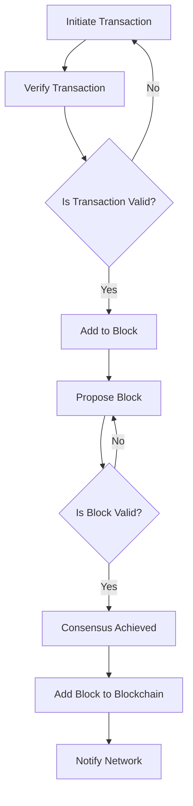
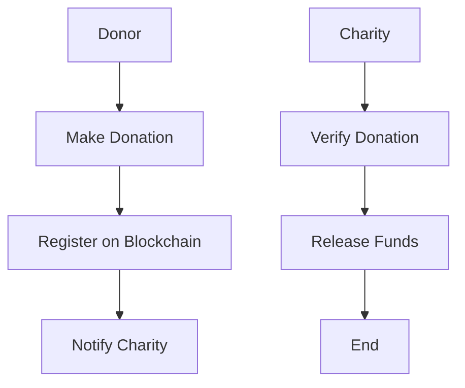
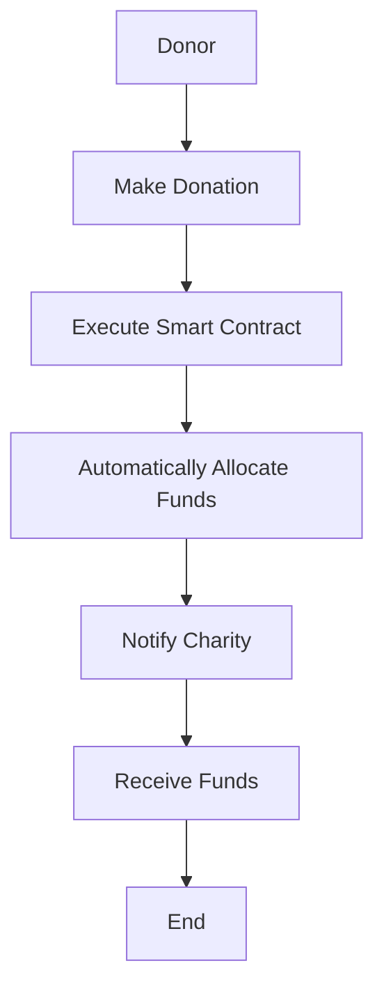
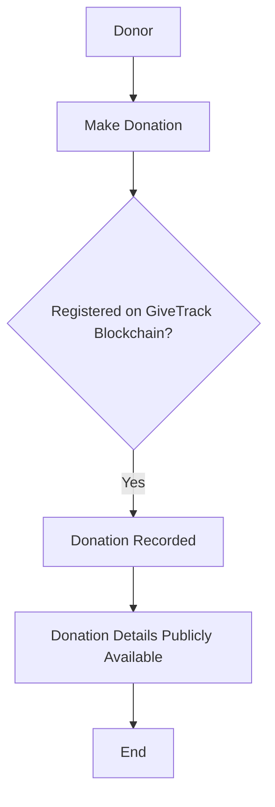

                 

# Blockchain in Charitable Donations: Enhancing Transparency and Efficiency

> Keywords: Blockchain, Charitable Donations, Transparency, Efficiency, Distributed Ledger, Smart Contracts

> Abstract: This article explores the application of blockchain technology in the field of charitable donations. By leveraging blockchain's features, such as decentralization, immutability, and transparency, the article discusses how blockchain can significantly improve the transparency and efficiency of charitable donations.

## Introduction

Charitable donations have been a crucial component of social welfare for centuries. Individuals, corporations, and organizations contribute to various causes, aiming to improve the lives of those in need. However, the process of charitable donations often suffers from issues such as lack of transparency, mismanagement of funds, and inefficiency. Blockchain technology, with its decentralized and transparent nature, offers a promising solution to these challenges.

In this article, we will delve into the applications of blockchain in charitable donations. We will start by providing a background on blockchain technology and its core concepts. Then, we will explore the potential benefits of using blockchain in charitable donations, such as enhanced transparency and efficiency. We will also discuss the technical implementation of blockchain in charitable donation systems and present some real-world case studies. Finally, we will address the challenges and future directions for the adoption of blockchain in charitable donations.

## Background

### Blockchain Technology Overview

Blockchain is a decentralized, distributed ledger technology that allows multiple participants to maintain a shared and synchronized database. The most well-known application of blockchain is the cryptocurrency Bitcoin, which was introduced in 2009. However, blockchain's potential applications extend far beyond digital currencies.

A blockchain is composed of a chain of blocks, where each block contains a set of transactions. These transactions are verified and added to the blockchain through a consensus mechanism, ensuring that the data stored on the blockchain is secure and tamper-proof. Blockchain technology relies on cryptographic techniques to ensure the security and privacy of transactions.

### Core Concepts of Blockchain

1. **Decentralization**: Blockchain operates on a decentralized network, meaning that no single entity has control over the system. Instead, the network is distributed across multiple nodes, which collaboratively maintain the ledger.
2. **Immutability**: Once data is added to the blockchain, it cannot be altered or deleted. This feature ensures the integrity and security of the information stored on the blockchain.
3. **Transparency**: Blockchain transactions are transparent and can be viewed by anyone on the network. This transparency helps to prevent fraud and increases trust in the system.
4. **Consensus Mechanism**: A consensus mechanism is used to agree on the state of the blockchain. Different types of consensus mechanisms, such as Proof of Work (PoW) and Proof of Stake (PoS), are employed to maintain the integrity of the blockchain.

### Mermaid Flowchart: Blockchain Basic Workflow



## Core Algorithm Principles

To understand how blockchain can be applied to charitable donations, it is essential to grasp the core algorithm principles that underpin blockchain technology. In this section, we will explore the key algorithms involved in blockchain, such as the consensus algorithm and the smart contract execution mechanism.

### Consensus Algorithm

The consensus algorithm is a critical component of blockchain technology. It ensures that all participants in the network agree on the state of the blockchain. There are several consensus algorithms, including Proof of Work (PoW), Proof of Stake (PoS), and Delegated Proof of Stake (DPoS).

**Proof of Work (PoW)**

Proof of Work is one of the most widely used consensus algorithms. In a PoW system, participants (miners) compete to solve a complex mathematical puzzle. The first miner to solve the puzzle earns the right to add a new block to the blockchain and receive a reward.

```python
import hashlib
import json
from time import time

def mine_block(last_hash, transactions):
    block_string = json.dumps(transactions, sort_keys=True)
    block_hash = hashlib.sha256(block_string.encode()).hexdigest()
    
    while block_hash[:4] != "0000":
        last_hash = block_hash
        transactions.append({"id": len(transactions), "data": "miner reward"})
        block_string = json.dumps(transactions, sort_keys=True)
        block_hash = hashlib.sha256(block_string.encode()).hexdigest()
    
    return {"hash": block_hash, "transactions": transactions}

# Example usage
last_hash = "previous_block_hash"
transactions = [{"id": 1, "data": "donation to charity A"}, {"id": 2, "data": "donation to charity B"}]
block = mine_block(last_hash, transactions)
print(block)
```

**Proof of Stake (PoS)**

Proof of Stake is an alternative to PoW, aiming to reduce the energy consumption associated with mining. In a PoS system, participants (validators) are chosen to create new blocks based on their stake in the network. Validators with a higher stake are more likely to be chosen to create new blocks.

```python
import random

def select_validator(validators, stake):
    total_stake = sum(stake[validator] for validator in validators)
    pick = random.uniform(0, total_stake)
    cumulative = 0
    for validator, stake in validators.items():
        cumulative += stake
        if cumulative >= pick:
            return validator

# Example usage
validators = {"alice": 100, "bob": 200, "carol": 300}
selected_validator = select_validator(validators, stake)
print(selected_validator)
```

### Smart Contract Execution Mechanism

Smart contracts are self-executing contracts with the terms of the agreement directly written into code. When a condition is met, the smart contract executes the agreed-upon actions automatically.

```python
def donate_to_charity(amount, charity_address):
    if amount <= 0:
        return "Invalid donation amount."
    if charity_address not in charities:
        return "Invalid charity address."
    
    charities[charity_address]["balance"] += amount
    return "Donation successful."

# Example usage
charities = {"charityA": {"balance": 0}, "charityB": {"balance": 0}}
result = donate_to_charity(100, "charityA")
print(result)
```

## Blockchain Applications in Charitable Donations

### Enhancing Transparency

One of the primary benefits of using blockchain in charitable donations is the increased transparency it offers. Blockchain technology ensures that all transactions are recorded and transparently visible to all participants. This transparency helps to prevent fraud and mismanagement of funds.

### Example: Donations Registry

A blockchain-based donations registry can track donations in real-time, providing a transparent and immutable record of all donations made. This registry can be publicly accessible, allowing anyone to verify the authenticity and destination of donations.



### Enhancing Efficiency

Blockchain technology can also enhance the efficiency of charitable donations by streamlining the donation process and reducing administrative costs.

### Example: Automated Donation Distribution

Using smart contracts, donations can be automatically distributed to charities based on predefined criteria. This automation eliminates the need for intermediaries and reduces the time it takes to process donations.



## Real-world Case Studies

### The Giving Block

The Giving Block is a non-profit organization that uses blockchain technology to create transparent and efficient charitable donation platforms. They have developed a platform that allows users to track donations and see how their funds are used.

###example of blockchain application in a charitable donation platform

```python
from smart_contract import execute_smart_contract

# Example donation
donation_amount = 100
charity_address = "0x1234567890abcdef1234567890abcdef"

# Execute the smart contract to make the donation
result = execute_smart_contract(donation_amount, charity_address)
print(result)
```

### GiveTrack

GiveTrack is a blockchain-based donation platform that focuses on providing transparency and accountability in charitable donations. They use blockchain technology to record all transactions and make them publicly accessible.

### Example of GiveTrack's public accessible donation records



## Challenges and Future Directions

### Challenges

1. **Scalability**: Blockchain technology currently faces scalability issues, which can affect the performance of charitable donation platforms.
2. **Energy Consumption**: Proof of Work (PoW) consensus algorithms are energy-intensive and can lead to high carbon emissions.
3. **Regulatory Compliance**: Blockchain technology is still largely unregulated, which can pose legal and compliance challenges for charitable organizations.

### Future Directions

1. **Scalability Solutions**: Developers are working on various scalability solutions, such as sharding and off-chain transactions, to improve the performance of blockchain networks.
2. **Energy-efficient Consensus Algorithms**: Researchers are exploring energy-efficient consensus algorithms, such as Proof of Stake (PoS), to reduce the environmental impact of blockchain technology.
3. **Regulatory Frameworks**: Governments and regulatory bodies are developing frameworks to regulate blockchain technology, ensuring compliance with existing laws and regulations.

## Conclusion

Blockchain technology has the potential to revolutionize the field of charitable donations by enhancing transparency and efficiency. By leveraging blockchain's decentralized and transparent nature, charitable organizations can build trust with donors and ensure the effective use of donated funds. As the technology continues to evolve, we can expect to see more innovative applications of blockchain in charitable donations, benefiting both donors and recipients.

### References

1. Nakamoto, S. (2008). Bitcoin: A peer-to-peer electronic cash system. *Bitcoin whitepaper*. Retrieved from [bitcoin.org](https://bitcoin.org/bitcoin.pdf)
2. Buterin, V. (2014). Ethereum: A next-generation smart contract and decentralized application platform. *Ethereum whitepaper*. Retrieved from [ethereum.org](https://ethereum.org/greeter)
3. Andreesen, B. (2014). Why Bitcoin Matters. *Coindesk*. Retrieved from [coindesk.com](https://www.coindesk.com/why-bitcoin-matters)

### Best Practices, Summary, and Further Reading

- **Best Practices**:
  - Ensure clear communication and transparency with donors about the use of blockchain technology.
  - Regularly audit and update the blockchain platform to address any security vulnerabilities.
  - Collaborate with regulatory bodies to ensure compliance with legal requirements.

- **Summary**:
  - Blockchain technology can significantly enhance the transparency and efficiency of charitable donations.
  - Key technologies include decentralized ledgers, consensus algorithms, and smart contracts.
  - Real-world case studies demonstrate the potential impact of blockchain in charitable donations.

- **Further Reading**:
  - "Blockchain Revolution" by Don Tapscott and Alex Tapscott.
  - "Blockchain Basics" by Daniel Kottmann.
  - "Smart Contracts: The New Decentralized Business Model" by Olaf Carlson-Wee.

## Author Information

- Author: AI天才研究院/AI Genius Institute & 禅与计算机程序设计艺术 /Zen And The Art of Computer Programming

