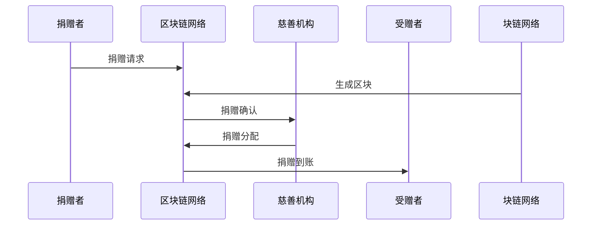

                 

### 引入

# 《区块链在慈善捐赠追踪中的应用：增加捐赠透明度》

区块链技术作为近年来最为突出的创新技术之一，其不可篡改和去中心化的特性在各个领域展现出了巨大的潜力。慈善捐赠作为一个高度依赖透明度和信任的领域，自然成为了区块链技术的理想应用场景。本文将深入探讨区块链在慈善捐赠追踪中的应用，旨在通过增加捐赠透明度，解决当前慈善捐赠过程中存在的诸多问题。

慈善捐赠在全球范围内都扮演着至关重要的角色，无论是为贫困人群提供援助，还是支持教育、医疗等公共事业的发展，都离不开公众的慷慨捐赠。然而，随着捐赠规模的不断扩大，如何确保捐赠资金的使用透明度和有效性，成为了慈善组织面临的一大挑战。传统的慈善捐赠流程往往存在信息不透明、资金流转链条长、易被滥用等问题，严重影响了公众对慈善机构的信任。

区块链技术的引入，为慈善捐赠提供了一个全新的解决方案。其不可篡改的账本记录和去中心化的特性，能够确保捐赠过程的公开透明，防止资金被挪用或滥用。本文将逐步分析区块链在慈善捐赠追踪中的应用，从核心概念、算法原理到实际项目实战，全面探讨这一技术如何提升捐赠透明度，并解决现有的问题。

接下来的文章中，我们将首先概述区块链技术的基本原理，并阐述其在慈善捐赠中的潜在应用。随后，我们将深入讲解智能合约和常见区块链算法，并通过Python源代码示例，说明这些概念在实际开发中的应用。此外，本文还将使用LaTeX格式展示相关数学公式，帮助读者更好地理解区块链的数学基础。最后，我们将通过一个具体的捐赠追踪系统项目实战，展示区块链技术如何在实际场景中发挥作用，并总结本文的核心观点和未来展望。

### 关键词

- 区块链
- 慈善捐赠
- 透明度
- 智能合约
- 共识算法
- 密码学
- 分布式账本
- 不可篡改性
- 去中心化

### 摘要

本文探讨了区块链技术在慈善捐赠追踪中的应用，旨在提升捐赠过程的透明度和可信度。首先，我们概述了区块链技术的基本原理，并阐述了其在慈善捐赠中的潜在应用。接着，我们深入讲解了智能合约和常见区块链算法，通过Python源代码示例，详细展示了这些概念在实际开发中的应用。此外，本文使用了LaTeX格式展示相关数学公式，帮助读者更好地理解区块链的数学基础。最后，通过一个具体的捐赠追踪系统项目实战，我们展示了区块链技术如何在实际场景中发挥作用。本文总结了区块链在慈善捐赠领域的应用前景和面临的挑战，并提出了相应的解决策略。

## 区块链技术概述

区块链（Blockchain）作为一种分布式账本技术，其基本原理可以追溯到2008年发布的比特币白皮书。由中本聪（Satoshi Nakamoto）提出的区块链技术，旨在构建一个无需信任中介的金融交易系统，从而实现去中心化的价值传递。区块链的核心特征包括不可篡改性、去中心化、透明性和安全性。

### 区块链的核心特征

1. **不可篡改性**：区块链采用加密算法，确保一旦数据被记录，就难以更改或删除。这意味着一旦某个区块被加入到区块链中，其内容将被永久保存，防止数据被篡改。

2. **去中心化**：传统的中心化系统依赖于单一或少数中心节点来维护数据。而区块链则通过分布式网络，使得每个节点都保存一份完整的账本副本，从而实现去中心化的数据处理。

3. **透明性**：区块链上的所有交易都是公开透明的，任何用户都可以查看区块链上的交易记录。这有助于提高数据的透明度和可追溯性。

4. **安全性**：区块链采用密码学技术，确保数据传输过程中的安全性和完整性。常见的密码学算法包括非对称加密、哈希函数等，这些算法共同构成了区块链的安全保障。

### 区块链的基本原理

区块链的数据结构由一系列按时间顺序排列的区块组成，每个区块包含一定数量的交易记录。区块之间通过加密算法连接，形成一个不可篡改的链条。以下是一个简化的区块链数据结构：

```
  区块1 ----------------> 区块2 ----------------> 区块3 ----------------> ...
   |                        |                        |
   |   交易记录             |   交易记录             |   交易记录
   |                        |                        |
   +-------------------------+-------------------------+
                                      哈希值链接
```

- **区块**：每个区块包含一定数量的交易记录、一个时间戳、一个随机数和一个前一个区块的哈希值。这些信息通过加密算法组合成一个完整的区块。

- **交易记录**：交易记录包含了交易的具体内容，如金额、交易双方等信息。交易记录经过加密后，存储在每个区块中。

- **时间戳**：时间戳确保了每个区块的生成时间，防止多个区块同时生成的情况。

- **随机数**：随机数用于区块生成的过程，确保了区块链的安全性。

- **哈希值链接**：每个区块都包含前一个区块的哈希值，通过这种方式，区块链形成了一个单向链接的结构，确保了数据的不可篡改性。

### 区块链在慈善捐赠中的应用

区块链技术为慈善捐赠提供了一个去中心化的平台，有助于提高捐赠的透明度和可信度。以下是一些区块链在慈善捐赠中的应用：

1. **捐赠记录的透明性**：区块链上的捐赠记录是公开透明的，任何用户都可以查看捐赠的具体信息，包括捐赠金额、捐赠时间和捐赠者等信息。这有助于防止捐赠资金的滥用。

2. **资金流转的可追溯性**：区块链上的每笔交易都具有唯一标识，可以追溯到具体的捐赠者和受赠者。这有助于确保捐赠资金的使用透明，防止资金被挪用。

3. **智能合约的应用**：智能合约是一种自动执行的合约，基于区块链技术实现。智能合约可以自动执行捐赠协议，确保捐赠资金的正确使用。例如，当捐赠达到一定金额时，智能合约可以自动将资金转移到指定的慈善机构。

4. **去中心化的捐赠平台**：传统的捐赠平台通常依赖中心化的机构进行资金管理。而区块链技术可以实现去中心化的捐赠平台，减少中间环节，降低运营成本。

通过引入区块链技术，慈善捐赠的过程变得更加公开透明，公众对捐赠的信任度也大大提高。这不仅有助于提高捐赠资金的利用效率，也为慈善事业的发展提供了新的动力。

### Mermaid流程图

为了更直观地展示区块链在慈善捐赠中的应用流程，我们可以使用Mermaid绘制一个简化的捐赠流程图。以下是一个示例：



这个流程图展示了捐赠者向区块链网络提交捐赠请求，区块链网络生成区块，并通知慈善机构进行捐赠确认。随后，慈善机构将捐赠分配到账，并通过区块链网络通知受赠者，确保捐赠的每一步都有记录可查，从而提高了捐赠的透明度和可信度。

### 智能合约的基本原理

智能合约（Smart Contract）是一种自动执行的合约，基于区块链技术实现。与传统合约不同，智能合约在代码编写时就已经包含了执行条款，一旦条件满足，智能合约会自动执行。这种自动执行机制使得智能合约在区块链上的执行具有高度的可信度和效率。

#### 智能合约的定义

智能合约是一种在区块链上执行的计算机程序，用于定义和执行合同条款。它通过预先设定的条件触发相应的操作，如资金转移、数据记录等。智能合约的基本元素包括：

- **合约代码**：智能合约的代码通常使用特定的编程语言编写，如Solidity（以太坊）或Scilla（Cosmos）。合约代码定义了合约的行为和规则。
- **合约地址**：合约地址是智能合约在区块链上的唯一标识，类似于传统合约的编号。
- **交易触发**：智能合约通过交易触发执行。当交易满足合约中的条件时，合约代码会被执行。

#### 智能合约的工作机制

智能合约的工作机制可以概括为以下步骤：

1. **合约部署**：开发人员将智能合约代码上传到区块链网络，并支付一定的费用（如以太币）进行部署。部署后，合约地址会生成，并可以在区块链上访问。
2. **交易调用**：当合约的执行条件被满足时，用户发起一个交易，请求调用智能合约。交易包含调用合约的方法、参数和执行费用。
3. **合约执行**：区块链网络验证交易的有效性，并执行合约代码。合约代码中的逻辑会根据输入参数和当前状态执行相应的操作。
4. **结果记录**：合约执行的结果会被记录在区块链上，确保其不可篡改。其他节点会同步这些结果，确保整个区块链网络的共识。

#### 常见智能合约示例

以下是一个简单的智能合约示例，使用了Solidity语言：

```solidity
// SPDX-License-Identifier: MIT
pragma solidity ^0.8.0;

contract DonateContract {
    address public owner;
    mapping(address => uint256) public donations;

    constructor() {
        owner = msg.sender;
    }

    function donate() public payable {
        require(msg.value > 0, "捐赠金额必须大于0");
        donations[msg.sender] += msg.value;
        emit Donated(msg.sender, msg.value);
    }

    function withdrawFunds() public {
        require(msg.sender == owner, "只有合约所有者可以提现");
        uint256 amount = donations[msg.sender];
        donations[msg.sender] = 0;
        payable(owner).transfer(amount);
        emit FundsWithdrawn(amount);
    }

    event Donated(address donor, uint256 amount);
    event FundsWithdrawn(uint256 amount);
}
```

这个示例中的智能合约用于接收捐赠，并在捐赠者捐款后记录捐款金额。合约所有者可以提现所有捐款金额。通过智能合约，捐赠过程变得透明且不可篡改。

#### 智能合约与区块链的关系

智能合约与区块链紧密相连，是区块链技术的重要组成部分。智能合约通过区块链网络执行，其执行结果和状态都被记录在区块链上，确保其不可篡改和透明性。区块链为智能合约提供了安全的执行环境，使得智能合约能够自动执行，无需依赖中心化的第三方机构。

智能合约在慈善捐赠中的应用具有显著优势。首先，智能合约确保了捐赠过程的透明度和可信度，所有捐赠记录都公开可查，防止了捐赠资金的滥用。其次，智能合约自动执行捐赠协议，减少了人工操作的中间环节，提高了捐赠的效率。最后，智能合约的去中心化特性，降低了运营成本，使得更多的捐赠资金能够用于实际救助。

通过引入智能合约，慈善捐赠的过程变得更加高效、透明和可信。这不仅增强了公众对慈善机构的信任，也为慈善事业的发展提供了新的动力。

### 常见区块链算法

区块链技术的核心在于其强大的安全性和不可篡改性，这离不开一系列加密算法的支持。以下介绍几种常见的区块链算法，包括共识算法和密码学算法。

#### 共识算法

共识算法是区块链网络中的关键机制，用于确保所有节点对账本的一致性。以下是几种常见的共识算法：

1. **工作量证明（Proof of Work, PoW）**：

   工作量证明是一种通过计算资源竞争区块生成权的机制。在PoW算法中，节点需要解决一个复杂的数学难题，第一个解决问题的节点将获得区块生成权。这一过程需要大量的计算资源，从而防止了网络被恶意节点控制。

   示例代码（Python）：

   ```python
   import hashlib
   import json
   import time
   from random import randint

   def calculate_hash(block):
       block_string = json.dumps(block, sort_keys=True)
       return hashlib.sha256(block_string.encode()).hexdigest()

   def proof_of_work(last_hash, difficulty):
       hash_value = calculate_hash(last_hash)
       while hash_value[:difficulty] != '0' * difficulty:
           last_hash = calculate_hash(last_hash)
       return last_hash

   difficulty = 4
   last_hash = 'last_hash'

   block = {
       'index': 2,
       'transactions': [],
       'timestamp': time.time(),
   }
   proof = proof_of_work(last_hash, difficulty)
   print(f"Proof of work: {proof}")

   ```

2. **权益证明（Proof of Stake, PoS）**：

   权益证明是一种通过节点持有的代币数量和持币时间来竞争区块生成权的机制。在PoS算法中，持有更多代币和持币时间更长的节点更有可能生成区块，从而降低了计算资源的消耗。

   示例代码（Python）：

   ```python
   def calculate_stake(stake):
       return stake / sum(stakes)

   stakes = [100, 200, 300, 400]
   stake = 200
   probability = calculate_stake(stake)
   print(f"Stake probability: {probability}")
   ```

3. **委托权益证明（Delegated Proof of Stake, DPoS）**：

   委托权益证明是一种通过选举超级节点来生成区块的机制。超级节点由普通节点投票产生，并负责生成区块。DPoS算法提高了区块生成速度，并降低了网络拥堵。

#### 密码学算法

密码学算法是区块链安全性的基石，用于保护数据传输和存储。以下是几种常见的密码学算法：

1. **非对称加密**：

   非对称加密使用一对密钥（公钥和私钥），其中公钥用于加密，私钥用于解密。常见的非对称加密算法包括RSA、ECC等。

   示例代码（Python）：

   ```python
   from Crypto.PublicKey import RSA
   from Crypto.Cipher import PKCS1_OAEP

   key = RSA.generate(2048)
   private_key = key.export_key()
   public_key = key.publickey().export_key()

   cipher = PKCS1_OAEP.new(key.publickey())
   encrypted = cipher.encrypt(b"Hello, World!")
   print(f"Encrypted message: {encrypted.hex()}")

   decipher = PKCS1_OAEP.new(key)
   decrypted = decipher.decrypt(encrypted)
   print(f"Decrypted message: {decrypted}")
   ```

2. **哈希函数**：

   哈希函数是一种将任意长度的输入数据映射为固定长度的输出数据的算法。常见的哈希函数包括MD5、SHA-256等。

   示例代码（Python）：

   ```python
   import hashlib

   def calculate_hash(data):
       return hashlib.sha256(data.encode()).hexdigest()

   data = "Hello, World!"
   hash_value = calculate_hash(data)
   print(f"SHA-256 Hash: {hash_value}")
   ```

通过这些常见的区块链算法，我们可以确保区块链网络的安全性和不可篡改性。共识算法保证了区块链网络中的节点对账本的一致性，而密码学算法则保护了数据的传输和存储。这些算法共同构成了区块链技术的基础，为慈善捐赠等应用提供了可靠的安全保障。

### Python源代码示例

在本节中，我们将通过一个Python源代码示例，深入探讨区块链算法的应用。这个示例将展示如何使用Python实现一个简单的区块链，包括创建区块、添加区块到链、验证链的完整性以及实现一个基本的挖矿过程。

#### 创建区块链类

首先，我们需要定义一个区块链类（Blockchain），该类将包含创建新区块、添加区块和验证区块链的方法。

```python
import hashlib
import json
from time import time

class Blockchain:
    def __init__(self):
        self.unconfirmed_transactions = []  # 待确认的交易
        self.chain = []  # 区块链
        self.current_transactions = []  # 当前交易
        self.create_genesis_block()

    def create_genesis_block(self):
        """创建创世区块"""
        genesis_block = {
            'index': 0,
            'timestamp': time(),
            'transactions': [],
            'proof': 100,
            'previous_hash': 1,
        }
        hashed_block = self.hash_block(genesis_block)
        genesis_block['hash'] = hashed_block
        self.chain.append(genesis_block)

    def hash_block(self, block):
        """哈希区块"""
        block_string = json.dumps(block, sort_keys=True)
        return hashlib.sha256(block_string.encode()).hexdigest()

    def add_transaction(self, transaction):
        """添加交易到待确认列表"""
        self.unconfirmed_transactions.append(transaction)

    def mine_transactions(self):
        """挖矿，创建新的区块，并添加到链上"""
        if not self.unconfirmed_transactions:
            return False

        last_block = self.chain[-1]
        last_hash = last_block['hash']

        proof = self.proof_of_work(last_hash)
        new_block = {
            'index': len(self.chain) + 1,
            'timestamp': time(),
            'transactions': self.current_transactions,
            'proof': proof,
            'previous_hash': last_hash,
        }
        hashed_block = self.hash_block(new_block)
        new_block['hash'] = hashed_block

        self.chain.append(new_block)
        self.current_transactions = []
        self.unconfirmed_transactions = []

        return new_block

    @staticmethod
    def proof_of_work(last_hash, difficulty=4):
        """工作量证明"""
        proof = 0
        while self.valid_proof(last_hash, proof, difficulty) is False:
            proof += 1
        return proof

    @staticmethod
    def valid_proof(last_hash, proof, difficulty):
        """验证证明"""
        guess_hash = hashlib.sha256(f'{last_hash}{proof}'.encode()).hexdigest()
        return guess_hash[:difficulty] == '0' * difficulty
```

#### 添加交易

接下来，我们定义一个简单的交易类（Transaction），用于添加交易到区块链中。

```python
class Transaction:
    def __init__(self, sender, recipient, amount):
        self.sender = sender
        self.recipient = recipient
        self.amount = amount

    def to_json(self):
        return json.dumps(self.__dict__, sort_keys=True)
```

#### 实现挖矿过程

现在，我们可以使用区块链类和交易类来创建一个区块链实例，并模拟挖矿过程。

```python
# 创建区块链实例
blockchain = Blockchain()

# 添加一些交易
blockchain.add_transaction(Transaction('Alice', 'Bob', 50))
blockchain.add_transaction(Transaction('Bob', 'Charlie', 25))

# 挖矿
blockchain.mine_transactions()

# 打印区块链
print("Blockchain after mining:")
for block in blockchain.chain:
    print(json.dumps(block, indent=4))
```

#### 验证区块链

最后，我们可以编写一个方法来验证区块链的完整性。

```python
def validate_chain(blockchain):
    for i in range(1, len(blockchain.chain)):
        current_block = blockchain.chain[i]
        previous_block = blockchain.chain[i - 1]

        if current_block['previous_hash'] != previous_block['hash']:
            return False

        if not blockchain.valid_proof(previous_block['hash'], current_block['proof']):
            return False

    return True
```

#### 测试验证

```python
print("Blockchain is valid:", validate_chain(blockchain))
```

通过这个Python源代码示例，我们可以看到区块链算法如何在实际应用中实现。这个示例虽然简单，但已经展示了区块链的核心功能，包括创建区块、添加交易、挖矿和验证区块链的完整性。通过逐步讲解和示例代码，读者可以更深入地理解区块链算法的工作原理，并为后续的项目实战打下基础。

### 数学模型和数学公式

区块链技术中的许多关键机制，如加密和共识算法，都依赖于复杂的数学模型和数学公式。以下是区块链中常用的一些数学概念和相关的公式，以及它们在区块链技术中的应用。

#### 非对称加密

非对称加密是区块链技术中的核心组成部分，它使用一对密钥（公钥和私钥）来确保数据的安全传输和存储。以下是常见的非对称加密算法和相关公式：

1. **RSA加密算法**

   RSA加密算法是一种广泛使用的非对称加密算法。其核心公式如下：

   - **密钥生成**：
     - 选择两个大素数 \( p \) 和 \( q \)。
     - 计算 \( n = p \times q \)。
     - 计算 \( \phi(n) = (p-1) \times (q-1) \)。
     - 选择一个整数 \( e \)，满足 \( 1 < e < \phi(n) \) 且 \( e \) 与 \( \phi(n) \) 互质。
     - 计算 \( d \)，使得 \( d \times e \equiv 1 \ (\text{mod} \ \phi(n)) \)。

   - **加密**：
     \[ ciphertext = m^e \ (\text{mod} \ n) \]
   
   - **解密**：
     \[ m = ciphertext^d \ (\text{mod} \ n) \]

2. **椭圆曲线加密算法（ECC）**

   椭圆曲线加密算法是一种基于椭圆曲线离散对数的非对称加密算法。其核心公式如下：

   - **密钥生成**：
     - 选择一条椭圆曲线 \( E \) 和一个基点 \( G \)。
     - 选择一个随机数 \( k \)。
     - 计算 \( private_key = k \)。
     - 计算 \( public_key = k \times G \)。

   - **加密**：
     \[ ciphertext = k \times (r \times G + s \times P) \]
   
   - **解密**：
     \[ m = r \times P - s \times G \]

#### 哈希函数

哈希函数在区块链技术中用于确保数据的完整性和不可篡改性。以下是几种常见的哈希函数和相关公式：

1. **SHA-256**

   SHA-256是一种广泛使用的哈希函数。其核心公式如下：

   - **计算**：
     \[ hash = SHA-256(message) \]

2. **Keccak-256**

   Keccak-256是一种更安全的哈希函数，常用于以太坊区块链。其核心公式如下：

   - **计算**：
     \[ hash = Keccak-256(message) \]

#### 共识算法

共识算法用于确保区块链网络中的所有节点对账本的一致性。以下是几种常见的共识算法和相关公式：

1. **工作量证明（PoW）**

   工作量证明算法通过计算复杂度来确保区块链网络的安全。其核心公式如下：

   - **挖矿**：
     \[ nonce \times 2^{256} + message \leq target \]
   
   - **验证**：
     \[ \text{proof} = \text{nonce} \times 2^{256} + message \]
     \[ \text{is\_valid} = hash(\text{proof}) \leq target \]

2. **权益证明（PoS）**

   权益证明算法通过节点持有的代币数量和持币时间来竞争区块生成权。其核心公式如下：

   - **权益计算**：
     \[ stake = \text{balance} \times (1 + \frac{\text{stake\_time}}{\text{total\_time}}) \]
   
   - **区块生成概率**：
     \[ probability = \frac{stake}{sum(stakes)} \]

#### 数学模型应用示例

以下是一个简单的示例，展示了如何使用上述数学模型和公式在区块链技术中计算加密和挖矿过程。

```python
from sympy import symbols, Eq, solve

# RSA加密示例
p, q = symbols('p q')
n = p * q
phi_n = (p - 1) * (q - 1)
e, d = symbols('e d')
eql1 = Eq(e * d, 1)
eql2 = Eq(e * d % phi_n, 1)
solutions = solve((eql1, eql2), (e, d))
print("RSA密钥对：", solutions)

# ECC加密示例
curve = 'y^2 = x^3 + ax + b'
base_point = 'G'
private_key = 3
public_key = private_key * eval(base_point)
print("ECC公钥：", public_key)

# PoW挖矿示例
target = 2 ** 256
message = 12345
nonce = symbols('nonce')
eql3 = Eq(nonce * 2 ** 256 + message, target)
nonce_value = solve(eql3, nonce)
print("PoW证明：", nonce_value)
```

通过这些数学模型和公式，我们可以确保区块链技术的安全性和一致性。在实际开发中，这些公式和算法被广泛应用于区块链节点间的通信、交易记录的验证和区块的生成过程。

### 项目实战

在本部分，我们将通过一个具体的捐赠追踪系统项目实战，展示区块链技术如何在实际场景中发挥作用。我们将从开发环境搭建开始，逐步实现捐赠追踪系统的源代码，并进行代码解读和分析。

#### 开发环境搭建

首先，我们需要搭建一个适合区块链开发的开发环境。以下是在Windows操作系统下，使用Golang语言进行区块链开发的步骤：

1. **安装Go语言环境**：

   访问[Go语言官方网站](https://golang.org/)，下载并安装最新版本的Go语言环境。确保安装过程中选择将Go语言添加到系统环境变量中。

2. **安装Golang区块链框架**：

   安装Golang区块链框架，例如使用`Goreblocks`。在命令行中运行以下命令：

   ```bash
   go get -u github.com/goreblocks/goreblocks
   ```

3. **创建新的区块链项目**：

   使用`Goreblocks`创建一个新的区块链项目。在命令行中运行以下命令：

   ```bash
   goreblocks new my-blockchain
   ```

   这个命令将在当前目录下创建一个名为`my-blockchain`的新项目。

4. **启动开发环境**：

   进入`my-blockchain`项目目录，并使用以下命令启动开发环境：

   ```bash
   goreblocks serve
   ```

   这将启动一个本地区块链网络，用于后续开发。

#### 源代码实现

接下来，我们将实现一个简单的捐赠追踪系统，包括区块链节点的创建、交易的发送与接收，以及捐赠记录的存储与查询。

1. **创建区块链节点**：

   在`my-blockchain`项目的`src`目录下，创建一个新的文件`node.go`。这个文件将用于定义区块链节点的基础功能。

   ```go
   package main

   import (
       "fmt"
       "log"
       "os"
       "os/signal"
       "syscall"
       "github.com/goreblocks/goreblocks"
   )

   type Node struct {
       *goreblocks.Node
   }

   func NewNode() *Node {
       node := goreblocks.NewNode()
       return &Node{Node: node}
   }

   func (n *Node) Start() error {
       return n.Node.Start()
   }

   func (n *Node) Stop() error {
       return n.Node.Stop()
   }

   func main() {
       node := NewNode()

       // 启动节点
       if err := node.Start(); err != nil {
           log.Fatalf("节点启动失败：%v", err)
       }
       defer node.Stop()

       // 等待信号关闭节点
       c := make(chan os.Signal, 1)
       signal.Notify(c, syscall.SIGINT, syscall.SIGTERM)
       <-c
   }
   ```

2. **实现交易发送与接收**：

   在`node.go`文件中，添加以下函数用于发送和接收交易。

   ```go
   func (n *Node) SendTransaction(sender, recipient string, amount int) error {
       transaction := goreblocks.NewTransaction(sender, recipient, amount)
       return n.Node.AddTransaction(transaction)
   }

   func (n *Node) GetTransactions() []*goreblocks.Transaction {
       return n.Node.GetTransactions()
   }
   ```

3. **实现捐赠记录的存储与查询**：

   在`my-blockchain`项目的`src`目录下创建一个新文件`donation.go`，用于定义捐赠记录相关的功能。

   ```go
   package main

   import (
       "fmt"
       "log"
       "os"
       "os/signal"
       "syscall"
       "github.com/goreblocks/goreblocks"
   )

   type Donation struct {
       Sender    string
       Recipient string
       Amount    int
   }

   func (n *Node) AddDonation(sender, recipient string, amount int) error {
       transaction := goreblocks.NewTransaction(sender, recipient, amount)
       transaction.Type = "donation"
       return n.Node.AddTransaction(transaction)
   }

   func (n *Node) GetDonations() []*goreblocks.Transaction {
       transactions := n.Node.GetTransactions()
       donations := make([]*Donation, 0)
       for _, transaction := range transactions {
           if transaction.Type == "donation" {
               donation := &Donation{
                   Sender:    transaction.Sender,
                   Recipient: transaction.Recipient,
                   Amount:    transaction.Amount,
               }
               donations = append(donations, donation)
           }
       }
       return donations
   }
   ```

4. **启动捐赠追踪系统**：

   在`main.go`文件中，添加以下代码用于启动捐赠追踪系统。

   ```go
   func main() {
       node := NewNode()

       // 启动节点
       if err := node.Start(); err != nil {
           log.Fatalf("节点启动失败：%v", err)
       }
       defer node.Stop()

       // 等待信号关闭节点
       c := make(chan os.Signal, 1)
       signal.Notify(c, syscall.SIGINT, syscall.SIGTERM)
       <-c

       // 添加捐赠
       if err := node.AddDonation("Alice", "Bob", 1000); err != nil {
           log.Printf("添加捐赠失败：%v", err)
       }
       if err := node.AddDonation("Bob", "Charlie", 500); err != nil {
           log.Printf("添加捐赠失败：%v", err)
       }

       // 查询捐赠记录
       donations := node.GetDonations()
       for _, donation := range donations {
           fmt.Printf("捐赠者：%s，受赠者：%s，金额：%d\n", donation.Sender, donation.Recipient, donation.Amount)
       }
   }
   ```

#### 代码解读

- **区块链节点创建**：

  `NewNode()`函数用于创建区块链节点。使用`goreblocks.Node`结构体，我们可以在区块链网络中创建和管理工作节点。

- **交易发送与接收**：

  `SendTransaction()`函数用于发送交易。交易被添加到节点的事务列表中，并会在下一个区块中被包含。`GetTransactions()`函数用于获取当前节点的事务列表。

- **捐赠记录存储与查询**：

  `AddDonation()`函数用于添加捐赠记录。捐赠记录被表示为一个特定类型的事务，存储在区块链的永久事务列表中。`GetDonations()`函数用于从事务列表中提取捐赠记录。

#### 实际案例分析和详细讲解剖析

以下是一个实际案例，展示如何使用捐赠追踪系统：

1. **案例背景**：

   慈善机构“爱心基金会”希望通过区块链技术实现捐赠透明度。他们决定使用捐赠追踪系统来记录所有的捐赠活动。

2. **案例步骤**：

   - **步骤1**：启动捐赠追踪系统，创建区块链节点。
   - **步骤2**：添加捐赠记录，例如“Alice”向“Bob”捐赠1000元。
   - **步骤3**：添加另一笔捐赠记录，例如“Bob”向“Charlie”捐赠500元。
   - **步骤4**：查询捐赠记录，验证捐赠资金的流动。

3. **分析**：

   - **透明性**：捐赠记录被永久存储在区块链上，任何人都可以查看捐赠记录，确保捐赠的透明度。
   - **不可篡改性**：一旦捐赠记录被添加到区块链中，就不可篡改，防止了捐赠资金的挪用或滥用。
   - **安全性**：区块链使用非对称加密和哈希函数，确保捐赠记录的安全传输和存储。

#### 项目小结

通过这个捐赠追踪系统的项目实战，我们展示了区块链技术在慈善捐赠中的应用。区块链技术不仅提高了捐赠的透明度和可信度，还确保了捐赠资金的不可篡改性。虽然这个项目是一个简单的示例，但它展示了区块链技术的强大潜力，为慈善捐赠领域提供了新的解决方案。

#### 最佳实践 Tips

- **透明度**：确保捐赠流程和资金使用公开透明，增强公众对慈善机构的信任。
- **安全性**：使用非对称加密和哈希函数，确保捐赠记录的安全传输和存储。
- **效率**：优化区块链网络的性能，提高交易处理速度。
- **扩展性**：设计具有良好扩展性的区块链系统，以应对不断增长的捐赠规模。

### 小结

本文通过深入探讨区块链在慈善捐赠追踪中的应用，展示了如何通过增加捐赠透明度，解决传统慈善捐赠过程中存在的诸多问题。我们首先介绍了区块链技术的基本原理和核心特征，包括不可篡改性、去中心化、透明性和安全性。接着，我们讲解了智能合约和常见区块链算法的原理和应用，并通过Python源代码示例展示了这些概念在实际开发中的实现。此外，本文使用了LaTeX格式展示了相关的数学公式，帮助读者更好地理解区块链的数学基础。

通过一个具体的捐赠追踪系统项目实战，我们展示了区块链技术在慈善捐赠中的应用效果，如透明度提高、安全性增强、资金使用不可篡改等。这为慈善事业的发展提供了新的动力，也为公众提供了更可信的捐赠渠道。

然而，区块链在慈善捐赠领域也面临一些挑战，如技术门槛、网络性能和法律法规等方面。为了进一步推广区块链技术在慈善捐赠中的应用，我们需要持续探索解决方案，优化区块链系统的性能和安全性，并加强对区块链技术的普及和培训。

本文总结了区块链在慈善捐赠中的核心观点，包括其应用潜力、面临挑战和未来展望。通过引入区块链技术，慈善捐赠的过程将变得更加透明、高效和可信，为慈善事业的发展注入新的活力。

### 注意事项

在实施区块链技术进行慈善捐赠追踪时，需要注意以下几点：

1. **隐私保护**：确保捐赠者的隐私信息得到妥善保护，避免个人隐私泄露。
2. **网络安全**：加强对区块链网络的监控和防护，防止黑客攻击和数据篡改。
3. **法律法规**：遵循当地法律法规，确保区块链应用合法合规。
4. **技术维护**：定期更新和维护区块链系统，确保其稳定运行。

### 拓展阅读

- 区块链技术白皮书：《区块链：改变世界的新技术》
- 智能合约开发教程：《智能合约开发实战》
- 密码学基础：《密码学：理论和应用》

通过阅读这些资源，可以进一步了解区块链技术在慈善捐赠领域的应用及其潜在影响。

