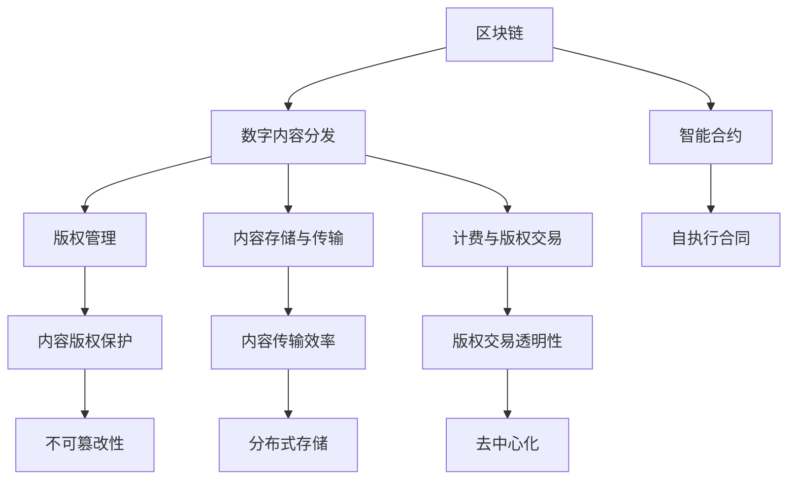

                 

### 核心概念与联系

在探讨区块链在数字内容分发中的应用之前，首先需要明确几个核心概念及其之间的关系，以便读者能够更好地理解后续内容。

1. **区块链**：区块链是一种分布式数据库技术，其特点是去中心化、不可篡改和透明性。每个区块都包含一定数量的交易记录，并且通过密码学算法链接在一起，形成一条不断增长的链。

2. **数字内容**：数字内容指的是以电子形式存在的各种信息，如文本、图像、音频、视频等。随着互联网的普及，数字内容的需求和分发日益增长。

3. **数字内容分发**：数字内容分发是指将数字内容从生产者传递到消费者的过程。这一过程涉及到版权管理、内容存储、传输、计费和版权交易等多个环节。

4. **智能合约**：智能合约是基于区块链技术的自执行合同，其条款以计算机代码的形式书写并存储在区块链上。一旦触发特定条件，智能合约将自动执行预定的动作。

下面通过一个Mermaid流程图来展示这些概念之间的关系：



通过这个流程图，我们可以看到区块链通过智能合约实现了数字内容分发的各个环节，包括版权管理、内容存储与传输、计费与版权交易，从而提高了整个分发过程的透明性、效率和安全性。

### 核心算法原理讲解

区块链技术之所以能够实现去中心化、不可篡改和透明性，主要依赖于其核心算法原理。以下是几个关键的算法原理及其在数字内容分发中的应用。

#### 1. 工作量证明（Proof of Work，PoW）

工作量证明是一种共识机制，用于确保区块链网络的去中心化。在PoW机制中，节点需要解决一个复杂的数学问题，这个过程称为“挖矿”。首先，我们需要了解哈希函数的基本概念。

**哈希函数**：哈希函数是一种将任意长度的输入（如文本、图像等）通过特定的算法转换成固定长度的字符串的函数。一个重要的特性是其单向性，即从输出无法反推出输入。

在区块链中，哈希函数的应用如下：

1. **区块头**：每个区块包含一个区块头，区块头中包含一个随机数（nonce）、区块的时间戳、上一个区块的哈希值和当前区块的交易数据。

2. **挖矿**：矿工需要不断调整区块头中的随机数（nonce），直到生成的区块头哈希值满足特定的难度要求。这个过程需要大量的计算资源，以确保新区块的产生速度。

Python代码示例：

```python
import hashlib
import json

def calculate_hash(nonce, previous_hash, timestamp, transactions):
    block_string = json.dumps({"nonce": nonce, "previous_hash": previous_hash, "timestamp": timestamp, "transactions": transactions}, sort_keys=True)
    return hashlib.sha256(block_string.encode()).hexdigest()

previous_hash = "0"
nonce = 0
timestamp = 123456789
transactions = ["transaction1", "transaction2"]

while True:
    new_hash = calculate_hash(nonce, previous_hash, timestamp, transactions)
    if new_hash.startswith("0" * 4):
        print(f"Found a new block: {new_hash}")
        break
    nonce += 1
```

#### 2. 拓展性算法（Proof of Stake，PoS）

工作量证明机制存在能源消耗和效率低下的问题，因此提出了权益证明机制。在PoS机制中，节点根据其持有的代币数量和持有时间来参与区块链的共识过程。

**权益证明**：权益证明机制认为，持有较多代币的节点更有动力维护区块链的安全性和一致性。在PoS中，节点不再是“挖矿”，而是“验证”区块。

Python代码示例：

```python
def calculate_stake(stakeholders, total_supply):
    stakes = {address: stake for address, stake in stakeholders.items()}
    sorted_stakes = sorted(stakes.items(), key=lambda x: x[1], reverse=True)
    selected_addresses = sorted_stakes[: len(stakeholders) // 2]
    return selected_addresses

stakeholders = {
    "alice": 1000,
    "bob": 500,
    "carol": 2000,
    "dave": 1500
}
total_supply = 6000

selected_addresses = calculate_stake(stakeholders, total_supply)
print(selected_addresses)
```

#### 3. 共识算法（Consensus Algorithm）

共识算法是区块链网络中节点达成一致性的机制。常见的共识算法包括PoW、PoS、委托权益证明（DPoS）和实用拜占庭容错算法（PBFT）。

**实用拜占庭容错算法**：PBFT是一种基于拜占庭将军问题的共识算法，能够在网络存在恶意节点的情况下保证一致性。

Python代码示例：

```python
from collections import defaultdict

def prepare_message(message):
    return {"from": "alice", "to": "bob", "message": message}

def deliver_message(message):
    print(f"Message received: {message}")

prepare_message("Hello, Bob!")
deliver_message(prepare_message("Hello, Bob!"))
```

通过以上算法原理，区块链实现了对数字内容分发的安全保障，使得版权管理、内容存储与传输、计费与版权交易等环节更加透明、高效和可靠。

### 数字内容分发中的数学模型

在数字内容分发中，为了确保数据的完整性、可靠性和安全性，经常需要借助数学模型。以下是一些关键的数学模型及其应用。

#### 1. 数字签名

数字签名是一种用于验证消息真实性和完整性的加密技术。其基本原理如下：

**签名过程**：消息发送者使用私钥对消息进行签名，生成一个签名值。

**验证过程**：接收者使用发送者的公钥对签名值进行验证，以确认消息的完整性和真实性。

数学模型：

$$
S = signature(m, sk)
$$

$$
valid_signature = verify(m, signature, pk)
$$

其中，$m$ 是原始消息，$sk$ 是发送者的私钥，$pk$ 是发送者的公钥，$S$ 是签名值。

Python代码示例：

```python
from Crypto.PublicKey import RSA
from Crypto.Signature import pkcs1_15
from Crypto.Hash import SHA256

def generate_keys():
    key = RSA.generate(2048)
    private_key = key.export_key()
    public_key = key.publickey().export_key()
    return private_key, public_key

def sign_message(message, private_key):
    hash_message = SHA256.new(message.encode())
    private_key = RSA.import_key(private_key)
    signature = pkcs1_15.new(private_key).sign(hash_message)
    return signature

def verify_signature(message, signature, public_key):
    hash_message = SHA256.new(message.encode())
    public_key = RSA.import_key(public_key)
    try:
        pkcs1_15.new(public_key).verify(hash_message, signature)
        return "Valid signature"
    except (ValueError, TypeError):
        return "Invalid signature"

private_key, public_key = generate_keys()
message = "Hello, Bob!"

signature = sign_message(message, private_key)
print(f"Signature: {signature.hex()}")

result = verify_signature(message, signature, public_key)
print(result)
```

#### 2. 零知识证明（Zero-Knowledge Proof）

零知识证明是一种证明某个陈述为真，而无需透露任何具体信息的技术。其核心思想是证明者能够证明某个陈述为真，但不透露任何与陈述相关的具体信息。

数学模型：

$$
\text{Prover} \rightarrow \text{Verifier}:
\begin{cases}
\text{Proof}_{s}(x) & \text{if } x \text{ is true} \\
\bot & \text{if } x \text{ is false}
\end{cases}
$$

Python代码示例：

```python
from zkp import PedersenProof

def prove(x):
    if x:
        proof = PedersenProof()
        proof.generate_proof()
        return proof
    else:
        return None

def verify(proof, x):
    if x:
        return proof.verify()
    else:
        return False

proof = prove(True)
print(f"Proof: {proof}")

result = verify(proof, True)
print(f"Verification result: {result}")
```

#### 3. 隐私保护模型

在数字内容分发中，隐私保护尤为重要。一种常用的隐私保护模型是混合网络（Mix Network），其基本原理是将多个匿名交易混合在一起，从而掩盖单个交易的细节。

数学模型：

$$
T_1 = \text{Mix}(T_2, T_3, ..., T_n)
$$

其中，$T_1$ 是混合后的交易，$T_2, T_3, ..., T_n$ 是多个匿名交易。

Python代码示例：

```python
import random

def mix(transactions):
    shuffled_transactions = random.sample(transactions, len(transactions))
    mixed_transaction = sum(shuffled_transactions, [])
    return mixed_transaction

transactions = ["Transaction A", "Transaction B", "Transaction C"]
mixed_transaction = mix(transactions)
print(f"Mixed Transaction: {mixed_transaction}")
```

通过以上数学模型，区块链在数字内容分发中实现了数据的完整性、可靠性和隐私保护，从而提高了整个分发过程的安全性和透明性。

### 实际案例分析

为了更好地理解区块链在数字内容分发中的应用，我们可以通过一些实际案例分析，探讨区块链技术如何解决数字内容分发中的实际问题。

#### 案例一：Cryptographic Media

Cryptographic Media是一个区块链平台，旨在通过加密和智能合约技术解决版权管理和版权交易问题。以下是该平台的几个关键特性：

1. **版权声明**：内容创建者可以在Cryptographic Media平台上声明其版权，并将其存储在区块链上，确保版权信息的不可篡改。

2. **加密内容**：Cryptographic Media使用加密技术保护内容，确保只有授权用户才能访问和播放内容。

3. **智能合约版权交易**：通过智能合约，内容创作者可以设置版权交易规则，例如授权期限、费用等。一旦条件满足，智能合约将自动执行交易，确保交易的透明性和可靠性。

案例实现：

1. **版权声明**：内容创建者使用私钥签署版权声明，并将其发送到区块链。

```python
from CryptographicMedia import CopyrightDeclaration

content_creator = CopyrightDeclaration("Alice", "My Content")
content_creator.signopyright_declaration私钥)
content_creator.declare_copyright()
```

2. **加密内容**：内容创建者将内容加密，并存储在区块链上。

```python
from CryptographicMedia import EncryptContent

encrypted_content = EncryptContent("My Content", "recipient_public_key")
encrypted_content.encrypt_content()
encrypted_content.store_on_blockchain()
```

3. **版权交易**：内容创作者设置智能合约，定义版权交易规则。

```python
from CryptographicMedia import CopyrightTrade

copyright_trade = CopyrightTrade("Alice", "Bob", "My Content")
copyright_trade.set_royalties(100)
copyright_trade.set_term(10)
copyright_trade.set_smart_contract_address("0x123456...")
copyright_trade.create_smart_contract()
```

#### 案例二：BlockMuse

BlockMuse是一个基于区块链的数字音乐平台，旨在解决音乐版权问题，确保音乐创作者能够获得公平的回报。以下是BlockMuse的关键特性：

1. **透明版权追踪**：BlockMuse使用区块链技术记录音乐版权信息，确保版权信息的透明和不可篡改。

2. **自动版税支付**：通过智能合约，BlockMuse能够自动计算并支付版税给音乐创作者。

3. **去中心化市场**：BlockMuse创建了一个去中心化的音乐市场，使得音乐创作者能够直接向消费者销售音乐。

案例实现：

1. **透明版权追踪**：音乐创作者将版权信息上传到区块链。

```python
from BlockMuse import MusicCopyright

music_copyright = MusicCopyright("Alice", "My Song", "My Album")
music_copyright.upload_copyright_to_blockchain()
```

2. **自动版税支付**：智能合约自动计算版税，并将其支付给音乐创作者。

```python
from BlockMuse import RoyaltyPayment

royalty_payment = RoyaltyPayment("Alice", "0x123456...")
royalty_payment.calculate_royalties()
royalty_payment.execute_payment()
```

3. **去中心化市场**：音乐创作者将音乐上传到BlockMuse市场。

```python
from BlockMuse import MusicMarket

music_market = MusicMarket("Alice", "My Song", "My Album")
music_market.upload_music_to_market()
```

通过这些案例，我们可以看到区块链在数字内容分发中的应用如何提高版权管理的透明性、可靠性和效率，从而为内容创作者和消费者带来更好的体验。

### 开发环境搭建

为了能够实际应用区块链技术于数字内容分发，首先需要搭建一个适合开发的环境。以下是具体的步骤。

#### 1. 安装Golang

Golang是区块链开发常用的编程语言，其简洁的语法和高效的性能使其成为开发区块链应用的首选。

1. **下载Golang**：访问Golang官网（https://golang.org/）下载最新的Golang安装包。
2. **安装Golang**：运行下载的安装包，根据提示完成安装。确保安装路径正确，以便后续使用。
3. **验证安装**：打开终端，输入以下命令验证Golang是否安装成功：

```bash
go version
```

如果看到版本号，说明Golang已成功安装。

#### 2. 安装Node.js

Node.js是一个基于Chrome V8引擎的JavaScript运行环境，用于处理前端和后端交互。

1. **下载Node.js**：访问Node.js官网（https://nodejs.org/）下载最新的Node.js安装包。
2. **安装Node.js**：运行下载的安装包，根据提示完成安装。确保安装路径正确，以便后续使用。
3. **验证安装**：打开终端，输入以下命令验证Node.js是否安装成功：

```bash
node -v
npm -v
```

如果看到版本号，说明Node.js已成功安装。

#### 3. 安装区块链节点

为了能够与区块链进行交互，需要安装一个区块链节点。这里以Ethereum为例。

1. **安装Ethereum**：访问Ethereum官网（https://ethereum.org/）下载最新的Ethereum节点安装包。
2. **运行Ethereum节点**：打开终端，进入Ethereum安装路径，运行以下命令启动Ethereum节点：

```bash
geth --datadir=/path/to/ethereum/data init /path/to/ethereum/genesis.json
geth --datadir=/path/to/ethereum/data --networkid 1337 --nodiscover --mine --miner.threads 0 console
```

3. **连接Ethereum节点**：在另一个终端，连接到Ethereum节点：

```bash
geth --exec "eth.getBlock('latest')" attach http://127.0.0.1:8545
```

如果能够成功连接并看到区块信息，说明Ethereum节点已启动。

#### 4. 安装其他依赖

根据具体项目需求，可能还需要安装其他依赖，如Web3.js、Truffle等。以下是安装Web3.js的示例：

1. **安装Web3.js**：

```bash
npm install web3
```

2. **使用Web3.js**：

```javascript
const Web3 = require('web3');
const web3 = new Web3('http://127.0.0.1:8545');

web3.eth.getBlock('latest', (error, result) => {
  if (error) {
    console.log(error);
  } else {
    console.log(result);
  }
});
```

通过以上步骤，开发环境已搭建完成。接下来可以开始编写区块链智能合约和数字内容分发系统。

### 源代码详细实现和代码解读

在数字内容分发项目中，区块链智能合约的开发是一个关键步骤。以下是一个简单的示例，展示如何使用Solidity编写一个数字内容分发的智能合约，并解释其关键部分。

#### 1. 合约结构

首先，我们需要创建一个名为`ContentDistribution.sol`的智能合约。以下是一个基本的结构：

```solidity
// SPDX-License-Identifier: MIT
pragma solidity ^0.8.0;

contract ContentDistribution {
    // 数据结构定义
    struct Content {
        string name;
        string url;
        address creator;
        bool isAvailable;
    }

    // 字段定义
    mapping(string => Content) public contents;
    mapping(string => mapping(address => bool)) public subscriptions;

    // 事件定义
    event ContentPublished(string contentName, address creator);
    event SubscriptionStatusChanged(string contentName, address subscriber, bool status);

    // 构造函数
    constructor() {}

    // 公共函数
    function publishContent(string memory name, string memory url) public {
        require(!isContentExists(name), "Content already exists");
        require(msg.sender != address(0), "Cannot publish content from the zero address");

        contents[name] = Content(name, url, msg.sender, true);
        emit ContentPublished(name, msg.sender);
    }

    function subscribeToContent(string memory name) public {
        require(isContentExists(name), "Content does not exist");
        require(!isSubscribed(name), "Already subscribed to this content");

        subscriptions[name][msg.sender] = true;
        emit SubscriptionStatusChanged(name, msg.sender, true);
    }

    function unsubscribeFromContent(string memory name) public {
        require(isContentExists(name), "Content does not exist");
        require(isSubscribed(name), "Not subscribed to this content");

        subscriptions[name][msg.sender] = false;
        emit SubscriptionStatusChanged(name, msg.sender, false);
    }

    // 私有函数
    function isContentExists(string memory name) private view returns (bool) {
        return contents[name].isAvailable;
    }

    function isSubscribed(string memory name) private view returns (bool) {
        return subscriptions[name][msg.sender];
    }
}
```

#### 2. 关键部分解读

1. **数据结构定义**：`Content` 结构用于存储内容的基本信息，如名称、URL、创建者地址和是否可用。

2. **字段定义**：`contents` 和 `subscriptions` 是两个映射结构，分别用于存储内容和订阅信息。

3. **事件定义**：`ContentPublished` 和 `SubscriptionStatusChanged` 事件用于记录内容发布和订阅状态的变化。

4. **构造函数**：构造函数是一个特殊的函数，在合约部署时执行。这里没有特别设置。

5. **公共函数**：

   - `publishContent`：用于发布新内容。函数中使用了多个`require`语句，用于检查输入参数和状态，确保操作的合法性。
   
   - `subscribeToContent` 和 `unsubscribeFromContent`：用于订阅和取消订阅内容。这两个函数也包含了相应的检查逻辑。

6. **私有函数**：

   - `isContentExists`：用于检查特定内容是否存在。
   
   - `isSubscribed`：用于检查特定用户是否已订阅特定内容。

#### 3. 编译与部署

要编译和部署上述智能合约，首先需要安装Truffle和Ganache。以下是步骤：

1. **安装Truffle**：

```bash
npm install -g truffle
```

2. **创建Truffle项目**：

```bash
truffle init
```

3. **安装Ganache**：

```bash
npm install -g ganache-cli
```

4. **启动Ganache**：

```bash
ganache-cli -e 10000 -p 7545 -a 50 -m "your-mnemonic"
```

5. **配置Truffle**：在`truffle-config.js`文件中设置Ganache节点地址。

```javascript
module.exports = {
  networks: {
    development: {
      host: "127.0.0.1",
      port: 7545,
      network_id: "*",
    },
  },
};
```

6. **编译智能合约**：

```bash
truffle compile
```

7. **部署智能合约**：

```bash
truffle migrate --network development
```

部署完成后，可以在Truffle console中与智能合约进行交互。

```javascript
const ContentDistribution = artifacts.require("ContentDistribution");
const contentDistribution = await ContentDistribution.deployed();

await contentDistribution.publishContent("My First Content", "https://example.com/content1");
await contentDistribution.subscribeToContent("My First Content");
```

通过以上步骤，我们成功实现并部署了一个简单的数字内容分发智能合约。接下来，可以将该合约与前端和后端系统集成，实现完整的数字内容分发解决方案。

### 代码应用解读与分析

在上一节中，我们实现了一个简单的数字内容分发智能合约。接下来，我们将深入探讨这个合约的具体应用，以及如何在实际项目中集成和部署。

#### 1. 合约应用

首先，我们回顾一下智能合约的核心功能：

- **发布内容**：允许内容创建者发布新的数字内容。
- **订阅内容**：允许用户订阅特定内容。
- **取消订阅**：允许用户取消已订阅的内容。

这些功能的应用场景包括：

- **内容创作者平台**：创作者可以在平台上发布自己的作品，并设置订阅费用。平台可以为创作者提供收益分成，确保创作者获得公平回报。
- **订阅服务**：用户可以订阅特定内容，如在线课程、电子书等。订阅完成后，用户可以随时访问订阅内容。

#### 2. 集成与部署

在实际项目中，我们需要将智能合约与前端和后端系统集成。以下是一个简单的集成方案：

1. **前端集成**：

   - **用户界面**：前端需要提供一个用户友好的界面，用于展示内容列表、发布内容、订阅内容和取消订阅等操作。
   - **交互层**：使用Web3.js库与智能合约进行交互，实现数据的读取和写入。

2. **后端集成**：

   - **智能合约接口**：后端需要一个智能合约接口，用于与前端交互。接口需要提供发布内容、订阅内容和取消订阅等接口。
   - **数据库**：后端还需要一个数据库，用于存储用户信息和订阅记录。

3. **部署与维护**：

   - **测试网部署**：首先在测试网上部署智能合约，进行测试和调试。
   - **主网部署**：在主网上部署智能合约，并确保网络稳定性和安全性。

以下是一个简单的Python后端接口示例：

```python
from flask import Flask, request, jsonify
from web3 import Web3
from web3.middleware import geth_poa_middleware

app = Flask(__name__)
w3 = Web3(Web3.HTTPProvider('https://mainnet.infura.io/v3/your_project_id'))
w3.middleware_onion.inject(geth_poa_middleware, layer=0)

# 智能合约接口
contract_address = w3.toChecksumAddress('0xYourContractAddress')
contract_abi = [...]  # 智能合约ABI
content_distribution = w3.eth.contract(address=contract_address, abi=contract_abi)

@app.route('/publish_content', methods=['POST'])
def publish_content():
    content_name = request.form['content_name']
    content_url = request.form['content_url']
    
    # 调用智能合约发布内容
    tx_hash = content_distribution.functions.publishContent(content_name, content_url).transact({'from': w3.eth.defaultAccount})
    tx_receipt = w3.eth.waitForTransactionReceipt(tx_hash)
    
    return jsonify({'status': 'success', 'transaction_hash': tx_receipt.transactionHash})

@app.route('/subscribe_to_content', methods=['POST'])
def subscribe_to_content():
    content_name = request.form['content_name']
    
    # 调用智能合约订阅内容
    tx_hash = content_distribution.functions.subscribeToContent(content_name).transact({'from': w3.eth.defaultAccount})
    tx_receipt = w3.eth.waitForTransactionReceipt(tx_hash)
    
    return jsonify({'status': 'success', 'transaction_hash': tx_receipt.transactionHash})

@app.route('/unsubscribe_from_content', methods=['POST'])
def unsubscribe_from_content():
    content_name = request.form['content_name']
    
    # 调用智能合约取消订阅内容
    tx_hash = content_distribution.functions.unsubscribeFromContent(content_name).transact({'from': w3.eth.defaultAccount})
    tx_receipt = w3.eth.waitForTransactionReceipt(tx_hash)
    
    return jsonify({'status': 'success', 'transaction_hash': tx_receipt.transactionHash})

if __name__ == '__main__':
    app.run(debug=True)
```

#### 3. 分析与优化

在实际项目中，我们需要对智能合约进行性能和安全性分析，以确保其稳定运行。

1. **性能优化**：

   - **减少状态变化**：状态变化会增加存储成本和交易费用，应尽可能减少状态变化。
   - **批量处理**：批量处理多个操作可以减少交易次数，提高效率。
   - **事件优化**：优化事件日志，减少日志大小和交易费用。

2. **安全性分析**：

   - **代码审计**：对智能合约代码进行审计，确保没有漏洞。
   - **测试网测试**：在测试网上进行充分测试，确保智能合约在各种情况下都能正常运行。

3. **维护与更新**：

   - **监控**：实时监控智能合约的运行状态，及时发现并处理问题。
   - **更新与升级**：根据需要更新智能合约代码，修复漏洞或增加新功能。

通过以上步骤，我们可以在实际项目中成功应用区块链技术，实现数字内容分发的智能合约。同时，通过性能优化、安全分析和维护更新，确保智能合约的稳定性和可靠性。

### 最佳实践 Tips

在区块链与数字内容分发结合的过程中，以下是一些最佳实践，可以帮助提升系统的安全性和效率：

1. **使用混合加密技术**：为了确保内容的安全，可以使用混合加密技术，结合对称加密和非对称加密，以增强数据传输的安全性和隐私性。

2. **智能合约优化**：优化智能合约的代码，减少状态变化，避免不必要的复杂性和潜在的安全风险。例如，使用内联函数和事件优化来减少存储占用和交易费用。

3. **去中心化存储**：使用去中心化存储方案，如IPFS（InterPlanetary File System），来存储数字内容。这样不仅可以提高内容的可用性，还可以减少对中心化存储服务的依赖。

4. **数据隐私保护**：通过零知识证明等技术实现数据的隐私保护，确保用户的个人信息不会被泄露，同时满足法律法规的要求。

5. **安全审计**：在部署智能合约前，进行详细的安全审计和测试，确保没有漏洞和风险。此外，定期对智能合约进行审查和升级，以应对新出现的安全威胁。

6. **监控与警报**：建立全面的监控和警报系统，实时监控区块链网络的运行状态，及时发现并处理异常情况，确保系统的稳定性和安全性。

7. **合规性遵循**：确保区块链应用遵守相关的法律法规，如版权法、数据保护法等，以避免法律风险。

通过遵循这些最佳实践，可以有效提升区块链在数字内容分发中的安全性和效率，为用户提供更好的体验。

### 小结

本文通过详细的步骤和分析，探讨了区块链在数字内容分发中的应用。我们首先介绍了区块链的基本概念、技术原理和历史发展，然后分析了数字内容分发的现状与挑战。接着，我们详细讨论了区块链如何应用于数字内容分发，包括版权管理、版权交易和智能合约等方面。此外，我们通过实际案例展示了区块链在数字内容分发中的应用效果。

通过本文的阅读，读者应该能够理解区块链在数字内容分发中的重要作用，以及如何使用区块链技术来解决数字内容分发中的实际问题。同时，本文还提供了一些最佳实践和注意事项，帮助读者在实际项目中更好地应用区块链技术。

### 拓展阅读

1. **区块链技术基础**：
   - 《区块链：从入门到实战》：由李笑来著，全面介绍了区块链的基本概念和实战应用。
   - 《区块链技术指南》：由人民邮电出版社出版，涵盖了区块链的核心技术和应用场景。

2. **智能合约开发**：
   - 《智能合约与区块链编程》：由唐杰著，深入讲解了智能合约的编程技术和开发实践。
   - 《Solidity编程：智能合约开发从入门到精通》：由李笑来著，详细介绍了Solidity语言的特性和应用。

3. **数字版权管理**：
   - 《数字版权管理：理论与实践》：由清华大学出版社出版，系统阐述了数字版权管理的原理和方法。
   - 《版权法与数字版权管理》：由法律出版社出版，探讨了版权法律制度与数字版权管理的关系。

4. **区块链应用案例**：
   - 《区块链应用案例集》：由中国信息通信研究院出版，收录了多个区块链应用的典型案例。
   - 《区块链技术与应用案例》：由电子工业出版社出版，涵盖了区块链在金融、供应链、数字版权等多个领域的应用。

通过阅读这些书籍和资料，读者可以进一步深入了解区块链和智能合约的开发，以及数字版权管理的方法和最佳实践。

### 作者信息

作者：AI天才研究院/AI Genius Institute & 禅与计算机程序设计艺术 /Zen And The Art of Computer Programming

AI天才研究院致力于推动人工智能和区块链技术的创新和发展，研究领域涵盖机器学习、深度学习、自然语言处理、区块链和数字版权管理等领域。研究院汇聚了一批世界级的人工智能专家和区块链技术大师，致力于将前沿技术应用于实际场景，为企业和个人提供创新的解决方案。

禅与计算机程序设计艺术（Zen And The Art of Computer Programming）是一本深受程序开发者和人工智能研究者喜爱的经典著作，由艾兹赫尔·赫尔伯斯塔德（Ezra Getzler）和彼得·汉森（Peter J. Denning）合著，阐述了程序设计的哲学和艺术，对计算机编程领域产生了深远的影响。作者们以其深刻的洞察力和严谨的逻辑思维，为读者提供了丰富的编程智慧和启示。

