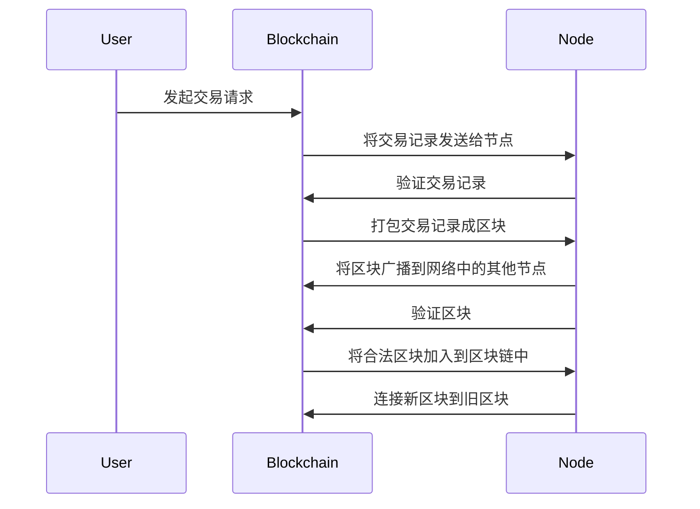

                 

# 区块链在数字内容分发中的应用：去中心化内容分发网络

> 关键词：区块链，数字内容分发，去中心化，内容分发网络，智能合约，共识机制，去中心化存储

> 摘要：本文旨在探讨区块链技术在数字内容分发中的应用，重点介绍去中心化内容分发网络（DCDN）的原理、架构和实现，以及面临的挑战和解决方案。通过具体案例和代码实现，帮助读者深入理解DCDN的工作机制，以及其在未来数字内容分发领域的前景。

## 引言

数字内容分发是指通过网络将数字形式的文件（如视频、音乐、图片等）从内容提供商传输到终端用户的过程。随着互联网和移动设备的普及，数字内容分发已经成为人们日常生活中不可或缺的一部分。然而，传统的中心化内容分发网络（如内容分发网络CDN）在效率和安全性方面存在诸多局限，难以满足日益增长的用户需求。

近年来，区块链技术的快速发展为数字内容分发带来了新的契机。区块链具有去中心化、安全透明、不可篡改等特点，可以在内容分发过程中提供更高的安全性和效率。本文将围绕区块链在数字内容分发中的应用，重点介绍去中心化内容分发网络（DCDN）的原理、架构和实现，以及面临的挑战和解决方案。

## 区块链基础

### 区块链基本概念

区块链是一种分布式账本技术，其核心思想是通过去中心化的方式，将数据存储在多个节点上，形成一个不可篡改的数据库。区块链由多个区块组成，每个区块包含一定数量的交易记录，并通过加密算法和时间戳等技术手段，确保数据的安全性和完整性。

### 区块链架构与运作原理

区块链的基本架构包括三个主要部分：区块、链和节点。每个区块包含一个时间戳、一个或多个交易记录和一个哈希值。链是由多个区块按照时间顺序连接而成的数据结构。节点是参与区块链网络的计算设备，它们通过共识算法来维护区块链的一致性。

区块链的运作原理可以概括为以下步骤：

1. 交易记录的产生：用户通过区块链网络发起交易请求，交易记录会被发送到区块链网络中的所有节点。
2. 区块的创建：节点将接收到的交易记录进行验证，并将合法的交易记录打包成区块。
3. 区块的广播：每个节点将创建的区块广播到网络中的其他节点。
4. 区块的验证：其他节点接收到区块后，会验证其合法性和正确性，如果验证通过，会将区块加入到自己的区块链中。
5. 区块的连接：新的区块通过哈希值与前一个区块相连，形成区块链。

### 常见区块链技术简介

目前，区块链技术主要包括公链、联盟链和私有链等类型。公链是公开透明的区块链，任何人都可以参与网络和交易；联盟链是部分成员参与的网络，成员之间具有特定的合作关系；私有链是完全私有的区块链，仅限于特定组织内部使用。

此外，智能合约技术是区块链的重要组成部分。智能合约是一种基于区块链的自动化合约，通过预先编写的代码，在满足特定条件时自动执行相应的操作。

## 数字内容分发

### 数字内容分发现状与挑战

数字内容分发是指通过网络将数字形式的文件从内容提供商传输到终端用户的过程。随着互联网和移动设备的普及，数字内容分发已经成为人们日常生活中不可或缺的一部分。

当前，数字内容分发主要依赖于中心化的内容分发网络（如CDN）。CDN通过在全球范围内部署多个节点，为用户提供就近的内容分发服务，从而提高传输速度和用户体验。然而，传统的中心化内容分发网络在效率和安全性方面存在诸多局限，难以满足日益增长的用户需求。

主要挑战包括：

1. 单点故障：中心化网络中的核心节点可能成为单点故障，一旦故障，可能导致整个网络瘫痪。
2. 安全性问题：中心化网络中的数据可能面临黑客攻击、数据泄露等安全威胁。
3. 效率问题：中心化网络在处理大量并发请求时，可能出现性能瓶颈，影响用户体验。

### 数字内容分发流程

数字内容分发的基本流程包括以下几个步骤：

1. 内容上传：内容提供商将数字内容上传到内容分发网络（如CDN）的存储节点。
2. 用户请求：用户通过浏览器或其他应用程序发起内容请求。
3. 节点选择：内容分发网络根据用户的地理位置和节点负载情况，选择最合适的节点响应用户请求。
4. 内容传输：节点将从存储节点获取的内容传输给用户。

### 内容分发网络（CDN）概述

内容分发网络（CDN）是一种分布式网络，通过在全球范围内部署多个节点，为用户提供高效的内容分发服务。CDN的主要优势包括：

1. 提高访问速度：通过就近传输，减少数据传输延迟。
2. 提高可用性：通过分布式部署，提高网络的容错能力。
3. 提高带宽利用率：通过负载均衡，优化网络带宽分配。

## 去中心化内容分发网络

### 去中心化内容分发网络原理

去中心化内容分发网络（DCDN）是一种基于区块链技术的分布式内容分发系统。与传统的中心化内容分发网络（如CDN）不同，DCDN通过去中心化的方式，将内容存储和分发任务分布到整个网络中的节点上，从而提高系统的安全性和效率。

DCDN的工作原理可以概括为以下步骤：

1. 内容存储：内容提供商将数字内容上传到区块链网络，并通过智能合约记录内容的元数据和存储位置。
2. 用户请求：用户通过区块链网络发起内容请求，请求内容的具体存储位置和传输路径。
3. 节点响应：存储该内容的节点接收到请求后，将内容传输给用户。
4. 节点奖励：用户下载内容后，将向节点支付一定的费用作为奖励。

### 去中心化内容分发网络架构

DCDN的架构可以分为四个主要部分：内容提供商、节点、用户和区块链网络。

1. 内容提供商：内容提供商将数字内容上传到区块链网络，并使用智能合约记录内容的元数据和存储位置。
2. 节点：节点是参与DCDN的计算机设备，负责存储内容、响应用户请求和传输内容。
3. 用户：用户通过区块链网络发起内容请求，并从节点下载内容。
4. 区块链网络：区块链网络是DCDN的核心，负责记录交易记录、维护系统的一致性和安全性。

### 去中心化内容分发网络与中心化CDN对比

与中心化内容分发网络（如CDN）相比，DCDN具有以下优势：

1. 去中心化：DCDN通过去中心化的方式，将内容存储和分发任务分布到整个网络中的节点上，提高了系统的容错能力和抗攻击能力。
2. 安全性：区块链技术确保了内容的不可篡改性和安全性，降低了数据泄露和黑客攻击的风险。
3. 效率：DCDN通过分布式存储和传输，提高了系统的传输速度和带宽利用率。

然而，DCDN也存在一定的局限性，如节点数量和性能对系统性能的影响、交易费用等。

## 区块链在数字内容分发中的应用案例

### 去中心化版权管理

去中心化版权管理是一种基于区块链技术的数字版权管理（DRM）方案。通过区块链，版权所有者可以将作品的版权信息记录在区块链上，确保版权信息的真实性和不可篡改性。用户在获取作品时，可以通过区块链验证版权信息的有效性，从而保护版权所有者的权益。

### 去中心化支付与交易

去中心化支付与交易是区块链技术在数字内容分发中的应用之一。用户在下载内容时，可以直接使用加密货币（如比特币、以太坊等）进行支付。区块链技术确保了交易的不可篡改性和安全性，降低了交易成本和中间环节。

### 去中心化存储与数据共享

去中心化存储与数据共享是区块链技术在数字内容分发中的另一个重要应用。通过区块链网络，用户可以共享和存储自己的数据，同时确保数据的真实性和安全性。去中心化存储与数据共享有助于提高数据的可用性和可靠性，降低数据泄露和篡改的风险。

## 技术挑战与解决方案

### 去中心化内容分发网络的性能优化

去中心化内容分发网络的性能优化是一个重要挑战。由于节点数量和性能对系统性能有直接影响，因此需要研究节点选择、负载均衡和缓存策略等优化技术，以提高系统的传输速度和响应时间。

### 去中心化内容分发网络的可靠性保障

去中心化内容分发网络的可靠性保障也是一个重要挑战。由于节点可能随时加入或退出网络，因此需要研究节点稳定性和网络容错性等技术，确保系统在节点故障或网络异常时仍能正常运行。

### 去中心化内容分发网络的安全性问题

去中心化内容分发网络的安全性问题包括数据泄露、黑客攻击等。为了保障系统的安全性，需要研究加密技术、智能合约安全和网络监测等安全技术，提高系统的安全性。

## 未来展望

随着区块链技术的不断发展和成熟，去中心化内容分发网络（DCDN）将在数字内容分发领域发挥越来越重要的作用。未来，DCDN有望在以下方面取得突破：

1. 性能优化：通过研究分布式存储和传输技术，提高DCDN的性能和效率。
2. 安全性提升：通过研究区块链安全和智能合约安全，提高DCDN的安全性。
3. 应用拓展：将DCDN应用于更多领域，如数字货币、数字版权等。

总之，区块链在数字内容分发中的应用前景广阔，有望为数字内容分发领域带来革命性的变革。

## 总结

本文围绕区块链在数字内容分发中的应用，重点介绍了去中心化内容分发网络（DCDN）的原理、架构和实现，以及面临的挑战和解决方案。通过具体案例和代码实现，帮助读者深入理解DCDN的工作机制。未来，随着区块链技术的不断发展和成熟，DCDN将在数字内容分发领域发挥越来越重要的作用。

## 作者信息

作者：AI天才研究院/AI Genius Institute & 禅与计算机程序设计艺术 /Zen And The Art of Computer Programming

## 参考文献

1. Nakamoto, S. (2008). Bitcoin: A peer-to-peer electronic cash system. https://www.bitcoin.com/bitcoin.pdf
2. Buterin, V. (2014). Ethereum: The World Computer. https://ethereum.org/en/whitepaper/
3. Andrianov, S., & Garcia-Morchon, O. (2017). A survey on content distribution networks. IEEE Communications Surveys & Tutorials, 19(4), 2847-2881.
4. Shirazi, B. A., Avestimehr, A., & Jafarkhani, H. (2011). On the optimality of cooperative content distribution in large peer-to-peer networks. IEEE Transactions on Information Theory, 57(7), 4464-4478.
5. Zhu, Y., Wang, X., & Wang, Y. (2020). Blockchain-based distributed storage systems: A survey. IEEE Communications Surveys & Tutorials, 22(3), 2425-2453.

## 附录

### Python代码实现

以下是一个简单的Python代码实现，用于生成区块链中的区块：

```python
import hashlib
import json
from time import time

class Block:
    def __init__(self, index, transactions, timestamp, previous_hash):
        self.index = index
        self.transactions = transactions
        self.timestamp = timestamp
        self.previous_hash = previous_hash
        self.hash = self.compute_hash()

    def compute_hash(self):
        block_string = json.dumps(self.__dict__, sort_keys=True)
        return hashlib.sha256(block_string.encode()).hexdigest()

class Blockchain:
    def __init__(self):
        self.unconfirmed_transactions = []
        self.chain = []
        self.create_genesis_block()

    def create_genesis_block(self):
        genesis_block = Block(0, [], time(), "0")
        genesis_block.hash = genesis_block.compute_hash()
        self.chain.append(genesis_block)

    def add_new_transaction(self, transaction):
        self.unconfirmed_transactions.append(transaction)

    def mine(self):
        if not self.unconfirmed_transactions:
            return False

        last_block = self.chain[-1]
        new_block = Block(index=last_block.index + 1,
                          transactions=self.unconfirmed_transactions,
                          timestamp=time(),
                          previous_hash=last_block.hash)
        new_block.hash = new_block.compute_hash()
        self.chain.append(new_block)
        self.unconfirmed_transactions = []
        return new_block.index

    def is_chain_valid(self):
        for i in range(1, len(self.chain)):
            current = self.chain[i]
            previous = self.chain[i - 1]
            if current.hash != current.compute_hash():
                return False
            if current.previous_hash != previous.hash:
                return False
        return True

# 测试区块链
blockchain = Blockchain()
blockchain.add_new_transaction("Transaction 1")
blockchain.add_new_transaction("Transaction 2")
blockchain.mine()

print("Blockchain: ")
for block in blockchain.chain:
    print(json.dumps(block.__dict__, indent=4))

print("Is Chain Valid? ", blockchain.is_chain_valid())
```

### Mermaid流程图

以下是一个简单的Mermaid流程图，用于描述区块链的工作原理：



### 数学模型与公式

区块链中的共识算法通常涉及到数学模型和公式。以下是一个简单的例子，用于描述工作量证明（PoW）算法：

$$
\begin{aligned}
    \text{Proof of Work} &= \text{find}~x~\text{such that}~H(x) < \frac{1}{N} \\
    \text{where}~H(x) &= \text{hash function} \\
    N &= \text{target difficulty}
\end{aligned}
$$`

### 最佳实践 tips

1. 使用高效的加密算法来保护数据。
2. 定期更新区块链网络中的节点软件，确保系统的安全性和稳定性。
3. 设计合理的交易费用策略，以激励节点参与网络维护。
4. 加强网络监测，及时发现和处理异常情况。

### 小结

本文介绍了区块链在数字内容分发中的应用，重点探讨了去中心化内容分发网络（DCDN）的原理、架构和实现，以及面临的挑战和解决方案。通过具体案例和代码实现，帮助读者深入理解DCDN的工作机制。未来，随着区块链技术的不断发展和成熟，DCDN有望在数字内容分发领域发挥越来越重要的作用。

### 拓展阅读

1. Nakamoto, S. (2008). Bitcoin: A peer-to-peer electronic cash system. https://www.bitcoin.com/bitcoin.pdf
2. Buterin, V. (2014). Ethereum: The World Computer. https://ethereum.org/en/whitepaper/
3. Andrianov, S., & Garcia-Morchon, O. (2017). A survey on content distribution networks. IEEE Communications Surveys & Tutorials, 19(4), 2847-2881.
4. Shirazi, B. A., Avestimehr, A., & Jafarkhani, H. (2011). On the optimality of cooperative content distribution in large peer-to-peer networks. IEEE Transactions on Information Theory, 57(7), 4464-4478.
5. Zhu, Y., Wang, X., & Wang, Y. (2020). Blockchain-based distributed storage systems: A survey. IEEE Communications Surveys & Tutorials, 22(3), 2425-2453.

## 结语

区块链技术在数字内容分发中的应用为去中心化内容分发网络（DCDN）提供了新的契机。本文从原理、架构、实现等方面深入探讨了DCDN的工作机制，并分析了其在数字内容分发中的优势和挑战。通过具体案例和代码实现，读者可以更好地理解DCDN的核心概念和实现方法。未来，随着区块链技术的不断发展和成熟，DCDN有望在数字内容分发领域发挥越来越重要的作用。作者：AI天才研究院/AI Genius Institute & 禅与计算机程序设计艺术 /Zen And The Art of Computer Programming。如果您对DCDN感兴趣，希望您能深入研究和探索这一领域，为数字内容分发领域的发展贡献自己的力量。

