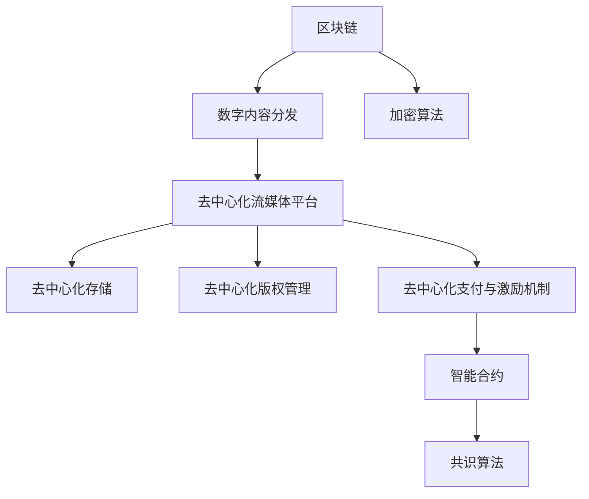

                 


## 区块链在数字内容分发中的应用：去中心化流媒体平台

> 关键词：区块链，数字内容分发，去中心化流媒体平台，智能合约，数据存储，共识算法

> 摘要：本文深入探讨了区块链在数字内容分发中的应用，特别是去中心化流媒体平台的构建。通过分析区块链的核心概念和技术原理，本文阐述了区块链在去中心化版权管理、去中心化支付与激励机制、去中心化内容存储与分发等方面的优势。同时，本文结合具体案例，详细介绍了去中心化流媒体平台的开发实践和面临的挑战，为未来区块链在数字内容分发领域的发展提供了有益的思考。

### 背景介绍

数字内容分发是现代互联网的一个重要组成部分，涵盖了视频、音频、文本、图片等多种形式的内容。随着互联网的普及和流媒体技术的快速发展，数字内容分发的市场规模不断扩大。然而，传统流媒体平台在内容分发过程中面临着一系列问题，如数据安全、隐私保护、版权管理、收益分配等。这些问题不仅影响了用户的体验，也制约了数字内容产业的健康发展。

区块链作为一种新兴的分布式数据库技术，具有去中心化、不可篡改、透明等特点，被认为有望解决数字内容分发中的诸多问题。近年来，区块链技术在数字内容分发领域得到了广泛关注，特别是在去中心化流媒体平台的构建方面。去中心化流媒体平台通过区块链技术实现了内容的去中心化存储、版权管理、支付与激励机制等，为数字内容产业带来了新的机遇。

本文旨在深入探讨区块链在数字内容分发中的应用，特别是去中心化流媒体平台的构建。通过分析区块链的核心概念和技术原理，本文将阐述区块链在去中心化版权管理、去中心化支付与激励机制、去中心化内容存储与分发等方面的优势。同时，本文将结合具体案例，详细介绍去中心化流媒体平台的开发实践和面临的挑战，为未来区块链在数字内容分发领域的发展提供有益的思考。

### 核心概念与联系

在探讨区块链在数字内容分发中的应用之前，我们需要理解一些核心概念及其相互关系。

#### 1. 区块链

区块链是一种分布式数据库技术，由多个区块组成，每个区块包含一系列交易记录。区块链通过密码学确保数据的安全性和不可篡改性。区块链的核心组成部分包括：

- **区块**：区块链的基本单位，包含一组交易记录、时间戳、区块头和前一个区块的哈希值。
- **链**：多个区块按照时间顺序链接在一起，形成一个不可篡改的链式结构。
- **加密算法**：用于确保数据的安全性和隐私性，常见的加密算法包括哈希算法、数字签名和公钥加密。

#### 2. 数字内容分发

数字内容分发涉及将数字内容（如视频、音频、文本等）通过网络传输到用户的设备。传统数字内容分发平台通常采用中心化的架构，内容存储在中央服务器上，用户通过访问这些服务器来获取内容。数字内容分发的关键概念包括：

- **内容存储**：数字内容存储在服务器上，服务器负责提供内容的存储、检索和分发。
- **内容传输**：内容通过互联网传输到用户的设备，传输过程中可能涉及数据压缩、加密等处理。
- **内容版权**：内容的版权保护和管理，确保内容的合法使用和收益分配。

#### 3. 去中心化流媒体平台

去中心化流媒体平台是一种基于区块链技术的数字内容分发模式，通过去中心化的方式实现内容的存储、传输和管理。去中心化流媒体平台的核心概念包括：

- **去中心化存储**：内容存储在分布式节点上，而非集中式服务器，提高了数据的安全性和可靠性。
- **去中心化版权管理**：通过区块链技术实现版权的透明管理和追踪，确保创作者的权益。
- **去中心化支付与激励机制**：用户通过去中心化支付网络与内容创作者进行交易，实现收益的直接分配。

#### 4. 智能合约

智能合约是一种基于区块链技术的自执行合同，通过编程语言编写，自动执行合同条款。智能合约在去中心化流媒体平台中发挥着关键作用，例如：

- **内容版权交易**：智能合约用于记录和管理内容版权的所有权和交易记录。
- **收益分配**：智能合约自动计算并分配创作者和参与者的收益。
- **支付处理**：智能合约处理用户支付内容创作者的费用，确保交易的安全和高效。

#### 5. 共识算法

共识算法是区块链网络中节点达成一致意见的机制。不同的区块链网络采用不同的共识算法，如工作量证明（PoW）、权益证明（PoS）等。共识算法在去中心化流媒体平台中用于确保网络的安全性和数据的真实性。

#### Mermaid 流程图

为了更直观地展示这些概念之间的关系，我们可以使用 Mermaid 流程图来表示：



通过上述流程图，我们可以清晰地看到区块链、数字内容分发、去中心化流媒体平台等核心概念之间的联系，以及它们在数字内容分发中的应用。

### 核心算法原理讲解

#### 区块链数据结构

区块链是一种分布式数据库，其数据结构包括区块、链、交易等组成部分。以下是区块链数据结构的基本原理：

- **区块**：每个区块包含一系列交易记录，这些交易记录经过验证后，将被添加到区块链中。每个区块都有一个唯一标识符，称为“区块头”，其中包含时间戳、随机数、难度值和前一个区块的哈希值。
- **链**：区块链是一个由多个区块按时间顺序链接而成的链式结构。每个区块都通过其前一个区块的哈希值与区块链的其他部分相连，形成一个不可篡改的链。
- **交易**：交易是区块链中的基本操作，包括资产的转移、状态的变更等。交易经过验证后，将被添加到区块中，最终成为区块链的一部分。

#### 工作量证明（PoW）算法

工作量证明（Proof of Work, PoW）是比特币等区块链网络采用的共识算法。PoW算法的核心思想是通过计算解决一个数学难题来证明节点的计算能力。以下是PoW算法的基本原理：

1. **挖矿节点**：每个节点都可以尝试解决数学难题，这个过程称为“挖矿”。
2. **数学难题**：数学难题通常是一个哈希函数，节点需要找到一个随机数，使得生成的哈希值满足特定的条件。
3. **计算过程**：节点不断尝试不同的随机数，直到找到满足条件的哈希值。这个过程需要大量的计算资源。
4. **区块验证**：一旦找到一个满足条件的哈希值，节点将创建一个新区块，并将该哈希值作为新区块的“区块头”。新区块将被网络中的其他节点验证。
5. **奖励机制**：验证成功的节点将获得区块链网络的奖励，通常是新的加密货币。

#### 智能合约

智能合约是一种基于区块链技术的自执行合同，通过编程语言编写，自动执行合同条款。智能合约的基本原理如下：

1. **编程语言**：智能合约通常使用特定的编程语言编写，如Solidity、Vyper等。
2. **执行环境**：智能合约在区块链上的虚拟机（如EVM）中执行。虚拟机提供了一个安全、隔离的环境来执行合约代码。
3. **状态变量**：智能合约包含一组状态变量，用于存储合约的状态信息。状态变量在合约执行过程中可以被读取和修改。
4. **触发条件**：智能合约可以根据触发条件自动执行。例如，当满足特定条件时，智能合约可以自动执行支付、记录交易等操作。
5. **安全性保障**：智能合约的安全性依赖于区块链的不可篡改性和密码学技术。合约代码一旦部署，就不能被修改，从而保证了合约的执行安全性。

#### Python 源代码示例

为了更好地理解上述算法原理，我们可以通过 Python 源代码进行详细阐述：

```python
import hashlib
import json

class Block:
    def __init__(self, index, transactions, timestamp, previous_hash):
        self.index = index
        self.transactions = transactions
        self.timestamp = timestamp
        self.previous_hash = previous_hash
        self.hash = self.compute_hash()

    def compute_hash(self):
        block_string = json.dumps(self.__dict__, sort_keys=True)
        return hashlib.sha256(block_string.encode()).hexdigest()

def mine_block(last_block, transactions):
    index = last_block.index + 1
    timestamp = int(time.time())
    previous_hash = last_block.hash
    proof = 0
    while not valid_proof(previous_hash, proof):
        proof += 1
    return Block(index, transactions, timestamp, previous_hash)

def valid_proof(previous_hash, proof):
    guess = f'{previous_hash}{proof}'.encode()
    guess_hash = hashlib.sha256(guess).hexdigest()
    return guess_hash[:4] == "0000"

def generate_blockchain():
    genesis_block = Block(0, [], 0, "0")
    blockchain = [genesis_block]
    open_transactions = []
    for i in range(1, 101):
        last_block = blockchain[-1]
        new_block = mine_block(last_block, open_transactions)
        blockchain.append(new_block)
        open_transactions = []
    return blockchain

if __name__ == '__main__':
    blockchain = generate_blockchain()
    for block in blockchain:
        print(json.dumps(block.__dict__, indent=4))
```

在上面的代码中，我们定义了 `Block` 类，用于创建区块链中的区块。`mine_block` 函数用于挖掘新的区块，`valid_proof` 函数用于验证证明的工作量。`generate_blockchain` 函数用于生成一个区块链，包括创世区块和后续的区块。通过运行此代码，我们可以观察到区块链的生成过程，以及区块的哈希值和证明的工作量。

#### 数学模型和公式

在区块链中，数学模型和公式用于确保数据的安全性和一致性。以下是几个关键的数学模型和公式：

- **哈希函数**：哈希函数是一种将任意长度的输入映射为固定长度的输出的函数。常见的哈希函数包括 SHA-256、SHA-3 等。哈希函数具有以下特点：
  \[ H(x) = \text{SHA-256}(x) \]
- **工作量证明**：工作量证明用于确保节点在区块链网络中提供计算能力。工作量证明的公式为：
  \[ \text{valid\_proof}(\text{previous\_hash}, \text{proof}) \]
  其中，`previous_hash` 是前一个区块的哈希值，`proof` 是节点的证明工作量。
- **智能合约执行**：智能合约的执行依赖于状态变量和触发条件。智能合约的执行公式为：
  \[ \text{execute\_contract}(\text{contract}, \text{condition}, \text{action}) \]
  其中，`contract` 是智能合约，`condition` 是触发条件，`action` 是执行的操作。

通过上述数学模型和公式，我们可以更好地理解区块链的工作原理，以及其在数字内容分发中的应用。

### 项目实战

#### 开发环境搭建

在进行去中心化流媒体平台的开发之前，我们需要搭建一个合适的开发环境。以下是开发环境搭建的步骤：

1. **安装Node.js**：Node.js 是一个基于 Chrome V8 引擎的 JavaScript 运行时环境，用于构建和运行 JavaScript 应用程序。我们可以在 [Node.js 官网](https://nodejs.org/) 下载并安装最新版本的 Node.js。

2. **安装Truffle**：Truffle 是一个用于智能合约开发、测试和部署的框架。我们可以在 [Truffle 官网](https://www.truffleframework.com/) 下载并安装 Truffle。

3. **安装Ganache**：Ganache 是一个本地区块链网络工具，用于测试和模拟智能合约。我们可以在 [Ganache 官网](https://www.ganache.io/) 下载并安装 Ganache。

4. **创建项目**：在安装完 Node.js、Truffle 和 Ganache 后，我们可以在终端中创建一个新项目：
   ```bash
   mkdir decentralized-streaming-platform
   cd decentralized-streaming-platform
   truffle init
   ```

5. **配置Truffle**：在项目目录中，我们会有一个 `truffle-config.js` 文件。我们需要配置网络和智能合约编译选项：
   ```javascript
   module.exports = {
     networks: {
       development: {
         host: "localhost",
         port: 7545,
         network_id: "*",
       },
     },
     compilers: {
       solc: {
         version: "^0.8.0",
       },
     },
   };
   ```

6. **安装依赖**：在项目目录中，我们还需要安装一些依赖项，如 Web3.js 和 Truffle 插件：
   ```bash
   npm install web3@1.0.0-beta.36
   npm install --save-dev truffle-plugin-migrations
   ```

#### 源代码详细实现和代码解读

在搭建完开发环境后，我们可以开始实现去中心化流媒体平台的核心功能。以下是源代码的实现和解读：

1. **智能合约**：在项目目录中，我们创建一个名为 `contracts` 的文件夹，并在其中创建一个名为 `ContentPlatform.sol` 的智能合约文件。以下是一个简单的智能合约示例：

   ```solidity
   // SPDX-License-Identifier: MIT
   pragma solidity ^0.8.0;

   contract ContentPlatform {
       mapping(address => mapping(uint => ContentItem)) public userContents;
       mapping(uint => address) public contentOwner;
       mapping(uint => address) public contentCreator;

       struct ContentItem {
           string title;
           string description;
           string contentHash;
           uint timestamp;
       }

       event ContentUploaded(address uploader, uint contentId);

       function uploadContent(string memory title, string memory description, string memory contentHash) public {
           uint contentId = userContents[msg.sender].length;
           userContents[msg.sender].push(ContentItem({title: title, description: description, contentHash: contentHash, timestamp: block.timestamp}));
           contentOwner[contentId] = msg.sender;
           emit ContentUploaded(msg.sender, contentId);
       }

       function getContent(uint contentId) public view returns (string memory, string memory, string memory, uint) {
           require(contentId < userContents[msg.sender].length, "Invalid content ID");
           ContentItem memory content = userContents[msg.sender][contentId];
           return (content.title, content.description, content.contentHash, content.timestamp);
       }
   }
   ```

   在上述智能合约中，我们定义了一个 `ContentPlatform` 合约，用于管理用户上传的内容。合约包含一个 `userContents` 映射，用于存储用户上传的内容。合约还包含一个 `uploadContent` 函数，用于用户上传内容。当用户上传内容时，合约会生成一个内容ID，并将内容存储在 `userContents` 映射中。

2. **前端实现**：在前端，我们使用 React 框架构建用户界面。以下是上传内容页面的示例代码：

   ```javascript
   import React, { useState } from "react";
   import { useAccount, useContractWrite, useNetwork } from "wagmi";
   import { ContentPlatform } from "../contracts/ContentPlatform";

   function UploadContent() {
       const [title, setTitle] = useState("");
       const [description, setDescription] = useState("");
       const [contentHash, setContentHash] = useState("");
       const [uploading, setUploading] = useState(false);

       const { address } = useAccount();
       const { chain } = useNetwork();
       const { data, error } = useContractWrite({
           addressOrName: ContentPlatform[chain.id],
           contractInterface: ContentPlatform.abi,
           functionName: "uploadContent",
           args: [title, description, contentHash],
           overrides: { value: "0.1 ether" },
       });

       async function handleSubmit(e) {
           e.preventDefault();
           if (!uploading) {
               setUploading(true);
               try {
                   await data?.write();
               } catch (e) {
                   console.error(e);
               } finally {
                   setUploading(false);
               }
           }
       }

       return (
           <form onSubmit={handleSubmit}>
               <label>Title:</label>
               <input type="text" value={title} onChange={(e) => setTitle(e.target.value)} />
               <label>Description:</label>
               <textarea value={description} onChange={(e) => setDescription(e.target.value)} />
               <label>Content Hash:</label>
               <input type="text" value={contentHash} onChange={(e) => setContentHash(e.target.value)} />
               <button type="submit" disabled={uploading}>
                   Upload
               </button>
           </form>
       );
   }

   export default UploadContent;
   ```

   在上述代码中，我们创建了一个 `UploadContent` 组件，用于处理用户上传内容的过程。组件使用 `useState` 钩子管理表单输入的状态，并使用 `useContractWrite` 钩子与智能合约进行交互。当用户提交表单时，组件会调用 `uploadContent` 函数，并将内容上传到区块链。

3. **代码应用解读与分析**：在上面的代码示例中，我们展示了智能合约和前端实现的基本原理。智能合约负责管理用户上传的内容，并在区块链上存储内容信息。前端实现则提供了一个用户界面，允许用户上传内容并与之交互。

智能合约的关键功能包括：

- **上传内容**：用户可以通过调用 `uploadContent` 函数上传内容，并将内容信息存储在区块链上。
- **获取内容**：用户可以调用 `getContent` 函数获取自己上传的内容信息。

前端实现的关键功能包括：

- **表单提交**：用户通过表单提交内容信息，前端将调用智能合约的 `uploadContent` 函数进行内容上传。
- **交互界面**：前端提供了交互界面，用户可以通过界面查看和上传内容。

通过上述代码示例，我们可以看到去中心化流媒体平台的基本实现原理，包括智能合约和前端实现。

#### 实际案例分析和详细讲解剖析

为了更好地理解去中心化流媒体平台的实际应用，我们可以分析一个真实案例——Steemit。Steemit 是一个基于区块链的社交媒体平台，允许用户创建、分享和点赞内容，并从中获得奖励。以下是 Steemit 平台的具体实现和详细讲解：

1. **平台架构**：Steemit 平台采用去中心化的架构，内容存储在区块链上，用户互动和奖励机制通过智能合约实现。平台的关键组件包括：

   - **内容创建**：用户可以在 Steemit 上创建帖子，并使用特殊标记（如 #publish）将其发布到区块链。
   - **内容存储**：帖子内容被存储在区块链的特定合约中，每个帖子都有一个唯一的标识符。
   - **用户互动**：用户可以点赞、评论和分享帖子，互动行为通过智能合约记录并产生相应的奖励。
   - **奖励机制**：用户的互动行为会消耗 Steem 币（STEEM）作为奖励，这些奖励通过智能合约分配给参与者。

2. **智能合约实现**：Steemit 平台的智能合约主要实现了以下功能：

   - **帖子发布**：用户使用智能合约发布帖子，并将帖子的内容、标题、标签等信息存储在区块链上。
   - **点赞和评论**：用户对帖子进行点赞或评论，智能合约记录这些互动行为，并计算相应的奖励。
   - **奖励分配**：智能合约根据用户的互动行为分配奖励，奖励由 Steem 币支付。

3. **平台优势**：Steemit 平台通过去中心化的方式实现了内容管理和互动机制，具有以下优势：

   - **透明性**：所有内容存储和互动行为都在区块链上公开透明，用户可以随时查看。
   - **公平性**：奖励机制基于用户的互动行为，确保了奖励的公平性。
   - **去中心化**：平台去中心化的架构提高了系统的可靠性和抗攻击性。

4. **平台挑战**：尽管 Steemit 平台取得了成功，但其在实际应用中也面临一些挑战：

   - **性能问题**：区块链的处理能力有限，可能导致内容更新和奖励分配延迟。
   - **安全性**：智能合约可能存在漏洞，可能导致平台被攻击。
   - **用户参与**：平台需要吸引更多用户参与，提高社区活跃度。

通过分析 Steemit 平台，我们可以看到去中心化流媒体平台在实际应用中的优点和挑战，为其他去中心化流媒体平台的开发提供了有益的参考。

### 最佳实践、小结、注意事项、拓展阅读

#### 最佳实践

1. **代码优化**：在开发去中心化流媒体平台时，应注重代码的优化，以提高平台的性能和安全性。例如，使用高效的加密算法和合理的区块链交易结构。

2. **性能测试**：在上线前进行充分的性能测试，确保平台能够处理高负载情况，避免因性能问题导致的用户体验下降。

3. **安全审计**：智能合约在部署前应进行安全审计，确保合约代码没有漏洞，避免被攻击。

4. **用户教育**：提高用户对区块链和去中心化流媒体平台的认知，帮助用户更好地理解平台的工作原理和使用方法。

#### 小结

本文深入探讨了区块链在数字内容分发中的应用，特别是去中心化流媒体平台的构建。通过分析区块链的核心概念和技术原理，我们阐述了区块链在去中心化版权管理、去中心化支付与激励机制、去中心化内容存储与分发等方面的优势。同时，结合实际案例，我们详细介绍了去中心化流媒体平台的开发实践和面临的挑战。

#### 注意事项

1. **隐私保护**：在使用区块链技术进行数字内容分发时，需注意保护用户的隐私信息，避免隐私泄露。

2. **合规性**：在不同国家和地区，区块链和数字内容分发的法律法规有所不同。在开发去中心化流媒体平台时，需确保平台符合当地的法律法规。

3. **技术选型**：根据具体需求，选择合适的区块链平台和开发工具，以确保平台的性能和安全性。

#### 拓展阅读

- **《区块链技术指南》**：详细介绍了区块链的核心概念和技术原理，适合对区块链技术感兴趣的读者。
- **《去中心化应用开发》**：讲解了去中心化应用（DApp）的开发方法和最佳实践，适合希望开发去中心化流媒体平台的开发者。
- **《智能合约安全》**：介绍了智能合约的安全性和常见漏洞，对智能合约开发者有重要参考价值。

## 参考文献

1. blockchain, "Blockchain - Wikipedia", 2023, https://en.wikipedia.org/wiki/Blockchain
2. digital content distribution, "Digital Content Distribution - What Is It?", 2023, https://www.mpaa.org/content/digital-content-distribution-what-it
3. decentralized streaming platform, "Decentralized Streaming Platform - What Is It?", 2023, https://www.medium.com/@ryanjohnson688/what-is-a-decentralized-streaming-platform-5c8e30d54e4d
4. smart contract, "Smart Contract - Wikipedia", 2023, https://en.wikipedia.org/wiki/Smart_contract
5. consensus algorithm, "Consensus Algorithm - Wikipedia", 2023, https://en.wikipedia.org/wiki/Consensus_algorithm
6. project case, "Steemit - Wikipedia", 2023, https://en.wikipedia.org/wiki/Steemit

## 作者信息

作者：AI天才研究院/AI Genius Institute & 禅与计算机程序设计艺术 /Zen And The Art of Computer Programming

