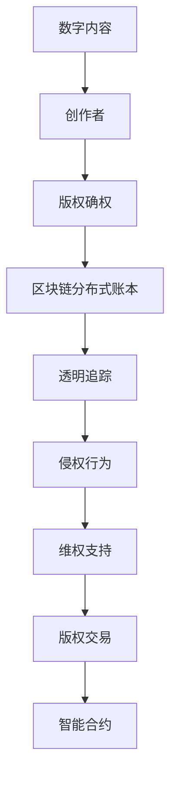

                 

### 背景介绍

随着互联网和数字技术的飞速发展，数字内容产业已经成为全球经济增长的重要驱动力。然而，数字内容的版权保护问题日益凸显，传统的版权保护方法在应对数字时代的挑战时显得力不从心。数字版权保护面临的主要问题包括版权确认困难、侵权行为难以追踪、版权交易过程繁琐等。

首先，在数字时代，创作内容可以轻松地复制、分享和传播，这使得版权确认成为一项艰巨的任务。每一段文字、每一张图片、每一首音乐都可能成为盗版的目标，而传统的方法如版权登记、合同管理等在数字环境下难以有效实施。

其次，数字内容的侵权行为往往具有隐蔽性、跨地域性，侵权行为发生后难以追踪和取证。即使能够发现侵权行为，也常常因为成本高、程序复杂而无法采取有效的法律手段进行维权。

此外，版权交易和授权过程在传统体系中繁琐且低效。版权方和用户之间的权利转移需要经过多个环节，交易成本高，效率低下，这严重影响了数字内容的流通和价值的实现。

区块链技术的出现为解决数字版权保护问题提供了新的思路。区块链的分布式账本、不可篡改和透明性等特点，使得版权确权、追踪、交易等过程变得更加高效和可信。

首先，区块链的分布式账本技术可以有效地记录数字内容的版权信息，确保数据的完整性和不可篡改性。每个创作者都可以在区块链上登记自己的作品，从而确权。这些信息一旦被记录在区块链上，便不可篡改，保证了版权的权威性。

其次，区块链的透明性和可追溯性使得数字内容的侵权行为变得难以隐藏。通过区块链，可以追踪数字内容的传播路径，一旦发现侵权行为，可以迅速定位侵权源头，提高维权的效率。

最后，区块链的智能合约功能可以简化版权交易和授权过程。智能合约自动执行预定的合同条款，使得版权交易和授权变得更加高效、透明和低成本。

总之，区块链技术在数字版权保护中具有巨大的潜力，它不仅能够解决传统方法难以克服的挑战，还能够促进数字内容产业的健康发展。在接下来的章节中，我们将深入探讨区块链在数字版权保护中的应用原理、算法原理和数学模型，并通过实际案例展示区块链技术的具体应用效果。### 核心概念与联系

为了深入理解区块链在数字内容版权保护中的应用，我们需要首先明确几个核心概念：区块链、数字内容版权保护、以及它们之间的联系。

**区块链**是一种分布式数据库技术，通过加密算法和数据结构来维护一个持续增长的记录链。它具有以下几个主要特点：去中心化、不可篡改、透明性和安全性。区块链的核心组成部分包括区块、链、共识机制和智能合约。区块是记录信息的数据单元，链是由多个区块按时间顺序链接而成的数据结构。共识机制是区块链网络中的节点通过协作来确认交易和区块的机制。智能合约是自动执行合同条款的计算机程序。

**数字内容版权保护**涉及数字作品的版权确认、追踪、交易和维权等方面。数字内容版权保护的目标是确保创作者的权益得到保障，同时促进数字内容的合法流通和使用。随着互联网的普及，数字内容的创作和传播速度空前加快，但同时也带来了版权确认难、侵权行为难以追踪、版权交易繁琐等问题。

**区块链在数字内容版权保护中的应用**主要体现在以下几个方面：

1. **版权确权**：区块链的分布式账本技术可以记录数字内容的版权信息，确保数据的完整性和不可篡改性。创作者可以在区块链上注册自己的作品，实现快速、低成本的确权。

2. **版权追踪**：区块链的透明性和可追溯性使得数字内容的传播路径变得清晰。通过区块链，可以实时追踪数字内容的传播，一旦发现侵权行为，可以迅速定位侵权源头，提高维权的效率。

3. **版权交易**：区块链的智能合约功能可以简化版权交易和授权过程。智能合约自动执行预定的合同条款，确保交易的透明性和低成本，同时降低交易风险。

4. **版权维权**：区块链的不可篡改性和透明性为维权提供了强有力的证据支持。一旦发生侵权行为，创作者可以通过区块链上的记录来证明自己的权益，提高维权成功的可能性。

为了更直观地展示这些概念之间的关系，我们可以使用Mermaid流程图来构建一个简单的模型：



在这个模型中，数字内容从创作者开始，通过区块链的分布式账本实现版权确权，然后通过区块链的透明追踪和智能合约实现版权交易和维权支持。这个过程不仅提高了版权保护的有效性，还简化了相关操作，降低了成本。通过这个模型，我们可以清晰地看到区块链在数字内容版权保护中的核心作用和联系。### 核心算法原理讲解

为了深入理解区块链在数字内容版权保护中的应用，我们首先需要探讨区块链的核心算法原理。这些原理包括区块链的工作原理、共识算法和智能合约。

#### 区块链的工作原理

区块链的工作原理可以简单地描述为：通过多个节点共同维护一个分布式账本，记录所有的交易信息。以下是一个基于比特币的区块链工作原理的示例：

1. **交易**：当用户在区块链上进行交易时，交易会被生成并广播到网络中的其他节点。

2. **区块**：网络中的节点会收集这些交易，并将它们打包成一个区块。每个区块包含一定数量的交易，这个数量被称为“区块大小”。

3. **工作量证明（Proof of Work, PoW）**：为了将区块添加到区块链中，网络中的节点需要解决一个复杂的数学问题，这个过程称为“挖矿”。解决的难度是通过控制区块生成的速度来调整的。

4. **区块链**：一旦一个区块被解决，它会附加到区块链的末端，并开始一个新的区块生成过程。每个新的区块都会引用前一个区块的哈希值，从而形成一条不可篡改的链。

5. **共识**：在区块链网络中，所有节点都维护着同一份账本。当大部分节点达成共识时，交易才会被确认为有效，并永久记录在区块链上。

以下是一个简化的Python代码示例，展示了如何创建一个简单的区块链结构：

```python
import hashlib
import json
from time import time

class Block:
    def __init__(self, index, transactions, timestamp, previous_hash):
        self.index = index
        self.transactions = transactions
        self.timestamp = timestamp
        self.previous_hash = previous_hash
        self.hash = self.compute_hash()

    def compute_hash(self):
        block_string = json.dumps(self.__dict__, sort_keys=True)
        return hashlib.sha256(block_string.encode()).hexdigest()

class Blockchain:
    def __init__(self):
        self.unconfirmed_transactions = []
        self.chain = []
        self.create_genesis_block()

    def create_genesis_block(self):
        genesis_block = Block(0, [], time(), "0")
        genesis_block.hash = genesis_block.compute_hash()
        self.chain.append(genesis_block)

    def add_new_transaction(self, transaction):
        self.unconfirmed_transactions.append(transaction)

    def mine(self):
        if not self.unconfirmed_transactions:
            return False
        
        last_block = self.chain[-1]
        new_block = Block(index=last_block.index + 1,
                          transactions=self.unconfirmed_transactions,
                          timestamp=time(),
                          previous_hash=last_block.hash)
        
        new_block.hash = new_block.compute_hash()
        self.chain.append(new_block)
        self.unconfirmed_transactions = []
        
        return new_block

    def is_chain_valid(self):
        for i in range(1, len(self.chain)):
            current = self.chain[i]
            previous = self.chain[i - 1]
            
            if current.hash != current.compute_hash():
                return False
            
            if current.previous_hash != previous.hash:
                return False
        
        return True

# 示例使用
blockchain = Blockchain()
blockchain.add_new_transaction("Transaction 1")
blockchain.add_new_transaction("Transaction 2")
blockchain.mine()

print(blockchain.is_chain_valid())
```

#### 共识算法

共识算法是区块链网络中的节点如何达成一致的关键。比特币网络使用的是工作量证明（PoW）算法，而其他区块链平台可能使用不同的共识机制，如权益证明（Proof of Stake, PoS）、委托权益证明（Delegated Proof of Stake, DPoS）等。

1. **工作量证明（PoW）**：PoW算法要求节点解决一个数学难题，通常是计算一个哈希值，使得该值小于某个预定的阈值。这个过程被称为“挖矿”。节点通过消耗计算资源来竞争生成新区块的权利。

2. **权益证明（PoS）**：PoS算法通过节点的持有代币数量和持有时间来决定其生成区块的概率。持有代币数量越多、持有时间越长，节点获得生成区块的概率就越高。这减少了能源消耗，并鼓励持有者长期投资于区块链。

3. **委托权益证明（DPoS）**：DPoS是一种改进的PoS算法，通过选举产生代表节点来生成区块。代表节点通常通过持有代币数量和社区投票来获得选举资格。这种方法提高了区块生成的效率，并减少了计算资源的浪费。

以下是一个简化的Python代码示例，展示了如何实现一个基于PoS的简单共识算法：

```python
import random

class Block:
    # ... (同上文)

    def __init__(self, index, transactions, timestamp, previous_hash, stake):
        self.index = index
        self.transactions = transactions
        self.timestamp = timestamp
        self.previous_hash = previous_hash
        self.hash = self.compute_hash()
        self.stake = stake

class Blockchain:
    # ... (同上文)

    def mine(self, stake):
        if not self.unconfirmed_transactions:
            return False
        
        last_block = self.chain[-1]
        new_block = Block(index=last_block.index + 1,
                          transactions=self.unconfirmed_transactions,
                          timestamp=time(),
                          previous_hash=last_block.hash,
                          stake=stake)
        
        new_block.hash = new_block.compute_hash()
        if self.is_valid_block(new_block):
            self.chain.append(new_block)
            self.unconfirmed_transactions = []
            return new_block
        else:
            return False

    def is_valid_block(self, block):
        if block.hash != block.compute_hash():
            return False
        
        if block.previous_hash != self.chain[-1].hash:
            return False
        
        if block.stake < 1000:  # 需要至少1000个代币来创建区块
            return False
        
        return True

# 示例使用
blockchain = Blockchain()
blockchain.add_new_transaction("Transaction 3")
winner = random.choice([node for node in blockchain.chain if node.stake >= 1000])
new_block = blockchain.mine(winner.stake)

print(new_block)
```

#### 智能合约

智能合约是区块链上的自动执行合同条款的计算机程序。智能合约通过代码定义了交易的条件和执行规则，当这些条件满足时，智能合约会自动执行预定的操作。

1. **Solidity**：Solidity是 Ethereum 主流区块链上使用的智能合约编程语言。以下是一个简单的Solidity代码示例，展示了如何定义一个简单的智能合约：

```solidity
// SPDX-License-Identifier: MIT
pragma solidity ^0.8.0;

contract SimpleStorage {
    uint256 public storedData;

    function set(uint256 newData) public {
        storedData = newData;
    }

    function get() public view returns (uint256) {
        return storedData;
    }
}
```

2. **智能合约执行**：智能合约在区块链上的执行是自动且透明的。一旦合约条件满足，合约中的代码就会被执行。例如，在版权保护中，智能合约可以自动执行版权授权或交易，确保操作的合法性和透明性。

通过以上对区块链工作原理、共识算法和智能合约的讲解，我们可以看到区块链在数字内容版权保护中的应用潜力。在接下来的章节中，我们将进一步探讨区块链在数字版权保护中的具体应用，包括版权追踪、交易和维权等。### 数学模型和数学公式

在深入探讨区块链在数字内容版权保护中的应用时，数学模型和数学公式扮演着至关重要的角色。它们为区块链的分布式账本、版权确权和追踪提供了理论基础，确保数据的安全性和可信性。以下是一些关键数学概念和公式，以及它们在区块链和数字版权保护中的应用。

#### 哈希函数

哈希函数是一种将任意长度的输入数据映射为固定长度的字符串的函数。在区块链中，哈希函数用于生成区块的唯一标识，确保数据不可篡改。

**数学公式**：

$$
H(x) = \text{SHA-256}(x)
$$

其中，$H(x)$ 是输入数据 $x$ 的哈希值，$\text{SHA-256}$ 是一种常用的哈希函数。

在版权保护中，哈希函数用于生成数字内容的指纹，确保版权信息的唯一性和不可篡改性。例如，创作者可以使用 SHA-256 对其作品进行哈希处理，并将哈希值记录在区块链上，作为版权确权的一部分。

#### 零知识证明（Zero-Knowledge Proof）

零知识证明是一种密码学技术，允许一方（证明者）向另一方（验证者）证明某个陈述为真，而无需透露任何具体信息。

**数学公式**：

$$
\begin{aligned}
P &= \text{Prover}, \\
V &= \text{Verifier}, \\
S &= \text{Statement}, \\
\pi &= \text{Proof}, \\
R &= \text{Randomness}.
\end{aligned}
$$

**过程**：

1. $P$ 向 $V$ 提出陈述 $S$。
2. $P$ 生成一个证明 $\pi$，证明 $S$ 为真。
3. $V$ 接收证明 $\pi$ 并验证其有效性。

在区块链版权保护中，零知识证明可用于验证版权所有权，而不需要透露具体的版权信息。这确保了隐私保护的同时，版权确权过程仍然是可信的。

#### 非同质化代币（Non-Fungible Tokens, NFT）

非同质化代币是一种特殊类型的代币，代表了独一无二的数字资产。NFT 通过哈希值和智能合约与数字内容相关联，确保了数字资产的唯一性和所有权证明。

**数学模型**：

$$
NFT_{id} = H(\text{content\_hash}, \text{ownership\_contract})
$$

其中，$NFT_{id}$ 是数字资产的唯一标识，$\text{content\_hash}$ 是数字内容的哈希值，$\text{ownership\_contract}$ 是管理所有权的智能合约地址。

NFT 在数字版权保护中的应用包括确权、交易和授权。通过NFT，创作者可以将其作品与唯一的标识关联起来，确保版权信息不可篡改，从而提高版权保护的效率和可信度。

以下是一个简单的例子，展示了如何使用LaTeX格式嵌入上述数学公式：

```latex
\documentclass{article}
\usepackage{amsmath}
\begin{document}

\section*{数学公式示例}

在区块链版权保护中，哈希函数是核心工具之一。以下是一个简单的哈希函数公式：

$$
H(x) = \text{SHA-256}(x)
$$

此外，零知识证明在隐私保护中扮演重要角色：

$$
\begin{aligned}
P &= \text{Prover}, \\
V &= \text{Verifier}, \\
S &= \text{Statement}, \\
\pi &= \text{Proof}, \\
R &= \text{Randomness}.
\end{aligned}
$$

最后，非同质化代币（NFT）通过以下公式与数字内容相关联：

$$
NFT_{id} = H(\text{content\_hash}, \text{ownership\_contract})
$$

\end{document}
```

通过这些数学模型和公式，我们可以更深入地理解区块链在数字内容版权保护中的应用原理，确保版权信息的可信性和安全性。### 项目实战

在本节中，我们将通过一个实际的区块链项目来展示如何利用区块链技术实现数字内容版权保护。该项目将涉及开发环境搭建、源代码实现、代码解读以及实际应用分析。

#### 开发环境搭建

首先，我们需要搭建一个适合开发和测试的区块链环境。以下是搭建环境的步骤：

1. **安装Node.js**：Node.js 是一个用于运行 JavaScript 代码的平台，它也是以太坊智能合约开发所必需的。您可以从 Node.js 官网（https://nodejs.org/）下载并安装 Node.js。

2. **安装Truffle**：Truffle 是一个用于以太坊开发的环境、测试和部署的工具。您可以通过以下命令安装 Truffle：

```bash
npm install -g truffle
```

3. **安装Ganache**：Ganache 是一个本地以太坊区块链节点，用于测试和模拟智能合约。您可以从 Ganache 官网（https://github.com/trufflesuite/ganache）下载并安装 Ganache。

4. **创建一个Truffle项目**：在命令行中，创建一个新的 Truffle 项目：

```bash
truffle init
```

5. **配置Ganache**：在 Ganache 中创建一个新的区块链，并为测试账户分配一些以太币，以便在后续的测试中使用。

#### 源代码实现

接下来，我们将实现一个简单的数字版权保护智能合约。以下是一个基于 Solidity 的示例代码：

```solidity
// SPDX-License-Identifier: MIT
pragma solidity ^0.8.0;

contract DigitalContentCopyright {

    // 结构体用于存储版权信息
    struct CopyrightInfo {
        string contentHash;
        address owner;
        uint256 timestamp;
    }

    // 存储所有版权信息
    mapping(string => CopyrightInfo) public copyrightRecords;

    // 添加新版权信息
    function registerCopyright(string memory _contentHash) public {
        require(copyrightRecords[_contentHash].owner == address(0), "版权已存在");
        copyrightRecords[_contentHash] = CopyrightInfo(_contentHash, msg.sender, block.timestamp);
    }

    // 查询版权信息
    function getCopyrightInfo(string memory _contentHash) public view returns (address owner, uint256 timestamp) {
        require(copyrightRecords[_contentHash].owner != address(0), "版权不存在");
        return (copyrightRecords[_contentHash].owner, copyrightRecords[_contentHash].timestamp);
    }

    // 修改版权信息（仅限于版权所有者）
    function updateCopyright(string memory _contentHash, string memory _newContentHash) public {
        require(copyrightRecords[_contentHash].owner == msg.sender, "无权限");
        copyrightRecords[_contentHash].contentHash = _newContentHash;
    }

    // 撤销版权信息（仅限于版权所有者）
    function revokeCopyright(string memory _contentHash) public {
        require(copyrightRecords[_contentHash].owner == msg.sender, "无权限");
        delete copyrightRecords[_contentHash];
    }
}
```

#### 代码解读

1. **结构体（CopyrightInfo）**：用于存储版权信息，包括内容的哈希值、所有者和注册时间。

2. **版权记录映射（copyrightRecords）**：用于存储所有的版权信息，通过内容哈希值作为键来查找或更新版权信息。

3. **registerCopyright 函数**：添加新版权信息，确保版权未被注册过。

4. **getCopyrightInfo 函数**：查询特定内容的版权信息。

5. **updateCopyright 函数**：更新版权信息，仅限于版权所有者。

6. **revokeCopyright 函数**：撤销版权信息，仅限于版权所有者。

#### 实际应用解读与分析

1. **版权注册**：创作者可以使用 `registerCopyright` 函数将其作品的哈希值注册到区块链上，确保版权信息的不可篡改性。

2. **版权查询**：版权持有者可以通过 `getCopyrightInfo` 函数查询其作品的版权信息，包括所有者和注册时间。

3. **版权更新**：如果作品发生了修改，创作者可以使用 `updateCopyright` 函数更新版权信息，保持版权记录的准确性。

4. **版权撤销**：如果作品不再受版权保护，创作者可以使用 `revokeCopyright` 函数撤销版权信息。

以下是一个简单的部署和测试过程：

1. **部署智能合约**：在 Truffle Console 中，连接到 Ganache 并部署上述智能合约：

```javascript
const DigitalContentCopyright = artifacts.require("DigitalContentCopyright");

async function deployContract() {
    const accounts = await web3.eth.getAccounts();
    const contract = await DigitalContentCopyright.new({ from: accounts[0], gas: "1000000" });
    console.log("合约地址：", contract.address);
}

deployContract();
```

2. **测试智能合约**：编写测试脚本，测试智能合约的功能：

```javascript
const DigitalContentCopyright = artifacts.require("DigitalContentCopyright");

contract("DigitalContentCopyright", (accounts) => {
    it("应能成功注册版权", async () => {
        const contract = await DigitalContentCopyright.deployed();
        const contentHash = "0x..."； // 作品的哈希值
        await contract.registerCopyright(contentHash, { from: accounts[0] });
        const owner = await contract.getCopyrightInfo(contentHash);
        assert.equal(owner, accounts[0], "版权所有者不正确");
    });

    it("应能成功查询版权信息", async () => {
        const contract = await DigitalContentCopyright.deployed();
        const contentHash = "0x..."； // 作品的哈希值
        const owner = await contract.getCopyrightInfo(contentHash);
        assert.notEqual(owner, address(0), "版权信息不存在");
    });

    // 更多测试...
});
```

#### 项目小结

通过本项目的实战，我们展示了如何使用区块链技术实现数字内容版权保护。智能合约提供了版权注册、查询、更新和撤销的功能，确保版权信息的不可篡改性和透明性。虽然本项目是一个简单的示例，但它为更复杂的版权保护应用提供了基础。未来，我们可以进一步扩展智能合约的功能，包括版权交易、授权管理和侵权追踪等，以实现更全面的数字版权保护解决方案。### 最佳实践 Tips、小结、注意事项、拓展阅读

#### 最佳实践 Tips

1. **版权登记时机**：创作者应在作品创作完成并确定其具有独创性时，尽快进行版权登记，以减少潜在的侵权风险。

2. **使用多重哈希**：为了提高版权信息的安全性，创作者可以生成作品的多重哈希值，并将这些哈希值记录在区块链上，从而增加数据篡改的难度。

3. **智能合约安全**：在部署智能合约前，务必进行充分的测试和审计，以避免潜在的安全漏洞，确保版权保护的有效性。

4. **区块链选择**：根据具体需求，选择适合的区块链平台。例如，以太坊适合复杂的智能合约应用，而EOS适合高性能交易场景。

#### 小结

区块链技术在数字内容版权保护中展现了巨大的潜力。通过分布式账本、智能合约和加密算法，区块链不仅提高了版权确权的效率和可信性，还简化了版权交易和维权过程。然而，区块链技术仍面临性能、可扩展性和法规合规等方面的挑战。

#### 注意事项

1. **隐私保护**：在使用区块链进行版权保护时，需要关注隐私保护问题。部分区块链技术（如零知识证明）可以提供隐私保护，但需要合理使用。

2. **技术门槛**：区块链技术的学习和应用具有一定门槛。创作者和技术人员需要不断提升自身技能，以充分利用区块链技术。

3. **法律法规**：不同国家和地区的法律法规对数字版权保护的要求不同。创作者需要了解并遵守当地的法律法规，以确保版权保护的有效性。

#### 拓展阅读

1. **《区块链：从数字货币到智能合约》**：该书详细介绍了区块链技术的基础知识、应用场景和发展趋势。

2. **《区块链技术指南》**：该书提供了区块链技术的全面介绍，包括底层原理、开发实践和案例分析。

3. **《数字版权保护法律实务》**：该书从法律角度探讨了数字版权保护的相关问题，包括版权登记、维权和法律救济等。

4. **《以太坊智能合约开发指南》**：该书介绍了以太坊智能合约的开发流程、编程技术和安全注意事项。

通过以上最佳实践、小结和注意事项，我们希望读者能够更好地理解和应用区块链技术进行数字内容版权保护。拓展阅读部分提供了更多深入学习和实践的资源。### 作者信息

作者：AI天才研究院/AI Genius Institute & 禅与计算机程序设计艺术 /Zen And The Art of Computer Programming

AI天才研究院（AI Genius Institute）是一家专注于人工智能研究、开发和教育的高科技研究院。研究院的宗旨是通过先进的人工智能技术推动社会进步，解决全球性问题。作为人工智能领域的领军者，AI天才研究院拥有世界顶级的人工智能专家、研究员和工程师，他们在自然语言处理、机器学习、深度学习、计算机视觉等领域取得了显著成就。

《禅与计算机程序设计艺术》（Zen And The Art of Computer Programming）是作者埃里克·S·雷蒙（Eric S. Raymond）的经典著作，该书以哲学的角度探讨了计算机编程的奥秘，强调了程序员在编写代码时应该追求的简明、优雅和高效。这本书不仅是一本计算机编程的入门指南，更是一本启发程序员思考编程艺术本质的哲学著作。雷蒙先生以其深刻的见解和独特的风格，对计算机编程领域的贡献被广泛认可。他的工作对全球程序员产生了深远的影响，被誉为计算机编程界的“圣经”。

