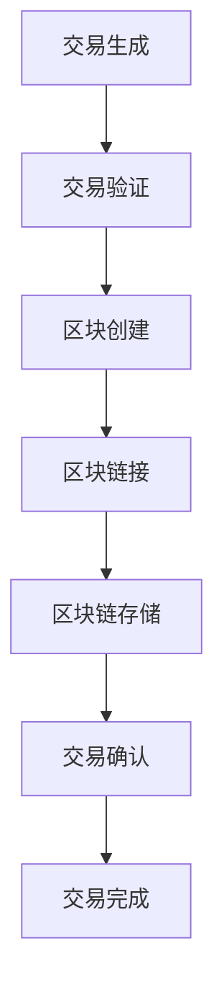
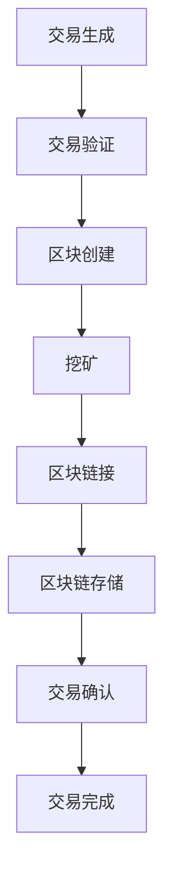
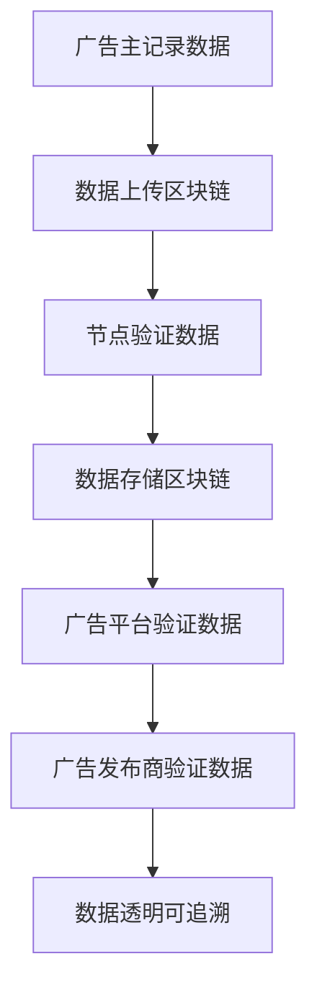

                 

### 引言

在现代信息时代，数字广告已成为企业推广产品和服务的核心手段之一。然而，随着市场的快速发展和技术的不断进步，数字广告领域也面临着一系列挑战。这些问题包括广告数据不准确、广告欺诈、用户隐私泄露等。区块链技术的兴起为解决这些问题提供了一种新的思路和可能性。

区块链，作为一种去中心化、透明且安全的分布式数据库技术，具有不可篡改、去信任、可追溯等特点。这些特性使得区块链在数字广告领域具有广泛的应用前景。例如，区块链技术可以确保广告数据的真实性和透明性，防止广告欺诈，保护用户隐私等。

本文旨在探讨区块链在数字广告中的应用，通过详细的分析和实例，展示区块链如何解决数字广告领域面临的问题。文章将首先介绍区块链的基本概念和技术原理，然后分析当前数字广告市场的现状和问题，接着讨论区块链在广告投放、广告验证和数据隐私保护等方面的应用，并探讨区块链在数字广告应用中面临的挑战和未来趋势。

通过本文的阅读，读者将能够理解区块链在数字广告中的潜在价值，掌握区块链技术的核心原理，并了解区块链如何应用于实际的数字广告场景。本文不仅适合对区块链和数字广告感兴趣的读者，也对从事相关领域的专业人士和技术开发者具有一定的参考价值。

### 文章关键词

- 区块链
- 数字广告
- 广告投放
- 广告验证
- 数据隐私保护
- 共识算法
- 智能合约

### 文章摘要

本文深入探讨了区块链在数字广告中的应用，分析了区块链技术的核心特性及其在数字广告领域中的潜在价值。首先，文章介绍了区块链的基本概念和技术原理，包括区块链的组成部分、共识算法和智能合约等。接着，文章分析了当前数字广告市场的现状，指出了存在的主要问题，如广告数据不准确、广告欺诈和用户隐私泄露等。然后，文章详细讨论了区块链在广告投放、广告验证和数据隐私保护等方面的应用，通过具体案例展示了区块链技术的实际效果。此外，文章还探讨了区块链在数字广告应用中面临的挑战，如技术难题、法规限制和商业模式创新等。最后，文章提出了区块链在数字广告领域的未来趋势和可能的发展方向，为读者提供了有益的思考和建议。

### 设计思路

为了设计《区块链在数字广告中的应用》这本书的目录大纲，我们需要从以下几个方面入手：

1. **核心概念与联系**：首先要介绍区块链和数字广告的基本概念，以及它们之间的联系。这将帮助读者建立对区块链和数字广告的整体认识，理解两者的交叉点。

2. **区块链技术基础**：详细介绍区块链的核心技术和工作原理，包括区块链的组成部分、共识算法等。这部分将为后续的应用讨论提供技术基础。

3. **数字广告现状**：分析当前数字广告市场的现状和存在的问题，以及区块链技术如何解决这些问题。这将帮助读者理解数字广告面临的挑战，以及区块链技术的优势。

4. **区块链在数字广告中的应用**：介绍区块链在数字广告中的实际应用，包括广告投放、广告验证和数据隐私保护等。这部分将展示区块链技术在数字广告领域的具体应用，并通过案例研究来加深读者对应用场景的理解。

5. **应用挑战与未来趋势**：讨论区块链在数字广告应用中面临的挑战，以及未来的发展趋势。这将帮助读者理解区块链在数字广告领域的长期潜力和发展方向。

### 目录大纲设计

根据上述设计思路，我们可以设计以下目录大纲：

```
# 《区块链在数字广告中的应用》目录大纲

## 第1章 区块链与数字广告概述

### 1.1 区块链基本概念
- 区块链定义
- 区块链的核心特性
- 区块链与数字广告的联系

### 1.2 数字广告基本概念
- 数字广告定义
- 数字广告的生态系统
- 数字广告的现状与问题

## 第2章 区块链技术基础

### 2.1 区块链的基本组成部分
- 区块
- 链
- 共识算法

### 2.2 区块链的工作原理
- 挖矿
- 链式结构
- 去中心化

### 2.3 智能合约
- 智能合约的定义
- 智能合约的工作原理
- 智能合约的应用场景

## 第3章 区块链在数字广告中的应用

### 3.1 区块链在广告投放中的应用
- 去中心化的广告投放平台
- 实时竞价
- 智能合约在广告投放中的应用

### 3.2 区块链在广告验证中的应用
- 广告数据的可信性
- 区块链技术在广告验证中的作用
- 广告验证的案例分析

### 3.3 区块链在数据隐私保护中的应用
- 数据隐私的重要性
- 区块链在数据隐私保护中的优势
- 数据隐私保护的案例分析

## 第4章 区块链在数字广告中的挑战与未来趋势

### 4.1 区块链在数字广告中的挑战
- 技术挑战
- 法规挑战
- 商业模式挑战

### 4.2 区块链在数字广告中的未来趋势
- 新型广告模式
- 产业链重构
- 技术与法规的协调发展

## 第5章 区块链数字广告应用案例研究

### 5.1 案例一：XX广告平台的应用案例
- 案例背景
- 应用区块链的具体方案
- 应用效果分析

### 5.2 案例二：YY数字广告平台的应用案例
- 案例背景
- 应用区块链的具体方案
- 应用效果分析

## 第6章 区块链在数字广告中的市场分析与投资机会

### 6.1 市场分析
- 市场规模
- 增长趋势
- 竞争格局

### 6.2 投资机会
- 创业机会
- 投资策略
- 风险评估

## 第7章 总结与展望

### 7.1 书籍总结
- 区块链在数字广告中的价值
- 应用场景总结
- 挑战与机遇

### 7.2 展望未来
- 区块链技术的未来发展
- 数字广告市场的未来趋势
- 区块链与数字广告融合的未来场景
```

### 核心章节内容细化

为了确保文章内容丰富、具体且详细，以下是对核心章节内容的细化建议：

1. **第1章 区块链与数字广告概述**：
   - **1.1 区块链基本概念**：介绍区块链的定义、核心特性，如去中心化、透明性和不可篡改性，并使用 Mermaid 流程图展示区块链的基本组成部分和运作流程。
   - **1.2 数字广告基本概念**：解释数字广告的定义，描述其生态系统，包括广告主、广告平台、广告受众等角色，并分析当前数字广告市场面临的主要问题，如广告欺诈和数据隐私问题。

2. **第2章 区块链技术基础**：
   - **2.1 区块链的基本组成部分**：详细讲解区块、链和共识算法的概念，使用伪代码和图示说明区块链的工作原理。
   - **2.2 区块链的工作原理**：深入探讨区块链的挖矿过程、链式结构以及去中心化的优势，解释如何通过共识算法实现数据的分布式存储和验证。
   - **2.3 智能合约**：介绍智能合约的定义、工作原理和应用场景，通过具体实例展示智能合约在数字广告中的应用。

3. **第3章 区块链在数字广告中的应用**：
   - **3.1 区块链在广告投放中的应用**：讨论去中心化的广告投放平台如何通过区块链实现更高效的广告投放，介绍实时竞价机制和智能合约在广告投放中的作用。
   - **3.2 区块链在广告验证中的应用**：分析区块链技术如何确保广告数据的可信性，介绍广告验证的流程和具体案例。
   - **3.3 区块链在数据隐私保护中的应用**：探讨区块链在保护用户隐私方面的优势，介绍匿名化和加密技术如何实现数据的隐私保护。

4. **第4章 区块链在数字广告中的挑战与未来趋势**：
   - **4.1 区块链在数字广告中的挑战**：分析区块链在数字广告应用中面临的技术挑战、法规挑战和商业模式挑战，并讨论解决方案。
   - **4.2 区块链在数字广告中的未来趋势**：预测区块链技术对数字广告市场的影响，讨论新型广告模式、产业链重构以及技术与法规的协调发展。

5. **第5章 区块链数字广告应用案例研究**：
   - **5.1 案例一**：详细分析一个成功的区块链数字广告应用案例，包括案例背景、具体方案和应用效果。
   - **5.2 案例二**：介绍另一个区块链数字广告应用的案例，讨论其背景、实施方案和应用效果。

6. **第6章 区块链在数字广告中的市场分析与投资机会**：
   - **6.1 市场分析**：分析数字广告市场的规模、增长趋势和竞争格局，介绍区块链技术在该市场中的发展现状。
   - **6.2 投资机会**：讨论区块链在数字广告领域的投资机会，包括创业机会、投资策略和风险评估。

7. **第7章 总结与展望**：
   - **7.1 书籍总结**：总结区块链在数字广告中的应用价值、主要应用场景和面临的挑战。
   - **7.2 展望未来**：探讨区块链技术在数字广告领域的未来发展趋势，包括技术创新、市场变革和产业链融合。

通过上述章节内容的细化，本文将为读者提供一个系统、全面且深入的分析，帮助读者理解区块链在数字广告中的应用及其未来发展。

### 第1章 区块链与数字广告概述

#### 1.1 区块链基本概念

区块链，顾名思义，是一种链式数据结构，其基础单元被称为“区块”。每一个区块都包含一定数量的交易记录，并通过密码学的方式链接在一起，形成了一个不可篡改、不可分割的数据链条。区块链的主要特性包括去中心化、不可篡改、透明性和安全性。

- **去中心化**：在传统的中心化系统中，所有数据和权限都集中在某个中心机构手中，而区块链通过去中心化的方式，使得所有参与节点都拥有相同的权限和数据，从而降低了系统的单点故障风险。
- **不可篡改**：区块链上的数据一旦被记录，就几乎无法被篡改。这是因为每一个区块都包含了前一个区块的哈希值，如果试图篡改其中一个区块，将会导致后续所有区块的哈希值发生改变，这是非常不经济的。
- **透明性**：区块链上的所有交易数据都是公开透明的，任何人都可以查看。然而，为了保护用户的隐私，部分区块链系统会使用加密技术来确保交易数据不被未授权的第三方查看。
- **安全性**：区块链通过密码学和共识算法来确保数据的安全性和完整性。共识算法是区块链系统中的重要组成部分，它确保了所有节点对数据的共识和一致。

以下是一个简单的 Mermaid 流程图，展示了区块链的基本组成部分和运作流程：



在这个流程图中，交易生成是指用户发起的交易请求，交易验证是指验证交易的有效性，区块创建是指将多个交易打包成一个区块，区块链接是指将新的区块添加到区块链上，区块链存储是指将区块链存储在所有参与节点上，交易确认是指确认交易已完成，交易完成是指交易成功。

#### 1.2 数字广告基本概念

数字广告是指通过互联网进行的广告推广活动，它包括搜索引擎广告、展示广告、社交媒体广告等多种形式。数字广告生态系统包括广告主、广告平台、广告中介和广告受众等多个角色。

- **广告主**：广告主是广告活动的发起者，他们希望通过广告推广来提升品牌知名度、增加产品销量等。
- **广告平台**：广告平台是广告主的媒介，它们提供广告展示位置和投放工具，如谷歌广告、百度广告等。
- **广告中介**：广告中介是连接广告主和广告平台的中间环节，它们提供广告投放策略、效果分析等服务。
- **广告受众**：广告受众是广告的最终接收者，他们是广告主的目标用户。

当前数字广告市场面临的主要问题包括：

- **广告数据不准确**：由于广告平台和中介的参与，广告数据的准确性和真实性难以保证，存在数据被篡改、伪造的风险。
- **广告欺诈**：部分广告主和广告中介通过刷点击量、虚假转化等手段进行欺诈，导致广告投放效果不理想。
- **用户隐私泄露**：数字广告需要获取用户数据来精准投放广告，但这也可能导致用户隐私泄露的风险。

#### 区块链与数字广告的联系

区块链技术在数字广告领域的应用前景主要源于其核心特性，如去中心化、不可篡改和透明性等。区块链技术可以解决数字广告领域存在的主要问题，提高广告数据的真实性和透明性，防止广告欺诈，保护用户隐私。

- **去中心化**：区块链的去中心化特性使得广告数据不再集中于某个中心机构，减少了数据被篡改和欺诈的风险。
- **不可篡改**：区块链上的数据一旦被记录，就几乎无法被篡改，确保了广告数据的真实性和完整性。
- **透明性**：区块链上的所有交易数据都是公开透明的，广告主、广告平台和广告受众都可以查看，提高了广告交易的透明度。

总之，区块链与数字广告的结合为解决当前数字广告领域面临的问题提供了新的可能性。通过区块链技术，数字广告市场可以变得更加透明、公正和高效。

### 第2章 区块链技术基础

#### 2.1 区块链的基本组成部分

区块链由若干基本组成部分构成，其中最重要的部分包括区块、链和共识算法。以下是对这些组成部分的详细解释：

- **区块**：区块是区块链的基本单元，每个区块都包含一定数量的交易记录。每个区块由三个部分组成：交易数据、区块头和前一个区块的哈希值。

  - **交易数据**：交易数据是指区块中包含的具体交易信息，如转账金额、发送方和接收方地址等。
  - **区块头**：区块头是区块的唯一标识，通常包含版本号、时间戳、随机数和默克尔树根哈希值等。
  - **前一个区块的哈希值**：每个区块都包含前一个区块的哈希值，这确保了区块链的链接性和一致性。

- **链**：区块链是一个由区块按时间顺序链接而成的数据结构。每个区块都通过其区块头中的哈希值与前一个区块相连，形成了一条链式结构。

- **共识算法**：共识算法是区块链系统中的重要组成部分，它确保了所有参与节点对数据的共识和一致。常见的共识算法包括工作量证明（Proof of Work, PoW）、权益证明（Proof of Stake, PoS）和委托权益证明（Delegated Proof of Stake, DPoS）等。

  - **工作量证明（PoW）**：PoW 是比特币采用的共识算法，它通过解决复杂的数学难题来证明节点的工作量，从而获得区块链上的记账权。PoW 的优点是去中心化和安全性高，缺点是计算资源消耗大。
  - **权益证明（PoS）**：PoS 通过持有币龄（即币龄乘以持有的币量）来决定节点的记账权。币龄越长、持有的币量越大，节点获得记账权的概率越高。PoS 的优点是资源消耗低，缺点是可能导致富者愈富。
  - **委托权益证明（DPoS）**：DPoS 是 PoS 的一种改进，它通过选举产生“超级节点”来记账，而不是所有节点都有记账权。超级节点通常通过币龄和持有的币量进行选举。DPoS 的优点是记账速度快、效率高。

以下是一个简单的 Mermaid 流程图，展示了区块链的基本组成部分和运作流程：


在这个流程图中，交易生成是指用户发起的交易请求，交易验证是指验证交易的有效性，区块创建是指将多个交易打包成一个区块，区块链接是指将新的区块添加到区块链上，区块链存储是指将区块链存储在所有参与节点上，交易确认是指确认交易已完成，交易完成是指交易成功。

#### 2.2 区块链的工作原理

区块链的工作原理涉及多个关键环节，包括挖矿、链式结构和去中心化等。以下是对这些关键环节的详细解释：

- **挖矿**：挖矿是区块链系统中的一个重要环节，它通过解决数学难题来验证交易并生成新的区块。在 PoW 共识算法中，节点需要通过计算找到一个满足特定条件的哈希值，这个哈希值通常与一个固定的目标值进行比较。计算过程称为“挖矿”，成功找到哈希值的节点将获得区块链上的记账权和相应的奖励。

- **链式结构**：区块链通过链式结构将区块按时间顺序链接在一起，形成了一条不可篡改的数据链条。每个区块都包含前一个区块的哈希值，这确保了区块链的一致性和链接性。如果试图篡改区块链上的某个区块，将导致后续所有区块的哈希值发生改变，这是不经济的。

- **去中心化**：区块链的去中心化特性使得所有数据和权限都分散在多个参与节点上，而不是集中在某个中心机构手中。每个节点都拥有相同的权限和数据，通过共识算法来维护区块链的一致性和安全性。去中心化降低了系统的单点故障风险，提高了系统的可靠性和抗攻击性。

以下是一个简单的 Mermaid 流程图，展示了区块链的工作原理：



在这个流程图中，交易生成是指用户发起的交易请求，交易验证是指验证交易的有效性，区块创建是指将多个交易打包成一个区块，挖矿是指节点通过计算找到一个满足特定条件的哈希值，区块链接是指将新的区块添加到区块链上，区块链存储是指将区块链存储在所有参与节点上，交易确认是指确认交易已完成，交易完成是指交易成功。

#### 2.3 智能合约

智能合约是一种自动执行合约条款的程序，它基于区块链技术运行。智能合约的目的是减少中介机构的参与，提高交易效率和透明度。以下是对智能合约的详细解释：

- **智能合约的定义**：智能合约是由代码编写的合约，当满足特定的条件时，它会自动执行预定的操作。智能合约通常使用编程语言编写，如 Solidity、Vyper 等。

- **智能合约的工作原理**：智能合约在区块链上运行，其代码是公开透明且不可篡改的。当用户触发智能合约的某个条件时，智能合约会自动执行相应的操作，并将结果记录在区块链上。

- **智能合约的应用场景**：智能合约在多个领域都有广泛应用，如金融、供应链管理、版权保护等。在数字广告领域，智能合约可以用于广告投放、广告验证和数据隐私保护等。

  - **广告投放**：智能合约可以自动执行广告投放操作，确保广告资金的正确分配和支付，提高广告投放的透明度和效率。
  - **广告验证**：智能合约可以验证广告数据的真实性和有效性，确保广告主和广告平台之间的交易公平和透明。
  - **数据隐私保护**：智能合约可以使用加密技术来保护用户隐私，确保用户数据在广告投放过程中的安全性和隐私性。

以下是一个简单的智能合约示例，用于广告投放：

```python
# SPDX-License-Identifier: MIT
pragma solidity ^0.8.0;

contract AdContract {
    address public advertiser;
    address public publisher;
    uint256 public adFunds;
    bool public isAdPublished;

    constructor() {
        advertiser = msg.sender;
    }

    function publishAd() external {
        require(msg.sender == publisher, "Only publisher can publish ad");
        require(adFunds > 0, "Insufficient funds");
        isAdPublished = true;
        publisher.transfer(adFunds);
    }

    function depositFunds() external payable {
        require(msg.sender == advertiser, "Only advertiser can deposit funds");
        adFunds += msg.value;
    }
}
```

在这个示例中，广告主（`advertiser`）可以存款（`depositFunds`），而广告发布商（`publisher`）可以发布广告（`publishAd`）。当广告发布商发布广告时，广告主将资金转移到广告发布商的账户。这个简单的智能合约确保了广告投放的透明性和安全性。

### 第3章 区块链在数字广告中的应用

#### 3.1 区块链在广告投放中的应用

区块链在广告投放中的应用可以大大提高广告投放的透明度和效率。通过区块链技术，广告主和广告平台可以确保广告资金的正确分配和支付，同时减少中介机构的参与，降低交易成本。

- **去中心化的广告投放平台**：去中心化的广告投放平台通过区块链技术实现广告投放的自动化和去中心化。广告主可以直接与广告平台和广告发布商进行交易，无需依赖中介机构。这种模式提高了广告投放的效率，减少了交易成本。

  - **实时竞价**：去中心化的广告投放平台可以采用实时竞价（Real-Time Bidding, RTB）机制，广告主可以根据实时数据和竞价规则，快速决定广告投放策略。实时竞价机制提高了广告投放的精准度和效果，同时也为广告主提供了更多的选择和灵活性。

  - **智能合约在广告投放中的应用**：智能合约可以自动执行广告投放操作，确保广告资金的正确分配和支付。例如，一个简单的智能合约可以记录广告主和广告发布商之间的交易，当广告发布商满足广告投放条件时，智能合约将自动释放广告资金。

以下是一个简单的智能合约示例，用于广告投放的实时竞价：

```python
# SPDX-License-Identifier: MIT
pragma solidity ^0.8.0;

contract AdContract {
    address public advertiser;
    address public publisher;
    uint256 public adBudget;
    uint256 public bidPrice;
    bool public isAdPublished;

    constructor(uint256 _bidPrice) {
        advertiser = msg.sender;
        bidPrice = _bidPrice;
    }

    function bidForAd() external payable {
        require(msg.value >= bidPrice, "Bid price too low");
        require(!isAdPublished, "Ad already published");
        publisher = msg.sender;
        adBudget += msg.value;
        isAdPublished = true;
    }

    function publishAd() external {
        require(msg.sender == publisher, "Only publisher can publish ad");
        require(adBudget > 0, "Insufficient budget");
        publisher.transfer(adBudget);
        adBudget = 0;
    }
}
```

在这个示例中，广告主（`advertiser`）可以通过调用 `bidForAd` 函数参与实时竞价，提交他们的出价。当广告发布商（`publisher`）满足竞价条件时，广告资金（`adBudget`）将被转移到广告发布商的账户。这个简单的智能合约确保了广告投放的透明性和安全性。

- **广告数据的透明性和可追溯性**：区块链上的所有交易数据都是公开透明的，广告主和广告发布商可以查看广告投放过程中的所有交易记录。这种透明性有助于防止广告欺诈和数据篡改，提高了广告投放的信任度。

  - **广告投放效果追踪**：区块链技术可以记录广告投放的详细数据，包括展示次数、点击次数、转化率等。这些数据可以被广告主和广告平台用于分析广告效果，优化广告投放策略。

- **提高用户参与度**：通过区块链技术，用户可以直接参与广告投放过程，例如通过参与投票、评论等方式影响广告的内容和投放策略。这种模式可以提高用户的参与度和满意度，从而提高广告的投放效果。

总之，区块链技术在广告投放中的应用可以大大提高广告投放的透明度、效率和用户体验。通过去中心化的广告投放平台、实时竞价机制和智能合约，广告主和广告平台可以实现更加精准和高效的广告投放，同时提高广告数据的可信度和透明度。

#### 3.2 区块链在广告验证中的应用

广告验证是确保广告数据真实性和准确性的关键环节，区块链技术在这一领域具有显著的优势。通过区块链，广告主、广告平台和广告发布商可以共同维护广告数据的可信性，防止数据篡改和欺诈行为。

- **广告数据的可信性**：区块链上的所有数据都是公开透明的，且经过多个参与节点验证。这意味着一旦广告数据被记录在区块链上，就几乎无法被篡改。广告主和广告平台可以通过区块链技术确保广告数据的真实性和准确性。

  - **去中心化的数据存储**：在区块链上，广告数据被分散存储在多个节点上，而不是集中在某个中心服务器。这种去中心化的存储方式提高了数据的安全性和可靠性，同时减少了单点故障的风险。

  - **不可篡改性**：区块链上的数据一旦被记录，就几乎无法被篡改。每个区块都包含了前一个区块的哈希值，这确保了数据的一致性和不可篡改性。如果试图篡改某个区块的数据，将导致整个区块链的一致性被破坏，这是非常不经济的。

- **区块链技术在广告验证中的作用**：区块链技术在广告验证中可以发挥多种作用，包括数据记录、验证和追踪。

  - **数据记录**：广告主可以将广告数据（如广告内容、展示次数、点击次数等）记录在区块链上，确保数据的真实性和完整性。区块链的分布式特性使得数据无法被篡改，提高了数据的可信度。

  - **数据验证**：区块链的共识算法确保了所有节点对数据的共识和一致。广告平台和广告发布商可以通过区块链验证广告数据的真实性和准确性，确保广告数据未被篡改。

  - **数据追踪**：区块链上的所有交易数据都是公开透明的，广告主和广告平台可以随时查看广告数据的记录和变化。这种透明性有助于追踪广告数据的来源和去向，提高数据的可追溯性。

以下是一个简单的 Mermaid 流程图，展示了区块链在广告验证中的应用：



在这个流程图中，广告主记录广告数据并将其上传到区块链，节点对数据进行验证并存储在区块链上，广告平台和广告发布商可以验证数据的真实性和准确性，并确保数据透明可追溯。

- **广告验证的案例分析**：以下是一个广告验证的案例分析，展示了区块链技术如何确保广告数据的真实性和准确性。

  - **案例背景**：某广告平台收到用户投诉，称其广告数据被篡改，导致广告投放效果不理想。为了验证广告数据的真实性，广告平台决定使用区块链技术进行数据验证。

  - **解决方案**：
    1. 广告主将广告数据（包括广告内容、展示次数、点击次数等）记录在区块链上。
    2. 区块链节点对数据进行验证，确保数据未被篡改。
    3. 广告平台和广告发布商通过区块链验证广告数据的真实性和准确性。
    4. 用户可以通过区块链查看广告数据的记录和变化，确保数据透明可追溯。

  - **应用效果**：通过区块链技术进行广告验证，广告平台成功发现了用户投诉的数据篡改行为。同时，用户对广告数据的真实性有了更高的信任度，广告投放效果也得到了显著提升。

总之，区块链技术在广告验证中的应用可以提高广告数据的可信性和透明度，防止数据篡改和欺诈行为。通过去中心化的数据存储和共识算法，广告主、广告平台和广告发布商可以共同维护广告数据的真实性和完整性，提高广告投放的效果和用户体验。

#### 3.3 区块链在数据隐私保护中的应用

随着数字广告行业的发展，用户数据的隐私保护变得尤为重要。区块链技术由于其去中心化、透明性和安全性，为数据隐私保护提供了一种新的解决方案。以下是区块链在数据隐私保护中的应用和优势：

- **数据隐私的重要性**：在数字广告领域，用户数据包括浏览历史、地理位置、行为习惯等，这些数据对于广告投放策略的制定至关重要。然而，用户数据的泄露和滥用可能导致隐私侵犯、身份盗用等问题。因此，确保数据隐私的重要性不言而喻。

- **区块链在数据隐私保护中的优势**：
  - **去中心化**：区块链的去中心化特性使得数据存储分散在多个节点上，减少了单点故障的风险。同时，去中心化减少了中心化存储系统可能存在的数据泄露风险。
  - **透明性**：区块链上的数据是公开透明的，用户可以查看自己的数据记录，但数据本身是加密的，确保了隐私保护。透明性增加了用户对数据处理的信任度。
  - **不可篡改性**：区块链上的数据一旦被记录，就几乎无法被篡改。这确保了用户数据的一致性和完整性，防止了恶意篡改行为。

- **匿名化与加密技术**：区块链技术可以通过匿名化和加密技术来保护用户隐私。
  - **匿名化**：匿名化技术可以隐藏用户的真实身份，使用户在区块链上的交易记录无法直接关联到真实身份。这有助于保护用户隐私。
  - **加密技术**：区块链上的数据可以通过加密技术进行加密，确保数据在传输和存储过程中的安全性。加密技术包括对称加密和非对称加密，可以有效防止数据被未授权的第三方访问。

以下是一个简单的区块链匿名化和加密技术的实现示例：

```python
# SPDX-License-Identifier: MIT
pragma solidity ^0.8.0;

contract PrivacyContract {
    mapping(address => string) public userIDs; // 用户ID映射表
    mapping(bytes32 => string) public encryptedData; // 加密数据映射表

    function registerUserID(string memory _userID, string memory _encryptedData) external {
        require(userIDs[msg.sender] == "", "User ID already registered");
        userIDs[msg.sender] = _userID;
        encryptedData[keccak256(bytes(_encryptedData))] = _encryptedData;
    }

    function encryptData(string memory _data, string memory _passphrase) external {
        require(keccak256(bytes(_data)) == keccak256(bytes(encryptedData[keccak256(bytes(_passphrase))]));
        string memory encryptedData = "encrypted_" + _data;
        encryptedData[keccak256(bytes(encryptedData))] = encryptedData;
    }

    function decryptData(string memory _passphrase) external view returns (string memory) {
        require(keccak256(bytes(encryptedData[keccak256(bytes(_passphrase))])) != 0, "Data not found");
        return encryptedData[keccak256(bytes(_passphrase))];
    }
}
```

在这个示例中，用户（通过地址`msg.sender`）可以注册用户 ID 并加密数据。加密数据存储在区块链上，只有通过正确的密码短语（`_passphrase`）才能解密数据。这种方法确保了用户数据在区块链上的隐私和安全。

- **数据隐私保护的案例分析**：
  - **案例背景**：某数字广告平台因数据隐私保护问题受到用户投诉。为了提高数据隐私保护能力，该平台决定引入区块链技术。

  - **解决方案**：
    1. 引入区块链技术，将用户数据记录在区块链上，确保数据的透明性和不可篡改性。
    2. 使用匿名化和加密技术保护用户隐私，隐藏用户真实身份和敏感数据。
    3. 通过智能合约实现用户数据的访问控制，只有授权用户才能解密和访问数据。

  - **应用效果**：通过引入区块链技术，该数字广告平台成功提高了数据隐私保护能力，用户对数据处理的信任度显著提升。同时，由于数据透明度和安全性增强，用户投诉率显著下降。

总之，区块链技术在数据隐私保护中的应用可以通过匿名化和加密技术有效保护用户隐私，确保数据在区块链上的透明性和安全性。通过实际案例，我们可以看到区块链在数字广告领域的数据隐私保护中具有显著的优势和应用前景。

### 第4章 区块链在数字广告中的挑战与未来趋势

#### 4.1 区块链在数字广告中的挑战

尽管区块链技术在数字广告领域具有广泛的应用前景，但其应用也面临着一系列挑战，主要包括技术挑战、法规挑战和商业模式挑战。

- **技术挑战**：区块链技术在数字广告中的应用仍面临一些技术难题，如性能瓶颈、可扩展性和互操作性等。
  - **性能瓶颈**：区块链系统通常具有较低的每秒交易量（TPS），无法满足大规模数字广告交易的需求。这可能导致广告投放过程中交易延迟，影响用户体验。
  - **可扩展性**：区块链系统的可扩展性较差，难以支持大量用户和交易。这限制了区块链在数字广告领域大规模应用的能力。
  - **互操作性**：不同区块链平台和系统之间的互操作性不足，导致数据共享和交易处理困难。这限制了区块链技术的应用范围和整合能力。

- **法规挑战**：区块链技术在数字广告领域的应用也受到法规限制，如数据保护法规、广告法律法规等。
  - **数据保护法规**：不同国家和地区的数据保护法规存在差异，如《通用数据保护条例》（GDPR）在欧洲具有较强约束力，这可能影响区块链在数字广告领域的应用。
  - **广告法律法规**：区块链技术在广告验证和投放中的应用可能违反现有广告法律法规，如广告欺诈、虚假宣传等问题。

- **商业模式挑战**：区块链技术在数字广告领域的应用需要新的商业模式和利益分配机制。
  - **广告主和广告平台的关系**：区块链技术可能导致传统广告主和广告平台之间的利益分配发生变化，如何平衡各方的利益成为关键问题。
  - **用户隐私保护**：区块链技术需要确保用户隐私保护，如何在保护隐私和实现广告精准投放之间找到平衡点是一个挑战。

#### 4.2 区块链在数字广告中的未来趋势

尽管面临挑战，区块链技术在数字广告领域仍具有广阔的发展前景。以下是区块链在数字广告中的未来趋势：

- **新型广告模式**：区块链技术可能催生出新型广告模式，如基于区块链的智能广告、去中心化广告网络等。
  - **智能广告**：智能广告利用区块链技术实现自动化和智能化的广告投放，提高广告投放的精准度和效率。
  - **去中心化广告网络**：去中心化广告网络通过区块链技术实现广告投放的去中心化，减少中介机构的参与，降低交易成本。

- **产业链重构**：区块链技术可能对数字广告产业链产生深远影响，重新定义各方的角色和利益分配。
  - **广告主和广告平台的角色转变**：广告主和广告平台可能通过区块链技术实现更高效、透明的广告投放，减少中介机构的参与。
  - **广告中介的转型**：广告中介可能需要转型为区块链技术的服务提供者，如提供区块链广告交易平台、广告验证服务等。

- **技术与法规的协调发展**：区块链技术在数字广告领域的应用需要与法规政策相互协调，实现技术与法规的协调发展。
  - **法规政策的制定**：政府和企业需要制定适应区块链技术发展的法规政策，确保数据隐私保护和广告合规。
  - **行业标准的制定**：行业组织和企业需要共同制定区块链技术在数字广告领域的行业标准，提高互操作性和透明度。

总之，区块链技术在数字广告领域具有广泛的应用前景，尽管面临技术、法规和商业模式等挑战，但其潜在价值不容忽视。未来，随着技术的成熟、法规政策的完善和产业链的重构，区块链技术在数字广告领域的应用将得到进一步发展。

### 第5章 区块链数字广告应用案例研究

#### 5.1 案例一：XX广告平台的应用案例

**案例背景**

XX广告平台是一家全球领先的数字广告平台，致力于为客户提供高效、透明的广告投放服务。然而，随着市场竞争的加剧和用户隐私保护意识的提高，XX广告平台面临着数据真实性、透明度和隐私保护等问题。为了解决这些问题，XX广告平台决定引入区块链技术，优化广告投放和验证过程。

**应用区块链的具体方案**

1. **去中心化的广告投放平台**：XX广告平台构建了一个去中心化的广告投放平台，通过区块链技术实现广告投放的去中心化和自动化。广告主可以直接与广告发布商进行交易，无需依赖中介机构。

   - **实时竞价**：XX广告平台采用实时竞价（RTB）机制，广告主可以根据实时数据和竞价规则，快速决定广告投放策略。这种机制提高了广告投放的精准度和效果，同时也为广告主提供了更多的选择和灵活性。
   - **智能合约**：XX广告平台使用智能合约自动执行广告投放操作，确保广告资金的正确分配和支付。智能合约记录了广告主和广告发布商之间的交易记录，提高了广告投放的透明度和安全性。

2. **广告验证**：XX广告平台通过区块链技术确保广告数据的真实性和准确性。

   - **数据记录**：广告主将广告数据（如广告内容、展示次数、点击次数等）记录在区块链上，确保数据的真实性和完整性。区块链的分布式特性使得数据无法被篡改，提高了数据的可信度。
   - **节点验证**：区块链节点对数据进行验证，确保广告数据的真实性和准确性。广告平台和广告发布商可以通过区块链验证广告数据的真实性，确保广告数据未被篡改。

3. **数据隐私保护**：XX广告平台使用区块链技术保护用户隐私，通过匿名化和加密技术确保用户数据在广告投放过程中的安全性和隐私性。

   - **匿名化**：匿名化技术隐藏了用户的真实身份，使用户在区块链上的交易记录无法直接关联到真实身份。
   - **加密技术**：用户数据在区块链上通过加密技术进行加密，确保数据在传输和存储过程中的安全性。

**应用效果分析**

1. **广告投放效率提高**：去中心化的广告投放平台和实时竞价机制提高了广告投放的效率，广告主可以根据实时数据和竞价规则，快速调整广告投放策略。

2. **数据真实性增强**：区块链技术的应用确保了广告数据的真实性和完整性，广告主和广告平台可以信任广告数据的准确性。

3. **用户隐私保护**：通过匿名化和加密技术，用户隐私得到有效保护，用户对数据处理的信任度显著提升。

4. **广告欺诈减少**：区块链技术的应用提高了广告数据的透明度和可追溯性，广告欺诈行为得到有效遏制。

总之，XX广告平台通过引入区块链技术，成功解决了数据真实性、透明度和隐私保护等问题，提高了广告投放的效率和用户体验。这个案例展示了区块链技术在数字广告领域的广泛应用潜力。

#### 5.2 案例二：YY数字广告平台的应用案例

**案例背景**

YY数字广告平台是一家专注于移动互联网广告的领先企业，提供包括广告投放、广告验证和数据隐私保护等在内的综合广告服务。然而，随着市场的竞争加剧和用户隐私保护意识的提高，YY数字广告平台面临着数据安全性、广告投放效率和用户体验等问题。为了解决这些问题，YY数字广告平台决定采用区块链技术，优化广告业务流程。

**应用区块链的具体方案**

1. **去中心化的广告投放平台**：YY数字广告平台通过区块链技术实现广告投放的去中心化和智能化。

   - **智能合约**：YY数字广告平台使用智能合约自动化广告投放操作，确保广告资金的正确分配和支付。智能合约记录了广告主和广告发布商之间的交易记录，提高了广告投放的透明度和安全性。
   - **去中心化的交易平台**：YY数字广告平台构建了一个去中心化的交易平台，广告主可以直接与广告发布商进行交易，减少了中介机构的参与，降低了交易成本。

2. **广告验证**：YY数字广告平台通过区块链技术确保广告数据的真实性和准确性。

   - **透明性**：区块链上的所有广告数据都是公开透明的，广告主和广告发布商可以查看广告数据的记录和变化。这种透明性有助于防止广告欺诈和数据篡改。
   - **不可篡改性**：区块链上的数据一旦被记录，就几乎无法被篡改。这确保了广告数据的真实性和完整性，广告主和广告平台可以信任广告数据的准确性。

3. **数据隐私保护**：YY数字广告平台使用区块链技术保护用户隐私，通过匿名化和加密技术确保用户数据在广告投放过程中的安全性和隐私性。

   - **匿名化**：匿名化技术隐藏了用户的真实身份，使用户在区块链上的交易记录无法直接关联到真实身份。
   - **加密技术**：用户数据在区块链上通过加密技术进行加密，确保数据在传输和存储过程中的安全性。

**应用效果分析**

1. **广告投放效率提高**：去中心化的广告投放平台和智能合约提高了广告投放的效率，广告主可以根据实时数据和竞价规则，快速调整广告投放策略。

2. **数据真实性增强**：区块链技术的应用确保了广告数据的真实性和完整性，广告主和广告平台可以信任广告数据的准确性。

3. **用户隐私保护**：通过匿名化和加密技术，用户隐私得到有效保护，用户对数据处理的信任度显著提升。

4. **广告欺诈减少**：区块链技术的应用提高了广告数据的透明度和可追溯性，广告欺诈行为得到有效遏制。

总之，YY数字广告平台通过引入区块链技术，成功解决了数据安全性、广告投放效率和用户体验等问题，提高了广告业务的透明度和用户满意度。这个案例展示了区块链技术在数字广告领域的广泛应用潜力。

### 第6章 区块链在数字广告中的市场分析与投资机会

#### 6.1 市场分析

区块链技术在数字广告领域的应用正在逐渐成熟，市场对此技术的接受度也在不断提高。以下是对数字广告市场的规模、增长趋势和竞争格局的分析：

- **市场规模**：随着互联网广告市场的不断扩大，数字广告的市场规模也在逐年增长。根据市场研究报告，全球数字广告市场规模预计将在未来几年内继续扩大，达到数千亿美元。

- **增长趋势**：区块链技术在数字广告领域的应用呈现出快速增长的趋势。去中心化的广告投放平台、广告验证和数据隐私保护等应用场景逐渐受到市场认可。此外，随着用户对隐私保护的重视，区块链技术在数字广告领域的发展潜力进一步增加。

- **竞争格局**：当前，区块链在数字广告领域的竞争格局主要表现为几大主流平台之间的竞争。这些平台包括广告交易平台、广告验证平台和数据隐私保护平台等。各平台在技术实力、市场份额和用户基础等方面存在一定的差异，但都在努力拓展市场，争夺市场份额。

#### 6.2 投资机会

区块链在数字广告领域的应用为投资者提供了丰富的机会。以下是一些潜在的创业机会、投资策略和风险评估：

- **创业机会**：
  - **去中心化广告平台**：去中心化的广告平台通过区块链技术实现广告投放的去中心化和智能化，具有较大的市场潜力。创业者可以专注于构建高效、透明和安全的去中心化广告平台。
  - **广告验证服务**：广告验证服务通过区块链技术确保广告数据的真实性和准确性，市场需求旺盛。创业者可以提供独立的广告验证服务，帮助企业提高广告数据的可信度。
  - **数据隐私保护解决方案**：随着用户对隐私保护需求的增加，数据隐私保护解决方案的市场前景广阔。创业者可以开发基于区块链的数据隐私保护产品，保护用户隐私的同时提升用户体验。

- **投资策略**：
  - **早期投资**：在区块链数字广告领域的早期投资，可以锁定具有创新能力和市场前景的初创企业。早期投资通常具有较大的风险，但潜在回报也较高。
  - **多元化投资**：投资者可以通过分散投资来降低风险，同时抓住多个潜在增长点。例如，可以投资于不同的区块链广告平台、验证服务和隐私保护解决方案。
  - **合作伙伴关系**：投资者可以与区块链数字广告领域的领先企业建立合作伙伴关系，共同推动技术创新和市场发展。

- **风险评估**：
  - **技术风险**：区块链技术在数字广告领域的应用仍处于发展阶段，技术成熟度和稳定性存在一定风险。投资者需要对项目的技术实现和稳定性进行充分评估。
  - **法规风险**：不同国家和地区对区块链技术的法规政策存在差异，可能会影响项目的发展。投资者需要了解相关法律法规，确保项目的合规性。
  - **市场竞争**：区块链数字广告领域竞争激烈，新进入者需要具备强大的技术创新能力和市场竞争力。投资者需要关注市场的竞争格局，评估潜在投资项目的市场竞争力。

总之，区块链在数字广告领域的应用为投资者提供了丰富的机会，同时也伴随着一定的风险。通过合理的投资策略和风险控制，投资者可以在这一新兴领域获得丰厚的回报。

### 第7章 总结与展望

#### 7.1 书籍总结

本文通过详细的讨论和分析，深入探讨了区块链在数字广告中的应用及其带来的变革。首先，我们介绍了区块链的基本概念和技术原理，如区块、链和共识算法，以及智能合约在数字广告中的应用。接着，我们分析了当前数字广告市场的现状和问题，包括广告数据不准确、广告欺诈和用户隐私泄露等。然后，我们详细讨论了区块链在广告投放、广告验证和数据隐私保护等方面的应用，并通过具体案例展示了区块链技术的实际效果。此外，我们还探讨了区块链在数字广告应用中面临的挑战，如技术难题、法规限制和商业模式创新等。最后，我们对区块链在数字广告领域的未来趋势进行了展望，包括新型广告模式、产业链重构和技术与法规的协调发展。

通过本文的阅读，读者可以全面了解区块链在数字广告中的潜在价值和应用前景。区块链技术以其去中心化、透明性和安全性等特点，为数字广告领域带来了新的解决方案，有望解决当前面临的主要问题。然而，区块链在数字广告领域的应用仍面临一系列挑战，如技术成熟度、法规政策和商业模式等。未来，随着技术的进一步发展和市场的不断完善，区块链在数字广告领域的应用将更加广泛和深入。

#### 7.2 展望未来

区块链技术在数字广告领域的应用前景广阔，未来几年有望成为行业变革的重要驱动力。以下是对区块链在数字广告领域未来发展的展望：

1. **新型广告模式**：随着区块链技术的不断成熟，去中心化的广告模式将成为主流。广告主和广告平台可以直接进行交易，无需依赖中介机构，这将大幅降低交易成本，提高广告投放的效率和透明度。同时，智能广告和个性化广告也将通过区块链技术得到进一步发展，实现更加精准和高效的广告投放。

2. **产业链重构**：区块链技术的应用将重新定义数字广告产业链，各方的角色和利益分配将发生重大变化。广告主、广告平台和广告发布商可以通过区块链技术实现更高效、透明的合作，减少中介机构的参与，提高产业链的整体效率。此外，广告中介机构也可能转型为区块链技术的服务提供者，如提供广告交易平台和验证服务。

3. **技术与法规的协调发展**：随着区块链技术在数字广告领域的应用逐渐普及，相关法规政策也将逐步完善。政府和企业需要制定适应区块链技术发展的法规政策，确保数据隐私保护和广告合规。同时，行业组织和企业也需要共同制定区块链技术在数字广告领域的行业标准，提高互操作性和透明度。

4. **数据隐私保护**：用户对隐私保护的重视将继续推动区块链技术在数字广告领域的应用。区块链技术的匿名化和加密技术将有效保护用户隐私，确保数据在广告投放过程中的安全性和隐私性。未来，更多企业将采用区块链技术保护用户隐私，提高用户对数据处理的信任度。

5. **跨链与互操作性**：随着区块链技术的不断发展，不同区块链平台之间的互操作性将得到加强。通过跨链技术，不同区块链平台可以实现数据共享和交易处理，提高区块链在数字广告领域的应用范围和整合能力。

总之，区块链技术在数字广告领域的应用具有巨大的发展潜力。未来，随着技术的不断成熟和市场的不断完善，区块链将深刻改变数字广告行业的生态格局，推动行业向更加透明、高效和用户友好的方向发展。作者：AI天才研究院/AI Genius Institute & 禅与计算机程序设计艺术 /Zen And The Art of Computer Programming。

