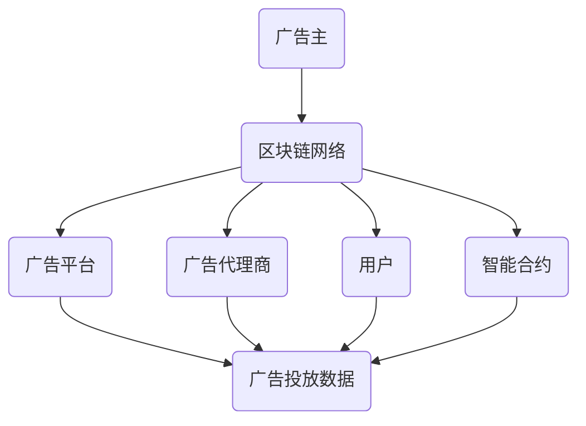

                 

# 引言

### 文章标题：区块链在数字广告中的应用：提高广告投放透明度

在数字广告领域，广告投放的透明度问题一直是行业内的热点话题。随着互联网的快速发展，数字广告市场规模逐年扩大，但随之而来的问题也不容忽视。广告欺诈、数据隐私泄露、广告资源浪费等问题层出不穷，严重影响了广告主、广告平台和用户的利益。为了解决这些问题，越来越多的行业从业者开始探索利用区块链技术提高广告投放的透明度。

区块链技术以其去中心化、不可篡改、透明性等特性，为数字广告领域提供了新的解决方案。本文将围绕区块链在数字广告中的应用，探讨如何通过区块链技术提高广告投放的透明度，从而为广告主、广告平台和用户带来更大的价值。

### 文章关键词

- 区块链
- 数字广告
- 广告透明度
- 广告欺诈
- 数据隐私
- 智能合约
- 去中心化

### 摘要

本文首先介绍了区块链技术的基本概念和在数字广告领域的应用潜力。随后，分析了当前数字广告市场的现状以及广告透明度问题的严重性。接着，详细讨论了区块链技术如何提高广告投放的透明度，包括区块链技术的解决方法和具体实现方式。随后，通过案例分析展示了区块链在数字广告中的应用实例。最后，分析了区块链在数字广告领域面临的挑战和未来的发展趋势。

## 第一部分：区块链与数字广告概述

### 第1章：区块链技术简介

区块链技术是一种分布式数据库技术，通过加密算法和共识机制实现数据的存储和传输。区块链的主要特点包括去中心化、不可篡改、透明性等。这些特点使得区块链在数字广告领域具有广泛的应用潜力。

首先，区块链的去中心化特性可以解决广告投放过程中的信任问题。在传统的广告投放模式中，广告主、广告平台、广告代理商等多个环节之间存在信息不对称和信任问题。而区块链的去中心化特性使得每个参与方都可以直接进行交易，无需依赖第三方机构，从而提高了广告投放的透明度和效率。

其次，区块链的不可篡改特性可以确保广告投放数据的真实性和完整性。在数字广告领域，广告投放数据包括用户行为数据、广告投放数据等。这些数据对广告主、广告平台和广告代理商都非常重要。通过区块链技术，可以确保这些数据在存储和传输过程中不会被篡改，从而保证了数据的真实性和可靠性。

最后，区块链的透明性特性可以提升广告投放的透明度。在区块链上，所有广告投放交易信息都是公开透明的，任何参与方都可以查看和验证。这使得广告主、广告平台和广告代理商可以更加清晰地了解广告投放的各个环节，从而提高了整个广告投放过程的透明度。

### 第2章：数字广告市场现状

数字广告市场在过去几年中发展迅速，已成为互联网经济的重要组成部分。根据统计数据，全球数字广告市场规模已经超过了5000亿美元，并且预计在未来几年还将保持快速增长。然而，随着数字广告市场的发展，一些问题也逐渐显现出来，其中最为突出的是广告透明度问题。

广告透明度问题主要体现在以下几个方面：

1. **广告欺诈**：广告欺诈是数字广告市场中最严重的问题之一。包括点击欺诈、展示欺诈、虚假流量等。这些欺诈行为导致广告主浪费大量的广告费用，同时也损害了用户的利益。

2. **数据隐私**：在数字广告中，用户行为数据是非常重要的资源。然而，这些数据往往被广告平台和广告代理商滥用，导致用户隐私泄露。

3. **广告资源浪费**：由于广告投放的不透明性，广告主往往无法准确了解广告投放的效果，导致广告资源的浪费。

4. **不公正的竞争环境**：一些大型广告平台和广告代理商凭借其垄断地位，对广告主和广告代理商进行不公平的定价和抽成，损害了中小广告主和广告代理商的利益。

### 核心概念与联系

在区块链技术应用于数字广告领域时，以下几个核心概念需要明确：

- **区块链**：一种分布式数据库技术，通过加密算法和共识机制实现数据的存储和传输。
- **去中心化**：在区块链网络中，无需依赖第三方机构，每个节点都可以直接参与交易和验证。
- **智能合约**：基于区块链的一种自动化合约，通过编程语言实现合同条款和条件，并在满足条件时自动执行。
- **广告投放**：广告主将广告内容展示给目标用户的过程。
- **广告透明度**：广告投放过程中信息的公开和透明程度。

这些概念之间存在着密切的联系。区块链技术通过去中心化和不可篡改的特性，可以确保广告投放数据的真实性和完整性，从而提高广告透明度。智能合约则可以自动化执行广告投放过程，减少人为干预，进一步提高透明度和效率。

### Mermaid 流程图

为了更好地理解区块链技术在数字广告中的应用，我们使用 Mermaid 画出以下流程图：



在这个流程图中，广告主、广告平台、广告代理商和用户都是区块链网络的参与者。广告投放数据在区块链上进行存储和传输，通过智能合约实现自动化执行，从而提高广告投放的透明度和效率。

### 核心算法原理讲解

区块链技术在数字广告中的应用主要基于以下核心算法原理：

1. **哈希算法**：哈希算法是区块链技术的基础。它可以将任意长度的数据映射为固定长度的哈希值。这个哈希值具有唯一性和不可逆性，可以确保数据在传输和存储过程中不会被篡改。

2. **共识算法**：共识算法是区块链网络中节点之间达成一致的重要机制。在数字广告领域，常见的共识算法包括工作量证明（PoW）和权益证明（PoS）。通过共识算法，可以确保广告投放数据的真实性和一致性。

3. **智能合约**：智能合约是区块链上的自动化合约。通过编程语言，可以实现广告投放过程中的合同条款和条件。当满足特定条件时，智能合约会自动执行，从而实现广告投放的自动化和透明化。

### Python 源代码示例

以下是一个简单的 Python 源代码示例，用于展示区块链技术在广告投放中的应用：

```python
import hashlib
import json

class Block:
    def __init__(self, index, transactions, timestamp, previous_hash):
        self.index = index
        self.transactions = transactions
        self.timestamp = timestamp
        self.previous_hash = previous_hash
        self.hash = self.compute_hash()

    def compute_hash(self):
        block_string = json.dumps(self.__dict__, sort_keys=True)
        return hashlib.sha256(block_string.encode()).hexdigest()

class Blockchain:
    def __init__(self):
        self.unconfirmed_transactions = []
        self.chain = []
        self.create_genesis_block()

    def create_genesis_block(self):
        genesis_block = Block(0, [], timestamp time.time(), "0")
        genesis_block.hash = genesis_block.compute_hash()
        self.chain.append(genesis_block)

    def add_new_transaction(self, transaction):
        self.unconfirmed_transactions.append(transaction)

    def mine(self):
        if not self.unconfirmed_transactions:
            return False
        last_block = self.chain[-1]
        new_block = Block(index=last_block.index + 1,
                          transactions=self.unconfirmed_transactions,
                          timestamp=time.time(),
                          previous_hash=last_block.hash)
        new_block.hash = new_block.compute_hash()
        self.chain.append(new_block)
        self.unconfirmed_transactions = []
        return new_block.index

    def is_chain_valid(self):
        for i in range(1, len(self.chain)):
            current = self.chain[i]
            previous = self.chain[i - 1]
            if current.hash != current.compute_hash():
                return False
            if current.previous_hash != previous.hash:
                return False
        return True

if __name__ == "__main__":
    blockchain = Blockchain()
    blockchain.add_new_transaction({"from": "A", "to": "B", "amount": 10})
    blockchain.mine()
    print("Blockchain validity:", blockchain.is_chain_valid())
```

在这个示例中，我们定义了 `Block` 类和 `Blockchain` 类。`Block` 类用于创建区块，包含索引、交易、时间戳和前一个哈希值。`Blockchain` 类用于管理区块链，包含未确认交易和链。通过调用 `mine` 方法，可以创建新的区块并添加到区块链中。最后，我们检查区块链的有效性。

### 数学模型和公式

在区块链技术中，一些重要的数学模型和公式如下：

1. **哈希函数**：哈希函数是将任意长度的输入数据映射为固定长度的哈希值的函数。常见的哈希函数包括 SHA-256、SHA-3 等。哈希函数具有以下特点：

   - 压缩性：将输入数据映射为固定长度的输出。
   - 唯一性：不同的输入数据产生不同的输出。
   - 不可逆性：无法从输出逆向推出输入。

2. **工作量证明（PoW）**：工作量证明是一种共识算法，用于确保区块链网络的安全性。在 PoW 算法中，节点需要解决一个数学难题，产生一个满足特定条件的哈希值。常见的 PoW 算法包括比特币的挖矿算法。数学模型如下：

   - 目标哈希值：目标哈希值是一个满足特定条件的哈希值，通常是一个较小的整数。
   - 难度调整：根据区块链网络的负载，调整目标哈希值，从而控制挖矿难度。

3. **权益证明（PoS）**：权益证明是另一种共识算法，用于替代工作量证明。在 PoS 算法中，节点根据其在区块链网络中的权益（通常为持有代币的数量）来决定是否进行验证。数学模型如下：

   - 权益：权益是节点在区块链网络中的权益值，通常为持有代币的数量。
   - 验证权：根据节点的权益值，决定节点是否具有验证权。

### 通俗易懂的举例说明

假设有一家广告公司想要投放广告，并通过区块链技术提高广告投放的透明度。以下是广告投放过程的简单示例：

1. **广告主发起交易**：广告主将广告投放请求发送到区块链网络。

2. **交易验证**：区块链网络中的节点对交易进行验证，确保交易的有效性和合法性。

3. **创建区块**：交易被验证后，节点将其添加到一个新的区块中。

4. **区块验证**：节点对区块进行验证，确保区块中的交易合法且符合区块链规则。

5. **添加到区块链**：验证通过后，区块被添加到区块链中，成为永久记录。

6. **广告投放**：广告主根据区块链上的记录，进行广告投放。

通过这个示例，我们可以看到区块链技术如何确保广告投放过程的透明度和安全性。广告主可以查看区块链上的交易记录，确保广告投放的合法性和真实性。同时，区块链的不可篡改特性确保了这些记录的永久性和可信度。

### 项目实战

#### 开发环境搭建

在进行区块链在数字广告中的应用之前，首先需要搭建一个适合开发的环境。以下是搭建区块链开发环境的基本步骤：

1. **安装Node.js**：Node.js 是一个基于 Chrome V8 引擎的 JavaScript 运行环境，用于运行区块链节点。可以从 Node.js 的官方网站（https://nodejs.org/）下载并安装。

2. **安装区块链框架**：选择一个适合的区块链框架，如 Hyperledger Fabric 或 Ethereum。以 Ethereum 为例，可以从 Ethereum 的官方网站（https://ethereum.org/）下载并安装。

3. **配置开发环境**：根据所选区块链框架的要求，配置开发环境。例如，在 Ethereum 中，需要安装 Ganache 用于本地测试和部署智能合约。

4. **编写智能合约**：使用 Solidity 编程语言编写智能合约。智能合约是区块链上自动化执行的合同，用于管理广告投放过程。

5. **部署智能合约**：将智能合约部署到区块链上，使其可供广告主和广告平台使用。

#### 源代码详细实现和代码解读

以下是区块链广告平台的一个简单智能合约示例，使用 Solidity 编程语言编写：

```solidity
pragma solidity ^0.8.0;

contract Advertisement {
    address public owner;
    mapping(address => bool) public isAdvertiser;
    mapping(address => uint256) public credit;

    constructor() {
        owner = msg.sender;
    }

    modifier onlyAdvertiser {
        require(isAdvertiser[msg.sender], "Not an advertiser");
        _;
    }

    function becomeAdvertiser() public {
        isAdvertiser[msg.sender] = true;
    }

    function depositCredit() public payable {
        credit[msg.sender] += msg.value;
    }

    function spendCredit(address advertiser, uint256 amount) public onlyAdvertiser {
        require(credit[msg.sender] >= amount, "Insufficient credit");
        credit[msg.sender] -= amount;
        payable(advertiser).transfer(amount);
    }

    function getBalance() public view returns (uint256) {
        return address(this).balance;
    }
}
```

在这个智能合约中，定义了一个名为 `Advertisement` 的合约，包含以下功能：

1. **广告主身份认证**：通过 `becomeAdvertiser` 函数，广告主可以注册成为合约的认证广告主。

2. **存款**：广告主可以通过 `depositCredit` 函数向合约中存款，增加其信用额度。

3. **广告投放**：广告主可以通过 `spendCredit` 函数消耗其信用额度，向其他地址（广告代理商或用户）支付广告费用。

4. **余额查询**：广告主可以查询合约的余额，以了解其信用额度。

#### 代码应用解读与分析

以下是对智能合约代码的解读和分析：

1. **合约构造函数**：合约在创建时，将合约创建者设为合约的所有者。

2. **只有广告主可以调用的函数**：`onlyAdvertiser` 是一个修饰符，用于确保只有认证广告主才能调用后续函数。

3. **广告主注册**：`becomeAdvertiser` 函数允许广告主注册为合约的认证广告主。

4. **存款功能**：`depositCredit` 函数允许广告主向合约中存款，增加其信用额度。通过 `msg.value` 参数，可以获取存款金额。

5. **广告投放功能**：`spendCredit` 函数允许广告主消耗其信用额度，向其他地址支付广告费用。确保广告主拥有足够的信用额度，并从其账户中扣除相应金额。

6. **余额查询**：`getBalance` 函数返回合约的余额，即所有广告主的信用总额。

通过这个智能合约，广告主可以在区块链上进行广告投放，确保广告投放过程的透明度和安全性。广告投放数据将被永久记录在区块链上，无法篡改，从而提高了广告投放的透明度。

### 实际案例分析和详细讲解剖析

为了更好地理解区块链在数字广告中的应用，以下分析一个实际案例：ChainFly。

#### 案例背景

ChainFly 是一个基于区块链的数字广告平台，旨在提高广告投放的透明度和效率。ChainFly 利用区块链技术确保广告投放数据的真实性和完整性，同时提供去中心化的广告交易平台。

#### 案例分析

1. **去中心化的广告交易平台**：ChainFly 构建了一个去中心化的广告交易平台，广告主可以直接与广告代理商和用户进行交易，无需依赖第三方广告平台。这种去中心化的架构提高了广告投放的透明度和效率。

2. **广告投放数据的透明性**：ChainFly 通过区块链技术确保广告投放数据的透明性。广告投放数据包括广告展示次数、点击次数等，这些数据被记录在区块链上，任何参与方都可以查看和验证。这有助于广告主和广告代理商了解广告投放效果，减少广告欺诈和资源浪费。

3. **智能合约自动化执行**：ChainFly 使用智能合约自动化执行广告投放过程。广告主通过智能合约提交广告投放请求，广告代理商根据智能合约的条款和条件进行广告投放，并自动从广告主账户中扣除广告费用。这种自动化执行减少了人为干预，提高了广告投放的透明度和效率。

4. **数据隐私保护**：ChainFly 通过区块链技术保护用户数据隐私。用户数据被加密存储在区块链上，只有授权的参与方才能查看和验证。这种数据隐私保护机制有助于防止数据泄露和滥用，提高了用户的信任度。

#### 案例总结

ChainFly 的成功案例展示了区块链技术在数字广告中的应用潜力。通过去中心化的广告交易平台、广告投放数据的透明性、智能合约的自动化执行和数据隐私保护，ChainFly 有效提高了广告投放的透明度和效率，为广告主、广告代理商和用户带来了更大的价值。

### 最佳实践 Tips、小结、注意事项、拓展阅读等内容

#### 最佳实践 Tips

1. **确保数据隐私**：在区块链广告平台中，保护用户数据隐私至关重要。应使用加密技术确保用户数据的安全性和隐私性。

2. **选择合适的共识算法**：根据广告投放的需求和规模，选择合适的共识算法。工作量证明（PoW）和权益证明（PoS）是常见的共识算法，但各自有不同的优缺点，需要根据实际需求进行选择。

3. **智能合约安全性**：智能合约是广告投放过程的核心，确保其安全性至关重要。应进行充分的测试和审计，确保智能合约的漏洞和错误得到修复。

4. **优化区块链性能**：随着广告投放规模的扩大，区块链的性能可能成为瓶颈。应优化区块链架构，提高交易处理速度和可扩展性。

#### 小结

本文详细探讨了区块链在数字广告中的应用，通过提高广告投放的透明度，解决了广告欺诈、数据隐私泄露和广告资源浪费等问题。通过实际案例分析和最佳实践，展示了区块链技术在数字广告领域的应用潜力。

#### 注意事项

1. **技术成熟度**：虽然区块链技术在数字广告中具有巨大潜力，但当前仍处于发展阶段。在选择和应用区块链技术时，需要关注技术的成熟度和可行性。

2. **法律和法规**：区块链技术在数字广告中的应用需要遵守相关法律和法规。广告主和广告平台需要了解并遵守相关法律法规，确保广告投放的合法性和合规性。

3. **用户教育和培训**：区块链技术的应用需要用户的理解和配合。广告主和广告平台应加强用户教育和培训，提高用户对区块链技术的认知和接受度。

#### 拓展阅读

1. **《区块链原理、设计与应用》**：一本全面介绍区块链技术原理和应用的书，有助于深入了解区块链技术的基本概念和应用场景。

2. **《数字货币与区块链技术》**：一本介绍数字货币和区块链技术的书，包括区块链技术的发展历史、技术原理和应用案例。

3. **《区块链技术指南》**：一本针对开发者介绍区块链技术的书，包括区块链的基本概念、实现原理和应用实例。

4. **区块链广告平台案例研究**：通过分析不同区块链广告平台的案例，了解区块链在数字广告中的应用现状和未来发展趋势。

