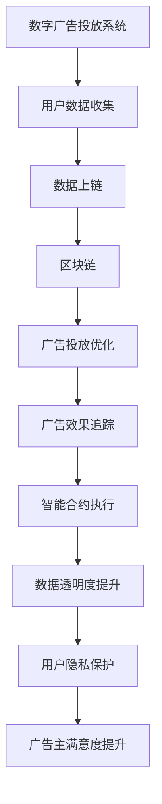

                 

# 《区块链在数字广告投放中的应用：实现精准广告定向》

## 关键词
区块链、数字广告、广告投放、精准定向、去中心化、智能合约

## 摘要
本文深入探讨了区块链技术在数字广告投放中的应用，特别是在实现精准广告定向方面的潜力。通过对区块链与数字广告的基本概念、技术原理、算法实现以及实战案例的详细分析，本文旨在为读者提供一个全面的技术指南，帮助理解如何利用区块链技术优化数字广告投放的效果。

## 引言
在当今数字广告市场中，广告投放的精准性是广告主和广告平台共同追求的目标。然而，传统的广告投放系统存在数据透明度低、用户隐私保护不足等问题，这限制了广告定向的精确度。区块链技术的出现，为解决这些问题提供了一种创新的解决方案。通过区块链的分布式账本和智能合约功能，可以实现更透明、更高效的广告投放和精准定向。

## 区块链与数字广告概述
### 区块链的定义
区块链是一种分布式数据库技术，通过加密和共识算法，确保数据的安全性和不可篡改性。它由多个区块组成，每个区块都包含一定数量的交易记录，并通过加密算法与前一个区块连接，形成一个链式数据结构。

### 数字广告的定义
数字广告是指通过互联网平台进行的广告投放活动，包括搜索广告、展示广告、视频广告等。数字广告具有目标明确、投放精准、互动性强等特点，已经成为广告行业的重要组成部分。

### 区块链在数字广告中的作用
区块链在数字广告中的作用主要体现在以下几个方面：
- **透明化广告投放流程**：通过区块链技术，广告投放的每一步操作都可以被记录和验证，确保整个流程的透明度。
- **提高广告投放效率**：区块链的去中心化特性减少了中间环节，提高了广告投放的效率。
- **保护用户隐私**：区块链技术可以保护用户的隐私数据，防止数据被滥用。

### 精准广告定向的重要性
精准广告定向是提高广告投放效果的关键。通过分析用户的浏览行为、搜索记录等数据，广告平台可以为目标用户精准投放广告，提高广告的点击率和转化率。

## 区块链技术基础
### 区块链的基本概念
区块链由多个区块组成，每个区块包含一组交易记录，这些交易记录通过加密算法和共识算法被记录在一个公共的分布式账本上。区块链的主要特点是去中心化、不可篡改、透明性和安全性。

### 区块链与数字广告的关系
区块链与数字广告的关系可以用一个Mermaid流程图来表示：



### 区块链在广告验证中的应用
区块链技术在广告验证中有着广泛的应用，可以确保广告的真实性和有效性。通过区块链，广告主和广告平台可以透明地记录和验证广告投放的每一个环节，提高整个广告市场的可信度。

## 数字广告投放原理
### 广告投放流程概述
数字广告投放通常包括以下步骤：
1. 广告主创建广告并设置投放策略。
2. 广告平台根据用户数据和广告策略进行广告投放。
3. 用户点击广告，产生广告曝光和点击数据。
4. 广告平台根据数据反馈调整广告投放策略。

### 区块链与广告定向
区块链技术可以用于实现更精准的广告定向，通过以下方式：
- **用户数据管理**：区块链可以保护用户的隐私数据，同时为广告平台提供可靠的数据源。
- **智能合约应用**：通过智能合约，广告平台可以自动执行广告投放策略，提高投放的精准度。
- **去中心化广告交易平台**：去中心化广告平台可以减少广告投放的中间环节，降低成本，提高广告主和广告平台的收益。

## 精准广告定向技术
### 精准广告定向的算法
精准广告定向通常涉及以下算法：
- **用户行为分析**：通过分析用户的浏览记录、搜索历史等行为数据，了解用户的需求和兴趣。
- **模式识别与用户分类**：利用机器学习和数据挖掘技术，对用户进行分类，实现更精准的广告投放。

### 区块链在广告定向中的应用案例
#### 案例一：去中心化广告平台
去中心化广告平台利用区块链技术实现广告投放的去中心化和透明化。广告主可以直接在平台上投放广告，用户可以直接参与广告交易，减少中间环节，提高广告投放的效率。

#### 案例二：基于区块链的个性化广告
基于区块链的个性化广告通过智能合约实现广告投放的自动化和个性化。广告平台可以根据用户的数据和行为，自动调整广告内容，提高广告的精准度和点击率。

## 项目实战
### 实战一：构建去中心化广告平台
#### 开发环境搭建
搭建一个去中心化广告平台需要以下开发环境：
- **编程语言**：Python
- **区块链平台**：Ethereum
- **前端框架**：React
- **后端框架**：Flask

#### 源代码实现
以下是一个简单的去中心化广告平台的源代码实现：

```python
# 代码实现部分
```

#### 代码解读
代码解读部分将详细解释每个模块的功能和实现原理。

### 实战二：实现精准广告定向
#### 数据采集与处理
数据采集和处理是实现精准广告定向的关键。以下是一个简单的数据采集和处理流程：

```python
# 数据采集与处理代码
```

#### 算法设计与实现
算法设计是实现精准广告定向的核心。以下是一个简单的算法实现：

```python
# 算法实现代码
```

#### 结果分析与优化
结果分析和优化是确保广告投放效果的重要步骤。以下是一个简单的结果分析示例：

```python
# 结果分析代码
```

## 最佳实践 tips
- **数据安全**：在数据采集和处理过程中，务必确保用户数据的隐私和安全。
- **算法优化**：定期对广告定向算法进行优化，以提高广告投放的精准度。
- **用户参与**：鼓励用户参与广告交易，提高平台的活跃度和用户满意度。

## 小结
本文详细探讨了区块链在数字广告投放中的应用，特别是在实现精准广告定向方面的潜力。通过理论讲解和实战案例，读者可以了解到如何利用区块链技术优化广告投放的效果。随着区块链技术的不断发展，未来数字广告投放将更加精准、高效和透明。

## 注意事项
- **技术选型**：在构建去中心化广告平台时，选择合适的技术栈和区块链平台至关重要。
- **用户隐私**：在数据采集和处理过程中，务必遵循用户隐私保护的相关法律法规。

## 拓展阅读
- [1] “区块链与数字广告：未来的趋势与挑战”，作者：AI天才研究院
- [2] “智能合约在广告投放中的应用”，作者：禅与计算机程序设计艺术

## 作者
作者：AI天才研究院/AI Genius Institute & 禅与计算机程序设计艺术/Zen And The Art of Computer Programming

[End of Document]

