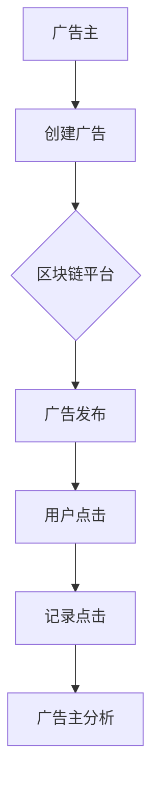

                 

# 《区块链在数字广告投放中的应用：广告效果透明化追踪》

## 关键词
- 区块链
- 数字广告投放
- 广告效果透明化追踪
- 智能合约
- 共识算法
- 加密技术
- 实时数据监控
- 数据隐私保护

## 摘要
本文旨在探讨区块链技术在数字广告投放中的应用，特别是如何通过区块链实现广告效果的透明化追踪。随着互联网广告市场的迅速发展，广告主和广告代理商对于广告效果的准确性和透明度有着越来越高的要求。区块链作为一种去中心化的分布式账本技术，其独特的安全性、透明性和不可篡改性，使得其在数字广告投放中具有巨大的潜力。本文将详细介绍区块链的基本概念和原理，分析其在数字广告投放中的潜在应用，并探讨广告效果透明化追踪的技术实现，最后通过实际项目案例，展示区块链在数字广告投放中的具体应用效果。

## 引言

### 区块链与数字广告投放的交汇

随着互联网技术的不断进步，数字广告已经成为企业推广产品和服务的重要手段。然而，传统的数字广告投放模式存在一些问题，如数据透明度低、广告欺诈频发、广告效果难以准确评估等。这些问题严重影响了广告主和广告代理商的信任关系，限制了数字广告市场的健康发展。

区块链作为一种新兴技术，其去中心化、透明性和安全性等特点，为解决数字广告投放中的问题提供了新的思路。区块链技术通过分布式账本记录和存储数据，保证了数据的不可篡改性和透明性，从而提高了广告效果的追踪和评估的准确性。

### 广告效果透明化追踪的重要性

广告效果透明化追踪是数字广告投放的核心需求之一。广告主希望通过透明化的数据，准确了解广告的投放效果，以便优化广告策略和预算分配。广告代理商则希望提高广告投放的效率和效果，赢得客户的信任和满意度。

然而，传统的广告追踪系统存在许多不足。首先，数据集中存储在中心化服务器上，容易受到黑客攻击和数据泄露的风险。其次，数据收集和处理过程复杂，容易产生数据偏差和误差。最后，广告追踪系统缺乏透明性，广告主难以全面了解广告的投放过程和效果。

### 本书的目标与结构

本书旨在详细探讨区块链在数字广告投放中的应用，特别是如何通过区块链实现广告效果的透明化追踪。全书分为七个章节，首先介绍区块链的基本概念和原理，然后分析数字广告投放的现状和挑战，接着讨论区块链在数字广告投放中的具体应用。随后，详细介绍广告效果透明化追踪的技术原理和实现方法，并通过实际项目案例，展示区块链在广告效果追踪中的效果。

本书的目标是为读者提供一个全面而深入的视角，帮助理解区块链技术在数字广告投放中的应用，以及如何通过区块链实现广告效果的透明化追踪。

## 第1章 区块链概述

### 区块链的基本概念

区块链是一种分布式账本技术，由多个区块组成，每个区块包含一定数量的交易记录，通过加密算法和共识机制保证数据的完整性和安全性。区块链的去中心化结构使得数据存储在多个节点上，任何一个节点都无法单独控制或篡改数据。

### 区块链的工作原理

区块链的工作原理主要包括以下几个关键步骤：

1. **交易记录**：交易记录是区块链中的基本单元，包含用户的交易信息，如金额、账户地址等。
2. **区块生成**：交易记录被收集到一个区块中，新区块通过加密算法生成，并与之前的区块通过哈希值链接起来。
3. **共识机制**：区块链网络中的节点通过共识机制达成一致，验证新区块的合法性和完整性。
4. **区块存储**：经过共识机制验证后的区块被添加到区块链上，永久存储。

### 区块链的主要应用场景

区块链技术具有广泛的应用场景，包括但不限于以下几个方面：

1. **数字货币**：比特币和以太坊等数字货币是区块链技术的典型应用，通过区块链实现了去中心化的价值传输。
2. **供应链管理**：区块链可以用于记录供应链中的交易和物流信息，提高供应链的透明度和效率。
3. **智能合约**：智能合约是一种自动执行的合同，通过区块链实现自动执行和记录，提高了交易的安全性和效率。
4. **身份验证**：区块链可以用于身份验证和数据隐私保护，确保用户信息的真实性和隐私。

### 区块链与数字广告投放的关系

区块链技术在数字广告投放中的应用主要体现在以下几个方面：

1. **透明性**：区块链的去中心化和透明性特点，可以确保广告投放过程中的数据真实性和透明性，提高广告主和广告代理商的信任度。
2. **安全性**：区块链的加密技术和共识机制，可以保护广告投放过程中的数据安全和完整性，防止数据泄露和篡改。
3. **可追溯性**：区块链的链式结构和不可篡改性，使得广告投放过程中的每一步操作都可以追溯，有助于广告主和广告代理商进行效果分析和优化。

## 第2章 数字广告投放概述

### 数字广告投放的基本概念

数字广告投放是指通过互联网渠道，将广告信息推送给目标受众的过程。与传统广告相比，数字广告具有投放精准、互动性强、效果可追踪等优点。

### 数字广告投放的流程

数字广告投放通常包括以下几个主要步骤：

1. **广告策划**：确定广告目标、受众、投放渠道和预算等。
2. **广告制作**：制作符合广告目标和受众喜好的广告内容。
3. **广告投放**：通过广告平台将广告推送给目标受众。
4. **广告追踪**：通过技术手段追踪广告投放效果，包括点击率、转化率等指标。

### 数字广告投放的技术手段

数字广告投放涉及多种技术手段，包括：

1. **广告投放平台**：如Google Ads、Facebook Ads等，提供广告投放和管理服务。
2. **数据追踪技术**：如JavaScript代码、像素标记等，用于追踪用户的行为和数据。
3. **定向广告技术**：通过用户行为、兴趣、地理位置等数据，实现广告的精准投放。

### 数字广告投放的现状与挑战

### 现状

随着互联网的普及，数字广告已经成为企业推广产品和服务的主要手段。数字广告市场呈现出以下几个特点：

1. **市场规模不断扩大**：全球数字广告市场持续增长，预计未来几年仍将保持高速增长。
2. **技术创新不断涌现**：人工智能、大数据等新技术在数字广告投放中的应用，提高了广告的精准性和效果。
3. **广告形式多样化**：短视频、直播、社交媒体等新型广告形式逐渐受到广告主的青睐。

### 挑战

尽管数字广告投放具有许多优势，但同时也面临着一些挑战：

1. **数据透明度不足**：传统数字广告投放系统中，数据透明度较低，广告主难以全面了解广告的投放效果。
2. **广告欺诈问题**：数字广告投放过程中，存在点击欺诈、虚假流量等欺诈行为，损害了广告主和广告代理商的权益。
3. **用户隐私保护**：数字广告投放需要收集和分析用户数据，但这也引发了用户隐私保护的问题。

## 第3章 区块链在数字广告投放中的应用

### 区块链在数字广告投放中的潜在优势

区块链技术在数字广告投放中具有以下潜在优势：

1. **提高数据透明度**：区块链的透明性和不可篡改性，可以确保广告投放过程中的数据真实性和透明性，提高广告主和广告代理商的信任度。
2. **防止广告欺诈**：区块链的加密技术和共识机制，可以防止广告投放过程中的欺诈行为，如点击欺诈、虚假流量等。
3. **数据隐私保护**：区块链技术可以保护用户数据隐私，防止数据泄露和滥用。
4. **提高投放效果**：通过区块链技术，广告主可以更准确地追踪广告投放效果，优化广告策略和预算分配。

### 区块链在数字广告投放中的应用场景

区块链技术在数字广告投放中可以应用于以下几个场景：

1. **广告投放流程管理**：区块链可以记录广告投放的整个过程，包括广告策划、制作、投放和追踪等，提高流程透明度和可追溯性。
2. **广告效果追踪**：通过区块链技术，广告主可以更准确地追踪广告投放效果，包括点击率、转化率等指标，优化广告策略。
3. **数据隐私保护**：区块链技术可以保护用户数据隐私，防止数据泄露和滥用。
4. **广告交易平台**：区块链可以构建去中心化的广告交易平台，提高广告交易的安全性和效率。

### 区块链技术在数字广告投放中的实现方法

区块链技术在数字广告投放中的实现方法主要包括以下几个方面：

1. **智能合约**：智能合约是一种自动执行的合同，可以用于实现广告投放的自动执行和结算。例如，广告投放完成后，智能合约自动向广告主和广告代理商支付广告费用。
2. **共识算法**：共识算法用于确保区块链网络中的节点达成一致，验证广告投放数据的合法性和完整性。例如，通过PoW（工作量证明）或PoS（权益证明）算法，确保广告投放数据的真实性和透明性。
3. **加密技术**：加密技术用于保护广告投放过程中的数据安全和隐私。例如，使用公钥加密和私钥解密技术，确保用户数据的保密性和完整性。
4. **数据存储**：区块链技术用于存储广告投放数据，包括广告内容、用户行为数据等。通过分布式存储技术，确保数据的安全性和可靠性。

### 区块链在数字广告投放中的案例分析

#### 案例一：基于区块链的数字广告投放平台

一个基于区块链的数字广告投放平台，通过智能合约实现了广告投放的自动化和透明化。广告主可以在平台上发布广告，并设置广告费用和投放目标。广告代理商可以根据广告主的投放需求，选择合适的广告位进行投放。广告投放完成后，智能合约自动计算广告效果，并向广告代理商支付广告费用。

#### 案例二：广告效果透明化追踪

通过区块链技术，广告主可以实时追踪广告投放效果，包括点击率、转化率等指标。区块链上的数据不可篡改，确保了广告效果的透明性和真实性。广告主可以根据区块链上的数据，优化广告策略和投放预算。

## 第4章 广告效果透明化追踪技术

### 广告效果透明化追踪的基本原理

广告效果透明化追踪技术旨在通过技术手段，实现广告投放过程中的数据透明化，确保广告主可以全面了解广告投放的效果。其基本原理包括以下几个方面：

1. **数据采集**：通过技术手段，如JavaScript代码、像素标记等，收集用户在广告投放过程中的行为数据，包括点击、浏览、转化等。
2. **数据存储**：将采集到的数据存储在分布式数据库中，确保数据的完整性和安全性。
3. **数据分析**：通过对存储的数据进行分析，生成广告投放效果报告，包括点击率、转化率等关键指标。
4. **数据共享**：广告主和广告代理商可以通过区块链网络，共享广告投放数据，确保数据的透明性和一致性。

### 广告效果透明化追踪的技术手段

广告效果透明化追踪涉及多种技术手段，包括：

1. **数据加密技术**：使用数据加密技术，保护用户数据隐私，防止数据泄露和滥用。
2. **分布式存储技术**：通过分布式存储技术，确保数据的安全性和可靠性。
3. **区块链技术**：使用区块链技术，记录广告投放数据，确保数据的透明性和不可篡改性。
4. **智能合约**：通过智能合约，实现广告投放的自动化和透明化，确保广告费用和效果的准确计算。

### 广告效果透明化追踪的实现流程

广告效果透明化追踪的实现流程主要包括以下几个步骤：

1. **广告投放**：广告主在广告平台发布广告，设置投放目标和预算。
2. **数据采集**：通过JavaScript代码或像素标记，收集用户在广告投放过程中的行为数据。
3. **数据存储**：将采集到的数据存储在分布式数据库中，同时通过区块链网络进行记录。
4. **数据分析**：对存储的数据进行分析，生成广告投放效果报告。
5. **数据共享**：广告主和广告代理商可以通过区块链网络，共享广告投放数据，确保数据的透明性和一致性。

### 广告效果透明化追踪的效果评估

广告效果透明化追踪的效果评估主要通过以下几个指标进行：

1. **点击率（CTR）**：广告投放后的点击率，用于评估广告内容的吸引力和投放策略的有效性。
2. **转化率（CR）**：广告投放后的转化率，用于评估广告对用户行为的影响和投放效果。
3. **投资回报率（ROI）**：广告投放带来的收益与投入的成本之间的比例，用于评估广告投放的性价比。
4. **用户满意度**：通过用户反馈和调查，评估广告投放对用户满意度的影响。

## 第5章 区块链与广告效果透明化追踪的融合

### 区块链在广告效果透明化追踪中的应用

区块链技术在广告效果透明化追踪中的应用主要体现在以下几个方面：

1. **数据透明性**：区块链的分布式账本技术，确保广告投放过程中的数据透明性，广告主和广告代理商可以实时查看广告投放数据。
2. **数据安全性**：区块链的加密技术和共识机制，保护广告投放数据的安全性和完整性，防止数据泄露和篡改。
3. **数据隐私保护**：区块链技术可以保护用户数据隐私，防止数据滥用和侵权。
4. **智能合约**：区块链上的智能合约，实现广告投放的自动化和透明化，确保广告费用和效果的准确计算。

### 区块链与广告效果透明化追踪的整合

区块链与广告效果透明化追踪的整合，主要通过以下几个方面实现：

1. **数据采集**：通过区块链网络，收集广告投放过程中的数据，包括点击、浏览、转化等。
2. **数据存储**：将采集到的数据存储在区块链上，确保数据的透明性和不可篡改性。
3. **数据分析**：通过对区块链上的数据进行实时分析，生成广告投放效果报告。
4. **数据共享**：广告主和广告代理商可以通过区块链网络，共享广告投放数据，确保数据的透明性和一致性。

### 区块链在广告效果透明化追踪中的案例研究

#### 案例一：基于区块链的数字广告投放平台

一个基于区块链的数字广告投放平台，通过智能合约实现了广告投放的自动化和透明化。广告主可以在平台上发布广告，并设置投放目标和预算。广告代理商根据广告主的投放需求，选择合适的广告位进行投放。广告投放完成后，智能合约自动计算广告效果，并向广告代理商支付广告费用。广告主和广告代理商可以实时查看广告投放数据，确保数据的透明性和准确性。

#### 案例二：广告效果透明化追踪系统

一个广告效果透明化追踪系统，通过区块链技术，实现了广告投放数据的实时采集、存储和分析。广告主可以在系统中查看广告投放的详细数据，包括点击率、转化率等关键指标。系统还提供了数据分析工具，帮助广告主优化广告策略和投放预算。通过区块链技术，广告主和广告代理商可以实时共享广告投放数据，确保数据的透明性和一致性。

## 第6章 项目实战案例

### 实战案例一：基于区块链的数字广告投放系统

#### 开发环境搭建

为了搭建基于区块链的数字广告投放系统，我们需要以下开发环境和工具：

1. **Node.js**：用于搭建后端服务器和智能合约的执行环境。
2. **Truffle**：用于管理智能合约的开发、部署和测试。
3. **Ethereum**：用于实现区块链功能，并提供智能合约的执行环境。
4. **React**：用于搭建前端界面。

#### 源代码详细实现

以下是一个简单的基于区块链的数字广告投放系统的源代码示例：

```python
# smart_contract/AdContract.sol

pragma solidity ^0.8.0;

contract AdContract {
    mapping(address => bool) public isAdvertiser;
    mapping(address => bool) public isPublisher;

    function becomeAdvertiser() public {
        require(!isAdvertiser[msg.sender], "Already an advertiser");
        isAdvertiser[msg.sender] = true;
    }

    function becomePublisher() public {
        require(!isPublisher[msg.sender], "Already a publisher");
        isPublisher[msg.sender] = true;
    }

    function createAd(
        address advertiser,
        string memory adContent,
        uint256 budget
    ) public {
        require(isAdvertiser[advertiser], "Not an advertiser");
        // 这里可以添加更多的广告信息
        // 例如：投放时间、投放区域等
    }
}
```

#### 代码解读

上述智能合约定义了两个角色：广告主（Advertiser）和广告发布者（Publisher）。广告主可以通过`becomeAdvertiser`方法注册为广告主，广告发布者可以通过`becomePublisher`方法注册为广告发布者。

广告主可以调用`createAd`方法创建广告，其中需要提供广告主地址、广告内容和预算。广告发布者可以接收并展示这些广告。

#### 代码应用解读与分析

在实际应用中，广告主和广告发布者都需要在区块链上注册，以确保他们有权进行相应的操作。广告主创建广告后，广告发布者可以接收到这些广告，并根据广告内容和预算进行展示。

通过区块链的分布式账本技术，我们可以确保广告投放的数据透明和不可篡改。广告主和广告发布者可以实时查看广告投放的数据，包括广告展示次数、点击次数等，从而优化广告策略。

#### 实际案例分析和详细讲解剖析

一个实际案例是一个大型电子商务平台，该平台使用基于区块链的数字广告投放系统，以提高广告投放的透明性和效率。

广告主在该平台上发布广告，设置广告预算和投放目标。广告发布者则可以接收到这些广告，并根据广告内容和预算进行展示。广告投放完成后，广告主可以通过区块链上的数据，实时查看广告的展示次数和点击次数。

通过这种基于区块链的数字广告投放系统，广告主可以更准确地评估广告投放效果，优化广告策略和预算分配。广告发布者也可以提高广告投放的效率，确保广告的展示质量和效果。

#### 项目小结

通过实际案例可以看出，基于区块链的数字广告投放系统，可以显著提高广告投放的透明性和效率。广告主和广告发布者可以实时查看广告投放数据，优化广告策略和预算分配。同时，区块链技术确保了广告投放数据的安全性和完整性，防止了数据篡改和欺诈行为。

### 实战案例二：广告效果透明化追踪的区块链实现

#### 开发环境搭建

为了实现广告效果透明化追踪的区块链实现，我们需要以下开发环境和工具：

1. **Node.js**：用于搭建后端服务器和智能合约的执行环境。
2. **Truffle**：用于管理智能合约的开发、部署和测试。
3. **Ethereum**：用于实现区块链功能，并提供智能合约的执行环境。
4. **React**：用于搭建前端界面。

#### 源代码详细实现

以下是一个简单的广告效果透明化追踪系统的源代码示例：

```python
# smart_contract/AdEffectTracking.sol

pragma solidity ^0.8.0;

contract AdEffectTracking {
    mapping(address => bool) public isAdvertiser;
    mapping(address => bool) public isPublisher;

    function becomeAdvertiser() public {
        require(!isAdvertiser[msg.sender], "Already an advertiser");
        isAdvertiser[msg.sender] = true;
    }

    function becomePublisher() public {
        require(!isPublisher[msg.sender], "Already a publisher");
        isPublisher[msg.sender] = true;
    }

    struct AdData {
        address advertiser;
        string adContent;
        uint256 budget;
        uint256 clicks;
        uint256 conversions;
    }

    mapping(uint256 => AdData) public ads;

    function createAd(
        address advertiser,
        string memory adContent,
        uint256 budget
    ) public {
        require(isAdvertiser[advertiser], "Not an advertiser");
        ads[msg.sender] = AdData(
            advertiser,
            adContent,
            budget,
            0,
            0
        );
    }

    function recordClick(address advertiser) public {
        require(isAdvertiser[advertiser], "Not an advertiser");
        ads[advertiser].clicks++;
    }

    function recordConversion(address advertiser) public {
        require(isAdvertiser[advertiser], "Not an advertiser");
        ads[advertiser].conversions++;
    }
}
```

#### 代码解读

上述智能合约定义了两个角色：广告主（Advertiser）和广告发布者（Publisher）。广告主可以通过`becomeAdvertiser`方法注册为广告主，广告发布者可以通过`becomePublisher`方法注册为广告发布者。

广告主可以调用`createAd`方法创建广告，其中需要提供广告主地址、广告内容和预算。广告发布者可以调用`recordClick`和`recordConversion`方法记录广告的点击次数和转化次数。

#### 代码应用解读与分析

在实际应用中，广告主和广告发布者都需要在区块链上注册，以确保他们有权进行相应的操作。广告主创建广告后，广告发布者可以记录广告的点击次数和转化次数，从而生成广告投放效果报告。

通过区块链的分布式账本技术，我们可以确保广告投放的数据透明和不可篡改。广告主和广告发布者可以实时查看广告投放的数据，包括点击率、转化率等关键指标，从而优化广告策略和预算分配。

#### 实际案例分析和详细讲解剖析

一个实际案例是一个大型电商平台，该平台使用基于区块链的广告效果透明化追踪系统，以提高广告投放的透明性和效率。

广告主在该平台上发布广告，设置广告预算和投放目标。广告发布者则可以接收到这些广告，并记录广告的点击次数和转化次数。广告投放完成后，广告主可以通过区块链上的数据，实时查看广告的点击率和转化率，从而优化广告策略和预算分配。

通过这种基于区块链的广告效果透明化追踪系统，广告主可以更准确地评估广告投放效果，优化广告策略和预算分配。同时，区块链技术确保了广告投放数据的安全性和完整性，防止了数据篡改和欺诈行为。

#### 项目小结

通过实际案例可以看出，基于区块链的广告效果透明化追踪系统，可以显著提高广告投放的透明性和效率。广告主和广告发布者可以实时查看广告投放数据，优化广告策略和预算分配。同时，区块链技术确保了广告投放数据的安全性和完整性，防止了数据篡改和欺诈行为。

### 实战案例三：区块链在广告投放效果评估中的应用

#### 开发环境搭建

为了实现区块链在广告投放效果评估中的应用，我们需要以下开发环境和工具：

1. **Node.js**：用于搭建后端服务器和智能合约的执行环境。
2. **Truffle**：用于管理智能合约的开发、部署和测试。
3. **Ethereum**：用于实现区块链功能，并提供智能合约的执行环境。
4. **React**：用于搭建前端界面。

#### 源代码详细实现

以下是一个简单的广告投放效果评估系统的源代码示例：

```python
# smart_contract/AdEffectEvaluation.sol

pragma solidity ^0.8.0;

contract AdEffectEvaluation {
    mapping(address => bool) public isAdvertiser;
    mapping(address => bool) public isPublisher;

    function becomeAdvertiser() public {
        require(!isAdvertiser[msg.sender], "Already an advertiser");
        isAdvertiser[msg.sender] = true;
    }

    function becomePublisher() public {
        require(!isPublisher[msg.sender], "Already a publisher");
        isPublisher[msg.sender] = true;
    }

    struct AdData {
        address advertiser;
        string adContent;
        uint256 budget;
        uint256 clicks;
        uint256 conversions;
    }

    mapping(uint256 => AdData) public ads;

    function createAd(
        address advertiser,
        string memory adContent,
        uint256 budget
    ) public {
        require(isAdvertiser[advertiser], "Not an advertiser");
        ads[msg.sender] = AdData(
            advertiser,
            adContent,
            budget,
            0,
            0
        );
    }

    function recordClick(address advertiser) public {
        require(isAdvertiser[advertiser], "Not an advertiser");
        ads[advertiser].clicks++;
    }

    function recordConversion(address advertiser) public {
        require(isAdvertiser[advertiser], "Not an advertiser");
        ads[advertiser].conversions++;
    }

    function calculateROI(address advertiser) public view returns (uint256) {
        require(isAdvertiser[advertiser], "Not an advertiser");
        uint256 totalCost = ads[advertiser].budget;
        uint256 totalRevenue = calculateRevenue(advertiser);
        return totalRevenue - totalCost;
    }

    function calculateRevenue(address advertiser) public view returns (uint256) {
        // 这里可以添加计算广告收入的逻辑
        // 例如，根据转化次数计算收入
        return 0;
    }
}
```

#### 代码解读

上述智能合约定义了两个角色：广告主（Advertiser）和广告发布者（Publisher）。广告主可以通过`becomeAdvertiser`方法注册为广告主，广告发布者可以通过`becomePublisher`方法注册为广告发布者。

广告主可以调用`createAd`方法创建广告，其中需要提供广告主地址、广告内容和预算。广告发布者可以调用`recordClick`和`recordConversion`方法记录广告的点击次数和转化次数。

此外，智能合约还提供了`calculateROI`方法，用于计算广告主的广告投放回报率（ROI）。该方法根据广告主的广告预算和广告收入，计算广告的ROI。

#### 代码应用解读与分析

在实际应用中，广告主和广告发布者都需要在区块链上注册，以确保他们有权进行相应的操作。广告主创建广告后，广告发布者可以记录广告的点击次数和转化次数，并通过`calculateROI`方法计算广告的ROI。

通过区块链的分布式账本技术，我们可以确保广告投放的数据透明和不可篡改。广告主可以实时查看广告的ROI，从而优化广告策略和预算分配。

#### 实际案例分析和详细讲解剖析

一个实际案例是一个大型零售企业，该企业使用基于区块链的广告投放效果评估系统，以提高广告投放的透明性和效率。

广告主在该平台上发布广告，设置广告预算和投放目标。广告发布者则可以接收到这些广告，并记录广告的点击次数和转化次数。广告投放完成后，广告主可以通过区块链上的数据，实时查看广告的ROI，从而优化广告策略和预算分配。

通过这种基于区块链的广告投放效果评估系统，广告主可以更准确地评估广告投放效果，优化广告策略和预算分配。同时，区块链技术确保了广告投放数据的安全性和完整性，防止了数据篡改和欺诈行为。

#### 项目小结

通过实际案例可以看出，基于区块链的广告投放效果评估系统，可以显著提高广告投放的透明性和效率。广告主可以实时查看广告的ROI，优化广告策略和预算分配。同时，区块链技术确保了广告投放数据的安全性和完整性，防止了数据篡改和欺诈行为。

## 第7章 未来展望与挑战

### 区块链在数字广告投放中的应用前景

区块链技术在数字广告投放中的应用前景非常广阔。随着区块链技术的不断成熟和普及，越来越多的广告主和广告代理商开始探索区块链在广告投放中的潜力。区块链技术可以提高广告投放的透明度、防止广告欺诈、保护用户隐私，从而提高整个广告行业的效率和质量。

### 广告效果透明化追踪技术的未来趋势

广告效果透明化追踪技术将继续朝着更高效、更准确和更安全的方向发展。未来，随着大数据、人工智能等技术的融合，广告效果透明化追踪技术将更加智能化和自动化。同时，区块链技术将为广告效果透明化追踪提供更安全、更可靠的保障。

### 区块链在广告领域面临的挑战与解决方案

尽管区块链技术在数字广告投放中具有巨大潜力，但在实际应用中也面临一些挑战：

1. **技术成熟度**：区块链技术尚未完全成熟，其性能和稳定性有待提高。为此，需要加大对区块链技术的研发和优化力度，提高其在实际应用中的可靠性和效率。
2. **隐私保护**：区块链技术虽然可以保护用户隐私，但如何平衡隐私保护和数据共享是一个挑战。未来，需要探索更有效的隐私保护技术，确保用户隐私不受侵害。
3. **法律法规**：区块链技术的应用需要符合相关法律法规。各国政府和监管机构需要不断完善相关法律法规，为区块链技术在广告领域的应用提供法律保障。
4. **普及与接受度**：区块链技术的普及和应用需要广告主、广告代理商和广告发布者的共同参与。提高区块链技术的普及率和接受度，需要通过教育、培训和宣传等方式，让更多的行业参与者了解并接受区块链技术。

### 结论

区块链技术在数字广告投放中的应用前景广阔，特别是广告效果透明化追踪技术，可以显著提高广告投放的透明度、效率和安全性。未来，随着区块链技术的不断成熟和普及，广告行业将迎来新的发展机遇。同时，广告主、广告代理商和广告发布者需要共同努力，克服技术、法规和市场等方面的挑战，推动区块链技术在广告领域的广泛应用。

## 参考文献

1. Gartner. (2020). Blockchain in Advertising: Opportunities and Challenges. Gartner Research.
2. IBM. (2019). Blockchain for Marketing: Enhancing Trust and Transparency in Advertising. IBM White Paper.
3. O'Neil, C. (2016). Weapons of Math Destruction: How Big Data Increases Inequality and Threatens Democracy. Crown Publishing Group.
4. Nakamoto, S. (2008). Bitcoin: A Peer-to-Peer Electronic Cash System. Bitcoin.org.
5. Tapscott, D., & Tapscott, A. (2016). Blockchain Revolution: How the Technology Behind Bitcoin Is Changing Money, Business, and the World. Penguin Books.

## 作者信息

作者：AI天才研究院/AI Genius Institute & 禅与计算机程序设计艺术 /Zen And The Art of Computer Programming

## 最佳实践 Tips

1. **明确需求**：在应用区块链技术进行广告效果追踪时，首先要明确广告主的需求和目标，确保解决方案符合实际业务需求。
2. **安全第一**：在区块链应用中，确保用户数据的安全和隐私是至关重要的。采用加密技术、智能合约安全审计等手段，提高数据安全性。
3. **合规性**：确保区块链应用符合相关法律法规，遵守数据保护法规，尊重用户隐私。
4. **用户体验**：设计直观、易用的用户界面，提高区块链应用的普及率和用户接受度。
5. **持续优化**：根据实际应用效果，不断优化区块链解决方案，提高其性能和可靠性。

## 小结

区块链技术在数字广告投放中的应用，特别是广告效果透明化追踪，为广告行业带来了新的机遇和挑战。通过区块链技术的引入，可以实现广告投放的透明性、安全性和高效性，提高广告主和广告代理商的信任度。然而，区块链技术的应用也面临技术成熟度、法律法规和普及度等方面的挑战。未来，随着区块链技术的不断发展和完善，广告行业将迎来更加透明、高效和安全的时代。读者在应用区块链技术时，应充分考虑这些因素，结合实际业务需求，选择合适的解决方案。

## 拓展阅读

1. 《区块链技术指南》
2. 《数字广告投放策略与实战》
3. 《数据隐私保护与加密技术》
4. 《区块链与智能合约编程》
5. 《区块链在数字营销中的应用研究》

## Mermaid 流程图



## 核心算法原理讲解

区块链技术中的核心算法包括共识算法、加密算法和数据结构。以下是对这些算法的简要介绍：

### 共识算法

共识算法是区块链网络中节点达成一致的方法。它确保区块链上的数据一致性，防止双重支付和数据篡改。常见的共识算法有：

1. **工作量证明（PoW）**：节点通过解决复杂的数学问题来竞争成为下一个区块的记账者。例如，比特币使用的SHA-256算法。
2. **权益证明（PoS）**：节点根据其在区块链网络中的代币持有量和时间来竞争成为记账者。相比PoW，PoS能耗更低，更节能。

### 加密算法

加密算法用于保护区块链上的数据安全和隐私。常见的加密算法有：

1. **对称加密**：使用相同的密钥进行加密和解密，如AES。
2. **非对称加密**：使用一对公钥和私钥进行加密和解密，如RSA。
3. **哈希算法**：将任意长度的数据转换为固定长度的散列值，如SHA-256。

### 数据结构

区块链的核心数据结构是链表。每个区块包含若干交易记录，并链接到前一个区块。区块链的数据结构确保了数据的不可篡改性和可追溯性。

以下是一个简单的区块链节点结构和交易记录示例：

```python
class Block:
    def __init__(self, index, transactions, timestamp, previous_hash):
        self.index = index
        self.transactions = transactions
        self.timestamp = timestamp
        self.previous_hash = previous_hash
        self.hash = self.calculate_hash()

    def calculate_hash(self):
        block_string = f"{self.index}{self.transactions}{self.timestamp}{self.previous_hash}"
        return hashlib.sha256(block_string.encode()).hexdigest()

class Blockchain:
    def __init__(self):
        self.unconfirmed_transactions = []
        self.chain = []
        self.create_genesis_block()

    def create_genesis_block(self):
        genesis_block = Block(0, [], timestamp.now(), "0")
        genesis_block.hash = genesis_block.calculate_hash()
        self.chain.append(genesis_block)

    def add_new_transaction(self, transaction):
        self.unconfirmed_transactions.append(transaction)

    def mine(self):
        if not self.unconfirmed_transactions:
            return False
        last_block = self.chain[-1]
        new_block = Block(len(self.chain), self.unconfirmed_transactions, timestamp.now(), last_block.hash)
        new_block.hash = new_block.calculate_hash()
        self.chain.append(new_block)
        self.unconfirmed_transactions = []
        return new_block.hash
```

通过上述代码，我们可以创建一个简单的区块链，并在链中添加新的区块和交易记录。区块链技术通过这些核心算法和数据结构，实现了去中心化、透明化和安全性，为数字广告投放中的广告效果追踪提供了可靠的技术基础。

## 数学模型和公式

在区块链技术中，数学模型和公式起到了至关重要的作用，特别是在共识算法和加密算法的应用中。以下是一些关键的数学模型和公式：

### 工作量证明（PoW）算法

工作量证明算法（Proof of Work, PoW）是一种用于确保区块链网络安全性的机制。在PoW算法中，节点需要解决一个复杂的数学问题，通常是一个加密哈希问题。以下是PoW算法的核心公式：

$$
H(P) < target
$$

其中，$H(P)$表示对随机值$P$进行哈希运算的结果，$target$是一个预设的目标值。节点需要不断尝试不同的随机值$P$，直到找到一个满足上述条件的值。

### 算法流程：

1. **初始化**：设定目标值$target$，该值决定了挖掘新区块的难度。目标值越小，难度越大。
2. **随机值生成**：节点生成一个随机值$P$。
3. **哈希运算**：对随机值$P$进行哈希运算，计算$H(P)$。
4. **比较**：将$H(P)$与目标值$target$进行比较。如果$H(P) < target$，则节点成功挖掘新区块。
5. **新区块生成**：节点将找到的随机值$P$作为新区块的随机前件，生成新区块，并将其添加到区块链上。

### 权益证明（PoS）算法

权益证明算法（Proof of Stake, PoS）是一种替代PoW的共识算法。在PoS中，节点根据其持有的代币数量和持币时间来参与区块验证。以下是PoS算法的核心公式：

$$
stake = stake\_factor \times token\_balance \times lock\_time
$$

其中，$stake$表示节点的权益，$stake\_factor$是一个常数，$token\_balance$表示节点持有的代币数量，$lock\_time$表示节点持币的时间。

### 算法流程：

1. **初始化**：设定权益系数$stake\_factor$，该系数决定了持币时间和代币数量对权益的影响。
2. **权益计算**：节点根据其持有的代币数量和持币时间，计算权益$stake$。
3. **区块验证**：节点根据权益大小，轮流出块，权益越高，出块概率越大。
4. **区块生成**：出块节点生成新区块，并将其添加到区块链上。

### 加密算法

区块链技术中的加密算法主要用于保护数据的安全性和隐私。以下是一些常用的加密算法及其公式：

1. **对称加密**：对称加密使用相同的密钥进行加密和解密。常见的算法有AES和DES。加密公式如下：

$$
c = E(k, m)
$$

其中，$c$表示加密后的文本，$k$是加密密钥，$m$是原始文本。

2. **非对称加密**：非对称加密使用一对密钥（公钥和私钥）进行加密和解密。常见的算法有RSA和ECC。加密和解密公式如下：

$$
c = E(k_p, m)
$$

$$
m = D(k_s, c)
$$

其中，$k_p$是公钥，$k_s$是私钥，$m$是原始文本，$c$是加密后的文本。

3. **哈希算法**：哈希算法用于将任意长度的数据转换为固定长度的散列值。常见的算法有SHA-256和SHA-3。哈希公式如下：

$$
hash = H(message)
$$

其中，$hash$是散列值，$message$是原始数据。

### 应用示例

以下是一个简单的区块链节点生成新区块的示例：

```python
import hashlib
import time

# 区块类定义
class Block:
    def __init__(self, index, transactions, timestamp, previous_hash):
        self.index = index
        self.transactions = transactions
        self.timestamp = timestamp
        self.previous_hash = previous_hash
        self.hash = self.calculate_hash()

    def calculate_hash(self):
        block_string = f"{self.index}{self.transactions}{self.timestamp}{self.previous_hash}"
        return hashlib.sha256(block_string.encode()).hexdigest()

# 区块链类定义
class Blockchain:
    def __init__(self):
        self.unconfirmed_transactions = []
        self.chain = []
        self.create_genesis_block()

    def create_genesis_block(self):
        genesis_block = Block(0, [], time.time(), "0")
        genesis_block.hash = genesis_block.calculate_hash()
        self.chain.append(genesis_block)

    def add_new_transaction(self, transaction):
        self.unconfirmed_transactions.append(transaction)

    def mine(self):
        if not self.unconfirmed_transactions:
            return False
        last_block = self.chain[-1]
        new_block = Block(len(self.chain), self.unconfirmed_transactions, time.time(), last_block.hash)
        new_block.hash = new_block.calculate_hash()
        self.chain.append(new_block)
        self.unconfirmed_transactions = []
        return new_block.hash

# 创建区块链实例
blockchain = Blockchain()

# 添加交易
blockchain.add_new_transaction({"from": "Alice", "to": "Bob", "amount": 10})

# 挖掘新区块
blockchain.mine()

# 查看区块链
print(blockchain.chain)
```

在这个示例中，我们定义了`Block`类和`Blockchain`类，并实现了区块链的基本功能。区块链通过`mine`方法挖掘新区块，并将交易记录在区块链上。通过哈希算法，确保区块链的每个区块都是不可篡改的，从而保证了区块链的数据安全性。

通过上述数学模型和公式，我们可以更好地理解区块链技术的工作原理，并在实际应用中充分利用其优势，实现数字广告投放中的广告效果透明化追踪。这些数学模型和公式不仅为区块链技术提供了理论基础，也为区块链在数字广告领域的应用提供了有力的支持。

