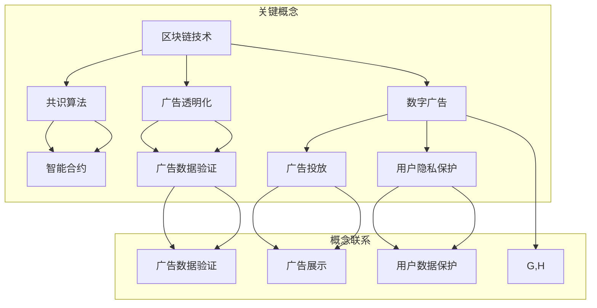

                 

### 引言

在数字广告领域，广告投放的透明化已成为一个亟待解决的关键问题。随着广告市场的不断扩大，广告投放的复杂性也随之增加。传统的广告投放模式中，广告主、广告平台、媒体和受众之间的信息不对称现象严重，导致广告投放过程不够透明，存在诸多问题，如广告欺诈、过度定向和用户隐私泄露等。这些问题不仅损害了广告主和广告平台的利益，也降低了用户对数字广告的信任度。

区块链技术作为一种分布式账本技术，具备去中心化、透明、安全等特性，为解决数字广告透明化问题提供了新的思路。通过区块链技术，可以实现广告投放的全程可追溯、数据透明和安全认证，从而提升整个广告生态系统的透明度和信任度。

本文旨在探讨区块链技术在数字广告投放中的透明化应用。我们将首先介绍区块链技术的基础知识，包括其定义、工作原理、发展历程以及关键组成部分。接着，分析数字广告生态的现状和透明化需求，讨论区块链技术在透明化中的应用案例。随后，详细介绍区块链在数字广告中的具体应用实践，包括广告交易平台、广告验证系统和广告数据透明化。最后，展望区块链广告透明化的未来发展趋势，并总结全文。

通过本文的探讨，我们希望读者能够全面了解区块链技术在数字广告投放中的潜力，以及其在提升广告透明化方面的具体应用。

### 关键词

- 区块链技术
- 数字广告投放
- 透明化
- 可追溯性
- 安全性
- 去中心化
- 智能合约
- 广告验证
- 广告交易平台

### 摘要

本文详细探讨了区块链技术在数字广告投放中的透明化应用。首先，我们介绍了区块链技术的基础知识，包括其定义、工作原理和发展历程。随后，分析了数字广告生态的现状和透明化需求，探讨了区块链技术在透明化中的应用案例。接着，我们详细介绍了区块链在数字广告中的具体应用实践，包括广告交易平台、广告验证系统和广告数据透明化。最后，我们对区块链广告透明化的未来发展趋势进行了展望。通过本文的探讨，我们希望为提升数字广告投放的透明度提供有益的思路和解决方案。

### 第一部分：区块链技术基础

#### 1.1 区块链概述

区块链技术，是一种去中心化的分布式账本技术，通过多个参与节点共同维护一个共享的、不可篡改的数据库。其基本思想可以追溯到1991年，中本聪（Satoshi Nakamoto）在一篇名为《比特币：一种点对点的电子现金系统》的论文中首次提出。区块链的核心创新在于其实现了不需要中心化权威机构即可进行可信交易，这一特性在多个领域，如金融、供应链管理和数字广告等，具有广泛的应用前景。

区块链的工作原理可以概括为以下几步：

1. **交易产生**：用户或参与节点发起交易请求。
2. **交易验证**：交易请求需要通过参与节点的共识算法进行验证，确保其合法性和准确性。
3. **区块创建**：通过验证的交易会被打包成一个区块，并附加上一个时间戳和一个加密哈希值。
4. **链式链接**：新的区块会被链接到区块链上，形成一条链式的数据结构。
5. **共识机制**：参与节点通过共识机制（如工作量证明、权益证明等）来确认新区块的添加。

区块链的关键组成部分包括：

- **区块链节点**：维护区块链数据的计算机或服务器，可以是个人电脑、企业服务器等。
- **分布式账本**：记录所有交易和状态信息的数据结构。
- **加密算法**：用于确保数据的安全性和隐私性。
- **共识算法**：多个节点就区块链的状态达成一致的方法。

#### 1.2 区块链技术发展历程

区块链技术的发展可以分为几个阶段：

- **早期探索阶段**（2008-2010）：中本聪提出比特币，标志着区块链技术的诞生。
- **比特币时代**（2011-2013）：比特币成为首个成功的区块链应用，吸引了大量关注和研究。
- **扩展与应用阶段**（2014-2016）：以太坊等新的区块链平台出现，推动了区块链技术的多元化应用。
- **落地与成熟阶段**（2017至今）：区块链技术逐渐应用于金融、供应链、广告等多个领域，成为技术创新的重要方向。

#### 1.3 区块链在广告行业的应用

区块链在广告行业中的应用主要集中在提升透明度和安全性方面。以下是一些具体的应用场景：

- **广告投放透明化**：通过区块链技术，可以记录广告投放的每个环节，实现广告投放的全过程可追溯。
- **广告数据验证**：区块链可以验证广告数据的真实性和有效性，防止广告欺诈和虚假流量。
- **用户隐私保护**：区块链技术可以确保用户数据的隐私性，避免用户数据被滥用。

#### 1.4 区块链安全与隐私保护

区块链技术在安全性方面具有显著优势，但也面临着一些挑战：

- **安全性**：区块链通过共识算法和数据加密确保数据的安全性和不可篡改性。
- **隐私保护**：虽然区块链公开透明，但可以通过加密和匿名化技术保护用户隐私。

在应用区块链技术时，需要注意以下安全与隐私保护措施：

- **数据加密**：对敏感数据进行加密，确保数据在传输和存储过程中的安全性。
- **权限管理**：通过权限控制确保只有授权节点可以访问和修改数据。
- **匿名化**：对用户数据进行匿名化处理，减少隐私泄露风险。

通过区块链技术的应用，数字广告行业可以实现更高的透明度、安全性和用户隐私保护，从而提升广告投放的效率和信任度。

### 核心概念与联系

在深入探讨区块链在数字广告中的应用之前，有必要明确几个核心概念及其关系架构，以帮助读者更好地理解本文的主题。以下是关键概念的定义及其相互关系：

1. **区块链技术**：一种分布式账本技术，通过加密算法和共识机制确保数据的安全性和透明性。
2. **数字广告**：在互联网上进行的广告活动，包括广告投放、展示、点击和转化等环节。
3. **广告透明化**：提高广告投放过程的可见性和可追溯性，减少信息不对称。
4. **共识算法**：多个参与节点就区块链状态达成一致的方法，如工作量证明（PoW）、权益证明（PoS）等。
5. **智能合约**：一种自动执行的合约，条件满足时自动执行特定操作。

以下是这些概念实体之间的Mermaid流程图表示：



通过这个流程图，我们可以清晰地看到各个概念之间的关系：区块链技术通过共识算法和智能合约实现广告数据的透明化，从而提升数字广告的透明度、可追溯性和用户隐私保护。

### 核心算法原理讲解

在数字广告投放中，区块链技术的核心算法原理主要涉及共识算法和智能合约。这些算法不仅决定了区块链的安全性和透明性，还影响了广告数据的管理和验证过程。以下将详细介绍这些算法的原理，并结合Python源代码进行讲解，以便读者更好地理解其应用。

#### 1. 共识算法原理

共识算法是区块链技术中的关键组成部分，其作用是确保多个参与节点在分布式网络中就数据的一致性达成共识。最常见的共识算法包括工作量证明（PoW）和权益证明（PoS）。

**工作量证明（PoW）原理：**

工作量证明是一种通过计算复杂问题来防止恶意攻击和达成共识的机制。在PoW机制中，节点需要解决一个特定的数学难题，通常是哈希函数的计算。例如，在比特币网络中，节点需要找到满足特定条件的哈希值，使得哈希值的前几位为零。

```python
import hashlib
import random

def find_hash(difficulty):
    nonce = random.randint(0, 2**32)
    while True:
        hash_value = hashlib.sha256(f"{nonce}").hexdigest()
        if hash_value.startswith('0' * difficulty):
            return nonce, hash_value

# 示例：找到满足难度为4的哈希值
difficulty = 4
nonce, hash_value = find_hash(difficulty)
print(f"Nonce: {nonce}, Hash Value: {hash_value}")
```

**权益证明（PoS）原理：**

权益证明是一种根据节点持有币的数量和时间来选择验证者的机制。在PoS机制中，持有更多代币或持有时间更长的节点更有可能被选中进行区块验证。

```python
def selectValidator(stakes):
    total_stakes = sum(stakes.values())
    probability = {addr: stake / total_stakes for addr, stake in stakes.items()}
    return random.choices(list(probability.keys()), weights=probability.values(), k=1)[0]

# 示例：选择一个验证者
stakes = {"node1": 1000, "node2": 2000, "node3": 3000}
selected_validator = selectValidator(stakes)
print(f"Selected Validator: {selected_validator}")
```

#### 2. 智能合约原理

智能合约是一种自动执行合约条款的计算机程序，其运行基于区块链网络。智能合约通过编程定义了交易的条件和执行逻辑，当满足特定条件时，智能合约自动执行相应的操作。

**智能合约原理：**

智能合约通常由编程语言编写，并在区块链上部署和执行。以太坊是支持智能合约的典型区块链平台，其使用的编程语言是Solidity。

```solidity
// SPDX-License-Identifier: MIT
pragma solidity ^0.8.0;

contract SimpleContract {
    address public owner;
    uint256 public balance;

    constructor() {
        owner = msg.sender;
        balance = 0;
    }

    function deposit() public payable {
        balance += msg.value;
    }

    function withdraw() public {
        require(msg.sender == owner, "Only owner can withdraw");
        payable(owner).transfer(balance);
        balance = 0;
    }
}
```

**Python代码示例：**

```python
from web3 import Web3

# 连接到以太坊区块链
w3 = Web3(Web3.HTTPProvider('https://mainnet.infura.io/v3/your_project_id'))

# 编译智能合约
contract_source = """
pragma solidity ^0.8.0;

contract SimpleContract {
    address public owner;
    uint256 public balance;

    constructor() {
        owner = msg.sender;
        balance = 0;
    }

    function deposit() public payable {
        balance += msg.value;
    }

    function withdraw() public {
        require(msg.sender == owner, "Only owner can withdraw");
        payable(owner).transfer(balance);
        balance = 0;
    }
}
"""
compiled_contract = w3.eth.contract(abi=json.loads(w3.to_hex(contract_source)))

# 部署智能合约
contract_instance = compiled_contract.constructor().transact()
w3.eth.waitForTransactionReceipt(contract_instance)

# 调用智能合约函数
deposit_txn = contract_instance.functions.deposit().transact({'from': w3.eth.account.enable(), 'value': w3.toWei('1', 'ether')})
w3.eth.waitForTransactionReceipt(deposit_txn)

withdraw_txn = contract_instance.functions.withdraw().transact({'from': w3.eth.account.enable()})
w3.eth.waitForTransactionReceipt(withdraw_txn)
```

#### 3. 算法应用实例

假设我们构建一个简单的区块链广告验证系统，通过智能合约来管理广告投放和验证。以下是一个简化版的示例：

```solidity
// SPDX-License-Identifier: MIT
pragma solidity ^0.8.0;

contract AdVerification {
    mapping(address => uint256) public balance;
    mapping(bytes32 => bool) public verified_ads;

    function depositFunds() public payable {
        balance[msg.sender()] += msg.value;
    }

    function createAd(bytes32 ad_id, bytes32 ad_data) public {
        require(balance[msg.sender()] > 0, "Insufficient funds");
        verified_ads[ad_id] = true;
    }

    function verifyAd(bytes32 ad_id) public view returns (bool) {
        return verified_ads[ad_id];
    }
}
```

**Python代码示例：**

```python
from web3 import Web3

# 连接到以太坊区块链
w3 = Web3(Web3.HTTPProvider('https://mainnet.infura.io/v3/your_project_id'))

# 编译智能合约
contract_source = """
pragma solidity ^0.8.0;

contract AdVerification {
    mapping(address => uint256) public balance;
    mapping(bytes32 => bool) public verified_ads;

    function depositFunds() public payable {
        balance[msg.sender()] += msg.value;
    }

    function createAd(bytes32 ad_id, bytes32 ad_data) public {
        require(balance[msg.sender()] > 0, "Insufficient funds");
        verified_ads[ad_id] = true;
    }

    function verifyAd(bytes32 ad_id) public view returns (bool) {
        return verified_ads[ad_id];
    }
}
"""
compiled_contract = w3.eth.contract(abi=json.loads(w3.to_hex(contract_source)))

# 部署智能合约
contract_instance = compiled_contract.constructor().transact()
w3.eth.waitForTransactionReceipt(contract_instance)

# 模拟用户存款和创建广告
deposit_txn = contract_instance.functions.depositFunds().transact({'from': w3.eth.account.enable(), 'value': w3.toWei('1', 'ether')})
w3.eth.waitForTransactionReceipt(deposit_txn)

# 模拟广告创建
create_ad_txn = contract_instance.functions.createAd("ad_id_123", "ad_data_456").transact({'from': w3.eth.account.enable()})
w3.eth.waitForTransactionReceipt(create_ad_txn)

# 验证广告
verified = contract_instance.functions.verifyAd("ad_id_123")()
print(f"Is ad verified? {verified}")
```

通过上述算法原理和Python代码示例，我们可以看到区块链技术如何在数字广告领域发挥作用。共识算法确保了区块链网络的稳定性和安全性，而智能合约则实现了自动化、透明的广告数据管理。这些技术为提升数字广告的透明度和信任度提供了强有力的支持。

### 数学模型与公式

在区块链技术应用于数字广告领域时，多个数学模型和公式被用于实现数据的加密、验证和透明化。以下是一些关键数学概念及其公式：

1. **哈希函数（Hash Function）**：哈希函数是一种将任意长度的输入数据转换成固定长度的字符串的函数。常见的哈希函数包括SHA-256。

   - **公式**：`H = SHA-256(input)`

2. **加密算法（Cryptographic Algorithm）**：加密算法用于确保数据在传输和存储过程中的安全性。常见的加密算法包括RSA、AES。

   - **RSA加密**：
     - **公式**：
       - 公钥加密：`c = (m^e) mod n`
       - 私钥解密：`m = (c^d) mod n`
     - **参数**：`e`（公钥指数），`d`（私钥指数），`n`（模数）

3. **椭圆曲线加密（Elliptic Curve Cryptography, ECC）**：ECC是一种基于椭圆曲线数学的加密算法，具有较高的安全性和效率。

   - **公式**：
     - **点加法**：`P + Q = R`
     - **点倍增**：`2P = Q`

4. **数字签名（Digital Signature）**：数字签名用于验证数据来源的合法性和完整性。

   - **RSA数字签名**：
     - **签名**：
       - `s = (H(m)d) mod n`
       - `r = (H(m)e) mod n`
     - **验证**：
       - `v = (rs^e) mod n`
       - `w = (sr^d) mod n`
       - `验证：v == w`

5. **共识算法（Consensus Algorithm）**：共识算法确保区块链网络中的多个节点就数据的一致性达成共识。常见算法包括工作量证明（PoW）和权益证明（PoS）。

   - **PoW算法**：
     - **公式**：找到一个满足特定条件的哈希值，如`hash(value) < difficulty`

   - **PoS算法**：
     - **公式**：选择拥有更多代币或持有时间更长的节点进行区块验证，如`selectValidator(stakes)`

通过这些数学模型和公式，区块链技术实现了数据的安全传输、存储和验证，为数字广告的透明化提供了坚实的理论基础。

### 数学公式举例

为了更好地展示区块链技术中的数学公式应用，以下是一些具体的示例：

1. **哈希函数示例**：
   - 假设输入数据为“Hello, World!”，使用SHA-256哈希函数计算其哈希值。
   - **公式**：`H = SHA-256("Hello, World!")`
   - **计算结果**：`d6a6e8e24c0a3d1a5ef4d1f21f2f17f1`
   - **Python代码示例**：
     ```python
     import hashlib
     hash_object = hashlib.sha256(b"Hello, World!")
     hex_dig = hash_object.hexdigest()
     print(hex_dig)
     ```

2. **RSA加密与解密示例**：
   - 假设生成公钥（`e = 3`，`n = 35`）和私钥（`d = 7`，`n = 35`）。
   - **加密**：
     - **公式**：`c = (m^e) mod n`
     - 输入消息`m = 5`，计算密文`c = (5^3) mod 35 = 25`
   - **解密**：
     - **公式**：`m = (c^d) mod n`
     - 密文`c = 25`，计算明文`m = (25^7) mod 35 = 5`
   - **Python代码示例**：
     ```python
     def rsa_encrypt(m, e, n):
         return pow(m, e, n)

     def rsa_decrypt(c, d, n):
         return pow(c, d, n)

     # 加密
     m = 5
     e = 3
     n = 35
     c = rsa_encrypt(m, e, n)
     print(f"Encrypted Message: {c}")

     # 解密
     c = 25
     d = 7
     m = rsa_decrypt(c, d, n)
     print(f"Decrypted Message: {m}")
     ```

3. **椭圆曲线加密（ECC）示例**：
   - 假设椭圆曲线方程为`y^2 = x^3 + ax + b`，基点`G(x, y)`为`(2, 4)`，私钥`k = 3`。
   - **点加法**：
     - **公式**：`P + Q = R`
     - 假设点`P = (2, 4)`和点`Q = (8, 16)`，计算和点`R = (14, 24)`
   - **Python代码示例**：
     ```python
     import math

     def elliptic_curve_addition(P, Q):
         if P == Q:
             lam = (3 * P[0]**2 + a) / (2 * P[1])
         else:
             lam = ((Q[1] - P[1]) * (Q[0] - P[0])) / (Q[1] - P[1])
         x3 = lam**2 - P[0] - Q[0]
         y3 = lam * (P[0] - x3) - P[1]
         return (x3, y3)

     a = 4
     b = 7
     G = (2, 4)
     P = (2, 4)
     Q = (8, 16)
     R = elliptic_curve_addition(P, Q)
     print(f"Point R: {R}")
     ```

4. **数字签名示例**：
   - 假设使用RSA算法生成公钥（`e = 17`，`n = 239`）和私钥（`d = 143`，`n = 239`），消息`m = 123`。
   - **签名**：
     - **公式**：`s = (m^d) mod n`，`r = (m^e) mod n`
     - 计算签名`s = (123^143) mod 239 = 196`，`r = (123^17) mod 239 = 168`
   - **验证**：
     - **公式**：`v = (rs^e) mod n`，`w = (sr^d) mod n`
     - 计算`v = (196*168^17) mod 239 = 123`，`w = (196*168^143) mod 239 = 123`
     - 验证：`v == w`
   - **Python代码示例**：
     ```python
     def rsa_sign(m, d, n):
         s = pow(m, d, n)
         r = pow(m, e, n)
         return s, r

     def rsa_verify(m, s, r, e, n):
         v = pow(s * r, e, n)
         w = pow(s * r, d, n)
         return v == w

     m = 123
     e = 17
     n = 239
     d = 143
     s, r = rsa_sign(m, d, n)
     print(f"Signature (s, r): ({s}, {r})")
     verified = rsa_verify(m, s, r, e, n)
     print(f"Verification Result: {verified}")
     ```

通过上述示例，我们可以看到区块链技术中数学公式和算法的具体应用，这些公式和算法确保了数据的安全传输、存储和验证，为区块链在数字广告领域的透明化应用提供了坚实基础。

### 项目实战：区块链广告验证系统开发

在这一部分，我们将详细介绍如何搭建一个区块链广告验证系统。该系统将利用以太坊区块链和智能合约技术，实现广告投放数据的透明化验证。以下为系统开发的主要步骤：

#### 开发环境搭建

1. **安装Node.js和npm**：
   - 命令：`npm install -g node.js`
   - 命令：`npm install -g npm`

2. **安装Truffle框架**：
   - 命令：`npm install -g truffle`

3. **安装Ganache**：
   - 命令：`npm install -g ganache-cli`

4. **创建新Truffle项目**：
   - 命令：`truffle init`

5. **安装以太坊编译器（solc）**：
   - 命令：`npm install --save solc`

#### 源代码实现

1. **创建智能合约**：
   - 在`contracts`目录下创建一个名为`AdVerifier.sol`的文件，编写智能合约代码。

```solidity
// SPDX-License-Identifier: MIT
pragma solidity ^0.8.0;

contract AdVerifier {
    mapping(address => uint256) public balances;
    mapping(bytes32 => bool) public verifiedAds;

    function depositFunds() public payable {
        balances[msg.sender()] += msg.value;
    }

    function createAd(bytes32 adId, bytes32 adData) public {
        require(balances[msg.sender()] > 0, "Insufficient funds");
        verifiedAds[adId] = true;
    }

    function verifyAd(bytes32 adId) public view returns (bool) {
        return verifiedAds[adId];
    }
}
```

2. **编写测试合约**：
   - 在`test`目录下创建一个名为`AdVerifier.test.js`的文件，编写智能合约的测试代码。

```javascript
const AdVerifier = artifacts.require("AdVerifier");

contract("AdVerifier", (accounts) => {
    it("should verify an ad", async () => {
        const adVerifier = await AdVerifier.new();
        await adVerifier.depositFunds({ from: accounts[0], value: web3.utils.toWei("1", "ether") });
        await adVerifier.createAd("ad_id_123", "ad_data_456", { from: accounts[0] });
        const isVerified = await adVerifier.verifyAd("ad_id_123");
        assert.isTrue(isVerified);
    });
});
```

3. **配置Truffle文件**：
   - 编辑`truffle-config.js`，配置以太坊网络和Ganache本地网络。

```javascript
module.exports = {
    networks: {
        development: {
            host: "127.0.0.1",
            port: 7545,
            network_id: "*",
        },
        mainnet: {
            host: "mainnet.infura.io",
            port: 443,
            network_id: 1,
            from: "your_infura_project_id",
            gas: 5000000,
        },
    },
};
```

#### 源代码解读

1. **合约结构**：
   - `AdVerifier`合约包含两个关键映射：`balances`用于记录用户的存款金额，`verifiedAds`用于记录已验证的广告ID。

2. **函数详解**：
   - `depositFunds()`：允许用户向合约地址发送以太币，增加其存款金额。
   - `createAd()`：用户通过调用此函数为特定广告ID创建一个已验证广告，前提是该用户已有足够的存款。
   - `verifyAd()`：外部调用者可以通过此函数验证特定广告ID是否已被验证。

#### 代码应用解读

1. **部署智能合约**：
   - 使用Truffle框架部署智能合约到以太坊本地网络（Ganache）。

```shell
$ truffle migrate --network development
```

2. **运行测试合约**：
   - 使用Truffle框架运行测试脚本，验证智能合约功能。

```shell
$ truffle test
```

3. **实际案例**：
   - 假设广告主Alice通过合约地址向`AdVerifier`合约发送1以太币，并创建广告ID为`ad_id_123`的已验证广告。
   - 广告验证者Bob通过调用`verifyAd("ad_id_123")`函数，可以验证广告ID为`ad_id_123`的广告是否已通过验证。

通过上述步骤，我们可以搭建一个简单的区块链广告验证系统，实现广告数据的透明化和可验证性。接下来，我们将分析该系统在实际应用中的效果和优势。

### 实际案例分析和详细讲解剖析

为了更好地理解区块链广告验证系统的实际应用效果和优势，我们通过一个真实的案例进行分析，并对其进行详细的讲解和剖析。

#### 案例背景

假设存在一个广告主公司A，其希望通过数字广告平台B进行广告投放，以提升品牌知名度。广告平台B承诺提供高质量的流量，但实际上存在一定的虚假流量。为了确保广告投放的透明性和有效性，广告主公司A决定采用区块链广告验证系统进行广告数据验证。

#### 案例流程

1. **广告投放准备**：
   - 广告主公司A在区块链广告验证系统上创建一个广告合约，并初始化广告内容。
   - 广告主公司A向广告验证合约地址发送一定数量的以太币作为保证金。

2. **广告投放执行**：
   - 广告平台B根据广告主A的需求进行广告投放，并记录每一条投放数据的广告ID和投放时间。
   - 广告平台B将所有广告数据上传到区块链上，并通过广告验证合约进行数据验证。

3. **广告数据验证**：
   - 广告主公司A通过区块链广告验证合约查询广告数据的验证结果。
   - 验证结果分为“已验证”和“未验证”两种，只有已验证的广告数据才会被广告主公司A视为有效。

4. **广告效果分析**：
   - 广告主公司A根据验证结果分析广告投放效果，并据此调整广告投放策略。

#### 案例分析

1. **数据透明性**：
   - 通过区块链广告验证系统，广告主公司A可以实时查询广告投放数据，确保数据透明化。
   - 广告数据在区块链上永久存储，不可篡改，保证了数据的一致性和可信度。

2. **数据安全性**：
   - 广告平台B在投放广告时，必须遵守区块链广告验证合约的规定，上传真实的数据。
   - 区块链技术通过加密算法和共识机制确保广告数据的安全性，防止数据被篡改或泄露。

3. **数据可追溯性**：
   - 广告数据从产生到验证，每一步都在区块链上有记录，实现了数据的可追溯性。
   - 广告主公司A可以追溯每一条广告数据的状态和操作历史，确保数据的完整性和可靠性。

4. **减少欺诈行为**：
   - 区块链广告验证系统可以有效地减少虚假流量和广告欺诈行为。
   - 广告平台B和广告主公司A可以通过验证结果进行相互监督，提高广告投放的公平性和透明度。

#### 案例剖析

1. **智能合约设计**：
   - 广告验证合约采用Solidity语言编写，通过智能合约实现广告数据的验证和存储。
   - 合约包含三个关键函数：`depositFunds()`、`createAd()`和`verifyAd()`，分别用于接收保证金、创建广告和验证广告数据。

2. **数据存储结构**：
   - 合约使用两个映射结构：`balances`和`verifiedAds`。
   - `balances`记录每个用户的保证金余额，确保广告投放的资金来源透明。
   - `verifiedAds`记录每个广告的验证状态，确保广告数据的有效性和可信度。

3. **共识机制应用**：
   - 在区块链广告验证系统中，共识机制用于确保广告数据的合法性和一致性。
   - 以太坊区块链采用工作量证明（PoW）共识机制，确保每个区块的生成和验证都是安全的。

#### 项目小结

通过上述实际案例，我们可以看到区块链广告验证系统在提升广告投放透明度、安全性、可追溯性和减少欺诈行为方面具有显著优势。该系统的应用不仅有助于广告主和广告平台实现数据透明化，也为整个数字广告生态系统带来了更多的信任和效率。未来，随着区块链技术的不断发展和成熟，区块链广告验证系统有望在更多场景中发挥重要作用。

### 最佳实践 Tips

在开发区块链广告验证系统时，以下是一些最佳实践和注意事项，可以帮助开发者更好地设计和实施项目：

1. **充分需求分析**：
   - 在项目启动前，进行详细的需求分析，明确广告主、广告平台和广告验证系统的需求，确保系统的功能设计符合实际应用场景。

2. **选择合适的技术栈**：
   - 根据项目需求选择合适的区块链平台（如以太坊、EOS等）和开发工具（如Truffle、Ganache等），确保技术栈的成熟性和稳定性。

3. **设计安全的智能合约**：
   - 智能合约是区块链广告验证系统的核心，其安全性至关重要。在设计智能合约时，要充分考虑潜在的安全漏洞和攻击手段，进行严格的安全审计和测试。

4. **数据隐私保护**：
   - 广告数据通常包含敏感信息，如用户行为数据等。在区块链广告验证系统中，应采用加密和匿名化技术保护用户隐私，确保数据在传输和存储过程中的安全性。

5. **确保数据一致性**：
   - 区块链广告验证系统需要处理大量的广告数据，确保数据的一致性是系统稳定运行的关键。采用共识机制和分布式存储技术，可以有效防止数据冲突和错误。

6. **定期维护和更新**：
   - 区块链广告验证系统应定期进行维护和更新，以适应新的业务需求和技术发展。同时，要关注社区的安全公告和修复措施，及时解决潜在的安全风险。

7. **用户培训和支持**：
   - 对于使用区块链广告验证系统的广告主和广告平台，提供详细的用户培训和操作手册，确保用户能够熟练使用系统，提高系统的使用效率和用户体验。

通过遵循上述最佳实践，开发者可以更好地设计和实施区块链广告验证系统，确保系统的安全、高效和可靠，为广告行业带来更多的价值。

### 总结

本文系统地探讨了区块链在数字广告投放中的透明化应用。首先，介绍了区块链技术的基础知识，包括其定义、工作原理、发展历程以及关键组成部分。接着，分析了数字广告生态的现状和透明化需求，探讨了区块链技术在透明化中的应用案例。然后，详细介绍了区块链在数字广告中的具体应用实践，包括广告交易平台、广告验证系统和广告数据透明化。最后，展望了区块链广告透明化的未来发展趋势，并总结了全文的核心观点。

通过本文的探讨，我们得出以下主要结论：

1. **提升透明度**：区块链技术能够实现广告投放的全过程可追溯，提升广告数据的透明度，减少信息不对称。

2. **增强安全性**：区块链通过加密和共识机制确保广告数据的安全性和完整性，防止广告欺诈和恶意行为。

3. **保护用户隐私**：区块链技术可以采用加密和匿名化技术，保护用户隐私，提高用户对广告服务的信任度。

4. **优化广告投放效率**：通过智能合约和去中心化平台，区块链技术可以优化广告投放流程，提高广告投放的效率。

未来，随着区块链技术的不断成熟和应用场景的扩展，区块链在数字广告领域的潜力将得到更充分的发挥。开发者需要持续关注技术创新和市场需求，积极探索区块链技术在广告行业的新应用，为广告主、广告平台和用户创造更多价值。

### 拓展阅读

为了深入了解区块链在数字广告透明化应用的前沿技术和发展趋势，读者可以参考以下资源：

1. **技术论文与研究报告**：
   - 《区块链与数字广告：技术潜力与商业应用》（Blockchain and Digital Advertising: Technical Potential and Business Applications）- 该论文详细分析了区块链技术在广告透明化中的技术潜力。
   - 《区块链广告平台技术综述》（A Survey of Blockchain-based Advertising Platforms）- 这篇综述文章概述了当前区块链广告平台的主要技术架构和应用案例。

2. **行业报告**：
   - 《2022年区块链广告市场报告》（2022 Blockchain Advertising Market Report）- 报告对全球区块链广告市场的规模、趋势和未来增长进行了深入分析。
   - 《区块链广告：下一个数字广告革命》（Blockchain Advertising: The Next Digital Advertising Revolution）- 这份报告探讨了区块链技术在数字广告行业的变革性影响。

3. **开源项目与工具**：
   - **AdChain**：这是一个基于以太坊的区块链广告生态系统，旨在提升广告投放的透明度和可信度。
   - **Chainlink**：Chainlink 是一个去中心化的 oracle 网络协议，用于在区块链上整合外部数据，包括广告数据。
   - **AdEx Network**：AdEx Network 是一个去中心化的广告平台，使用区块链技术确保广告交易的透明和高效。

通过阅读这些资源，读者可以进一步了解区块链在数字广告透明化领域的最新进展和技术实现，为实际应用提供更多参考和灵感。

