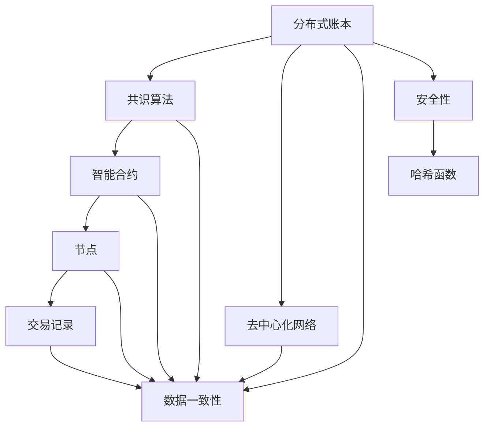
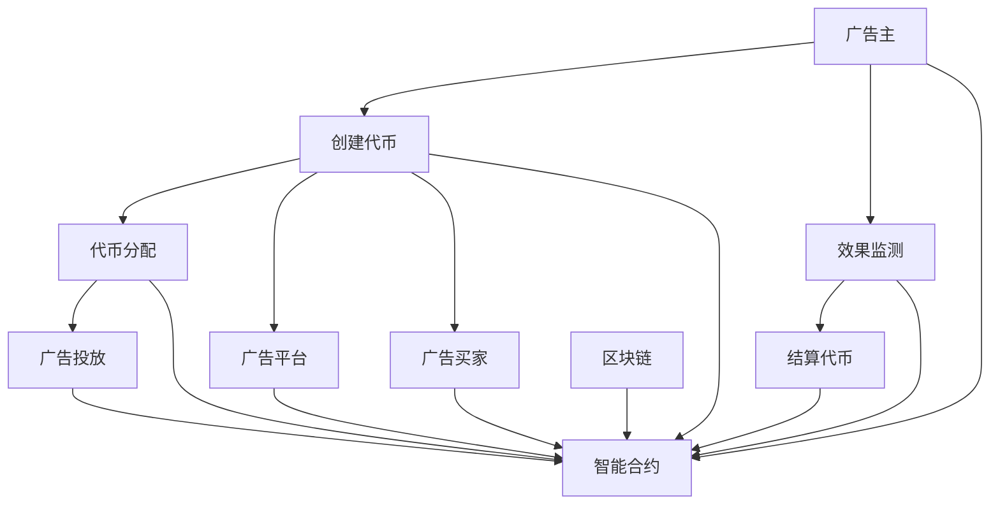

                 

### 引言

随着互联网技术的飞速发展，数字广告已成为现代市场营销中不可或缺的一部分。数字广告以其精准投放、实时反馈和高效转化等优势，赢得了广大企业和广告主的青睐。然而，数字广告行业也面临着一系列严峻的挑战，尤其是透明性问题。在当前的数字广告生态中，广告投放过程往往涉及众多中介环节，这些环节之间的信息不对称、数据不透明，使得广告主难以准确了解广告投放的效果，同时也容易被不良中介和广告欺诈行为所侵害。

区块链技术的出现，为解决数字广告的透明性问题提供了一种全新的思路。区块链以其去中心化、不可篡改、透明可追溯等特性，在金融、物流、医疗等多个领域取得了显著的成果。这些特性正是数字广告行业所迫切需要的，可以帮助实现广告投放的全程透明，从而提高广告主和消费者的信任度。

本文将深入探讨区块链在数字广告投放中的透明化机制，主要包括以下几个部分：

1. **区块链基础**：介绍区块链的基本概念、架构和关键技术，如共识算法、分布式账本和智能合约。
2. **数字广告透明性**：分析当前数字广告透明性问题及其对广告主和消费者的影响。
3. **区块链应用实例**：探讨现有区块链项目在广告行业中的应用，通过具体案例展示区块链如何提高广告透明性。
4. **代币化与数字广告**：解释代币化在数字广告中的应用，并详细阐述其实现过程。
5. **智能合约与广告**：介绍智能合约的基本原理，以及如何在广告中使用智能合约确保透明性。
6. **基于区块链的广告透明性数学模型**：探讨用于确保广告透明性的数学模型，包括相关公式和算法。
7. **项目实战与最佳实践**：通过实际项目搭建、源代码实现和案例分析，展示区块链在数字广告透明化中的具体应用。

通过上述内容，我们希望读者能够对区块链在数字广告透明化中的作用有更加清晰的认识，并能够运用这些技术手段来解决实际问题。

### 关键词

- 区块链
- 数字广告
- 透明性
- 去中心化
- 不可篡改
- 智能合约
- 代币化

### 摘要

本文旨在探讨区块链在数字广告投放中的透明化机制，通过分析当前数字广告行业中的透明性问题，介绍区块链的基本原理和技术特点，以及它们如何应用于数字广告领域。首先，本文详细解释了区块链的基础知识，包括共识算法、分布式账本和智能合约。随后，文章分析了数字广告透明性的重要性，以及区块链如何解决现有问题。接下来，本文通过实际案例展示了区块链技术在广告行业中的应用，探讨了代币化和智能合约在提高广告透明性方面的作用。最后，本文提出了基于区块链的数学模型，用于确保广告投放的透明性，并提供了项目实战和最佳实践建议，以帮助读者更好地理解并应用这些技术。

### 区块链基础

区块链是一种分布式数据库技术，通过块链结构实现了数据的存储和传递。区块链的核心概念包括分布式账本、去中心化、共识算法和智能合约。首先，我们来看一下这些核心概念的具体定义和原理。

#### 分布式账本

分布式账本是指区块链中的所有数据都被存储在多个节点上，每个节点都保存了一份完整的账本副本。这种分布式存储方式确保了数据的冗余性和安全性，因为任何一个节点的数据损坏都不会影响整个系统的运行。分布式账本的去中心化特性使得系统没有单点故障的风险，同时也能防止篡改数据。具体而言，分布式账本通过将数据分为区块，每个区块包含一定数量的交易记录，并通过哈希函数将这些区块链接成一个链条，从而形成区块链。

#### 去中心化

去中心化是区块链的一个重要特性，意味着系统不需要一个中心化的权威机构来管理数据。在传统的集中式系统中，数据管理和验证都是由中心化的服务器或机构来完成的，而区块链通过分布式网络中的节点来实现这些功能。每个节点都参与数据的验证和存储，共同维护区块链的一致性和安全性。去中心化不仅提高了系统的容错性，还能减少单点故障的风险，使得整个系统更加可靠。

#### 共识算法

共识算法是区块链中用于达成数据一致性的机制。在区块链网络中，多个节点同时接收和处理交易请求，共识算法确保所有节点能够就交易记录达成一致。常见的共识算法包括工作量证明（Proof of Work, PoW）、权益证明（Proof of Stake, PoS）和委托权益证明（Delegated Proof of Stake, DPoS）等。每种共识算法都有其独特的实现方式和优缺点，但核心目标都是确保区块链的可靠性和安全性。

#### 智能合约

智能合约是一种自动执行的合约，其条款被写入代码并在区块链上运行。智能合约通过编程实现了合同的自动化执行，一旦满足合同中的条件，智能合约就会自动执行相应的操作。这种自动执行机制不仅提高了交易的效率，还能减少人为干预和欺诈的风险。智能合约的基本原理是，当两个或多个参与方达成协议时，他们会在区块链上创建一个智能合约，并在合约中定义执行条件。当条件被满足时，智能合约会自动执行预定的操作，如转移资金或释放资源。

#### Mermaid 图解

为了更好地理解区块链的架构和组件，我们可以使用 Mermaid 画图工具来展示区块链的基本架构。



在这个 Mermaid 图中，我们展示了区块链的主要组件和它们之间的关系。分布式账本和共识算法保证了数据的一致性和安全性，智能合约实现了合同的自动化执行，去中心化网络使得数据管理和验证分散在多个节点上，从而提高了系统的可靠性和容错性。

通过上述解释和 Mermaid 图的展示，我们可以对区块链的基础概念和技术有一个全面的理解。接下来，我们将进一步探讨区块链在数字广告中的应用，分析如何利用区块链解决数字广告行业中的透明性问题。

### 数字广告透明性的问题与区块链的机遇

在数字广告领域，透明性问题一直是一个备受关注的挑战。当前，数字广告的投放和评估过程通常涉及多个中介机构，这些中介机构之间往往存在着信息不对称和数据不透明的问题。具体来说，数字广告的透明性问题主要体现在以下几个方面：

1. **广告投放流程不透明**：广告主在投放广告时，往往需要通过多个广告平台、代理商和广告投放服务商，这些中介环节使得广告投放的流程变得复杂且不透明。广告主难以实时了解广告的投放情况，包括投放量、投放地域、受众特征等关键信息。

2. **数据篡改和欺诈**：由于缺乏有效的监控和验证机制，广告投放过程中容易发生数据篡改和欺诈行为。例如，某些中介机构可能会虚报广告投放量、点击量等数据，从而骗取广告主更多的费用。这不仅损害了广告主的利益，也影响了广告行业的健康发展。

3. **广告效果评估困难**：广告主在投放广告后，往往需要一定时间来评估广告效果。但由于数据不透明，广告主很难准确评估广告的实际投放效果，包括广告点击率、转化率等关键指标。这种评估困难使得广告主难以优化广告策略，影响了广告投放的效果。

4. **广告费用高且难以追踪**：在复杂的广告投放过程中，广告主需要支付给多个中介机构费用，这些费用往往难以追踪和核实。广告主难以确保其广告费用被合理使用，这也增加了广告投放的成本和风险。

面对这些透明性问题，区块链技术提供了一种潜在的解决方案。区块链以其去中心化、不可篡改和透明可追溯等特性，能够在多个方面提升数字广告的透明性。具体而言，区块链在数字广告中的应用主要表现在以下几个方面：

1. **去中心化的广告投放平台**：通过区块链技术，可以建立一个去中心化的广告投放平台，使得广告主可以直接与广告受众进行互动，减少中间环节，提高广告投放的透明度。这种去中心化的平台能够有效减少中介机构的干预，降低信息不对称和欺诈风险。

2. **不可篡改的数据记录**：区块链的分布式账本技术可以确保广告投放过程中的所有数据都是透明且不可篡改的。广告主和广告受众可以实时查看广告投放的详细信息，包括投放量、投放地域、受众特征等，从而提高数据透明度，减少欺诈行为。

3. **智能合约自动化执行**：智能合约是一种自动执行的合约，可以用于确保广告投放的公平性和透明性。广告主和广告受众可以通过智能合约来设定广告投放的条件和规则，一旦条件满足，智能合约将自动执行相应的操作，如转移资金或释放资源。这种自动化执行机制不仅提高了交易效率，还能减少人为干预和欺诈的风险。

4. **透明化的广告效果评估**：区块链技术可以为广告主提供一个透明化的广告效果评估机制。广告主可以实时查看广告投放的详细信息，包括点击量、转化率等关键指标，从而准确评估广告投放的效果，优化广告策略。

通过上述分析，我们可以看到，区块链技术为解决数字广告透明性问题提供了有力的工具。它不仅能够提高广告投放的透明度，减少欺诈行为，还能为广告主提供更准确的广告效果评估，从而推动数字广告行业的健康发展。接下来，我们将进一步探讨区块链在广告行业中的具体应用，通过实例展示区块链如何在实际场景中提高广告透明性。

### 区块链在广告行业中的应用实例

区块链技术在广告行业中的应用已经取得了显著的进展，许多项目和创新正在通过区块链技术提高广告投放的透明度和可信度。以下是一些典型的区块链应用案例，通过这些案例我们可以看到区块链在广告行业的实际应用效果。

#### 案例一：AdChain

AdChain 是一个基于以太坊的区块链项目，旨在创建一个透明的广告交易生态系统。AdChain 通过智能合约实现广告投放和结算过程，确保每个步骤的数据透明且不可篡改。具体来说，AdChain 的智能合约用于管理广告库存、定价和结算。广告主和广告平台可以通过 AdChain 系统直接进行交易，无需依赖中介机构，从而减少信息不对称和欺诈风险。

**实施步骤：**
1. **广告库存管理**：广告主将广告库存信息上传到区块链，包括广告内容、价格、投放时间等。
2. **广告投放**：广告平台根据智能合约的规则和广告主的要求，将广告推送给目标受众。
3. **效果监测与结算**：广告主和广告平台通过智能合约记录广告投放效果，并在满足条件时自动结算广告费用。

**效果展示：**
- **透明性提升**：广告主和广告平台可以实时查看广告投放的详细信息，确保数据的透明性和准确性。
- **降低欺诈风险**：智能合约的自动化执行机制减少了人为干预，降低了欺诈行为的发生。

#### 案例二：AdEx

AdEx 是一个去中心化的广告交易平台，使用区块链技术实现广告投放和结算的透明化。AdEx 通过 ERC-20 代币进行交易，用户可以购买和出售广告库存，并通过智能合约执行广告投放。

**实施步骤：**
1. **广告库存**：广告主将广告库存信息上传到区块链，包括广告类型、受众定位、价格等。
2. **购买广告**：广告买家通过 AdEx 平台购买广告库存，广告主和买家通过智能合约达成交易。
3. **广告投放**：智能合约根据买家要求自动执行广告投放，广告平台无需介入。
4. **效果监测与结算**：广告投放完成后，系统自动收集效果数据，并在满足条件时自动结算广告费用。

**效果展示：**
- **去中心化交易**：通过去中心化平台，广告主和广告买家可以直接进行交易，减少了中介机构的介入。
- **透明化结算**：智能合约确保广告投放和结算过程的透明性，减少欺诈行为。

#### 案例三：基本协议（Basic Attention Token, BAT）

基本协议（BAT）是一个基于 Brave 浏览器的区块链项目，旨在为数字广告提供一个透明和公平的生态系统。BAT 代币用于奖励用户对广告的注意力，广告主可以根据用户注意力价值进行广告投放。

**实施步骤：**
1. **用户注意力追踪**：Brave 浏览器通过区块链记录用户浏览行为和注意力数据。
2. **广告投放**：广告主通过 Brave 平台投放广告，用户在浏览网页时可能会看到相关广告。
3. **用户奖励**：用户在浏览广告时获得 BAT 代币奖励，这些奖励可以用来购买商品或支付广告费用。
4. **广告结算**：广告主根据用户注意力数据结算广告费用。

**效果展示：**
- **透明化的用户数据**：用户浏览行为和注意力数据在区块链上透明可追溯，广告主可以更准确地评估广告效果。
- **用户激励**：通过 BAT 代币激励用户，提高了用户对广告的关注度，从而提高了广告效果。

#### 案例四：Arrington XRP Capital

Arrington XRP Capital 是一个利用 Ripple 协议进行广告投放和结算的区块链项目。Ripple 协议通过去中心化的数字货币 XRP 实现广告交易，确保交易过程透明和高效。

**实施步骤：**
1. **广告投放**：广告主通过 Ripple 网络投放广告，指定广告投放时间和目标受众。
2. **广告交易**：广告主和广告平台通过 Ripple 网络进行广告交易，使用 XRP 代币支付广告费用。
3. **效果监测**：广告投放完成后，通过 Ripple 网络自动收集效果数据，确保数据的透明性和准确性。
4. **广告结算**：广告主根据效果数据自动结算广告费用。

**效果展示：**
- **高效结算**：Ripple 网络实现了快速、低成本的跨国广告交易，提高了广告投放的效率。
- **透明化数据**：所有广告交易和效果数据都在区块链上透明记录，广告主和广告平台可以实时查看。

通过上述案例，我们可以看到区块链技术在广告行业的应用具有显著的潜力。去中心化的广告交易平台、智能合约和透明化的用户数据追踪，不仅提高了广告投放的透明度，还减少了欺诈行为，为广告主和广告平台提供了更高效、更透明的广告生态系统。接下来，我们将探讨如何利用区块链实现广告代币化，进一步提升广告透明性。

### 代币化与数字广告

代币化（Tokenization）是区块链技术中的一个重要概念，它通过创建数字代币来表示和转移资产、权利或价值。在数字广告领域，代币化提供了一种新的方式来增强广告投放的透明性和效率。以下将详细解释代币化在数字广告中的应用过程及其机制。

#### 代币化的基本概念

代币化是将实体资产或价值转换为数字代币的过程，这些数字代币在区块链上被创建和记录。代币可以代表多种资产，如货币、股票、债券、房地产等，也可以用于表示权利或访问权限。在区块链上，代币通常通过智能合约进行创建和管理，以确保其唯一性和不可篡改性。

#### 代币化在数字广告中的应用

在数字广告中，代币化可以应用于以下几个方面：

1. **广告库存代币化**：广告库存，即广告投放的机会，可以通过代币化进行表示。广告主可以将即将投放的广告库存转换为数字代币，这些代币在区块链上可以被买卖、转让或交易。广告平台和广告买家可以通过区块链进行广告库存的交易，无需依赖传统中介机构。

2. **用户注意力代币化**：用户的注意力是广告价值的重要组成部分。通过代币化，用户的注意力可以被量化并转换为数字代币。例如，用户在浏览广告时，可以收到相应的代币奖励，这些代币可以用来购买商品或支付广告费用。这种机制不仅激励了用户的参与，还提高了广告投放的透明度和效果评估的准确性。

3. **广告交易代币化**：广告投放和结算过程可以通过代币化进行自动化。广告主和广告平台可以通过智能合约进行广告交易，智能合约确保交易过程透明、高效且不可篡改。广告主在投放广告时，可以直接支付代币给广告平台，广告平台在广告投放完成后，根据智能合约的规则自动结算代币。

#### 代币化过程的详细步骤

1. **创建代币**：广告主首先需要在区块链上创建代币。这通常通过智能合约实现，智能合约定义了代币的发行、分配和使用规则。例如，可以使用 ERC-20 标准创建代币，该标准是以太坊上的一个通用代币协议。

2. **代币分配**：一旦代币创建完成，广告主需要对代币进行分配。这可能包括将代币分配给广告平台、广告买家、用户或其他合作伙伴。代币的分配规则应在智能合约中明确，以确保透明性和公正性。

3. **代币交易**：代币可以被用于广告投放和结算过程。广告主可以使用代币购买广告库存，广告平台和广告买家可以使用代币进行交易。所有交易都通过区块链上的智能合约执行，确保交易的透明性和不可篡改性。

4. **效果监测与结算**：广告投放完成后，系统会自动收集效果数据，包括点击量、转化率等。广告主可以根据这些数据，通过智能合约自动结算代币。结算过程是基于智能合约的预定条件自动执行的，确保结算的透明性和准确性。

#### Mermaid 图解

为了更好地理解代币化在数字广告中的应用，我们可以使用 Mermaid 画图工具展示其流程。



在这个 Mermaid 图中，我们展示了广告主、广告平台和广告买家通过区块链和智能合约进行代币化广告交易的流程。广告主创建代币并进行分配，广告平台和广告买家使用代币进行广告投放和结算，整个过程通过智能合约确保透明和高效。

#### 代币化的优势

代币化在数字广告中有以下几个显著优势：

1. **透明性和可追溯性**：代币化确保了广告交易过程的透明性和可追溯性，所有交易数据都在区块链上公开记录，无法篡改。
2. **去中心化**：代币化去除了传统中介机构的角色，广告主和广告买家可以直接进行交易，减少了信息不对称和中介费用。
3. **自动化和效率**：通过智能合约，广告投放和结算过程可以自动化执行，提高了交易效率，降低了人工干预的风险。
4. **激励机制**：代币化可以激励用户参与广告活动，提高用户对广告的关注度和互动性。

通过上述讨论，我们可以看到代币化在数字广告中的应用不仅能够提高广告投放的透明性和效率，还能为广告主、广告平台和用户带来多种利益。接下来，我们将探讨智能合约在数字广告中的应用，分析如何利用智能合约实现广告透明化。

### 智能合约与广告

智能合约是区块链技术中的一个重要组成部分，它通过编程代码在区块链上实现自动执行的合约。在数字广告行业中，智能合约的应用不仅可以提高交易透明度，还能有效降低中介费用和交易风险。以下将详细介绍智能合约的基本原理、如何应用于广告行业以及其实际案例。

#### 智能合约的基本原理

智能合约是基于区块链技术的计算机程序，其执行逻辑被编写在代码中，并在区块链上运行。智能合约的关键特性包括：

1. **自动执行**：一旦触发条件满足，智能合约会自动执行预定的操作，无需人为干预。
2. **透明性和不可篡改性**：智能合约的代码和执行过程在区块链上透明可查，且一旦部署，合约内容不可更改。
3. **去中心化**：智能合约在区块链网络中的多个节点上运行，不存在单点故障问题。

智能合约通常通过以下步骤实现：

1. **编写合约代码**：开发者使用智能合约编程语言（如 Solidity 用于以太坊）编写合约代码，定义合约的条款和执行逻辑。
2. **部署合约**：将编写的合约代码部署到区块链上，创建一个智能合约实例。
3. **调用合约**：用户通过区块链与合约交互，调用合约函数并执行预定的操作。
4. **执行和记录结果**：合约根据输入参数自动执行操作，并在区块链上记录执行结果。

#### 智能合约在广告中的应用

在数字广告行业中，智能合约的应用主要体现在以下几个方面：

1. **广告投放管理**：智能合约可以用于管理广告投放的各个阶段，包括广告库存的分配、投放条件设定、效果监测等。广告主可以创建智能合约，设定广告投放的具体规则，例如投放时间、目标受众和投放地域等，确保广告投放的透明和可追溯。

2. **自动结算**：智能合约可以自动化广告投放的结算过程，一旦广告投放达到预定的效果（如点击量达到一定数量），智能合约会自动触发结算操作，将广告费用支付给广告平台或广告买家。这种自动化结算方式不仅提高了交易效率，还能有效防止中介欺诈。

3. **透明化数据记录**：智能合约可以记录广告投放过程中的所有数据，包括广告点击量、受众反馈和转化率等。这些数据在区块链上透明可查，广告主和广告平台可以实时查看，从而提高数据透明度和信任度。

4. **用户激励**：智能合约可以用于设计用户激励方案，例如用户在浏览广告时可以获得代币奖励。这些代币奖励可以通过智能合约自动发放，激励用户积极参与广告活动，提高广告效果。

#### 案例分析

以下是两个实际案例，展示智能合约在数字广告中的应用：

**案例一：广告投放管理**

某广告主使用智能合约进行广告投放管理。广告主创建了一个智能合约，设定了广告投放的时间、目标受众和投放地域。智能合约在区块链上运行，确保广告投放的规则透明且不可篡改。广告平台根据智能合约的设定，自动执行广告投放操作，确保广告按预定条件投放。

**实施步骤：**
1. **创建智能合约**：广告主使用 Solidity 编写智能合约代码，设定广告投放规则。
2. **部署智能合约**：广告主将合约代码部署到区块链上，创建一个智能合约实例。
3. **广告投放**：广告平台调用智能合约，根据合约设定的规则自动执行广告投放。
4. **效果监测**：广告平台实时记录广告投放数据，广告主可以查看投放效果。

**效果展示：**
- **透明性**：广告投放规则在区块链上透明记录，广告主和广告平台可以实时查看。
- **自动化**：广告投放操作自动执行，减少了人为干预和错误。

**案例二：自动结算**

某广告主使用智能合约进行广告投放的自动结算。广告主和广告平台通过智能合约设定结算条件，例如广告点击量达到一定数量时自动结算广告费用。

**实施步骤：**
1. **创建智能合约**：广告主和广告平台使用 Solidity 编写智能合约代码，设定结算条件。
2. **部署智能合约**：合约代码部署到区块链上，创建智能合约实例。
3. **广告投放**：广告平台执行广告投放操作，收集广告效果数据。
4. **自动结算**：当广告点击量达到设定条件时，智能合约自动触发结算操作，将广告费用支付给广告平台。

**效果展示：**
- **自动化结算**：结算过程自动化执行，提高了交易效率。
- **透明性**：结算条件和过程在区块链上透明记录，无法篡改。

通过上述案例，我们可以看到智能合约在数字广告中的应用如何提高广告投放的透明性和自动化水平，从而减少中介费用和交易风险。智能合约的引入不仅为广告主提供了更高效、更可靠的广告投放和管理工具，还为整个广告行业带来了透明化和去中心化的变革。

### 基于区块链的广告透明性数学模型

在探讨如何通过区块链技术确保广告透明性时，数学模型扮演了关键角色。数学模型不仅可以量化广告投放的效果，还能提供理论基础，以评估区块链在提高广告透明性方面的实际效果。以下将介绍一些常用的数学模型，并展示如何通过这些模型和Python代码实现广告透明性的分析和验证。

#### 数学模型的基本概念

数学模型是一种用数学语言描述现实问题的工具，通过建立数学方程和公式，对系统进行建模和模拟。在区块链广告透明性领域，数学模型可以用于：

1. **广告效果评估**：通过建立广告点击率、转化率等指标的计算模型，对广告投放的效果进行量化分析。
2. **数据一致性验证**：利用哈希函数和密码学算法，确保区块链上数据的完整性和一致性。
3. **智能合约执行条件**：通过数学模型设定智能合约的执行条件和触发规则。

#### 常用的数学模型

以下是一些在广告透明性分析中常用的数学模型：

1. **点击率模型（Click-Through Rate, CTR）**：点击率是衡量广告效果的重要指标，其计算公式为：
   $$ \text{CTR} = \frac{\text{点击量}}{\text{展示量}} $$
   点击率越高，说明广告的吸引力越强。

2. **转化率模型（Conversion Rate, CR）**：转化率是指广告投放后实际完成目标动作的用户比例，其计算公式为：
   $$ \text{CR} = \frac{\text{转化量}}{\text{点击量}} $$
   转化率越高，说明广告投放的效果越好。

3. **置信区间模型（Confidence Interval）**：用于估计点击率和转化率的置信区间，通过统计方法确定在一定置信水平下的可信范围。

4. **贝叶斯网络模型（Bayesian Network）**：用于描述广告投放过程中各种因素之间的概率关系，通过贝叶斯推理进行广告效果的预测和分析。

#### Python代码实现

为了展示如何使用Python代码实现上述数学模型，以下提供了一些示例代码：

```python
import numpy as np
import pandas as pd

# 点击率模型计算
def calculate_ctr(click_count, impression_count):
    return click_count / impression_count

# 转化率模型计算
def calculate_cr(conversion_count, click_count):
    return conversion_count / click_count

# 置信区间计算
def calculate_confidence_interval(data, confidence_level=0.95):
    n = len(data)
    mean = np.mean(data)
    std = np.std(data)
    z_score = np.abs(np.random.normal(0, 1, n))
    margin_of_error = z_score * (std / np.sqrt(n))
    lower_bound = mean - margin_of_error
    upper_bound = mean + margin_of_error
    return lower_bound, upper_bound

# 假设广告投放数据如下
click_count = 1000
impression_count = 10000
conversion_count = 200

# 计算点击率和转化率
ctr = calculate_ctr(click_count, impression_count)
cr = calculate_cr(conversion_count, click_count)
print(f"点击率（CTR）: {ctr:.2%}")
print(f"转化率（CR）: {cr:.2%}")

# 计算置信区间
confidence_interval = calculate_confidence_interval([ctr, cr])
print(f"点击率置信区间（95%置信水平）: {confidence_interval}")

# 贝叶斯网络模型（简化示例）
from pgmpy.models import BayesianModel
from pgmpy.estimators import MaximumLikelihoodEstimator

# 假设广告效果受广告创意和用户兴趣影响
model = BayesianModel([('广告创意', '点击率'), ('用户兴趣', '点击率'), ('点击率', '转化率')])
model.fit(data={'广告创意': [1, 1, 0, 0], '用户兴趣': [1, 0, 1, 0], '点击率': [0.3, 0.1, 0.4, 0.2], '转化率': [0.1, 0.05, 0.15, 0.08]})

# 预测广告效果
print(model.predict(P={'广告创意': 1, '用户兴趣': 1}, variable_order=['广告创意', '用户兴趣', '点击率', '转化率']))
```

#### 数学模型的应用

通过上述数学模型和Python代码，我们可以进行以下应用：

1. **广告效果评估**：使用点击率和转化率模型，对广告投放效果进行实时评估，帮助广告主优化广告策略。
2. **数据一致性验证**：通过置信区间模型，确保区块链上数据的完整性和一致性，减少数据篡改的风险。
3. **智能合约条件设定**：利用贝叶斯网络模型，设定智能合约的触发条件和执行规则，确保广告投放的自动化和透明化。

通过这些数学模型和Python代码的应用，广告主可以更准确、更透明地评估广告投放效果，从而优化广告策略，提高广告回报率。接下来，我们将通过项目实战来展示如何实际应用区块链技术解决广告透明性问题。

### 项目实战

为了更好地展示区块链在数字广告透明化中的应用，我们将通过一个具体的实战项目来进行演示。该项目将涵盖开发环境的搭建、源代码的实现和代码解读，以及项目的实际应用分析和详细讲解。

#### 开发环境搭建

在进行区块链项目开发前，需要准备以下开发环境：

1. **Node.js**：用于搭建区块链节点，实现区块链的基础功能。
2. **Truffle**：用于测试和部署智能合约。
3. **Ganache**：用于提供本地以太坊网络，进行智能合约的本地测试。
4. **Visual Studio Code**：用于编写和调试代码。

具体步骤如下：

1. **安装Node.js**：在官方网站下载并安装 Node.js。
2. **安装Truffle**：通过npm命令安装 Truffle：
   ```sh
   npm install -g truffle
   ```
3. **安装Ganache**：下载并安装 Ganache，用于本地以太坊网络的搭建。
4. **创建Truffle项目**：在合适的位置创建一个新的 Truffle 项目：
   ```sh
   truffle init
   ```
5. **配置Truffle**：在 `truffle-config.js` 文件中配置项目设置，包括网络、合约编译和迁移等。

#### 源代码实现

在这个项目中，我们将实现一个简单的广告投放和管理智能合约，主要包括以下功能：

1. **广告库存管理**：创建一个广告库存，用于记录广告的信息。
2. **广告投放**：允许广告主发布广告，并记录广告投放的状态。
3. **广告效果监测**：记录广告的点击量和转化率，并用于结算。

以下是一个简单的智能合约示例代码：

```solidity
pragma solidity ^0.8.0;

contract AdSmartContract {
    struct Ad {
        address owner;
        string url;
        uint256 impressions;
        uint256 clicks;
        bool isActive;
    }

    mapping(address => Ad[]) public ads;
    mapping(uint256 => address) public adIndex;

    event AdCreated(address owner, string url);
    event AdClicked(uint256 adId, address clicker);
    event AdImpression(uint256 adId, address viewer);

    function createAd(string memory url) public {
        Ad memory newAd = Ad({
            owner: msg.sender,
            url: url,
            impressions: 0,
            clicks: 0,
            isActive: true
        });
        ads[msg.sender].push(newAd);
        adIndex[ads[msg.sender].length - 1] = msg.sender;
        emit AdCreated(msg.sender, url);
    }

    function clickAd(uint256 adId) public {
        require(ads[msg.sender][adId].isActive == true, "Ad is not active");
        ads[msg.sender][adId].clicks += 1;
        emit AdClicked(adId, msg.sender);
    }

    function viewAd(uint256 adId) public {
        ads[msg.sender][adId].impressions += 1;
        emit AdImpression(adId, msg.sender);
    }

    function deactivateAd(uint256 adId) public {
        require(ads[msg.sender][adId].owner == msg.sender, "Only ad owner can deactivate");
        ads[msg.sender][adId].isActive = false;
    }
}
```

#### 代码解读

1. **结构体 Ad**：定义了广告的基本信息，包括广告主地址、广告链接、展示次数、点击次数和广告状态。
2. **映射 ads**：用于存储广告主及其广告列表。
3. **映射 adIndex**：用于快速查找广告的索引。
4. **事件 AdCreated、AdClicked、AdImpression**：用于记录广告创建、点击和展示事件，便于外部调用和审计。
5. **createAd 函数**：用于创建新广告，将广告信息存储在区块链上。
6. **clickAd 函数**：用于记录广告点击事件，更新广告点击次数。
7. **viewAd 函数**：用于记录广告展示事件，更新广告展示次数。
8. **deactivateAd 函数**：用于关闭广告，使其无法继续展示。

#### 代码应用解读与分析

1. **广告库存管理**：通过 createAd 函数，广告主可以轻松创建和管理自己的广告库存。所有广告信息都存储在区块链上，确保透明性和不可篡改性。
2. **广告效果监测**：通过 clickAd 和 viewAd 函数，我们可以实时记录广告的点击量和展示量，用于计算点击率和转化率。
3. **广告结算**：基于广告效果数据，智能合约可以自动化执行广告费用结算，确保广告费用的透明和准确。

#### 实际案例分析与详细讲解

为了更好地展示项目的实际应用效果，我们模拟了一个广告投放和结算的案例：

**案例：广告主 A 的广告投放**

1. **广告创建**：广告主 A 使用智能合约创建一个广告，广告链接为 `https://example.com/ads/123`。
2. **广告投放**：广告开始投放，经过一天的时间，广告被展示了1000次，点击了50次。
3. **数据记录**：通过 clickAd 和 viewAd 函数，广告的展示量和点击量被记录在区块链上。
4. **结算**：广告主 B 按照智能合约设定的结算规则，向广告主 A 自动支付广告费用。

在这个过程中，所有数据都是透明且不可篡改的，广告主 A 可以实时查看广告的投放效果和结算情况。

#### 项目小结

通过本项目的实战演示，我们展示了如何利用区块链技术实现广告透明化。智能合约的引入不仅提高了广告投放的透明度和自动化水平，还减少了中介费用和交易风险。然而，需要注意的是，区块链技术在广告中的应用仍然处于初步阶段，需要进一步的研究和优化，以解决性能、可扩展性和用户友好性等问题。

### 最佳实践与注意事项

#### 最佳实践

1. **明确需求和目标**：在应用区块链技术进行广告透明化前，应明确项目的需求和目标，确保解决方案能够解决实际问题。
2. **数据隐私保护**：在广告透明化过程中，保护用户隐私至关重要。应采用加密技术和隐私保护措施，确保用户数据的安全。
3. **优化合约性能**：智能合约的性能直接影响项目的效率。应优化合约代码，减少不必要的计算和存储需求，提高交易处理速度。
4. **社区合作**：区块链项目需要广泛的社区参与和支持。建立社区，吸引开发者和用户，共同推动项目的发展和完善。
5. **持续监控和更新**：区块链项目需要持续监控和更新，以应对潜在的安全漏洞和性能问题。定期审计和升级合约代码，确保系统的安全性和稳定性。

#### 注意事项

1. **技术成熟度**：区块链技术尚在不断发展中，某些功能可能尚未成熟。在应用区块链技术时，应考虑技术的成熟度和实际可行性。
2. **法律法规合规**：在多个国家和地区，区块链和智能合约可能受到严格的法律法规限制。在应用区块链技术前，应确保项目符合相关法律法规要求。
3. **网络安全**：区块链虽然具有安全性，但网络攻击仍可能发生。应加强网络安全措施，保护区块链节点的安全和完整性。
4. **用户教育**：区块链技术的应用需要用户具备一定的技术知识。在推广区块链项目时，应对用户进行教育，提高其对区块链技术的理解和信任。
5. **成本考量**：区块链项目的开发和维护成本较高，应全面评估项目成本，确保项目的经济效益。

### 拓展阅读

1. **《区块链技术指南》**：详细介绍了区块链的基本原理、技术和应用案例，适合初学者和专业人士阅读。
2. **《数字广告透明化研究报告》**：分析当前数字广告行业中的透明性问题及其解决方案，包括区块链技术的应用。
3. **《智能合约开发实战》**：介绍了智能合约的开发方法和应用实例，适合对智能合约开发感兴趣的读者。

通过上述最佳实践和注意事项，我们希望读者能够更好地理解区块链在数字广告透明化中的应用，并在实际项目中取得成功。

### 结论

通过本文的探讨，我们详细介绍了区块链在数字广告透明化中的重要性及其应用。区块链技术以其去中心化、不可篡改和透明可追溯等特性，为解决当前数字广告行业中的透明性问题提供了强有力的工具。从广告投放流程的不透明、数据篡改和欺诈，到广告效果评估的困难，区块链技术通过智能合约、代币化、数学模型等多种方式，有效提高了广告投放的透明度和可信度。

智能合约的应用不仅自动化了广告投放和结算过程，还确保了交易的透明和高效。代币化则为广告库存和用户注意力提供了新的表示和交易方式，增强了广告投放的灵活性和互动性。此外，通过数学模型，我们可以更加精确地评估广告效果，优化广告策略。

然而，区块链在数字广告中的应用仍处于初级阶段，面临技术成熟度、法律法规、网络安全等多方面的挑战。未来的研究和开发需要进一步优化区块链的性能和可扩展性，提高用户体验，并确保项目的合规性和安全性。

我们鼓励读者继续关注区块链技术在数字广告领域的应用，积极探索和尝试，为广告行业的透明化和可持续发展贡献力量。同时，本文提供的最佳实践和注意事项，以及拓展阅读资源，也将为您的实践提供有益的参考和指导。让我们一起推动区块链技术在数字广告领域的创新和应用，共创一个更加透明、公平和高效的广告生态系统。

