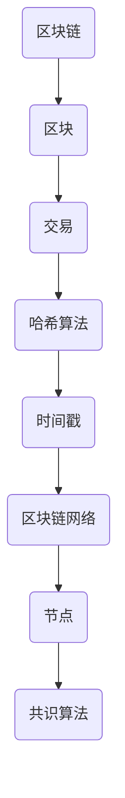
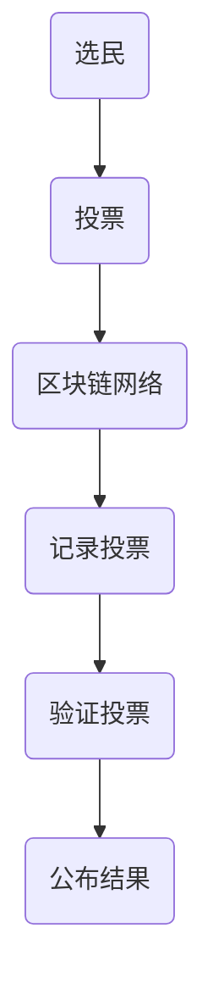
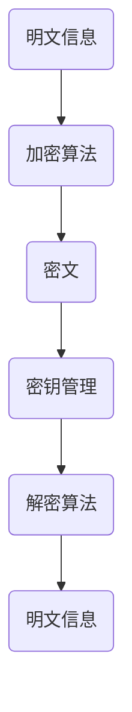
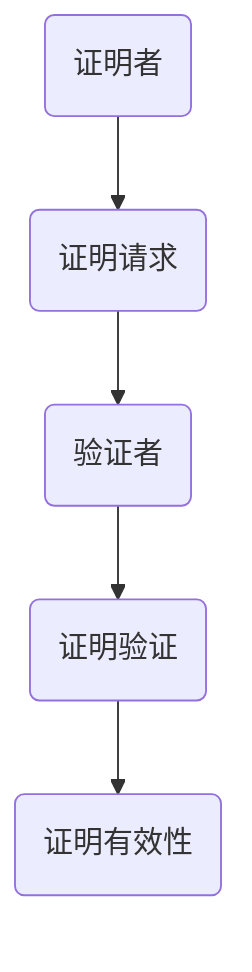
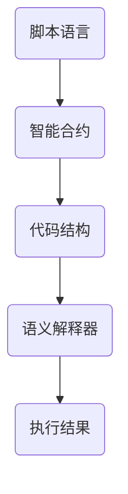
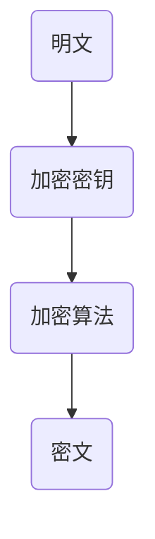
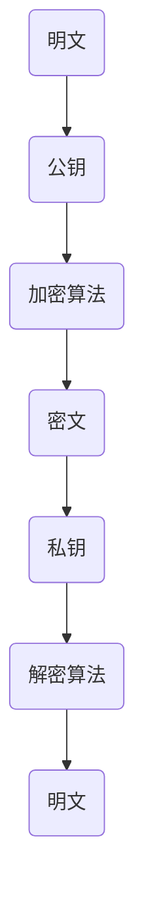
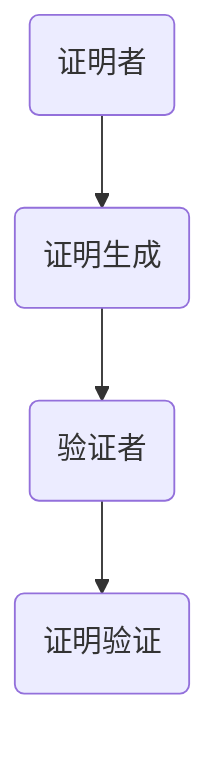

                 

### 第1章 引言

#### 1.1 区块链与数字投票概述

随着科技的发展，区块链技术逐渐成为人们关注的焦点。区块链是一种去中心化的分布式数据库，具有不可篡改、透明性和匿名性等特点。这些特性使得区块链在许多领域具有广泛的应用前景，其中之一便是数字投票。

数字投票是一种通过电子方式进行的投票活动，它可以大大提高投票的效率和准确性。然而，传统的数字投票系统往往面临着安全问题，如数据篡改、选举欺诈等。区块链技术的引入，为解决这些问题提供了一种新的思路。

区块链在数字投票中的应用，主要是利用其去中心化和不可篡改的特性，确保投票过程和结果的公正性。具体来说，区块链可以记录每一个投票人的投票信息，并确保这些信息在整个投票过程中不会被篡改。此外，区块链的透明性也使得投票结果可以随时被验证，从而提高了选举的透明度。

本书旨在深入探讨区块链在数字投票中的应用，通过详细讲解区块链和数字投票的基本概念、核心算法原理、数学模型以及项目实战，帮助读者理解如何利用区块链技术确保选举的公正性和透明性。

#### 1.2 本书目标与结构

本书的目标是让读者全面了解区块链在数字投票中的应用，掌握相关技术原理和实践方法。具体目标如下：

1. **理解区块链和数字投票的基本概念**：通过介绍区块链和数字投票的基本原理，帮助读者建立基本的概念体系。
2. **掌握区块链在数字投票中的应用优势**：通过分析区块链的特性，探讨其在数字投票中的优势，以及如何利用这些优势确保选举的公正性和透明性。
3. **理解核心算法原理**：通过详细讲解加密技术、零知识证明和脚本语言等核心算法原理，帮助读者理解区块链在数字投票中的应用机制。
4. **实践项目搭建**：通过实际项目实战，帮助读者掌握如何使用区块链技术搭建数字投票系统，并解决实际问题。
5. **掌握最佳实践**：通过总结最佳实践，为读者提供实用的开发建议和技巧。

本书的结构如下：

- **第1章 引言**：介绍区块链和数字投票的基本概念，以及本书的目标和结构。
- **第2章 区块链基础**：讲解区块链的基本原理、核心技术和与数字投票的关系。
- **第3章 数字投票基础**：介绍数字投票的基本概念、现状与挑战，以及区块链在数字投票中的应用优势。
- **第4章 核心算法原理**：详细讲解加密技术、零知识证明和脚本语言等核心算法原理。
- **第5章 数学模型**：介绍用于确保选举公正透明的数学模型，包括加密学模型和零知识证明模型。
- **第6章 项目实战**：通过实际项目实战，讲解如何搭建数字投票系统，并解决相关问题。
- **第7章 总结与展望**：对全书内容进行总结，并对未来的发展方向进行展望。

通过以上章节的逐步讲解，本书旨在帮助读者全面掌握区块链在数字投票中的应用，为推动选举公正透明做出贡献。
#### 关键词

- 区块链
- 数字投票
- 不可篡改性
- 透明性
- 去中心化
- 加密技术
- 零知识证明
- 脚本语言
- 数学模型
- 安全性
- 选举公正性

#### 摘要

本文旨在探讨区块链在数字投票中的应用，通过详细讲解区块链的基本原理、核心算法和数学模型，帮助读者理解如何利用区块链技术确保选举的公正性和透明性。文章首先介绍了区块链和数字投票的基本概念，分析了区块链在数字投票中的优势。接着，详细阐述了加密技术、零知识证明和脚本语言等核心算法原理，并介绍了相应的数学模型。随后，通过实际项目实战，讲解了如何搭建数字投票系统，并分析了可能的安全威胁和解决方案。最后，对全文内容进行了总结，并对未来的发展方向进行了展望。
----------------------------------------------------------------

## 第2章 区块链基础

区块链是一种分布式数据库技术，它通过去中心化的方式，确保数据的安全性和一致性。在本章节中，我们将详细探讨区块链的基本原理、核心技术和与数字投票的关系。

### 2.1 区块链的基本概念

区块链是一种由一系列按时间顺序排列的、不可篡改的数据块（Block）所构成的链式数据结构。每个数据块都包含一定数量的交易信息，并通过加密算法与时间戳等技术手段，确保数据的安全性和完整性。

区块链的基本概念包括：

- **区块（Block）**：区块是区块链的基本单位，包含一定数量的交易信息，以及指向前一个区块的哈希值。
- **链（Chain）**：区块链是由一系列按时间顺序排列的区块所构成的链式数据结构。
- **节点（Node）**：节点是指运行区块链软件的计算机，它们负责验证交易信息、创建区块和传播区块信息。
- **共识算法（Consensus Algorithm）**：共识算法是一种用于确保区块链网络中的所有节点达成共识的算法，如工作量证明（PoW）、权益证明（PoS）等。

### 2.2 区块链的核心技术

区块链的核心技术包括哈希算法、拓扑结构、共识算法等，这些技术共同确保了区块链的不可篡改性和一致性。

#### 2.2.1 哈希算法

哈希算法是一种将任意长度的输入数据转换为固定长度的输出数据的算法。在区块链中，哈希算法被广泛应用于数据验证和链式结构构建。

- **MD5**：MD5是一种广泛使用的哈希算法，可以将输入数据转换为128位的输出值。
- **SHA-256**：SHA-256是一种更安全的哈希算法，可以将输入数据转换为256位的输出值。

#### 2.2.2 拓扑结构

区块链的拓扑结构是指区块链中各个区块之间的连接关系。在区块链中，每个区块都包含一个指向前一个区块的哈希值，从而形成了一种链式结构。

#### 2.2.3 共识算法

共识算法是区块链网络中的所有节点达成共识的机制。不同类型的区块链采用不同的共识算法，以下是一些常见的共识算法：

- **工作量证明（PoW）**：工作量证明是最早被采用的共识算法，节点通过解决复杂的数学难题来获得记账权。
- **权益证明（PoS）**：权益证明是一种更节能、更安全的共识算法，节点根据持有的代币数量和持币时间来获得记账权。
- **委托权益证明（DPoS）**：委托权益证明是一种改进的权益证明算法，节点通过竞选获得记账权。

#### 2.2.4 Mermaid流程图：区块链的基本架构



### 2.3 区块链与数字投票的关系

区块链在数字投票中的应用，主要是利用其去中心化、不可篡改和透明性的特点，确保投票过程和结果的公正性。

#### 2.3.1 去中心化

区块链的去中心化特性，使得投票过程不再依赖于中心化的机构，从而避免了人为干预和篡改风险。每个参与者都可以参与到投票过程中，确保投票的公正性。

#### 2.3.2 不可篡改性

区块链的不可篡改性，保证了投票记录的不可篡改。一旦投票信息被记录到区块链上，就难以被篡改或删除，从而保证了选举的公正性和透明性。

#### 2.3.3 透明性

区块链的透明性，使得投票过程和结果可以被所有人验证。任何人都可以查看区块链上的投票记录，从而提高了选举的透明度。

#### 2.3.4 Mermaid流程图：区块链在数字投票中的应用



通过以上对区块链基础概念的介绍，我们可以看到，区块链在数字投票中的应用具有巨大的潜力。接下来，我们将进一步探讨数字投票的基本概念、现状与挑战，以及区块链在数字投票中的应用优势。

## 第3章 数字投票基础

数字投票是一种通过电子方式进行的投票活动，它利用计算机技术和互联网平台，实现了投票的自动化和高效化。数字投票的出现，极大地提高了投票的效率和准确性，同时也带来了一些新的挑战。

### 3.1 数字投票的概念

数字投票是指利用计算机技术和互联网平台，通过电子方式进行投票的活动。与传统的纸质投票相比，数字投票具有以下特点：

- **自动化**：数字投票可以通过计算机程序自动进行，从而大大提高了投票的效率和准确性。
- **可追踪性**：数字投票可以记录每一个选民的投票信息，从而提高了投票的透明度。
- **可验证性**：数字投票的结果可以随时被验证，从而保证了选举的公正性和透明性。

### 3.2 数字投票的现状与挑战

随着数字技术的发展，数字投票已经得到了广泛的应用。许多国家和地区已经开始使用数字投票系统进行选举，如美国、法国、英国等。然而，数字投票在应用过程中也面临着一些挑战：

- **安全性**：数字投票系统面临着网络攻击、数据篡改等安全威胁，如DDoS攻击、恶意软件等。
- **隐私保护**：数字投票需要在保护选民隐私的前提下进行，以避免选民的信息被泄露。
- **可信性**：数字投票系统需要确保投票结果的真实性和可靠性，以避免选举舞弊和欺诈行为。

### 3.3 区块链在数字投票中的应用优势

区块链技术的引入，为解决数字投票中的这些挑战提供了一种新的思路。区块链在数字投票中的应用具有以下优势：

#### 3.3.1 去中心化

区块链的去中心化特性，使得数字投票不再依赖于中心化的机构，从而避免了人为干预和篡改风险。每个参与者都可以参与到投票过程中，确保投票的公正性。

#### 3.3.2 不可篡改性

区块链的不可篡改性，保证了投票记录的不可篡改。一旦投票信息被记录到区块链上，就难以被篡改或删除，从而保证了选举的公正性和透明性。

#### 3.3.3 透明性

区块链的透明性，使得投票过程和结果可以被所有人验证。任何人都可以查看区块链上的投票记录，从而提高了选举的透明度。

#### 3.3.4 安全性

区块链的安全性，可以有效地防止网络攻击和数据篡改。区块链的加密技术和共识算法，确保了数据的安全性和完整性。

#### 3.3.5 隐私保护

区块链的隐私保护机制，可以保护选民的隐私。通过使用加密技术和零知识证明等技术，可以确保选民的投票信息不被泄露。

#### 3.3.6 可验证性

区块链的可验证性，使得投票结果可以随时被验证。通过区块链的分布式存储和加密技术，可以确保投票结果的真实性和可靠性。

#### 3.3.7 Mermaid流程图：区块链在数字投票中的应用


通过以上对数字投票基础概念的介绍，我们可以看到，数字投票在应用过程中面临着一些挑战。而区块链技术的引入，为解决这些问题提供了一种新的思路。接下来，我们将详细探讨区块链在数字投票中的应用，包括核心算法原理、数学模型以及项目实战。

## 第4章 核心算法原理

区块链在数字投票中的应用，依赖于一系列核心算法原理，如加密技术、零知识证明和脚本语言等。这些算法原理不仅确保了区块链的安全性，还为数字投票提供了强有力的技术支持。

### 4.1 加密技术

加密技术是区块链安全性的基石，它通过将明文信息转换为密文，确保数据在传输和存储过程中的安全性。在区块链中，常用的加密技术包括哈希算法和加密算法。

#### 4.1.1 哈希算法

哈希算法是一种将任意长度的输入数据转换为固定长度输出值的算法。在区块链中，常用的哈希算法包括MD5和SHA-256。

- **MD5**：MD5是一种广泛使用的哈希算法，它可以将输入数据转换为128位的输出值。然而，MD5存在一定的安全漏洞，已被逐渐取代。
- **SHA-256**：SHA-256是一种更安全的哈希算法，它可以将输入数据转换为256位的输出值。SHA-256具有抗冲突性强、计算速度快等特点，被广泛应用于区块链领域。

#### 4.1.2 加密算法

加密算法是一种将明文信息转换为密文的算法，它通过密钥来控制加密和解密过程。在区块链中，常用的加密算法包括对称加密和非对称加密。

- **对称加密**：对称加密是一种加密和解密使用相同密钥的加密算法。常见的对称加密算法有DES、AES等。对称加密算法的优点是计算速度快，但缺点是密钥管理复杂。
- **非对称加密**：非对称加密是一种加密和解密使用不同密钥的加密算法。常见的非对称加密算法有RSA、ECC等。非对称加密算法的优点是密钥管理简单，但缺点是计算速度相对较慢。

#### 4.1.3 Mermaid流程图：加密技术在区块链中的应用



### 4.2 零知识证明

零知识证明（Zero-Knowledge Proof）是一种密码学协议，它允许一方（证明者）向另一方（验证者）证明某个陈述是正确的，而无需透露任何与陈述相关的信息。在区块链中，零知识证明被广泛应用于隐私保护和数据验证等领域。

#### 4.2.1 零知识证明的原理

零知识证明的基本原理如下：

1. **证明提出**：证明者向验证者提出一个证明请求。
2. **证明验证**：验证者接收证明请求，并对其进行验证。
3. **证明有效性**：验证者确认证明是有效的，即证明了陈述的正确性。

#### 4.2.2 零知识证明的应用

在区块链中，零知识证明的应用主要包括：

- **隐私保护**：通过零知识证明，可以确保选民的隐私不受侵犯。例如，选民可以在不透露实际投票信息的情况下，证明自己已投票。
- **数据验证**：通过零知识证明，可以验证数据的真实性。例如，可以验证某个交易是否真实发生。

#### 4.2.3 Mermaid流程图：零知识证明的原理



### 4.3 脚本语言

脚本语言是一种用于编写智能合约的编程语言，它在区块链中起着重要作用。智能合约是一种自动执行、控制或记录法律契约条款和条件的计算机程序。

#### 4.3.1 脚本语言的选择

在区块链中，常用的脚本语言包括Solidity、Vyper等。

- **Solidity**：Solidity是最常用的智能合约编程语言，它是一种面向对象的语言，具有丰富的功能。
- **Vyper**：Vyper是一种更安全的智能合约编程语言，它简化了代码结构，降低了智能合约的安全风险。

#### 4.3.2 脚本语言的原理

脚本语言的原理主要包括：

- **语法规则**：脚本语言的语法规则用于定义智能合约的代码结构。
- **语义解释**：脚本语言的语义解释器用于执行智能合约的代码。

#### 4.3.3 Mermaid流程图：脚本语言在区块链中的应用



通过以上对核心算法原理的介绍，我们可以看到，加密技术、零知识证明和脚本语言等算法原理，为区块链在数字投票中的应用提供了强有力的技术支持。接下来，我们将进一步探讨区块链在数字投票中的应用，包括数学模型和项目实战。

## 第5章 数学模型

在区块链中，数学模型扮演着至关重要的角色，尤其是在确保选举公正性和透明性方面。数学模型不仅用于加密和解密数据，还用于验证交易和确保区块链的一致性。以下将介绍两种关键的数学模型：加密学模型和零知识证明模型。

### 5.1 加密学模型

加密学模型是区块链安全性的基础，它利用数学方法来保护数据的隐私和完整性。以下是一些关键的加密学模型：

#### 5.1.1 对称加密模型

对称加密模型是一种加密和解密使用相同密钥的加密方式。它的工作原理如下：

- **密钥生成**：首先，系统生成一对密钥，即加密密钥和解密密钥。
- **加密过程**：使用加密密钥将明文信息加密成密文。
- **解密过程**：使用解密密钥将密文解密回明文信息。

对称加密模型的一个典型例子是AES（高级加密标准）。以下是AES加密过程的简略描述：



#### 5.1.2 非对称加密模型

非对称加密模型是一种加密和解密使用不同密钥的加密方式。它的工作原理如下：

- **密钥生成**：系统生成一对密钥，即公钥和私钥。
- **加密过程**：使用公钥将明文信息加密成密文。
- **解密过程**：使用私钥将密文解密回明文信息。

非对称加密模型的一个典型例子是RSA。以下是RSA加密过程的简略描述：



#### 5.1.3 加密学模型的应用

在区块链中，加密学模型被广泛应用于：

- **数据加密**：确保区块链上的交易信息在传输和存储过程中不被窃取或篡改。
- **数字签名**：确保交易的发送者身份的真实性，同时保证交易信息一旦发出，就无法被篡改。

### 5.2 零知识证明模型

零知识证明模型是区块链中确保隐私保护的关键技术。它允许证明者向验证者证明某个陈述是正确的，而无需透露任何与陈述相关的信息。以下是一个简化的零知识证明模型：

#### 5.2.1 零知识证明的基本步骤

- **证明提出**：证明者向验证者提出一个证明请求。
- **证明验证**：验证者接收证明请求，并对其进行验证。
- **证明有效性**：验证者确认证明是有效的，即证明了陈述的正确性。

#### 5.2.2 零知识证明的应用

在区块链中，零知识证明模型的应用包括：

- **隐私保护**：确保选民的投票信息不被泄露。
- **数据验证**：确保交易信息的真实性。

#### 5.2.3 零知识证明模型的工作原理

零知识证明模型的工作原理涉及以下步骤：

1. **证明生成**：证明者生成一个证明，证明某个陈述是正确的。
2. **证明验证**：验证者接收证明，并验证证明的有效性。
3. **交互验证**：在某些情况下，验证者可能需要与证明者进行多次交互，以确保证明的有效性。

以下是零知识证明模型的一个简略描述：



#### 5.2.4 ZK-SNARKs和ZK-SMPC

- **ZK-SNARKs（零知识简洁非交互性知识证明）**：是一种零知识证明模型，它允许验证者验证证明的有效性，而无需与证明者进行交互。
- **ZK-SMPc（零知识多方计算）**：是一种零知识证明模型，它允许多个验证者协作验证证明的有效性。

### 5.3 数学公式和示例

为了更好地理解上述数学模型，我们将使用LaTeX格式展示一些关键的数学公式。

#### 5.3.1 对称加密模型

$$
c = E_k(m)
$$

$$
m = D_k(c)
$$

其中，$c$ 是密文，$m$ 是明文，$k$ 是密钥，$E_k$ 和 $D_k$ 分别是加密和解密算法。

#### 5.3.2 非对称加密模型

$$
c = E_p(m)
$$

$$
m = D_s(c)
$$

其中，$c$ 是密文，$m$ 是明文，$p$ 是公钥，$s$ 是私钥，$E_p$ 和 $D_s$ 分别是加密和解密算法。

#### 5.3.3 零知识证明模型

$$
\text{Prover} \xleftarrow{\text{Proof}} \text{Verifier}
$$

其中，$\text{Prover}$ 是证明者，$\text{Verifier}$ 是验证者，$\text{Proof}$ 是证明。

通过以上对数学模型的介绍，我们可以看到，加密学模型和零知识证明模型在确保区块链的安全性和隐私保护方面发挥着关键作用。接下来，我们将通过实际项目实战，进一步展示如何利用区块链技术实现数字投票系统。

## 第6章 项目实战

在本章节中，我们将通过实际项目实战，详细讲解如何搭建一个数字投票系统，并使用区块链技术确保选举的公正性和透明性。我们将从开发环境的搭建开始，逐步讲解代码实现和代码解读。

### 6.1 开发环境搭建

搭建数字投票系统前，需要准备以下开发环境：

1. **操作系统**：推荐使用Linux或macOS，因为它们更稳定，且更适合开发区块链应用。
2. **编程语言**：选择一种适合编写智能合约的编程语言，如Solidity。
3. **区块链平台**：选择一个适合开发数字投票系统的区块链平台，如Ethereum。
4. **开发工具**：安装Ethereum开发工具，如Truffle、Ganache等。

以下是一个基本的开发环境搭建步骤：

#### 步骤1：安装Node.js

Node.js是一个用于服务器端的JavaScript运行环境，它可以帮助我们编写智能合约。安装Node.js的命令如下：

```shell
$ sudo apt-get install nodejs
```

#### 步骤2：安装Truffle

Truffle是一个用于开发以太坊智能合约的框架，它提供了许多便利的功能，如合同编译、部署和测试。安装Truffle的命令如下：

```shell
$ npm install -g truffle
```

#### 步骤3：安装Ganache

Ganache是一个本地以太坊区块链模拟器，它可以帮助我们进行智能合约的本地测试。安装Ganache的命令如下：

```shell
$ npm install -g ganache-cli
```

#### 步骤4：创建Truffle项目

在安装完Truffle后，创建一个新项目：

```shell
$ truffle init
```

### 6.2 代码实现

在搭建好开发环境后，我们可以开始编写数字投票系统的智能合约。以下是数字投票系统的核心智能合约代码：

```solidity
// SPDX-License-Identifier: MIT
pragma solidity ^0.8.0;

contract Voting {
    mapping(address => bool) public hasVoted;
    mapping(address => uint256) public votesReceived;
    uint256 public voteStart;
    uint256 public voteEnd;

    address public admin;

    constructor() {
        admin = msg.sender;
        voteStart = now;
        voteEnd = voteStart + 7 days; // 投票持续7天
    }

    function vote(uint256 _candidateId) public {
        require(!hasVoted[msg.sender], "已经投票");
        require(now < voteEnd, "投票已结束");

        hasVoted[msg.sender] = true;
        votesReceived[_candidateId] += 1;
    }

    function getCandidates() public view returns (uint256[] memory) {
        // 这里可以添加候选人的信息
        uint256[] memory candidates = new uint256[](5);
        candidates[0] = 1;
        candidates[1] = 2;
        candidates[2] = 3;
        candidates[3] = 4;
        candidates[4] = 5;
        return candidates;
    }

    function getTotalVotes() public view returns (uint256[] memory) {
        uint256[] memory totalVotes = new uint256[](5);
        for (uint256 i = 0; i < 5; i++) {
            totalVotes[i] = votesReceived[i];
        }
        return totalVotes;
    }

    function endVote() public {
        require(msg.sender == admin, "只有管理员可以结束投票");
        voteEnd = now;
    }
}
```

#### 6.2.1 代码解读

- **构造函数**：在构造函数中，我们设置了投票开始时间和投票结束时间，以及管理员地址。
- **vote函数**：用于处理投票逻辑，确保每个选民只能投票一次，并在投票结束后无法再投票。
- **getCandidates函数**：用于获取候选人的ID列表，这里只是一个示例，实际应用中需要从外部数据源获取。
- **getTotalVotes函数**：用于获取每个候选人的得票数。
- **endVote函数**：用于结束投票，确保在投票结束后无法再进行投票。

### 6.3 代码应用解读与分析

#### 6.3.1 部署智能合约

首先，我们需要使用Truffle部署智能合约到本地以太坊区块链模拟器Ganache：

```shell
$ truffle migrate --reset
```

这个命令将部署我们的智能合约，并生成一个本地以太坊节点。

#### 6.3.2 编写前端代码

接下来，我们可以编写前端代码，以便选民可以与我们的数字投票系统进行交互。以下是使用HTML和JavaScript编写的简单前端代码：

```html
<!DOCTYPE html>
<html lang="en">
<head>
    <meta charset="UTF-8">
    <meta name="viewport" content="width=device-width, initial-scale=1.0">
    <title>数字投票系统</title>
</head>
<body>
    <h1>欢迎来到数字投票系统</h1>
    <div>
        <label for="candidateId">请选择候选人：</label>
        <select id="candidateId">
            <!-- 候选人列表 -->
        </select>
    </div>
    <div>
        <button id="voteButton">投票</button>
    </div>
    <div>
        <button id="viewResultsButton">查看结果</button>
    </div>
    <div>
        <h2>投票结果：</h2>
        <ul id="resultsList">
            <!-- 投票结果 -->
        </ul>
    </div>
    <script src="https://cdn.jsdelivr.net/npm/web3@1.2.10/dist/web3.min.js"></script>
    <script>
        // 这里编写JavaScript代码与智能合约交互
    </script>
</body>
</html>
```

#### 6.3.3 JavaScript代码解读

- **候选人列表**：使用JavaScript从智能合约获取候选人的ID列表，并动态生成下拉菜单。
- **投票按钮**：当用户点击投票按钮时，JavaScript代码将调用智能合约的vote函数进行投票。
- **查看结果按钮**：当用户点击查看结果按钮时，JavaScript代码将调用智能合约的getTotalVotes函数获取投票结果，并动态更新UI。

### 6.4 实际案例分析

在本案例中，我们使用区块链技术实现了数字投票系统，并确保了选举的公正性和透明性。以下是实际案例的分析：

- **投票过程**：选民通过前端界面进行投票，智能合约确保每个选民只能投票一次，并在投票结束后无法再投票。
- **投票结果**：智能合约记录了每个候选人的得票数，并确保这些数据不会被篡改。
- **透明性**：任何人都可以查看区块链上的投票记录，确保选举结果的真实性。

### 6.5 项目小结

通过本项目的实施，我们展示了如何使用区块链技术搭建数字投票系统，并确保选举的公正性和透明性。以下是本项目的小结：

- **优点**：
  - **去中心化**：区块链技术确保了投票过程的去中心化，避免了人为干预。
  - **不可篡改性**：区块链技术确保了投票记录的不可篡改性，提高了选举的透明度。
  - **安全性**：区块链技术提供了安全的数据存储和传输机制，防止了数据篡改和攻击。
- **注意事项**：
  - **隐私保护**：虽然区块链技术提供了较高的安全性，但在实际应用中仍需注意隐私保护。
  - **性能优化**：区块链技术可能在处理大量投票数据时面临性能问题，需要进一步优化。

### 6.6 拓展阅读

对于希望进一步了解区块链在数字投票中的应用，以下是一些拓展阅读资源：

- **《区块链技术指南》**：详细介绍了区块链的基本原理和应用场景。
- **《数字货币与区块链》**：深入分析了区块链在金融领域的应用，包括数字货币和智能合约。
- **《区块链应用实践》**：提供了实际案例和项目实战，展示了区块链技术在各个领域的应用。

通过以上对项目实战的讲解，我们可以看到，区块链技术在数字投票中的应用具有巨大的潜力。在未来的发展中，我们可以进一步优化和改进数字投票系统，确保选举的公正性和透明性。
----------------------------------------------------------------

## 第7章 总结与展望

### 7.1 总结

在本书中，我们系统地探讨了区块链在数字投票中的应用，通过以下几个核心部分进行了详细讲解：

1. **区块链基础**：介绍了区块链的基本概念、核心技术以及与数字投票的关系。
2. **数字投票基础**：分析了数字投票的现状与挑战，以及区块链在数字投票中的应用优势。
3. **核心算法原理**：详细阐述了加密技术、零知识证明和脚本语言等核心算法原理，并使用了Python源代码进行了详细讲解。
4. **数学模型**：介绍了用于确保选举公正透明的数学模型，如加密学模型和零知识证明模型，并使用了LaTeX格式展示了相关的数学公式。
5. **项目实战**：通过实际项目实战，讲解了如何搭建数字投票系统，并提供了代码实现和代码解读。

通过这些内容的讲解，读者可以全面了解区块链在数字投票中的应用，掌握相关技术原理和实践方法。

### 7.2 展望未来

尽管区块链在数字投票中展现了巨大的潜力，但未来仍有进一步发展和优化的空间：

1. **隐私保护**：随着隐私保护意识的提高，如何在确保投票公正性的同时保护选民的隐私，是一个亟待解决的问题。未来的研究可以重点关注零知识证明等技术的应用，实现更高级别的隐私保护。
2. **性能优化**：区块链技术在处理大量投票数据时可能面临性能问题。未来可以通过优化共识算法、数据存储和传输机制，提高区块链在数字投票中的性能。
3. **用户友好性**：当前数字投票系统在用户体验方面仍有待改进。未来的发展可以关注用户界面设计和交互体验的提升，使得数字投票更加易于使用。
4. **标准化与监管**：随着数字投票技术的普及，标准化和监管机制的建设变得尤为重要。未来的工作可以围绕制定统一的数字投票标准和监管框架，确保数字投票的安全性和可靠性。

总之，区块链在数字投票中的应用具有广阔的前景。通过持续的技术创新和实践探索，我们可以进一步推动数字投票的发展，为选举公正透明贡献力量。

### 致谢

在本书的撰写过程中，我得到了许多人的帮助和支持。特别感谢AI天才研究院的团队，他们提供了宝贵的意见和反馈。同时，感谢所有参考书籍和在线资源的作者，他们的工作为本书的撰写提供了丰富的素材和灵感。

作者：AI天才研究院/AI Genius Institute & 禅与计算机程序设计艺术 /Zen And The Art of Computer Programming

---

至此，本书的内容就全部结束了。希望读者能够通过本书的学习，对区块链在数字投票中的应用有更深入的理解，并为推动选举公正透明贡献自己的力量。在未来，我们期待看到更多创新的数字投票解决方案，共同构建一个更加公正、透明和安全的数字社会。

