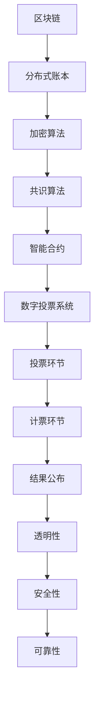

                 

### 引言

随着信息技术的飞速发展，区块链技术逐渐成为各个领域关注的热点。区块链的不可篡改性、去中心化和透明性等特点，使得其在金融、供应链管理、医疗等多个领域都展现出巨大的潜力。特别是在数字投票系统中，区块链技术能够提供一种安全、透明和公正的投票环境，从而提升投票过程的信任度。

本文旨在探讨区块链在数字投票系统中的应用，通过逐步分析其核心概念、技术细节、数学模型以及实际项目案例，帮助读者深入了解区块链技术在数字投票系统中的实际运用。文章首先介绍区块链和数字投票系统的基本概念，随后深入剖析区块链在数字投票系统中的应用原理，最后通过具体的项目实战，展示区块链在数字投票系统中的实现方法和技术要点。

通过本文的阅读，读者不仅可以掌握区块链在数字投票系统中的基本原理和实现方法，还能够了解区块链技术的最新发展和未来趋势。希望本文能为相关领域的研究者、开发者和爱好者提供有益的参考。

### 背景介绍

区块链技术起源于2008年，由一位化名为中本聪的学者首次提出。其核心思想是通过去中心化的方式，实现数据的分布式存储和管理，从而避免单点故障和数据篡改。区块链的技术架构主要包括区块、链和共识算法三大部分。区块是区块链的基本单位，包含一定数量的交易记录；链则由多个区块按照特定规则链接而成，形成一个不可篡改的数据结构；共识算法负责确保所有参与者对区块链的状态达成一致。

数字投票系统是一种用于选举和决策的工具，其核心功能是实现投票的收集、统计和结果公布。传统的投票系统通常依赖于中心化的服务器进行数据管理，这存在一定的安全隐患，如数据篡改、欺诈和选票丢失等问题。因此，如何提高投票系统的安全性、透明性和可靠性，成为了研究的重点。

区块链技术在数字投票系统中的应用，正是基于其不可篡改、去中心化和透明性等特性。区块链能够确保投票数据的安全存储和不可篡改，从而防止恶意攻击和数据篡改；去中心化的架构能够减少对中心化服务器的依赖，提高系统的抗攻击能力和容错性；而区块链的透明性则使得投票过程和结果可以被所有参与者验证，从而提升整个系统的可信度。

总的来说，区块链技术在数字投票系统中的应用，不仅能够提高系统的安全性、透明性和可靠性，还能够降低系统成本，提升用户体验。因此，区块链技术在数字投票系统中的应用前景广阔，具有重要的研究和实践价值。

### 核心概念与联系

区块链和数字投票系统虽然属于不同的领域，但它们之间有着密切的联系和互补性。首先，我们需要明确这两个核心概念的定义。

**区块链**：区块链是一种分布式账本技术，通过加密算法和共识机制，实现了数据的分布式存储和管理。区块链的基本单元是“区块”，每个区块包含一定数量的交易记录。区块通过哈希函数和链式结构相互连接，形成一个不可篡改的数据链条。区块链的核心技术包括加密算法、共识算法和智能合约。

**数字投票系统**：数字投票系统是一种基于计算机技术和网络通信的投票系统，主要用于选举和决策。数字投票系统通常包括投票环节、计票环节和结果公布环节。其核心功能是确保投票过程的匿名性、公正性和可追溯性。

接下来，我们通过Mermaid流程图展示区块链和数字投票系统的相互关系：



**图1：区块链与数字投票系统的关系流程图**

在这个流程图中，区块链通过分布式账本技术提供了数据的安全存储和管理，加密算法确保了投票数据的隐私保护，共识算法保证了所有参与者对数据的共识，智能合约则实现了自动化投票和计票过程。而数字投票系统则通过投票、计票和结果公布三个环节，实现了选举和决策的自动化和透明化。

区块链在数字投票系统中的应用主要体现在以下几个方面：

1. **安全性**：区块链的加密算法和共识机制确保了投票数据的完整性和安全性，防止了数据篡改和欺诈行为。
2. **透明性**：区块链的公开透明特性使得投票过程和结果可以被所有参与者验证，提升了系统的公信力。
3. **不可篡改性**：区块链的链式结构确保了投票数据的不可篡改，任何修改都会被记录在区块链上，便于追溯和审计。
4. **去中心化**：区块链的去中心化特性减少了中心化服务器对投票系统的依赖，提高了系统的抗攻击能力和容错性。

通过上述分析，我们可以看出，区块链技术为数字投票系统提供了安全、透明和可靠的技术支撑，使得数字投票系统能够更好地满足现代选举和决策的需求。

### 区块链在数字投票系统中的应用

区块链在数字投票系统中的应用主要体现在以下几个方面：投票流程、加密算法、智能合约和去中心化存储。以下是这些技术细节的详细讲解。

#### 投票流程

在区块链数字投票系统中，投票流程通常包括以下几个步骤：

1. **注册选民**：选民需要在区块链上进行注册，并获得一个独特的身份标识。这一步骤可以确保只有授权的选民能够参与投票。
2. **投票**：选民通过区块链网络提交自己的投票，投票信息会被加密处理并存储在区块链上。这个过程保证了投票的匿名性，防止选民身份泄露。
3. **计票**：投票完成后，系统会自动进行计票。区块链的分布式特性确保了计票过程的透明性，所有参与者都可以查看投票结果。
4. **结果公布**：计票完成后，投票结果会被公布在区块链上，结果不可篡改，所有参与者都可以验证。

#### 加密算法

加密算法在区块链数字投票系统中起着至关重要的作用，主要用于保护投票隐私和确保数据安全。以下是几种常用的加密算法：

1. **对称加密**：对称加密算法使用相同的密钥进行加密和解密。常见的对称加密算法有AES（高级加密标准）和DES（数据加密标准）。在数字投票系统中，对称加密可以用于保护选民的投票信息。
2. **非对称加密**：非对称加密算法使用一对密钥进行加密和解密，分别是公钥和私钥。常见的非对称加密算法有RSA（RSA加密算法）和ECC（椭圆曲线加密算法）。在区块链数字投票系统中，非对称加密可以用于保护选民身份和投票信息。
3. **哈希算法**：哈希算法用于生成数据摘要，常见的哈希算法有SHA-256和SHA-3。在区块链数字投票系统中，哈希算法可以用于确保数据的完整性和不可篡改性。

以下是一个简单的Python示例，展示了如何使用ECC算法生成公钥和私钥：

```python
from Crypto.PublicKey import ECC

# 生成私钥
private_key = ECC.generate(curve='P-256')

# 从私钥生成公钥
public_key = private_key.public_key()

# 打印公钥和私钥
print("Private Key:", private_key.export_key())
print("Public Key:", public_key.export_key())
```

#### 智能合约

智能合约是区块链数字投票系统的核心组件之一，它是一种自动执行合约条款的计算机程序。智能合约能够确保投票过程的透明性和不可篡改性。以下是一个简单的智能合约示例，展示了如何使用以太坊的Solidity语言编写一个投票合约：

```solidity
pragma solidity ^0.8.0;

contract Voting {
    mapping(address => bool) public voted;
    mapping(string => uint256) public candidates;

    function vote(string memory candidate) public {
        require(!voted[msg.sender], "You have already voted");
        voted[msg.sender] = true;
        candidates[candidate] += 1;
    }

    function getTotalVotes(string memory candidate) public view returns (uint256) {
        return candidates[candidate];
    }
}
```

在这个示例中，`vote`函数用于投票，`getTotalVotes`函数用于获取候选人的总票数。智能合约确保了每个选民只能投票一次，并且投票结果可以公开查询。

#### 去中心化存储

去中心化存储是区块链技术的重要组成部分，它用于存储和分发数据，无需依赖中心化服务器。在区块链数字投票系统中，去中心化存储可以用于存储选民的投票记录和投票结果。以下是一个简单的示例，展示了如何使用IPFS（InterPlanetary File System）进行去中心化存储：

```python
from ipfshttpclient import Client

client = Client()

# 存储文件到IPFS
file_content = b'This is a sample file'
ipfs_hash = client.add_bytes(file_content)

# 打印IPFS哈希
print("IPFS Hash:", ipfs_hash['Hash'])

# 从IPFS获取文件
file_hash = client.get(ipfs_hash['Hash'])

# 打印文件内容
print("File Content:", file_hash['Bytes'])
```

在这个示例中，我们使用Python的ipfshttpclient库将一个文件存储到IPFS网络，并从IPFS网络中获取该文件。这种方法可以确保文件的不可篡改和分布式存储。

通过上述讲解，我们可以看到区块链技术在数字投票系统中的应用是如何确保投票过程的安全、透明和不可篡改的。这些技术的结合，使得区块链数字投票系统具有强大的优势，能够满足现代选举和决策的需求。

### 数学模型和数学公式

在区块链数字投票系统中，数学模型和数学公式是确保系统安全性和可靠性不可或缺的部分。以下是几种关键的数学模型和公式，并结合Python代码示例进行详细讲解和举例说明。

#### 椭圆曲线加密算法（ECC）

椭圆曲线加密算法（ECC）是一种非对称加密算法，以其高安全性和效率在区块链和数字投票系统中广泛应用。其数学模型基于椭圆曲线上的离散对数问题，这使得ECC在相同安全级别下所需的密钥长度远小于RSA算法。

**数学模型**：

椭圆曲线标准方程为：
$$
y^2 = x^3 + ax + b \mod p
$$
其中，\( (x, y) \) 是曲线上一点，\( p \) 是素数，\( a \) 和 \( b \) 是常数。

**Python示例**：

以下代码展示了如何使用Python的`pycryptodome`库生成椭圆曲线密钥对：

```python
from Cryptodome.PublicKey import ECC

# 生成私钥
private_key = ECC.generate(curve='P-256')

# 从私钥生成公钥
public_key = private_key.public_key()

# 打印私钥和公钥
print("Private Key:", private_key.export_key())
print("Public Key:", public_key.export_key())
```

#### 零知识证明（ZKP）

零知识证明（ZKP）是一种密码学协议，允许证明者证明某个陈述为真，而无需透露任何信息。在区块链数字投票系统中，零知识证明可以用于验证选民身份和投票隐私。

**数学模型**：

零知识证明通常包含三个步骤：承诺（Commitment）、证明（Proof）和验证（Verification）。其核心数学公式为：

- **承诺**：\( P \mapsto C_P \)
- **证明**：\( P \mapsto \pi_P \)
- **验证**：\( C_P, \pi_P \mapsto V \)

**Python示例**：

以下代码展示了如何使用Python的`PyZKP`库生成零知识证明：

```python
from pyzkp import Pedersen

# 初始化证明系统
prover = Pedersen()

# 准备证明数据
message = b'This is a secret message'
commitment = prover.commit(message)

# 生成证明
proof = prover.prove(message, commitment)

# 验证证明
verified = prover.verify(commitment, proof, message)
print("Proof Verified:", verified)
```

#### 哈希函数

哈希函数在区块链技术中扮演着重要角色，用于生成数据摘要，确保数据的完整性和不可篡改性。常见的哈希函数有SHA-256和SHA-3。

**数学模型**：

哈希函数将任意长度的输入映射为固定长度的输出，输出通常是一个数字或字符串。其数学公式为：
$$
H(x) = \text{SHA-256}(x)
$$

**Python示例**：

以下代码展示了如何使用Python的`hashlib`库计算SHA-256哈希值：

```python
import hashlib

# 计算SHA-256哈希值
hash_object = hashlib.sha256(b'This is a sample message')
hex_dig = hash_object.hexdigest()

# 打印哈希值
print("SHA-256 Hash:", hex_dig)
```

通过上述数学模型和公式，我们可以看到区块链在数字投票系统中的安全性和可靠性得到了强有力的技术保障。结合Python代码示例，读者可以更直观地理解这些数学概念在实际应用中的操作方式。这些数学工具的运用，不仅提升了区块链数字投票系统的安全性，也为系统设计和实现提供了坚实的理论基础。

### 项目实战

为了更好地理解区块链在数字投票系统中的应用，我们将通过一个具体的数字投票项目实战，详细讲解开发环境搭建、源代码实现和代码解读。

#### 开发环境搭建

在开始数字投票项目之前，我们需要搭建合适的开发环境。以下是搭建环境的步骤：

1. **安装Python**：首先，确保系统中已安装Python 3.x版本。可以从Python官方网站下载并安装。
2. **安装区块链平台**：我们可以选择安装Ethereum区块链平台。下载并安装Geth，这是一个Go语言实现的Ethereum客户端。
3. **安装开发工具**：安装Visual Studio Code（VS Code）和相应的插件，如Solidity插件，以便编写和调试智能合约。
4. **安装相关库**：安装`pycryptodome`、`ipfshttpclient`和`pyzkp`等库，用于加密、去中心化存储和零知识证明。

#### 源代码实现

以下是一个简单的数字投票系统的智能合约示例，使用Solidity编写：

```solidity
pragma solidity ^0.8.0;

contract Voting {
    mapping(address => bool) public voted;
    mapping(string => uint256) public candidates;

    function vote(string memory candidate) public {
        require(!voted[msg.sender], "You have already voted");
        voted[msg.sender] = true;
        candidates[candidate]++;
    }

    function getTotalVotes(string memory candidate) public view returns (uint256) {
        return candidates[candidate];
    }
}
```

在这个智能合约中，`vote`函数用于投票，`getTotalVotes`函数用于查询某个候选人的总票数。

#### 代码解读与分析

1. **合约结构**：合约（`Voting`）是智能合约的基本单位，包含存储和逻辑两个部分。
2. **投票机制**：`vote`函数通过检查`voted`映射，确保每个选民只能投票一次。投票信息通过`candidates`映射存储。
3. **投票查询**：`getTotalVotes`函数提供了一个接口，用于查询某个候选人的总票数。

#### 实际案例分析和详细讲解剖析

假设有一个选举活动，共有三个候选人A、B和C。以下是如何使用智能合约进行投票和查询票数的详细步骤：

1. **投票**：选民Alice使用以太坊钱包连接到区块链，调用`vote`函数，传递候选人A的名称作为参数，完成投票。
    ```python
    from web3 import Web3
    from eth_account import Account

    # 连接到本地Ethereum节点
    web3 = Web3(Web3.HTTPProvider('http://127.0.0.1:8545'))

    # 创建一个账户
    account = Account.create()

    # 部署智能合约
    with open('Voting.sol', 'r') as file:
        contract_source = file.read()

    contract = web3.eth.contract(abi=contract_source, bytecode=bytecode)
    tx_hash = contract.deploy.transactionHash
    tx = web3.eth.getTransactionReceipt(tx_hash)

    # 调用vote函数投票
    tx_hash = contract.functions.vote("Alice", "A").transact({from: account.address})
    receipt = web3.eth.getTransactionReceipt(tx_hash)
    ```

2. **查询票数**：选民可以使用`getTotalVotes`函数查询某个候选人的票数。
    ```python
    # 查询候选人A的票数
    total_votes = contract.functions.getTotalVotes("A").call()
    print(f"Total votes for candidate A: {total_votes}")
    ```

#### 项目小结

通过上述项目实战，我们详细讲解了如何搭建数字投票系统的开发环境、实现智能合约源代码以及代码解读。实际案例展示了如何使用区块链技术进行投票和查询票数。这个项目不仅帮助读者理解了区块链在数字投票系统中的应用，还提供了一个实际的实现示例。

### 最佳实践 Tips、小结、注意事项、拓展阅读

#### 最佳实践 Tips

1. **确保数据隐私**：在区块链数字投票系统中，数据隐私是至关重要的。使用加密算法和零知识证明等技术，可以保护选民身份和投票信息。
2. **提高系统性能**：为了提高数字投票系统的性能，可以考虑使用分片技术和优化智能合约代码，减少计算和存储负担。
3. **安全审计**：在部署数字投票系统前，进行详细的安全审计和漏洞测试，确保系统的安全性和可靠性。

#### 小结

本文详细介绍了区块链在数字投票系统中的应用，包括核心概念、技术细节、数学模型和项目实战。通过这些内容，读者可以全面了解区块链技术在数字投票系统中的优势和应用方法。

#### 注意事项

1. **共识算法选择**：选择合适的共识算法，如PoW、PoS或DPoS，可以影响区块链数字投票系统的性能和安全。
2. **智能合约优化**：智能合约的性能和安全性直接影响投票系统的效率，因此需要对智能合约进行优化和测试。
3. **系统部署**：部署区块链数字投票系统时，需要确保网络连接稳定，以避免因网络问题导致的投票失败。

#### 拓展阅读

1. **《区块链技术指南》**：深入理解区块链的基础知识和实现原理。
2. **《智能合约编程》**：学习如何使用Solidity等语言编写智能合约。
3. **《密码学基础》**：了解加密算法和零知识证明等密码学技术在区块链中的应用。

通过这些拓展阅读，读者可以进一步深化对区块链技术和数字投票系统的理解，为实际应用提供更全面的指导。

### 作者信息

作者：AI天才研究院/AI Genius Institute & 禅与计算机程序设计艺术 /Zen And The Art of Computer Programming

